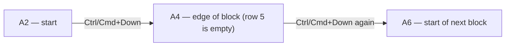

# Lecture 2 — Moving Fast: Navigation & Selection Shortcuts

> **Duration:** ~2 hours. **Outcome:** You can move the active cell, jump to the edges of data, select ranges (adjacent and non-adjacent), freeze headers, and manage multiple sheets — all without touching the mouse.

Every minute you spend reaching for the mouse to click a cell that's three keystrokes away is a minute you don't get back — and over a 12-week course with hundreds of exercises, it adds up to hours. This lecture is pure muscle memory. Read it once, then do [Exercise 2](exercise-02-shortcut-scavenger-hunt.md) until every shortcut below is automatic.

Shortcuts below are given as **Windows/ChromeOS — macOS**. Where a shortcut is identical, one line is shown.

## 1. Basic movement

| Action | Windows | macOS |
|---|---|---|
| Move one cell | Arrow keys | Arrow keys |
| Move to next cell (right) | `Tab` | `Tab` |
| Move to previous cell (left) | `Shift+Tab` | `Shift+Tab` |
| Confirm entry, move down | `Enter` | `Return` |
| Confirm entry, move up | `Shift+Enter` | `Shift+Return` |
| Jump to cell `A1` | `Ctrl+Home` | `Cmd+Home` (or `Fn+Ctrl+Left` on laptop) |
| Jump to last used cell | `Ctrl+End` | `Cmd+End` |

`Ctrl/Cmd+Home` and `Ctrl/Cmd+End` are your two most-used "where am I / where does the data end" shortcuts. `Ctrl/Cmd+End` jumps to the bottom-right corner of the **used range** — the intersection of the last row and last column that have ever held data, even if you later deleted the content (formatting alone can extend it — a good reason to keep unused rows/columns actually empty).

## 2. Jump-to-edge: the `Ctrl`/`Cmd`+Arrow move

This is the single highest-leverage shortcut in this lecture. `Ctrl+Arrow` (Windows) / `Cmd+Arrow` (Mac) moves the active cell to the **edge of the current block of data** in that direction — the last cell before an empty one, or the first cell with data if you're currently in an empty stretch.

```
   A          B
1  Name       Score
2  Ada        94
3  Grace      88
4  Alan       91
5                        ← empty row
6  Linus      85
```

From `A2`, pressing `Ctrl/Cmd+Down` lands you on `A4` (the last row of the contiguous block) — **not** `A6`, because the empty row at 5 breaks the block. Press `Ctrl/Cmd+Down` *again* from `A4` and you jump over the gap to `A6` (the next block's start). This "jump to edge, jump again to next block" behavior is exactly how you'll traverse large real-world datasets in later weeks — it's faster than scrolling and it's *precise*, landing exactly on the last real row, which matters once you start writing formulas that reference "the whole column of data."


*Each press jumps to the next edge: end of this block, then start of the next.*

All four directions work the same way: `Ctrl/Cmd+Up`, `Down`, `Left`, `Right`.

## 3. Selecting ranges

| Action | Windows | macOS |
|---|---|---|
| Extend selection one cell | `Shift+Arrow` | `Shift+Arrow` |
| Extend selection to edge of data | `Ctrl+Shift+Arrow` | `Cmd+Shift+Arrow` |
| Select entire row | `Shift+Space` | `Shift+Space` |
| Select entire column | `Ctrl+Space` | `Ctrl+Space` |
| Select entire sheet | `Ctrl+A` | `Cmd+A` |
| Select to `A1` from current cell | `Ctrl+Shift+Home` | `Cmd+Shift+Home` |
| Select to last cell from current | `Ctrl+Shift+End` | `Cmd+Shift+End` |

**`Ctrl/Cmd+Shift+Arrow`** combines the last two ideas — it *extends the selection* to the same edge that plain `Ctrl/Cmd+Arrow` would have *moved to*. In the example table above, standing on `A2` and pressing `Ctrl/Cmd+Shift+Down` selects `A2:A4` (the whole contiguous block) in one keystroke. This is how you select "the rest of this column of data" without knowing or counting how many rows it has — critical once your sheets have thousands of rows.

**Selecting an entire table fast:** click (or navigate to) any cell inside a contiguous data block, then press `Ctrl/Cmd+Shift+Down` then `Ctrl/Cmd+Shift+Right` (or the reverse order) to grow the selection to the full rectangle. Even faster, once your data is inside a **Table** (Week 6), clicking any cell and pressing `Ctrl/Cmd+A` selects just the table.

### Non-adjacent (disjoint) selection

Hold `Ctrl` (Windows/ChromeOS) or `Cmd` (Mac) while clicking or click-dragging to add **additional, non-touching** ranges to a selection. Example: select `A1:A10`, then hold `Ctrl/Cmd` and drag over `C1:C10` — now both columns are selected simultaneously, and any formatting you apply (bold, currency, borders) hits both at once. This is the correct move whenever you want to format or read several unrelated ranges without doing it twice.

### Selecting from the Name Box (typed selection)

You can also just **type a range into the Name Box** and press Enter — `A1:D20` selects exactly that rectangle instantly, no dragging or arrow-keying required. This is the fastest way to jump to a large, known range, and it works identically in Excel and Google Sheets.

## 4. Freeze panes — keeping headers visible

When a sheet has more rows than fit on screen, scrolling down loses your header row, and you lose track of which column means what. **Freeze panes** locks specified rows and/or columns in place so they stay visible while the rest scrolls.

**Excel:** select the cell just below and right of what you want frozen (to freeze row 1 and column A, click `B2`), then **View → Freeze Panes → Freeze Panes**. To freeze only the top row, **View → Freeze Panes → Freeze Top Row** (a one-click shortcut for the common case).

**Google Sheets:** **View → Freeze**, then choose "1 row," "2 rows," "1 column," or "Up to current row/column" (based on where the active cell is) — or drag the small gray thick bar that appears just below the column headers / right of row numbers.

Freezing is purely visual — it doesn't change any data or formula, only what stays put while scrolling. You'll freeze the header row on almost every real sheet you build from here on; it's step one of the mini-project this week.

## 5. Managing multiple sheets

A workbook usually holds more than one sheet — raw data on one, a summary or dashboard on another, notes on a third. You need to move between and organize sheet tabs as fluently as you move between cells.

| Action | How |
|---|---|
| Switch to next/previous sheet | `Ctrl+PageDown` / `Ctrl+PageUp` (Windows); `Fn+Ctrl+Down/Up` — or `Option+Right/Left` (Mac, both apps) |
| Rename a sheet | Double-click the tab, type new name, `Enter` |
| Add a new sheet | Click the `+` next to the last tab |
| Delete a sheet | Right-click tab → **Delete** |
| Reorder sheets | Click and drag a tab left/right |
| Color a sheet tab | Right-click tab → **Tab Color** (Excel) / right-click → **Change color** (Sheets) |
| Hide a sheet | Right-click tab → **Hide** (unhide from the same right-click menu, or **Format → Hide/show sheets** in Sheets) |
| Duplicate a sheet | Right-click tab → **Move or Copy** (check "Create a copy") in Excel; right-click → **Duplicate** in Sheets |

**Naming discipline:** rename every sheet the moment you create it — `Raw Data`, `Summary`, `Dashboard`, not `Sheet1`, `Sheet2`, `Sheet3`. Sheet names also become part of formula references (`Budget!B2`), so a clear name pays off the instant you start cross-referencing sheets in Exercise 3 this week and constantly from Week 2 onward.

**A practical multi-sheet layout convention** you'll reuse all course long: put raw/source data on its own sheet (never mix raw data and formulas/summaries on the same sheet), and build calculations and dashboards on separate sheets that reference it. This separation — sometimes called "one source of truth" — is what keeps a workbook maintainable as it grows; you'll build exactly this shape in this week's mini-project.


*Raw data stays untouched on its own sheet; calculations and dashboards reference it instead of duplicating it.*

## 6. Column width and row height

Two more sizing shortcuts worth having automatic:

- **Auto-fit a column to its content:** double-click the border between two column letters (right edge of the column you want sized).
- **Set an exact width/height:** right-click a column letter or row number → **Column Width** / **Row Height** (Excel) or **Resize column** / **Resize row** (Sheets), then type an exact value.
- **Resize multiple columns/rows at once:** select several column letters (or row numbers) first, then drag any one border — all selected columns/rows resize together.
- **Excel-only quick auto-fit:** select the columns, then **Home → Format → AutoFit Column Width**.

A `#####` display in a cell (Excel) means the column is too narrow to show a formatted number — it is **not** an error in the value, only a display problem. Widen the column (or auto-fit it) and the real value reappears. This trips up almost every beginner exactly once; now it won't trip you up at all.

## 7. Check yourself

- From a cell inside a block of data, what does `Ctrl/Cmd+Down` do, and how is it different from plain `Down Arrow`?
- What's the fastest way to select "the rest of this column of data" without knowing how many rows it has?
- How do you select two separate, non-touching ranges at the same time?
- What does freezing panes actually change — the data, or only the display?
- Why should raw data live on a different sheet from your summaries and calculations?
- What does a `#####` in a cell actually mean, and how do you fix it?
- Name the keyboard shortcut for switching to the next sheet tab on your platform.

If those are automatic, Lecture 3 turns to making a formatted sheet actually legible — number formats, borders, and your first conditional formatting rule.

## Further reading

- **Microsoft — Keyboard shortcuts in Excel:** <https://support.microsoft.com/en-us/office/keyboard-shortcuts-in-excel-1798d9d5-842a-42b8-9c99-9b7213f0040f>
- **Google — Keyboard shortcuts for Google Sheets:** <https://support.google.com/docs/answer/181110>
- **Microsoft — Freeze panes to lock rows and columns:** <https://support.microsoft.com/en-us/office/freeze-panes-to-lock-rows-and-columns-dab2ffc9-020d-4026-8121-67dd25f2508f>
- **Google — Freeze or merge rows and columns:** <https://support.google.com/docs/answer/9060449>
