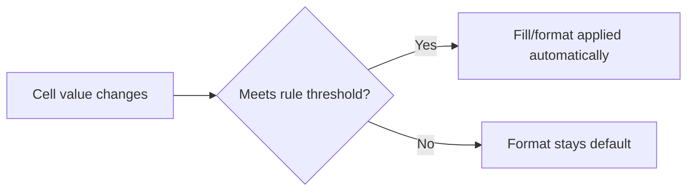
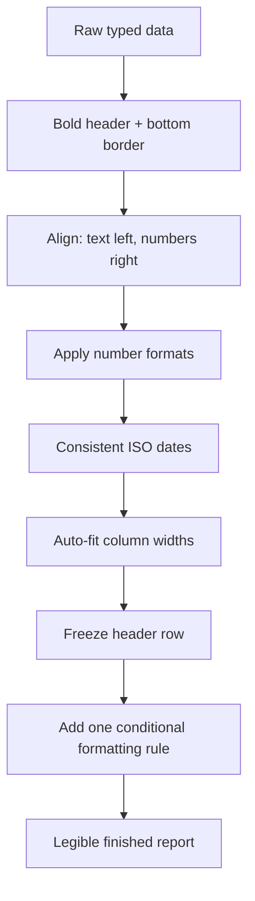

# Lecture 3 — Formatting That Reads

> **Duration:** ~2 hours. **Outcome:** You can apply number, date, and currency formats correctly, align and border a data block for clarity, save reusable cell styles, and write your first conditional formatting rule — making any sheet legible before a single formula exists.

A spreadsheet with correct data but ugly formatting fails at its actual job: communicating an answer. This lecture is about the visual layer — the layer a reader sees in the first half-second before they read a single number. Get it right and people trust the sheet; get it wrong and they squint, misread, or stop trusting it entirely (even when the numbers are correct).

## 1. Number formats — controlling display without touching the value

Recall from Lecture 1: **formatting never changes the stored value, only the display.** This section is entirely about that display layer.

### Applying a format

**Excel:** select the cell(s), then either use the **Number Format** dropdown on the Home tab (shows "General" by default), the quick-format icons next to it (`$`, `%`, `,`), or open the full dialog with `Ctrl+1` (the single most useful formatting shortcut in Excel) → **Number** tab.

**Google Sheets:** select the cell(s), then **Format → Number**, or use the toolbar icons (`$`, `%`, `123`), or `Ctrl+Shift+1` for a quick default number format.

### The built-in formats you'll use constantly

| Format | Example input | Example display | Notes |
|---|---|---|---|
| General | `1234.5` | `1234.5` | No formatting applied; the default |
| Number | `1234.5` | `1,234.50` | Thousands separator + fixed decimals |
| Currency | `1234.5` | `$1,234.50` | Symbol locked to left, aligns decimal points in a column |
| Accounting | `1234.5` | `$   1,234.50` | Symbol flush-left, number flush-right — negatives in parentheses |
| Percentage | `0.5` | `50.00%` | Multiplies stored value by 100 |
| Date | `1/15/2026` | `1/15/2026` or `Jan 15, 2026` etc. | Many sub-formats; see below |
| Text | `007` | `007` | Stops numeric auto-conversion entirely |

**Currency vs. Accounting** is a subtlety worth knowing: Currency puts the `$` immediately before the digits (`$1,234.50`); Accounting pads so the `$` sits at the far left of the cell and the digits are right-aligned, which makes a *column* of dollar amounts line up cleanly on the decimal point regardless of how many digits each number has — the format finance teams default to for exactly that reason.

### Custom number formats

Beyond the built-ins, both apps accept a **format code** you write yourself (`Ctrl+1` → Number → Custom in Excel; **Format → Number → Custom number format** in Sheets). A format code has up to four sections separated by semicolons: `positive;negative;zero;text`.

```
0.00              → 2 decimal places, no thousands separator: 1234.5 → 1234.50
#,##0             → thousands separator, no decimals: 1234.5 → 1,235 (rounds display only)
#,##0.00          → thousands separator + 2 decimals: 1234.5 → 1,234.50
$#,##0.00         → currency, explicit: 1234.5 → $1,234.50
0%                → percentage, no decimals: 0.5 → 50%
[Red](#,##0.00)   → negatives in red with parentheses: -1234.5 → (1,234.50) in red
```

`0` means "always show a digit here, even if it's a zero." `#` means "show a digit here only if there is one" (no padding zero). That's the whole system — you'll write custom formats occasionally for the rest of the course whenever a built-in doesn't say exactly what you mean.

### Date formats

Dates have their own large family of sub-formats — `1/15/2026`, `15-Jan-26`, `2026-01-15` (ISO — sorts correctly as text, widely preferred for data interchange), `January 15, 2026`. Pick **`YYYY-MM-DD`** (ISO 8601) whenever a sheet might be shared internationally or sorted as text somewhere downstream — it's the one date format that's unambiguous everywhere (`03/04/2026` is March 4th in the US and April 3rd almost everywhere else; `2026-03-04` is never ambiguous).

## 2. Alignment

Default alignment is a genuinely useful signal, not just decoration: **text is left-aligned, numbers and dates are right-aligned, booleans are centered** — by default, before you touch anything. A column of numbers that's suddenly left-aligned is a strong hint that they were imported as text (a very common data-cleaning problem you'll deal with directly in Week 5).

Manual alignment controls (Home tab in Excel; toolbar in Sheets): horizontal (left/center/right), vertical (top/middle/bottom), and **wrap text** (so long content breaks onto multiple lines within the cell instead of overflowing or getting cut off) — `Alt+H+W` in Excel, or the wrap icon in Sheets' toolbar.

**Merge cells** — tempting for headers, but avoid it in any range you'll ever sort, filter, or reference in a formula. A merged cell breaks row-by-row logic (sorting a merged range produces broken results) and is one of the most common causes of "why won't this sort correctly" support questions. For a header that spans several columns, prefer **Center Across Selection** (Excel: `Ctrl+1` → Alignment → Horizontal → "Center Across Selection") — it *looks* merged but leaves the underlying cells independent.

## 3. Borders and fill

Borders and background fill (shading) are what turn a grid of numbers into a **table a human can parse at a glance** — separating headers from data, marking totals, grouping sections.

**Excel:** Home tab → Borders dropdown (bottom border, all borders, thick outside border, etc.) and the Fill Color bucket icon next to it. `Ctrl+1` → Border/Fill tabs for full control (line style, color, which specific edges).

**Google Sheets:** toolbar has a Borders icon (grid of border options) and a Fill Color icon (paint bucket) right next to it.

A simple, effective convention you'll use in this week's mini-project and for the rest of the course:

- **Bold + bottom border** under header rows.
- **Thin borders** or subtle **alternating row shading** (banding) inside a data body, to help the eye track across a wide row.
- **Top border (double or thick)** above a totals/subtotal row, to visually separate "the data" from "the answer."
- Avoid heavy borders on every single cell — it reads as noisy. Reserve heavy/thick lines for the boundaries that actually matter (outer edge of a table, above a total).

## 4. Cell styles — reusable formatting

Applying the same five formatting choices (font, size, bold, fill, border) to every header cell by hand, one at a time, doesn't scale and invites inconsistency. Both apps let you save and reapply a named combination.

**Excel — Cell Styles:** Home tab → **Cell Styles** gallery has built-ins (`Heading 1`, `Total`, `Good`/`Bad`/`Neutral`, `Input`, `Currency`) — click one to apply instantly, or right-click the gallery → **New Cell Style** to save your own combination for reuse across the workbook.

**Google Sheets** has no direct equivalent gallery, but the **Paint Format** (format painter) tool — the little paintbrush icon on the toolbar, `Ctrl+Alt+C` to copy format / paste with `Ctrl+Alt+V`, or just click the brush then click the target — copies *only* the formatting (not the value) from one cell to another or across a range. Use it to replicate a header's look across every header cell in one motion, in either app (Excel has the same Format Painter icon and behavior).

## 5. Conditional formatting — your first rule

**Conditional formatting** applies formatting automatically, based on a cell's value, instead of you setting it by hand. This is where a sheet starts to actively communicate instead of just displaying — a red fill on overdue items, a green fill on values above target, without you touching a single cell manually after setup.

**Excel:** select the range → Home tab → **Conditional Formatting** → pick a rule type:
- **Highlight Cells Rules** (Greater Than, Less Than, Between, Equal To, Text that Contains, Duplicate Values…) — the simplest, most common starting point.
- **Color Scales** — a gradient (e.g., red→yellow→green) applied across a numeric range, useful for spotting highs/lows in a big block at a glance.
- **Data Bars** — an in-cell horizontal bar proportional to the value, like a tiny embedded chart.
- **Icon Sets** — small icons (arrows, traffic lights) based on value thresholds.

**Google Sheets:** select the range → **Format → Conditional formatting** → opens a side panel with **Single color** rules (equivalent to Highlight Cells Rules) and a **Color scale** tab (equivalent to Color Scales). Data bars and icon sets aren't built in natively in Sheets the same way, though color scales cover most of the same use case.

A concrete first rule, worth setting up right now on any numeric column: select the range, choose "Greater Than," type a threshold, pick a fill color (e.g., light green for "above target"). The formatting updates **live** — change the underlying number and the highlight recalculates instantly, with zero formula written. This is the entire point: the sheet does the flagging, so a reader's eye goes straight to what matters.


*Conditional formatting re-evaluates live on every change — no formula, no manual click.*

**A word of restraint:** conditional formatting is powerful and easy to overuse. A sheet where every column has three overlapping color rules is *harder* to read than one with none — the signal drowns. Use it for the two or three things that genuinely need a reader's attention, not everything.

## 6. Putting it together: a legible sheet, before any formula

By the end of this lecture you should be able to take a raw block of typed data and, in under two minutes, make it read like a finished report:

1. Bold the header row; add a bottom border.
2. Right-align numbers, left-align text (usually already the default — verify it).
3. Apply the correct number format to every numeric column (currency, percentage, or plain number — never leave financial data as "General").
4. Use ISO dates (`YYYY-MM-DD`) or another unambiguous date format consistently down a date column.
5. Auto-fit column widths so nothing shows `#####` or gets truncated.
6. Freeze the header row (Lecture 2) so it's visible while scrolling.
7. Add one conditional formatting rule that highlights the single most important thing in the sheet.


*Seven formatting moves, done in order, turn raw data into a report a reader trusts at a glance.*

That sequence — done from muscle memory — is exactly what [Exercise 1](exercise-01-enter-and-format-data.md), [Challenge 1](challenge-01-reformat-ugly-report.md), and this week's mini-project ask you to execute.

## 7. Check yourself

- What's the difference between the Currency and Accounting number formats?
- In a custom format code, what's the difference between `0` and `#`?
- Why is `2026-03-04` a safer date format to share internationally than `03/04/2026`?
- Why should you avoid merging cells in any range you might sort or reference in a formula? What's the safer alternative for a spanning header?
- Name one built-in conditional formatting rule type available in both Excel and Google Sheets.
- Does conditional formatting change a cell's stored value? Why or why not?
- What tool copies only formatting (not the underlying value) from one cell to another?

That's Week 1's conceptual core. From here: [Exercise 1](exercise-01-enter-and-format-data.md) puts all three lectures into one real data block, then the challenges and mini-project push you to apply it under real (and ugly) conditions.

## Further reading

- **Microsoft — Number format codes:** <https://support.microsoft.com/en-us/office/number-format-codes-5026bbd6-04bc-48cd-bf33-80f18b4eae68>
- **Microsoft — Create a custom number format:** <https://support.microsoft.com/en-us/office/create-or-delete-a-custom-number-format-78f2a361-936b-4c03-8772-09fa1d5ce695>
- **Google — Format numbers in a spreadsheet:** <https://support.google.com/docs/answer/56470>
- **Microsoft — Use conditional formatting to highlight information:** <https://support.microsoft.com/en-us/office/use-conditional-formatting-to-highlight-information-fed60dfa-1d3f-4e13-9ecb-f1951ff89d7f>
- **Google — Use conditional formatting rules in Google Sheets:** <https://support.google.com/docs/answer/78413>
