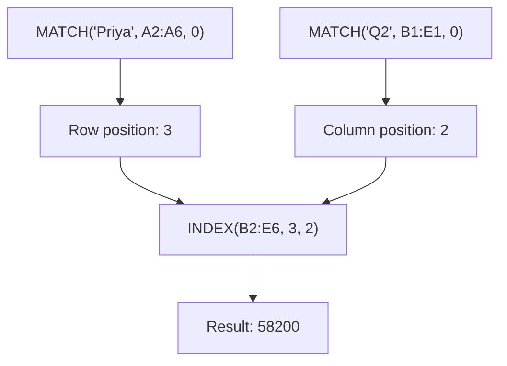
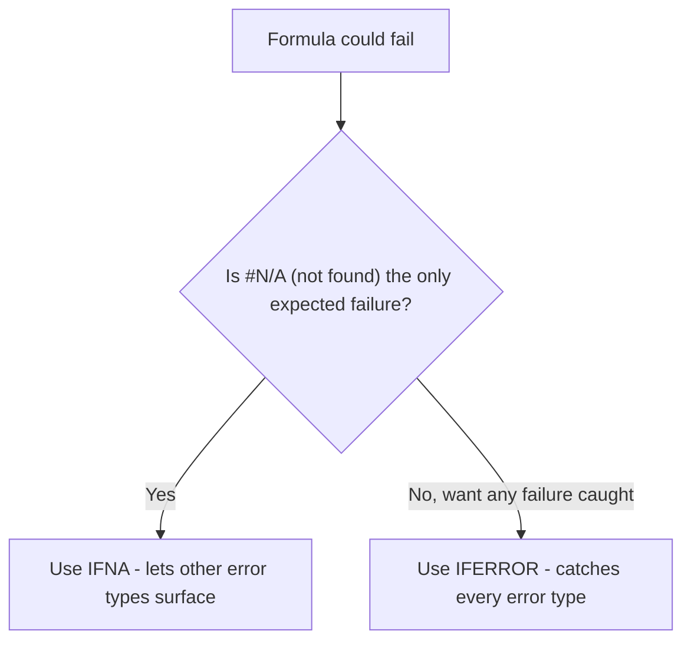

# Lecture 3 — INDEX/MATCH & Graceful Errors

> **Duration:** ~2 hours. **Outcome:** You can combine `INDEX` and `MATCH` into a two-function lookup that works in any direction, build a two-way lookup off a row label and a column label, and wrap any lookup formula in `IFERROR`/`IFNA` so a missing match never leaks a raw error into a report.

## 1. Why learn a second lookup approach at all

`XLOOKUP` (Lecture 2) is the right default for a straightforward single-column lookup on a modern version of Excel or Sheets. `INDEX`/`MATCH` earns its place for three real reasons you'll hit this lecture: it works on **every** version of Excel ever shipped (no 365/2021 requirement), it's the natural tool for a **two-way** lookup (row label *and* column label), and understanding it makes you fluent in exactly what `XLOOKUP` is doing under the hood — `XLOOKUP` is, roughly, `INDEX`/`MATCH` with friendlier defaults built in.

Build the `SalesMatrix` sheet — a rep-by-quarter sales grid:

```
      A          B         C         D         E
1   Rep        Q1        Q2        Q3        Q4
2   Amara      41200     38900     52100     47700
3   Devon      29800     31200     33500     30100
4   Priya      55600     58200     61000     59400
5   Malik      22100     24800     26300     25900
6   Sofia      37400     39100     41200     40800
```

## 2. `INDEX` — "give me the value at this position"

```
=INDEX(array, row_num, [column_num])
```

`INDEX` is the simpler of the two functions: point it at a range, give it a row number and (for a 2-D range) a column number, and it returns whatever's sitting at that position — nothing clever, pure coordinates:

```
=INDEX(B2:E6, 3, 2)
```

Row 3, column 2 of `B2:E6` is Priya's `Q2` value, `58200`. Try it — `INDEX` alone is just an address lookup; the position numbers are hard-coded, which isn't useful yet. The power comes from replacing those hard-coded numbers with `MATCH`.

## 3. `MATCH` — "what position is this value at"

```
=MATCH(lookup_value, lookup_array, [match_type])
```

`MATCH` searches a **single row or column** and returns the **position number** where it found the value — not the value itself:

```
=MATCH("Priya", A2:A6, 0)
```

Returns `3` — Priya is the 3rd item in `A2:A6`. The third argument, `match_type`, works like `XLOOKUP`'s `match_mode`: `0` for exact match (what you want almost always), `1` for "largest value ≤ lookup, list sorted ascending," `-1` for "smallest value ≥ lookup, list sorted descending." Use `0` unless you specifically need a sorted-tier lookup, and always pass it explicitly — like `VLOOKUP`'s `range_lookup`, omitting it defaults to approximate matching, which is rarely what you meant.

```
=MATCH("Q3", B1:E1, 0)
```

Returns `3` — `Q3` is the 3rd column header. Two separate `MATCH` calls, one for the row position, one for the column position — that's the whole idea of the next section.

## 4. Combining them — `INDEX` with `MATCH` as its coordinates

Instead of hard-coding `3, 2` into `INDEX`, feed it two `MATCH` calls that compute the row and column positions from names you actually have:

```
=INDEX(B2:E6, MATCH("Priya", A2:A6, 0), MATCH("Q2", B1:E1, 0))
```

`MATCH("Priya", A2:A6, 0)` resolves to `3`. `MATCH("Q2", B1:E1, 0)` resolves to `2`. `INDEX(B2:E6, 3, 2)` returns `58200` — same answer as Section 2, but now driven by names instead of hard-coded positions, so it keeps working if rows get sorted or a new rep is inserted.


*Two MATCH calls supply the row and column coordinates that INDEX reads from.*

Build this as a small lookup panel below the matrix:

```
       A                B
8    Rep to find      Priya
9    Quarter           Q2
10   Result           =INDEX(B2:E6, MATCH(B8, A2:A6, 0), MATCH(B9, B1:E1, 0))
```

Change `B8` to `Malik` and `B9` to `Q4` — `B10` recalculates to `25900` instantly. **This is a genuine two-way lookup — a row label and a column label together pinpoint one cell** — and it's something plain `XLOOKUP` cannot do in a single call the way `INDEX`/`MATCH` does here (you'd need `XLOOKUP` nested inside `XLOOKUP`, using one to find the right column then the other for the row — workable, but `INDEX`/`MATCH` with two `MATCH`es is the standard, more readable pattern for this exact job).

## 5. The classic left-lookup case

This is the scenario that made `INDEX`/`MATCH` the standard answer before `XLOOKUP` existed, and it's worth building once so the "can't look left" limitation from Lecture 2 becomes concrete instead of abstract. Add a small employee table where the column you'll search is to the **right** of the column you want returned:

```
       A              B             C
1    FullName       Department    EmployeeID
2    Grace Chen     Engineering    E-4471
3    Sam Okafor     Sales          E-4472
4    Devi Rao       Engineering    E-4473
5    Marcus Lee     Finance        E-4474
```

You have an `EmployeeID` (say, from a badge scan) and need the `FullName` — but `FullName` sits in column A, to the **left** of `EmployeeID` in column C. `VLOOKUP` cannot do this at all — it only searches its *first* column and returns from columns to the right of it. `INDEX`/`MATCH` doesn't care about direction, because `MATCH` searches column C independently of where `INDEX` reads from:

```
=INDEX(A2:A5, MATCH("E-4473", C2:C5, 0))
```

`MATCH("E-4473", C2:C5, 0)` finds position `3`. `INDEX(A2:A5, 3)` returns `Devi Rao` — a lookup running in the "wrong" direction, made trivial. (Note `INDEX` here takes only two arguments — no `column_num` — because `A2:A5` is a single column; `INDEX` on a 1-D range just needs the one position.) `XLOOKUP` also solves this cleanly (it was one of its design goals), so in practice you'd reach for whichever is available — but recognize this pattern; it's the textbook reason `INDEX`/`MATCH` earned its reputation.

## 6. `IFERROR` — catching any error, generically

`IFERROR` wraps a formula and substitutes a fallback value if the formula produces **any** error — `#N/A`, `#REF!`, `#DIV/0!`, `#VALUE!`, all of them:

```
=IFERROR(formula, value_if_error)
```

Wrap the lookup panel formula:

```
=IFERROR(INDEX(B2:E6, MATCH(B8, A2:A6, 0), MATCH(B9, B1:E1, 0)), "Check rep/quarter spelling")
```

Type a rep name that doesn't exist (`Jordan`) into `B8` — instead of `#N/A`, you get the friendly message. This is the general-purpose safety net you should wrap around **any** formula whose failure mode you can't fully control — which, once user input or another sheet's data is involved, is nearly every lookup formula that will ever ship to someone else.

## 7. `IFNA` — catching only the "not found" error

`IFERROR` is convenient but it's also a little too forgiving: it swallows **every** error type, including ones that mean you made a real mistake — a typo'd range reference producing `#REF!`, or feeding text into a math operation producing `#VALUE!`. Silently replacing those with a friendly string hides a bug instead of fixing it. `IFNA` catches only `#N/A` — specifically the "lookup found nothing" error — and lets every other error type surface normally so you actually see it:

```
=IFNA(INDEX(B2:E6, MATCH(B8, A2:A6, 0), MATCH(B9, B1:E1, 0)), "Rep or quarter not found")
```

**The rule of thumb: use `IFNA` around lookup functions specifically** (where "not found" is an expected, normal outcome you want to handle gracefully), and reach for the broader `IFERROR` only when you genuinely want to catch every possible failure mode the same way — for instance, a formula doing several chained operations where you just want *some* safe default no matter what goes wrong, and you've already tested it enough to trust that a real bug won't hide behind the catch-all.


*Choosing IFNA versus IFERROR based on which errors you actually want to hide.*

## 8. Nesting IFERROR/IFNA around XLOOKUP too

Everything in Sections 6–7 applies just as well to `XLOOKUP` from Lecture 2 — you already saw `XLOOKUP`'s own built-in `if_not_found` argument, which is usually enough on its own and is the more direct fix for a plain "not found." Reach for a wrapping `IFERROR`/`IFNA` instead of (or in addition to) `if_not_found` when a formula chains a lookup into further math that could *also* fail — e.g., `=IFERROR(XLOOKUP(...) / OtherLookup, "Can't compute")` — where the division, not just the lookup, is a second place something could go wrong.

## 9. Check yourself

- What does `INDEX(range, 3, 2)` return, described in plain words — not the formula, the *concept*?
- What does `MATCH` return — a value, or a position? Why does that distinction matter for how `INDEX` uses it?
- Walk through, step by step, why `INDEX`/`MATCH` can look up `FullName` from `EmployeeID` when `EmployeeID` sits to the *right* of `FullName`, and why `VLOOKUP` cannot.
- What's the practical difference between wrapping a lookup in `IFERROR` versus `IFNA`, and when would that difference actually matter (give a concrete failing example)?
- Build a two-way lookup formula for "total sales for Sofia in Q3" using `SalesMatrix` — write the full `INDEX`/`MATCH` formula.

If those came quickly, take the [quiz](20-数据与工具/20-1%20Excel/20-1-0%20Excel专业课程（English）/curriculum/week-03-logical-and-lookup-functions/quiz.md), then start the [exercises](20-数据与工具/20-1%20Excel/20-1-0%20Excel专业课程（English）/curriculum/week-03-logical-and-lookup-functions/exercises/README.md).

## Further reading

- **Microsoft — INDEX function:** <https://support.microsoft.com/en-us/office/index-function-a5dcf0dd-996d-40a4-a822-b56b061328bd>
- **Microsoft — MATCH function:** <https://support.microsoft.com/en-us/office/match-function-e8dffd45-c762-47d6-bf89-533f4a37673a>
- **Microsoft — IFERROR function:** <https://support.microsoft.com/en-us/office/iferror-function-c526fd07-caeb-45de-a56f-99b0a1d15edd>
- **Microsoft — IFNA function:** <https://support.microsoft.com/en-us/office/ifna-function-6626c961-a569-42fc-a49d-79b4951fd461>
- **Google — INDEX, MATCH, IFERROR, IFNA reference:** <https://support.google.com/docs/table/25273>
