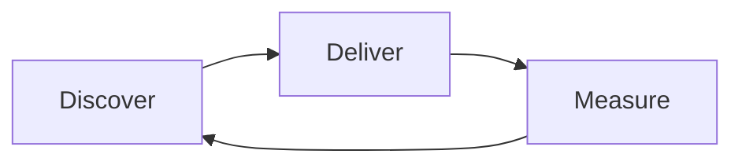

# Lecture 1 — What a PM Actually Does

> **Duration:** ~2 hours. **Outcome:** You can name what a product manager owns, what they influence, and what belongs entirely to someone else — across discovery, delivery, and outcomes — and you can tell PM, PO, project manager, and eng lead apart without reaching for a job-title cliché.

Ask ten product managers what they do and you'll get ten different answers, most of them wrong in the same way: they describe their *last sprint*, not their *job*. This lecture gives you a job description that holds up regardless of company size, industry, or org chart — because it's built on what the role is structurally responsible for, not on what any one PM happened to do this week.

We'll use one running example all week: **Loopline**, a fictional B2B task-management app used by ~40-person software teams. Loopline is real enough to reason about, fictional enough that nobody's feelings get hurt when we say a feature was a bad bet.

## 1. The three jobs hiding inside "product manager"

Strip away the title and a PM is doing three structurally different jobs, often in the same afternoon:

| Job | Question it answers | Time horizon |
|-----|---------------------|---------------|
| **Discovery** | Should we build this at all? | Weeks to months ahead |
| **Delivery** | Are we building the right version, correctly, on time? | Days to weeks ahead |
| **Outcomes** | Did it work? Did it move a metric that matters? | After ship, ongoing |

Most PM job descriptions only describe delivery — writing tickets, running standups, unblocking engineers — because delivery is the most *visible* work. It's also the smallest of the three in terms of leverage. A PM who is excellent at delivery but skips discovery ships the wrong thing efficiently. A PM who nails discovery and delivery but never closes the loop on outcomes can't tell you whether the last six months mattered.

**Discovery** is deciding what's worth building: talking to users, sizing problems, killing bad ideas before they cost a sprint (this is the entire subject of Weeks 2–3). **Delivery** is turning a validated problem into a shippable spec and shepherding it through design and engineering (Weeks 4–5, 8). **Outcomes** is instrumenting the thing, reading the data honestly, and deciding what happens next — iterate, scale, or kill (Weeks 6–7, and the thread running through the rest of the course).

A PM's real job is to **keep all three moving at once**, in a loop: discover → deliver → measure → discover again. Any team that only does delivery is a feature factory. Any team that only does discovery never ships. Any team that only measures outcomes without discovery is guessing why the number moved.

*The PM's real job is keeping discovery, delivery, and outcomes moving as one continuous loop, not a checklist.*

## 2. What a PM owns

"Owns" here means: if this doesn't happen, or happens badly, there is no one else whose job it was. Four things:

1. **The problem definition.** Not the solution — the problem. "Users abandon onboarding at step 3" is a PM's to define, evidence, and size. The *fix* to step 3 is a collaboration; the fact that step 3 is broken and costing you 22% of signups is the PM's finding to make undeniable.
2. **The prioritization rationale.** Someone has to decide what the team builds *next*, and — more importantly — be able to defend *why*, in front of a skeptical exec, using a method that isn't "whoever asked loudest." (Week 5 gives you RICE, Kano, and weighted scoring so this isn't vibes.)
3. **The roadmap narrative.** Not a Gantt chart — the story of where the product is going and why, that a new engineer, a new salesperson, and a nervous exec can all hear and come away aligned.
4. **Cross-functional alignment on trade-offs.** When design wants six weeks for a flawless flow and engineering says three weeks gets 80% of the value, the PM is the one who has to decide, own the call, and be accountable for it being wrong.

Notice what's *not* on this list: the PM does not own the code, the pixels, the go-to-market execution, or the org chart. Those belong to engineering, design, and marketing/sales respectively. The PM's job is to make sure those groups are all pointed at the same validated problem — not to do their jobs for them.

## 3. What a PM influences (but does not own)

Influence means: your input matters, your judgment is welcome, but the final call and the accountability sit with someone else.

- **Engineering's technical approach.** You can flag that a proposed architecture will make future changes expensive; you cannot dictate the schema.
- **Visual and interaction design.** You can say "this flow feels like five steps for a two-step job"; the designer decides how to fix it.
- **Marketing positioning and copy.** You inform it with user language from research; the GTM/marketing lead owns the campaign.
- **Engineering estimates.** You can push back on scope to hit a date; you cannot unilaterally declare "this will take three days."
- **Hiring and performance decisions for people outside your reporting line.** You give input on whether a contributor is delivering well; their manager decides.

If you find yourself dictating a decision in this second list, you're not being a strong PM — you're overriding someone whose actual expertise you need. The instinct to "just decide everything" is the single most common way new PMs burn trust with engineering and design in month one.

## 4. PM vs. PO vs. project manager vs. eng lead

These four roles get conflated constantly, and the confusion causes real organizational damage — duplicated work, dropped problem definition, or a PM quietly doing someone else's job badly instead of their own job well. Here's the clean version:

| Role | Primary question | Owns | Common in |
|------|-------------------|------|-----------|
| **Product Manager (PM)** | *What* should we build, and *why*? | Problem definition, prioritization rationale, roadmap | Product-led companies, most modern software orgs |
| **Product Owner (PO)** | What goes in *this* sprint, in what order? | The backlog for one team, sprint-level sequencing | Scrum shops; often a narrower slice of the PM job, sometimes the *same person* wearing a different hat |
| **Project Manager** | *When* will this ship, and what's blocking it? | Timeline, cross-team dependencies, risk tracking | Larger orgs, regulated industries, multi-team initiatives |
| **Engineering Lead / EM** | *How* do we build it well? | Technical architecture, code quality, engineering headcount and growth | Every engineering org |

The "product owner" title deserves a specific note: in classic Scrum, PO is a formally defined role that's really a *subset* of full-scope product management — it covers backlog ownership and sprint priorities but not necessarily discovery, strategy, or outcome ownership. Many companies use "PO" and "PM" interchangeably; some split them into two people on the same team, where the PM does discovery/strategy and the PO turns validated work into a well-ordered backlog. **There is no universally correct answer** — Challenge 1 this week has you draw this line yourself across eight real, ambiguous scenarios, because in practice you'll be handed a title and have to figure out, company by company, what it actually means here.

The project manager distinction is cleaner: a PM decides *what* and *why*; a project manager (where the role exists separately) tracks *when* and *what's blocking it*. Many companies don't have a separate project manager at all — the PM absorbs light project-management work. Some (construction-adjacent software, healthcare, aerospace, anything with hard regulatory timelines) keep it a distinct, dedicated role because the coordination overhead is too large for one person.

## 5. A day in the loop, worked example

Say Loopline's team notices, from last week's dashboard, that new-user activation (finishing onboarding and creating a first task) has dropped from 68% to 54% over three weeks. Walk the loop:

- **Discovery move (PM-owned):** Before proposing a fix, the PM pulls five recent signup recordings and does two quick calls with users who signed up and didn't activate. Finding: a recent redesign added a "connect your calendar" step before the first task screen, and most B2B evaluators don't have calendar access approved yet — they're blocked by their own IT department, not by the product.
- **Delivery move (PM-owned rationale, design/eng-owned execution):** The PM proposes making the calendar step skippable, with the design and eng leads deciding the actual UI treatment and the engineering cost of the change (accepted at half a day of work — cheap, high-confidence fix).
- **Outcome move (PM-owned):** The PM defines the success metric *before* the change ships — "activation returns to ≥65% within two weeks" — and is the one who checks the dashboard afterward and says, plainly, whether it worked.

Notice how small the PM's *hands-on-keyboard* time was, and how large the PM's *judgment and accountability* footprint was. That ratio — small hands, large judgment — is the job, and it's exactly why "what does a PM do all day" is such a hard interview question to answer well: most of the highest-leverage work doesn't look like activity.

## 6. How the role changes with company size

The *responsibilities* above hold everywhere; the *shape* of the day changes a lot:

- **Early-stage startup (pre-PMF):** One PM, wide scope, minimal process. You'll do user interviews, write the PRD, review the UI, and pull your own metrics because there's no one else. Discovery dominates — you don't know yet what's true.
- **Growth-stage:** PMs specialize by product area. More process (sprint rituals, PRD templates) exists to keep multiple teams coordinated. Delivery and outcomes both get real weight.
- **Enterprise/mature:** PM scope narrows further (one PM per feature area), project managers and program managers appear to handle cross-team timelines, and a formal PRD/approval process exists because the cost of shipping the wrong thing is much higher.

A common early mistake: a PM who thrived at a 10-person startup joins a 2,000-person company and tries to single-handedly "own" the full scope they used to — and burns out or steps on five other people's jobs. The *job* scaled down even though the *title* stayed the same.

## 7. Anti-patterns to recognize

- **The ticket-writer PM.** Spends 100% of time in delivery, never validates a problem before writing the spec. Ships efficiently, ships wrong things.
- **The idea-generator PM.** Believes their job is to have the ideas. The best PMs get most of their best ideas *from users and data*, not from their own head — and treat their own opinion as one data point, not the answer.
- **The mini-CEO myth.** "PM is the CEO of the product" is a popular but misleading metaphor — a CEO has hiring/firing and budget authority; a PM has almost none of that. The metaphor is useful for signaling *accountability without authority*, which is real, but taken literally it causes PMs to try to command people who don't report to them, which backfires.
- **The order-taker PM.** Says yes to every stakeholder request, has no prioritization method, ships a backlog built entirely from whoever escalated loudest. This is the opposite failure from the mini-CEO myth — no ownership of the problem-definition or prioritization job at all.

## 8. Check yourself

- Name the three time horizons a PM operates across, and one concrete activity in each.
- List two things a PM owns and two things a PM only influences. Why does that distinction matter for how you work with engineering?
- A company has a "Product Owner" who writes PRDs, talks to customers, and sets the quarterly roadmap. Is that a PO by the classic Scrum definition, or something else? What would you call it, and why does the label matter less than the actual scope?
- In the Loopline activation example, which move was discovery, which was delivery, and which was outcomes? Could you have skipped the discovery move and gone straight to a fix? What would you have risked?
- Why is "PM is the CEO of the product" a dangerous metaphor to take literally?

If those are automatic, Lecture 2 goes into who the user actually is and the job they're hiring your product to do — the input that every discovery move in this lecture depended on.

## Further reading

- **Marty Cagan, "The Product Manager Role" (SVPG):** <https://www.svpg.com/the-product-manager-role/>
- **Marty Cagan, "Product vs. Project Managers" (SVPG):** <https://www.svpg.com/product-vs-project-managers/>
- **Scrum.org, "The Product Owner":** <https://www.scrum.org/resources/what-is-a-product-owner>
- **Atlassian, "Product Manager vs. Product Owner":** <https://www.atlassian.com/agile/product-management/product-manager-vs-owner>
