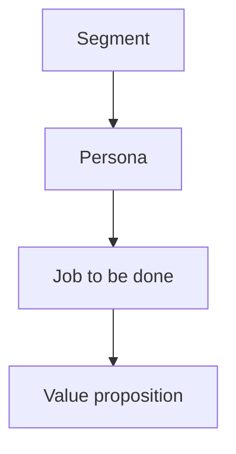

# Lecture 2 — Users, Value, and Jobs-to-Be-Done

> **Duration:** ~2 hours. **Outcome:** You can separate *who* a user is from *what job* they hire a product to do, write a JTBD statement that isn't secretly a feature request, and build a value proposition that maps real pains and gains to what the product actually does about them.

Here is the single most common failure mode in early-stage product thinking: **describing the user in detail and never once naming the job.** You can know your user's age, job title, income bracket, and favorite productivity app, and still ship something nobody hires — because none of that told you what they were trying to get done. This lecture fixes that by giving you a vocabulary that keeps "who" and "job" permanently separate.

We continue with **Loopline**, our fictional team task-management app, as the worked example throughout.

## 1. Segments — grouping users by traits

A **segment** groups users by shared, observable, useful traits: company size, role, industry, technical sophistication, geography. Segments answer "who is this for," and they're useful for go-to-market, pricing, and support — but they are a weak foundation for *product* decisions on their own, because two people in the same segment can want completely different things, and two people in wildly different segments can want the exact same thing.

Loopline's segments might look like:

| Segment | Traits |
|---------|--------|
| Early-stage startup teams | 5–20 people, no dedicated PM, flat org, price-sensitive |
| Mid-size software teams | 40–150 people, has an engineering manager, willing to pay for integrations |
| Agencies | Manage multiple clients' projects simultaneously, need client-facing views |

Notice these are firmographic/demographic facts. They tell you nothing yet about *why* someone in any of these segments would open Loopline on a Tuesday morning.

## 2. Personas — a segment given a face (used carefully)

A **persona** is a semi-fictional composite of a segment — "Priya, an engineering manager at a 60-person startup, juggles four cross-functional projects and hates status-update meetings." Personas are popular because they're memorable and make empathy concrete. They're also easy to misuse:

- **The danger:** teams build a persona once, in a workshop, then treat it as settled truth for years, never re-validating it against actual users. A persona built from imagination instead of interviews is fan fiction with a stock photo.
- **The fix:** every trait on a persona should trace back to a real interview, survey response, or usage-data pattern (Week 2 teaches you how to gather that evidence). A persona is a *summary of evidence*, not a creative writing exercise.
- **The second danger — designing for "the average user":** no real person matches every trait on a composite persona exactly. Personas describe a *center of mass*, useful for communication across a team, but the actual design and prioritization work has to be checked against real individual users and their real jobs, not the composite.

## 3. Jobs-to-be-done — the job the user hires the product for

The **jobs-to-be-done (JTBD)** framework, most associated with Clayton Christensen, reframes the whole question: instead of asking "who is our user," ask **"what job is this person trying to get done, and what do they hire to do it?"**

Christensen's canonical example: a fast-food chain wanted to sell more milkshakes and studied milkshake buyers by demographic — no useful pattern emerged. Instead, researchers watched *when* milkshakes were bought. A huge share were purchased alone, in the morning, by commuters — who were hiring the milkshake for a specific job: something filling and one-handed to make a boring commute less boring, that wouldn't be gone in two bites like a banana and wouldn't leave crumbs like a donut. The milkshake's *competitor*, in that job, wasn't other milkshakes — it was bananas, bagels, and boredom. That insight is invisible if you only segment by age and income.

**A job has three layers**, and a complete JTBD statement should touch all three:

1. **Functional** — the practical task. *"Track who's doing what on my team this week."*
2. **Emotional** — how they want to feel (or stop feeling). *"Stop feeling anxious that something is silently slipping."*
3. **Social** — how they want to be seen by others. *"Look organized and in control in front of my own manager."*

### Writing a JTBD statement

A useful template:

> When **[situation]**, I want to **[motivation/functional job]**, so I can **[expected outcome, often emotional or social]**.

For Loopline's engineering-manager persona:

> When **I'm heading into my Monday leadership sync**, I want to **see, in under two minutes, what's on track and what's stuck across my team**, so I can **walk in looking prepared instead of getting blindsided by a question I can't answer**.

Read that statement again: notice it says nothing about task lists, Kanban boards, or software at all. That's the point — the *job* is stable and durable ("look prepared for my Monday sync") even as the *solution* changes over years (a spreadsheet, then a Trello board, then Loopline, then whatever replaces Loopline). Christensen's framing: **people don't want a quarter-inch drill — they want a quarter-inch hole.** If someone invents a better way to make holes, the drill loses, no matter how good the drill is. Build for the hole, not the drill.

### The test: is this actually a job, or a disguised feature request?

A fast filter — ask "does this describe a durable outcome the person wants, independent of any particular tool?" If the answer describes a UI element ("I want a button that lets me..."), it's not a job yet — it's a proposed solution wearing a JTBD costume. Push further upstream: *why* do they want that button? What are they actually trying to accomplish that the button is a guess at solving?

| Feature request (surface) | Push "why" once | Push "why" again → the real job |
|---|---|---|
| "I want a dark mode." | "My eyes hurt using it at night." | "I want to keep working at night without straining my eyes so I don't fall behind by morning." |
| "Add a Slack integration." | "I don't want to check two tools." | "I want task updates to reach me where I already live, so nothing slips through a tool I forgot to open." |
| "Let me export to PDF." | "My client wants a status report." | "I want to look professional and organized to my client without doing manual formatting work every Friday." |

Every row's rightmost column could be solved by *several different features* — which is exactly why finding the real job, not the first proposed feature, matters: it opens up better, cheaper, or more durable solutions than the one the user happened to suggest.

## 4. The value proposition — pains, gains, and what the product does about them

Once you know the job, the **value proposition** is the explicit map between the user's situation and what the product delivers. A simple, durable structure (adapted from Osterwalder's Value Proposition Canvas):

- **Pains** — what's frustrating, risky, or costly about getting this job done today.
- **Gains** — what outcomes, beyond just "the job gets done," would make the user genuinely happy.
- **Pain relievers** — specifically how the product removes or reduces a named pain.
- **Gain creators** — specifically how the product produces a named gain.

For Loopline's engineering-manager job above:

| Pains | Gains |
|---|---|
| Status is scattered across Slack threads, memory, and half-updated spreadsheets | Walking into the sync already knowing the answer, not guessing |
| Gets blindsided in front of their own boss by something they didn't know was stuck | Team trusts that raising a blocker actually gets seen, not lost |
| Spends 30+ minutes every Monday manually compiling a status update | Reclaiming that time for actual engineering-management work |

| Pain relievers (what Loopline does) | Gain creators (what Loopline does) |
|---|---|
| One board auto-aggregates status across all active tasks — no manual compiling | A "stuck items" view surfaces anything untouched >48h, so nothing is silently forgotten |
| Slack integration surfaces blockers in the channel the manager already reads | A 2-minute "Monday view" is purpose-built for walking into a sync prepared |

Notice every pain reliever and gain creator names a **specific product behavior**, not a vague promise. "Loopline helps you stay organized" is not a value proposition — it's a slogan. A real value proposition is falsifiable: you can point at the product and check whether it actually does the thing claimed.

### A common trap: value that doesn't map to a named pain or gain

It's easy to ship a feature that's clever, technically impressive, and genuinely maps to *nobody's* stated pain or gain. Before building, ask: which row of the pains/gains table does this address? If you can't point to one, you don't have a value proposition yet — you have an idea looking for a justification. (This is exactly what Week 3's opportunity-sizing work formalizes, and what the VVF+U lens in Lecture 3 tests directly.)

## 5. Putting it together: segment → persona → job → value

The full chain, applied once more to Loopline, end to end:

1. **Segment:** mid-size software teams (40–150 people).
2. **Persona:** Priya, engineering manager, juggling four projects.
3. **Job (functional/emotional/social):** "When I'm heading into my Monday sync, I want to see what's on track and what's stuck in under two minutes, so I can walk in prepared instead of blindsided."
4. **Value proposition:** an auto-aggregating status board and a stuck-items view that turn 30 minutes of manual compiling into a 2-minute glance.

*Each layer builds on the one above it, but the job is the layer that changes the least over time.*

Each layer depends on the one above it, and — this is the important part — **the job is the layer that should change the least over time.** Segments shift as the company grows into new markets. Personas get refined as you interview more people. The *job* — "look prepared for my Monday sync without getting blindsided" — is close to permanent. That's why JTBD is the layer strategy gets built on (Lecture 3), not the persona or the segment.

## 6. Check yourself

- In your own words, what's the difference between a segment and a persona? Which one is a summary of evidence, and which one is at risk of becoming fan fiction if it's not grounded in real interviews?
- Rewrite this feature request as a JTBD statement, pushing "why" at least twice: *"I want a mobile app."*
- Why does Christensen say people don't want a drill, they want a hole? What's the equivalent "hole" for Loopline's Monday-sync job?
- Give an example of a pain reliever and a gain creator for a product you use. Can you point to the *specific* product behavior that does each — not just a vague benefit?
- Why is "the product helps you stay organized" not yet a real value proposition?

If those are automatic, Lecture 3 zooms out from one job to the whole product's lifecycle — and shows you how the *stage* a product is in changes which metric, and which bets, actually make sense.

## Further reading

- **Clayton Christensen et al., "Know Your Customers' Jobs to Be Done" (HBR):** <https://hbr.org/2016/09/know-your-customers-jobs-to-be-done>
- **Strategyn / Tony Ulwick, "What is Jobs-to-be-Done?":** <https://strategyn.com/jobs-to-be-done/>
- **Strategyzer, "Value Proposition Canvas":** <https://www.strategyzer.com/library/the-value-proposition-canvas>
- **Intercom, "Jobs to be Done: A Framework for Customer Needs":** <https://www.intercom.com/blog/jobs-to-be-done-framework/>
