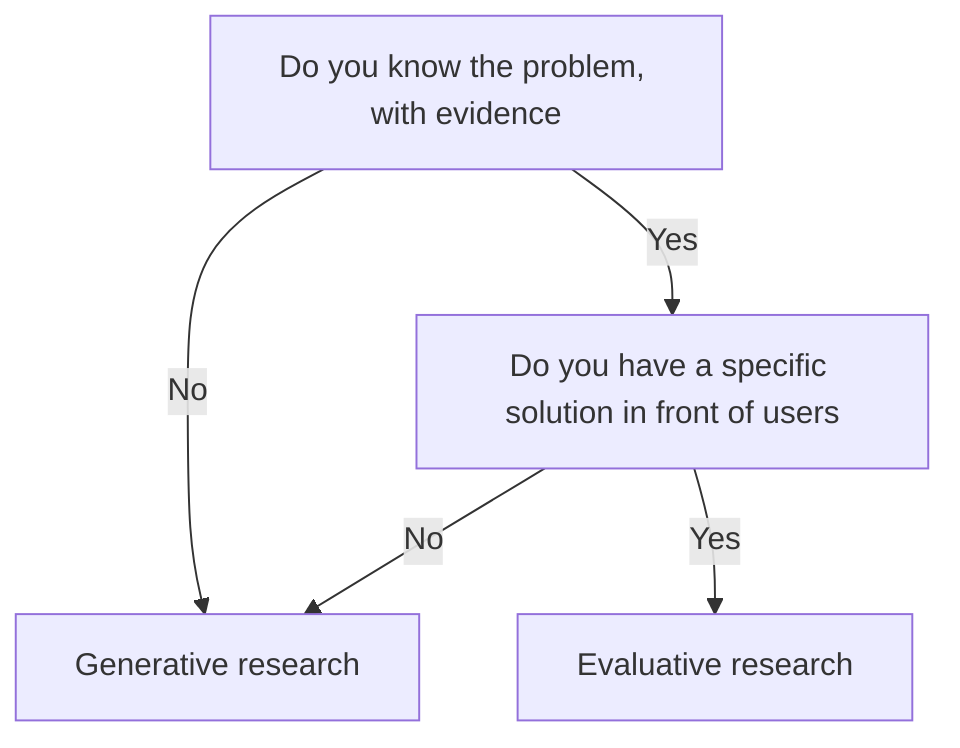

# Lecture 1 — Generative vs Evaluative Research

> **Duration:** ~2 hours. **Outcome:** Given any product question, you can say in one sentence whether it calls for generative or evaluative research, name the method you'd use, and explain what it costs a team to research the wrong thing.

Every research method answers a different kind of question. Pick the wrong one and you get a confident, well-produced answer to a question nobody asked — and a team that ships the wrong thing anyway, now with data to justify it. This lecture is about matching the method to the moment, before you touch a script or a survey tool.

## 1. Two families of questions

Product research splits into two families, and almost every method belongs cleanly to one:

**Generative research** asks *"what should we build?"* — it explores a space you don't yet understand well enough to have opinions about. You go in without a solution in mind. The output is problems, needs, mental models, and opportunities — not a verdict on a specific design.

**Evaluative research** asks *"does this thing we built work?"* — it tests a specific solution (a prototype, a flow, a feature already in production) against real users. You go in *with* a solution and come out with evidence about whether it holds up.

| | Generative | Evaluative |
|---|---|---|
| Question shape | "What's going on? What do people struggle with?" | "Does this solve it? Can people use it?" |
| You walk in with | Curiosity, no fixed solution | A prototype, mockup, or shipped feature |
| Typical methods | Interviews, field studies, diary studies, contextual inquiry, open surveys | Usability tests, A/B tests, evaluative surveys, analytics on a shipped change |
| Output | Problems, needs, themes, opportunity areas | Pass/fail signal on a specific design, usability issues, lift or drop in a metric |
| Common PM mistake | Skipping it, assuming you already know the problem | Running it too early, on a fake or half-built prototype, and trusting the result |

Neither family is "better." A mature product team runs both, but at different points and for different reasons. The double-diamond framing many design orgs use maps directly onto this: the first diamond (*discover → define*) is generative — divergent exploration narrowing to a problem statement. The second diamond (*develop → deliver*) is evaluative — divergent solutioning narrowing to a shipped, validated answer. Miss the first diamond and you're evaluating a solution to a problem nobody actually has.

## 2. The method matrix

Here is the fuller menu, sorted by family, with what each is actually good for and what it is not.

### Generative methods

- **Open-ended interviews (1:1)** — the workhorse of generative research. Best for understanding a process, a decision, a frustration, in the participant's own words and context. Slow (5–10 gets you real signal, not a large N) but deep.
- **Contextual inquiry / shadowing** — you watch someone do the actual task, in their actual environment, instead of asking them to describe it from memory. Best when people are bad at self-reporting their own workflow (they almost always are).
- **Diary studies** — participants log an experience over days or weeks (a text, a photo, a short note) when it happens, rather than trying to recall it in an interview a week later. Best for infrequent or bursty behaviors an interview would miss.
- **Open/exploratory surveys** — a survey with mostly open text fields, sent to a large pool, to surface the *range* of problems before you know what to ask about specifically. Useful for breadth; weak for depth.
- **Field studies** — observing behavior in its natural setting at scale (a store, a warehouse floor, a hospital unit) without controlling for anything. Expensive, but nothing beats it for surfacing context you'd never think to ask about.

### Evaluative methods

- **Usability testing (moderated or unmoderated)** — put a specific design in front of people and watch them try to complete a task. Best for finding where a flow breaks, confuses, or stalls someone, before you've spent engineering time on it.
- **A/B testing** — ship two variants to real traffic and measure a behavioral outcome. Best once you have enough volume for statistical power and a solution mature enough to be worth the build cost (Week 7 goes deep on this).
- **Closed/evaluative surveys** — structured questions (Likert scales, forced choice) about a specific, already-experienced feature. Best for measuring satisfaction or perceived difficulty at scale, after generative work told you what to ask about.
- **Tree testing / card sorting** — evaluative and generative hybrids for information architecture: does your proposed navigation structure make sense to people (tree testing), or how would people naturally group these items (card sorting, more generative).
- **Analytics on a shipped change** — the most evaluative method of all: real behavior, at full scale, with no participant even aware they're "in a study." Weak on the *why*; strong on the *what*.

## 3. The Shiftly example — same feature, two different research plans

Shiftly's team has a hunch: *"shift swapping is broken; a marketplace feature would fix it."* Watch how the research plan changes depending on which half of that sentence you still need to test.

**If you don't yet know whether swapping is actually painful, or why** — that's generative. You run interviews and maybe a diary study with shift workers and managers, with zero mention of "marketplace." You're trying to find out whether swapping is even a top-3 problem for these people, and if so, what specifically makes it hard. (This is exactly what this week's mini-project does.)

**If you already have interview evidence that swapping is painful, and you've sketched a marketplace UI** — that's evaluative. You run a usability test on clickable mockups: can a shift worker post an open shift and have a coworker claim it, without narration from you? You measure task completion and where people get stuck.

**If the marketplace feature is live for 10% of users** — that's evaluative again, but now with an A/B test: does swap completion time and no-show rate actually improve for the treatment group, or did it just feel like it would?

Notice the same rough topic ("shift swapping") gets three completely different research designs depending on where the team is. Running the usability test *before* the interviews would mean testing a solution to a problem you're still guessing at — a wildly common and wildly expensive mistake.

## 4. The cost of researching the wrong thing

This isn't an abstract risk. Here's the failure pattern, concretely, because it happens on real teams constantly:

A team decides shift swapping needs a fix. Instead of talking to shift workers first, they sketch a "marketplace" UI (post a shift, browse open shifts, claim one) because it's the obvious pattern from other gig-economy apps. They run a usability test on the mockup — evaluative research — and it goes *fine*. People can navigate it. Ship it.

Three months later, adoption is near zero. Why? Because the interviews they skipped would have surfaced that the actual top pain point wasn't *finding* someone to swap with — workers already do that fine over text — it was **manager approval friction and no-show accountability** (see the seed data's `manager_bottleneck`, `no_shows_trust`, and `record_keeping` themes; you'll query these directly in Lecture 3). A slick browse-and-claim UI doesn't touch either of those. The usability test correctly told them people *could use* the feature — it never had a chance to tell them the feature was solving the wrong problem, because that's not a question evaluative research can answer.

The cost wasn't the usability test — that method did its job. The cost was **skipping the generative step that would have told them what to build a usability test *of*.** A quarter of engineering time, a mediocre adoption number, and a stakeholder who now (wrongly) concludes "our users just don't want to swap shifts digitally."

The fix is not "do more research" — it's "do the *right* research at the *right* time." Ten interviews before a single mockup exists is often cheaper than one quarter of misdirected engineering.

## 5. A decision heuristic you can use today

Ask two questions about the thing you're about to research:

1. **Do I already know, with evidence, what the problem is?** If no — you need generative research, full stop, regardless of how obvious the solution feels.
2. **Do I have a specific, concrete solution in front of users right now?** If yes, and question 1 is also "yes" (you have evidence for the problem) — you're ready for evaluative research.

If you answer "no" to question 1 but you're still reaching for a usability test or an A/B test, stop. That's the single most common research-sequencing mistake in product work, and it's the one this lecture exists to prevent.

*The two-question heuristic for picking generative versus evaluative research.*

A second useful smell test: if your research plan includes a mockup, a prototype, or a "does X work" framing, it's evaluative. If it includes zero solutions and mostly "tell me about the last time…" framing, it's generative. If you can't tell which one your plan is, it's probably not well-designed yet.

## 6. Check yourself

- In one sentence, what's the difference between the question generative research answers and the question evaluative research answers?
- Why would running a usability test on a marketplace mockup *before* any interviews be premature, even if the test itself is well-designed?
- Name two generative methods and two evaluative methods, and one thing each is *not* good for.
- A stakeholder asks you to "A/B test whether users want this feature." What's wrong with that sentence, and what would you say back?
- Shiftly's interview data shows `manager_bottleneck` and `no_shows_trust` as major themes. What does that tell you about what an evaluative usability test on a "browse and claim" UI would and would not have caught?

If those are automatic, Lecture 2 goes deep on how to run the generative interview itself — without accidentally leading your participant to the answer you already believe.

## Further reading

- **Nielsen Norman Group — "Generative vs. Evaluative Research":** <https://www.nngroup.com/articles/generative-research-evaluative-research/>
- **Nielsen Norman Group — "When to Use Which User-Experience Research Methods":** <https://www.nngroup.com/articles/which-ux-research-methods/>
- **IDEO / Design Kit — the double diamond and discovery framing:** <https://www.designkit.org/methods>
