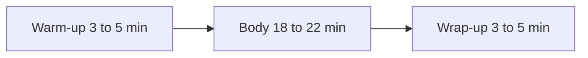

# Lecture 2 — Interviews That Avoid Leading

> **Duration:** ~2 hours. **Outcome:** You can write and run an interview script that asks about behavior instead of opinion, avoids leading and double-barreled questions, and take notes during the interview that you (or a teammate) can synthesize weeks later without having to remember the conversation.

An interview is the highest-bandwidth research method you have, and the easiest one to accidentally sabotage. The failure mode isn't a bad participant — it's *you*, asking questions that quietly tell the participant what answer you want to hear, and then reporting back "users loved the idea" when what actually happened is you led them there.

## 1. The core problem: people are polite, and you already have an opinion

Two forces conspire against every interview:

1. **Participants want to be helpful.** If you ask "would you use a feature that lets you swap shifts with one tap?", almost everyone says something like "yeah, that sounds useful" — not because it's true, but because disagreeing with an earnest interviewer feels rude, and imagining a hypothetical positively costs nothing.
2. **You already believe something.** You (or your team) has a hunch — that's usually *why* you're running the interview. That belief leaks into your phrasing, your tone, even your nodding, and participants pick up on it and steer toward confirming it.

The result is **leading interviews that manufacture false validation** — confident, well-documented evidence for a product decision that was never actually tested. This is worse than not researching at all, because it *feels* like evidence.

## 2. The Mom Test — the core discipline

Rob Fitzpatrick's book *The Mom Test* frames this as a single test: **could your mom still give you an honest, useful answer, even if she loves you and wants to make you happy?** If your question only works because the participant is trying to be nice, it fails the test. Three rules make an interview pass it:

**Rule 1 — Ask about their life, not your idea.** Don't ask "what do you think of a shift-swap marketplace?" Ask "walk me through the last time you needed someone to cover your shift." The first question invites an opinion about a hypothetical. The second question extracts a real, specific, already-happened event you can dig into.

**Rule 2 — Ask about specifics in the past, not generics about the future.** "Would you use X?" and "do you think you'd like Y?" are worthless — humans are terrible at predicting their own future behavior, and great at imagining a rosy hypothetical. "Tell me about the last time this happened" forces a real memory instead of a guess.

**Rule 3 — Talk less than they do.** If you're talking more than 20% of the time, you're not interviewing, you're pitching. Every time you feel the urge to explain your idea, ask a follow-up question instead.

### Leading vs. Mom-Test-clean, side by side

| Leading (fails the Mom Test) | Why it fails | Mom-Test-clean rewrite |
|---|---|---|
| "Would you use a feature that lets you find someone to cover your shift in one tap?" | Hypothetical, invites a polite "yes" | "Tell me about the last time you needed someone to cover a shift. What did you do?" |
| "Don't you find it frustrating when your manager takes forever to approve a swap?" | Presupposes the frustration, feeds the answer | "How does a shift swap normally get approved where you work?" |
| "How much would you pay for a tool that made swapping easier?" | Assumes willingness to pay before establishing the problem is real | "How do you currently handle a shift you can't make? What, if anything, have you tried that didn't work?" |
| "Do you think a marketplace of open shifts would help people like you?" | Pitches a specific solution and asks for a verdict on it | "What happens today when nobody wants to pick up the open shift?" |
| "Wouldn't it be great if managers didn't have to approve every swap?" | Puts words and enthusiasm in their mouth | "What role does your manager play when a swap happens? Has that ever caused a problem?" |

Notice the pattern: every clean rewrite asks about a **specific past event** and lets the participant describe what actually happened, in their own words, without a solution mentioned anywhere in the question.

## 3. Following behavior, not opinion — and laddering with "why"

Once you have a real story ("last week I texted three coworkers before someone said yes, and by the time my manager approved it I'd already worked half the shift myself"), your job is to follow it, not evaluate it. Two techniques:

**Ask "what did you do next," not "what do you think about that."** Behavior is verifiable and specific; opinion is squishy and performative. "What did you do next?" keeps you anchored in the actual sequence of events.

**Ladder with "why" — but gently, and never more than 3 deep.** "Why did you text three people instead of just one?" → "Because the first two usually don't answer in time." → "Why not?" → "Because they're not checking their phone during their own shift." Each "why" gets you closer to a root cause instead of a surface complaint. Stop laddering once you hit something structural (a constraint of their job, not a preference) — that's usually the real insight.

**Watch for a workaround — it's a gift.** When someone describes an ad hoc fix ("we have a whole side text thread that's basically the real schedule" — an actual quote from Shiftly's `manual_texting` theme), that is direct evidence of an unmet need. People don't build workarounds for problems that don't matter to them. A workaround is worth more than a stated opinion, every time.

**Handle compliments and hypotheticals by deflecting them back to specifics.** If a participant says "that's a great idea, I'd definitely use that," don't write it down as validation. Say: "That's helpful to hear — can you tell me about a recent time this exact situation came up?" You're redirecting them from performing enthusiasm back to reporting a fact.

## 4. Building the script

A 30-minute generative interview has three parts. Write a script, but hold it loosely — the goal is a conversation that goes wherever the participant's real experience leads, not a form you march through.

**Warm-up (3–5 min).** Low-stakes, builds rapport, gets them talking in their own words. *"Tell me a bit about your role — what does a typical shift look like for you?"*

**Body (18–22 min).** The behavior-focused core. For Shiftly, this might be: *"Tell me about the last time you couldn't make a scheduled shift. Walk me through exactly what happened, step by step."* Then follow with laddering "why"s, ask about frequency ("how often does that come up?"), and ask about workarounds ("is there anything you've started doing to make this easier?"). Never mention "marketplace," "swap feature," or any solution — you're still in the problem space.

**Wrap-up (3–5 min).** *"Is there anything about [the topic] we haven't talked about that you think I should know?"* This single question regularly surfaces the most important insight of the whole interview, because it hands the floor back to them with no framing at all.



*The three-part shape of a 30-minute generative interview script.*

A rule of thumb: write 5–7 open questions for the body, not 15. You won't get through 15 in 20 minutes if you're actually following up on what they say, and a long list of questions is a sign you're planning to read a survey out loud instead of having a conversation.

## 5. Note-taking that survives synthesis

The interview is worthless to anyone who wasn't in the room unless your notes can stand alone weeks later. Three habits:

**Capture verbatim quotes, not paraphrases, for anything that sounds like a pain point or a workaround.** "Manager approval is slow" is your interpretation. "By the time my manager approves a swap the shift is already happening" (an actual quote from participant 14) is evidence. Write the quote down, in quotation marks, exactly as said. You (or a teammate) will code these into themes later — see Lecture 3 — and coding works on evidence, not summaries.

**Separate observation from interpretation, in real time.** Use two visibly different note styles: `Q:` for a direct quote, `O:` for something you observed (tone, hesitation, a workaround they demonstrated), and `I:` for your own in-the-moment interpretation — and treat `I:` notes as provisional guesses to revisit, not facts. Mixing these up is how a hunch quietly becomes "what the user said" three weeks later.

**Timestamp and tag as you go, not after.** If you're recording (get consent first, always), jot a rough timestamp next to a strong quote so you can find the clip later. If you're not recording, get the quote down close to word-for-word before the conversation moves on — you have maybe 10 seconds before your memory starts reconstructing it into something smoother and less true.

A practical minimum viable note format, per interview:

```
Participant: [id/segment]     Date:     Interviewer:
Context: [1-2 sentences on their role/situation]

Q: "..." [verbatim quote]                    O: [what you noticed]
Q: "..." [verbatim quote]
I: [your interpretation — flagged as a guess, not fact]

Follow-ups I'd ask next time:
```

This is exactly the shape of data that lands in the `interview_quotes` table from this week's seed database — one row per quote, a `theme` column you fill in during synthesis (Lecture 3), and a link back to the `participant_id` so you never lose the context of who said it.

## 6. Check yourself

- Rewrite "would you use a one-tap swap feature?" as a Mom-Test-clean question about a specific past event.
- Why is a described workaround (like a side text thread) stronger evidence than a stated opinion?
- What's the maximum useful depth for "why" laddering, and why stop there?
- A participant says "yeah, I'd definitely use that, sounds great." What do you do with that statement, and what do you say next?
- What's the difference between a `Q:` note and an `I:` note, and why does mixing them up create problems weeks later?
- Why does a good closing question ("anything I haven't asked about?") often surface the most important insight of the interview?

If those are automatic, Lecture 3 covers the other half of research data — surveys — and how to take everything from both methods and turn it into a handful of validated findings, using SQL as the workbench.

## Further reading

- **Rob Fitzpatrick — *The Mom Test* (official summary + free sample chapters):** <http://momtestbook.com/>
- **Nielsen Norman Group — "User Interviews: How, When, and Why to Conduct Them":** <https://www.nngroup.com/articles/user-interviews/>
- **Nielsen Norman Group — "Avoid Leading Questions in Usability Testing and User Research":** <https://www.nngroup.com/articles/leading-questions/>
