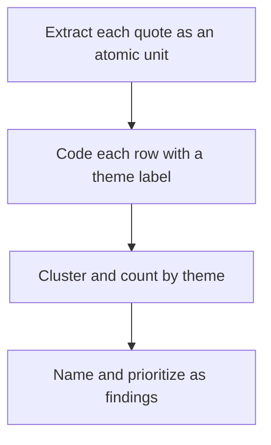

# Lecture 3 — Surveys and Synthesis

> **Duration:** ~2 hours. **Outcome:** You can write survey items that don't bias their own answers, store and query survey responses and coded interview quotes in SQL, and turn both into a small set of validated findings — the whole pipeline, no spreadsheet anywhere.

Interviews give you depth from a handful of people. Surveys give you breadth — a directional check across many more people, on questions interviews already told you were worth asking. This lecture covers writing a survey that won't lie to you, and then the step every research method eventually needs: turning raw data into a synthesized, defensible answer.

## 1. Why survey *after* interviews, not instead of them

A survey is an evaluative-leaning method most of the time: it works best when you already know roughly what to ask, because interviews told you. Send a survey before any interviews and you'll write questions shaped by your own assumptions, because you have nothing else to shape them from — and you'll only find out the questions were wrong after collecting 500 responses to them.

Shiftly's team ran interviews first (that's the `interview_quotes` data from the week README). Those interviews surfaced recurring themes — `manager_bottleneck`, `no_shows_trust`, `last_minute_stress`. The survey's job is *not* to discover new themes; it's to check **how widespread and how severe** the themes interviews already found actually are, across more people than 10–15 interviews can reach. That's the correct division of labor: interviews find the *what*, surveys check the *how much*.

## 2. Writing survey items that don't bias their own answers

Four failure patterns account for most bad survey data. Learn to spot each one in your own drafts.

**Leading / loaded wording.** *"How much do you love using Shiftly's schedule view?"* presupposes love. Neutral: *"How would you rate your experience with the schedule view?"* Any adjective in your question that implies a direction ("great," "frustrating," "convenient") is doing the participant's thinking for them.

**Double-barreled questions.** *"Is the app fast and easy to use?"* asks two things at once. A "no" could mean slow, hard to use, or both — you can't tell which, and you can't act on an answer you can't interpret. Split it: *"How fast is the app?"* and *"How easy is the app to use?"* as separate items.

**Absolute or extreme wording that most people won't honestly select.** *"Do you always struggle to find someone to cover your shift?"* — "always" is a high bar most true-but-frequent experiences won't clear, so you undercount a real problem. Prefer a frequency scale (never / rarely / monthly / weekly / several times a week) over a yes/no on an absolute.

**Hypothetical future behavior instead of past behavior.** *"Would you use a swap marketplace if we built one?"* is the survey version of the same Mom Test violation from Lecture 2 — everyone imagines themselves as an eager adopter of a free hypothetical improvement. Ask about **actual past frequency and actual past difficulty** instead, and let the *product decision* (not the participant) infer likely future adoption from that.

### A biased item and its fix, side by side

| Biased | Problem | Fixed |
|---|---|---|
| "How much do you struggle with the outdated swap process?" | "outdated" is loaded; presupposes struggle | "How difficult is it to arrange a shift swap, from very easy to very hard?" |
| "Wouldn't a faster approval process help you?" | Leading, rhetorical | "How is a shift swap currently approved where you work?" |
| "Do you always have to text multiple people to find coverage?" | Absolute wording undercounts | "In the last month, about how many people did you typically have to contact to find coverage?" |
| "Would you use a one-tap swap feature?" | Hypothetical, no behavior anchor | "How often have you needed to swap a shift in the last month?" (behavior) + separately, satisfaction with the *current* process |

### Question order and scale design

Order matters: put neutral, factual questions (role, workplace type, tenure) first — they're easy and build momentum. Put sensitive or effortful open-text questions last — if someone abandons the survey, you've already captured the structured data. Randomize or vary the order of scale items across respondents where your tool supports it, so nobody's answer pattern is an artifact of "the third question in a row felt the same as the second."

For Likert-style scales, use an odd number of points (5 is standard) with **labeled endpoints** ("1 = very easy, 5 = very hard") — unlabeled numbers force respondents to guess your intended direction, which reintroduces bias you just spent three paragraphs removing. Avoid mixing scale directions across a survey (don't make 1 = best on one question and 1 = worst on the next) — it silently corrupts your data because people answer on autopilot after the first few items.

## 3. Storing survey responses in SQL — never a spreadsheet

Once responses come in, they are **data you will query, filter, and cross-tabulate repeatedly** — that is exactly what a database is for, and exactly what a spreadsheet degrades under (no types, no constraints, silent copy-paste errors, no reproducible query you can re-run when new responses arrive). This course's data tooling rule applies here as much as it does to any finance table: **research data lives in SQL, analyzed with SQL and Python — never Excel or Sheets as the system of record.**

The seed `survey_responses` table from the week README is exactly this shape:

```sql
CREATE TABLE survey_responses (
    response_id      INTEGER PRIMARY KEY,
    segment          TEXT    NOT NULL,   -- 'manager' or 'shift_worker'
    workplace_type   TEXT    NOT NULL,
    swap_frequency   TEXT    NOT NULL,
    swap_difficulty  INTEGER NOT NULL,   -- 1 (very easy) .. 5 (very hard)
    used_group_chat  BOOLEAN NOT NULL,
    would_pay        BOOLEAN,            -- NULL = not asked (managers only)
    submitted_at     DATE    NOT NULL
);
```

Now the questions a stakeholder actually asks become one query each, not a pivot-table archaeology dig.

**"How difficult is swapping, on average, and does it differ by segment?"**

```sql
SELECT segment,
       ROUND(AVG(swap_difficulty), 2) AS avg_difficulty,
       COUNT(*)                        AS n_responses
FROM survey_responses
GROUP BY segment
ORDER BY avg_difficulty DESC;
```

**"Do people who use a group-chat workaround rate swapping as harder?"** — this is the quantitative check on the `manual_texting` theme interviews surfaced:

```sql
SELECT used_group_chat,
       ROUND(AVG(swap_difficulty), 2) AS avg_difficulty,
       COUNT(*)                        AS n_responses
FROM survey_responses
GROUP BY used_group_chat;
```

Run it against the seed data and you'll see `used_group_chat = TRUE` rows average noticeably higher difficulty — a quantitative echo of what participants 2 and 7 said directly in interviews. That convergence between two independent methods (interview + survey) is exactly what makes a finding *validated* rather than anecdotal — see Section 5.

**"Bucket difficulty into a readable label instead of a raw 1–5 number":**

```sql
SELECT
    CASE
        WHEN swap_difficulty <= 2 THEN 'easy'
        WHEN swap_difficulty  = 3 THEN 'moderate'
        ELSE 'hard'
    END AS difficulty_band,
    COUNT(*) AS n_responses
FROM survey_responses
GROUP BY difficulty_band
ORDER BY n_responses DESC;
```

**"What would a manager pay for a fix, and how many even answered that question?"** — this is where the deliberate `NULL` from the seed data matters:

```sql
SELECT
    COUNT(*)                                       AS managers_asked,
    COUNT(would_pay)                                AS managers_who_answered,
    SUM(CASE WHEN would_pay THEN 1 ELSE 0 END)     AS said_yes
FROM survey_responses
WHERE segment = 'manager';
```

`COUNT(would_pay)` only counts non-`NULL` rows — exactly right here, because `NULL` means "not asked," not "no." If you'd instead written `would_pay = FALSE` to mean "didn't say yes," you'd have silently misclassified every shift-worker row (where the question was never asked) as a "no," and reported a made-up number to your stakeholder with total confidence. This is the same `NULL` discipline from C33 Week 1, showing up again because research data has exactly the same trap.

## 4. Affinity mapping — turning quotes into themes

Affinity mapping is the classic synthesis technique: take every individual observation (a quote, a survey verbatim, a support ticket) and physically or virtually cluster the ones that are "about the same underlying thing," then name the cluster. Traditionally this happens with sticky notes on a wall. We do it the same way conceptually, but the notes are rows in a table and the wall is a `GROUP BY`.

The process, concretely:

1. **Extract** every distinct observation as its own atomic unit — one quote, one row. Don't pre-group while extracting; that's a shortcut that causes you to force-fit evidence into a theme you already expected, rather than letting themes emerge from the data.
2. **Code** each row with a short theme label — a `snake_case` tag, consistent across rows, describing what the observation is *about* (not your opinion of it).
3. **Cluster and count** — query which themes recur most, and pull every quote behind a theme to sanity-check the label still fits all of them.
4. **Name and prioritize** the themes as findings, ranked by how many independent participants (not just how many quotes) hit each one — one chatty participant shouldn't outweigh five participants who each said something once.



*The affinity-mapping process, done as rows and a GROUP BY instead of sticky notes.*

Here's step 3 and 4 against the week's seed `interview_quotes` table (already coded, for this demonstration):

```sql
-- Which themes come up most, and from how many DISTINCT participants (not just quotes)?
SELECT theme,
       COUNT(*)                              AS n_quotes,
       COUNT(DISTINCT participant_id)        AS n_participants
FROM interview_quotes
WHERE theme IS NOT NULL
GROUP BY theme
ORDER BY n_participants DESC, n_quotes DESC;
```

Run this against the seed and `manager_bottleneck` and `no_visibility` come out on top by participant count — not because any one person talked the most, but because the *most different people independently hit the same wall*. That's the signal an affinity map is built to surface, and exactly why "participant count," not "quote count," is the number you lead with in a finding.

**Pull every quote behind a theme before you trust it** — always sanity-check the cluster, because coding is subjective and a theme label can drift:

```sql
SELECT participant_id, quote_text
FROM interview_quotes
WHERE theme = 'manager_bottleneck'
ORDER BY participant_id;
```

**Cross the themes against segment** to see whether a pain point is universal or concentrated in one group — this changes what you'd recommend building:

```sql
SELECT p.segment,
       iq.theme,
       COUNT(*) AS n_quotes
FROM interview_quotes iq
JOIN participants p ON p.participant_id = iq.participant_id
WHERE iq.theme IS NOT NULL
GROUP BY p.segment, iq.theme
ORDER BY p.segment, n_quotes DESC;
```

You'll see `manager_bottleneck` shows up from *both* segments (workers frustrated waiting on approval, managers frustrated being the approval bottleneck) — a strong signal it's a structural process problem, not one side's complaint. That's a materially different, more actionable finding than either segment's quotes would tell you alone.

## 5. From themes to validated findings

A theme is not yet a finding. A **finding** is a specific, evidence-backed statement of a validated need, and it earns the word "validated" only when it clears a bar like this:

- **Multiple independent participants** raised it unprompted (not just one chatty interviewee) — that's why you counted `n_participants`, not `n_quotes`, above.
- **Behavior, not just opinion, backs it** — a workaround, a described past event, not just a stated preference.
- **It converges across methods where possible** — the interview theme (`manual_texting`) and the survey correlation (group-chat users report higher difficulty) are two independent signals pointing at the same underlying problem. Convergence across methods is much stronger evidence than either method alone.

A validated finding, written up, looks like this — and this exact shape is what the mini-project asks you to produce for a real problem of your own:

> **Finding: Manager approval is the primary bottleneck in shift swapping, for both sides.** 6 of 10 shift-worker interviews and both manager interviews independently described manager approval as slow, unpredictable, or a source of after-hours interruption (`manager_bottleneck`, n=6 participants). Survey data confirms managers report the lowest `swap_difficulty` ratings themselves but shift workers who rely on manual coordination (`used_group_chat = TRUE`) report meaningfully higher difficulty (avg 4.1 vs 2.0) — consistent with the interview evidence rather than contradicting it. **Not yet validated:** whether workers would prefer removing manager approval entirely or just speeding it up — the interviews only established the bottleneck exists, not the preferred fix. That's a question for the *next* round of research, not something to guess at now.

Notice what that finding does *not* do: it doesn't recommend a specific feature ("build a marketplace"). Synthesis produces validated problems. Deciding what to build from them is next week's job (problem and opportunity framing) — keep the two separate, or you'll find yourself defending a solution using research that only ever validated a problem.

## 6. Check yourself

- Why should a survey usually follow interviews rather than replace them?
- Rewrite "Do you always struggle to find coverage?" to avoid the absolute-wording bias.
- Why does `COUNT(would_pay)` behave correctly here, while `would_pay = FALSE` would have silently produced a wrong number?
- In affinity mapping, why do you count distinct participants per theme instead of just counting quotes?
- What does it mean for a finding to "converge across methods," and why is that stronger evidence than one method alone?
- Why is "build a shift-swap marketplace" not itself a valid finding from this week's research?

If those are automatic, you're ready for this week's exercises, challenges, and the mini-project — where you'll run this entire pipeline, interviews through SQL-stored synthesis, on a problem of your own choosing.

## Further reading

- **Nielsen Norman Group — "10 Tips for Creating Good Survey Questions":** <https://www.nngroup.com/articles/survey-tips/>
- **Nielsen Norman Group — "Affinity Diagramming: Collaboratively Sort UX Findings and Design Ideas":** <https://www.nngroup.com/articles/affinity-diagram/>
- **PostgreSQL — Aggregate Functions (`COUNT`, `AVG`, `GROUP BY`):** <https://www.postgresql.org/docs/current/functions-aggregate.html>
- **PostgreSQL — `CASE` expressions:** <https://www.postgresql.org/docs/current/functions-conditional.html>
