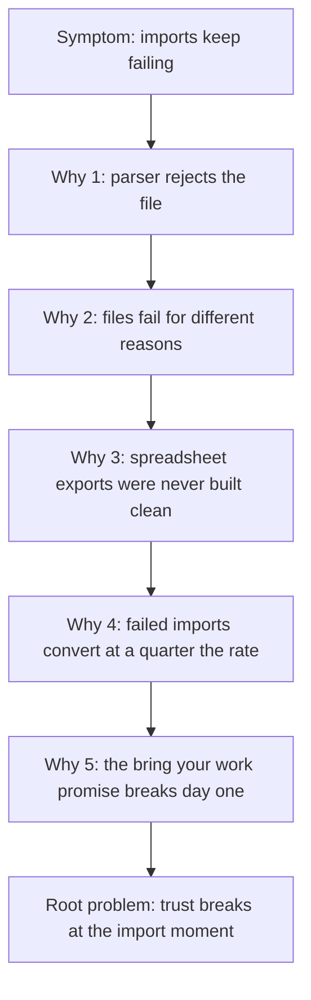
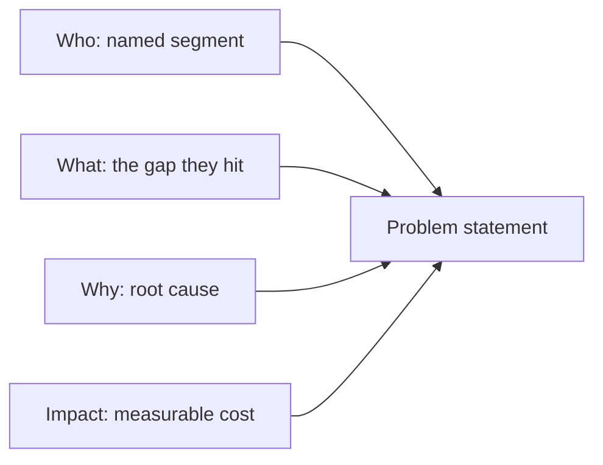

# Lecture 1 — Writing Problem Statements

> **Duration:** ~2 hours. **Outcome:** You can take a vague complaint and turn it into a problem statement that is specific, falsifiable, and free of a baked-in solution — using the who/what/why/impact structure and a JTBD framing — and you can tell a symptom from its root cause using the Five Whys.

## 1. Why this is the highest-leverage skill in the job

Here is the single most expensive mistake a product team makes, over and over, at every stage from seed startup to public company: **building a well-executed solution to a badly-framed problem.** Nobody notices at kickoff. The Figma looks great, the sprint plan is tight, the engineers ship on time, the feature launches — and three months later the metric it was supposed to move hasn't budged, and nobody can quite explain why, because nobody wrote down, in one falsifiable sentence, what "moving the metric" was even supposed to mean.

A problem statement is the artifact that prevents this. It is not a formality. It is the sentence you point back to in week eleven when someone asks "wait, why are we building this again?"

This lecture gives you a structure for writing one, a technique for making sure it names an actual problem (not a symptom, not a solution), and a way to check whether it's good before you show it to anyone.

## 2. Three things people confuse: problem, symptom, and solution

These three get tangled constantly, and the tangle is where bad roadmaps come from.

- **A solution** is a specific thing you could build: "add a bulk CSV importer with a preview screen."
- **A symptom** is an observable, measurable effect: "12 support tickets last week about failed imports," or "teams that fail to import their backlog convert to paid at 17%, versus 75% for teams whose import succeeds."
- **A problem** is the underlying gap between a user's goal and their current reality, stated independently of any particular fix: "new teams can't reliably move their existing backlog into Loopline, so many give up before they experience the product's value."

Notice the relationship: the symptom is *evidence that the problem exists*. The solution is *one candidate answer to the problem*, and usually not the only one. If you skip straight from symptom to solution — "tickets are up, let's add a bulk importer" — you never actually examine whether a bulk importer is the right fix, or even whether "import" is the real problem versus a downstream effect of something else (maybe the CSV parser is fine and the real issue is that trial teams don't know a CSV export from their old tool needs cleaning first).

### The solution-shaped statement (the most common failure)

A problem statement that already contains its solution is the single most common mistake in this exercise:

| Solution-shaped (wrong) | Why it's wrong |
|---|---|
| "We need a drag-and-drop CSV importer." | Names a UI, not a problem. Forecloses every other solution before you've even sized the problem. |
| "Users need an onboarding checklist." | Same failure — jumps to the fix. |
| "We should integrate with Trello." | A specific technical solution wearing a problem's clothes. |

Each of these might turn out to be the right call. But you don't know that yet, because you haven't stated — separately — what problem it would solve, for whom, and how you'd know if it worked. A useful test: **if your "problem statement" already tells an engineer what to build, it isn't a problem statement.**

## 3. Symptom → root cause: the Five Whys

Loopline's support queue has a recurring ticket: *"Import failed, tried three times, giving up."* That's a symptom. Before you write a problem statement, trace it back with the **Five Whys** — a technique from Toyota's manufacturing floor (see [Further reading](#further-reading)) that's just as useful for software.

> **Symptom:** New trial teams' backlog imports keep failing.
>
> 1. **Why?** The CSV parser rejects the file.
> 2. **Why?** The files fail for different reasons — some exceed a row limit, some have duplicate email addresses in the assignee column, some hit a text-encoding error.
> 3. **Why do teams hit these at all?** They're exporting from spreadsheets and other tools that were never designed to produce a "clean" import file — merged cells, stray blank rows, mixed encodings are normal spreadsheet reality, not user error.
> 4. **Why does that matter enough to fix?** Teams that fail to import their existing backlog convert to a paid plan at roughly a **quarter of the rate** of teams whose import succeeds (you'll compute the exact numbers in Lecture 2) — they seem to quietly give up rather than retype everything by hand.
> 5. **Why do we care about that specific behavior?** Because the whole pitch of switching to Loopline is "bring your team's work with you" — if that promise breaks on day one, the trial never gets a fair chance to prove the product's value at all.

*Tracing a symptom back through the Five Whys to the actual root problem.*

Five Whys down, you land somewhere very different from "add a bulk importer." You land on: *the moment a new team's real-world spreadsheet meets our import path is where trust in the product is won or lost, and today it's mostly lost.* That is a problem. A bulk importer might be part of the fix. So might better error messages, so might a concierge-assisted import for the first week, so might nothing at all if the segment turns out too small to matter (that's what Lecture 2 is for).

**Practical note:** you rarely need exactly five whys — sometimes it's three, sometimes it's seven. Stop when you hit a cause that's either (a) something you can act on, or (b) something clearly outside your control (e.g., "spreadsheets are messy" — true, unchangeable, but tells you the fix has to work *with* messy files, not assume clean ones).

## 4. The who/what/why/impact structure

A problem statement that survives scrutiny has four parts. Miss any one and it gets vague or unfalsifiable.

| Part | Question it answers | Loopline example |
|---|---|---|
| **Who** | Which specific segment, not "users" in general | New teams (2–20 seats) in their first 14-day trial who have an existing task backlog in another tool |
| **What** | What are they trying to do, and what's stopping them — stated as a gap, not a fix | They try to bring that backlog into Loopline via CSV import, and the import fails often enough that many never get a working copy of their real work into the product |
| **Why** | Why does this happen — the root cause, from your Five Whys | Real-world spreadsheet exports are messy (row limits, duplicate emails, encoding) in ways the current import path doesn't handle or communicate clearly |
| **Impact** | How you know it matters, in a measurable way | Teams whose import fails convert to paid at ~17%, versus ~75% for teams whose import succeeds — a gap large enough to be the difference between a healthy and an unhealthy trial funnel |

Stitched into one paragraph:

> **Problem statement:** New Loopline trial teams (2–20 seats) who try to bring an existing task backlog into the product via CSV import fail often enough — due to unhandled row limits, duplicate assignee emails, and encoding errors in real-world spreadsheet exports — that a large share never get their actual work into Loopline during the trial. These teams convert to paid at roughly a quarter the rate of teams whose import succeeds, suggesting the failure, not a lack of interest, is costing us trial-to-paid conversions.

Read it again and check: does it name a fix? No. Could it be wrong? Yes — maybe the conversion gap is really about team size (bigger teams that can afford an import naturally convert better regardless of whether the import works), not the import itself. That's a **good** sign, not a flaw — a statement you could disprove is a statement worth testing, which is the whole point.

*The four who/what/why/impact parts combine into one falsifiable problem statement.*

## 5. Translating a problem statement into a JTBD statement

Week 1 introduced jobs-to-be-done (JTBD): people don't want a product, they want to make progress on a job in a specific circumstance. A problem statement and a JTBD statement are two views of the same thing — the problem statement is written for your team (evidence-forward), the JTBD statement is written from the user's point of view (motivation-forward). You should be able to produce both from the same root-cause work.

**JTBD template:**

> When I'm **[situation]**, I want to **[motivation/action]**, so I can **[expected outcome]**.

Applied to the import problem:

> When I'm **switching my team from our old spreadsheet to Loopline**, I want to **bring our existing backlog over without hours of manual cleanup**, so I can **start using Loopline for real work on day one, instead of retyping everything for a week first.**

Notice what the JTBD statement adds that the problem statement doesn't emphasize as strongly: the **emotional and time cost** ("without hours of manual cleanup," "instead of retyping everything for a week") — this is often what turns a dry internal problem statement into something a design or engineering partner actually feels. Use the problem statement to justify the work to leadership with evidence; use the JTBD statement to keep the team anchored in the user's actual experience while building it.

## 6. What makes a problem statement good — a checklist

Run every problem statement you write through these five checks before you ship it to anyone:

1. **Specific population.** Not "users" — a named, boundable segment ("new trial teams, 2–20 seats," not "our customers").
2. **No solution words.** No "add," "build," "integrate," "redesign." If you catch yourself writing a verb that names a UI or a feature, you've slipped into solution mode.
3. **Root cause, not just a symptom.** You can point to a Five Whys chain (or equivalent evidence) behind it, not just "tickets went up."
4. **Quantified impact — or an honest plan to quantify it.** A number, a rate, a comparison — something a skeptic could ask you to defend. ("We think it matters" is not impact; "17% vs. 75%" is.)
5. **Falsifiable.** You can imagine evidence that would prove it *wrong*. If literally any finding would confirm your problem statement, it isn't one — it's a belief wearing a problem statement's clothes.

## 7. Before / after: turning vague complaints into problem statements

| Vague complaint (as heard from a stakeholder) | What's wrong with it as-is | Reframed problem statement |
|---|---|---|
| "Onboarding is bad, we need a wizard." | Solution-shaped ("wizard"); "bad" is unfalsifiable; no named segment | New self-serve signups (no sales-assisted onboarding) who don't create a second task within their first session are 4x more likely to never return — something in the first-session experience isn't establishing the habit loop. |
| "People keep asking for dark mode." | Confuses request volume with problem severity; no impact stated | *(Often the honest answer here is: there may be no sizeable underlying problem — see Lecture 3 on when to kill an idea for lack of evidence, not just lack of enthusiasm.)* |
| "Mobile users churn more." | True but too broad to act on; doesn't say why | Mobile-only users (no desktop session in a rolling 30 days) who try to attach a file to a task hit an unsupported action and abandon the task at 3x the rate of desktop users — the mobile app's missing attachment support is blocking a core workflow, not just a nice-to-have. |
| "Sales says the pricing page is confusing." | "Confusing" is unfalsifiable without a specific failure mode | Prospects evaluating the Team plan (10+ seats) cannot find the per-seat annual price without opening a chat — 40% of chat volume on the pricing page is this single question, adding an average 6 hours to time-to-quote. |
| "We're losing to Asana on integrations." | Competitive framing, not a user problem; no internal evidence | Prospects who use Slack as their primary team hub (a self-reported field in 60% of demo-request forms) ask about a Slack integration in the first sales call at a higher rate than any other integration, and losing that question correlates with a lower close rate — worth confirming with win/loss data before treating it as proven. |

Notice the last two rows: sometimes the honest, disciplined reframe is "we don't have enough evidence yet to state this as a problem — here's what we'd need." That is a legitimate and valuable output of this exercise, not a cop-out. Writing "not yet a validated problem" and saying what evidence would validate it is far more useful than dressing up a hunch as a fact.

## 8. Check yourself

- What's the difference between a symptom, a problem, and a solution? Give an example of each for a product you use.
- Rewrite this into a proper problem statement: "The search feature sucks."
- Why is "if literally any finding would confirm it, it isn't falsifiable" a useful test?
- Take a real complaint you've heard about a product (work, personal, doesn't matter) and run it through three Whys. Where did you land?
- Write a JTBD statement and a problem statement for the *same* underlying issue. What did each version emphasize that the other didn't?

If those are automatic, Lecture 2 takes the *impact* piece of the problem statement and turns it into a real, defensible number — sizing the opportunity two independent ways.

## Further reading

- **Clayton Christensen, "Know Your Customers' 'Jobs to Be Done'" (Harvard Business Review):** <https://hbr.org/2016/09/know-your-customers-jobs-to-be-done>
- **Alan Klement, Jobs to Be Done — the JTBD primer:** <https://www.jobs-to-be-done.com/>
- **ASQ, "Five Whys" (the Toyota-originated root-cause technique):** <https://asq.org/quality-resources/five-whys>
- **Teresa Torres, Product Talk (opportunity/problem framing, ahead of Lecture 3):** <https://www.producttalk.org/>
