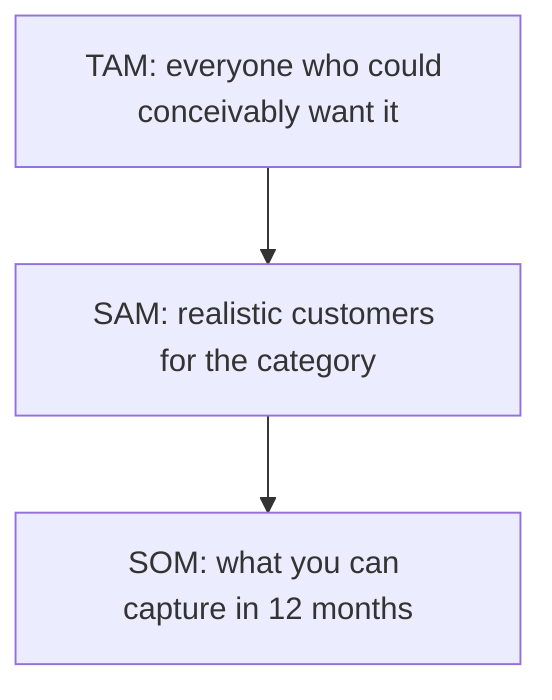
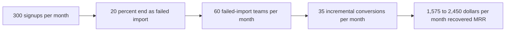

# Lecture 2 — Sizing the Opportunity

> **Duration:** ~2 hours. **Outcome:** You can produce a top-down TAM/SAM/SOM estimate from stated assumptions, produce an independent bottom-up estimate from real usage data queried in SQL, and explain what it means when the two disagree by an order of magnitude.

A problem statement tells you a problem is real. It does not tell you whether it's worth six weeks of an engineering team's time. That's what sizing is for: turning "this matters" into a number a stakeholder can weigh against every other number competing for the same roadmap slot. This lecture teaches two independent ways to produce that number, because relying on just one is how teams talk themselves into building things that don't move anything.

**A note on tooling, up front:** every calculation in this lecture is done in SQL against a real table, or in plain arithmetic you could just as easily do in Python. Nothing here touches a spreadsheet. That's not a style preference — a spreadsheet sizing model is a set of formulas nobody can query, re-run, or diff against yesterday's version. A SQL query against your actual funnel data is reproducible, versionable, and — critically — automatically stays true as new signups happen. Sizing that lives in someone's local Excel file goes stale the day they save it.

## 1. Two ways to size, and why you need both

- **Top-down**: start from a large, market-wide number (how many potential customers exist, globally or in a segment) and narrow it down with a chain of assumptions until you reach a number *you* could plausibly capture. Fast, useful for "is this market even big enough to matter," and dangerously easy to fool yourself with — a chain of optimistic percentages compounds into a number that feels rigorous but is really just vibes with more decimal places.
- **Bottom-up**: start from numbers you actually *have* — your own signup volume, your own conversion rates, your own revenue per account — and build up to a projection. Slower to produce, grounded in reality, but only as good as the data feeding it, and it can miss opportunities you haven't captured any data about yet (you can't query your way to a market you haven't touched).

The discipline this lecture teaches: **produce both, independently, before you look at the gap between them.** If you build the bottom-up number already anchored to what the top-down number "should" be, you've defeated the purpose — you want two honest, separately-derived estimates so a *disagreement* between them tells you something real. (Challenge 2 this week is built entirely around reconciling exactly this kind of gap.)

## 2. Top-down: TAM, SAM, SOM

This is the classic funnel-shaped market-sizing frame:

- **TAM (Total Addressable Market):** everyone who could conceivably want what you make, with no constraint on your ability to reach or serve them. The theoretical ceiling.
- **SAM (Serviceable Available Market):** the slice of TAM that's actually a realistic customer for your *category* of product, given real-world constraints (language, geography, price point, distribution).
- **SOM (Serviceable Obtainable Market):** the slice of SAM you, specifically, with your current size, brand, and go-to-market reality, could plausibly capture in a defined time window (usually 12 months).

TAM is almost never the number you act on — it's context. SOM is the number that should influence a roadmap decision, because it's scoped to *you*, not to "the market" in the abstract.


*Top-down sizing narrows a huge ceiling down to a number scoped to you.*

### Worked example: Loopline's import-friction opportunity, top-down

Every top-down estimate rests on stated assumptions — write them down, in the open, so someone can challenge any one of them:

```
TAM  Assumption: ~2,000,000 small-to-mid-size teams worldwide currently track
     tasks primarily in spreadsheets (a rough, stated estimate — not a cited
     market-research figure; this is the "how big could this possibly be"
     ceiling, and it's fine for it to be soft).

SAM  Assumption: 5% of those teams would plausibly consider switching to a
     tool like Loopline within the next 12 months.
     SAM = 2,000,000 * 0.05 = 100,000 teams

SOM  Assumption: given Loopline's current size (small team, limited
     marketing spend, English-language product), it could realistically
     reach and convert 0.4% of SAM this year.
     SOM = 100,000 * 0.004 = 400 teams

     Assumption: blended ARPU (average revenue per team, across plan tiers)
     of $50/month.
     Top-down SOM revenue = 400 teams * $50/mo * 12 = $240,000/year
```

That $240,000/year is **not** "the size of the import-friction opportunity" — it's an estimate of the whole SOM for Loopline switching from spreadsheets in general, of which import friction is one blocker among several. Top-down is good at answering "is the general direction big enough to be worth a team's attention" (yes, a few hundred thousand dollars a year is real money for a small team) — it is bad at answering "how much of that is *specifically* the import problem." For that, you need bottom-up.

## 3. Bottom-up: build it from data you actually have

Bottom-up sizing starts from your own funnel: how many people/teams enter it, what fraction hit the friction you're studying, and what that friction actually costs you in conversions or revenue — measured, not assumed. This week's seed table, `signup_cohort`, is exactly this kind of funnel data: 30 real (fictional) trial teams from November 2025, with whether they attempted an import, whether it worked, and whether they converted to paid.

### Step 1 — establish the baseline rates

```sql
-- What share of signups attempt an import at all?
SELECT
    COUNT(*) FILTER (WHERE import_attempted) AS attempted,
    COUNT(*) AS total_signups,
    ROUND(100.0 * COUNT(*) FILTER (WHERE import_attempted) / COUNT(*), 1) AS pct_attempted
FROM signup_cohort;
```

```
 attempted | total_signups | pct_attempted
-----------+---------------+---------------
        14 |            30 |          46.7
```

```sql
-- Of those who attempted, what share failed?
SELECT
    COUNT(*) FILTER (WHERE import_succeeded = FALSE) AS failed,
    COUNT(*) FILTER (WHERE import_attempted) AS attempted,
    ROUND(100.0 * COUNT(*) FILTER (WHERE import_succeeded = FALSE)
        / COUNT(*) FILTER (WHERE import_attempted), 1) AS pct_failed
FROM signup_cohort;
```

```
 failed | attempted | pct_failed
--------+-----------+------------
      6 |        14 |       42.9
```

Chain those together: `46.7% × 42.9% ≈ 20.0%` of **all** signups end up as a failed-import team. (In this seed, that's exactly 6 of 30 — the two fractions happen to cancel cleanly; don't expect that in real data, but always chain the rates through to "percent of all signups," not just "percent of attempts," or you'll overstate the friction's reach.)

### Step 2 — measure what the friction actually costs, in conversion rate

```sql
SELECT
    CASE
        WHEN NOT import_attempted THEN 'never attempted import'
        WHEN import_succeeded THEN 'import succeeded'
        ELSE 'import failed'
    END AS cohort,
    COUNT(*) AS teams,
    COUNT(*) FILTER (WHERE converted_to_paid) AS converted,
    ROUND(100.0 * COUNT(*) FILTER (WHERE converted_to_paid) / COUNT(*), 1) AS conversion_rate_pct,
    ROUND(AVG(mrr) FILTER (WHERE converted_to_paid), 2) AS avg_mrr_if_converted
FROM signup_cohort
GROUP BY cohort
ORDER BY conversion_rate_pct DESC;
```

```
          cohort           | teams | converted | conversion_rate_pct | avg_mrr_if_converted
----------------------------+-------+-----------+----------------------+-----------------------
 import succeeded            |     8 |         6 |                 75.0 |                 70.00
 never attempted import      |    16 |         8 |                 50.0 |                 25.00
 import failed                |     6 |         1 |                 16.7 |                 45.00
```

This is the number that matters: teams whose import **succeeded** convert at **75%**; teams whose import **failed** convert at **16.7%** — a **58.3-point gap**. Teams that never even tried convert at a middling 50%, which is itself an interesting, separate signal (worth its own investigation another week) but not this week's opportunity.

**A caution before you run further with this:** this is a *correlation*, not yet proven *causation*. It's possible bigger, more serious teams both (a) are more likely to have enough data that their import succeeds cleanly and (b) are more likely to convert regardless of the import outcome — in which case "fixing the import" wouldn't fully close that 58-point gap. Bottom-up sizing built from observational data like this should be read as an **upper bound on the opportunity**, not a guarantee. Say so explicitly when you report it — Challenge 2 makes you defend exactly this kind of gap.

### Step 3 — extrapolate to a monthly/annual figure, with a stated assumption

You need one number this table can't give you: how many *total* signups Loopline gets per month company-wide (this cohort is just one November sample). State it as an explicit, sourced assumption:

```
Assumption (stated, would come from the growth/marketing team in real life):
Loopline gets ~300 new trial team signups per month, company-wide.
```

```sql
-- The building blocks, all pulled from the query above:
--   pct of all signups that end up as a FAILED import = 20.0%
--   conversion rate if import succeeded            = 75.0%
--   conversion rate if import failed                = 16.7%
--   avg MRR if converted after a SUCCEEDED import    = $70.00  (optimistic anchor)
--   avg MRR if converted after a FAILED import        = $45.00  (conservative anchor)

-- failed-import teams per month  = 300 * 0.20                     = 60 teams/month
-- incremental conversions/month  = 60 * (0.750 - 0.167)           = 35 teams/month
-- conservative incremental MRR   = 35 * $45                        = $1,575/month
-- optimistic incremental MRR     = 35 * $70                        = $2,450/month
```

Annualized, that's a **bottom-up range of roughly $18,900–$29,400 per year** in recovered MRR if Loopline closed the conversion gap between failed and succeeded imports — this is the number you'd put in a problem brief, stated as a range with its assumptions attached, not a single false-precision figure.


*Chaining the measured rates from raw signups down to the bottom-up MRR estimate.*

## 4. Reading the gap between top-down and bottom-up

Line the two estimates up:

| Method | Estimate | What it actually measures |
|---|---|---|
| Top-down (SOM) | ~$240,000/year | Loopline's whole realistic switching-from-spreadsheets opportunity — of which import friction is one slice |
| Bottom-up | ~$18,900–$29,400/year | The specific, measured revenue at stake from *this one funnel step*, from data you actually have |

The top-down figure is roughly **10x** the bottom-up figure. That gap is not a contradiction — it's information. A few honest explanations, in descending order of how comfortable they should make you:

1. **They're measuring different things.** Top-down SOM is the *whole* switching opportunity across every blocker (import, missing integrations, pricing, etc.); bottom-up is *only* the import slice. You'd expect top-down to be bigger — the question is whether 10x is a plausible ratio for "one blocker out of several," which is a judgment call, not a formula.
2. **The bottom-up sample is small and short.** Thirty teams over one month is a thin slice; the true failed/succeeded conversion gap could be noisier than it looks (Challenge 2 asks you to reason about this with a confidence-interval mindset, not just point estimates).
3. **The top-down assumptions are the soft part.** "0.4% of SAM this year" is a guess dressed as a percentage — small changes to that one assumption swing the top-down number by 2–5x on their own. Always sensitivity-check the assumption doing the most work.
4. **The worst explanation:** someone tuned one of the two numbers, consciously or not, to make a favorite idea look bigger. This is exactly why you produce both estimates *before* comparing them.

**The rule of thumb this course teaches:** trust the bottom-up number to make a near-term prioritization call (it's grounded in what's actually happening), and use the top-down number only as a sanity check on ceiling ("is this category even big enough to eventually matter") — never the reverse. If your bottom-up number is *tiny* relative to top-down and you can't explain why with an honest reason like the four above, that's a signal to slow down and re-derive one of them, not to just average them together and move on.

## 5. Common sizing mistakes

- **Reporting a single number with false precision.** "$24,150.33/year" implies certainty you don't have. Report a range, and say what widens or narrows it.
- **Forgetting to chain conditional rates.** "42.9% of imports fail" is not the same as "42.9% of all signups are affected" — you saw above that the correct combined figure was 20.0%, roughly half of the unchained number. This is the single most common bottom-up sizing bug.
- **Confusing "people who complained" with "the size of the problem."** Support ticket volume is a *symptom indicator*, not a sizing input — silent churners never file a ticket, and vocal ones may be a biased sample. Size from behavioral/outcome data (did they convert? did they retain?), not from complaint volume alone.
- **Using vanity market-wide numbers as if they were your obtainable market.** "The global project-management software market is worth billions" tells you almost nothing about whether *this specific fix* is worth two engineers for three weeks.
- **Not stating assumptions where someone else could check them.** Every number in a sizing estimate that isn't directly queried from data should be a labeled assumption, in plain sight, not buried in a formula.

## 6. Check yourself

- What's the difference between TAM, SAM, and SOM, and which one should actually influence a roadmap decision?
- Why did chaining "46.7% attempt" and "42.9% of attempts fail" give 20.0%, not 89.6%? Do the arithmetic by hand.
- Name two honest reasons a top-down and a bottom-up estimate could legitimately disagree by 10x, and one dishonest one.
- Why is bottom-up sizing from observational conversion-rate data described as an "upper bound," not a guarantee?
- Rewrite "the opportunity is worth about $24,000/year" as a properly ranged, assumption-labeled statement.

If those are automatic, Lecture 3 takes this sized opportunity and places it into an opportunity-solution tree alongside the opportunities you *didn't* size this week — and shows you how to choose between them.

## Further reading

- **Total addressable market — background and definitions:** <https://en.wikipedia.org/wiki/Total_addressable_market>
- **PostgreSQL — aggregate functions (`COUNT`, `AVG`, `FILTER`):** <https://www.postgresql.org/docs/current/functions-aggregate.html>
- **PostgreSQL — the `FILTER` clause on aggregates:** <https://www.postgresql.org/docs/current/sql-expressions.html#SYNTAX-AGGREGATES>
- **SQLite — aggregate functions:** <https://www.sqlite.org/lang_aggfunc.html> *(note: SQLite has no `FILTER` clause before 3.30 in some builds — use `SUM(CASE WHEN ... THEN 1 ELSE 0 END)` as the portable equivalent, shown in Exercise 2.)*
