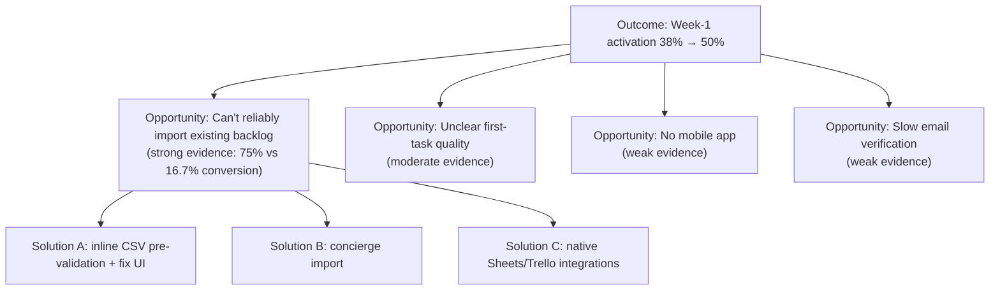
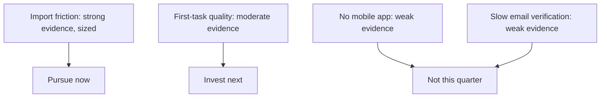

# Lecture 3 — Opportunity-Solution Trees

> **Duration:** ~1.5 hours. **Outcome:** You can build an opportunity-solution tree that connects a desired outcome to candidate opportunities to candidate solutions, use explicit criteria to choose which opportunity to pursue, and represent the whole thing as plain text — no spreadsheet, no slide.

## 1. The problem this framework solves

By this point in the week you can write a problem statement (Lecture 1) and size it (Lecture 2). But real teams don't have one opportunity — they have a dozen candidate problems competing for the same handful of engineers next quarter, discovered through interviews, tickets, sales calls, and data like this week's `signup_cohort`. Without a shared structure, prioritization degenerates into whoever argues loudest in the roadmap meeting winning. The **opportunity-solution tree** (OST), developed by product discovery coach Teresa Torres, is the structure this course teaches for making that decision visible, arguable, and revisable.

## 2. The shape of the tree

An OST has three levels, always in this order, always flowing from a single outcome at the top:

```
                    OUTCOME
              (a measurable, product-level result)
                        |
        ---------------------------------
        |               |               |
  OPPORTUNITY 1    OPPORTUNITY 2   OPPORTUNITY 3
  (user need/      (user need/      (user need/
   pain/desire)      pain/desire)     pain/desire)
        |
   -----------
   |         |
SOLUTION A SOLUTION B
```

- **Outcome (the root):** a measurable result you want to move — not a feature, a *number*. "Increase week-1 activation rate for new teams from 38% to 50%." Outcomes come from your product/business strategy, not from this tree — the tree starts by assuming you already know what you're trying to move.
- **Opportunities (the branches):** unmet needs, pain points, or desires expressed *from the customer's point of view*, each one a plausible lever on the outcome above it. This is where problem statements and JTBD statements from Lecture 1 live. Opportunities are not features — "teams can't reliably bring their existing backlog into Loopline" is an opportunity; "CSV importer" is not.
- **Solutions (the leaves):** specific things you could build, each one addressing the opportunity directly above it. Multiple solutions can hang off one opportunity — that's the point; you don't commit to a solution until you've explored more than one candidate.

The discipline the tree enforces: **you cannot add a solution to the tree without first naming the opportunity it serves, and you cannot add an opportunity without it plausibly serving the outcome at the root.** This kills two chronic failure modes at once — solutions with no evidence behind them ("just add dark mode" has no opportunity to hang from), and busywork opportunities disconnected from anything the business actually cares about.

## 3. Building Loopline's tree for this week's outcome

**Outcome:** *Increase week-1 activation rate for new trial teams* (the share of signed-up teams that reach a defined "activated" state — in Loopline's case, at least 10 real tasks created and assigned within the first 7 days).

Several candidate opportunities surface from this quarter's research — some backed by real evidence, some just hypotheses so far. Being honest about which is which is part of the discipline:

| Opportunity | Evidence level | Source |
|---|---|---|
| New teams can't reliably bring their existing backlog into Loopline (import friction) | **Strong** — behavioral data | `signup_cohort`: 75% vs. 16.7% conversion gap (Lecture 2) |
| New teams don't know what a "well-formed" first task looks like, so their first few tasks are low-quality and get abandoned | Moderate — qualitative | Week 2 user interviews (3 of 5 mentioned this unprompted) |
| Teams without a native mobile app churn faster once someone tries to use Loopline away from a desk | Weak — anecdotal | 2 sales calls mentioned it; no usage data pulled yet |
| The invite flow requires a work email verification step that some teams find slow | Weak — single support thread | 1 support ticket, not yet cross-checked against data |

Notice: only the first opportunity has been sized this week. That's normal — a real OST usually has more branches than you have evidence for, and part of ongoing discovery work is systematically strengthening the weak ones (or killing them) over time, not building solutions against them prematurely.

Under the strongly-evidenced opportunity, at least two solutions are worth exploring before committing to one:

```
OUTCOME: increase week-1 activation rate for new trial teams (38% → 50%)
│
├── OPPORTUNITY (strong evidence): new teams can't reliably bring their
│   existing backlog into Loopline — 75% vs 16.7% paid-conversion gap
│   between successful and failed imports (signup_cohort, Lecture 2)
│   │
│   ├── SOLUTION A: pre-validate the CSV before import, show inline
│   │   fixes for the three known failure types (row limit, duplicate
│   │   emails, encoding) instead of a single generic "import failed"
│   │
│   ├── SOLUTION B: concierge import — support manually cleans and
│   │   imports the file for any team that fails once, within 1 business day
│   │
│   └── SOLUTION C: native one-click integrations with the two most
│       common source tools (Google Sheets, Trello) that bypass CSV
│       entirely for teams migrating from those specific tools
│
├── OPPORTUNITY (moderate evidence): unclear what a "good" first task
│   looks like → low-quality first tasks get abandoned
│   │
│   └── (not yet explored this week — needs its own sizing pass)
│
├── OPPORTUNITY (weak evidence): mobile-away-from-desk churn
│   └── (not yet explored — flagged for next quarter's research backlog)
│
└── OPPORTUNITY (weak evidence): slow email verification in invite flow
    └── (not yet explored — flagged, low priority given weak evidence)
```

Representing it as indented Markdown (above) works fine for a quick draft; for anything you'll share or revise repeatedly, a text-based diagram tool like **Mermaid** (renders natively in GitHub/GitLab Markdown, plain text, no spreadsheet or drawing tool required) is worth the five extra minutes:



Both formats are plain text, live in version control next to your problem briefs, and can be diffed and reviewed like code — exactly the point of this course's "no spreadsheet as system of record" rule. A tree drawn in a slide deck can't be diffed, can't be grepped, and quietly rots the moment someone forgets to update the copy on the shared drive.

## 4. Choosing which opportunity to pursue

With four opportunities on the tree and one engineering team, you need explicit criteria — not a gut call — for which branch to invest in first. A useful scoring pass, applied honestly:

| Criterion | Import friction | First-task quality | No mobile app | Slow email verification |
|---|---|---|---|---|
| Evidence strength | Strong (behavioral data) | Moderate (3/5 interviews) | Weak (2 sales calls) | Weak (1 ticket) |
| Sized this week? | Yes — $18.9K–$29.4K/yr bottom-up | No | No | No |
| Plausible size, roughly | Confirmed range above | Unknown, likely meaningful (affects most new teams) | Unknown, likely small (Loopline is desktop-first for its ICP) | Unknown, likely small (one-time friction, not recurring) |
| Directly serves the outcome | Yes — happens in week 1, blocks activation directly | Yes — happens in week 1 | Partially — ongoing, not week-1-specific | Yes but narrow — affects invite, not directly task creation |
| Cost to explore further | Low — data already collected | Medium — needs a follow-up interview round | High — no data yet, requires new instrumentation | Low — pull existing support/analytics data |

**The call:** import friction is the opportunity to pursue *now* — it has the strongest evidence, is already sized, and directly serves this quarter's outcome. First-task quality is the opportunity to invest in *next* (moderate evidence, cheap to strengthen with a quick follow-up). No-mobile-app and slow-email-verification are **not pursued this quarter** — not because they're unimportant forever, but because the evidence doesn't yet justify displacing the stronger candidates, and the tree makes that reasoning visible to anyone who asks "why aren't we doing X?"


*Scoring the four opportunities against evidence and cost sorts them into now, next, and not-now.*

## 5. Killing branches — and communicating it well

An opportunity-solution tree is only useful if you're willing to prune it. Two disciplines matter here:

1. **Kill loudly, not silently.** If an opportunity or solution is dropped, say so on the tree (strike it through, move it to a "not now" section, or note the reason) rather than just letting it quietly vanish from the next version. Silent deletion is how the same rejected idea gets re-proposed every quarter by someone who never saw it get killed the first time.
2. **Kill with a reason tied to the tree's own criteria, not vibes.** "We're not doing the mobile opportunity this quarter because the evidence is weak and unsizeable yet, not because mobile doesn't matter" is a defensible, revisitable statement. "Mobile isn't a priority" with no reasoning invites the debate to reopen from scratch every time someone brings it up. Challenge 1 this week has you write exactly this kind of memo, for an idea that's much harder to kill than a weakly-evidenced mobile opportunity — one that's popular and well-liked internally.

## 6. Common pitfalls

- **Turning the tree into a permanent roadmap.** An OST is a discovery artifact — it should be revised weekly or biweekly as new evidence arrives. A roadmap is a delivery commitment. Confusing the two makes the tree stale within a month and makes the roadmap unresponsive to new evidence.
- **Adding solutions before naming the opportunity.** If you ever catch a stakeholder saying "let's just build X" with no opportunity above it on the tree, that's the moment to ask "what opportunity is that serving, and what's the evidence?" — not after it's already in a sprint.
- **One opportunity, one solution.** If a branch only ever has a single solution under it, you probably haven't actually explored alternatives — you've picked the first idea and back-filled a tree around it. Push for at least two candidate solutions per opportunity before committing.
- **Never pruning.** A tree that only grows becomes a museum of every idea anyone's ever had, which is exactly as useless for decision-making as having no tree at all.

## 7. Check yourself

- What three levels make up an opportunity-solution tree, and what question does each level answer?
- Why can't a solution attach directly to an outcome, skipping the opportunity level?
- Using this week's four candidate opportunities, explain in your own words why import friction was chosen over first-task quality, even though both happen in the user's first week.
- What's the difference between an OST and a roadmap, and why does confusing them cause problems?
- What does it mean to "kill loudly" a branch of the tree, and why does it matter more than just deleting it?

If those are automatic, you're ready for this week's exercises and challenges — Exercise 3 has you build a full tree from scratch, and Challenge 1 has you write the kill memo for a popular idea with weak evidence behind it.

## Further reading

- **Teresa Torres, "The Opportunity Solution Tree: Visualize Your Thinking" (Product Talk — the framework's origin):** <https://www.producttalk.org/2016/08/opportunity-solution-tree/>
- **Teresa Torres, Product Talk (ongoing writing on continuous discovery):** <https://www.producttalk.org/>
- **Mermaid — flowchart/graph syntax reference (for drawing trees as plain text):** <https://mermaid.js.org/syntax/flowchart.html>
