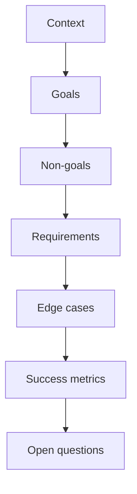

# Lecture 1 — Anatomy of a PRD

> **Duration:** ~2 hours. **Outcome:** You can structure a PRD with context, goals, non-goals, requirements, success metrics, and open questions — and you can explain, to a skeptical stakeholder, why the non-goals section is the single highest-leverage paragraph in the document.

## 1. What a PRD is actually for

A **PRD (product requirements document)** answers one question for every reader who opens it: *what, exactly, are we building, and why?* That sounds simple. It isn't, because a PRD has to satisfy several audiences at once, each reading it for a different reason:

- **Engineering** reads it to scope the work — what needs to be built, what's explicitly out of scope, what the edge cases are.
- **Design** reads it to understand the constraints and the user's situation, so they can design *for* the job, not just the happy path.
- **Data/analytics** reads it to know what to instrument, so the feature's impact is measurable, not just felt.
- **Leadership** reads it to understand why this feature, why now, and what "success" will mean in six weeks.
- **Future-you** reads it eight months from now, when someone asks "didn't we decide not to support X?" and you need the paper trail to answer with confidence instead of a guess.

A PRD that tries to be a pitch deck, a design spec, and a legal contract all at once ends up being none of them well. The discipline of this lecture is writing a PRD that's precise enough to build from and short enough that people actually read it.

**A PRD is not:**
- A wall of prose nobody skims past page one.
- A place to re-litigate whether the feature should exist at all — that decision (ideally backed by the opportunity-sizing work from Week 3) happens *before* you write a PRD, not inside it.
- A design document. It states the *requirements* design must satisfy; it doesn't dictate pixel positions.
- A promise with no expiration date. A PRD describes a specific build, not a permanent commitment to maintain every edge case forever.

## 2. The seven sections, in order

Every PRD you write in this course — and, honestly, most good PRDs you'll see in industry — follows roughly this shape. The order matters: each section earns the reader's trust for the next one.

| # | Section | Answers |
|--|---------|---------|
| 1 | **Context** | Why does this exist? What problem, for whom? |
| 2 | **Goals** | What does success look like, concretely? |
| 3 | **Non-goals** | What are we explicitly *not* building, this time? |
| 4 | **Requirements** | What must the feature do — as user stories with acceptance criteria (Lecture 2)? |
| 5 | **Edge cases** | What happens when things go wrong or go weird (Lecture 3)? |
| 6 | **Success metrics** | How will we know, with data, that this worked? |
| 7 | **Open questions** | What's still unresolved, and who owns resolving it? |


*The seven PRD sections in order, each one earning the reader's trust for the next.*

Walk through each with Loopline's **Stuck Task Alerts** feature — the one you'll write the full PRD for in this week's mini-project.

### Context

Ground the reader in *why*, using evidence, not opinion. This section should be short — three to six sentences — and it should cite something real: a JTBD statement, a research finding, an opportunity brief.

> **Context.** In Week 1's value-proposition work, engineering managers told us their biggest Monday-sync pain is being "blindsided" by a task that quietly stalled — nobody flagged it, and the manager only finds out during the sync itself, in front of their own boss. Loopline already ships a passive "Stuck Items" view (tasks untouched >48h) but usage data shows only 22% of managers open it more than once a week — the information exists, but it requires the manager to remember to go looking. We're closing that gap by pushing the same signal into Slack, the channel managers already read daily, instead of requiring a pull.

Notice this context section does real work: it names the user (engineering managers), the job (avoid being blindsided), the existing partial solution (the passive view), and the specific gap this feature closes (pull → push). A context section that just says "users want better visibility into stuck tasks" gives the reader nothing to push back on or build from.

### Goals

Goals are **specific and falsifiable** — a stranger should be able to look at the shipped feature in six weeks and say yes or no to whether each goal was met. Two to four goals is normal; more than that usually means you're bundling multiple features into one PRD (a smell — split it).

> **Goals**
> 1. Reduce the median time between a task going stuck and the assignee's manager becoming aware of it, from "next sync" (up to 7 days) to under 4 hours.
> 2. Increase the share of stuck tasks that get *any* status change (comment, reassignment, unstuck) within 24 hours of alert delivery, from a current baseline (no alert exists) to a measured post-launch rate.
> 3. Do this without adding a second place managers have to check — the alert must land inside their existing Slack workflow, not a new inbox.

Compare this to a bad goal: *"Improve visibility into stuck tasks."* That's not falsifiable — you can't look at the shipped product and say definitively whether it happened. Every goal should have an implicit or explicit metric attached, even if the exact target number is refined later (that's what the success-metrics section formalizes).

### Non-goals — the section that saves the project

This is the section most PMs skip, and it's the one that prevents the most pain. A **non-goal** is something clearly *adjacent* to the feature — something a reasonable person might assume is included — that you are explicitly choosing not to build *in this iteration*.

> **Non-goals (this iteration)**
> - **Not** configurable alert thresholds. The 48-hour "stuck" definition stays fixed at whatever the existing Stuck Items view uses — a per-team configurable threshold is a real, larger feature we're deliberately deferring.
> - **Not** alerting the task assignee directly — only the assignee's manager. Assignee-facing nudges are a different feature with different UX implications (assignees already see their own task list) and would muddy this feature's success metric.
> - **Not** a digest/summary mode. This ships as real-time, per-task alerts only; a daily digest is a plausible v2 if real-time proves too noisy.
> - **Not** available for personal (non-team) Loopline workspaces — this ships for team workspaces with a Slack integration already connected.

Why does this matter so much? Because **every one of those four bullets is a feature someone will ask for in the kickoff meeting**, and without a written non-goal, "we didn't decide against it, we just didn't decide" quietly becomes "well, obviously it should do that too" three weeks into the sprint. A stated non-goal isn't a permanent no — it's "not in this scope, and here, in writing, is the reason," which turns a scope argument into a two-second reference instead of a re-litigated debate. If a non-goal turns out to be wrong (stakeholders genuinely need configurable thresholds *now*), that's a fast, visible conversation — much cheaper than discovering scope crept in silently during implementation.

**A useful test for a non-goal:** if you *didn't* write it down, would an engineer or designer reasonably assume it was in scope? If yes, it belongs in this section. If it's wildly unrelated (nobody would assume Stuck Task Alerts includes, say, a dark mode), it doesn't need a bullet — non-goals are for things at the *boundary*, not an exhaustive list of everything the feature isn't.

### Requirements

The functional core of the PRD — the user stories and their acceptance criteria. This section is big enough that it gets its own lecture (Lecture 2) and its own exercise. For now, know that it lives here, between non-goals and edge cases, and that every requirement should trace back to a goal from section 2. If a requirement doesn't serve any stated goal, ask why it's in the document at all.

### Edge cases

What happens at the boundaries — empty states, permission edges, concurrent updates, the assignee who left the company mid-task. This gets Lecture 3 and its own exercise. The discipline: **enumerate these before build starts**, not as bugs discovered in QA. A PRD's edge-case section is where most of the "no meeting needed" promise from this week's framing actually gets earned — an engineer hitting an unhandled edge case *is* the meeting you were trying to avoid.

### Success metrics

Distinct from goals (which describe the desired *outcome*) — success metrics name the exact numbers and where they live, tying back to Lecture 3's instrumentation:

> **Success metrics**
> - **Primary:** median time from `task_stuck_detected` to first subsequent status-changing event on that task, queried from the `events` table, comparing pre- vs. post-launch cohorts.
> - **Secondary:** % of `stuck_alert_sent` events that are followed by a `task_status_changed` or `task_reassigned` event within 24h ("alert acted on" rate).
> - **Guardrail:** alert opt-out rate stays under 5% of eligible managers over the first 4 weeks — if managers are muting the alert, it's too noisy and the *feature* (not just the copy) needs rework.

Every metric here should be answerable with a SQL query against the event schema this week's Lecture 3 and Exercise 3 build — never "we'll eyeball it" or "check the spreadsheet."

### Open questions

The honest, unresolved edges — and, critically, **who owns resolving each one and by when**. An open question with no owner is a question that never gets answered.

> **Open questions**
> - Does a snoozed alert reset the 48-hour clock, or just suppress the notification once? *(Owner: PM, resolve before design starts — affects the state machine.)*
> - Should the alert fire during a manager's off-hours (per their timezone), or queue until their next working hour? *(Owner: PM + design, resolve before Sprint 1 — affects notification-delivery logic.)*
> - What happens to in-flight alerts if a team disconnects their Slack integration mid-feature? *(Owner: engineering, resolve during technical design.)*

A PRD with zero open questions is usually a PRD where the author didn't look hard enough, or quietly decided things without flagging the decision. Two to five honest open questions is a *sign of rigor*, not a weakness — it tells the reader exactly where the remaining risk lives.

## 3. Context length: how much is enough?

A rule of thumb for this course's PRDs: **context is the shortest section, non-goals and requirements are the longest.** If your context section is three paragraphs and your non-goals section is one bullet, you've probably written a pitch, not a spec. Flip that ratio.

## 4. A one-page skeleton you can reuse

```markdown
# PRD: <Feature Name>

## Context
<3–6 sentences: who, what job, what evidence, what gap this closes>

## Goals
1. <specific, falsifiable outcome>
2. <specific, falsifiable outcome>

## Non-goals (this iteration)
- <adjacent thing explicitly out of scope, with a one-clause reason>
- <adjacent thing explicitly out of scope, with a one-clause reason>

## Requirements
### Story 1: <title>
As a <role>, I want <capability>, so that <outcome>.
**Acceptance criteria:**
- Given <context>, when <action>, then <result>.

## Edge cases
| Scenario | Expected behavior |
|---|---|
| <edge case> | <what the system does> |

## Success metrics
- Primary: <metric, and the exact query/table it comes from>
- Guardrail: <the metric that tells you the feature is doing harm>

## Open questions
- <question> — Owner: <who>, resolve by: <when>
```

Keep this skeleton open while you read Lectures 2 and 3 — you'll fill in "Requirements" and "Edge cases" with real technique, not just the outline shown here.

## 5. Check yourself

- Name the seven sections of a PRD, in order, without looking back.
- Why does the non-goals section usually prevent more pain than any other section?
- What test can you apply to decide whether something belongs in non-goals versus being left out entirely?
- Give an example of a goal that is *not* falsifiable, and rewrite it so it is.
- Why should context be the shortest section and non-goals/requirements the longest?
- Why is "zero open questions" usually a red flag rather than a sign of a complete PRD?

If those are automatic, Lecture 2 goes deep on the Requirements section — story slicing, INVEST, and writing acceptance criteria precise enough that engineering and QA read them identically.

## Further reading

- **Marty Cagan, "Good Product Team, Bad Product Team" (SVPG):** <https://www.svpg.com/good-product-team-bad-product-team/>
- **Julie Zhuo, "Writing a Great PRD" (via Lenny's Newsletter archive concepts):** <https://www.lennysnewsletter.com/>
- **Atlassian, "How to write a great PRD":** <https://www.atlassian.com/agile/product-management/requirements>
- **Reforge / Shreyas Doshi, on scope discipline and non-goals (public talks/threads):** search "Shreyas Doshi non-goals" for widely-cited public commentary on why explicit non-goals prevent scope creep.
