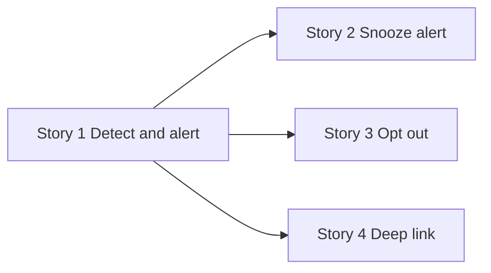

# Lecture 2 — User Stories and Acceptance Criteria

> **Duration:** ~2 hours. **Outcome:** You can slice a feature into user stories that pass the INVEST test, write acceptance criteria in Given/When/Then form precise enough that two different engineers would build the same thing from them, and write a definition of done that closes the loop.

## 1. What a user story is (and isn't)

A **user story** is a short, structured statement of a capability from the user's point of view:

> As a **\<role\>**, I want **\<capability\>**, so that **\<outcome\>**.

The classic template exists for a reason: it forces you to name *who* benefits, *what* they can now do, and *why it matters to them* — in that order, every time. Compare:

- ❌ **"Add Slack notifications for stuck tasks."** — This is a feature description, not a story. It has no *who*, no *why*. It tells an engineer *what to build* but gives them nothing to reason with when a decision comes up mid-build that the spec didn't anticipate.
- ✅ **"As an engineering manager, I want to be notified in Slack the moment one of my team's tasks goes stuck, so that I can intervene before it derails the Monday sync."** — Same feature, but now an engineer facing an ambiguous edge case can ask "does this choice serve the manager's goal of intervening *before* the sync?" and often answer their own question.

A user story is a **placeholder for a conversation**, not a finished spec on its own — the acceptance criteria (section 3, below) are what actually make it buildable and testable. But the story itself still matters: it's the sentence that keeps everyone anchored to *why* the ticket exists.

## 2. Slicing a feature into stories

A feature like Stuck Task Alerts is too big to build, review, or ship as one unit. **Story slicing** is the skill of cutting it into pieces that are each independently valuable and independently shippable — not into "backend piece" and "frontend piece" (that's a *task* split, which is engineering's job, not a *story* split, which is the PM's job).

A useful heuristic: slice along the **user's decision points and journey**, not along the technical architecture. For Stuck Task Alerts:

| Story | What it delivers alone |
|---|---|
| 1. Detect a stuck task and send one Slack alert to the manager | The core value — even with no snooze, no digest, no settings, this alone closes the "blindsided" gap |
| 2. Manager can snooze an alert for a specific task | Reduces alert fatigue — ships *after* story 1 proves the core alert works |
| 3. Manager can turn off Stuck Task Alerts entirely (opt-out) | A guardrail/escape hatch — needed before wide rollout, but not before an initial pilot |
| 4. Alert includes a deep link straight to the task in Loopline | A quality-of-life addition on top of story 1 — could ship in the same release or slightly after |


*Story 1 delivers real value alone; stories 2 through 4 build on it instead of blocking it.*

Notice story 1 alone is a complete, useful, shippable thing — a manager who only gets story 1 already has their JTBD served (they find out about stuck tasks without opening the app). Stories 2–4 make it better, but the feature doesn't *need* all four to deliver real value on day one. This is the difference between slicing by user value (good) and slicing by "50% of a working feature" (bad — half a login flow helps nobody).

### A slicing anti-pattern to avoid

Do **not** slice a story as "build the database table" / "build the API" / "build the UI." Those are implementation *tasks* an engineer will naturally break the story into during planning — writing them as separate *stories* in your PRD means none of them is independently valuable to a user, and "the database table is done" tells a stakeholder nothing about whether the feature works.

## 3. The INVEST test

A well-sliced story should pass all six letters of **INVEST** (Bill Wake's mnemonic, still the industry standard):

| Letter | Means | Failing example | Why it fails |
|---|---|---|---|
| **I**ndependent | Can be built and shipped without waiting on another unfinished story | "Show the stuck-tasks count in the sidebar" depends on an unbuilt "define stuck-task detection" story | Ship order is forced; can't reprioritize freely |
| **N**egotiable | Leaves room for engineering/design to choose *how*, not just *what* | "Use a red badge with a pulsing animation and exactly this shade of red" | Over-specifies UI that should live in design, not the story |
| **V**aluable | A real user (not just "the system") benefits | "Refactor the notification service" | No user-facing value — this is a task, possibly a *justification* for a story, but not itself one |
| **E**stimable | Engineering can size it, even roughly | "Make stuck tasks better" | Too vague to size — nobody can say "2 days" or "2 weeks" to this |
| **S**mall | Fits in a sprint (or well under one) | "Build the entire Stuck Task Alerts feature, all four stories, at once" | Too big to review, test, or ship incrementally |
| **T**estable | A tester can look at the built thing and say pass/fail | "Make the alert feel timely" | "Feel timely" isn't checkable — needs a number (see acceptance criteria below) |

Run every story you write through INVEST before it goes in a PRD. It takes thirty seconds and it's the single highest-leverage QA step in spec writing.

## 4. Acceptance criteria — Given/When/Then

A story says *what* and *why*. **Acceptance criteria** say *exactly what "done" means*, in a form specific enough that two different engineers, reading independently, would build the same behavior — and a QA tester could write a pass/fail test straight from the text with zero clarification.

The standard structure is **Given/When/Then** (from Behavior-Driven Development):

> **Given** \<the starting context/state\>,
> **When** \<the triggering action or event\>,
> **Then** \<the expected, observable result\>.

Take story 1 — "Detect a stuck task and send one Slack alert to the manager":

```
Story: As an engineering manager, I want to be notified in Slack the
moment one of my team's tasks goes stuck, so that I can intervene
before it derails the Monday sync.

Acceptance criteria:

AC1 — Alert fires at the threshold
  Given a task has had no status change, comment, or reassignment
    for exactly 48 hours,
  When the 48-hour threshold is crossed,
  Then a Slack message is sent to the task assignee's manager within
    5 minutes of the threshold being crossed.

AC2 — Alert does not fire early
  Given a task has been untouched for 47 hours and 55 minutes,
  When any point before the 48-hour mark is checked,
  Then no Slack alert has been sent for that task.

AC3 — Alert fires exactly once per stuck period
  Given a stuck alert has already been sent for a task,
  When the task remains untouched for a further 24, 48, or 72 hours
    without any status change,
  Then no additional alert is sent (a single stuck period produces
    exactly one alert, not a repeating one — that's a non-goal,
    see the PRD).

AC4 — Alert content
  Given a stuck-task alert is being sent,
  When the Slack message is composed,
  Then it includes: the task title, the assignee's name, how long
    it's been stuck (in hours), and a link to the task.

AC5 — Team without Slack connected
  Given a team has not connected a Slack workspace to Loopline,
  When one of their tasks crosses the 48-hour stuck threshold,
  Then no alert is attempted, and the existing in-app Stuck Items
    view still shows the task (this feature degrades gracefully,
    it doesn't replace the existing view).
```

Notice what makes these good:

- **Every "Then" is checkable by a machine or a human with a stopwatch**, not a feeling. "Within 5 minutes" is checkable; "quickly" is not.
- **AC2 and AC3 are boundary tests**, not just happy-path tests — they check *just before* the threshold and *after* the alert already fired. Good acceptance criteria always include at least one boundary and one "does NOT happen" case, not only the "it works" case.
- **AC5 covers an obvious real-world state** (no Slack connected) that the happy path silently assumes away. If you only write AC1 and AC4, an engineer builds *something*, and finds out about the disconnected-Slack case from a support ticket instead of from you.

### A common mistake: acceptance criteria that just restate the story

```
❌ AC1: The manager gets notified when a task is stuck.
```

This adds zero information beyond the story itself — no number, no boundary, nothing a tester could fail against precisely. If your acceptance criterion could be copy-pasted as the story's "so that" clause, it isn't doing its job yet. Push for the exact threshold, the exact timing, the exact wording, the exact condition.

## 5. Definition of done

**Definition of done (DoD)** is a checklist that applies across *every* story in the feature — not story-specific, but a floor every story must clear before it counts as shipped. It typically lives once, near the top of the Requirements section, so you don't repeat it per story:

```markdown
## Definition of done (applies to every story below)
- [ ] Acceptance criteria all pass in a staging environment.
- [ ] Relevant events (see Edge Cases & Instrumentation) are firing
      correctly, verified with a live SQL query, not just a log line.
- [ ] Feature is behind a flag, rollout starts at 5% of eligible teams.
- [ ] No P0/P1 bugs open against this story.
- [ ] Copy has been reviewed (Slack message text, in-app text).
- [ ] Accessibility: any new UI meets the team's existing a11y bar.
```

A DoD prevents the quiet failure mode where "acceptance criteria pass" gets treated as "done" even though nothing is instrumented and there's no rollout plan — which is exactly how features ship with no way to measure whether they worked.

## 6. Check yourself

- Rewrite this into a proper user story: *"Build a snooze button."*
- Run the INVEST test against this story and name which letter(s) it fails: *"Refactor the alert-delivery pipeline to use a queue."*
- Write one Given/When/Then acceptance criterion for: "the manager can snooze an alert for 24 hours."
- Why is "the manager gets notified when a task is stuck" a weak acceptance criterion even though it's technically true?
- What's the difference between a definition of done and acceptance criteria — why do you need both?
- Why should you avoid slicing a story as "build the backend" and "build the frontend"?

If those are automatic, Lecture 3 covers the two things most PRDs skip entirely: systematically enumerating edge cases before build, and specifying the exact events the feature must log to SQL so its success is provable.

## Further reading

- **Bill Wake, "INVEST in Good Stories, and SMART Tasks" (the original mnemonic):** <https://xp123.com/articles/invest-in-good-stories-and-smart-tasks/>
- **Dan North, "Introducing BDD" (origin of Given/When/Then):** <https://dannorth.net/introducing-bdd/>
- **Mike Cohn, "User Stories Applied" (Mountain Goat Software, free articles):** <https://www.mountaingoatsoftware.com/agile/user-stories>
- **Atlassian, "Acceptance Criteria: A Guide to Definitions, Examples, and Best Practices":** <https://www.atlassian.com/work-management/project-management/acceptance-criteria>
