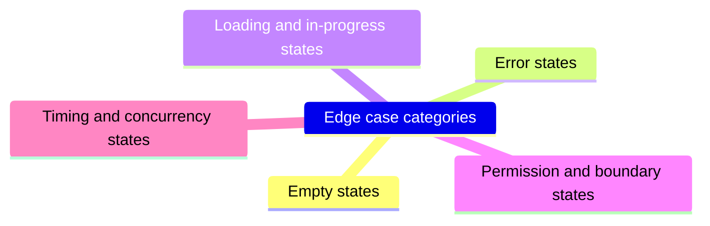
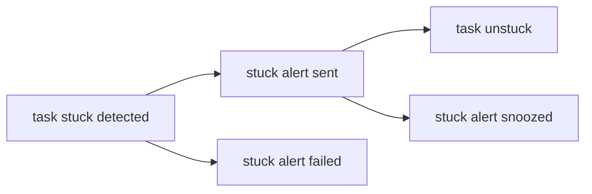

# Lecture 3 — Edge Cases and Instrumentation

> **Duration:** ~2 hours. **Outcome:** You can systematically enumerate a feature's edge cases — empty, error, loading, permission, and timing states — before build starts, and you can specify the exact SQL events a feature must emit so its success is provable with a query, not a feeling.

## 1. Why edge cases are a PM problem, not just a QA problem

Here's the failure mode this lecture exists to prevent: a PRD ships with a clean happy path, engineering builds exactly that, QA finds seventeen edge cases in testing, half of them require a product decision ("what *should* happen here?") that nobody made, and now the PM is making judgment calls under sprint-deadline pressure that should have been made calmly during spec writing. Every one of those seventeen decisions was a **product** decision — QA can tell you a case is *unhandled*, but they usually can't tell you what the *right* behavior is. That's your job, and the whole point of doing it now instead of during a fire.

**The rule this week enforces:** every edge case you can think of gets a stated, deliberate behavior in the PRD — even if that behavior is "explicitly not supported in this iteration, show an error." An unhandled edge case isn't a gap you left blank; it's a decision you made by accident.

## 2. A systematic way to enumerate edge cases

Don't rely on inspiration. Walk a fixed checklist against every story. Five categories catch the overwhelming majority of real edge cases:


*The five-category checklist to walk against every story before build starts.*

### A. Empty states
What does the user see when there's *nothing* yet?

- What does a manager's Stuck Task Alerts settings page show before any alert has ever fired?
- What if a manager has zero direct reports with tasks — is there anything to ever alert on?

### B. Error states
What happens when a dependency fails?

- The Slack API call to send the alert times out or returns an error — does Loopline retry? How many times? Does the manager get a delayed alert, or none?
- The task's assignee has no manager set (a flat-org team, or an org-chart gap) — who gets the alert, if anyone?

### C. Loading / in-progress states
What does the user see mid-operation, and can the state change underneath them?

- A manager opens the in-app Stuck Items view at the exact moment a task crosses 48 hours and the alert is being composed — do they see it immediately, or is there a lag, and is that lag acceptable?

### D. Permission and boundary states
Who is *and isn't* allowed to see or do this, and what happens at the edge of that boundary?

- A manager changes teams mid-week — do they still get alerts for their *old* team's stuck tasks, their *new* team's, both, or a defined transition window?
- An individual contributor (not a manager) — do they ever see this alert, even by accident (e.g., in a shared Slack channel)?

### E. Timing, concurrency, and "it's 2am and nobody's watching" states
The category most PMs forget, and the one that causes the weirdest production bugs:

- A task is reassigned from Alice to Bob at hour 47 of being stuck. Does the 48-hour clock reset (new assignee, presumably new attention) or keep counting (the *task* was stuck regardless of who owns it)? This is a real product decision, not an engineering detail — get it in the PRD as an open question or a stated behavior, don't leave it to whoever implements it to guess.
- The task is marked done at hour 47:59, one minute before the alert would fire. Does the now-queued alert still fire?
- Two different status changes happen in the same second from two different clients (offline sync catching up) — which one "wins" for resetting the stuck clock?
- The task is deleted after the 48-hour clock started but before the alert fires — does a broken-link alert go out, or is it silently cancelled?

Applying all five categories to Stuck Task Alerts produces the edge-case table you'll see in this week's mini-project — roughly a dozen real, non-obvious cases, each with a stated behavior. That table, not the happy-path stories, is usually where a spec earns (or loses) engineering's trust.

## 3. Writing the edge-case table

Keep it compact and scannable — a table, not paragraphs:

| # | Scenario | Expected behavior | Rationale |
|--|----------|-------------------|-----------|
| E1 | Task reassigned at hour 47 (1 hr before threshold) | Stuck clock resets to 0 for the new assignee | A fresh assignee hasn't had a fair 48h to act; alerting immediately would be unfair/noisy |
| E2 | Task marked done 1 minute before alert would fire | Alert is cancelled, never sent | The signal ("intervene before it derails the sync") is now moot |
| E3 | Assignee has no manager on file | No alert sent; task still appears in the passive Stuck Items view | Fail safe to the existing behavior rather than erroring or alerting the wrong person |
| E4 | Slack API call fails/times out | Retry twice with exponential backoff (5s, 30s); if still failing, log a `stuck_alert_failed` event and fall back to no alert (not a crash) | Alert delivery shouldn't be silently lost *or* crash the pipeline |
| E5 | Team disconnects Slack mid-stuck-period (after clock started, before alert fires) | Alert attempt is silently skipped for that occurrence; no error surfaced to the manager | Team explicitly opted out of the channel; respect that immediately |
| E6 | Manager changes teams | Alerts follow their *new* team as of the next stuck-detection cycle; no alerts for the old team going forward | Simplest correct behavior; avoids a manager getting alerts for a team they no longer manage |
| E7 | Two teams share one Slack workspace/channel | Each alert is scoped and addressed to the specific manager via Slack DM, not posted to a shared channel | Prevents noise/privacy leakage across teams sharing infra |
| E8 | Manager has already snoozed this specific task | No alert sent while snoozed; snooze expires after 24h and normal detection resumes | Matches Story 2's intent from Lecture 2 — snooze is a real suppression, not a delay-then-double-alert |

Each row is a **decision**, not a description — "expected behavior" tells an engineer exactly what to build, and "rationale" tells them (and future-you) *why*, so a later edge case that seems similar can be reasoned about consistently instead of arbitrarily.

## 4. Instrumentation — specifying the events a feature must emit

A feature you can't measure is a feature you're guessing about. This section of the PRD (feeding the "Success metrics" section from Lecture 1) specifies the **exact events**, their **properties**, and **where they're queryable** — in SQL, against a real schema, never "we'll check a dashboard someone else owns" or, worse, a spreadsheet someone manually updates.

### Step 1 — name the events the feature needs that don't exist yet

Recall this week's seed `events` table only has `task_created`, `task_assigned`, and `task_status_changed`. Stuck Task Alerts needs new events to be measurable at all:

| Event name | Fires when | Key properties |
|---|---|---|
| `task_stuck_detected` | A task crosses the 48h no-activity threshold | `task_id`, `team_id`, `assignee_id`, `manager_id`, `hours_stuck` |
| `stuck_alert_sent` | A Slack alert is successfully delivered | `task_id`, `manager_id`, `channel` (`slack_dm`), `latency_ms` (time from detection to send) |
| `stuck_alert_failed` | A Slack delivery attempt exhausts its retries | `task_id`, `manager_id`, `failure_reason` |
| `stuck_alert_snoozed` | A manager snoozes an alert for a task | `task_id`, `manager_id`, `snooze_hours` |
| `stuck_alert_opted_out` | A manager disables the feature entirely | `manager_id`, `team_id` |
| `task_unstuck` | A stuck task receives any status-changing activity | `task_id`, `hours_since_stuck_detected`, `triggering_event` (`status_changed` / `reassigned` / `commented`) |


*The event lifecycle a stuck task moves through, from detection to resolution.*

### Step 2 — write the CREATE TABLE addition or a compatible new table

You don't redesign the whole schema — you extend it. Since the seed `events` table is already generic (`event_name` + a `properties` JSON blob), most new events fit into the *existing* table without a migration:

```sql
-- No new table needed for most of these — they fit the existing generic
-- events table. Example inserts showing the shape each new event takes:

INSERT INTO events (event_id, event_name, task_id, user_id, team_id, occurred_at, properties)
VALUES (11, 'task_stuck_detected', 501, 18, 3, '2026-06-03 09:03:00',
        '{"assignee_id":18,"manager_id":12,"hours_stuck":48}');

INSERT INTO events (event_id, event_name, task_id, user_id, team_id, occurred_at, properties)
VALUES (12, 'stuck_alert_sent', 501, 12, 3, '2026-06-03 09:04:00',
        '{"manager_id":12,"channel":"slack_dm","latency_ms":42000}');
```

If an event needs a property no other event has (e.g., `failure_reason` only matters for `stuck_alert_failed`), that's exactly what the flexible `properties` JSON column is for — you don't need a new rigid column per event type. State this explicitly in the PRD so engineering knows not to over-engineer a new table for a one-off field.

### Step 3 — write the queries success metrics depend on, before build

This is the step almost every PRD skips, and it's the one that catches instrumentation gaps *before* they're expensive. Write the actual SQL you'll run post-launch, using the schema you just specified:

```sql
-- Primary metric: median hours from detection to the task being
-- un-stuck, comparing to the pre-launch baseline (manual sync only).
SELECT
    AVG(CAST(json_extract(u.properties, '$.hours_since_stuck_detected') AS REAL))
        AS avg_hours_to_unstick
FROM events u
WHERE u.event_name = 'task_unstuck';

-- Secondary metric: % of sent alerts "acted on" within 24h.
SELECT
    COUNT(DISTINCT CASE WHEN u.event_id IS NOT NULL THEN s.task_id END) * 1.0
        / COUNT(DISTINCT s.task_id) AS pct_acted_on_within_24h
FROM events s
LEFT JOIN events u
    ON u.task_id = s.task_id
   AND u.event_name = 'task_unstuck'
   AND u.occurred_at BETWEEN s.occurred_at AND datetime(s.occurred_at, '+24 hours')
WHERE s.event_name = 'stuck_alert_sent';

-- Guardrail: opt-out rate among eligible managers in the first 4 weeks.
SELECT
    COUNT(DISTINCT o.user_id) * 1.0 / COUNT(DISTINCT m.user_id) AS opt_out_rate
FROM (SELECT DISTINCT user_id FROM events WHERE event_name = 'stuck_alert_sent') m
LEFT JOIN events o
    ON o.user_id = m.user_id AND o.event_name = 'stuck_alert_opted_out';
```

If, while writing this query, you realize you *can't* answer "what % of alerts were acted on" because you never specified how to link a `task_unstuck` event back to the specific alert that (maybe) caused it — that's a real gap, and you just found it during spec writing, at zero cost, instead of during a launch retro when someone asks "did this even work?" and the honest answer is "we can't tell."

## 5. The instrumentation section of the PRD

State it plainly, right after the edge-case table:

```markdown
## Instrumentation

New events (added to the existing `events` table, no schema migration
needed — see resources.md for the full properties spec):

- `task_stuck_detected` — fires once per stuck occurrence
- `stuck_alert_sent` / `stuck_alert_failed` — delivery outcome
- `stuck_alert_snoozed` / `stuck_alert_opted_out` — manager actions
- `task_unstuck` — closes the loop, links back to the stuck period

Every success metric in this PRD is answerable via SQL against these
events with no manual data pulls. Draft queries: see engineering
design doc / analytics-queries.sql.
```

## 6. Check yourself

- Name the five categories of edge cases this lecture teaches, from memory.
- Why is an unhandled edge case "a decision made by accident" rather than just a gap?
- For Stuck Task Alerts, what should happen if a task is reassigned one hour before the alert threshold — and why is "the engineer's best guess" the wrong way to answer that?
- Why write the post-launch SQL queries *during* spec writing instead of after launch?
- What's the difference between the "Success metrics" section (Lecture 1) and the "Instrumentation" section — why do you need both?
- Give one example of an edge case that's really a product decision disguised as a technical detail.

If those are automatic, you're ready for this week's exercises and the mini-project — writing the full Stuck Task Alerts PRD end to end.

## Further reading

- **Google, "Site Reliability Engineering" — ch. on error states and graceful degradation (free online book):** <https://sre.google/sre-book/table-of-contents/>
- **Segment, "Tracking Plan" guide (naming/structuring analytics events):** <https://segment.com/docs/getting-started/04-full-install/>
- **PostgreSQL — JSON functions (`json_extract`-equivalent via `->>`/`jsonb`):** <https://www.postgresql.org/docs/current/functions-json.html>
- **SQLite — JSON1 extension (`json_extract`):** <https://www.sqlite.org/json1.html>
