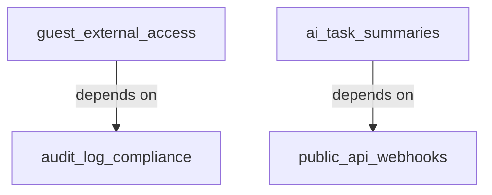
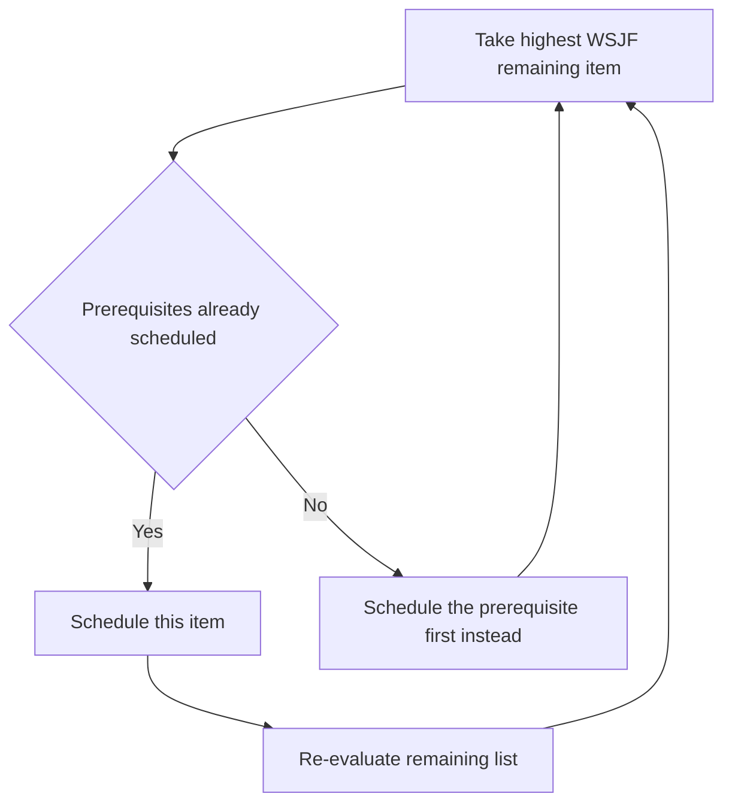

# Lecture 2 — Cost of Delay and Sequencing

> **Duration:** ~2 hours. **Outcome:** You can compute cost of delay and WSJF for a backlog in SQL, explain concretely why WSJF and RICE can rank the same items in opposite orders, and sequence a backlog under real dependencies instead of pure score order.

## 1. The question RICE can't answer: does *when* matter?

RICE and weighted scoring both answer "how much value per unit of effort." Neither one asks **"what does it cost us to wait?"** — and for a real backlog, that omission is not a rounding error. Go back to Lecture 1's ranking: `guest_external_access` (three signed enterprise deals, actively blocked) scored a RICE of 12 — thirteenth out of fourteen items. RICE isn't broken; it's just answering a question that doesn't include urgency. A framework that ignores time will always undervalue anything with a deadline, a competitor move, or a compounding cost — which describes a meaningful slice of any real backlog.

**Cost of delay (CoD)** is the fix: it puts a number on what you lose, per unit of time, by *not* shipping something now. **WSJF (Weighted Shortest Job First)**, from the Scaled Agile Framework, combines cost of delay with job size to answer the actual sequencing question: *given everything has a cost of waiting and a cost of building, what order minimizes total pain?*

## 2. Cost of delay: three components

SAFe's practical formulation breaks cost of delay into three additive components, each scored on the same relative scale (this course uses 1–10; SAFe often uses Fibonacci — the math works either way as long as you're consistent within one backlog):

| Component | Question | Example from this week's backlog |
|---|---|---|
| **User-Business Value (UBV)** | How much direct value — to users, or straight to revenue — does this deliver? | `guest_external_access`: 9/10 — three signed deals depend on it |
| **Time Criticality (TC)** | Does the value decay if we wait? Is there a deadline, a market window, a compounding cost? | `guest_external_access`: 9/10 — deals have close dates; `dark_mode`: 1/10 — no clock is running on it |
| **Risk Reduction / Opportunity Enablement (RR-OE)** | Does shipping this reduce a risk, or unlock other future work? | `public_api_webhooks`: 8/10 — low direct user value today, but it's the prerequisite for a whole class of future integrations |

$$\text{Cost of Delay} = \text{UBV} + \text{TC} + \text{RR-OE}$$

Notice RR-OE is why `public_api_webhooks` isn't just "a low-Impact, high-Effort item nobody's asking for directly" — its value is almost entirely in what it *enables*, which UBV and TC alone would miss. This is the component to reach for when engineering says "we should build this" and product's first instinct is "but no user asked for it" — RR-OE is where you make platform, infrastructure, and risk-reduction work commensurable with user-facing features, instead of it always losing a straight popularity contest.

## 3. WSJF: dividing cost of delay by job size

Cost of delay alone still doesn't account for effort — a huge cost-of-delay item that takes a year competes unfairly against a slightly smaller one that ships in a sprint. WSJF finishes the thought:

$$\text{WSJF} = \frac{\text{Cost of Delay}}{\text{Job Size}} = \frac{\text{UBV} + \text{TC} + \text{RR-OE}}{\text{Job Size}}$$

Same shape as RICE — value-ish numerator over effort-ish denominator — but the numerator is explicitly about *value over time*, not just magnitude. Run it in SQL against the seed:

```sql
SELECT
    item_key,
    title,
    user_business_value AS ubv,
    time_criticality AS tc,
    risk_reduction_opp_enable AS rr_oe,
    (user_business_value + time_criticality + risk_reduction_opp_enable) AS cost_of_delay,
    job_size_points,
    ROUND(
        (user_business_value + time_criticality + risk_reduction_opp_enable) * 1.0 / job_size_points,
        2
    ) AS wsjf
FROM backlog_items
ORDER BY wsjf DESC;
```

## 4. RICE vs. WSJF, side by side, on the same backlog

This is the moment this lecture is built around. Run both queries and put the two rankings next to each other:

| Item | RICE score | RICE rank | WSJF score | WSJF rank |
|---|---:|---:|---:|---:|
| `guest_external_access` | 12.0 | 10 | 4.00 | **1** |
| `configurable_stuck_threshold` | 12.8 | 9 | 3.80 | **2** |
| `audit_log_compliance` | 5.76 | 11 | 3.60 | **3** |
| `bulk_task_reassignment` | 36.0 | 6 | 3.50 | 4 |
| `stuck_alert_digest_mode` | 37.33 | 5 | 3.33 | 5 |
| `task_templates` | 133.33 | **3** | 2.67 | 6 |
| `recurring_tasks` | 190.0 | **1** | 2.00 | 7 |
| `custom_fields` | 3.13 | 13 | 1.75 | 8 |
| `mobile_push_notifications` | 75.0 | 4 | 1.75 | 8 |
| `advanced_search_filters` | 30.0 | 7 | 1.60 | 10 |
| `dark_mode` | 150.0 | **2** | 1.33 | 11 |
| `time_tracking_integration` | 3.75 | 12 | 1.25 | 12 |
| `public_api_webhooks` | 2.77 | **14** | 1.23 | 13 |
| `ai_task_summaries` | 14.6 | 8 | 0.92 | **14** |

Three things jump out, and each is a real lesson, not a quirk of made-up numbers:

1. **`guest_external_access` flips from 10th to 1st.** RICE's Reach (20 teams) is small in absolute terms — but those 20 teams include three that have already signed contracts contingent on this feature. WSJF's Time Criticality component captures "this has a closing date" in a way Reach simply can't. **Lesson: when an item has a hard external deadline or a signed commitment, cost of delay — not RICE — should drive the sequencing conversation.**

2. **`dark_mode` flips from 2nd to 11th, and `recurring_tasks` drops from 1st to 7th (while staying solidly mid-table, not falling off a cliff).** Dark mode's huge Reach number (vote count, not usage) evaporates once you ask "does waiting cost us anything?" — no. Recurring tasks is genuinely valuable (Kano confirmed it's a Must-be) but isn't *urgent* the way a signed deal is; it belongs in a near-term roadmap slot, just not necessarily the very first one. **Lesson: RICE measures value density; WSJF measures value-weighted-by-urgency. A feature can be genuinely good and still not be the most urgent thing to build this sprint.**

3. **`public_api_webhooks` is dead last on RICE (2.77, 14th) and still near the bottom on WSJF (1.23, 13th) — but look at *why* it's not dead last there too.** Its direct Reach is tiny (15 integration partners) and its Effort is the second-highest in the backlog — RICE punishes it twice with no offsetting factor. WSJF's RR-OE component (scored 8/10 — enabling a whole future integration ecosystem) is the only thing keeping it off the absolute floor; without RR-OE it would score even lower than `ai_task_summaries`. **Lesson: neither framework fully solves platform/infrastructure work on its own — RR-OE is a partial correction, and a PM's written judgment about strategic bets still has to carry the rest of the decision.**

**The takeaway is not "always trust WSJF over RICE."** It's: **run both, and treat a large disagreement between them as a signal to look closer, not as a tiebreak to average away.** When RICE and WSJF roughly agree, you have a clean case. When they disagree sharply — as with `guest_external_access` and `dark_mode` here — that disagreement is the most important thing in the whole exercise, and it's exactly what you write into a roadmap doc's rationale, not something you hide behind a single blended number.

## 5. Sequencing under dependencies

A ranked list assumes every item is independently shippable in any order. Real backlogs aren't like that. This week's seed has two hard dependencies:

```sql
SELECT * FROM backlog_dependencies;
```

```
item_key                depends_on_item_key    reason
guest_external_access   audit_log_compliance   Security review for the 3 blocked deals requires
                                                an audit trail of guest actions before external
                                                access can be enabled.
ai_task_summaries       public_api_webhooks    Summary generation needs a stable event/webhook
                                                feed to consume task activity; building it against
                                                the old internal-only pipeline would be thrown away.
```


*The two hard dependencies this week's backlog imposes on sequencing.*

Look at what this does to the WSJF-ranked list: `guest_external_access` is #1, but it **cannot ship before** `audit_log_compliance`, which is #3. That's actually a lucky case — the prerequisite is *also* highly ranked, so building it first barely costs you anything. Contrast with `ai_task_summaries` (WSJF rank 14, dead last) depending on `public_api_webhooks` (WSJF rank 13, second-to-last) — here the dependency doesn't change the story much either, because both items are already low priority. But dependencies don't always cooperate with your ranking that neatly — it's entirely possible for a #1-ranked item to depend on a #12-ranked one, which forces the #12 item up the schedule regardless of its own score.

**The rule: dependencies are a hard constraint, scores are a soft ranking.** Find dependencies with a query, then sequence by walking the WSJF-ranked list top to bottom and, for each item, checking whether its prerequisites are already scheduled:

```sql
-- Which items have unmet prerequisites, given a WSJF ranking?
SELECT
    b.item_key,
    b.title,
    d.depends_on_item_key,
    dep.title AS prerequisite_title
FROM backlog_items b
JOIN backlog_dependencies d ON d.item_key = b.item_key
JOIN backlog_items dep ON dep.item_key = d.depends_on_item_key;
```

For a two-dependency backlog you can resolve this by inspection. For a larger one, the general algorithm is a **topological sort** constrained by score: at each step, pick the highest-WSJF item whose prerequisites are already scheduled; if the top-ranked remaining item has an unscheduled prerequisite, schedule the prerequisite first (even though it "jumps the queue" on its own score) and re-evaluate. This is precisely what Exercise 3 and the mini-project have you do by hand on this week's 14-item backlog, and it's the mechanical core of Lecture 3's now/next/later assembly.


*The topological-sort-constrained-by-score loop that turns a WSJF ranking into a valid build sequence.*

## 6. A subtlety: cost of delay compounds, RICE doesn't

One more reason cost of delay deserves its own framework rather than being folded into RICE's Impact score: **cost of delay is often not flat over time.** A deal-blocking feature's cost of delay might be small this week and enormous the week the contract's exclusivity clause expires. A compliance feature's cost of delay might jump discontinuously the day a new regulation takes effect. RICE's Impact score is a static snapshot; WSJF's Time Criticality component is explicitly asking "does this get worse if we wait," which is a fundamentally different, time-aware question. When you're scoring Time Criticality, ask: *if we ship this in one quarter vs. two, is the value roughly the same, or does it fall off a cliff?* A "falls off a cliff" answer should push TC toward the top of the scale, independent of how big the feature otherwise is.

## 7. Check yourself

- Write the WSJF formula from memory, and name its three cost-of-delay components.
- Explain, using this week's own numbers, why `guest_external_access` ranks 10th on RICE but 1st on WSJF.
- What does the Risk Reduction / Opportunity Enablement component let you account for that User-Business Value and Time Criticality can't?
- Why is "always use WSJF, never RICE" the wrong lesson to take from this lecture?
- Given a dependency where a low-WSJF item is a hard prerequisite for a high-WSJF item, what does the sequencing rule tell you to do?
- Give an example (not from this lecture) of a feature whose Time Criticality would jump sharply at a specific date, and explain why.

If those are automatic, Lecture 3 takes the sequenced, scored backlog and turns it into an actual roadmap document — now/next/later, tied to outcomes, honest about uncertainty.

## Further reading

- **Scaled Agile Framework, "WSJF" (official, canonical reference):** <https://scaledagileframework.com/wsjf/>
- **Don Reinertsen, *The Principles of Product Development Flow* — the book that introduced cost of delay to software teams (summary/excerpts):** <https://www.scaledagileframework.com/cost-of-delay/>
- **Black Swan Farming, "Cost of Delay" primer (Joshua Arnold, building on Reinertsen):** <https://blackswanfarming.com/cost-of-delay/>
- **Atlassian, "How to prioritize with WSJF":** <https://www.atlassian.com/agile/product-management/prioritization-framework>
