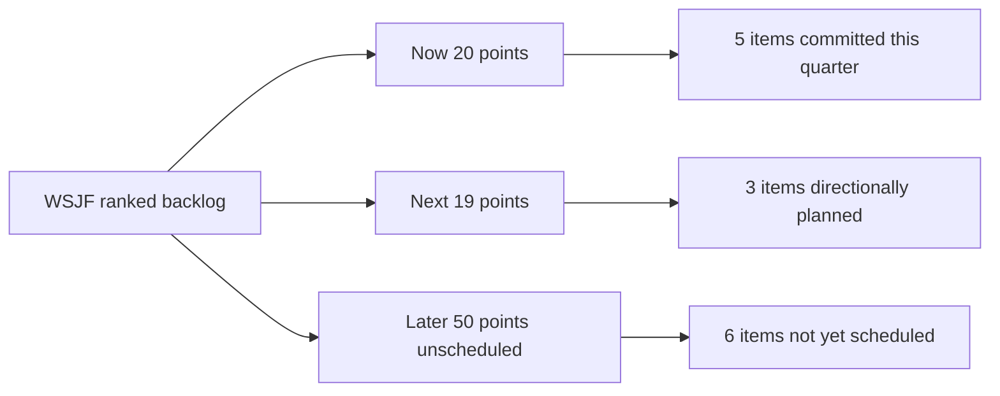

# Lecture 3 — Outcome-Based Roadmaps

> **Duration:** ~2 hours. **Outcome:** You can assemble a capacity-constrained now/next/later roadmap in pandas from scored, sequenced backlog data; tie every roadmap item to a stated outcome and metric; and write roadmap language that communicates real uncertainty instead of hiding it behind a fake date.

## 1. What a roadmap is for — and what it isn't

A roadmap is the artifact that turns "we scored and sequenced the backlog" (Lectures 1–2) into something a Sales VP, an exec, and an engineer can each glance at and understand what's coming and why. Done badly, a roadmap is a list of feature names next to quarters that turn into promises the moment someone screenshots it into a sales deck. Done well, a roadmap is:

- **Outcome-tied** — every item says what result it's supposed to produce, not just what gets built.
- **Honest about certainty** — "Now" items are committed; "Later" items are directional, and the roadmap says so out loud.
- **Capacity-constrained** — it reflects how much the team can actually do, not how much stakeholders want done.
- **Sequenced correctly** — it respects the hard dependencies from Lecture 2, not just a raw score order.

**A roadmap is not a Gantt chart of features and ship dates.** The moment you put a specific date next to a "Later" item, you've converted a hypothesis into a commitment, and the next conversation with that stakeholder is about why you missed the date instead of about whether the item was even still the right thing to build.

## 2. Now / Next / Later — what each column actually promises

| Column | Time horizon | Certainty | What it promises |
|---|---|---|---|
| **Now** | This quarter, already sequenced | High — this is committed, capacity-checked work | "We are building this. Here's the outcome we expect and by when." |
| **Next** | Following quarter, directionally scoped | Medium — scored and likely, not yet capacity-locked | "This is where we're leaning, pending Now's outcomes and no major surprises." |
| **Later** | Backlog, not yet scheduled | Low — validated idea, not a plan | "We believe this matters. We haven't committed engineering time or a date." |

The columns are deliberately *not* labeled "Q1 / Q2 / Q3" or given specific dates beyond Now. That's the single biggest practical difference between an outcome-based roadmap and a project-management Gantt chart: **Now/Next/Later communicates confidence, a calendar communicates false precision.**

## 3. Assembling the roadmap: capacity first

A roadmap without a stated capacity constraint is just a wish list sorted by score. Before you can say what's "Now," you have to say how much "Now" can hold. This week, Loopline's assumption (state assumptions like this explicitly, always): **the engineering team has ~20 job-size points of capacity per quarter** — small enough that hard choices are unavoidable, which is the realistic case for almost every real team.

Pull the WSJF-ranked, dependency-resolved backlog from Lecture 2 into pandas and walk it, respecting both the score order and the capacity ceiling:

```python
import pandas as pd
from sqlalchemy import create_engine

# SQLite: engine = create_engine("sqlite:///loopline_backlog.db")
engine = create_engine("postgresql://localhost/loopline_backlog")

backlog = pd.read_sql("""
    SELECT
        item_key,
        title,
        requested_by,
        job_size_points,
        ROUND((user_business_value + time_criticality + risk_reduction_opp_enable) * 1.0
              / job_size_points, 2) AS wsjf
    FROM backlog_items
""", engine)

deps = pd.read_sql("SELECT * FROM backlog_dependencies", engine)

backlog = backlog.sort_values("wsjf", ascending=False).reset_index(drop=True)
print(backlog)
```

Now walk the ranked list, respecting dependencies, and bucket into Now (capacity 20 points) then Next (capacity ~20 points) then everything else into Later:

```python
NOW_CAPACITY = 20
NEXT_CAPACITY = 20

scheduled = []          # item_keys already placed, in order
now_items, next_items = [], []
now_points = next_points = 0

def prerequisites_met(item_key, scheduled):
    prereqs = deps.loc[deps["item_key"] == item_key, "depends_on_item_key"]
    return all(p in scheduled for p in prereqs)

remaining = backlog.copy()
while not remaining.empty:
    # Prefer the highest-WSJF remaining item whose prerequisites are already scheduled.
    eligible = remaining[remaining["item_key"].apply(lambda k: prerequisites_met(k, scheduled))]
    if eligible.empty:
        # No eligible item — pull in whichever unmet prerequisite unblocks the most value.
        blocked_key = remaining.iloc[0]["item_key"]
        prereq_key = deps.loc[deps["item_key"] == blocked_key, "depends_on_item_key"].iloc[0]
        row = remaining[remaining["item_key"] == prereq_key].iloc[0]
    else:
        row = eligible.iloc[0]

    points = row["job_size_points"]
    if now_points + points <= NOW_CAPACITY and len(now_items) < len(backlog):
        bucket, now_points = now_items, now_points + points
    elif next_points + points <= NEXT_CAPACITY:
        bucket, next_points = next_items, next_points + points
    else:
        bucket = None  # falls to Later by default (handled after the loop)

    if bucket is not None:
        bucket.append(row["item_key"])
        scheduled.append(row["item_key"])
    else:
        scheduled.append(row["item_key"])  # still "seen," just not Now/Next
    remaining = remaining[remaining["item_key"] != row["item_key"]]

later_items = [k for k in backlog["item_key"] if k not in now_items and k not in next_items]
print("Now:", now_items, "\nNext:", next_items, "\nLater:", later_items)
```

Running the full version of this logic against this week's seed (worked in full in Exercise 3) produces:

- **Now (20 pts):** `guest_external_access` (5) → `audit_log_compliance` (5, pulled forward as a hard prerequisite) → `configurable_stuck_threshold` (5) → `bulk_task_reassignment` (2) → `stuck_alert_digest_mode` (3)
- **Next (19 pts):** `task_templates` (3), `recurring_tasks` (8), `mobile_push_notifications` (8)
- **Later (50 pts, unscheduled):** `advanced_search_filters`, `custom_fields`, `time_tracking_integration`, `public_api_webhooks`, `dark_mode`, `ai_task_summaries`


*How the WSJF-ranked, dependency-resolved backlog splits into Now, Next, and Later under a 20-point capacity cap.*

Notice `audit_log_compliance` sits in Now even though its own WSJF rank (3rd) would already put it there on merit — the dependency and the score happen to agree this time, which is worth calling out explicitly in the roadmap doc rather than presenting as pure coincidence.

## 4. Tying every item to an outcome and a metric

A roadmap that just lists feature names invites the question "why though?" — and invites scope creep, because a feature name alone doesn't say what "done" means. Every Now and Next item needs a one-line **outcome** (the change in the world) and a **metric** (how you'll know), pulling directly from the discipline Week 4 taught for PRD success metrics:

| Item | Outcome | Metric |
|---|---|---|
| `guest_external_access` | Unblock the 3 enterprise deals contingent on external collaborator access | 3/3 deals move from "blocked" to "closed" or "in security review" within 6 weeks of ship |
| `audit_log_compliance` | Pass the SOC 2 questionnaire items that reference audit trails | Security review sign-off; 0 open audit-related findings |
| `configurable_stuck_threshold` | Stop the 2 renewal escalations caused by a fixed 48h threshold not matching enterprise workflows | Both accounts confirm threshold now matches their process; escalation ticket closed |
| `recurring_tasks` | Close the gap identified as the #1 user-research verbatim request | Adoption: % of active teams creating ≥1 recurring task within 30 days of GA |

Writing this table *before* the roadmap ships anywhere is the same discipline as Week 4's PRD success-metrics section — and it should be queryable the same way, against real event data, once Week 6 gets into product analytics. A roadmap item with no metric is a promise nobody can ever prove was kept.

## 5. Communicating uncertainty honestly

The single most common roadmap failure isn't picking the wrong items — it's **overstating certainty** on Next and Later items until a stakeholder treats them as promises. Concrete language rules this course uses:

- **Now:** "We are building X this quarter. Target: [outcome]." Committed language, because it's capacity-checked.
- **Next:** "We expect to work on Y next quarter, pending [named dependency/risk]." Directional language with a named condition — never a date.
- **Later:** "We believe Z matters because [evidence: RICE/Kano/WSJF finding]. It is not yet scheduled." No promise of *when*, ever — only *why it's on the list at all*.
- **Anything explicitly deprioritized** (like `dark_mode` after Kano showed it's mostly Indifferent): say so, with the reason, rather than silently dropping it and letting the forum wonder. *"Dark Mode remains a valid request — Kano data shows it's mostly Indifferent to satisfaction (Better 0.25, Worse ≈0), so we're not scheduling engineering time against it this half. We'll revisit if usage data changes that picture."* That sentence does more to prevent a repeat "when is dark mode coming" thread than silence ever will.

**A roadmap that says "TBD" or "not yet scheduled, here's why" out loud is more trustworthy, not less, than one that fills every cell with an optimistic guess.** Stakeholders forgive an honest "later" far more readily than they forgive a broken "Q2" promise.

## 6. The roadmap as a living, queryable document

Because Now/Next/Later live in the same database as the scores, dependencies, and (eventually) shipped-status, the roadmap isn't a static slide — it's a query. When priorities shift (a fourth deal gets signed, a Kano survey gets rerun with fresh data), you re-run the same sequencing logic against updated numbers instead of manually redrawing a slide. That's the concrete payoff of having done Lectures 1–2's scoring in SQL instead of a spreadsheet: the roadmap you present in the all-hands is one `SELECT` and one pandas script away from being current again, every time the inputs change.

## 7. Check yourself

- In one sentence each, what does "Now," "Next," and "Later" promise, and how does the certainty differ?
- Why is putting a specific date on a "Later" item a mistake, even if you're fairly confident about it?
- What capacity number did this lecture assume for "Now," and why does stating that number explicitly matter?
- Write the outcome + metric pair for one Now item, in your own words, without copying the table above.
- What's the honest way to communicate that a loudly-requested feature (like Dark Mode) is being deprioritized, rather than just dropping it silently?
- Why does keeping the backlog in a database, rather than a slide, make the roadmap easier to keep current?

If those are automatic, you're ready for this week's exercises, which have you run this exact scoring → sequencing → roadmap pipeline yourself, and the challenges, which put you in the room defending it.

## Further reading

- **SVPG (Marty Cagan), "Roadmaps":** <https://www.svpg.com/roadmaps/>
- **ProductPlan, "Now-Next-Later Roadmap":** <https://www.productplan.com/glossary/now-next-later-roadmap/>
- **Janna Bastow (creator of the Now-Next-Later format), "Introducing the Now-Next-Later Roadmap":** <https://www.mindtheproduct.com/now-next-later-roadmaps-janna-bastow-mind-the-product/>
- **pandas documentation, "Group by: split-apply-combine" (useful for capacity-bucket logic like this lecture's):** <https://pandas.pydata.org/docs/user_guide/groupby.html>
