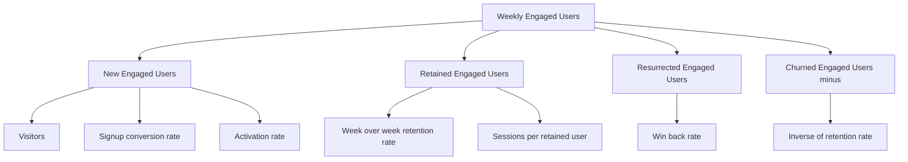

# Lecture 1 — North Star and Metric Trees

> **Duration:** ~2 hours. **Outcome:** You can pick a defensible North Star Metric (NSM) for a product, decompose it into a metric tree of input metrics, and name the vanity metrics and gameable metrics you deliberately rejected — with a one-paragraph justification for each choice.

## 1. Why "how's the product doing?" needs one number, not twenty

Ask five people at a startup "is the product doing well?" and you'll get five different dashboards. Growth points at signups. Sales points at pipeline. Support points at ticket volume going down. Engineering points at uptime. Every one of those numbers can go up while the actual product — the thing users open Loopline for — quietly rots.

A **North Star Metric (NSM)** is the single metric a team agrees captures the core value the product delivers to users, measured in a way that also correlates with long-term business success. It's not the *only* metric anyone tracks — it's the metric that, when it's healthy, gives you confidence everything downstream (revenue, retention, referrals) will follow.

The classic definition, from the team that popularized the term (Sean Ellis / the "Growth Hackers" school, later formalized by Amplitude):

> A North Star Metric is the single metric that best captures the core value your product delivers to customers.

Three properties every real NSM has:

1. **It reflects customer value, not company convenience.** "Revenue" is a company outcome, not a value signal — a product can extract revenue from users who hate it (see: a lot of predatory apps). A good NSM measures something the *user* wanted, that then produces revenue as a side effect.
2. **It's a leading indicator, not a lagging one.** Revenue and churn are lagging — they tell you what already happened. A good NSM moves *before* those lagging metrics do, so you can act on it.
3. **It's a single, trackable number over time**, not a bundle, not a dashboard, not "it depends." If you can't state it as "the count/rate of X per Y," it isn't one yet.

## 2. Choosing Loopline's North Star

Loopline is a team task-management app. What's the moment a team actually got value from it? Not "signed up" — that's an application of will, not a receipt of value. Not "logged in" — you can log in and stare at an empty screen. The value Loopline delivers is: **a team gets things done because they used Loopline to track them.** The unit of value is a completed task, done by someone who's actually engaged, repeatedly, over time.

**Loopline's North Star Metric: Weekly Engaged Users (WEU)** — the count of distinct users who complete at least one task in a trailing 7-day window.

```sql
-- Weekly Engaged Users as of a given date (Postgres & SQLite)
SELECT COUNT(DISTINCT user_id) AS weekly_engaged_users
FROM events
WHERE event_name = 'task_completed'
  AND event_time >= '2025-02-14'::timestamp - interval '6 days'   -- Postgres
  AND event_time <  '2025-02-14'::timestamp + interval '1 day';
```

```sql
-- SQLite equivalent
SELECT COUNT(DISTINCT user_id) AS weekly_engaged_users
FROM events
WHERE event_name = 'task_completed'
  AND event_time >= datetime('2025-02-14', '-6 days')
  AND event_time <  datetime('2025-02-14', '+1 day');
```

Why this metric and not the four obvious alternatives:

| Candidate | Why it loses to WEU |
|---|---|
| Total registered users | Never decreases, so it can't tell you the product is *failing* someone already inside it — it's a monotonic counter dressed up as a health metric. |
| Tasks created | Measures intent, not delivered value. A user can create fifty tasks and finish none of them — that's a product that's failing at its actual job. |
| Logins per week | Measures presence, not value. You can log in daily out of habit or anxiety and never do the thing the product exists for. |
| Monthly recurring revenue | A real lagging outcome, worth tracking — but it moves slower than product health and can rise even while engagement quietly erodes (e.g. price increases, or annual contracts masking churn). It belongs on the dashboard, just not as the NSM. |

Notice the pattern: each rejected candidate captures *effort or presence*, not *delivered value*. WEU requires the hardest, most meaningful action in the product's core loop — finishing a task — and it resets every week, so it can't just accumulate forever like a signup counter.

## 3. Vanity metrics vs. real metrics

A **vanity metric** is any number that goes up and to the right almost no matter what you do, and tells you nothing actionable. The test: *if this number goes up, do you know what to do differently?* If the answer is "no, it just... goes up," it's vanity.

Common vanity metrics in a task-management product like Loopline:

- **Total signups (cumulative).** Only ever increases. Says nothing about whether anyone stayed.
- **Total pageviews.** A user refreshing a broken page ten times looks identical to ten users loving the product.
- **App store downloads.** Measures curiosity, not usage — and can spike from a single press mention with zero product change.
- **Total tasks ever created.** Includes every abandoned, duplicate, and test task since launch. Never goes down even as the product dies.

Contrast with a **real metric** — WEU, week-4 retention rate, activation rate — each of which can go *down*, and each of which tells you exactly where to look when it does.

## 4. Gameable metrics — the trap one level up from vanity

A metric can be non-vanity (it goes down sometimes, it's actionable) and *still* be dangerous, because a team under pressure can move the number without moving the underlying value. That's a **gameable metric**.

Example: if Loopline's PM team is evaluated on "tasks created per user," a designer eager to hit the number could:

- Add a nagging "Quick Add Task" button that pre-fills junk tasks ("Follow up", "Review", "Check in") — inflates the metric, adds noise to the product.
- Auto-create a task for every calendar event synced — inflates the metric, annoys users who didn't ask for it.

Neither change makes a single team more productive. Both would move the KPI. That's the tell: **a gameable metric can be increased through a change that a reasonable person would call a regression.**

The defense against gameable metrics is almost always **pairing a volume metric with a quality or ratio metric** — a "guardrail." If "tasks created" is the volume metric, pair it with "% of created tasks completed within 14 days." Gaming the volume metric now visibly tanks the completion rate, and the dashboard catches the cheat.

```sql
-- Guardrail check: what fraction of created tasks actually get completed?
-- (Uses the first task_created and first task_completed per user as a
--  rough per-user proxy; a production version would track task-level IDs.)
WITH created AS (
    SELECT user_id, COUNT(*) AS n_created
    FROM events WHERE event_name = 'task_created' GROUP BY user_id
),
completed AS (
    SELECT user_id, COUNT(*) AS n_completed
    FROM events WHERE event_name = 'task_completed' GROUP BY user_id
)
SELECT
    c.user_id,
    c.n_created,
    COALESCE(d.n_completed, 0) AS n_completed,
    ROUND(100.0 * COALESCE(d.n_completed, 0) / c.n_created, 1) AS pct_completed
FROM created c
LEFT JOIN completed d ON d.user_id = c.user_id
ORDER BY pct_completed ASC
LIMIT 10;
```

Run that against the seed data and you'll see it flags exactly the users worth a closer look — high task creation, low completion. That's the diagnostic a volume-only metric can never give you.

## 5. Building a metric tree

Once you have an NSM, the next job is decomposing it into the handful of **input metrics** that, added or multiplied together, explain it. This is a **metric tree** (also called a "driver tree"). It answers the question every exec eventually asks: "WEU dropped 8% this week — *why*?" Without a tree, you're guessing. With one, you check each branch.

The cleanest decomposition for a weekly active-user metric is **growth accounting**, borrowed from Chamath Palihapitiya's Facebook growth team and now industry-standard:

```
Weekly Engaged Users (this week)
  =  New       (first-ever engaged this week)
  +  Retained  (engaged last week AND engaged this week)
  +  Resurrected (engaged this week, NOT engaged last week, but engaged at some earlier point)
  -  Churned   (engaged last week, NOT engaged this week)  ← subtracted from *next* week's total, shown for context
```

Each of those four branches has its own input metrics, one layer down:

```
WEU
├── New Engaged Users
│   ├── Visitors (landing_page_view)
│   ├── Signup conversion rate  (signup_completed / signup_started)
│   └── Activation rate         (% of new signups who cross the activation threshold)
├── Retained Engaged Users
│   ├── Week-over-week retention rate (by cohort)
│   └── Sessions per retained user
├── Resurrected Engaged Users
│   └── Win-back / re-engagement rate (dormant users who return)
└── Churned Engaged Users  (subtracted)
    └── Inverse of retention rate
```

Read the tree top to bottom and it tells a story: WEU is healthy if the top of the funnel is wide (Visitors), the funnel converts well (signup rate, activation rate), and the people who do activate keep coming back (retention rate) faster than they leave (churn). A single WEU number hides all of that; the tree makes every lever visible and, critically, **assignable** — a growth PM owns the top branch, a core-product PM owns retention, and nobody argues about whose job it is when the number moves.


*Loopline's North Star decomposes into four growth-accounting branches, each with its own input metrics.*

You'll build the SQL for every one of these branches this week: the funnel branch in Lecture 2, and the retention/resurrection/churn branches in Lecture 3.

## 6. A worked example: reading Loopline's tree top-down

Say WEU for the week of Feb 14 comes back low relative to Feb 7. A metric-tree-literate PM does not say "usage is down, we should investigate." They check branches, cheapest first:

1. **Visitors** — did the marketing team stop running ads that week? (Check `landing_page_view` volume.)
2. **Signup conversion** — did a signup-flow bug ship? (Check `signup_completed / signup_started`.)
3. **Activation rate** — are new users activating at the usual rate, or dropping before they reach value? (Check `workspace_created → task_created → task_completed`.)
4. **Retention** — are *existing* engaged users still coming back, or is this a retention problem, not an acquisition problem?

Notice this is exactly the anomaly-hunting process Challenge 1 asks you to run for real, against real (seeded) numbers, later this week. The tree isn't a diagram you draw once — it's the checklist you run every time a number moves and you don't yet know why.

## 7. Check yourself

- What are the three properties every good North Star Metric shares?
- Why is "total registered users" a poor NSM candidate even though it's easy to compute?
- Give an example of a metric that is *not* vanity (it can decrease) but is still gameable. What's the guardrail metric you'd pair it with?
- Write Loopline's growth-accounting identity from memory: WEU = ? + ? + ? − ?.
- If WEU drops 10% week over week, name the four places you'd check, in the order you'd check them, and why that order.

If those are automatic, Lecture 2 builds the SQL for the "New Engaged Users" branch of the tree: modeling events and writing your first real funnel query.

## Further reading

- **Amplitude — "North Star Playbook":** <https://amplitude.com/north-star>
- **Sean Ellis — "The Startup Pyramid" (the original NSM framing):** <https://growthhackers.com/articles/the-startup-pyramid>
- **Reforge — "Growth Accounting" (New/Retained/Resurrected/Churned):** <https://www.reforge.com/blog/retention-metrics>
- **PostgreSQL — date/time functions and `interval`:** <https://www.postgresql.org/docs/current/functions-datetime.html>
