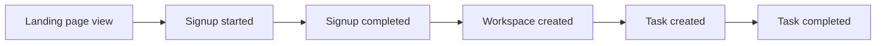
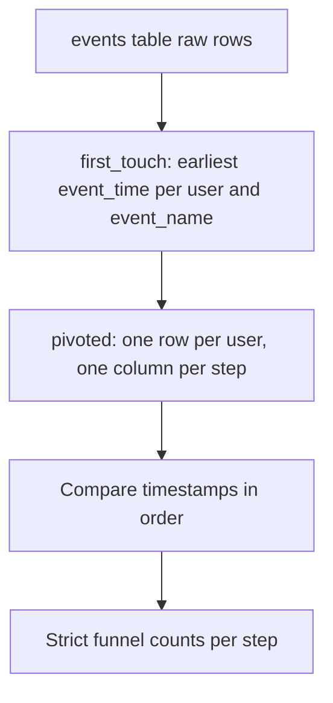

# Lecture 2 — Event Modeling and Funnels

> **Duration:** ~2 hours. **Outcome:** You can explain why product analytics uses one wide events table instead of one table per feature, and you can write a correct conversion-funnel query in SQL — using window functions to find each user's first occurrence of each step, without double-counting and without silently dropping people who never converted.

## 1. Why one events table, not ten

A naive way to track product usage is a table per action: `signups`, `workspace_creations`, `task_creations`, `logins`. Don't do this. It feels tidy and becomes a nightmare the moment you ask a cross-cutting question — "how many people who signed up in January created a task within a week?" — because now you're joining four tables with four different date columns and four different grains.

The industry-standard pattern (Amplitude, Mixpanel, Segment, Snowplow, every serious analytics stack) is the opposite: **one long, narrow "events" table**, where every user action — regardless of type — is a row with the same four or five columns:

```sql
CREATE TABLE events (
    event_id     SERIAL PRIMARY KEY,     -- SQLite: INTEGER PRIMARY KEY AUTOINCREMENT
    user_id      INTEGER   NOT NULL,
    event_name   TEXT      NOT NULL,     -- 'landing_page_view', 'task_completed', ...
    event_time   TIMESTAMP NOT NULL,
    session_id   INTEGER   NOT NULL
);
```

This is exactly Loopline's `events` table from the week README. Three reasons this shape wins:

1. **Every question is the same shape of query.** "How many people did X" is always `WHERE event_name = 'X'`. You never learn a new table's schema to ask a new question — you learn `event_name` values.
2. **New event types cost zero schema changes.** Product ships a "task_archived" feature? That's a new value in `event_name`, not a new `ALTER TABLE`. Real analytics pipelines add dozens of event types a year; a table-per-event design would drown in migrations.
3. **Time-ordered, cross-event questions become trivial.** Funnels, session analysis, "what did the user do right before they churned" — all of these are just `WHERE` + `ORDER BY event_time` + window functions on *one* table, not a five-way join.

The cost is that a single table can get *big* (Loopline's toy version is 669 rows; a real product does that in an hour). That's a storage/scaling problem, solved with partitioning and columnar warehouses — not a reason to abandon the shape. You will use exactly this shape at literally every product analytics job you ever have.

## 2. The trap: `event_name` values don't imply a `users` row

Reread this from the README, because it is the single most common bug in funnel SQL: **`events.user_id` is *not* a foreign key to `users`.** `users` only contains people who *finished* signing up — 59 rows. `events` contains a `user_id` for every visitor from the moment they load the landing page — 168 distinct user_ids. Most of those 168 people never make it into `users` at all.

```sql
-- WRONG: silently throws away your entire top-of-funnel
SELECT COUNT(*)
FROM events e
JOIN users u ON u.user_id = e.user_id
WHERE e.event_name = 'landing_page_view';
-- Returns far fewer than 168 — you just measured "landing views by people
-- who eventually became registered users," which is a different, much
-- smaller, and much less useful number than "total landing views."
```

If your funnel query starts from `users` and joins out to `events`, you have already decided the answer is "of the people who signed up, how many did X" — a real question, but the *wrong first question*. A funnel starts at the top: total visitors, no join required, straight off `events`.

```sql
-- RIGHT: the funnel's first step needs no JOIN at all
SELECT COUNT(DISTINCT user_id) AS visitors
FROM events
WHERE event_name = 'landing_page_view';
-- 168
```

## 3. Anatomy of Loopline's funnel

Loopline's onboarding funnel is six ordered steps, all present in `event_name`:

```
landing_page_view → signup_started → signup_completed → workspace_created → task_created → task_completed
```


*Loopline's six-step onboarding funnel, each arrow a drop-off point to measure.*

The simplest (and wrong) way to measure a funnel is to count *events*, not *users*, per step:

```sql
-- WRONG-ish: counts events, and a user who logs multiple task_completed
-- events (Loopline lets you complete many tasks) gets counted once per event
SELECT event_name, COUNT(*) AS n_events
FROM events
WHERE event_name IN ('landing_page_view','signup_started','signup_completed',
                      'workspace_created','task_created','task_completed')
GROUP BY event_name;
```

A funnel step should answer "how many **distinct people** reached this step **at least once**," not "how many times did this event fire." Fix it with `COUNT(DISTINCT user_id)`:

```sql
SELECT event_name, COUNT(DISTINCT user_id) AS n_users
FROM events
WHERE event_name IN ('landing_page_view','signup_started','signup_completed',
                      'workspace_created','task_created','task_completed')
GROUP BY event_name
ORDER BY CASE event_name
  WHEN 'landing_page_view' THEN 1
  WHEN 'signup_started'    THEN 2
  WHEN 'signup_completed'  THEN 3
  WHEN 'workspace_created' THEN 4
  WHEN 'task_created'      THEN 5
  WHEN 'task_completed'    THEN 6
END;
```

Run this against the seed data and you get:

| Step | Users | % of visitors |
|---|---:|---:|
| landing_page_view | 168 | 100.0% |
| signup_started | 86 | 51.2% |
| signup_completed | 59 | 35.1% |
| workspace_created | 49 | 29.2% |
| task_created | 34 | 20.2% |
| task_completed | 29 | 17.3% |

That table is the funnel. Read it as: half of visitors even try to sign up; two-thirds of those who try finish; and by the time you get to "completed a task," you've lost 83% of the people who ever loaded the landing page. That last number is either alarming or completely normal, depending on the product and channel — which is exactly why you never report a funnel without a comparison point (last week, last cohort, a competitor's public benchmark).

## 4. The harder, more honest funnel: strict ordering with window functions

`COUNT(DISTINCT user_id)` per step has a subtle flaw: it doesn't check that the steps happened *in order*, for the *same* user. In Loopline's clean seed data every `task_created` for a user really does follow their `workspace_created`, but real event data is messier — a user might fire `task_created` from a previous session that predates a *second* signup, or a bug might log an event out of order. A rigorous funnel query finds, for each user, the **first (earliest) timestamp of each step**, and only counts a later step if its timestamp is on-or-after the previous step's timestamp.

This is where window functions earn their keep. `MIN(event_time) OVER (PARTITION BY user_id, event_name)` finds the earliest occurrence of a step for a user without collapsing the row count the way `GROUP BY` would — useful when you want to keep the row-level detail while adding a "first time this happened" column alongside it.


*The CTE pipeline that turns raw events into an order-enforced funnel.*

```sql
-- Step 1: pull each user's *first* occurrence of each of the 6 funnel events.
WITH first_touch AS (
    SELECT
        user_id,
        event_name,
        MIN(event_time) AS first_time
    FROM events
    WHERE event_name IN ('landing_page_view','signup_started','signup_completed',
                          'workspace_created','task_created','task_completed')
    GROUP BY user_id, event_name
),
-- Step 2: pivot those six rows-per-user into six columns-per-user, so we can
-- compare timestamps directly and enforce ordering.
pivoted AS (
    SELECT
        user_id,
        MAX(CASE WHEN event_name = 'landing_page_view' THEN first_time END) AS t_landing,
        MAX(CASE WHEN event_name = 'signup_started'     THEN first_time END) AS t_start,
        MAX(CASE WHEN event_name = 'signup_completed'   THEN first_time END) AS t_signup,
        MAX(CASE WHEN event_name = 'workspace_created'  THEN first_time END) AS t_workspace,
        MAX(CASE WHEN event_name = 'task_created'       THEN first_time END) AS t_task_created,
        MAX(CASE WHEN event_name = 'task_completed'     THEN first_time END) AS t_task_done
    FROM first_touch
    GROUP BY user_id
)
SELECT
    COUNT(*)                                                     AS n_landing,
    COUNT(t_start)      FILTER (WHERE t_start      >= t_landing) AS n_started,
    COUNT(t_signup)     FILTER (WHERE t_signup     >= t_start)   AS n_signed_up,
    COUNT(t_workspace)  FILTER (WHERE t_workspace  >= t_signup)  AS n_workspace,
    COUNT(t_task_created) FILTER (WHERE t_task_created >= t_workspace) AS n_task_created,
    COUNT(t_task_done)  FILTER (WHERE t_task_done  >= t_task_created)  AS n_task_done
FROM pivoted;
```

`FILTER (WHERE ...)` is PostgreSQL's clean syntax for a conditional aggregate — "count this column, but only rows matching this condition." On SQLite (which lacks `FILTER`), the portable equivalent is a `CASE` inside the aggregate:

```sql
-- SQLite: same logic, CASE instead of FILTER
SELECT
    COUNT(*) AS n_landing,
    COUNT(CASE WHEN t_start      >= t_landing   THEN 1 END) AS n_started,
    COUNT(CASE WHEN t_signup     >= t_start     THEN 1 END) AS n_signed_up,
    COUNT(CASE WHEN t_workspace  >= t_signup    THEN 1 END) AS n_workspace,
    COUNT(CASE WHEN t_task_created >= t_workspace THEN 1 END) AS n_task_created,
    COUNT(CASE WHEN t_task_done  >= t_task_created THEN 1 END) AS n_task_done
FROM pivoted;
```

On this seed dataset, strict ordering produces the same counts as the simple `COUNT(DISTINCT)` version — the data is clean by construction. But you should build the strict version as your default habit, because in real event streams (out-of-order delivery, clock skew across services, retried events) it's the version that doesn't silently lie to you.

## 5. `ROW_NUMBER()` — the other way to find "the first one"

`MIN(event_time)` works when you only need the timestamp. When you need the *whole row* for a user's first occurrence of an event (say, to inspect which `session_id` it happened in), reach for `ROW_NUMBER()`:

```sql
WITH ranked AS (
    SELECT
        user_id,
        event_name,
        event_time,
        session_id,
        ROW_NUMBER() OVER (
            PARTITION BY user_id, event_name
            ORDER BY event_time ASC
        ) AS rn
    FROM events
)
SELECT user_id, event_name, event_time, session_id
FROM ranked
WHERE rn = 1 AND event_name = 'signup_completed'
ORDER BY event_time
LIMIT 5;
```

`PARTITION BY user_id, event_name` resets the row-numbering separately for each (user, event) pair; `ORDER BY event_time ASC` inside the window means `rn = 1` is always the earliest row in that partition. Filtering to `rn = 1` after the fact is the general-purpose "give me the first/last N per group" pattern — it works for "first funnel step," "most recent login," "top 3 highest-value events per user," anything shaped like "top-N per group." `MIN()`/`MAX()` only gets you the value; `ROW_NUMBER()` gets you the entire row.

## 6. Funnel by cohort week — the setup for Challenge 1

A single funnel number for "all time" hides *when* people are dropping off. The fix: bucket users by the week they entered the funnel (their `landing_page_view` week), and run the same step-by-step counts **per cohort week**. This is the exact query shape you'll need for Challenge 1 later this week — study it now, but don't go hunting for the planted anomaly yet.

```sql
WITH landing AS (
    SELECT user_id, MIN(event_time) AS t_land
    FROM events WHERE event_name = 'landing_page_view'
    GROUP BY user_id
),
cohort AS (
    SELECT
        user_id,
        -- Monday of the ISO week the user first landed (Postgres):
        date_trunc('week', t_land)::date AS cohort_week
    FROM landing
),
workspace AS (
    SELECT user_id, MIN(event_time) AS t_ws
    FROM events WHERE event_name = 'workspace_created'
    GROUP BY user_id
),
task AS (
    SELECT user_id, MIN(event_time) AS t_task
    FROM events WHERE event_name = 'task_created'
    GROUP BY user_id
)
SELECT
    c.cohort_week,
    COUNT(DISTINCT w.user_id) AS reached_workspace,
    COUNT(DISTINCT t.user_id) AS reached_task,
    ROUND(100.0 * COUNT(DISTINCT t.user_id) / NULLIF(COUNT(DISTINCT w.user_id), 0), 1) AS pct
FROM cohort c
LEFT JOIN workspace w ON w.user_id = c.user_id
LEFT JOIN task t      ON t.user_id = c.user_id
GROUP BY c.cohort_week
ORDER BY c.cohort_week;
```

`date_trunc('week', ...)` is PostgreSQL-only; SQLite's nearest equivalent is `date(t_land, 'weekday 0', '-6 days')` (finds the most recent Sunday, then steps back six days to Monday — SQLite has no native ISO-week truncation, so this is the standard workaround). Both give you "the Monday of the week this event happened," which is the conventional cohort-week boundary in product analytics.

## 7. Check yourself

- Why does an events table use one wide table instead of one table per event type? Name the three reasons.
- What's wrong with `JOIN events e ON u.user_id = e.user_id` as the *first* step of a funnel query? What number does it silently compute instead of "total visitors"?
- What's the difference between `COUNT(*)` and `COUNT(DISTINCT user_id)` in a funnel step count, and why does it matter here specifically (hint: `task_completed` can fire more than once per user)?
- When would you reach for `ROW_NUMBER() OVER (PARTITION BY ...)` instead of `MIN()`/`MAX()`?
- What does `PARTITION BY user_id, event_name` do inside a window function, in your own words?
- Write, from memory, the `date_trunc` (Postgres) and the SQLite workaround for "the Monday of this event's week."

If those are automatic, Lecture 3 takes the funnel's bottom half — the users who *did* activate — and asks the next question: do they come back?

## Further reading

- **PostgreSQL — Window Functions:** <https://www.postgresql.org/docs/current/tutorial-window.html>
- **PostgreSQL — Window Function Calls (full `OVER` syntax):** <https://www.postgresql.org/docs/current/sql-expressions.html#SYNTAX-WINDOW-FUNCTIONS>
- **PostgreSQL — Aggregate Expressions (`FILTER`):** <https://www.postgresql.org/docs/current/sql-expressions.html#SYNTAX-AGGREGATES>
- **SQLite — Window Functions:** <https://www.sqlite.org/windowfunctions.html>
- **SQLite — Date and Time Functions:** <https://www.sqlite.org/lang_datefunc.html>
- **Amplitude — "How to Build a Funnel Analysis":** <https://amplitude.com/blog/product-funnel-analysis>
