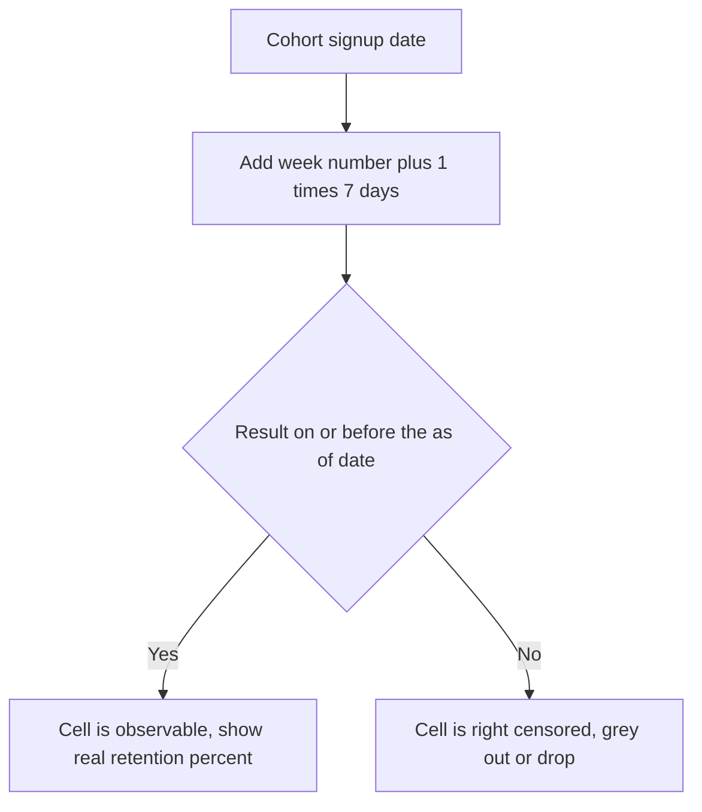

# Lecture 3 — Cohorts, Retention, and Activation

> **Duration:** ~2 hours. **Outcome:** You can build a weekly retention cohort table in SQL, correctly read (and not misread) a right-censored recent cohort, define an activation moment backed by a real retention-lift comparison, and compute DAU/WAU/MAU stickiness — all in SQL and pandas, never a spreadsheet.

## 1. Why not just track "total users"?

A funnel tells you whether people get *in*. Retention tells you whether they *stay*. This is the metric almost every failed product gets wrong: acquisition (top of funnel) is visible, exciting, and directly influenced by marketing spend — so it's what gets watched. Retention is quiet, compounding, and invisible on a signup graph, so it's what gets ignored, right up until growth stalls and nobody can explain why.

The brutal arithmetic: if you acquire 100 users a week and retain 10% of each cohort long-term, you need to *keep acquiring 100 a week forever* just to stand still. If you retain 40%, the same acquisition spend compounds into a much bigger steady-state user base. Retention isn't one metric among many — it's close to the only thing that determines whether growth spend actually builds something durable.

## 2. The retention cohort table (the "cohort triangle")

A **retention cohort table** groups users by *when they started* (their signup week), then for each subsequent week asks "what fraction of that cohort is still active?" Laid out as a grid, cohort weeks go down the rows and weeks-since-signup go across the columns — and because later cohorts haven't had time to reach later columns yet, the filled-in part of the grid forms a triangle.

Here's the query, built in stages. **Stage 1 — pick your "still active" definition.** For Loopline, "active in a given week" means the user fired *any* of the core engagement events (`login`, `task_created`, `task_completed`) at least once in that week — not just `landing_page_view`, which precedes signup and would inflate the number with people who aren't actually product users. This is the same "engaged events" distinction from the metric-tree branch guardrails in Lecture 1.

```sql
-- Stage 1: is user X active in week W after their signup? (Postgres)
WITH cohorts AS (
    SELECT user_id, signup_date FROM users
),
weekly_activity AS (
    SELECT
        c.user_id,
        c.signup_date,
        FLOOR(EXTRACT(EPOCH FROM (e.event_time - c.signup_date::timestamp)) / (7*86400))::int AS week_number
    FROM cohorts c
    JOIN events e ON e.user_id = c.user_id
    WHERE e.event_name IN ('login', 'task_created', 'task_completed')
      AND e.event_time >= c.signup_date::timestamp
)
SELECT user_id, signup_date, week_number
FROM weekly_activity
WHERE week_number BETWEEN 0 AND 8
ORDER BY user_id, week_number;
```

`week_number = 0` covers the signup week itself; `week_number = 1` is 7–13 days after signup; and so on. On SQLite, the epoch-seconds arithmetic is simpler with `julianday()`:

```sql
-- SQLite equivalent of week_number
SELECT
    e.user_id,
    CAST((julianday(e.event_time) - julianday(c.signup_date)) / 7 AS INT) AS week_number
FROM users c
JOIN events e ON e.user_id = c.user_id
WHERE e.event_name IN ('login','task_created','task_completed')
  AND e.event_time >= c.signup_date;
```

**Stage 2 — build the full cohort-week × week-number grid**, one row per cohort week, one column per week-since-signup, cell value = % of that cohort still active in that week:

```sql
WITH cohorts AS (
    SELECT user_id,
           date_trunc('week', signup_date::timestamp)::date AS cohort_week
    FROM users
),
cohort_sizes AS (
    SELECT cohort_week, COUNT(*) AS cohort_size
    FROM cohorts GROUP BY cohort_week
),
weekly_activity AS (
    SELECT
        c.user_id,
        c.cohort_week,
        FLOOR(EXTRACT(EPOCH FROM (e.event_time - u.signup_date::timestamp)) / (7*86400))::int AS week_number
    FROM cohorts c
    JOIN users u ON u.user_id = c.user_id
    JOIN events e ON e.user_id = c.user_id
    WHERE e.event_name IN ('login','task_created','task_completed')
      AND e.event_time >= u.signup_date::timestamp
)
SELECT
    s.cohort_week,
    s.cohort_size,
    a.week_number,
    COUNT(DISTINCT a.user_id) AS active_users,
    ROUND(100.0 * COUNT(DISTINCT a.user_id) / s.cohort_size, 1) AS pct_active
FROM cohort_sizes s
JOIN weekly_activity a ON a.cohort_week = s.cohort_week
WHERE a.week_number BETWEEN 1 AND 4     -- weeks 1-4 after signup
GROUP BY s.cohort_week, s.cohort_size, a.week_number
ORDER BY s.cohort_week, a.week_number;
```

Run this against the seed data (using the eight weekly cohorts starting Monday 2025-01-06) and you'll see something like:

| Cohort week | Size | Week 1 retained |
|---|---:|---:|
| 2025-01-06 | 12 | 3 (25.0%) |
| 2025-01-13 | 11 | 2 (18.2%) |
| 2025-01-20 | 10 | 3 (30.0%) |
| 2025-01-27 | 5 | 1 (20.0%) |
| 2025-02-03 | 5 | 1 (20.0%) |
| 2025-02-10 | 5 | 1 (20.0%) |
| 2025-02-17 | 6 | 0 (0.0%) |
| 2025-02-24 | 5 | 3 (60.0%) |

**Read this honestly, not optimistically.** With cohort sizes of five to twelve users, a single person coming back or not is a 10–20 point swing — these numbers are illustrative of the *method*, not statistically significant on their own. A real company runs this exact query against tens of thousands of users per cohort, where a 20% vs 25% difference is a real signal, not noise. Never let a small-N table talk you into a strong conclusion; the SQL pattern is what you're taking away here, not "week-1 retention is roughly 20%."

## 3. Right-censoring: why the newest cohort always looks worst

Look at the query's `WHERE a.week_number BETWEEN 1 AND 4` filter combined with the seed data's "as-of" date of **2025-03-16**. The cohort that signed up on 2025-02-24 has only had 3 weeks to *possibly* reach `week_number = 4` — some of that cohort's week-4 window falls after the as-of date, so their week-4 activity is **incomplete, not zero**. If you report "week-4 retention: cohort 02-24 is at 0%" without that caveat, you've made a claim the data can't support — you didn't measure retention, you measured "retention among people who've had time to retain, plus zero for everyone who hasn't."

This is **right-censoring** — a term borrowed from survival analysis, and it is the single most common way retention dashboards lie by omission. The fix is always the same: compute an "eligible" flag per cohort/week-number pair (has enough time passed since this cohort's signup date for this week-number to be fully observed as of today?), and either grey out or drop ineligible cells rather than showing them as zero.


*How to tell a fully observed retention cell from one that's still too new to trust.*

```sql
-- Which (cohort_week, week_number) cells are fully observable as of today?
SELECT
    cohort_week,
    week_number,
    (cohort_week + (week_number + 1) * INTERVAL '7 days') <= DATE '2025-03-16' AS is_observable
FROM (
    SELECT DISTINCT cohort_week, week_number
    FROM (SELECT date_trunc('week', signup_date::timestamp)::date AS cohort_week FROM users) c
    CROSS JOIN generate_series(0, 8) AS week_number
) grid
ORDER BY cohort_week, week_number;
```

`generate_series(0, 8)` produces the numbers 0 through 8 as rows — Postgres's clean way to build a small lookup grid without a physical table. SQLite has no `generate_series` built in by default (some builds ship it as an extension); the portable fallback there is a small literal `VALUES` table: `SELECT * FROM (VALUES (0),(1),(2),(3),(4),(5),(6),(7),(8)) AS wk(week_number)`.

## 4. Finding the activation moment — with evidence, not opinion

**Activation** is the moment a new user experiences the product's core value clearly enough that they're meaningfully more likely to come back. Every growth team eventually asks "how do we get more people past this moment?" — but you can't answer that until you can *name the moment*, precisely and falsifiably.

The wrong way to define activation: guess. "I think if they create a workspace, that's activation." Maybe — but that's an opinion wearing a metric's clothes.

The right way: **find the smallest early action (or count of actions) that produces the biggest lift in later retention, and test a few candidate thresholds against actual behavior.** For Loopline, the hypothesis on the table is: *does completing several tasks in the first week predict whether a user is still around a month later?*

```sql
WITH first_week_tasks AS (
    SELECT
        u.user_id,
        COUNT(e.event_id) AS tasks_completed_wk1
    FROM users u
    LEFT JOIN events e
           ON e.user_id = u.user_id
          AND e.event_name = 'task_completed'
          AND e.event_time BETWEEN u.signup_date::timestamp
                                AND u.signup_date::timestamp + INTERVAL '7 days'
    GROUP BY u.user_id
),
later_activity AS (
    SELECT
        f.user_id,
        f.tasks_completed_wk1,
        EXISTS (
            SELECT 1 FROM events e2, users u2
            WHERE e2.user_id = f.user_id
              AND u2.user_id = f.user_id
              AND e2.event_name IN ('login','task_created','task_completed')
              AND e2.event_time BETWEEN u2.signup_date::timestamp + INTERVAL '21 days'
                                     AND u2.signup_date::timestamp + INTERVAL '34 days'
        ) AS retained_weeks_3_4
    FROM first_week_tasks f
)
SELECT
    CASE WHEN tasks_completed_wk1 >= 3 THEN '3+ tasks in week 1' ELSE 'fewer than 3' END AS bucket,
    COUNT(*) AS n_users,
    SUM(CASE WHEN retained_weeks_3_4 THEN 1 ELSE 0 END) AS retained,
    ROUND(100.0 * SUM(CASE WHEN retained_weeks_3_4 THEN 1 ELSE 0 END) / COUNT(*), 1) AS pct_retained
FROM later_activity
GROUP BY bucket;
```

Run this against the seed data and the split is stark:

| Bucket | n | Retained (wk 3–4) | % |
|---|---:|---:|---:|
| 3+ tasks in week 1 | 6 | 4 | 66.7% |
| Fewer than 3 | 53 | 10 | 18.9% |

Users who complete three or more tasks in their first week come back at **more than 3x the rate** of everyone else. That's not proof of causation on six users — a real activation study needs hundreds of users per bucket and, ideally, a randomized nudge to confirm the relationship isn't just "engaged people were always going to stay" (self-selection). But the pattern is exactly the shape a real activation analysis produces, and it's why Loopline's working activation definition, used for the rest of this course, is:

> **A Loopline user is Activated if they complete at least 3 tasks within 7 days of finishing signup.**

Once you have that threshold, it becomes a real, trackable metric — "% of new signups who activate" — that slots directly into the metric tree from Lecture 1, under "New Engaged Users."

## 5. DAU, WAU, MAU — and the mistake that inflates all three

**DAU** (Daily Active Users), **WAU** (Weekly Active Users), and **MAU** (Monthly Active Users) count distinct users with at least one qualifying event in a trailing 1-day, 7-day, or 30-day window, as of a given date.

```sql
-- DAU, WAU, MAU as of 2025-02-14 (Postgres)
SELECT
    (SELECT COUNT(DISTINCT user_id) FROM events
     WHERE event_name IN ('login','task_created','task_completed','workspace_created')
       AND event_time::date = DATE '2025-02-14') AS dau,
    (SELECT COUNT(DISTINCT user_id) FROM events
     WHERE event_name IN ('login','task_created','task_completed','workspace_created')
       AND event_time::date BETWEEN DATE '2025-02-14' - 6 AND DATE '2025-02-14') AS wau,
    (SELECT COUNT(DISTINCT user_id) FROM events
     WHERE event_name IN ('login','task_created','task_completed','workspace_created')
       AND event_time::date BETWEEN DATE '2025-02-14' - 29 AND DATE '2025-02-14') AS mau;
```

Look closely at the `event_name IN (...)` filter: it deliberately **excludes** `landing_page_view`, `signup_started`, and `signup_completed`. This is the same lesson from the funnel/`JOIN` trap in Lecture 2, showing up again in a new shape. Watch what happens if you forget it:

```sql
-- THE MISTAKE: counting ALL events, including pre-signup marketing touches
SELECT COUNT(DISTINCT user_id) AS mau_wrong
FROM events
WHERE event_time::date BETWEEN DATE '2025-02-14' - 29 AND DATE '2025-02-14';
-- Includes every one-time landing-page visitor from the trailing 30 days,
-- most of whom never became a user at all. On the seed data this roughly
-- TRIPLES the honest MAU number — a landing-page traffic spike (a blog post
-- goes viral, say) would make your "active users" chart shoot up with zero
-- change in actual product engagement.
```

Restricting to genuine in-product actions (`login`, `task_created`, `task_completed`, `workspace_created`) gives you a number that only moves when people actually *use* the product. On the seed data, 2025-02-14 (a locally busy day in the dataset) comes out to roughly **DAU 8, WAU 16, MAU 37**.

**Stickiness** is the ratio that ties these together, and it's the single fastest way to judge habitualness:

```sql
SELECT
    dau, mau,
    ROUND(100.0 * dau / NULLIF(mau, 0), 1) AS dau_mau_stickiness_pct
FROM (
    SELECT
        (SELECT COUNT(DISTINCT user_id) FROM events
         WHERE event_name IN ('login','task_created','task_completed','workspace_created')
           AND event_time::date = DATE '2025-02-14') AS dau,
        (SELECT COUNT(DISTINCT user_id) FROM events
         WHERE event_name IN ('login','task_created','task_completed','workspace_created')
           AND event_time::date BETWEEN DATE '2025-02-14' - 29 AND DATE '2025-02-14') AS mau
) t;
-- roughly 21.6%
```

**DAU/MAU stickiness** answers "of everyone active this month, what fraction is active on a *given day*?" A stickiness of 21.6% means the average monthly-active user shows up roughly 1 day in 5 — read as "this is a several-times-a-week habit for engaged users, not a daily habit," which is entirely reasonable for a work task-tracker (nobody expects Loopline to be checked hourly like a messaging app). Context matters enormously here: 21.6% stickiness would be *alarming* for a messaging app and *fine* for a project-management tool. Never quote a stickiness number without naming the product category it's being judged against.

## 6. Cross-checking in pandas (never a spreadsheet)

The DATA TOOLING RULE for this course applies here too: if you want to sanity-check a SQL result, reach for Python + pandas, not a spreadsheet. Pandas gives you the same relational operations SQL does, but lets you iterate faster when you're exploring (e.g. sweeping the DAU/MAU ratio across every day in the dataset to spot trend, not just one snapshot date).

```python
import pandas as pd
import sqlite3

conn = sqlite3.connect("loopline_events.db")
events = pd.read_sql(
    "SELECT user_id, event_name, event_time FROM events "
    "WHERE event_name IN ('login','task_created','task_completed','workspace_created')",
    conn, parse_dates=["event_time"],
)
events["date"] = events["event_time"].dt.date

# DAU for every day that appears in the data
dau_by_day = events.groupby("date")["user_id"].nunique().rename("dau")

# 30-day trailing MAU, one figure per day, computed with a rolling window
daily_users = (
    events.drop_duplicates(["user_id", "date"])
    .set_index("date")
    .sort_index()
)
all_days = pd.date_range(daily_users.index.min(), daily_users.index.max(), freq="D").date
mau_by_day = pd.Series(
    {d: events[(events["date"] > pd.Timestamp(d) - pd.Timedelta(days=29))
               & (events["date"] <= d)]["user_id"].nunique()
     for d in all_days},
    name="mau",
)

stickiness = (dau_by_day.reindex(all_days, fill_value=0) / mau_by_day).rename("dau_mau_pct") * 100
result = pd.concat([dau_by_day.reindex(all_days, fill_value=0), mau_by_day, stickiness.round(1)], axis=1)
print(result.tail(14))
```

Two things to notice: pandas needed the same three ideas as the SQL — filter to engaged events, group by day, and compute a trailing window — and it took *more* code, not less, to do it. That's normal. SQL is the right tool for "aggregate a table by a window"; pandas earns its keep when you're iterating on the analysis interactively, plotting the result, or joining against a dataset that didn't come from a database at all. Neither ever means "open it in a spreadsheet."

## 7. Check yourself

- Why does a retention query filter to `login`/`task_created`/`task_completed`, and exclude `landing_page_view` and `signup_started`?
- What is right-censoring, in your own words, and which cohort in a retention table is always the most right-censored?
- Loopline's activation threshold is "3+ tasks completed within 7 days of signup." What retention-lift evidence justified that specific number, and what's the honest caveat about the sample size behind it?
- Write the DAU/MAU stickiness formula from memory. What does a stickiness of roughly 20% suggest about how often the average monthly user opens the product?
- Why does including `landing_page_view` in a DAU/MAU calculation produce a misleadingly *inflated* number, not a misleadingly deflated one?
- When would you reach for pandas instead of SQL in this analysis — and why would neither ever be "open Excel and paste the numbers in"?

If those are automatic, you're ready for this week's exercises, challenges, and the 15-question mini-project — all of which run against the exact numbers this lecture computed.

## Further reading

- **Reforge — "How to Calculate Retention" (cohort tables, right-censoring):** <https://www.reforge.com/blog/retention-metrics>
- **Amplitude — "Activation Rate" guide:** <https://amplitude.com/blog/activation-rate>
- **Mixpanel — "Stickiness" (DAU/MAU) definition and benchmarks:** <https://mixpanel.com/blog/stickiness/>
- **PostgreSQL — `generate_series`:** <https://www.postgresql.org/docs/current/functions-srf.html>
- **pandas — `groupby`, rolling windows, and time-series basics:** <https://pandas.pydata.org/docs/user_guide/timeseries.html>
