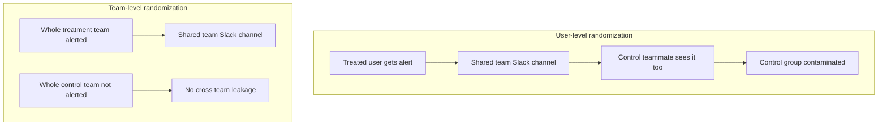
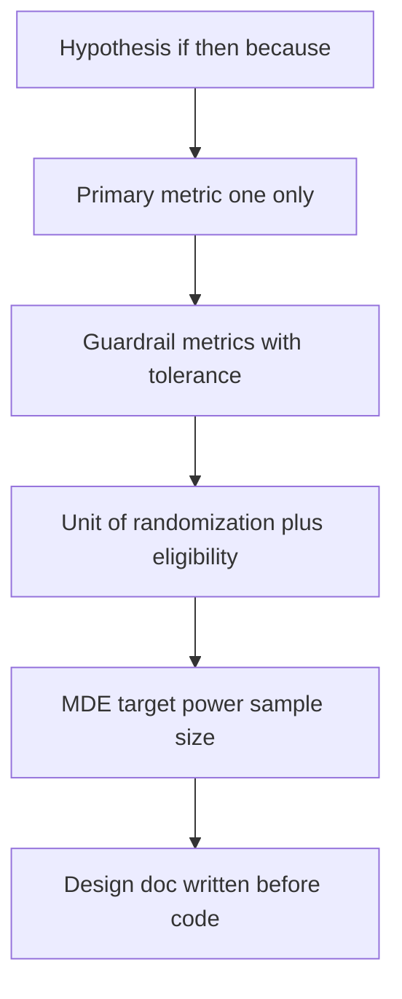

# Lecture 1 — Designing an Experiment

> **Duration:** ~2 hours. **Outcome:** You can write a hypothesis with one primary metric, choose the right unit of randomization, name your guardrails, and state a minimum detectable effect — all *before* a single user is exposed to a variant.

Most "A/B tests" fail before a single line of analysis code runs, because they were never actually designed — someone shipped a feature behind a flag, split traffic 50/50, and figured out what to measure after looking at what moved. That's not an experiment. That's a dashboard with extra steps. This lecture is about doing the four things that turn a flag rollout into a real experiment: write a falsifiable hypothesis, pick one primary metric, choose the unit of randomization deliberately, and decide the smallest effect worth detecting — all on paper, before the test starts.

## 1. The hypothesis: a falsifiable, single-sentence claim

A good hypothesis has three parts, and you can write it as one sentence with a template:

> **If** we [change], **then** [primary metric] will [direction] by roughly [magnitude], **because** [causal mechanism].

For Stuck Task Alerts:

> If we send a Slack alert the moment a task crosses 48 hours untouched, then the share of stuck tasks that get a status update within 24 hours of crossing the threshold will increase by roughly 8 percentage points, because the alert removes the need for a manager to remember to check a "stuck items" view — the task surfaces itself in a channel the manager already reads.

Notice what this sentence forces you to commit to, before you've seen a single result:

- **One metric.** Not "engagement will improve" — a specific, countable thing: the 24-hour unstick rate.
- **A direction and a rough magnitude.** Not just "will increase" — an expected size, even a rough one. This becomes your minimum detectable effect (MDE) in Lecture 2.
- **A mechanism.** Why would this change cause that metric to move? If you can't state the mechanism, you probably don't have a hypothesis — you have a hope. Vague hopes are how teams end up p-hacking their way to a result that "confirms" a feature they'd already decided to ship.

**A hypothesis is not a list of things you're excited about.** "This will increase engagement, retention, and NPS" is not a hypothesis — it's marketing copy for a feature that hasn't shipped yet. Pick the metric most directly, causally connected to the mechanism, and make that the **primary metric**. Everything else becomes secondary or guardrail (below).

### Why "falsifiable" matters

A falsifiable hypothesis is one a result can actually kill. "Stuck Task Alerts will help teams" is not falsifiable — almost any result can be spun as "helping" something. "The 24-hour unstick rate will increase by 8 points" is falsifiable — if it comes back flat, or if it comes back at 1 point, the hypothesis as stated is wrong, and you have to say so. Design the test to be capable of proving you wrong. That's the entire discipline.

## 2. Primary metric vs. guardrail metrics

Every experiment needs exactly **one** primary metric — the number that decides ship or no-ship — and a small set of **guardrail metrics** that must not get worse, even if the primary metric wins.

| | Primary metric | Guardrail metric |
|---|---|---|
| **How many** | Exactly one | 2–5, rarely more |
| **Job** | Decides ship/no-ship | Vetoes a ship even if primary wins |
| **Chosen from** | The causal mechanism in your hypothesis | What could plausibly get *worse* as a side effect |
| **Stuck Task Alerts example** | % of stuck incidents resolved within 24h of the alert | Overall task-completion rate (don't want alert fatigue tanking real work); Slack channel mute/leave rate (don't want people turning the channel off) |

Why only one primary metric? Because if you let yourself pick "whichever of these five metrics moved" after the fact, you've turned a designed experiment into a **multiple-comparisons problem** — the more metrics you check, the higher the chance *something* clears p < 0.05 by pure chance, even with zero real effect. Lecture 3 puts a number on exactly how bad this gets. For now: pick the one metric the hypothesis is about, commit to it in writing before the test starts, and let the guardrails be tripwires, not alternate ways to declare a win.

**A good guardrail metric is specific and directional.** "Engagement" is not a guardrail — you can't say in advance which direction would be bad. "Overall task completion rate should not drop by more than 3 points" is a guardrail — it names the metric, the direction that would be a problem, and roughly how much movement you'd tolerate before hitting the brakes.

## 3. Unit of randomization — the decision most teams get wrong

The **unit of randomization** is *what* gets randomly assigned to control or treatment: a user, a session, a team, an account, a geography. Get this wrong and your test's math is broken even if every formula afterward is applied correctly.

### The rule: randomize at the level where contamination happens

**Contamination** (also called a **SUTVA violation** — Stable Unit Treatment Value Assumption) is when a treated unit's behavior leaks into a control unit's outcome, blurring the comparison. Ask: *could someone in control be affected by someone in treatment?*

Consider Stuck Task Alerts. It posts to a **shared Slack channel** that the whole team reads. If you randomized by **individual user** — some people on a team get the alert, others on the same team don't — a treated user would see the alert and might mention it in the channel or just fix the stuck task themselves, and now the "control" teammates on the same team benefit from a treatment they weren't assigned. Your control group is contaminated. The test would understate the effect (or wildly overstate it, depending on which way the contamination runs) and you'd never know by how much.

The fix: randomize at the **team** level. Every member of a control team gets no alerts; every member of a treatment team does. No cross-contamination within a team. That's exactly what the seed dataset for this week does — 20 teams control, 20 teams treatment, not individual users.

| Feature type | Natural unit | Why |
|---|---|---|
| A private, individual-only UI change (e.g., a button's color) | User or session | No shared surface — one user's assignment can't leak to another |
| A shared-visibility feature (Slack alert, shared dashboard, team-wide setting) | Team / account | Shared surface means individual randomization contaminates |
| A pricing or packaging change | Account, or don't randomize at all (Lecture 3 / Challenge 2) | Legal and fairness concerns, plus sales-assisted contamination |
| A marketplace feature affecting both buyers and sellers | Whichever side isn't shared, or a market/geography | Two-sided marketplaces often can't be cleanly randomized at the individual level either — this is a live, hard problem in the field |

### The cost of the "safer" unit

Randomizing at team level instead of user level is *correct*, but it comes at a real cost you have to plan for: **you now have far fewer independent units.** Loopline might have 50,000 users but only 200 teams. Team-level variance (how different two teams' natural stuck-rates are) is also usually much higher than user-level variance, because a team's culture, workload, and manager habits all vary a lot. Both effects — fewer units, more variance per unit — mean team-randomized tests need dramatically larger sample sizes than user-randomized ones to detect the same effect. You'll feel this directly in the mini-project: 20 teams per arm turns out to be nowhere near enough. That's not a mistake in the dataset — it's the realistic cost of randomizing correctly on a feature that has to be randomized at the team level. Exercise 2's Quick Add button, by contrast, is a private per-user UI change with no shared surface, so it's randomized by user and gets thousands of independent units in the same three weeks — a completely different power story for the same calendar time.


*Randomizing by individual user lets a shared Slack channel leak treatment into control; randomizing by team stops the leak.*

### Checking your randomization actually worked: the sample ratio mismatch (SRM)

Before trusting *any* result, check that the split came out close to what you assigned. If you assigned 50/50, and after three weeks you observe something wildly off — say 20 teams in control vs. 31 in treatment — that's a **sample ratio mismatch**, and it's a five-alarm fire: it usually means your randomization or logging is broken (a bug is filtering which users get logged differently in each arm), and *any* metric difference you observe could be an artifact of that bug, not the feature. Check this first, every time, with a simple test:

```sql
-- Loopline: are the two arms close to the assigned 50/50 split?
SELECT arm, COUNT(*) AS n_teams
FROM stuck_alert_experiment
GROUP BY arm;
```

```python
from statsmodels.stats.proportion import proportions_ztest

# expect 20/20; if the observed split's p-value is tiny, investigate before analyzing anything else
n_control, n_treatment = 20, 20
z, p = proportions_ztest([n_treatment], [n_control + n_treatment], value=0.5)
print(f"SRM check p-value: {p:.4f}")   # small p (e.g. < 0.01) => stop and investigate assignment/logging
```

In this week's seed data the split is exactly 20/20 — clean. Real experiments aren't always this tidy; users churn out mid-test, some get double-bucketed by a logging bug, some never get properly exposed to their assigned variant. Checking SRM takes thirty seconds and saves you from publishing a conclusion built on a broken pipe.

## 4. Minimum detectable effect (MDE) — deciding what's worth finding

The **minimum detectable effect** is the smallest true effect you want the test to be able to reliably detect. It is a *business* decision, not a statistics one, and you make it before running any power calculation:

- Too **small** an MDE (chasing a 0.5 percentage-point lift) means you need an enormous sample and a very long test — often longer than the feature's usefulness window.
- Too **large** an MDE (only willing to detect a 20-point swing) means you'll ship features that have a real, smaller effect and call the test "inconclusive" when it wasn't — you just weren't looking hard enough.

Ask: **what's the smallest lift that would change the ship decision?** For Stuck Task Alerts, Loopline's PM decided that anything below a 5-point lift in the 24-hour unstick rate wouldn't be worth the Slack noise and alert fatigue it risks — so the MDE was set at "detect an 8-point lift reliably," matching the hypothesis. That number becomes the direct input to the sample-size formula in Lecture 2. Set the MDE too casually and every later number in the test is arbitrary.

## 5. Writing the design doc — before you write any code

A minimal experiment design, written down before the flag goes live, has five things:

1. **Hypothesis** (the if/then/because sentence, §1)
2. **Primary metric** and how it's computed, in exact SQL terms (not "engagement" — the literal query)
3. **Guardrail metrics** and their tolerance ("no more than 3-point drop")
4. **Unit of randomization** and why (§3) — plus the eligibility rule (who's even in the experiment population)
5. **MDE, target power, and required sample size/duration** (this becomes Lecture 2)

Writing this down forces every ambiguous decision — what counts as "eligible," what the primary metric literally is — into the open *before* the data can bias your answer. It is the single highest-leverage thirty minutes in the whole experimentation loop, and it's the piece most teams skip.


*The five decisions a design doc locks in, in order, before a flag ever goes live.*

## 6. Check yourself

- Rewrite "this feature will improve retention" as a proper if/then/because hypothesis with one primary metric.
- Why can an experiment have only one primary metric but several guardrails?
- Loopline is testing a change to the individual "Create Task" button's color. What unit of randomization is correct, and why is it different from Stuck Task Alerts?
- What is a sample ratio mismatch, and why do you check for it before looking at any other result?
- Why does randomizing at the team level instead of the user level usually require a much larger sample for the same detectable effect?
- Who decides the MDE — statisticians or the business — and what question do they answer to set it?

If those are automatic, Lecture 2 turns the MDE into an actual required sample size and duration, and shows you how to read a result once the test has run.

## Further reading

- **Kohavi, Tang, Xu — *Trustworthy Online Controlled Experiments*, Ch. 1–3 (free preprint chapters available from the authors' site):** <https://exp-platform.com/trustworthyonlinecontrolledexperiments/>
- **Microsoft ExP Platform — "Guidelines for A/B Testing":** <https://exp-platform.com/guidelines-for-ab-testing/>
- **Airbnb Engineering — "Experiments at Airbnb":** <https://medium.com/airbnb-engineering/experiments-at-airbnb-e2db3abf39e7>
