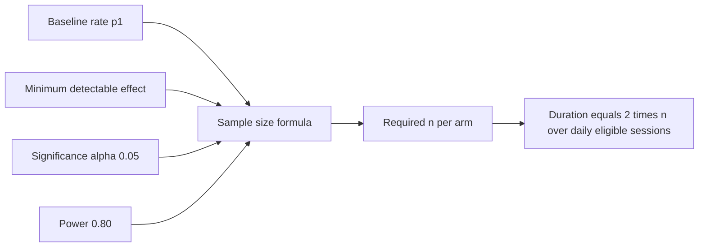
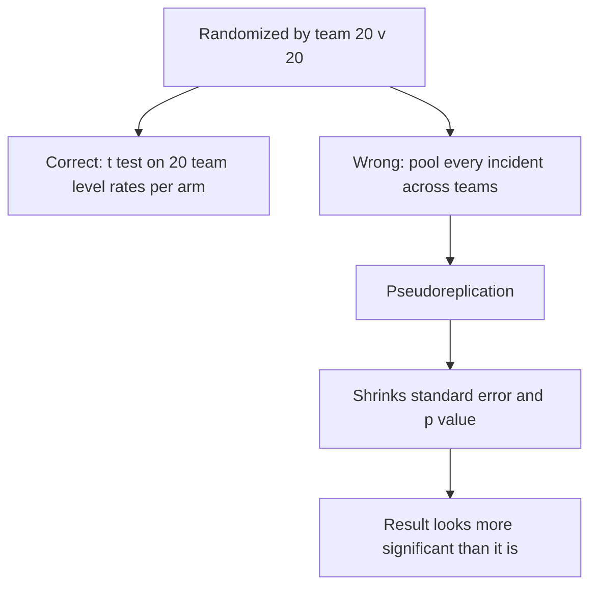

# Lecture 2 — Sample Size and Significance

> **Duration:** ~2 hours. **Outcome:** You can compute how many users/teams an experiment needs before it starts, and once results come in, correctly compute — and correctly *interpret* — a lift, a confidence interval, and a p-value, in both Python and SQL.

Lecture 1 got you a hypothesis, a primary metric, and an MDE. This lecture turns that into two concrete numbers everyone will ask you for: **"how many do we need?"** before the test starts, and **"did it work?"** after it ends. Both questions have precise answers. Neither is answered by staring at a dashboard.

## 1. The four numbers that determine sample size

Every sample-size calculation for a proportion metric (like a conversion rate, or the 24-hour unstick rate) needs exactly four inputs:

| Input | What it means | Typical value |
|---|---|---|
| **Baseline rate (p₁)** | Your metric's current value, before the change | Measured from historical data |
| **Minimum detectable effect (MDE)** | The smallest true lift you want to reliably catch (Lecture 1, §4) | A business decision |
| **Significance level (α)** | Your tolerance for a **false positive** — declaring a win that isn't real | 0.05 (5%), the near-universal default |
| **Power (1 − β)** | Your tolerance for a **false negative** — missing a real effect | 0.80 (80%), the near-universal default |

α and power are two sides of the same coin, and it's worth being precise about what each one protects against:

- **α = 0.05** means: if there's truly *no* effect, you'll wrongly call it significant 5% of the time. This is the "cry wolf" rate you're willing to accept.
- **Power = 0.80** means: if there *is* a true effect of exactly your MDE, you'll correctly detect it 80% of the time (and miss it the other 20%, even though it's real).

Both knobs trade against sample size: tighter α (fewer false positives) and higher power (fewer false negatives) both require *more* samples. 0.05 / 0.80 is the industry default because it balances rigor against practicality — tightening either one without a good reason mostly just makes your tests take longer.

## 2. The sample-size formula for a proportion

For a two-proportion, two-sided test, the classic formula is:

```
n per arm ≈ 2 × (z_{α/2} + z_β)² × p̄(1 − p̄) / (p₂ − p₁)²
```

where `p₁` is the baseline rate, `p₂ = p₁ + MDE` is the target rate, `p̄ = (p₁ + p₂) / 2`, and `z_{α/2}` and `z_β` are standard-normal critical values (for α = 0.05, two-sided: `z_{α/2} = 1.96`; for power = 0.80: `z_β = 0.84`).

**Worked example — Loopline's "Quick Add" button.** Loopline is testing a floating "+" button that lets a user create a task from anywhere in one click, hypothesizing it raises the share of sessions where a user creates at least one task. Baseline: **p₁ = 0.24** (24% of sessions currently include creating a task). Target MDE: **3 percentage points**, so **p₂ = 0.27**.

```
p̄ = (0.24 + 0.27) / 2 = 0.255
p̄(1 − p̄) = 0.255 × 0.745 = 0.190
(p₂ − p₁)² = 0.03² = 0.0009

n ≈ 2 × (1.96 + 0.84)² × 0.190 / 0.0009
  ≈ 2 × 7.84 × 0.190 / 0.0009
  ≈ 2.979 / 0.0009
  ≈ 3,310 per arm
```

**Do this in Python instead of by hand** — the formula above is the "why," but in practice you compute it with a library that handles the edge cases correctly:

```python
from statsmodels.stats.power import NormalIndPower
from statsmodels.stats.proportion import proportion_effectsize

p1, p2 = 0.24, 0.27
effect_size = proportion_effectsize(p1, p2)   # Cohen's h, the right effect-size measure for two proportions

analysis = NormalIndPower()
n_per_arm = analysis.solve_power(
    effect_size=effect_size, alpha=0.05, power=0.80, ratio=1.0, alternative='two-sided'
)
print(f"required n per arm: {n_per_arm:.0f}")   # -> 3311
```

That confirms the hand calculation: **3,311 per arm**, ~6,622 total. Notice the formula uses `proportion_effectsize` (Cohen's h) rather than a raw percentage-point difference — this is the statistically correct effect-size measure for comparing two proportions, and it's why the library answer and a naive "just plug percentages into a t-test formula" answer can diverge slightly. Use the library.

### How the MDE dominates the sample size

Sample size is roughly **inversely proportional to the square of the MDE** — halving your MDE roughly quadruples your required sample. This is the single most important intuition in this lecture:

| Target MDE | Required n per arm |
|---|---:|
| 2 percentage points | 7,356 |
| 3 percentage points | 3,311 |
| 5 percentage points | 1,221 |

Chasing a smaller, more "precise" effect isn't free — it can turn a one-week test into a two-month one. This is exactly why Lecture 1 insists the MDE be a deliberate business call, not a default.

### From sample size to duration

A sample size is not a timeline until you divide by traffic. Loopline gets about **850 new sessions/day** eligible for the Quick Add test. Split 50/50:

```
duration (days) = (2 × n_per_arm) / daily_eligible_sessions
                = (2 × 3,311) / 850
                ≈ 7.79 → round up to 8 days
```

**Always round up**, and always say the number out loud to whoever is waiting on the result — "this test needs 8 days minimum" is a sentence that prevents the single most common failure mode in the next section: stopping early because a partial result looked good.


*The four inputs that determine required sample size, and how sample size becomes a test duration.*

## 3. Analyzing a result: lift, significance, and confidence intervals

Once the test has run for its full planned duration (never before — Lecture 3 explains exactly why), you analyze it. Three numbers matter, and they answer three *different* questions:

1. **Lift** — how big was the observed effect? (a magnitude)
2. **p-value** — how likely is a result this extreme (or more) if there were truly no effect? (a statement about noise)
3. **Confidence interval** — what range of true effects is consistent with the data? (a statement about uncertainty)

### Computing it in Python

```python
import numpy as np
from statsmodels.stats.proportion import proportions_ztest, proportion_confint

# totals after the full planned test window
n_control, conv_control = 3306, 774
n_treat,   conv_treat   = 3228, 913

rate_control = conv_control / n_control      # 0.2341
rate_treat   = conv_treat / n_treat           # 0.2828

# two-proportion z-test
count = np.array([conv_treat, conv_control])
nobs  = np.array([n_treat, n_control])
z, p_value = proportions_ztest(count, nobs, alternative='two-sided')

diff = rate_treat - rate_control
se_diff = np.sqrt(
    rate_treat * (1 - rate_treat) / n_treat +
    rate_control * (1 - rate_control) / n_control
)
ci_low, ci_high = diff - 1.96 * se_diff, diff + 1.96 * se_diff
relative_lift = diff / rate_control

print(f"control: {rate_control:.4f}   treatment: {rate_treat:.4f}")
print(f"absolute lift: {diff:.4f}   relative lift: {relative_lift*100:.1f}%")
print(f"z = {z:.3f}, p = {p_value:.5f}")
print(f"95% CI of the difference: [{ci_low:.4f}, {ci_high:.4f}]")
```

Output:

```
control: 0.2341   treatment: 0.2828
absolute lift: 0.0487   relative lift: 20.8%
z = 4.499, p = 0.00001
95% CI of the difference: [0.0275, 0.0699]
```

### Reading it honestly

- **p = 0.00001** is well below α = 0.05 — this result is **statistically significant**. That means: if there were truly no effect, seeing a gap this large by chance alone would be extremely unlikely (about 1 in 100,000). It does **not** mean "there's a 99.999% chance the feature works" — that's a common and wrong restatement. A p-value is a statement about the data *given* the null hypothesis, not a statement about the probability the hypothesis is true.
- **The 95% CI is [0.0275, 0.0699]** — the data is consistent with a true lift anywhere from 2.75 to 6.99 percentage points. Report the interval, not just the point estimate of 4.87 points — the interval is what tells a stakeholder how *precisely* you know the effect, not just its best guess.
- **Statistical significance is not the same as practical significance.** A 4.87-point lift on a 23%-baseline metric, with 6,500+ sessions, is both statistically *and* practically significant here. But with a large enough sample, even a trivial 0.1-point lift can hit p < 0.05. Always ask: is the *lower bound* of the confidence interval (2.75 points, here) still big enough to matter to the business? If the CI's lower edge is below your MDE, the result is statistically real but might be too small to justify shipping.

### The same analysis in SQL

You'll often compute the raw counts in SQL before handing them to Python (or a BI tool) for the significance test itself:

```sql
-- aggregate conversion counts per arm from a raw sessions table
SELECT
    arm,
    COUNT(*)                                    AS n_sessions,
    SUM(CASE WHEN created_task THEN 1 ELSE 0 END) AS conversions,
    ROUND(
        SUM(CASE WHEN created_task THEN 1 ELSE 0 END)::NUMERIC / COUNT(*),
        4
    ) AS conversion_rate
FROM quick_add_experiment_sessions
GROUP BY arm;
```

SQL is excellent for producing the counts (`n` and conversions per arm) reliably, at scale, joined against whatever eligibility and exposure logic your experiment needs. It is a poor place to compute a z-test or a confidence interval by hand — do the aggregation in SQL, then feed the two numbers into Python for the actual statistical test. Trying to hand-roll a `SQRT`/`POWER` z-test in raw SQL is how sign errors and off-by-one variance formulas sneak into a ship decision.

## 4. Why the analysis unit must match the randomization unit

This is the single most common analysis mistake, and it's worth its own section because it will bite you directly in this week's mini-project.

If you randomized by **team** (20 control, 20 treatment), the correct analysis compares **20 team-level numbers against 20 team-level numbers** — for example, a two-sample t-test on each team's individual unstuck-rate. It is **wrong** to pool every stuck *incident* across all teams in an arm and run a proportion test on the incidents, because incidents within the same team are not independent of each other — a team having a rough week affects all of its incidents together. Treating them as independent samples is called **pseudoreplication**, and it artificially shrinks your standard error, which artificially shrinks your p-value — making a result look far more significant than it is.


*Analyzing at the wrong unit turns a team-randomized test into a falsely confident result.*

```python
import numpy as np
from scipy import stats

# CORRECT: analyze at the unit of randomization (team-level rates)
control_rates = np.array([...])   # one rate per control team, n=20
treat_rates   = np.array([...])   # one rate per treatment team, n=20
t_stat, p_value = stats.ttest_ind(treat_rates, control_rates, equal_var=False)  # Welch's t-test

# WRONG: pooling every incident across teams pretends n = "total incidents," not "total teams"
# — this pseudoreplicates and will show a smaller (and misleading) p-value
```

You'll run both versions side by side on the Stuck Task Alerts data in the mini-project, and see exactly how differently they answer the same question. Whichever unit you randomized on is the unit you analyze on — no exceptions.

## 5. Check yourself

- What does α = 0.05 actually protect against? What does power = 0.80 protect against?
- Why does halving your MDE roughly quadruple the required sample size?
- You have a required n of 3,311 per arm and 850 eligible sessions/day. How many days does the test need, and why do you round up?
- What's the difference between a p-value and "the probability the hypothesis is true"?
- A result has p = 0.001 and a 95% CI of [0.1%, 0.3%]. Is it statistically significant? Is it necessarily worth shipping?
- Why is it wrong to pool every stuck incident across teams into one proportion test, when the experiment was randomized by team?

If those are automatic, Lecture 3 covers the traps that ruin a well-designed test anyway — peeking, multiple comparisons, novelty effects — and what to do when you can't randomize at all.

## Further reading

- **statsmodels — Power and Sample Size Calculations:** <https://www.statsmodels.org/stable/stats.html#power-and-sample-size-calculations>
- **Evan Miller — "Sample Size Calculator" (and the math behind it):** <https://www.evanmiller.org/ab-testing/sample-size.html>
- **Kohavi, Tang, Xu — *Trustworthy Online Controlled Experiments*, Ch. 3 (statistics) and Ch. 4 (metrics):** <https://exp-platform.com/trustworthyonlinecontrolledexperiments/>
- **PostgreSQL — Aggregate functions reference:** <https://www.postgresql.org/docs/current/functions-aggregate.html>
