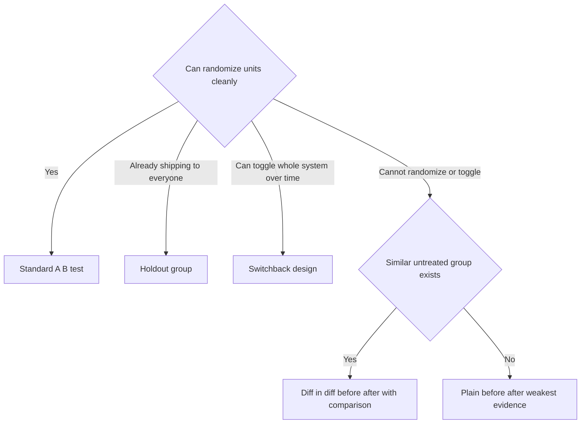

# Lecture 3 — Traps and Alternatives to A/B

> **Duration:** ~2 hours. **Outcome:** You can recognize peeking, p-hacking, multiple comparisons, and novelty/primacy effects when you see them — in your own tests or someone else's — and you know which quasi-experimental design (holdout, switchback, before/after) to reach for when randomization genuinely isn't possible.

A well-designed experiment (Lecture 1) with a correctly computed sample size (Lecture 2) can still produce a fake win. Almost every fake win in A/B testing traces back to one of a small number of well-known traps, and every one of them is a version of the same sin: **looking at the data more ways, or more times, than your significance threshold accounts for.**

## 1. Peeking / optional stopping — the single most common trap

**The trap:** you check the dashboard every day while the test is running. On day 6 (of a planned 14-day test), the p-value happens to dip to 0.039. You declare a win and ship. It felt significant — the p-value said so.

**Why it's wrong:** a p-value of 0.05 means "5% false-positive rate **if you look exactly once**, at the pre-planned sample size." If you look every day and stop the moment you cross 0.05, you're not running one test — you're running many, and taking the best (smallest) p-value across all of them. That inflates your true false-positive rate far above 5%, even when there's genuinely **zero** real effect.

**A worked, honest example.** Below is a real (seeded) simulation of a test where the two arms have the **exact same true conversion rate** — there is no effect, by construction. A PM checks the cumulative result every day:

```
day  n_control  conv_control  n_treat  conv_treat  rate_c   rate_t   p_value
  1        130            29      136          11   0.2231   0.0809   0.0012
  2        266            51      266          31   0.1917   0.1165   0.0163
  3        403            76      398          56   0.1886   0.1407   0.0678
  4        546           104      543          87   0.1905   0.1602   0.1893
  5        682           137      696         113   0.2009   0.1624   0.0635
  6        830           167      844         137   0.2012   0.1623   0.0391   <-- p < 0.05
  7        955           196      991         176   0.2052   0.1776   0.1211
  8       1109           219     1138         202   0.1975   0.1775   0.2251
  9       1244           248     1288         233   0.1994   0.1809   0.2366
 10       1375           273     1434         258   0.1985   0.1799   0.2075
 11       1524           298     1576         290   0.1955   0.1840   0.4131
 12       1665           318     1714         319   0.1910   0.1861   0.7171
 13       1790           341     1843         344   0.1905   0.1867   0.7667
 14       1922           361     1994         370   0.1878   0.1856   0.8555
```

On **day 1 and day 2**, the raw p-value is already below 0.05 — pure early-sample noise (both arms have only a couple hundred rows). On **day 6**, it dips to 0.039 again. A PM who stops the test right there and declares "treatment is significantly worse, kill it" has manufactured a conclusion out of noise. By the planned day 14, with the full sample, the true answer is unambiguous: **p = 0.856, no effect** — exactly what you'd expect, since this dataset was simulated with the *same* true rate in both arms.

The lesson isn't "never look at the dashboard while a test runs" — monitoring for bugs, crashes, and guardrail violations is good practice and should happen daily. The lesson is: **the ship/no-ship decision is made once, at the pre-registered sample size or duration, not at whichever day the number happened to look good.** You'll analyze this exact dataset in Exercise 3.

**The fix, if you need to look early:** use a **sequential testing** method (e.g., always-valid p-values / alpha-spending, implemented in tools like Optimizely's stats engine or the `sequential` testing mode in some experimentation platforms) that's specifically designed to control the false-positive rate under repeated looks. Don't try to eyeball-correct a fixed-horizon p-value by "just being careful" — the inflation is mathematical, not a matter of discipline.

## 2. Multiple comparisons — checking too many metrics or too many segments

**The trap:** the primary metric came back flat, so you check 15 secondary metrics and 8 user segments. One of them — say, "mobile users in Germany" — shows p = 0.04. You write it up as a win.

**Why it's wrong:** at α = 0.05, checking 20 independent things has roughly a **64% chance** that at least one clears p < 0.05 purely by chance (1 − 0.95²⁰ ≈ 0.64). Checking enough cuts of the data basically guarantees you'll find *something* that looks significant, whether or not anything real is happening. This is sometimes called "p-hacking by a thousand cuts," and it's how a null result quietly becomes a highlight-reel case study.

**The fix:**
- Pre-register your primary metric and 1–2 secondary metrics **before** the test runs (Lecture 1). If the primary metric is flat, the test is flat — full stop.
- If you genuinely need to check many metrics or segments, apply a **multiple-comparisons correction** (Bonferroni is the simplest: divide your α by the number of comparisons; e.g., 20 comparisons → require p < 0.0025 for any single one to count).
- Treat a segment finding from a test that wasn't designed to detect it as a **hypothesis for a new, dedicated test** — not as a conclusion. "Mobile users in Germany" might be real, but you need a fresh, pre-registered test aimed specifically at that segment to know.

## 3. Novelty and primacy effects — the trend that isn't stable

**Novelty effect:** users try a new feature because it's *new*, not because it's *better* — engagement spikes in week 1, then decays back toward baseline as the novelty wears off. If you measure only the first few days, you overstate the long-run effect.

**Primacy effect:** the reverse — existing users are annoyed by a UI change at first (it's unfamiliar, their muscle memory is wrong), so the metric dips initially, then recovers as they adapt. If you measure only the first few days, you *understate* the effect (or wrongly conclude the feature hurts).

**The fix:**
- Run tests long enough to see the metric stabilize, not just long enough to hit your minimum sample size. For a feature likely to have novelty/primacy dynamics, plan for at least 2–3 weeks even if the power calculation says less time is needed.
- Segment the analysis by **user tenure in the experiment** — a user's 1st day exposed to treatment vs. their 10th — to see whether the effect is holding steady or decaying.
- For genuinely novel UI, consider a **longer holdout** on a small slice of traffic that stays in control for months, so you can check the effect's durability even after the main rollout ships.

## 4. When you cannot randomize at all

Sometimes a true randomized control isn't available — no clean way to give two similar users or accounts different treatment. Common reasons: legal/fairness concerns (showing different customers different prices), sales-assisted processes (an account executive pitches every enterprise deal individually and can't "randomly" pitch half of them a different way), a single shared public surface (one pricing page indexed by search engines, one company-wide email), or too few units to randomize meaningfully (8 enterprise accounts). Challenge 2 works through exactly this kind of case in detail. Three go-to alternatives:

### Holdout groups

Roll the change out to (almost) everyone, but deliberately keep a small, randomly chosen slice (5–10%) on the old experience for an extended period, purely to measure the true long-run effect against a real, un-treated baseline. This is different from a normal A/B test mainly in *duration* and *intent* — it's less about a ship decision (you've already decided to ship to the 90–95%) and more about ongoing measurement, catching decay, or informing a later "is this feature still worth its complexity" review.

### Switchback (time-based) designs

Instead of splitting *units* into control/treatment, alternate the **whole population** between control and treatment over **time periods** — e.g., alerts on for all teams in week 1, off for all teams in week 2, on again in week 3, off in week 4, and so on. Each period contributes one data point per arm. This works well when you can't split units (e.g., a company-wide policy, a marketplace-wide pricing rule affecting both sides at once) but *can* toggle the whole system on and off in blocks of time. The trade-off: you get far fewer independent data points (periods, not users), so you need either many periods or accept a much larger MDE — and you have to watch for calendar confounds (is week 1 different from week 2 for reasons that have nothing to do with your change, like a holiday or a marketing campaign?).

### Before/after with a comparison group (difference-in-differences)

If you can't randomize but you *can* find a comparison group that wasn't exposed to the change and would otherwise have moved similarly — a market you haven't launched a change in yet, a customer segment on a different plan — compare the **change over time** in the treated group against the **change over time** in the comparison group, not just the treated group's before-vs-after difference. This is **difference-in-differences (diff-in-diff)**:

```
effect ≈ (treated_after − treated_before) − (comparison_after − comparison_before)
```

Subtracting the comparison group's trend removes anything that would have happened anyway (seasonality, a broader product trend, a competitor's move) — which a naive before/after on the treated group alone cannot do. Diff-in-diff is weaker evidence than true randomization (it assumes the two groups *would have* trended the same way absent the change — the "parallel trends" assumption, which you can partially sanity-check by looking at whether they tracked each other *before* the change), but it's dramatically better than a raw before/after with no comparison group at all, which conflates your change with literally everything else that happened at the same time.

## 5. A quick decision guide

| Situation | Reach for |
|---|---|
| Can randomize individual users/teams cleanly | Standard A/B test (Lectures 1–2) |
| Already shipping to everyone, want to measure long-run/decay | Holdout group |
| Can't split units, but can toggle the whole system over time | Switchback design |
| Can't randomize or toggle at all, but have a similar untreated group | Diff-in-diff (before/after with comparison) |
| No comparison group exists at all | Weakest evidence: plain before/after, heavily caveated, ideally paired with qualitative research |


*Which design to reach for, decided by what you're actually able to randomize or compare.*

## 6. Check yourself

- Why does checking a dashboard daily and stopping the moment p < 0.05 inflate the true false-positive rate, even with zero real effect?
- In the peeking simulation above, day 6 showed p = 0.039. What was the true effect size in that simulation, and what does day 14 show?
- You check 20 metrics and one comes back at p = 0.04. Using a Bonferroni correction, what p-value would that one metric actually need to clear?
- What's the difference between a novelty effect and a primacy effect, and which one makes you *overstate* a feature's benefit?
- Name two real-world reasons a company might not be able to randomize a pricing change.
- What does difference-in-differences subtract out that a plain before/after comparison cannot?

## Further reading

- **Kohavi, Tang, Xu — *Trustworthy Online Controlled Experiments*, Ch. 19 (twyman's law, pitfalls) and Ch. 22 (org/culture):** <https://exp-platform.com/trustworthyonlinecontrolledexperiments/>
- **Evan Miller — "How Not To Run An A/B Test" (the canonical peeking explainer):** <https://www.evanmiller.org/how-not-to-run-an-ab-test.html>
- **Card, Krueger — the original minimum-wage diff-in-diff study (the classic applied example):** <https://davidcard.berkeley.edu/papers/njmin-aer.pdf>
- **Netflix Technology Blog — "Interpreting A/B test results" series:** <https://netflixtechblog.com/tagged/experimentation>
