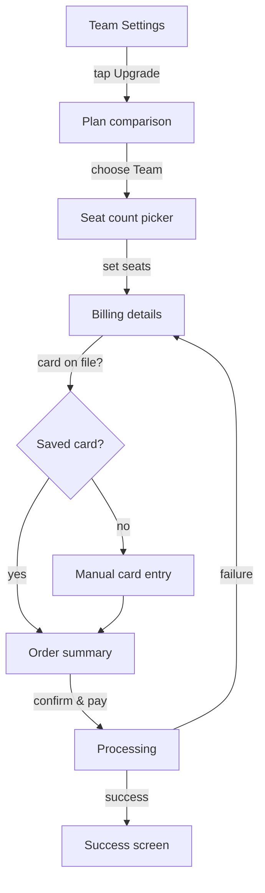
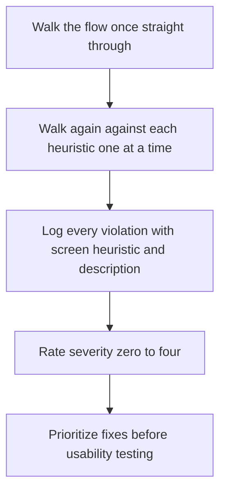

# Lecture 1 — Flows, Friction, and Heuristics

> **Duration:** ~2 hours. **Outcome:** You can map any user flow into numbered steps with decision points and exit ramps, and you can run a heuristic evaluation against Nielsen's 10 usability heuristics — finding and rating friction before a real user ever hits it.

A **user flow** is the sequence of screens and actions a person moves through to accomplish one goal. "Sign up," "add a teammate," "upgrade your plan," "recover a forgotten password" — each is a flow. Flows are the unit UX operates on, the same way a table is the unit SQL operates on: get good at reading one flow precisely, and every later skill this week — testing it, critiquing a screen inside it, redesigning it — is just more of the same muscle applied to a bigger flow.

## 1. What a flow actually is

A flow has four kinds of parts:

| Part | What it is | Example (Loopline) |
|------|-----------|---------------------|
| **Screen / state** | One thing the user is looking at | The "Choose a plan" pricing page |
| **Action** | Something the user does to move forward | Taps "Upgrade to Team" |
| **Decision point** | A fork where the next screen depends on a choice or a condition | "Do they already have a card on file?" |
| **Exit ramp** | A place the user can leave the flow without finishing | Closing the tab, tapping "Maybe later" |

A flow is *not* a static screen — it's a path through time. Two people can look at the exact same screen and be in different places in the flow: one arriving from a marketing email with intent to buy, one who fat-fingered a nav link and has no idea what they're looking at. Flows have to work for both.

### Mapping notation

You don't need a diagramming tool. A numbered list with explicit branches is enough to think clearly, and it's what you'll write in real specs:

```
1. User taps "Upgrade" on the Team Settings screen
2. Screen: Plan comparison (Free / Pro / Team)
   → user taps "Choose Team"
3. Screen: Seat count picker (how many seats?)
   → user sets seats, taps "Continue"
4. Screen: Billing details (card number, name, billing address)
   DECISION: does org already have a saved card?
     → YES: skip to step 6, pre-filled
     → NO: continue to step 5
5. User fills card fields manually
   → taps "Continue"
6. Screen: Order summary (seats × price, tax, total)
   → user taps "Confirm and pay"
7. Screen: Processing spinner
   DECISION: did payment succeed?
     → YES: Screen: Success, redirect to Team Settings
     → NO: Screen: Error, return to step 4
EXIT RAMPS: available at steps 2, 3, 4, 5, 6 (back button or tab close)
```

Note what this format forces you to write down: **every decision point**, **every exit ramp**, and **the unhappy path** (step 7's failure branch) — not just the golden path a demo would show. Most flow-mapping mistakes are simply forgetting the unhappy path exists. If you only ever draw the flow that works, you'll never find the flow that doesn't.

If you prefer a visual, the same map as a lightweight flow diagram (Mermaid, which renders in GitHub and most Markdown viewers):



Use whichever format gets the flow out of your head fastest. The text list is usually faster to write and easier to annotate with friction notes (next section); the diagram is easier to hand to a designer or present in a review.

## 2. What friction is, and the five kinds worth naming

**Friction** is anything that makes a step harder, slower, or scarier than it needs to be to accomplish the user's goal. Not all friction is bad — a confirmation dialog before deleting an account is friction *on purpose*, protecting the user from a costly mistake. Your job is to find friction, then judge whether it's earning its keep.

| Type | What it feels like | Loopline example |
|------|--------------------|--------------------|
| **Cognitive load** | Too much to read, decide, or remember at once | Seat-count picker shows raw per-seat price but not the total until three screens later |
| **Motor effort** | Too many taps, too much scrolling, too much typing | Re-entering a billing address that's identical to the org's profile address |
| **Wait time** | The system is slow and gives no feedback | The processing spinner has no time estimate and no "this can take up to 30s" text |
| **Trust / anxiety** | The user isn't sure the system understood them, or is afraid to proceed | No visible "your card is never stored on our servers" line on the manual card-entry screen |
| **Error-recovery cost** | Recovering from a mistake is harder than making it | A failed payment kicks the user all the way back to the billing screen — losing the seat count they picked |

Every one of these is a *hypothesis* until you either observe a real user hit it (Lecture 2) or find independent evidence it's a known problem pattern (this lecture, via heuristics). Don't confuse "I think this is friction" with "this is confirmed friction" — the first is a lead, the second needs a test.

## 3. Nielsen's 10 usability heuristics

Jakob Nielsen's ten heuristics, first published in 1994, are still the fastest lens for finding friction without running a single user session. They're not laws — they're a checklist of the ways interfaces most commonly go wrong, distilled from decades of usability research. Walk any flow against all ten and you'll surface most of the obvious problems before a real user ever has to.

1. **Visibility of system status** — the system should always keep users informed, through reasonable feedback, within reasonable time. *(Loopline's processing spinner with no time estimate violates this.)*
2. **Match between system and the real world** — speak the user's language, not internal jargon; follow real-world conventions. *(Calling a monthly seat "a license unit" instead of "a seat" violates this.)*
3. **User control and freedom** — support undo and redo; give a clearly marked "emergency exit" from an unwanted state. *(No way to go back and change seat count from the billing screen without losing progress violates this.)*
4. **Consistency and standards** — don't make users wonder whether different words, situations, or actions mean the same thing. *(The pricing page says "Team plan," checkout says "Business tier" — same product, different name.)*
5. **Error prevention** — better than a good error message is a design that prevents the problem in the first place. *(Letting a user pick 0 seats and only catching it after "Confirm and pay" violates this — should be prevented at the picker.)*
6. **Recognition rather than recall** — minimize memory load by making elements, actions, and options visible. *(Forcing the user to remember the seat count they picked three screens ago, with no summary visible, violates this.)*
7. **Flexibility and efficiency of use** — accelerators unseen by novice users may speed up the expert. *(No way for an org admin who upgrades every year to skip straight to "same as last time.")*
8. **Aesthetic and minimalist design** — dialogues shouldn't contain irrelevant or rarely needed information. *(A legal disclaimer paragraph sitting above the "Confirm and pay" button, competing with it for attention.)*
9. **Help users recognize, diagnose, and recover from errors** — error messages in plain language, precisely indicating the problem, constructively suggesting a solution. *("Payment failed" with no reason and no next step violates this — was it the card, the address, insufficient funds?)*
10. **Help and documentation** — even though it's better if the system needs no explanation, help should be easy to search and focused on the user's task. *(No link to "why do we need a billing address?" next to a field that's confusing many first-time SMB buyers.)*

### Running a heuristic evaluation

A heuristic evaluation is simple in structure, disciplined in execution:

1. **Walk the flow once straight through**, as a first-time user would, without stopping to critique. Get the whole shape in your head.
2. **Walk it again slower**, this time against each of the 10 heuristics, one at a time (not all ten at once — you'll miss things). At each screen, ask "does this violate heuristic N?"
3. **Log every violation** with: which screen, which heuristic, a one-sentence description, and a **severity rating**.
4. **Rate severity** on Nielsen's 0–4 scale:

| Score | Meaning |
|------:|---------|
| 0 | Not a usability problem at all |
| 1 | Cosmetic only — fix if there's spare time |
| 2 | Minor — fixing it is low priority |
| 3 | Major — important to fix, should be high priority |
| 4 | Catastrophe — imperative to fix before release |


*The heuristic evaluation method as a repeatable four-step process.*

A heuristic evaluation is fast (you can run one alone, on a static flow, in under an hour) and it's not a substitute for a usability test with real users — it's a **filter**. It catches the obvious stuff cheaply, before you spend time and goodwill putting real people through a broken flow in Lecture 2's usability test. Independent evaluators find different subsets of problems, which is why three to five evaluators running the same heuristic pass typically find ~75% of a flow's usability issues, versus ~35% for just one evaluator — if you can get a teammate to run the same evaluation independently and compare notes, do it.

## 4. Worked example — Loopline's checkout, heuristic pass

Using the mapped flow from Section 1, here's a partial heuristic evaluation (the full flow has more violations — this is a sample of the method):

| Step | Heuristic violated | Description | Severity |
|-----:|---------------------|--------------|---------:|
| 3 | #6 Recognition rather than recall | Seat count picked here isn't shown again until the summary at step 6 — user has to remember it across two screens | 2 |
| 4 | #5 Error prevention | Manual card entry allows an expired date to be typed and submitted; only caught by the payment processor after "Confirm and pay" | 3 |
| 6 | #8 Aesthetic and minimalist design | Legal disclaimer paragraph is the same visual weight as the total price, competing for the user's eye right where the CTA sits | 2 |
| 7 (failure) | #9 Help recognize/diagnose/recover from errors | "Payment failed" with no reason shown and no suggested next step | 4 |
| 7 (failure) | #3 User control and freedom | Failure returns user to step 4, losing their step-3 seat count — no memory of prior input | 3 |

Two things jump out from a table like this even before any real user is tested: the **payment-failure branch is catastrophically weak** (two severity-4/3 violations stacked on the exact path where a paying customer is most anxious), and it's the **unhappy path**, not the demo path, doing the damage. That's the pattern you'll see again and again — flows look fine when you only walk the happy path, and heuristic evaluation is precisely the discipline that forces you to walk the other one too.

## 5. Check yourself

- Name the four parts of a flow map. Which one do people forget most often?
- Why is a heuristic evaluation not a replacement for a usability test — what can it *not* tell you?
- Which of the five friction types is "asking for the same billing address twice" an example of?
- Walk your own product's sign-up flow through Nielsen's heuristics #1 and #9. Find one real violation of each.
- What does a severity rating of 4 mean, and what should happen to a 4 before you'd consider shipping?
- Why does independent-evaluator overlap matter — why not just trust one person's heuristic pass?

If those are automatic, Lecture 2 turns these *hypotheses* about friction into *evidence*, by putting real people in front of the flow and watching what actually happens.

## Further reading

- **Nielsen Norman Group — "10 Usability Heuristics for User Interface Design":** <https://www.nngroup.com/articles/ten-usability-heuristics/>
- **Nielsen Norman Group — "How to Conduct a Heuristic Evaluation":** <https://www.nngroup.com/articles/how-to-conduct-a-heuristic-evaluation/>
- **Nielsen Norman Group — "Severity Ratings for Usability Problems":** <https://www.nngroup.com/articles/how-to-rate-the-severity-of-usability-problems/>
