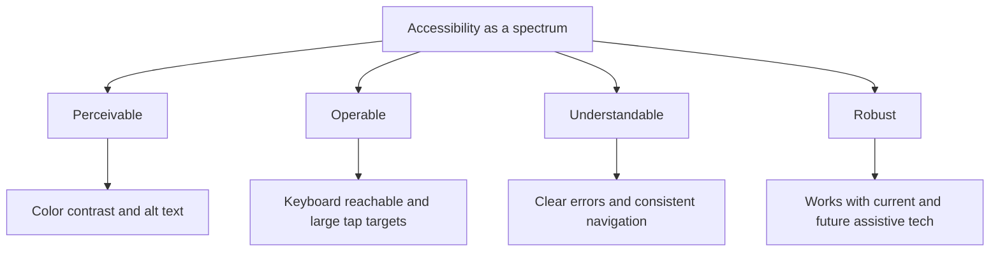
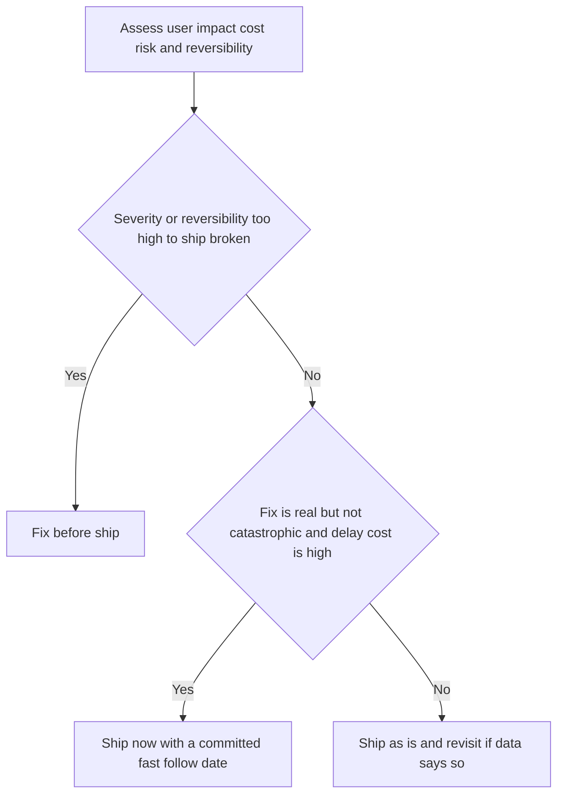

# Lecture 3 — Critique and Trade-offs

> **Duration:** ~2 hours. **Outcome:** You can give design critique that's grounded in user goals and evidence rather than taste, explain accessibility as a spectrum using the WCAG POUR principles, and negotiate a ship-now-vs-fix-first trade-off with designers and engineers using a shared, defensible framework.

A PM sits in more design reviews than almost anyone else in the room — more than the designer (who's usually presenting), often more than the engineer (who joins later). What you say in those thirty minutes either makes the design better or makes everyone dread the next review. This lecture is about the difference.

## 1. Why "I don't like it" is worthless feedback

"I don't like it" is unfalsifiable, ungrounded, and unactionable — the designer can't do anything with it except guess. It also carries an implicit claim that your taste should override theirs, which is a status fight dressed up as feedback. Compare:

> "I don't like the checkout button color."

versus

> "The 'Confirm and pay' button is the same blue as the legal disclaimer text right above it — when I did the heuristic pass, my eye kept landing on the disclaimer first. Can we give the button more visual weight, maybe a filled background instead of an outline?"

The second version names the **specific element**, ties it to a **user-facing consequence** (attention going to the wrong place, right where hesitation is costliest), and offers a **direction** without dictating the exact solution — that's still the designer's job. That's the whole formula: **observation → user consequence → direction, not diktat.**

## 2. Three critique frameworks that produce actionable feedback

### I Like / I Wish / What If

The classic structure for a critique session, because it forces balance and forward motion:

- **I like...** — name something that's working and *why* it's working (grounds the critique in something real, not just a list of complaints).
- **I wish...** — name a specific problem, tied to a user goal or a heuristic, not a taste preference.
- **What if...** — offer a direction to explore, phrased as a question, not an instruction. This is the crucial discipline: "what if the total price showed up earlier in the flow?" invites the designer to solve it their way; "move the price to the top" tells them how, and now you own the outcome if it's wrong.

Applied to Loopline's checkout summary screen:

> "I like that the seat count and price-per-seat are both visible in the same line — that answers 'how much per person' without a tap. I wish the total didn't require scrolling to see, because that's the number people are most anxious about right before paying. What if the total sat pinned near the CTA the whole time, even while scrolling?"

### Heuristic-grounded critique

For a fast pass on any screen, walk it against Nielsen's 10 heuristics (Lecture 1) and voice only the violations, each with severity. This produces critique that reads like the heuristic-evaluation table from Lecture 1 — because it *is* one, spoken aloud in a room. It's the fastest way to give useful critique on a screen you're seeing for the first time in a review.

### Goals-first critique

Before critiquing anything, state the user goal the screen exists to serve, out loud, and hold every comment against it. "The goal of this screen is: a first-time buyer understands exactly what they're being charged and trusts the number, in under 10 seconds." Every "I wish" that follows has to trace back to that sentence. This kills the single most common failure mode of design reviews — critiquing a screen against an *imagined* alternate goal nobody agreed to ("I think this should also promote our annual discount" when the screen's job is "confirm the transaction cleanly").

## 3. Running a critique session that doesn't waste everyone's time

- **Timebox it.** 5 minutes of silent looking, then 15–20 minutes of structured comments (round-robin, one "I like / I wish / what if" per person per pass), then 5 minutes for the designer to respond. A critique with no time limit turns into whoever talks longest winning.
- **The designer presents, doesn't defend, first.** One or two sentences: what screen, what user goal, what they're unsure about. Then *they go quiet* while the room critiques — jumping in to explain every choice preemptively trains the room to stop offering real feedback.
- **Critique the work, not the person, and use "the design" not "you."** "The design doesn't show the total early enough" lands very differently than "you didn't put the total high enough."
- **Ask, don't assume, about constraints.** Before you critique "why isn't there a progress indicator across these 4 steps," ask whether that was considered and cut for a reason (maybe engineering effort, maybe a deliberate choice) — critique that ignores known constraints reads as naive, not helpful.
- **End with a decision, not just a list.** Every review should close with either "ship as is," "designer iterates and we look again," or "this needs a decision above this room" — an unresolved pile of feedback with no next step is worse than no review at all.

## 4. Accessibility as a spectrum, not a checkbox

Accessibility gets treated by many teams as a binary — "compliant" or "not" — because that's how legal risk frames it (WCAG conformance levels A / AA / AAA exist for exactly that reason). But from a user-experience standpoint, accessibility is a **spectrum of how many real people can complete the flow**, and every point on that spectrum matters even if it never triggers a legal complaint.

The **WCAG POUR principles** are the four buckets almost every accessibility issue falls into:

| Principle | Means | Common violation |
|---|---|---|
| **Perceivable** | Users can perceive the content, regardless of sense | Text on a background with insufficient color contrast; an image with no `alt` text for a screen-reader user |
| **Operable** | Users can operate the interface, regardless of input method | A dropdown that only opens on hover (unreachable by keyboard); a tap target smaller than ~44×44px (hard to hit with limited motor precision) |
| **Understandable** | Content and operation are understandable | An error message that names no field and suggests no fix; inconsistent navigation across the flow |
| **Robust** | Content works across current and future assistive technology | Custom-built controls (a `
` styled to look like a button) that a screen reader can't identify as interactive |

*The four WCAG POUR principles with a common example violation under each.*

### The most common issues you'll actually find, ranked by how often they show up

1. **Color contrast** — WCAG AA requires a **4.5:1** contrast ratio for normal text, **3:1** for large text (18pt+/14pt+ bold). Gray-on-white and light-brand-color-on-white text routinely fail this; check with a free contrast checker (see [`resources.md`](26-product%20learning（附）/curriculum/week-08-ux-and-design-collaboration/resources.md)).
2. **Missing or bad alt text** — every meaningful image needs alt text describing its *function*, not just its appearance (`alt="submit your payment"` beats `alt="blue button"`; a purely decorative image should have empty `alt=""` so a screen reader skips it silently).
3. **Keyboard traps and unreachable controls** — every interactive element must be reachable and operable via keyboard alone (Tab, Shift+Tab, Enter, Space, arrow keys) — test this by unplugging your mouse for five minutes on any flow you're reviewing.
4. **Focus order and visible focus** — the order Tab moves through elements should match the visual reading order, and there should always be a visible outline showing what's focused.
5. **Target size** — small tap targets (icon-only buttons under ~44px) disproportionately hurt users with motor impairments and, not coincidentally, anyone on a moving bus.

### Why this belongs to the PM, not just the designer

A PM who treats accessibility as "the designer's problem" or "we'll get to it later" is making a scope and prioritization decision — which is exactly the PM's job, made by default instead of on purpose. Accessibility issues are also, disproportionately, the ones that never show up in your own dogfooding (you can see the screen, hear the audio, use a mouse) and never show up in an A/B test that excludes the population affected — which means a spreadsheet of "conversion rate went up" can hide a redesign that quietly made the product *unusable* for a slice of users you never measured. This is exactly why Week 8's data lives in SQL, not a spreadsheet: a queryable table of test sessions can be filtered and cross-checked (`WHERE assistive_tech IS NOT NULL`) in a way a spreadsheet tab rarely gets audited the same way.

## 5. Negotiating trade-offs with designers and engineers

Every real fix competes with a deadline. The negotiation isn't "accessibility vs. speed" as a values fight — it's a **structured trade-off** with four inputs, the same shape as any prioritization call from Week 5:

| Input | Question to ask |
|---|---|
| **User impact** | How many people, how severely? (Tie back to severity × frequency from Lecture 2.) |
| **Cost** | Engineering + design effort to fix now vs. later. |
| **Risk** | Legal/compliance exposure, brand risk, or an already-public commitment (a11y statement, ADA exposure) if shipped as-is. |
| **Reversibility** | If we ship now and fix later, is that actually easy — or does shipping now lock in a harder migration? |

Three honest outcomes, not two:

1. **Fix before ship** — severity/frequency high enough, or reversibility low enough (e.g., an inaccessible flow becomes the load-bearing pattern six other screens copy) that shipping broken creates more total cost than the delay.
2. **Ship now, fast-follow with a committed date** — the fix is real but not catastrophic, cost to delay the whole release is high, and you can name the exact date the fix ships (not "soon" — a sprint number).
3. **Ship as-is, revisit if data says so** — genuinely low impact, and you say so explicitly with the reasoning, not by silence. Silence reads as "nobody decided," which is worse than any of the three real decisions.

*The three honest outcomes of a ship-now-vs-fix-first trade-off, decided from the same four inputs.*

What makes this negotiable instead of a fight is that everyone is arguing from the same four inputs instead of from "I care about users" vs. "I care about deadlines" — nobody on a healthy team actually disagrees on the values; they disagree on the estimate of impact and cost, which is a *fact* question, answerable with evidence (a heuristic severity rating, a usability-test frequency count, an engineering estimate), not a *values* question you can never resolve by arguing louder.

### A negotiation script

> "Here's what I found: the manual card-entry screen has no visible error state for an invalid card number — it's a heuristic-9 violation, severity 3, and it hit 2 of our 5 test sessions. Cost to fix is small — it's a validation message, not a redesign. Given that, I want to hold the release until it's in. If the estimate comes back bigger than a day, let's talk about a fast-follow instead — but I want a date, not a 'later.'"

Notice what's absent: no appeal to "users deserve better" as the whole argument, no ultimatum. It's a claim (heuristic + severity + frequency), a cost estimate, a proposed decision, and an explicit fallback if the cost assumption turns out wrong. That's a trade-off conversation a design lead and an engineering lead can both engage with on the merits.

## 6. Check yourself

- Rewrite "I don't like the icon" using the I Like / I Wish / What If framework.
- Why does "what if we tried X" beat "do X" in a critique session, even when you're confident X is right?
- Name the four WCAG POUR principles and one common violation of each.
- What's the AA contrast ratio requirement for normal-size text?
- Why is "we'll fix accessibility later" itself a prioritization decision, not a neutral default?
- List the four inputs to the ship-now-vs-fix-first trade-off. Which one is most often skipped in a rushed conversation?
- What's wrong with a "fast-follow" commitment that has no date attached?

If those are automatic, you're ready for this week's exercises and challenges — starting with mapping and testing Loopline's checkout flow yourself.

## Further reading

- **W3C — "Web Content Accessibility Guidelines (WCAG) 2.1 Overview":** <https://www.w3.org/WAI/standards-guidelines/wcag/>
- **W3C — "Understanding the Four Principles of Accessibility" (POUR):** <https://www.w3.org/WAI/WCAG21/Understanding/intro#understanding-the-four-principles-of-accessibility>
- **WebAIM — "Contrast and Color Accessibility":** <https://webaim.org/articles/contrast/>
- **Nielsen Norman Group — "Design Critiques: Encourage a Positive Culture to Improve Products":** <https://www.nngroup.com/articles/design-critiques/>
