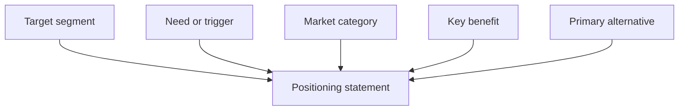

# Lecture 1 — Positioning and Messaging

> **Duration:** ~2 hours. **Outcome:** You can write a positioning statement that names a specific segment, a specific need, a specific category, and a specific differentiator — then translate it into a messaging house with pillars, feature-to-benefit mapping, and proof points, tailored to more than one audience.

Every launch conversation you're about to have — with marketing, with sales, with support, with the exec who wants to know "what are we telling customers" — collapses without warning into an argument about words. This lecture gives you the two documents that end that argument before it starts: a **positioning statement** (one paragraph, internal, the strategic truth of what this is and who it's for) and a **messaging house** (the external-facing translation of that truth into words a customer actually reads).

## 1. Positioning is not messaging, and neither is a tagline

These three things get flattened into "marketing stuff" constantly. They are not the same, and confusing them is why launches ship with copy nobody agrees on:

| | Positioning | Messaging | Tagline/copy |
|---|---|---|---|
| Audience | Internal — product, sales, marketing, support all read the *same* positioning | External — the customer, tailored per segment/channel | External — the shortest possible expression |
| Job | State the strategic truth: who this is for, what need it fills, what it's *not* | Turn that truth into words that land with a specific audience | Turn messaging into a headline, an email subject, an ad |
| Changes how often | Rarely — it's the foundation everything else is built on | Per segment, per channel, sometimes per campaign | Constantly, cheaply, A/B tested |
| Example | "For teams that work with outside collaborators, Guest Access is the permission model that keeps external people scoped to exactly the project they're invited to" | To an agency: *"Bring your client into the one project they need to see — nothing else."* To an enterprise buyer: *"Give auditors and outside counsel exactly the access your compliance team will sign off on."* | *"Invite anyone. Show them only what matters."* |

Positioning is the thing you decide **once, deliberately**, before a single word of external copy gets written. Everything downstream — the landing page, the sales deck, the in-app tooltip, the support macro — is a translation of the same positioning into a different audience's language. If two people on your launch team can't agree on the positioning statement, they will write contradictory external copy and nobody will notice until a customer points it out.

## 2. The positioning statement template

The template below is the industry-standard "Crossing the Chasm" positioning format (Geoffrey Moore), still the most widely used shape in B2B product marketing because it forces five decisions in one sentence:

> **For** [target segment] **who** [has this need / this trigger event], **[product/feature]** is a **[market category]** that **[key benefit / differentiator]**. **Unlike** [primary alternative], **[product/feature]** **[the one or two things that make the difference true]**.

Every blank is a decision, not a fill-in-the-blank exercise:

- **Target segment** — not "our users." A named, specific segment. "Teams that regularly bring outside collaborators into their workflow" is a segment. "Everyone who manages tasks" is not — it's the absence of a decision.
- **Need/trigger** — the moment this becomes relevant. Not a feature description; a situation. "Has signed a deal that requires giving an external auditor or client visibility into a live project" is a trigger. "Wants better collaboration" is not specific enough to write copy against.
- **Market category** — the mental shelf you want the buyer to file this on. This matters more than people expect: if you position Guest Access as "a permissions feature," IT evaluates it against their existing SSO/RBAC stack. If you position it as "an external collaboration workflow," a project lead evaluates it against emailing spreadsheets to a client. Same feature, wildly different competitive set, depending on the category you choose.
- **Key benefit/differentiator** — the *one* thing that matters most to this segment, stated as an outcome, not a mechanism. "Uses row-level scoping" is a mechanism. "Never exposes a task outside the one project the guest was invited to" is the outcome that mechanism produces.
- **Primary alternative** — what the customer does **today**, without you. For a genuinely new capability, the primary alternative is almost never a competitor — it's the manual workaround: exporting a CSV, screen-sharing on a call, giving the outside party a full paid seat they don't need, or emailing a spreadsheet. Naming the real alternative (not a straw-man competitor) is what makes the differentiation credible.


*Five deliberate decisions, not blanks to fill in, combine into one positioning statement.*

### Worked example — Guest & External Collaborator Access, enterprise segment

> **For** enterprise teams whose contracts require giving outside auditors, counsel, or clients visibility into a live project, **Guest & External Collaborator Access** is a **scoped external-collaboration feature** that **lets you invite an outside party into exactly one project with zero visibility into anything else in the workspace**. **Unlike** giving that person a full paid seat or exporting data into an email thread, Guest Access **keeps every action logged, keeps the guest out of unrelated projects by construction, and requires no IT provisioning ticket to set up.**

Read that back against the five blanks. Segment: enterprise teams under contractual visibility obligations — not "big companies." Trigger: a signed contract requiring outside visibility — not "wants collaboration." Category: *scoped external-collaboration feature* — deliberately not "permissions" (too IT-flavored, invites the wrong competitive comparison) and not "sharing" (too casual for a compliance buyer). Benefit: zero visibility leakage, stated as an outcome. Alternative: the two things enterprise teams actually do today (buy a seat, or email a spreadsheet), not a made-up rival product.

### A second positioning statement, a different segment, same feature

The mistake most teams make next is writing **one** positioning statement and reusing it everywhere. A feature this general (external collaboration) genuinely serves segments with different needs — write a statement per segment, not per feature.

> **For** creative and consulting agencies who review work-in-progress with clients every week, **Guest & External Collaborator Access** is a **client-review workflow** that **lets a client comment and approve directly on the live project, with no login friction and no risk of them wandering into other clients' work**. **Unlike** sharing a read-only export or a separate review tool, Guest Access **stays inside the same project your team is already working in, so feedback never goes stale.**

Same feature. Different category ("client-review workflow" vs. "scoped external-collaboration feature"), different trigger (weekly review cadence vs. a signed contract), different alternative (a separate review tool vs. a full paid seat), and a completely different benefit emphasis (no login friction, feedback freshness vs. compliance-grade isolation). An agency buyer and an enterprise compliance buyer do not care about the same thing, and pretending one sentence serves both is how you end up with copy that's technically accurate and persuasive to nobody.

## 3. Segmentation before positioning: reuse your JTBD work

Positioning without a segment is a sentence about a feature, not a sentence that sells. Week 3 taught you to write Jobs-to-be-Done statements from discovery. Reuse that muscle here: **every positioning statement should map to a JTBD you can point to**, not a persona you invented in the launch meeting.

For Guest Access, Week 5's backlog already told you the segments that matter, because they told you *why* each was asking:

| Segment | Requested by (Week 5 backlog) | Job to be done |
|---|---|---|
| Enterprise, compliance-driven | Sales — 3 signed deals blocked on this | "When I've contractually promised a client visibility into a project, I need to grant it without also granting risk, so I can close and keep the deal." |
| Agencies / consulting, Mid-Market & SMB | Inferred from usage pattern, confirmed in beta | "When my client wants to see progress, I need to show them the live project without a tool switch, so feedback stays fast and doesn't go stale in an email thread." |

Two segments, two jobs, two positioning statements. If you find yourself writing a *third* positioning statement for a segment with no evidence behind it — no interview, no backlog request, no beta signal — stop and ask whether you're positioning to real demand or to a hypothetical one. Positioning invented in a launch meeting, with no discovery behind it, is the single most common way a launch's messaging misses the actual buyer.

## 4. From positioning to messaging: the messaging house

Positioning is one paragraph for internal alignment. **Messaging** is the set of external-facing statements built on top of it — organized as a **messaging house**: one roof (the core message), a few pillars (the 2–4 reasons to believe it), each pillar backed by proof.

```
                    ROOF (core message)
   "Bring outside people into exactly the work they need to see —
              nothing else, and nothing to set up."
   ┌───────────────────┬───────────────────┬───────────────────┐
   │     PILLAR 1       │     PILLAR 2       │     PILLAR 3       │
   │   Scoped by         │   No provisioning   │   Fully logged      │
   │   construction       │   friction           │                    │
   ├───────────────────┼───────────────────┼───────────────────┤
   │ Proof: guest sees    │ Proof: invite sent   │ Proof: every guest  │
   │ only the one project │ and accepted in       │ action recorded in  │
   │ they were invited to,│ under 10 minutes      │ the audit log        │
   │ verified by the       │ (median across beta)  │ shipped 2 weeks      │
   │ permission model      │                        │ before this launch   │
   └───────────────────┴───────────────────┴───────────────────┘
```

Each **pillar** is a claim; each **proof point** is the specific, checkable fact that makes the claim credible. "Fully logged" is a pillar; "every guest action recorded in the audit log" is the proof, and it's *checkable* — a skeptical buyer, or your own legal team, can go verify it. A messaging house with pillars but no proof points is just adjectives.

### Feature-to-benefit-to-proof mapping

The tool that keeps a launch team's copy consistent across channels — sales deck, landing page, in-app tooltip, support macro — is a simple table every writer pulls from instead of inventing their own phrasing:

| Feature (what it does) | Benefit (what the user gets) | Proof (how you know it's true) |
|---|---|---|
| Guest role is scoped to a single project at invite time | Guests never see other projects, clients, or financials in the workspace | Verified in security review; enforced at the database query layer, not just the UI |
| Guest invites don't require the guest to have a Loopline account beforehand | An outside party can be in the project within minutes of being invited | Beta median time from invite to accept: 43 minutes; time from accept to first action: 21 minutes |
| Every guest action (view, comment, file access) is written to the audit log | Compliance and security teams can produce a full record of what an external party did and when | Shipped as a prerequisite to this feature; already passed Anchor Bank's security review |

Notice the discipline: **feature** is a mechanism (what engineering built), **benefit** is an outcome stated from the customer's point of view, and **proof** is a fact, not an adjective — a number, a verified claim, a "this already passed X's review." A sales rep handed this table can build a slide for any segment without guessing at phrasing, and a support agent can answer "is this actually secure?" with the same proof point marketing used on the landing page. That consistency is the entire point — a customer who reads three different explanations of the same feature from three different channels loses trust before they've even tried it.

## 5. Validating positioning with real customer language, not guesses

A positioning statement written entirely at a desk is a hypothesis, not a fact — the same discipline from Week 2's discovery work applies here: you don't know your positioning is right until you've heard it reflected back in a customer's own words. Two cheap, fast ways to check before you commit to it broadly:

**Mine the language your earliest users already use.** By the time you're drafting final messaging, you likely already have signal — a beta customer's support ticket, a sales call note, an interview quote. Look for the *verbs and nouns customers use unprompted*, not the ones you put in front of them. If three separate beta accounts independently describe Guest Access as "finally I don't have to give the auditor a whole seat," that phrase — *"a whole seat"* — is more persuasive than anything your team invented, because it's the customer's own framing of the alternative they were unhappy with. Positioning that echoes a customer's real complaint back to them reads as insight; positioning that sounds like it came from a deck reads as marketing.

**Test the statement on someone who isn't in the room.** Read your positioning statement to a colleague outside the launch team — ideally someone in a different function — and ask them to repeat back, in their own words, who it's for and why it matters. If what comes back is vague ("something about permissions?"), the statement hasn't landed, no matter how precise it looked on the page. This is a five-minute check that catches more problems than another round of internal wordsmithing.

Neither of these requires a formal research study. They require treating the positioning statement as a claim you should be willing to have disproven — the same epistemic honesty Week 7's experimentation work asked of you, applied to words instead of a feature.

## 6. From positioning to a sales talk track: handling objections

A positioning statement a sales rep can't use in a real conversation isn't finished. The last translation step is turning the messaging house's pillars into short, specific answers to the objections a skeptical buyer will actually raise — write these down so every rep gives a consistent answer, instead of improvising differently each time.

| Buyer objection | Grounded in which pillar | Talk-track answer |
|---|---|---|
| "How do I know the guest can't see our other projects?" | Scoped by construction | "It's enforced at the database layer, not just hidden in the UI — the guest role has no permission to query anything outside the invited project. This passed [Anchor Bank]'s security review before their team went live on it." |
| "What if IT needs to provision this?" | No provisioning friction | "There's no ticket to file — you invite the guest by email, they accept, they're in. Median time from invite to first action in beta was under 25 minutes." |
| "Can we audit what a guest actually did?" | Fully logged | "Every guest view, comment, and file access writes to the same audit log your compliance team already uses for internal activity — nothing guest-specific to bolt on." |
| "Isn't this basically what [competitor] already does?" | (Tests your "Unlike" clause) | Redirect to the real alternative your positioning names — in most deals here, the honest comparison isn't a competitor product, it's "what you're doing today," which is a full paid seat or an emailed export. Naming that plainly, instead of pretending a rival product is the comparison, is usually more convincing to a buyer who's lived the actual workaround. |

Notice the last row: a weak positioning statement collapses under this objection because it never named a real alternative to defend against. A strong one — built with a genuine "Unlike" clause from Section 2 — already has the answer built in, because the objection *is* the alternative you already named.

## 7. Positioning against yourself, and other common mistakes

- **Positioning against a straw-man competitor instead of the real alternative.** Loopline doesn't have a credible "Guest Access" competitor to punch at — the real alternative is a spreadsheet emailed to a client or a wasted paid seat. Positioning against a competitor that isn't actually who you're losing deals to is persuasive to no one who's lived the actual problem.
- **Leading with the feature, not the outcome.** "We built row-level permission scoping" is true and boring. "Your client sees the one project, nothing else" is the same fact, stated as what the customer gets.
- **One statement for every segment.** Covered above — resist the urge to average your positioning across audiences with different jobs. An averaged statement persuades nobody because it's specific to no one.
- **Positioning that isn't falsifiable.** "The best way to collaborate with clients" is a claim nobody can check and everybody can ignore. "Guests never see anything outside the one project they're invited to" is a claim a security reviewer can go verify — which is exactly what makes it persuasive to a skeptical buyer instead of just a marketing buyer.
- **Skipping the "unlike" clause.** Without a named alternative, you haven't actually differentiated — you've just described. The "unlike" clause is where positioning stops being a description and starts being an argument.

## 8. Check yourself

- What's the difference between positioning and messaging — who reads each, and how often does each change?
- Write out the five blanks of the positioning template from memory. What decision does each blank force?
- Why does the *market category* you choose change who the customer compares you against?
- For Guest Access, why is "a full paid seat" a more honest primary alternative than a made-up competitor product?
- What makes a proof point different from an adjective in a messaging pillar?
- Why is positioning invented without a JTBD or backlog request behind it a red flag?
- Why is a customer's own unprompted phrasing ("a whole seat") more persuasive raw material than a phrase your team invented?
- In the objection-handling talk track, why does the strongest answer to "isn't this just like [competitor]?" come from the positioning statement's "Unlike" clause rather than a new argument invented on the spot?

If those are automatic, Lecture 2 moves from "what do we say" to "who hears it, in what order, and through what channel" — launch tiers and channels.

## Further reading

- **April Dunford — positioning framework overview:** <https://www.aprildunford.com/what-is-product-positioning> (the "Obviously Awesome" method this lecture's template is compatible with)
- **Atlassian — writing a positioning statement:** <https://www.atlassian.com/agile/product-management/positioning-statement>
- **Segment — the case for messaging consistency across channels:** <https://segment.com/blog/great-marketing-copy/>
