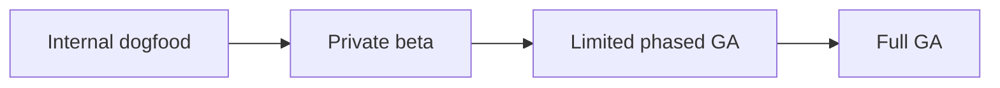
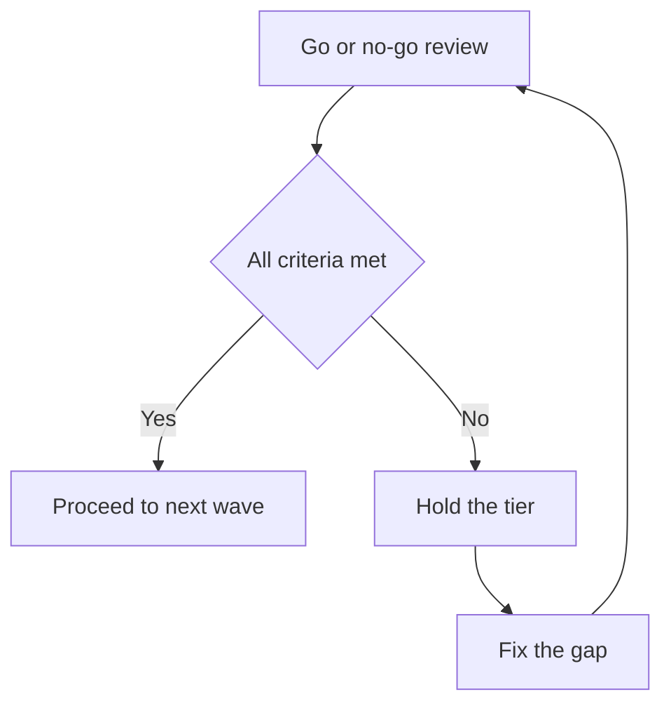

# Lecture 2 — Launch Tiers and Channels

> **Duration:** ~2 hours. **Outcome:** You can size a launch tier to the actual risk of what's shipping, choose a channel mix that matches that tier, and coordinate product, engineering, marketing, sales, and support around a single plan with named owners.

The most common launch mistake isn't a messaging mistake — it's a **sizing** mistake. Teams either throw a company-wide announcement at something half-tested (and get burned when it breaks at scale) or bury a genuinely important, well-tested feature in a changelog line nobody reads (and wonder why adoption is flat). This lecture gives you the framework to size the launch to the risk, then pick channels that match the tier you chose.

## 1. Launch tiers — the four sizes, and what each one buys you

| Tier | Who sees it | Purpose | Typical duration |
|---|---|---|---|
| **Internal / dogfood** | Your own company only | Catch the obvious breakage before any customer does; validate the happy path end to end | Days to 1–2 weeks |
| **Private beta** | A named, hand-picked list of customers, invited directly | Validate with real customers, real data, real edge cases — with a group that has agreed to tolerate rough edges and give feedback | 1–3 weeks |
| **Limited / phased GA** | An increasing percentage of the eligible base (e.g., 10% → 25% → 50% → 100%), or a specific region/segment first | De-risk scale: does the thing that worked for 8 orgs still work for 800? Each wave is a checkpoint, not a formality | Days to weeks per wave |
| **Full GA** | Everyone eligible | The feature is now a standard, permanent part of the product; the "launch" phase is over | Ongoing |

The tiers exist so you can **stop, or slow down, between them.** A launch plan that goes straight from "engineering finished it" to "announced to all customers" has skipped every checkpoint where you'd actually catch a problem while it's still small. The whole discipline of this lecture is: **don't let excitement collapse the tiers.**

*Each tier is a checkpoint you can stop or slow down at, not a straight line to everyone.*

### Sizing the tier to risk, not to enthusiasm

Ask four questions about what's shipping. The more "yes, this is risky" answers, the more tiers you use and the longer you dwell in each one:

1. **Blast radius if it breaks.** If Guest Access has a permission bug, an outside party could see data they shouldn't — that's a security incident, potentially a breach-disclosure conversation, potentially a lost enterprise deal. A cosmetic bug in a UI redesign has a blast radius of "someone complains about a color." Guest Access clearly needs the full tiered treatment; a button color change does not.
2. **Reversibility.** Can you flip it off instantly with a feature flag and the damage stops, or is data already mutated/exposed in a way you can't undo? Guest Access is flag-reversible (turn the flag off, no new guests can be invited), but any data a guest already saw during the bug window is *not* reversible — that shapes how fast you need to detect a problem, not just whether you can turn it off.
3. **Support and success cost.** Will this generate a predictable spike in tickets (a UI change always does, briefly) or an unpredictable one (a permissions model is genuinely new territory for both customers and your own support team, who need training before wave 1)?
4. **Brand/PR exposure.** Enterprise buyers and compliance teams will scrutinize Guest Access specifically because "external access" is a phrase that triggers security review. A feature nobody outside your existing users will ever hear about carries much less exposure.

Guest Access scores high-risk on 1, 2, and 3, and medium on 4 (real enterprise scrutiny, but not public-facing/press-worthy). That's exactly the profile that earns the full four-tier treatment: internal → private beta (the 3 blocked deals + 5 design partners) → 25% GA → 100% GA, with real dwell time between each and a named rollback path — which is exactly what the Week 9 seed data models.

### Anti-pattern: tier size driven by internal politics, not risk

A frequent failure mode: an exec wants a big splashy announcement for something that's still genuinely risky, or a team is embarrassed by a small feature and skips beta to avoid looking unambitious. **The tier is an engineering-and-risk decision, dressed up as a marketing decision.** If leadership wants a bigger splash than the risk profile supports, the answer is to de-risk faster (more testing, tighter monitoring, a shorter beta) — not to skip the tier.

## 2. Channels — where the message actually reaches people

Once you know the tier, channel selection follows almost mechanically: **a channel's reach should never exceed the tier's audience.** Announcing a private-beta feature in a public changelog defeats the point of having a beta.

| Channel | Best for | Notes |
|---|---|---|
| **In-product** (changelog, in-app banner, empty-state copy, tooltip) | Any tier — the only channel that reaches people who are already using the feature's surface area | Cheapest, most-trusted channel; customers expect it and mostly ignore anything louder |
| **Direct/lifecycle email** | Private beta invites, GA announcements to eligible segments | Targetable by exactly the org list your rollout table already has — no reason to guess who's eligible |
| **Docs / help center** | Every tier from beta onward | Must ship *before* the tier goes live, not after — support will field the first questions from docs, not from you |
| **Sales enablement** (battlecards, deal-desk notes, talk track) | Any launch that unblocks or affects active deals | For Guest Access, this is not optional — Sales needs to know the moment the 3 blocked deals are unblocked, before the customer tells them |
| **Support enablement** (macros, escalation runbook, known-issues doc) | Every tier — support is the first channel that hears about problems, whether or not you planned for that | Ship the runbook *before* wave 1, especially for anything security-adjacent |
| **Community / social / public changelog** | Full GA, and only for features with broad appeal | Premature for beta or limited GA — it invites demand you can't yet serve safely |
| **Press / analyst briefing** | Reserved for genuinely major launches (new product line, major pricing shift) | Almost never appropriate for a single feature launch; mentioned here so you know when to *not* reach for it |
| **Partner / API channel** | Launches that affect integration partners or the public API | Not relevant to Guest Access; relevant to items like `public_api_webhooks` from Week 5's backlog |

### Applying it: Guest Access channel plan by tier

| Tier | Audience | Channels |
|---|---|---|
| Internal | Loopline employees | Internal Slack announcement, dogfood instructions, internal docs |
| Private beta | 3 blocked-deal enterprise orgs + 5 design partners (8 orgs) | Direct email invite from the account's CSM/AE (not a mass email — these are named relationships), a beta-specific quick-start doc, a private Slack/support channel for the 8 orgs, Sales is briefed the moment each of the 3 blocked deals is unblocked |
| Limited GA (25%) | 8 additional orgs, selected across segments | In-app banner scoped to eligible orgs only, docs published publicly, support macro live, no public changelog entry yet |
| Full GA (100%) | All 24+ eligible orgs, and all future eligible orgs | Public changelog entry, in-app announcement to all eligible orgs, help center article live, sales battlecard finalized, community forum post (agencies had been asking) |

Notice the channel list *grows* with the tier — beta gets a hand-written email from a real human on a real account team; full GA gets a changelog line. That's not because beta customers are more important in the abstract; it's because a hand-picked group of 8 needs a relationship-driven channel, and an eligible base of hundreds needs a scalable one.

## 3. Cross-functional coordination: RACI

A launch touches functions that don't normally share a single document. The tool that prevents "I thought support knew" is a **RACI** — Responsible, Accountable, Consulted, Informed — mapped against the launch's real work streams.

| Work stream | Responsible | Accountable | Consulted | Informed |
|---|---|---|---|---|
| Positioning & messaging | Product Marketing | PM (you) | Sales, Support | Exec sponsor |
| Feature flag / rollout mechanics | Engineering lead | PM (you) | — | Support, CS |
| Launch checklist & go/no-go | PM (you) | PM (you) | Eng lead, Support lead, Legal | Exec sponsor, Sales |
| Sales enablement (battlecard, deal desk) | Product Marketing | Sales enablement lead | PM, Sales AEs on blocked deals | Full sales team |
| Support enablement (macros, runbook) | Support lead | Support lead | PM, Eng | Full support team |
| Security/compliance sign-off | Security team | Security lead | PM, Eng, Legal | Sales (for the 3 blocked deals specifically) |
| Success metrics & rollback monitoring | PM (you) | PM (you) | Data/analytics, Eng | Exec sponsor |

Two rules make a RACI actually useful instead of decorative: **exactly one Accountable per row** (shared accountability is no accountability), and **the RACI is written down and shared before the go/no-go meeting**, not reconstructed afterward when something goes wrong and everyone points at each other.

## 4. The go/no-go gate between tiers

Each tier boundary is a checkpoint, not a calendar event. Before moving from private beta to `ga_25`, or from `ga_25` to `ga_100`, the launch owner runs a short go/no-go review against pre-agreed criteria — not a vibe check:

- **Adoption signal is present** — did beta orgs actually use the feature, not just have it available? (Exercise 3 builds exactly this query.)
- **No open critical/high-severity tickets tied to the feature.**
- **Support and sales enablement are shipped and confirmed read**, not just "sent."
- **Security/compliance sign-off is current** for the segment about to be exposed (an Enterprise wave needs a fresher sign-off than an SMB wave, given the segment's scrutiny).
- **A named rollback owner and rollback procedure exist** for the *next* wave, before it starts — not improvised after.

If any of these is a "no," the answer is to hold the tier, fix the gap, and re-check — not to proceed and hope. This is the exact discipline that Lecture 3's rollback criteria formalize into numbers instead of judgment calls.

*The gate loops back until every pre-agreed criterion is satisfied — it never proceeds on hope.*

## 5. Check yourself

- Name the four launch tiers in order, and one thing each buys you that skipping straight to the next tier would lose.
- Why should a channel's reach never exceed its tier's intended audience? What goes wrong if it does?
- For Guest Access, why does beta use a hand-written email from a CSM rather than a mass send, while full GA uses a changelog line?
- In a RACI, why must every row have exactly one Accountable owner?
- Name three things a go/no-go gate should check before a rollout is allowed to expand to the next wave.
- Why is "the tier is a marketing decision" the wrong framing? Whose decision should it actually be, and on what basis?

If those are automatic, Lecture 3 makes the tiers themselves data-driven: feature flags, SQL launch dashboards, and rollback criteria you define before you need them.

## Further reading

- **LaunchDarkly — feature flags and progressive delivery, an overview:** <https://launchdarkly.com/blog/what-are-feature-flags/>
- **Atlassian — RACI matrix, how to build one:** <https://www.atlassian.com/work-management/project-management/raci-chart>
- **Google Cloud — canary and phased rollout patterns:** <https://cloud.google.com/architecture/application-deployment-and-testing-strategies>
