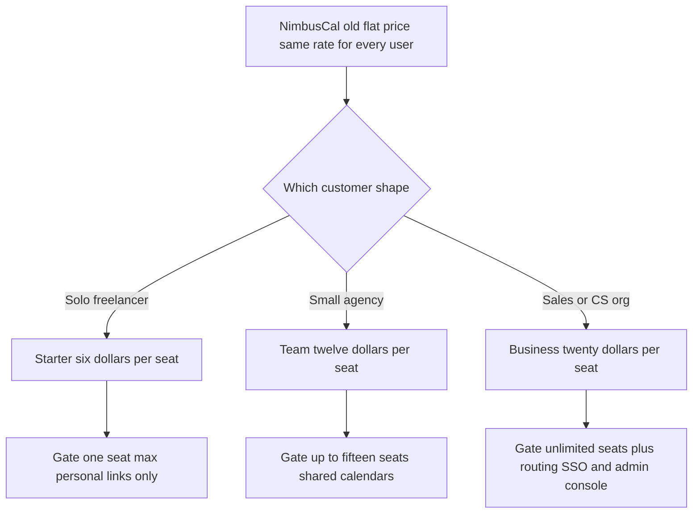

# Lecture 1 — Pricing Models and Packaging

> **Duration:** ~2 hours. **Outcome:** You can name the four common pricing models and pick the right one for a product, design Good/Better/Best tiers that gate on a real value metric, use anchoring on purpose instead of by accident, and describe two ways to research willingness-to-pay without just asking "would you pay $X?"

Pricing is the least-taught, most-consequential decision a product organization makes. Get the roadmap wrong and you ship the wrong feature — expensive, but recoverable. Get pricing wrong and you either leave revenue on the table for years without noticing, or you cap your total addressable market at a price nobody above a certain size will pay. And unlike almost every other product decision, pricing is nearly impossible to A/B test cleanly (Week 7's tool doesn't work well here — you can't show two customers different prices for the same seat without it leaking, and "test" pricing on real customers has real legal and trust implications). That combination — high stakes, hard to experiment on — is exactly why it needs a framework, not a gut call.

## 1. Four pricing models

Every SaaS price tag is built from one (or a blend) of four models. Each optimizes for a different relationship between what the customer pays and what they get.

### Flat subscription

One price, one bundle, paid on a recurring cadence (monthly/annual) regardless of usage.

- **Fits:** simple products, early-stage companies that need pricing simplicity more than revenue optimization, products where usage doesn't vary wildly across customers.
- **Fails when:** customers vary a lot in the value they get — a flat price either overcharges your smallest customers or undercharges your biggest ones. This is exactly Loopline's current problem (more below).
- **Example shape:** early Basecamp — one price, unlimited projects, unlimited users, full stop.

### Usage-based

Price scales with a metered unit of consumption — API calls, GB stored, compute-seconds, messages sent.

- **Fits:** infrastructure and platform products where cost-to-serve scales with usage, and where usage is a decent proxy for value received. Removes the "will this be worth it before I even try it" objection — you pay for what you use, starting near zero.
- **Fails when:** usage is unpredictable, making customer budgeting a nightmare ("bill shock"), or when usage doesn't correlate with value (a customer who runs an inefficient query pays *more* for the same outcome, which is perverse).
- **Example shape:** Twilio (per SMS/call), Snowflake (per compute-second), AWS S3 (per GB-month).

### Freemium

A free tier that's fully functional for a real use case, with a paid tier unlocked by a specific value threshold or feature.

- **Fits:** products with strong network effects or viral loops (Lecture 2), where free users add value to the product even if they never pay — Slack's free tier makes a workspace usable enough to prove value before someone has to swipe a card. Also fits products with very low marginal cost per free user (mostly software, not anything with real per-user infrastructure cost).
- **Fails when:** the free tier is *too* generous (nobody ever needs to upgrade) or *too* stingy (it doesn't prove real value, so it doesn't build the trust that converts). Tuning that line is most of the work of running a freemium model well.
- **Example shape:** Notion (free for individuals, paid for teams/history), Dropbox (free 2GB, paid for more).

### Seat-based (per-user)

Price scales with the number of people using the product inside an account — the model most B2B collaboration tools default to, including Loopline today.

- **Fits:** products whose value genuinely scales with headcount — a 5-person team gets roughly 5x the value of a 1-person account, because more people means more collaboration surface.
- **Fails when:** value doesn't actually scale linearly with seats — a tool used by 3 power users and 40 "read-only, checks in once a week" seats charges the light users the same as the power users, which both overcharges the light seats and creates an incentive for customers to under-provision seats (share logins, add fewer people than would actually benefit) purely to save money.
- **Example shape:** Slack, Asana, Loopline's current $12/seat/month plan.

Real products blend these. Notion is freemium *and* seat-based once you're on a paid tier. Datadog is seat-based for some products, usage-based for others. **Loopline today is purely seat-based, flat-rate within that** — every seat costs $12/month whether the account has 2 seats or 200, and there's no free tier, no usage dimension, and no tiers at all. That's the gap this week closes.

### Hybrid pricing in practice

The most common hybrid in mature B2B SaaS is **seat-based base + usage-based overage**: a customer pays a per-seat platform fee that covers a generous usage allowance, then pays incrementally for usage past that allowance. This captures the predictability buyers want from seat pricing (a finance team can budget a base number) while still letting revenue track genuinely heavy usage instead of capping it artificially.

A worked shape, still using NimbusCal (Section 2's running example) as the vehicle: instead of a hard cap of "15 seats" on the Team tier, NimbusCal could charge $12/seat/month **including** 500 booking-link views per seat per month, then $0.02 per view past that. A 10-seat agency with normal usage never notices the overage line; a 10-seat agency running a high-volume public booking campaign pays more, proportional to the value they're extracting — without NimbusCal having to invent a fourth tier just to capture that one usage pattern. The trade-off: hybrid pricing is measurably harder to explain on a pricing page and harder for a customer to predict their bill in advance, which is exactly why it's usually introduced only after a flat-tier structure is already working, not as a first move.

## 2. Packaging: Good/Better/Best

Packaging is the separate decision of *how many tiers exist and what's in each one* — independent of which pricing model you chose. Almost every mature SaaS product converges on **three tiers**, and the reason is structural, not a coincidence:

- **One tier** gives every buyer exactly one choice, which either overcharges the small end or undercharges the big end (Loopline's exact problem).
- **Two tiers** creates an awkward binary — customers anchor on whichever one seems "closer" to what they want, and you get no signal about where the real willingness-to-pay boundary sits.
- **Three tiers** gives you a **decoy** effect: the presence of a "Best" tier makes "Better" look like the reasonable middle choice, even for a buyer who'd never seriously consider "Best." This is not a trick played *on* customers — it works because it genuinely helps an uncertain buyer orient ("I'm probably not the top 1%, and I'm not just kicking the tires either") — but it only works with three or more options.
- **More than four tiers** usually means you've stopped packaging by customer segment and started packaging by internal org chart — a common failure mode where every team that ships a feature wants its own row on the pricing page.

### Gate by value metric, not by feature count

The single most important packaging rule: **what moves a customer from one tier to the next should be a value metric they experience directly, not an arbitrary feature checklist.** A value metric is something the customer would nod along to as "yes, this tier should cost more because I'm getting more of *this*."

| Value metric examples | Bad gates (feel arbitrary) |
|---|---|
| Number of seats/users | "Pro users get a blue checkmark" |
| Volume of usage (API calls, storage, messages) | Randomly picking which of 40 features go in which tier |
| Number of projects/workspaces | Splitting a single coherent workflow across two tiers (forces every real user to upgrade immediately, which just makes the lower tier a fake option) |
| Advanced/compliance capability (SSO, audit log, SLA) | Gating a bug fix or an obviously-expected feature behind a paid tier |

Loopline's current situation is the textbook case for the second column. When `guest_external_access` and `audit_log_compliance` shipped (Week 5's roadmap), they went out to **every** account on the single $12/seat plan — including the startup with 3 seats that will never need SOC 2 compliance. That's not "generous," it's a packaging decision nobody made on purpose. Compliance features are one of the cleanest value-metric gates in all of B2B SaaS: the customers who need SSO and an audit log are, almost by definition, the customers with the internal security review process that makes them willing to pay more for exactly those capabilities.

### A worked example: NimbusCal

Take a small fictional calendar-scheduling product, NimbusCal, through a Good/Better/Best redesign, so the mechanics are clear before you do this for real on Loopline in Exercise 1.

NimbusCal currently charges $8/user/month flat, no tiers. Its usage data shows three real customer shapes: solo freelancers who book their own meetings (1 seat, no team features needed), small agencies who need shared team calendars and basic booking links (3–15 seats), and larger sales/success orgs who need round-robin routing, CRM sync, and admin controls across a whole department (15+ seats).

| | **Starter** | **Team** | **Business** |
|---|---|---|---|
| **Price** | $6/user/mo | $12/user/mo | $20/user/mo |
| **Gated on** | 1 seat max, personal booking links only | Up to 15 seats, shared team calendars, basic booking links | Unlimited seats, round-robin routing, CRM sync, SSO, admin console |
| **Who it's for** | Solo freelancers | Small agencies | Sales/CS orgs with a real admin function |

Notice what this did: it **lowered** the entry price (Starter is cheaper than the old flat $8) to remove friction for the segment that was overpaying, and it **raised** the ceiling substantially (Business at $20, 2.5x the old flat price) for the segment that genuinely gets more value and has budget for it. The middle tier, priced close to the old flat rate, is where most existing customers land — and it's deliberately the most attractive-looking option once Business exists next to it as the anchor.

*Good, Better, Best packaging: each tier gated on a value metric the customer actually feels, not a feature checklist.*

## 3. Anchoring, on purpose

**Anchoring** is the well-documented effect where the first number a person sees shapes how they judge every number after it. In pricing pages, this shows up two ways:

1. **Tier anchoring** — as in the NimbusCal table, the top tier's price makes the middle tier look reasonable by comparison, even for buyers who'll never buy the top tier. Most pricing pages visually highlight the middle tier ("Most Popular") for exactly this reason — they're nudging the anchor to do its job.
2. **Annual vs. monthly anchoring** — showing the *annual* price divided down to a monthly-equivalent number (e.g., "$10/mo, billed annually" instead of "$120/year") makes the number look smaller and comparable to a monthly competitor, while still capturing the cash-flow and retention benefits of an annual contract.

Anchoring is not manipulation when the anchor reflects real value differences — Business genuinely does cost more to support and genuinely does deliver more capability. It becomes manipulative when a tier is deliberately padded with a feature nobody wants, purely to make the anchor number bigger. Know the difference and stay on the right side of it.

## 4. Willingness-to-pay research

You should never set a price point by guessing, and you should almost never set it by directly asking "how much would you pay for this?" — direct price questions get you either a defensively low anchor (nobody wants to look easy to overcharge) or a meaningless "sure, sounds fine" that doesn't survive contact with an actual invoice.

### The Van Westendorp Price Sensitivity Meter

A structured interview technique that asks **four** questions instead of one, sidestepping the defensiveness of a direct ask:

1. At what price would this be **so cheap** you'd question the quality? (*too cheap*)
2. At what price would this be a **bargain** — a great deal for the money? (*cheap*)
3. At what price would this start to seem **expensive**, but you'd still consider it? (*expensive*)
4. At what price would this be **so expensive** you'd not consider it at all? (*too expensive*)

Plot the cumulative response curves for all four questions across a sample of prospective buyers, and you get a visual "acceptable price range" bounded by where the "too cheap" and "too expensive" curves cross the "bargain" and "expensive" curves — a range, not a single number, which is honest about the fact that willingness-to-pay varies across your actual customer base. You'll run a small version of this in Exercise 1's stretch goal.

### Conjoint analysis (briefly)

A heavier research method where respondents are shown several *bundles* of features-at-a-price and asked to choose their preferred bundle repeatedly, across many randomized combinations. Statistical analysis of hundreds of these forced choices reveals the implicit dollar value respondents place on each individual feature — useful for exactly the packaging question ("is SSO worth $6/seat more to this segment, or $2?"), but expensive to run well and usually reserved for pricing changes big enough to justify a dedicated research budget.

### Qualitative signal you already have

Before running new research, mine what you already have: support tickets that mention price ("we'd need X to justify the cost"), sales-lost reasons tagged "price," and — for Loopline specifically — churn reasons already sitting in the `subscriptions` table you'll query in Lecture 3 (Silverpine AI's churn reason: *"Cost too high for pre-seed team"*; Vantage Manufacturing's: *"no SSO/SAML and no audit log"* — one is a "too expensive for this segment" signal, the other is a "not paying enough to justify the missing capability" signal, and they point to opposite fixes).

## 5. Common packaging mistakes

Four failure patterns show up constantly once a company starts trying to fix a flat-price problem like Loopline's. Watching for them now will save you from writing an Exercise 1 pricing design that quietly repeats one.

1. **The "everything tier" trap.** A team afraid of losing any customer puts almost every feature in the lowest tier "just in case," leaving nothing meaningful to gate the higher tiers on except seat count. The result looks like three tiers but functions like one — nobody has a real reason to pay for Business except needing more seats than Team allows.
2. **Retroactively punishing existing customers.** Shipping a valuable new capability (like Loopline's audit log) and immediately locking *existing* customers out of something they already had access to, with no notice, is the fastest way to generate support tickets and public complaints — even if the repricing itself is fair. This section's willingness-to-pay research doesn't fix a rollout problem; Lecture 3 and Challenge 1 cover the rollout mechanics that do.
3. **Gating on a metric the customer can't see.** A gate has to be legible — "up to 15 seats" is legible; "up to some internal complexity score we compute on your account" is not, and a customer who can't tell which tier they need won't trust the pricing page enough to self-serve into a purchase at all.
4. **Copying a competitor's tier names and prices without checking whether the underlying value metric matches.** Three tiers named Starter/Team/Business only work if *your* product's actual usage patterns cluster into three groups the way the competitor's did — pasting someone else's price ladder onto a product with a different value shape produces tiers nobody's real usage fits cleanly into.

## 6. Check yourself

- Name a real product for each of the four pricing models and say why that model fits it.
- Why does a single flat price systematically overcharge some customers and undercharge others?
- What makes a packaging gate feel fair to a customer versus arbitrary?
- Why do most SaaS pricing pages have exactly three tiers, not two or five?
- What's the difference between anchoring that reflects real value and anchoring that's manipulative?
- Why is "how much would you pay for this?" a bad interview question, and what does Van Westendorp ask instead?
- What problem does seat-based-plus-usage-overage hybrid pricing solve that a hard seat cap doesn't, and what does it cost you in return?
- Name one of the four common packaging mistakes and describe what it looks like in practice.
- Explain, in one sentence, why Loopline giving away `audit_log_compliance` and `guest_external_access` to every account is a packaging problem, not a pricing-level problem.

If those are automatic, Lecture 2 shifts from *how you charge* to *how you grow* — and shows you why Loopline's guest-invite feature might be worth more as a growth engine than as a compliance checkbox.

## Further reading

- **Patrick Campbell / ProfitWell, "Pricing Page Teardown" series:** <https://www.profitwell.com/recur/all/pricing-page-teardown> — real pricing pages, dissected tier by tier.
- **Van Westendorp Price Sensitivity Meter (original methodology overview):** <https://en.wikipedia.org/wiki/Van_Westendorp%27s_Price_Sensitivity_Meter>
- **Openview Partners, "SaaS Pricing Strategy":** <https://openviewpartners.com/blog/saas-pricing-strategy/>
- **Price Intelligently, "The Ultimate Guide to SaaS Pricing":** <https://www.paddle.com/resources/saas-pricing-guide> (Paddle acquired ProfitWell/Price Intelligently; the guide content is preserved here)
