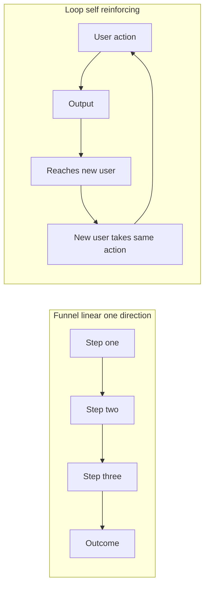

# Lecture 2 — Growth Loops and Funnels

> **Duration:** ~2 hours. **Outcome:** You can tell a loop from a funnel on sight, name the four common loop types, read a loop diagram for its trigger/action/output, compute a loop's k-factor and cycle time from raw event data, and instrument a real loop with a schema you could actually query.

Most early-stage teams think about growth as a funnel: top-of-funnel traffic goes in, a series of steps (signup → activation → paid conversion) narrows it down, and revenue comes out the bottom. Funnels are real and worth optimizing — Week 6 gave you the SQL to do exactly that. But a funnel, on its own, has a structural ceiling: **it doesn't feed itself.** Every unit of top-of-funnel traffic has to come from somewhere else — an ad budget, a sales team, a content calendar — and when that upstream source stops, the funnel stops. A **loop** is different: its own output becomes its next input, which means, done right, it keeps running (and can even accelerate) without anyone refilling the top every month.

## 1. Funnel vs. loop, precisely

A **funnel** is a linear sequence: Step 1 → Step 2 → Step 3 → outcome. Value flows one direction. Optimizing a funnel means reducing drop-off at each step — a Week 6 skill.

A **loop** is a cycle: some user **action** produces an **output**, that output reaches a **new** user, that new user's exposure to the output leads them to take the **same kind of action**, which produces more output, which reaches more new users — indefinitely, without a human re-triggering it each time. The defining test: **does the system's own output become its own next input?** If yes, it's a loop. If the input always has to come from outside the system (an ad click, a sales call, a conference booth), it's a funnel — even if it has many steps and even if people casually call it a "growth funnel that grows the business."


*A funnel's output leaves the system; a loop's output loops back in as its own next input.*

This distinction matters because funnels and loops get **different investment**. A funnel scales roughly linearly with spend — put in 2x the ad budget, get roughly 2x the signups (until you saturate the channel), and revenue growth is capped by how much you're willing and able to spend. A loop, if its k-factor (defined below) is high enough, **compounds** — each cycle produces more raw material for the next cycle, the way compound interest outpaces simple interest. That's why "find the loop" is often the highest-leverage thing a growth-focused PM can do: a percentage-point improvement to a compounding loop is worth more, over time, than the same percentage-point improvement to a funnel's conversion rate.

## 2. The four common loop types

| Loop type | The cycle | Example |
|---|---|---|
| **Viral / acquisition loop** | Existing user invites or shares with a new person → new person joins → new person invites more people | Dropbox's "invite a friend, both get more storage"; Loopline's guest-invite feature (below) |
| **Content loop** | User-generated or product-generated content gets published/indexed → search engines or social platforms surface it to new people → new people discover the product → some of them create their own content | Pinterest boards, Notion's public template gallery, a SaaS product's public-facing shared documents |
| **Paid loop** | Revenue from converted users is reinvested into paid acquisition → more paid acquisition brings more converted users → more revenue to reinvest | Works like a loop *organizationally* (revenue funds the next round of spend) but is **not self-reinforcing on the user side** — turn the spend off and the loop stops immediately. Many teams call this a "loop" loosely; treat it as a funnel with a budget line attached, and be honest about that distinction when you're deciding where to invest. |
| **Retention / expansion loop** | Existing user gets more value the longer/more they use the product (more data, more integrations, more habit) → they use it more → they get even more value → they expand usage or seats | A project-management tool where more of a team's history lives inside it, making it costlier (in switching effort, not just money) to leave, and making each additional teammate more valuable to add |

Notice the paid loop is the odd one out — genuinely useful, entirely fundable, but structurally a funnel with reinvestment on top, not a self-reinforcing user-side loop. Being precise about which of your "growth channels" are real loops and which are funnels-with-a-budget is exactly what Challenge 2 asks you to defend with numbers.

## 3. Loopline's guest-invite loop, mapped

Recall from Week 5: `guest_external_access` shipped after `audit_log_compliance` unblocked it. Growth didn't ask for that feature — Sales did, to unblock three enterprise deals. But once it shipped, something else happened: Loopline users started inviting **external guests** (contractors, clients, cross-team collaborators) into shared task boards just to get work done, and some fraction of those guests liked what they saw enough to sign up for their own full Loopline account.

That's a viral/acquisition loop, and here's its anatomy:

```
 ┌─────────────────────────────────────────────────────────────┐
 │                                                               │
 │   TRIGGER: existing Loopline user has a task that needs      │
 │   input from someone outside their team                      │
 │                       │                                       │
 │                       ▼                                       │
 │   ACTION: user sends a guest invite to a live shared board    │
 │                       │                                       │
 │                       ▼                                       │
 │   OUTPUT: invitee lands inside a REAL, already-populated      │
 │   board — not a marketing page — and can see the product      │
 │   working before ever making a decision to sign up            │
 │                       │                                       │
 │                       ▼                                       │
 │   NEW INPUT: some invitees, having seen real value, create    │
 │   their own Loopline account and become users who can         │
 │   themselves trigger the same invite action ────────────┐     │
 │                                                          │     │
 └──────────────────────────────────────────────────────────┘     │
                        ▲                                          │
                        └──────────────────────────────────────────┘
```

The loop closes at "new input" — a new Loopline account is a new potential *inviter*, which is what makes this a loop and not just a one-way referral funnel. Compare that to a simple "refer a friend, get a discount code" program with no product exposure in the middle: that's usually a weaker loop, because the new person is reacting to an incentive, not to seeing the product deliver real value firsthand — which is exactly why Loopline's version (invitee lands *inside a working board*, not a landing page) tends to convert and activate better than incentive-only referral programs.

## 4. Loop math: k-factor and cycle time

Two numbers tell you almost everything about whether a loop is worth investing in.

### k-factor

The **viral coefficient**, or k-factor, answers: *for every one active user, how many new active users does the loop produce?*

```
k = (invites sent per active user) × (conversion rate from invite to new active user)
```

- **k ≥ 1** means the loop is *self-sustaining* — each user replaces themselves with more than one new user, on average, so the loop alone would grow the user base exponentially even with zero other acquisition. Pure k ≥ 1 loops are rare and usually don't stay there forever (they decay as you exhaust the easiest-to-convert audience).
- **k < 1** does **not** mean the loop is worthless. A k of 0.75, for example, means every 4 active users bring in roughly 3 more through the loop alone — that's an enormous, often *free*, boost on top of whatever your paid and content channels are doing, even though it can't carry 100% of growth by itself. Most healthy loops in mature products run well below k = 1 and are still worth serious investment, because they lower blended CAC (customer acquisition cost) across the whole business.

### Cycle time

The **cycle time** is how long it takes to go from one loop iteration to the next — from an existing user's action to the new user being active enough to take the same action themselves. A loop with k = 0.9 and a 2-day cycle time compounds far faster in absolute terms than a loop with k = 0.9 and a 60-day cycle time, even though their k-factors are identical — this is the piece teams miss when they only look at k-factor. You'll model this compounding difference directly in pandas in Lecture 3.

## 5. Instrumenting the loop — the `referral_events` table

You cannot compute k-factor or cycle time from a vibe — you need every step of the loop logged as an event, with timestamps. Here's the schema Loopline's growth engineer built to track the guest-invite loop, and the seed data from a six-week sample (16 active inviters, May–June).

**SQLite (fastest to start):**

```bash
sqlite3 loopline_growth.db
```

**PostgreSQL:**

```bash
createdb loopline_growth
psql loopline_growth
```

```sql
CREATE TABLE referral_events (
    event_id        INTEGER PRIMARY KEY,
    inviter_user_id INTEGER NOT NULL,
    inviter_account TEXT    NOT NULL,
    invitee_email   TEXT    NOT NULL,
    invite_sent_at  DATE    NOT NULL,
    accepted_at     DATE,             -- guest opened the shared board; NULL = never accepted
    signed_up_at    DATE,             -- guest created their own full Loopline account
    activated_at    DATE,             -- new account completed onboarding + first task
    became_paid_at  DATE              -- new account added its first paid seat
);

INSERT INTO referral_events VALUES
(1, 101, 'Bellcrank Creative', 'ana@example.com', '2026-05-01', '2026-05-02', '2026-05-03', '2026-05-05', '2026-05-17'),
(2, 101, 'Bellcrank Creative', 'ben@example.com', '2026-05-02', '2026-05-03', '2026-05-04', '2026-05-06', NULL),
(3, 101, 'Bellcrank Creative', 'carla@example.com', '2026-05-03', '2026-05-04', '2026-05-05', NULL, NULL),
(4, 102, 'Bellcrank Creative', 'deshawn@example.com', '2026-05-05', '2026-05-06', NULL, NULL, NULL),
(5, 102, 'Bellcrank Creative', 'elin@example.com', '2026-05-06', NULL, NULL, NULL, NULL),
(6, 103, 'Copperline Studio', 'farid@example.com', '2026-05-07', NULL, NULL, NULL, NULL),
(7, 103, 'Copperline Studio', 'gia@example.com', '2026-05-09', '2026-05-10', NULL, NULL, NULL),
(8, 104, 'Copperline Studio', 'hana@example.com', '2026-05-10', '2026-05-11', '2026-05-12', NULL, NULL),
(9, 104, 'Copperline Studio', 'ivo@example.com', '2026-05-11', '2026-05-12', '2026-05-13', '2026-05-15', NULL),
(10, 104, 'Copperline Studio', 'jess@example.com', '2026-05-13', '2026-05-14', '2026-05-15', '2026-05-17', '2026-05-29'),
(11, 105, 'Ironwood Consulting', 'kade@example.com', '2026-05-14', NULL, NULL, NULL, NULL),
(12, 105, 'Ironwood Consulting', 'lena@example.com', '2026-05-15', NULL, NULL, NULL, NULL),
(13, 106, 'Ironwood Consulting', 'mina@example.com', '2026-05-17', '2026-05-18', NULL, NULL, NULL),
(14, 106, 'Ironwood Consulting', 'nils@example.com', '2026-05-18', '2026-05-19', NULL, NULL, NULL),
(15, 106, 'Ironwood Consulting', 'omar@example.com', '2026-05-19', '2026-05-20', '2026-05-21', NULL, NULL),
(16, 107, 'Juniper Systems', 'petra@example.com', '2026-05-21', '2026-05-22', '2026-05-23', '2026-05-25', '2026-06-06'),
(17, 107, 'Juniper Systems', 'quinn@example.com', '2026-05-22', NULL, NULL, NULL, NULL),
(18, 108, 'Kingsford Software', 'rosa@example.com', '2026-05-23', '2026-05-24', '2026-05-25', '2026-05-27', NULL),
(19, 108, 'Kingsford Software', 'sami@example.com', '2026-05-25', '2026-05-26', '2026-05-27', NULL, NULL),
(20, 108, 'Kingsford Software', 'talia@example.com', '2026-05-26', '2026-05-27', NULL, NULL, NULL),
(21, 109, 'Kingsford Software', 'uma@example.com', '2026-05-27', NULL, NULL, NULL, NULL),
(22, 109, 'Kingsford Software', 'victor@example.com', '2026-05-29', '2026-05-30', '2026-05-31', '2026-06-02', '2026-06-14'),
(23, 110, 'Larkspur Tech', 'wren@example.com', '2026-05-30', '2026-05-31', NULL, NULL, NULL),
(24, 110, 'Larkspur Tech', 'xavi@example.com', '2026-05-31', NULL, NULL, NULL, NULL),
(25, 110, 'Larkspur Tech', 'yara@example.com', '2026-06-02', '2026-06-03', '2026-06-04', NULL, NULL),
(26, 111, 'Millbrook Systems', 'zane@example.com', '2026-06-03', '2026-06-04', '2026-06-05', '2026-06-07', NULL),
(27, 111, 'Millbrook Systems', 'aiko@example.com', '2026-06-04', NULL, NULL, NULL, NULL),
(28, 112, 'Northstar Software', 'beto@example.com', '2026-06-06', '2026-06-07', NULL, NULL, NULL),
(29, 112, 'Northstar Software', 'ciro@example.com', '2026-06-07', '2026-06-08', '2026-06-09', '2026-06-11', '2026-06-23'),
(30, 113, 'Oakhaven Technologies', 'dara@example.com', '2026-06-08', NULL, NULL, NULL, NULL),
(31, 113, 'Oakhaven Technologies', 'enzo@example.com', '2026-06-10', '2026-06-11', '2026-06-12', NULL, NULL),
(32, 113, 'Oakhaven Technologies', 'fiona@example.com', '2026-06-11', '2026-06-12', NULL, NULL, NULL),
(33, 114, 'Rosemont Enterprises', 'gus@example.com', '2026-06-12', NULL, NULL, NULL, NULL),
(34, 114, 'Rosemont Enterprises', 'hala@example.com', '2026-06-14', '2026-06-15', '2026-06-16', '2026-06-18', NULL),
(35, 115, 'Thackeray Holdings', 'ilse@example.com', '2026-06-15', '2026-06-16', '2026-06-17', '2026-06-19', '2026-07-01'),
(36, 115, 'Thackeray Holdings', 'joon@example.com', '2026-06-16', NULL, NULL, NULL, NULL),
(37, 115, 'Thackeray Holdings', 'kira@example.com', '2026-06-18', '2026-06-19', '2026-06-20', NULL, NULL),
(38, 116, 'Anchorline Studio', 'leo@example.com', '2026-06-19', '2026-06-20', NULL, NULL, NULL),
(39, 116, 'Anchorline Studio', 'mira@example.com', '2026-06-20', NULL, NULL, NULL, NULL),
(40, 116, 'Anchorline Studio', 'nadia@example.com', '2026-06-22', '2026-06-23', '2026-06-24', '2026-06-26', NULL);
```

Sanity check — this should print `40`:

```sql
SELECT COUNT(*) FROM referral_events;
```

### Reading the funnel out of the events

```sql
SELECT
    COUNT(*)                                        AS invites_sent,
    COUNT(accepted_at)                               AS accepted,
    COUNT(signed_up_at)                              AS signed_up,
    COUNT(activated_at)                              AS activated,
    COUNT(became_paid_at)                            AS became_paid
FROM referral_events;
```

Run it, and you'll get **40 sent → 28 accepted → 19 signed up → 12 activated → 6 became paid.** Each step is a real conversion rate you can compute with plain division (`COUNT(activated_at) * 1.0 / COUNT(*)`, etc.) — this is the exact `COUNT()`-on-a-nullable-column pattern from Week 6, now applied to a growth loop instead of a product funnel.

### Computing k-factor from the data

```sql
SELECT
    COUNT(DISTINCT inviter_user_id)                                   AS active_inviters,
    COUNT(*)                                                          AS invites_sent,
    COUNT(*) * 1.0 / COUNT(DISTINCT inviter_user_id)                  AS invites_per_inviter,
    COUNT(activated_at) * 1.0 / COUNT(*)                              AS invite_to_active_rate,
    (COUNT(*) * 1.0 / COUNT(DISTINCT inviter_user_id))
        * (COUNT(activated_at) * 1.0 / COUNT(*))                      AS k_factor
FROM referral_events;
```

That gives **invites_per_inviter = 2.5**, **invite_to_active_rate = 0.30**, and **k = 0.75**. Sub-1, meaning this loop alone won't carry Loopline's growth exponentially — but 0.75 is a strong number for a B2B collaboration tool, and it's costing Loopline **$0** in acquisition spend per activated user, unlike every dollar of paid search.

### Computing cycle time

```sql
SELECT AVG(activated_at - invite_sent_at) AS avg_cycle_days   -- PostgreSQL: date subtraction returns days
FROM referral_events
WHERE activated_at IS NOT NULL;
-- SQLite: use julianday(activated_at) - julianday(invite_sent_at)
```

That's **4.0 days** — fast. A guest who's going to activate typically does it within a week of the invite landing, because they're stepping into a board that's already alive with real work, not waiting on a drip email sequence.

## 6. Comparing channels on equal footing

k-factor and cycle time tell you whether *one* loop is healthy. They don't, by themselves, tell you which of Loopline's *several* growth channels deserves the next dollar or hour of investment — for that you need them side by side, including the channels that are funnels, not loops, so you're comparing on the same axes instead of comparing a loop's compounding potential against a funnel's raw volume and quietly forgetting that one of them stops the moment you stop paying for it.

```sql
CREATE TABLE growth_channels (
    channel_id           INTEGER PRIMARY KEY,
    channel_name         TEXT    NOT NULL,
    channel_type         TEXT    NOT NULL,   -- 'loop' or 'funnel'
    monthly_new_signups  INTEGER NOT NULL,
    cac_usd              NUMERIC NOT NULL,   -- customer acquisition cost per signup; 0 for organic loops
    activation_rate      NUMERIC NOT NULL,   -- 0-1, share of signups who complete onboarding + first task
    k_factor             NUMERIC,            -- NULL for funnels (no self-reinforcing reinvestment on the user side)
    cycle_time_days       NUMERIC,            -- NULL where the concept doesn't apply
    notes                 TEXT    NOT NULL
);

INSERT INTO growth_channels VALUES
(1, 'Guest Invite Loop', 'loop', 160, 0, 0.30, 0.75, 4,
   'Existing users invite guests into a live, already-populated shared board; guests often experience real product value before ever deciding to create their own account.'),
(2, 'Public Shared-Board SEO', 'loop', 95, 0, 0.14, 0.20, 45,
   'Public read-only board links get indexed by search engines; more published boards slowly compound organic traffic, but visitors arrive cold, with low intent, and take much longer to convert.'),
(3, 'Paid Search (Google Ads)', 'funnel', 210, 38, 0.22, NULL, 1,
   'Fast, controllable, and scalable on demand -- but volume stops the moment ad spend stops. It does not compound on its own and every signup carries a real, ongoing dollar cost.');
```

Sanity check — this should print `3`:

```sql
SELECT COUNT(*) FROM growth_channels;
```

At a glance, **Paid Search brings in the most raw signups per month (210)** — the number a growth dashboard would put front and center. But raw signups is the wrong single number to lead with: Paid Search also **costs $38 per signup, forever**, and its activation rate (22%) sits between the two loops. The **Guest Invite Loop** brings in fewer raw signups (160) but at **$0 CAC**, a **higher activation rate (30%)**, and it **compounds** — each cycle's new users become next cycle's potential inviters, which is exactly what `k_factor` and `cycle_time_days` capture and what a funnel's `NULL` in those columns tells you it structurally cannot do. Challenge 2 has you turn this table into a specific, numbers-backed recommendation for where Loopline's next growth dollar should go.

## 7. Funnels still matter — AARRR, briefly

None of this replaces funnel thinking. Dave McClure's **AARRR** framework (Acquisition, Activation, Retention, Referral, Revenue) is still the right lens for diagnosing *where* in a user's journey things break — Week 6 built exactly that muscle. The relationship between the two: a funnel tells you where users drop off inside one pass through the product; a loop tells you whether the *output* of a completed pass becomes fuel for the *next* pass. Referral, the fourth "R" in AARRR, is precisely where funnel thinking hands off to loop thinking — it's the step where you ask whether the funnel's output loops back into its own input.

## 8. Check yourself

- State the one-sentence test that distinguishes a loop from a funnel.
- Why is a "paid loop" arguably not a real loop? What happens the moment spend stops?
- Name Loopline's guest-invite loop's trigger, action, output, and new input in your own words.
- What does k = 0.75 mean in plain English, and why is it still valuable even though it's below 1?
- Why does cycle time matter even when two loops have the identical k-factor?
- From the `referral_events` data, which single funnel step (accepted → signed up, signed up → activated, or activated → paid) has the *lowest* conversion rate, and what would you investigate first?
- Why is "monthly new signups" alone a misleading way to rank Loopline's three growth channels?

If those are automatic, Lecture 3 puts numbers behind both of this week's decisions at once — modeling exactly how a price change and this loop's compounding effect move Loopline's revenue and its North Star over the next 12 months.

## Further reading

- **Andrew Chen, "Growth Loops are the New Funnels":** <https://andrewchen.com/growth-loops-are-the-new-funnels/> — the essay that popularized the loop-vs-funnel distinction used in this lecture.
- **Reforge, "Growth Loops":** <https://www.reforge.com/blog/growth-loops> — a deeper practitioner breakdown of loop types and instrumentation.
- **Brian Balfour, "The Never Ending Road to Retention":** <https://www.reforge.com/blog/retention> — on why retention (not just acquisition loops) is itself a compounding growth lever.
- **Dave McClure, "Startup Metrics for Pirates" (AARRR):** <https://500.co/startup-metrics/> — the original funnel framework referenced in Section 6.
