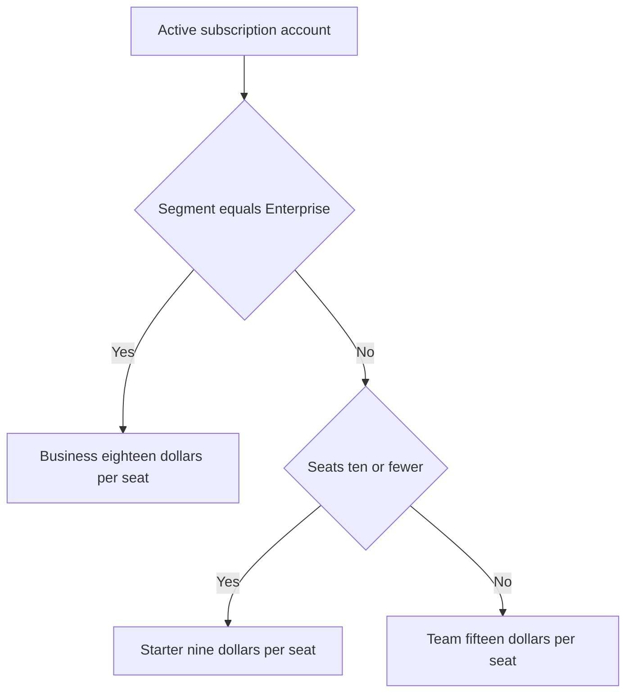

# Lecture 3 — Modeling Pricing and Growth

> **Duration:** ~2 hours. **Outcome:** You can compute MRR, ARPU, and churn from a real subscription table in SQL; model a tier migration with a risk-adjusted (not naive) revenue projection; model a growth loop's compounding effect over time in pandas; and connect both models to a single North Star number.

Lectures 1 and 2 gave you the frameworks. This lecture gives you the numbers — the exact SQL and pandas you'd write to turn "we should reprice" and "the guest-invite loop looks promising" into a defensible projection a CFO and a Growth lead would both accept. Every number in this lecture comes from a real, seeded table you can query yourself — this is the same discipline as every week before it: **structured data lives in SQL and pandas, never a spreadsheet**, because a repricing model that lives in fifty linked spreadsheet tabs is a model nobody but its author can audit, and the moment that author leaves, the company is flying blind on its own revenue.

## 1. Seed the subscription book

This is a representative sample of 30 Loopline accounts — not the full customer base, but big enough to model real segment and tier effects. Every account is currently on the same flat $12/seat/month plan from Lecture 1.

```sql
CREATE TABLE subscriptions (
    subscription_id INTEGER PRIMARY KEY,
    account_name    TEXT    NOT NULL,
    segment         TEXT    NOT NULL,   -- customer profile: 'Early-stage startup', 'Agency', 'Mid-size software team', 'Enterprise'
    seats           INTEGER NOT NULL,
    price_per_seat  NUMERIC NOT NULL,   -- current flat plan: 12.00 for everyone
    discount_pct    NUMERIC NOT NULL,   -- negotiated discount off list price, 0.00-1.00
    start_date      DATE    NOT NULL,
    status          TEXT    NOT NULL,   -- 'active' or 'churned'
    churn_date      DATE,
    churn_reason    TEXT,
    nps_score       INTEGER             -- -100 to 100
);

INSERT INTO subscriptions VALUES
(1,  'Anchorline Studio',     'Early-stage startup', 3,  12.00, 0.00, '2025-02-10', 'active',  NULL,         NULL, 55),
(2,  'Fernbrook Labs',        'Early-stage startup', 4,  12.00, 0.00, '2025-03-04', 'active',  NULL,         NULL, 48),
(3,  'Hazelwood Ventures',    'Early-stage startup', 2,  12.00, 0.00, '2025-03-22', 'active',  NULL,         NULL, 61),
(4,  'Kettlebell Robotics',   'Early-stage startup', 5,  12.00, 0.00, '2025-04-01', 'active',  NULL,         NULL, 39),
(5,  'Loomstate Devtools',    'Early-stage startup', 3,  12.00, 0.00, '2025-04-19', 'active',  NULL,         NULL, 44),
(6,  'Nightjar Analytics',    'Early-stage startup', 6,  12.00, 0.00, '2025-05-06', 'active',  NULL,         NULL, 52),
(7,  'Redshift Robotics',     'Early-stage startup', 4,  12.00, 0.00, '2025-05-28', 'active',  NULL,         NULL, 33),
(8,  'Silverpine AI',         'Early-stage startup', 3,  12.00, 0.00, '2025-06-14', 'churned', '2025-11-02', 'Cost too high for pre-seed team; downgraded to a free competitor', 12),
(9,  'Bellcrank Creative',    'Agency', 9,  12.00, 0.00, '2025-02-18', 'active',  NULL, NULL, 58),
(10, 'Copperline Studio',     'Agency', 12, 12.00, 0.00, '2025-03-10', 'active',  NULL, NULL, 61),
(11, 'Driftwood Media',       'Agency', 7,  12.00, 0.00, '2025-03-29', 'active',  NULL, NULL, 47),
(12, 'Eastgate Collective',   'Agency', 14, 12.00, 0.00, '2025-04-15', 'active',  NULL, NULL, 55),
(13, 'Foxglove Partners',     'Agency', 6,  12.00, 0.00, '2025-05-02', 'active',  NULL, NULL, 41),
(14, 'Graymoor Digital',      'Agency', 18, 12.00, 0.05, '2025-05-20', 'active',  NULL, NULL, 63),
(15, 'Harborlight Agency',    'Agency', 8,  12.00, 0.00, '2025-06-08', 'churned', '2025-12-14', 'Client-facing shareable view still not billable enough; switched to a cheaper tool', 18),
(16, 'Ironwood Consulting',   'Mid-size software team', 22, 12.00, 0.05, '2025-01-25', 'active', NULL, NULL, 50),
(17, 'Juniper Systems',       'Mid-size software team', 28, 12.00, 0.05, '2025-02-12', 'active', NULL, NULL, 46),
(18, 'Kingsford Software',    'Mid-size software team', 35, 12.00, 0.10, '2025-02-27', 'active', NULL, NULL, 57),
(19, 'Larkspur Tech',         'Mid-size software team', 19, 12.00, 0.00, '2025-03-18', 'active', NULL, NULL, 39),
(20, 'Millbrook Systems',     'Mid-size software team', 31, 12.00, 0.05, '2025-04-07', 'active', NULL, NULL, 44),
(21, 'Northstar Software',    'Mid-size software team', 26, 12.00, 0.05, '2025-04-30', 'active', NULL, NULL, 52),
(22, 'Oakhaven Technologies', 'Mid-size software team', 40, 12.00, 0.10, '2025-05-15', 'active', NULL, NULL, 60),
(23, 'Pinegrove Systems',     'Mid-size software team', 17, 12.00, 0.00, '2025-06-02', 'active', NULL, NULL, 35),
(24, 'Questmark Software',    'Mid-size software team', 24, 12.00, 0.05, '2025-06-25', 'churned', '2026-01-09', 'Wanted per-seat pricing that came down at scale; found a usage-based competitor cheaper for their bursty team size', 22),
(25, 'Rosemont Enterprises',  'Enterprise', 85,  12.00, 0.15, '2025-01-14', 'active', NULL, NULL, 31),
(26, 'Stonebridge Financial', 'Enterprise', 140, 12.00, 0.20, '2025-02-03', 'active', NULL, NULL, 28),
(27, 'Thackeray Holdings',    'Enterprise', 60,  12.00, 0.15, '2025-03-11', 'active', NULL, NULL, 45),
(28, 'Underwood Insurance',   'Enterprise', 110, 12.00, 0.18, '2025-04-22', 'active', NULL, NULL, 25),
(29, 'Vantage Manufacturing', 'Enterprise', 45,  12.00, 0.00, '2025-05-09', 'churned', '2025-10-28', 'Security review failed: no SSO/SAML and no audit log at the time; moved to a competitor that had both', 8),
(30, 'Wickford Global',       'Enterprise', 200, 12.00, 0.22, '2025-06-01', 'active', NULL, NULL, 33);
```

Sanity check — this should print `30`:

```sql
SELECT COUNT(*) FROM subscriptions;
```

## 2. Baseline revenue metrics in SQL

### MRR, seats, and blended ARPU

```sql
SELECT
    COUNT(*)                                            AS active_accounts,
    SUM(seats)                                           AS total_seats,
    SUM(seats * price_per_seat * (1 - discount_pct))     AS mrr,
    SUM(seats * price_per_seat * (1 - discount_pct)) / SUM(seats) AS blended_arpu
FROM subscriptions
WHERE status = 'active';
```

`price_per_seat * (1 - discount_pct)` is the **net** price after any negotiated discount — always compute revenue off the net price, never the list price, or you'll overstate MRR for every discounted account. Run it: **26 active accounts, 906 seats, $9,344.40 MRR, $10.31 blended ARPU** (below the $12 list price, because of the negotiated Agency/Mid-size/Enterprise discounts).

### Logo churn rate

```sql
SELECT
    COUNT(*) FILTER (WHERE status = 'churned') * 1.0 / COUNT(*) AS logo_churn_rate
FROM subscriptions;
-- SQLite: replace FILTER (WHERE status = 'churned') with
-- SUM(CASE WHEN status = 'churned' THEN 1 ELSE 0 END)
```

**13.3%** of all 30 accounts in this sample have churned. That's a *logo* churn rate (accounts lost, regardless of size) — distinct from *revenue* churn (dollars lost), which weights big accounts more heavily. Always ask which one you're looking at: a product can have low logo churn and high revenue churn if it's losing its biggest accounts, or the reverse if it's losing lots of small ones and keeping the big fish. `Vantage Manufacturing` (45 seats, churned) and `Silverpine AI` (3 seats, churned) count identically in logo churn but very differently in revenue churn.

### MRR by segment

```sql
SELECT
    segment,
    COUNT(*)                                         AS accounts,
    SUM(seats * price_per_seat * (1 - discount_pct)) AS segment_mrr,
    AVG(nps_score)                                    AS avg_nps
FROM subscriptions
WHERE status = 'active'
GROUP BY segment
ORDER BY segment_mrr DESC;
```

Enterprise accounts (5 of them) contribute **$5,777.40** of the $9,344.40 total — 62% of MRR from 19% of accounts. That concentration is exactly why Vantage Manufacturing's churn (a *different* Enterprise account, lost before this snapshot, for the missing-SSO reason) mattered so much more than any single startup churning would have.

## 3. Modeling a tier migration

Now the actual repricing question: Loopline is moving from the single flat plan to three tiers — **Starter ($9/seat, ≤10 seats, core features only)**, **Team ($15/seat, unlimited seats, adds integrations)**, and **Business ($18/seat, unlimited seats, adds SSO/SAML, audit log, and priority support)** — the compliance gate from Lecture 1's packaging discussion, made concrete. Every account gets mapped to the tier that fits its current seat count and segment.

```sql
SELECT
    account_name,
    segment,
    seats,
    seats * price_per_seat * (1 - discount_pct) AS old_mrr,
    CASE
        WHEN segment = 'Enterprise' THEN 'Business'
        WHEN seats <= 10               THEN 'Starter'
        ELSE 'Team'
    END AS new_tier,
    CASE
        WHEN segment = 'Enterprise' THEN 18.00
        WHEN seats <= 10               THEN 9.00
        ELSE 15.00
    END AS new_price_per_seat,
    seats * (CASE
        WHEN segment = 'Enterprise' THEN 18.00
        WHEN seats <= 10               THEN 9.00
        ELSE 15.00
    END) * (1 - discount_pct) AS new_mrr
FROM subscriptions
WHERE status = 'active'
ORDER BY new_tier, seats DESC;
```

Notice the tier rule uses **segment**, not just seats, for the Enterprise cutoff — a 9-seat Enterprise account (if one existed in this sample) still goes to Business, because the value metric that matters for Business is the compliance need, which correlates with segment more than seat count. This is the segment-vs-tier distinction from Lecture 1: `segment` describes *who the customer is*; `new_tier` describes *what they buy* — related, but not the same column, and conflating them is a common modeling mistake.


*Tier assignment checks segment before seat count, so compliance driven Enterprise accounts always land on Business.*

### The naive number (don't stop here)

```sql
SELECT SUM(seats * price_per_seat * (1 - discount_pct)) AS old_mrr FROM subscriptions WHERE status='active';
-- compare against SUM(new_mrr) from the query above
```

Old MRR: **$9,344.40**. New MRR under the tier migration, assuming **every single account migrates and none churn**: **$12,830.85** — a **+37.3%** increase. That number will make it into a slide deck somewhere. It is also **wrong**, because it assumes zero migration churn, and a 50% list-price increase on your highest-concentration segment (Enterprise, going from $12 to $18/seat) is exactly the kind of change that causes accounts to churn. A model that doesn't account for that isn't a forecast, it's a wish.

## 4. Risk-adjusting the projection

Add a simple, explicit churn-risk function keyed to the size of each account's price change — explicit and stated, not hidden inside a spreadsheet formula nobody will re-derive in six months:

| % price change | Assumed migration-churn risk | Reasoning |
|---|---|---|
| ≥ +40% | 22% | Large enough to trigger a real internal "do we still need this" conversation at renewal |
| +10% to +39% | 10% | Noticeable, prompts questions, but rarely alone worth a switching-cost migration |
| 0% to +9% | 4% | Small enough to pass with light or no pushback |
| Any decrease | 1% | Still nonzero — a price *change* of any kind, even a cut, occasionally triggers a "wait, why?" support ticket, but the risk is negligible |

```sql
SELECT
    account_name,
    old_mrr,
    new_tier,
    new_mrr,
    (new_mrr - old_mrr) / old_mrr AS pct_change,
    CASE
        WHEN (new_mrr - old_mrr) / old_mrr >= 0.40 THEN 0.22
        WHEN (new_mrr - old_mrr) / old_mrr >= 0.10 THEN 0.10
        WHEN (new_mrr - old_mrr) / old_mrr >  0.00 THEN 0.04
        ELSE 0.01
    END AS churn_risk,
    new_mrr * (1 - CASE
        WHEN (new_mrr - old_mrr) / old_mrr >= 0.40 THEN 0.22
        WHEN (new_mrr - old_mrr) / old_mrr >= 0.10 THEN 0.10
        WHEN (new_mrr - old_mrr) / old_mrr >  0.00 THEN 0.04
        ELSE 0.01
    END) AS expected_mrr
FROM ( /* the tier-migration query from Section 3, wrapped as a subquery */
    SELECT account_name, seats,
        seats * price_per_seat * (1 - discount_pct) AS old_mrr,
        CASE WHEN segment='Enterprise' THEN 'Business' WHEN seats<=10 THEN 'Starter' ELSE 'Team' END AS new_tier,
        seats * (CASE WHEN segment='Enterprise' THEN 18.00 WHEN seats<=10 THEN 9.00 ELSE 15.00 END) * (1 - discount_pct) AS new_mrr
    FROM subscriptions WHERE status='active'
) t;
```

Summing `expected_mrr` across all 26 accounts gives **$10,547.52** — an expected **+12.9%** revenue lift, less than a third of the naive +37.3% number. That gap — **$2,283.33/month**, or roughly **$27,400/year**, of projected revenue that the naive model silently assumed away — is the entire reason you risk-adjust instead of reporting the naive figure to a CFO. Business-tier accounts (the Enterprise segment, at the 50% price jump) carry almost all of that risk: their $8,666.10 naive new MRR risk-adjusts down to $6,759.56, a swing of $1,906.54/month by itself.

## 5. Modeling the loop's compounding effect in pandas

The tier-migration model above is a one-time step change. The guest-invite loop from Lecture 2 is different — its effect **compounds** over time, because each cycle's new active users become next cycle's potential inviters. Model that with pandas:

```python
import pandas as pd

# starting point: current active accounts' users who could invite,
# and the loop constants measured in Lecture 2
starting_active_users = 950       # rough count of active Loopline users today
k = 0.75                          # k-factor from the referral_events query
cycle_time_days = 4               # avg invite -> activation
cycles_per_month = 30 / cycle_time_days   # ~7.5 loop cycles fit inside one month

months = 12
rows = []
active_users = starting_active_users
for month in range(1, months + 1):
    month_start_users = active_users
    for _cycle in range(int(cycles_per_month)):
        new_from_loop = active_users * k / cycles_per_month  # spread the monthly k across cycles
        active_users += new_from_loop
    rows.append({
        "month": month,
        "start_of_month_users": round(month_start_users),
        "end_of_month_users": round(active_users),
        "net_new_from_loop": round(active_users - month_start_users),
    })

loop_projection = pd.DataFrame(rows)
print(loop_projection)
```

Because `cycles_per_month` compounds `k` several times within a single month (a fast 4-day cycle time fits ~7.5 cycles into 30 days), the **effective** monthly multiplier is much larger than `k` alone would suggest — this is exactly the cycle-time point from Lecture 2, made numeric. Run it and month 1 alone adds several hundred users purely from the loop, with zero paid acquisition spend, growing every subsequent month off a larger base. This is the number you'd hold up against `growth_channels`' paid-search row (Challenge 2) to argue where the next dollar of growth investment should go.

## 6. Tying it back to the North Star

Loopline's North Star, adopted when the team built out its analytics stack, is **Weekly Active Teams (WAT)** — the count of accounts with at least 3 members active and at least 5 tasks completed in a given week. WAT was chosen over a raw user count because it's a proxy for *teams getting real, durable value*, not just individual logins — one more login doesn't matter if the team isn't actually collaborating inside the product.

Both of this week's models should be read through that lens, not just an MRR lens:

- The **tier migration** doesn't move WAT directly — repricing doesn't make a team collaborate more — but a bad rollout that pushes churn well above the risk-adjusted assumption *does* remove whole teams from the WAT count, which is why Challenge 1 asks you to design a rollout that protects WAT, not just revenue.
- The **guest-invite loop** moves WAT almost directly: every new activated guest account is, by definition, a new team getting real value — the loop's cycle-time advantage over paid search (4 days vs. essentially the length of a full sales/onboarding funnel) means it also gets new accounts to "real usage" faster, which is exactly what the WAT definition rewards.

A packaging-and-growth recommendation that only cites MRR is incomplete. The strongest version connects the dollar model to the same North Star every other week's work has been driving toward — which is exactly the ask in this week's mini-project.

## 7. Check yourself

- Why compute MRR off the *net* price (after discount), not the list price?
- What's the difference between logo churn and revenue churn, and why did Vantage Manufacturing's churn matter more than Silverpine AI's?
- Why does the tier-migration `CASE` statement key off `segment` for the Business tier, not just seat count?
- What was the naive projected MRR lift, what was the risk-adjusted lift, and why is the gap between them the most important number in Section 4?
- In the pandas loop model, why does compounding `k` several times per month (via `cycles_per_month`) produce a bigger effective monthly growth rate than `k` alone would suggest?
- Name one way the tier migration could hurt Weekly Active Teams even if it grows MRR, and one way the guest-invite loop helps WAT almost directly.

If those are automatic, you're ready for the exercises — Exercise 3 has you run this exact modeling workflow yourself and defend the risk-adjustment assumptions in your own words.

## Further reading

- **SaaS Capital, "What is a Good Churn Rate?":** <https://www.saas-capital.com/blog-posts/what-is-a-good-churn-rate-for-saas-companies/>
- **ChartMogul, "MRR — Monthly Recurring Revenue":** <https://chartmogul.com/metrics/mrr/> — a clean primer on the MRR/ARPU/NRR vocabulary used in this lecture.
- **pandas documentation, "Essential Basic Functionality":** <https://pandas.pydata.org/docs/user_guide/basics.html>
- **Reforge, "North Star Metrics":** <https://www.reforge.com/blog/north-star-metrics> (also cited in Week 1) — revisit it now that you have a real North Star to reason about.
