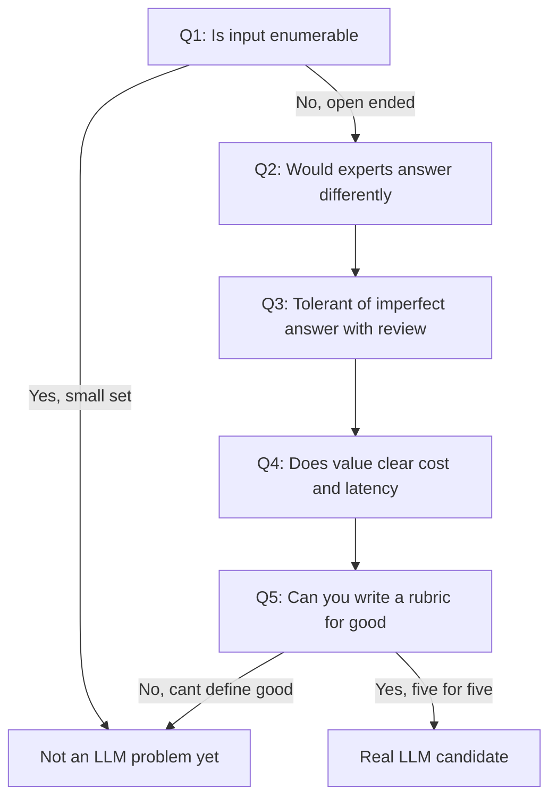

# Lecture 1 — When to Use an LLM

> **Duration:** ~2 hours. **Outcome:** You can take any "let's add AI" request and, using a concrete checklist instead of enthusiasm, decide whether an LLM is the right tool, a rules engine or classic ML would serve better, or the feature shouldn't be built at all — and you can reason explicitly about the cost/latency/quality triangle that decision sits inside.

## 1. The request that started this week

Monday morning, the VP of Product forwards you a message from Sales: *"We're losing the Meridian renewal. Their competitor has 'AI task suggestions' baked into onboarding and our champion specifically asked why we don't. Can we get some AI in the product by next sprint?"*

Read that sentence again and notice what it does *not* contain: no user problem, no success metric, no scope, no acceptance criteria. It contains a *technology* ("AI") and a *deadline* ("next sprint") and nothing connecting them to anything a user actually needs. This is one of the most common bad briefs a PM receives in 2026, and it is bad for a specific, structural reason: **it names the solution before anyone has named the job.** Compare it to a well-formed brief from Week 3: "Users abandon a new workspace within the first session because they don't know what to do first — can we reduce that?" That brief doesn't presuppose AI, rules, a tooltip, or a redesign. It leaves the *how* open, which is exactly where it belongs until you've done the thinking this lecture walks through.

Your job this week is not to say no to the VP. It's to turn "some AI" into a scoped, defensible feature — and the first step is deciding, honestly, whether an LLM is even the right tool for whatever job you eventually name.

## 2. Deterministic vs. probabilistic features

Every feature you've specced in this course so far is **deterministic**: give it the same input, it produces the same output, every time, and you can write a `WHERE` clause or an `if` statement that says exactly when it fires. A due-date reminder either fires at 9am or it doesn't. A RICE score either computes to 42 or it doesn't. You can write an acceptance criterion like "given task X with due_date = today, the reminder email is sent by 9:05am" and a QA engineer can verify it with total certainty.

An LLM-backed feature is **probabilistic**. Ask the same model the same question twice and you can get two different, both-defensible answers. Ask it a question just outside its training distribution and it may answer confidently and be wrong — a failure mode with no clean analogue in deterministic software, where "wrong" almost always means "crashed" or "returned the wrong deterministic value," not "returned a fluent, plausible-sounding, factually incorrect paragraph."

| | Deterministic feature | Probabilistic (LLM) feature |
|---|---|---|
| Same input twice | Same output | Output can vary |
| Acceptance criterion | "Given X, returns exactly Y" | "Given X, returns something meeting rubric R most of the time" |
| Failure mode | Crash, wrong branch, exception | Confident, fluent, wrong answer ("hallucination") |
| How you verify it's right | Unit test, exact assertion | Eval set + rubric + sampled human review (Lecture 2) |
| Cost per invocation | ~Fixed, near-zero marginal cost | Real, variable, per-token marginal cost (Section 5) |
| Who signs off pre-launch | Engineering + QA | Engineering + QA + **you, on the rubric itself** |

This isn't a claim that probabilistic is worse — it's a claim that it's a **different kind of thing**, and treating it like a deterministic feature (spec it once, ship it, move on) is the single most common way AI features go wrong in production. The rest of this week — evals, guardrails, human-in-the-loop — exists entirely to give a probabilistic feature the same kind of trustworthiness a deterministic one gets for free.

## 3. The five-question fit checklist

Before you decide *how* to build anything, decide *whether* it's genuinely an LLM problem. Ask these five questions, in order:

1. **Is the input open-ended, or is it really a small, enumerable set of cases?** If a user's request can only ever be one of six things, a `CASE WHEN` and six branches is faster, cheaper, and 100% predictable. LLMs earn their keep on inputs you can't fully enumerate in advance — free-text goals, messy documents, ambiguous phrasing.
2. **Would a human expert doing this task also produce somewhat different answers each time?** If the "correct" answer is singular and computable (a sum, a date comparison, a sort order), that's not an LLM's job — a probabilistic tool for a deterministic problem just adds risk with no offsetting benefit. If two competent humans would reasonably draft this differently (a first pass at subtasks, a summary, a first-draft reply), that's the shape of problem LLMs are actually good at.
3. **Is the product tolerant of an imperfect answer, provided a human reviews it before anything happens?** An LLM draft that a user edits before it takes effect is low-risk. An LLM output that fires irreversibly with no review (auto-sending an email, auto-deleting data, auto-charging a card) is high-risk — and high-risk uses need either a much higher accuracy bar, a narrower scope, or a human back in the loop. Section 4 of Lecture 3 goes deep here.
4. **Does the value it creates plausibly clear the cost and latency it will add?** A model call costs real money per invocation and takes real seconds a rule-based lookup doesn't. Section 5 below gives you the vocabulary to reason about this before committing.
5. **Can you write a rubric for "good," even if you can't write an exact-match test?** If you genuinely cannot describe what a good output looks like — not even loosely — that's a sign the problem itself isn't well-defined yet, and no model will define it for you. Lecture 2 turns this rubric into your eval set.

*The five-question fit checklist as a pass or reject decision path.*

If a request fails question 1 (it's really a small enumerable case) or question 5 (nobody can say what "good" means), it is very likely **not** an LLM problem yet — send it back to Week 3-style problem framing before touching a model API. If it passes all five, it's a real candidate, and you move to Section 4.

## 4. Build vs. buy: what "build" even means for AI features

Almost nobody training a foundation model from scratch is doing product work — that's a research and infrastructure investment measured in the tens of millions of dollars and is out of scope for essentially every product team, including Loopline's. Your real build-vs-buy decision is narrower and looks like this:

| Approach | What it is | When it fits |
|---|---|---|
| **Rules engine** | `if`/`case` logic, keyword matching, deterministic templates | Input is enumerable (question 1 fails), or the "AI-sounding" behavior can be faked with good defaults and templates |
| **Classic ML** (a small classifier or ranking model) | A model trained on your own labeled data for one narrow task (e.g., spam/not-spam, priority ranking) | The task is narrow, well-labeled data exists or is cheap to get, and you need speed/cost/predictability a general LLM can't match |
| **Prompt a foundation model API** (no training) | Call a hosted LLM (via API) with a well-engineered prompt and your own guardrails around it | Task is open-ended (question 1 passes), general-purpose reasoning or generation is genuinely needed, and you don't have — or don't yet need — your own labeled dataset |
| **Fine-tune a foundation model** | Take a hosted or open model and further train it on your own examples | You've already shipped the prompted version, have real usage data showing a *specific, recurring* failure pattern, and fixing it with more prompt engineering has plateaued |

For almost every first version of an AI feature — including Loopline Copilot — the right column is **"prompt a foundation model API."** It's the fastest to validate, the cheapest to reverse, and the easiest to iterate on without an ML engineering team. Fine-tuning is a *later* investment you make once you have evidence (from the eval history you'll build in Lecture 2) that prompting alone has a specific, persistent gap. Don't reach for it as a first move — it trades fast iteration for a slower, more expensive one, and you don't have the data to justify that trade yet on week one of a new feature.

## 5. The cost/latency/quality triangle

Every model-call decision trades off three things, and you can typically only optimize two at the expense of the third:

- **Cost** — dollars per request. Model providers publish per-token pricing that varies by an order of magnitude or more between their smallest and largest models; the exact numbers change often enough that you should treat any figure in this lecture as illustrative and check your provider's current pricing page before committing a budget.
- **Latency** — wall-clock time per request. Smaller models respond faster; larger, more capable models take longer, and generating a long response takes longer than a short one regardless of model size.
- **Quality** — how good the output actually is against your rubric. Larger, more capable models are typically better at harder reasoning, longer context, and edge cases; smaller models degrade faster outside their strong suit.

| Model tier (illustrative) | Relative cost | Relative latency | Typical fit |
|---|---|---|---|
| Small / fast tier | 1× (baseline) | Fast (often well under a second to a couple seconds for short outputs) | High-volume, low-complexity tasks: classification, short extraction, simple rewrites |
| Mid tier | ~5–10× the small tier | Moderate | Most product features: drafting, summarizing, multi-step reasoning on bounded input |
| Frontier / largest tier | ~20–50×+ the small tier | Slower, especially on long output | Hardest reasoning tasks, or where quality directly gates revenue and volume is low enough that the multiplier doesn't matter |

The triangle forces an explicit choice, and the choice depends on **volume** as much as difficulty. A feature called once per user per month can afford the frontier tier's cost and latency even for a moderately easy task, because the total spend stays small. A feature called on every keystroke needs the small tier or it becomes both slow and expensive at scale, even if the frontier tier would produce a marginally better answer. **Always reason about cost per call *and* expected call volume together — cost per call alone tells you nothing about total spend.**

### Worked example: picking a tier for Loopline Copilot

Copilot is called once per "break this down" click — a user-initiated action, not a background or per-keystroke process. Estimated volume: maybe 3–5 calls per active workspace per week, well under 100k calls/month even at Loopline's full user base. The task (turn a one-line goal into 5–10 concrete subtasks) is a moderate reasoning task — not simple classification, but not the hardest tier of open-ended reasoning either. Given low-to-moderate volume and a task that benefits from decent judgment but doesn't require frontier-level reasoning, the **mid tier is the right starting choice**: good-enough quality, latency acceptable for a "click and wait a couple seconds" UI, and cost that stays small even generously estimated. If the eval set from Lecture 2 later shows the mid tier failing a specific rubric category consistently, that's evidence-driven grounds to test the frontier tier on just that category — not a reason to default to the most expensive model everywhere from day one.

## 6. Deciding LLM vs. rules vs. no-build: Loopline Copilot walked through the checklist

| Question | Answer for Copilot |
|---|---|
| 1. Open-ended input? | Yes — a one-line user goal is free text with effectively unlimited variation. Not enumerable. |
| 2. Would two experts draft it differently? | Yes — two competent PMs breaking down "migrate billing to Stripe" would list somewhat different, both-reasonable subtasks. |
| 3. Tolerant of an imperfect answer with review? | Yes, **if** scoped as a draft the user edits/accepts before tasks are created (this becomes the human-in-the-loop design in Exercise 1). Not tolerant if scoped to auto-create tasks with no review. |
| 4. Value clears cost/latency? | Plausibly — see the worked example above: low volume, mid-tier cost, acceptable latency for a click-triggered action. |
| 5. Can you write a rubric for "good"? | Yes — a good breakdown is specific to the stated goal, has no duplicate or contradictory subtasks, and doesn't invent scope the user didn't ask for. That rubric becomes Lecture 2's eval set. |

Five for five — Copilot is a genuine LLM candidate, **provided** it's scoped with review before action (question 3) and grounded in the mid-tier, moderate-volume math from Section 5. Contrast this with a feature request like "auto-assign every incoming task to the right teammate" with no review step: question 3 fails hard (wrong auto-assignment has real cost and no review catches it before damage), which should push you toward a rules-based or hybrid approach instead — exactly the kind of call Challenge 1 asks you to make across five different requests.

## 7. Check yourself

- What's the structural problem with a brief that names "AI" before naming a user problem?
- Give one feature that fails fit-checklist question 1, and explain why enumerable input makes an LLM the wrong tool.
- Why is "the model is smart enough" not a substitute for a human-in-the-loop review point on a high-risk action?
- Name the four points on the build-vs-buy spectrum in this lecture, in order from least to most upfront investment.
- Why is fine-tuning usually a *later* move rather than a first version?
- Explain, in your own words, why cost per call and expected call volume have to be reasoned about together, not separately.
- For Loopline Copilot, which fit-checklist question would fail if it were scoped to auto-create tasks with zero review, and why?

If those are automatic, Lecture 2 builds the eval set that turns "the rubric for good" from question 5 into something you can actually measure and track over time.

## Further reading

- **Anthropic — "Building Effective AI Agents":** <https://www.anthropic.com/research/building-effective-agents>
- **OpenAI — "A Practical Guide to Building Agents":** <https://cdn.openai.com/business-guides-and-resources/a-practical-guide-to-building-agents.pdf>
- **Google Cloud — "When to use generative AI vs. traditional ML":** <https://cloud.google.com/discover/what-is-generative-ai>
