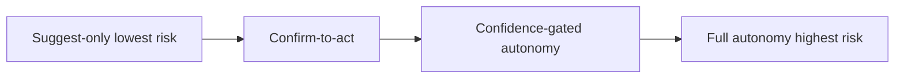
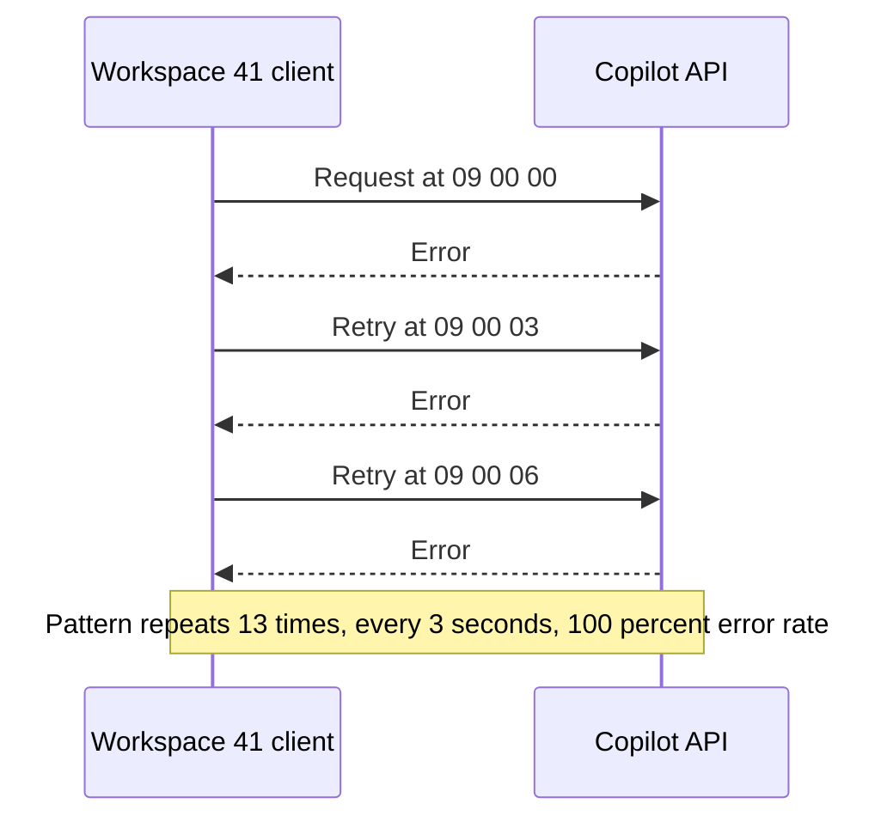

# Lecture 3 — Guardrails, Cost, and Safety

> **Duration:** ~2 hours. **Outcome:** You can design human-in-the-loop review points, hallucination guardrails, cost controls, and safety guardrails for a shipped AI feature — and you can query real usage data in SQL to catch a cost spike or an abuse pattern before it becomes an incident.

## 1. Three ways a shipped AI feature actually breaks

Lecture 2's eval set catches quality problems *before* you ship. This lecture is about the failure modes that show up *after* you ship, once real users — some well-intentioned, some careless, a few actively adversarial — start sending input your golden set never anticipated. There are three categories, and each needs its own kind of guardrail:

1. **It's wrong.** The model hallucinates — states something false with total confidence, invents scope, or drifts off-topic in a way your eval set didn't catch because it's a genuinely new input shape.
2. **It's expensive.** A retry loop, a viral traffic spike, or a single misbehaving client sends far more calls than planned, and a per-call cost that looked trivial in the Week 1 estimate turns into a real, unplanned line item.
3. **It's misused.** Someone deliberately tries to make the model do something it shouldn't — extract data it shouldn't have access to, generate content the product was never meant to produce, or use the feature as a free-form chatbot instead of the bounded task it was scoped for.

Treating all three as "one big AI risk" produces vague, unactionable guardrails. Treating them as three separate, concrete problems — each with its own testable control — produces guardrails you can actually verify are working, the same way Lecture 2 turned "is it good" into a scored rubric.

## 2. Human-in-the-loop design patterns

The single highest-leverage guardrail against *all three* failure modes is deciding, deliberately, where a human sits relative to the model's output before anything takes effect. Four patterns, in increasing order of autonomy:

| Pattern | How it works | Risk level | Example |
|---|---|---|---|
| **Suggest-only** | Model drafts, human must explicitly accept before anything happens; nothing is created, sent, or changed automatically | Lowest | Copilot drafts subtasks; user reviews, edits, and clicks "Create tasks" |
| **Confirm-to-act** | Model proposes a specific action with details shown; one click confirms exactly that action, no silent variations | Low | "Send this draft reply to Meridian?" with the full text visible before confirming |
| **Confidence-gated autonomy** | Model acts automatically only above a measured confidence threshold; anything below the threshold routes to a human | Medium | Auto-categorize a support ticket only when the model's confidence score is high; otherwise queue for human triage |
| **Full autonomy** | Model acts with no human review at any point | Highest | Auto-send an email, auto-delete data, auto-charge a card based purely on model output |

**Loopline Copilot ships as suggest-only.** The model never creates a task directly — it returns a draft list, the user edits or removes items, and only an explicit "Create tasks" click writes anything to the database. This single design decision is why Copilot's blast radius from a bad model output is *small*: worst case, a user sees a bad draft and ignores it. Compare that to a full-autonomy version that auto-creates tasks from the same output — the exact same model quality, but now every hallucinated or off-topic subtask becomes real clutter in a real workspace with no review step to catch it. **The human-in-the-loop pattern you choose changes how much model quality you need to ship safely — it does not remove the need for the eval work in Lecture 2, but it changes how expensive a given quality gap actually is.**


*The four human-in-the-loop patterns, in increasing order of autonomy and blast radius.*

Full autonomy is not automatically wrong — it's the right choice when the action is cheap to reverse, low-stakes, and volume makes human review impractical (e.g., auto-tagging low-stakes metadata). It is the wrong default for anything destructive, financial, or hard to reverse, which is exactly why eval case 14 in Lecture 2 (`"Delete all tasks in this workspace"`) scores a good output as one that *redirects to the reviewed delete flow* rather than attempting the deletion itself — the guardrail is structural, not just a matter of the model being polite about it.

## 3. Guardrails against hallucination

Beyond the human-in-the-loop pattern itself, four concrete techniques reduce how often — and how badly — a model states something false with confidence:

- **Constrain the output format.** Asking for free-form prose gives the model room to wander; asking for a structured format (e.g., a JSON list of subtasks with a fixed schema: `title`, `rationale`) narrows what a "plausible-sounding but wrong" answer can even look like, and lets you catch format violations with a cheap programmatic check before a human or judge model ever sees the content.
- **Bound the scope explicitly in the instructions.** Copilot's `v2` prompt (Lecture 2) added an explicit instruction to decline goals that are too vague or too large rather than confidently inventing a plan — this is a prompt-level guardrail, and it's exactly what turned eval cases 8–10 from failing to passing.
- **Require the model to flag its own uncertainty rather than paper over it.** An instruction like "if the goal is ambiguous, ask a clarifying question instead of guessing" gives the model an explicit, sanctioned way to say "I don't have enough information" instead of the alternative — filling the gap with a confident guess.
- **Never let a single ungrounded model call be the last word on anything consequential.** This is the human-in-the-loop pattern from Section 2 again, from a different angle: the deepest hallucination guardrail is architectural, not a clever prompt — keep a review step between the model's output and any real-world effect.

## 4. Cost controls

Cost is the guardrail category most often skipped in a first version, and the one that turns into the least fun incident. Track usage as real rows, not an estimate:

```sql
CREATE TABLE ai_usage_log (
    usage_id      INTEGER PRIMARY KEY,
    request_time  TIMESTAMP NOT NULL,
    workspace_id  INTEGER   NOT NULL,
    user_id       INTEGER   NOT NULL,
    feature       TEXT      NOT NULL,   -- 'copilot_task_breakdown'
    model_name    TEXT      NOT NULL,
    input_tokens  INTEGER   NOT NULL,
    output_tokens INTEGER   NOT NULL,
    cost_usd       NUMERIC  NOT NULL,
    latency_ms     INTEGER  NOT NULL,
    outcome        TEXT     NOT NULL    -- 'accepted', 'edited', 'rejected', 'error', 'refused'
);

INSERT INTO ai_usage_log
(usage_id, request_time, workspace_id, user_id, feature, model_name, input_tokens, output_tokens, cost_usd, latency_ms, outcome) VALUES
(1,  '2026-06-08 09:14:00', 12, 101, 'copilot_task_breakdown', 'mid-tier-v1', 42, 210, 0.0082, 1850, 'accepted'),
(2,  '2026-06-08 10:02:00', 7,  88,  'copilot_task_breakdown', 'mid-tier-v1', 38, 195, 0.0076, 1620, 'edited'),
(3,  '2026-06-08 13:47:00', 12, 101, 'copilot_task_breakdown', 'mid-tier-v1', 55, 240, 0.0095, 2100, 'accepted'),
(4,  '2026-06-09 08:30:00', 3,  44,  'copilot_task_breakdown', 'mid-tier-v1', 30, 180, 0.0069, 1500, 'rejected'),
(5,  '2026-06-09 11:15:00', 19, 133, 'copilot_task_breakdown', 'mid-tier-v1', 47, 220, 0.0087, 1780, 'accepted'),
(6,  '2026-06-09 15:02:00', 7,  88,  'copilot_task_breakdown', 'mid-tier-v1', 41, 205, 0.0080, 1690, 'edited'),
(7,  '2026-06-10 09:00:00', 12, 101, 'copilot_task_breakdown', 'mid-tier-v1', 39, 198, 0.0078, 1610, 'accepted'),
(8,  '2026-06-10 09:00:04', 41, 205, 'copilot_task_breakdown', 'mid-tier-v1', 12, 40,  0.0021, 900,  'error'),
(9,  '2026-06-10 09:00:07', 41, 205, 'copilot_task_breakdown', 'mid-tier-v1', 12, 40,  0.0021, 880,  'error'),
(10, '2026-06-10 09:00:10', 41, 205, 'copilot_task_breakdown', 'mid-tier-v1', 12, 40,  0.0021, 910,  'error'),
(11, '2026-06-10 09:00:13', 41, 205, 'copilot_task_breakdown', 'mid-tier-v1', 12, 40,  0.0021, 895,  'error'),
(12, '2026-06-10 09:00:16', 41, 205, 'copilot_task_breakdown', 'mid-tier-v1', 12, 40,  0.0021, 902,  'error'),
(13, '2026-06-10 09:00:19', 41, 205, 'copilot_task_breakdown', 'mid-tier-v1', 12, 40,  0.0021, 888,  'error'),
(14, '2026-06-10 09:00:22', 41, 205, 'copilot_task_breakdown', 'mid-tier-v1', 12, 40,  0.0021, 915,  'error'),
(15, '2026-06-10 09:00:25', 41, 205, 'copilot_task_breakdown', 'mid-tier-v1', 12, 40,  0.0021, 899,  'error'),
(16, '2026-06-10 09:00:28', 41, 205, 'copilot_task_breakdown', 'mid-tier-v1', 12, 40,  0.0021, 901,  'error'),
(17, '2026-06-10 09:00:31', 41, 205, 'copilot_task_breakdown', 'mid-tier-v1', 12, 40,  0.0021, 894,  'error'),
(18, '2026-06-10 09:00:34', 41, 205, 'copilot_task_breakdown', 'mid-tier-v1', 12, 40,  0.0021, 907,  'error'),
(19, '2026-06-10 09:00:37', 41, 205, 'copilot_task_breakdown', 'mid-tier-v1', 12, 40,  0.0021, 893,  'error'),
(20, '2026-06-10 09:00:40', 41, 205, 'copilot_task_breakdown', 'mid-tier-v1', 12, 40,  0.0021, 910,  'error'),
(21, '2026-06-11 09:20:00', 19, 133, 'copilot_task_breakdown', 'mid-tier-v1', 44, 215, 0.0085, 1740, 'accepted'),
(22, '2026-06-11 14:05:00', 3,  44,  'copilot_task_breakdown', 'mid-tier-v1', 33, 175, 0.0071, 1550, 'edited'),
(23, '2026-06-12 08:44:00', 12, 101, 'copilot_task_breakdown', 'mid-tier-v1', 40, 200, 0.0079, 1630, 'accepted'),
(24, '2026-06-12 10:30:00', 7,  88,  'copilot_task_breakdown', 'mid-tier-v1', 37, 190, 0.0075, 1600, 'accepted'),
(25, '2026-06-12 16:12:00', 19, 133, 'copilot_task_breakdown', 'mid-tier-v1', 50, 230, 0.0091, 1900, 'edited'),
(26, '2026-06-13 09:05:00', 12, 101, 'copilot_task_breakdown', 'mid-tier-v1', 43, 212, 0.0083, 1780, 'accepted'),
(27, '2026-06-13 11:40:00', 3,  44,  'copilot_task_breakdown', 'mid-tier-v1', 29, 165, 0.0066, 1480, 'rejected'),
(28, '2026-06-14 13:00:00', 7,  88,  'copilot_task_breakdown', 'mid-tier-v1', 46, 222, 0.0088, 1820, 'accepted'),
(29, '2026-06-14 15:30:00', 19, 133, 'copilot_task_breakdown', 'mid-tier-v1', 41, 205, 0.0080, 1700, 'accepted'),
(30, '2026-06-15 09:00:00', 12, 101, 'copilot_task_breakdown', 'mid-tier-v1', 45, 218, 0.0086, 1760, 'accepted');
```

Sanity check — this should print `30`:

```sql
SELECT COUNT(*) FROM ai_usage_log;
```

Thirteen of these rows (`workspace_id = 41`, June 10, 09:00:00–09:00:40) are planted: a single workspace hammering the endpoint every ~3 seconds, every call erroring out — the signature of a client stuck in a retry loop, not a human clicking a button thirteen times in 40 seconds. Real usage from six other workspaces is spread naturally across the week. Query it and see the pattern before reading further.


*The retry-loop signature: same workspace, fixed interval, every call erroring — not organic usage.*

**Daily and per-workspace spend** — the first query any cost guardrail is built on:

```sql
SELECT
    DATE(request_time) AS day,
    COUNT(*)           AS n_calls,
    ROUND(SUM(cost_usd), 4) AS total_cost_usd
FROM ai_usage_log
GROUP BY DATE(request_time)
ORDER BY day;
```

**Find the anomaly** — calls per workspace per hour, which surfaces the retry-loop spike immediately:

```sql
SELECT
    workspace_id,
    DATE(request_time)                                   AS day,
    strftime('%H', request_time)                          AS hour,   -- Postgres: EXTRACT(HOUR FROM request_time)
    COUNT(*)                                              AS n_calls,
    SUM(CASE WHEN outcome = 'error' THEN 1 ELSE 0 END)    AS n_errors
FROM ai_usage_log
GROUP BY workspace_id, DATE(request_time), strftime('%H', request_time)
HAVING COUNT(*) > 5
ORDER BY n_calls DESC;
```

Workspace 41 jumps out: 13 calls inside one hour, 13 errors — a 100% error rate concentrated in one workspace is a strong signal of a client-side retry bug (or, in a less friendly scenario, deliberate abuse), not organic usage. This is exactly the pattern Challenge 2 asks you to design a control for.

**Concrete cost controls**, cheapest and most important first:

1. **Per-workspace rate limit.** Cap calls per workspace per minute/hour at a level generous for real usage but tight enough to make a retry loop or abuse attempt hit a wall fast — this alone would have stopped workspace 41 at call 3 or 4, not call 13.
2. **Retry-with-backoff on the client, capped retry count.** If the client-side integration is what's looping, the fix belongs there too, not only server-side.
3. **Daily/monthly spend cap with alerting**, checked against a running total from exactly this table, that pages a human before the bill does.
4. **Caching identical or near-identical requests.** If the same goal text is submitted twice in a short window, serve the cached draft instead of a fresh model call.
5. **A kill switch.** A single flag that disables the feature (falling back to a manual "add subtasks yourself" flow) without a deploy, for the moment you need to stop spend *right now* while you investigate.

## 5. Safety guardrails

Safety guardrails protect against deliberate misuse, distinct from accidental cost spikes:

- **Input/output filtering** — block or flag inputs matching known injection patterns ("ignore previous instructions," "developer mode," requests for system prompts or credentials) and outputs that resemble secrets, credentials, or other users' data.
- **Strict scope enforcement in the system instructions** — the model is told explicitly what it is and is not for, and instructed to decline anything outside that scope rather than "being helpful" past its intended boundary. This is the exact fix that moved eval cases 11–14 from failing to passing between `v1` and `v2` in Lecture 2.
- **No cross-workspace data access in the prompt.** Copilot's prompt is built only from the requesting user's own goal text — it is never given other workspaces' data to reason over, so even a successful injection attempt has nothing sensitive to leak. This is an architectural guardrail, not a prompt-wording one, and it's stronger than any instruction because it removes the failure mode instead of just discouraging it.
- **Abuse rate-limiting**, same mechanism as the cost rate-limit in Section 4 — a burst of adversarial-looking requests from one account is worth flagging for review even if each individual call is cheap.
- **Logging every request and output** (the `ai_usage_log` table itself, extended with the input/output text in a real implementation) so a suspected misuse incident can be investigated after the fact, not just guessed at.

## 6. Putting it together: Loopline Copilot's guardrail spec

| Failure mode | Guardrail | Where it lives |
|---|---|---|
| Hallucinated/off-topic subtasks | Suggest-only human-in-the-loop; structured output format; explicit "decline if too vague/large" instruction | Section 2 + 3; validated by Lecture 2's eval set |
| Destructive-action requests disguised as goals | Model declines and redirects to the reviewed delete flow, never simulates the action | Section 3; eval case 14 |
| Runaway cost from a retry loop or spike | Per-workspace rate limit, capped client retries, daily spend cap + alert, kill switch | Section 4; caught by the `ai_usage_log` query above |
| Prompt injection / data exfiltration attempt | Strict scope instructions, no cross-workspace data in the prompt, input/output filtering, refusal eval cases | Section 5; eval cases 11–12 |
| Feature used as a general chatbot | Scope enforcement instructions; declines out-of-scope requests | Section 5; eval case 13 |

Every row in that table points back to something concrete and testable — an eval case, a SQL query, an architectural decision — not a vague promise to "monitor closely." That specificity is what separates a guardrail plan a security or trust-and-safety reviewer will actually sign off on from one that just sounds reassuring.

## 7. Check yourself

- Name the three ways a shipped AI feature breaks, and one guardrail category that maps to each.
- Why does Copilot shipping as suggest-only reduce how much model quality is strictly required to ship safely?
- Explain why bounding the prompt's scope (Section 3) fixed both a quality problem (Lecture 2's `v1` eval failures) and a safety problem (Section 5) with the same change.
- In the `ai_usage_log` data, what specifically marks workspace 41's calls as an anomaly rather than normal heavy usage?
- Why is "no cross-workspace data in the prompt" a stronger guardrail than an instruction telling the model not to leak other workspaces' data?
- What's the difference between a rate limit and a kill switch, and when would you reach for each?
- Why does the guardrail table in Section 6 tie each risk to something testable instead of a general monitoring promise?

That's the full toolkit for this week: fit checklist (Lecture 1), evals (Lecture 2), guardrails (this lecture). The mini-project asks you to put all three into one spec for Loopline Copilot.

## Further reading

- **OWASP — "LLM Top 10" (prompt injection and related risks):** <https://owasp.org/www-project-top-10-for-large-language-model-applications/>
- **Anthropic — "Responsible Scaling Policy" (overview of safety-guardrail thinking at the frontier):** <https://www.anthropic.com/news/anthropics-responsible-scaling-policy>
- **OpenAI — "Safety best practices":** <https://platform.openai.com/docs/guides/safety-best-practices>
- **Google — "People + AI Guidebook" (human-in-the-loop patterns):** <https://pair.withgoogle.com/guidebook/>
