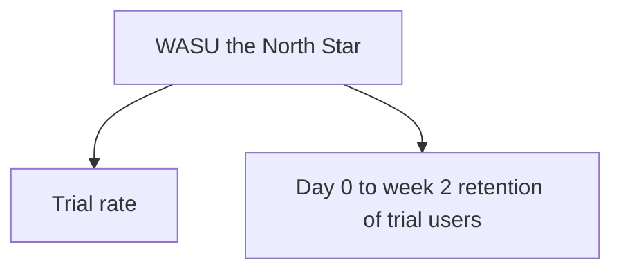

# Measuring a Launched MVP

Week 6 taught you the SQL: North Star, funnels, retention cohorts, DAU/WAU/MAU. Week 7 taught you how to prove a change caused a result. This lecture doesn't teach new SQL — it teaches the *judgment* step that sits between "I ran the query" and "I know if the MVP worked": choosing the right North Star for a genuinely new product, reading a dashboard that gives you a mixed answer instead of a clean one, and knowing which follow-up query actually resolves the ambiguity instead of just producing more numbers to stare at. We do all of it against the `mvp_users` / `mvp_launch_events` dataset from this week's README — make sure it's loaded before you start.

## 1. Choosing a North Star for something that didn't exist two weeks ago

Week 6 chose Loopline's North Star from years of accumulated event data. AI Task Summaries has been live for fourteen days. This is the situation you'll actually be in for your own capstone's "measure" act, and it's harder than picking a North Star for a mature product, for one specific reason: **you don't yet know which of several plausible candidate metrics is the one that will actually predict long-term value** — you're choosing under more uncertainty, with less data, and you have to commit anyway.

Three candidates, and the reasoning for picking one:

| Candidate | What it counts | Problem with it as the North Star |
|-----------|----------------|-------------------------------------|
| **Total summaries generated** | Every `summary_generated` row, full stop | A pure volume metric — one power user generating 9 summaries and nine different users each trying it once look identical in the total. It rewards intensity from a few, not adoption or habit across many. |
| **Trial rate** (% of exposed users who ever generated ≥1 summary) | `mvp_users` who appear at least once in `mvp_launch_events` with `event_name = 'summary_generated'` | Measures curiosity, not value. A feature everyone tries once and nobody keeps using can post a great trial rate while being a genuine failure. |
| **Weekly Active Summary Users (WASU)** | Distinct users generating ≥1 summary in a given calendar week | Measures *sustained* usage, week over week — the closest proxy this two-week window can offer for "is this becoming a habit," which is what actually predicts whether the feature survives past launch hype. |

**WASU is the right North Star here**, for the same reason Week 6 preferred DAU/MAU stickiness over raw signups: a metric that only counts *first contact* can't distinguish a feature people love from a feature people were merely curious about, and the difference between those two is the entire question a launched-MVP dashboard exists to answer. Trial rate and total-summaries-generated aren't useless — they become **input metrics** feeding a metric tree under WASU, exactly like Week 6 taught: WASU is driven by (trial rate) × (day-0-to-week-2 retention of trial users), and reading the tree, not just the top metric, is what tells you *which lever* to pull next.


*WASU is driven by trial rate and day-0-to-week-2 retention - the metric tree under the North Star.*

## 2. The queries, in order

### 2.1 Exposure and trial rate

Start with the simplest possible question: of everyone exposed, who ever tried it?

```sql
SELECT
    COUNT(DISTINCT u.user_id)                                              AS exposed_users,
    COUNT(DISTINCT e.user_id)                                              AS ever_tried,
    ROUND(100.0 * COUNT(DISTINCT e.user_id) / COUNT(DISTINCT u.user_id), 1) AS trial_rate_pct
FROM mvp_users u
LEFT JOIN mvp_launch_events e
    ON e.user_id = u.user_id AND e.event_name = 'summary_generated';
```

> **Why `COUNT(DISTINCT u.user_id)`, not `COUNT(*)`.** Once you `LEFT JOIN` to a table where a single user can have many matching rows — and power users here have up to nine — a plain `COUNT(*)` counts *joined rows*, not *users*, and silently inflates your denominator (try it: it returns 47, not 18). Any time your `SELECT` has a `COUNT(DISTINCT ...)` on one side of a ratio, the other side needs the same `DISTINCT` treatment on the table that isn't one-row-per-entity anymore. This bites almost every PM's first funnel query at least once — better to hit it here, on 50 rows you can hand-check, than in a real dashboard.

**Result: 18 exposed, 16 ever tried, 88.9% trial rate.** That's a strong top-of-funnel number by almost any benchmark — most net-new feature launches are thrilled to see 40–60% of exposed users try something once. On its own, this number says "great launch." Do not stop here; Section 1's warning about first-contact metrics applies directly.

### 2.2 Day-0 activation, specifically

Trying it "at some point in two weeks" and trying it "the moment you saw it" are different signals — the second is a much stronger read on whether the *value proposition itself* is immediately obvious, versus something that took convincing.

```sql
SELECT
    COUNT(DISTINCT u.user_id)                                                     AS exposed_users,
    COUNT(DISTINCT CASE WHEN e.event_date = u.exposed_at THEN e.user_id END)      AS day0_activated,
    ROUND(100.0 * COUNT(DISTINCT CASE WHEN e.event_date = u.exposed_at THEN e.user_id END)
          / COUNT(DISTINCT u.user_id), 1)                                        AS day0_activation_pct
FROM mvp_users u
LEFT JOIN mvp_launch_events e
    ON e.user_id = u.user_id AND e.event_name = 'summary_generated';
```

**Result: 11 of 18, or 61.1%, generated a summary the same day they were exposed.** Combined with 2.1's number, this tells you something specific: 11 users needed zero convincing, and 5 more (16 − 11) tried it later in the window — meaning the value proposition is legible on first sight for a majority, and even the slower adopters eventually gave it a shot. That's a genuinely good signal about the *pitch*. It says nothing yet about the *product* once someone's past the first try — which is exactly what Section 2.3 checks.

### 2.3 Weekly Active Summary Users — the trend that matters

```sql
SELECT
    CASE WHEN event_date <= '2025-02-20' THEN 'week_1' ELSE 'week_2' END AS week,
    COUNT(DISTINCT user_id)                                              AS wasu
FROM mvp_launch_events
WHERE event_name = 'summary_generated'
GROUP BY 1
ORDER BY 1;
```

**Result: week 1 = 16, week 2 = 7.** This is the number that changes the story. Every user who ever tried the feature (all 16) generated at least one summary in week 1 — trivially true, since 11 of them activated on day 0 and the rest tried within the first week. But by week 2, fewer than half of those 16 — just 7 — were still generating summaries. **A 56% week-over-week decline in the metric that best proxies habit formation, sitting directly underneath an 88.9% trial rate that looked like an unambiguous win.** This is the exact pattern Lecture 1 said to expect: a real, non-orphaned metric revealing a story the top-line number hid. If you had reported only Section 2.1's 88.9% in a launch readout, you'd have told your stakeholders a materially wrong story.

### 2.4 Who's actually retained, and does plan predict it?

The natural next question — is this decline uniform, or concentrated somewhere that suggests a fix?

```sql
SELECT
    u.plan,
    COUNT(DISTINCT u.user_id)                                                     AS exposed_on_plan,
    COUNT(DISTINCT CASE WHEN e.event_date >= '2025-02-21' THEN e.user_id END)     AS week2_retained,
    ROUND(100.0 * COUNT(DISTINCT CASE WHEN e.event_date >= '2025-02-21' THEN e.user_id END)
          / COUNT(DISTINCT u.user_id), 1)                                        AS week2_retention_pct
FROM mvp_users u
LEFT JOIN mvp_launch_events e
    ON e.user_id = u.user_id AND e.event_name = 'summary_generated'
GROUP BY u.plan
ORDER BY u.plan;
```

**Result: pro plan retains at 50% (5 of 10), free plan at 25% (2 of 8) — pro users are twice as likely to still be using the feature in week 2.** This is not a coincidence to wave away — it's a segmentation finding with a direct product implication, and it's exactly the kind of cross-week callback this course has been building toward: this result belongs in the same conversation as Week 10's pricing lecture. A feature that retains twice as well among your highest-paying tier is evidence *for* using it as a packaging lever (a "Pro-tier value driver," in Week 10's language) rather than evidence to kill it outright, even though its overall retention number looks weak in isolation.

### 2.5 One more cut: is the decline about churn from the app, or churn from the feature specifically?

Before you conclude "the feature failed," rule out the boring alternative explanation: maybe these users left Loopline entirely, and the feature had nothing to do with it.

```sql
SELECT
    u.user_id,
    u.plan,
    MAX(e.event_date) AS last_summary_generated,
    CASE WHEN u.user_id IN (17, 18) THEN 'logged_in_but_never_tried_feature'
         ELSE 'tried_feature_at_least_once' END AS status
FROM mvp_users u
LEFT JOIN mvp_launch_events e
    ON e.user_id = u.user_id AND e.event_name = 'summary_generated'
GROUP BY u.user_id, u.plan
ORDER BY last_summary_generated DESC NULLS LAST;
```

Scanning the output: users 17 and 18 never generated a single summary but were confirmed active in the app via `login` events early in the window — they're evidence the feature itself didn't land for them (they saw it, they were in the app, they didn't bite), not evidence of general product churn. Everyone else who stopped generating summaries had generated at least one — meaning the drop-off in Section 2.3 is a **feature-specific retention problem**, not an artifact of people leaving Loopline altogether. That distinction matters enormously for what you recommend next: "improve or kill this feature" is the right conversation; "something is wrong with Loopline broadly" is not supported by this data.

## 3. Reading the dashboard as one story, not five separate numbers

Put Sections 2.1–2.5 together and you get a coherent read, not five disconnected stats:

> AI Task Summaries had an excellent top-of-funnel launch — 89% of exposed users tried it, 61% on day one, with no evidence the value proposition itself needs work. But only 39% of everyone exposed (7 of 18) is still using it two weeks in, and pro-plan users retain at twice the rate of free-plan users, with no confounding explanation from general app churn. **The pitch works. The habit doesn't — yet, and disproportionately not for free-plan users.**

That single paragraph is what a North Star metric tree is *for*: it lets you say, precisely, which input metric is healthy (trial, day-0 activation) and which is the actual problem (week-2 retention, concentrated in one segment) — instead of a vague "engagement is mixed." A dashboard that can't produce a sentence this specific hasn't been read carefully enough yet, regardless of how many queries you ran.

## 4. Instrumenting *your own* capstone idea

You will not have real usage data for your own capstone product — it doesn't exist yet. What Exercise 3 asks you to do instead is the thing a real PM does *before* a feature ships, not after: **design the event schema now**, so that the moment real users touch the product, the data needed to answer "did it work" is already flowing. Three design questions to answer for your own idea, directly from this lecture's pattern:

1. **What is the one event that represents your MVP's core value delivered?** (For AI Task Summaries, it's `summary_generated`. For your grocery-list app, maybe it's `cost_split_confirmed`. For your kiosk, maybe it's `checkin_completed`.) This is the event your North Star will be built from.
2. **What's your day-0 activation event, and is it the same as your core-value event or a step before it?** Sometimes activation is a proxy (first successful use) and sometimes it's a lighter-weight signal (first session past 60 seconds) — decide which, and say why.
3. **What second dimension would you want to segment retention by**, the way this lecture segmented by `plan`? Segment (free vs. paid, platform, acquisition channel, user role) is a design decision you make at schema time — `mvp_users.plan` only existed to answer Section 2.4 because someone thought to add that column *before* the data started flowing. If you don't design the segment column now, you can't slice by it later no matter how badly you want to.

Exercise 3 has you do exactly this: write the `CREATE TABLE` statements for your own idea's users/events schema, and populate them with plausible synthetic rows representing a hypothetical first two weeks — not because fake data has real predictive value, but because building the schema and the queries *before* real usage exists is the actual, real-world skill of MVP instrumentation. The queries you write against synthetic data today are the same queries you'll run against real data the day after your real launch.
