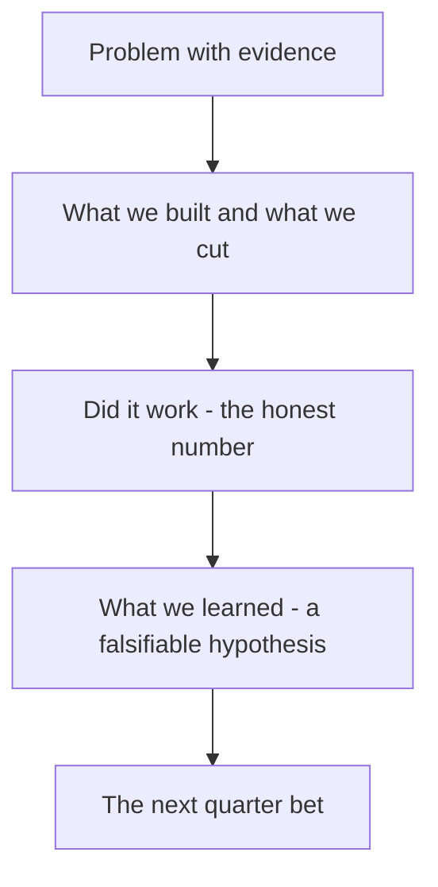

# Presenting to Stakeholders

You now have a coherent story (Lecture 1) and a real, mixed dashboard result (Lecture 2: strong trial, weak retention, a segment gap). This lecture is about the last mile — turning that into a presentation a CFO, a Growth lead, and your own VP of Product would sit through, believe, and act on. This is not a slide-design lecture. It's about structure, evidence discipline, and how to survive the ten minutes after your last slide, which is usually where launch readouts actually succeed or fail.

## 1. Why most launch readouts fail before the first question

The single most common failure mode is **leading with the artifact instead of the story**. A readout that opens "here's the PRD, here's the roadmap, here's the dashboard, here's the experiment" forces the room to reconstruct the narrative themselves, in real time, while also trying to evaluate whether the numbers are good — two hard cognitive tasks at once, and most people fail at the first one silently, then ask a confused question that derails the second. The fix is structural: **tell the story first, show the evidence second.** The room should know, in the first ninety seconds, what problem you solved, what you built, whether it worked, and what you're asking for — everything after that is you defending each of those four claims with evidence, not introducing new information for the first time.

## 2. The five-part structure

This mirrors Lecture 1's five acts almost exactly, compressed into presentation form:

1. **The problem, in one sentence, with its evidence.** Not "users wanted better task visibility" — "teams using Loopline lost an average of 40 minutes a week hunting for who owned a blocked task, based on our discovery interviews and support ticket analysis." Specific, sourced, falsifiable.
2. **What we built, and — critically — what we deliberately didn't.** State the MVP scope and its non-goals in the same breath. Naming what you cut is not a weakness to hide; it's proof you made a real prioritization decision instead of building everything anyone asked for. ("We shipped the stuck-task view for web only; we explicitly did not build mobile or Slack notifications in v1, because RICE scored both below the capacity line.")
3. **Did it work — the honest number, not the flattering one.** This is where Lecture 2's discipline pays off. If your dashboard shows strong trial and weak retention, say exactly that, in that order, with both numbers. A stakeholder who later discovers you led with 89% trial and buried 39% two-week retention in an appendix slide will trust your *next* readout less, not more — and they will look for the buried number, because experienced stakeholders always do.
4. **What we learned, framed as a specific, falsifiable hypothesis** — not a vague "we'll keep iterating." ("We believe the retention gap is concentrated in free-plan users because the feature isn't visible enough in their simpler task view — not because the value proposition itself is weak, since day-0 activation was strong across both plans.") A hypothesis this specific can be *wrong*, and stating something that can be wrong is what makes a room trust it's a real belief and not a hedge.
5. **The next-quarter bet.** One concrete ask — a specific experiment, a specific resourcing request, a specific go/no-go milestone — not "give us more time." Section 4 below covers exactly what "concrete" means here.

*The five-part readout structure - each part builds the case for the next.*

## 3. Defending trade-offs under real pushback

Every launch readout draws pushback, and the pushback almost always takes one of four recognizable shapes. Prepare for all four before you present, not during.

**"Why didn't you build [feature] instead?"** Answer with the prioritization framework, not a defensive justification. "We scored it — [feature]'s WSJF came out at 4.2 versus this item's 11.8, driven mainly by Time Criticality: three signed deals had closing dates riding on this, and [feature] had none." If you don't remember your own scoring rationale cold, you'll sound like you're improvising a justification after the fact — which is precisely what a sharp stakeholder is listening for.

**"That number looks bad — why should we keep investing?"** Do not get defensive, and do not minimize the number. Reframe using the metric tree: "Week-2 retention at 39% is the number to worry about, and I'm not going to argue it isn't. But day-0 activation at 61% tells us the core pitch works — the problem is specific and diagnosable (it's concentrated in one segment, with a real hypothesis for why), not a sign the whole bet was wrong. Killing it now would be reacting to the wrong half of the metric tree." This only works if you actually did the segmented analysis in Lecture 2's Section 2.4 — a reframe without evidence behind it is just spin, and rooms can tell the difference.

**"Are you sure this wasn't just novelty / seasonality / a small sample?"** This is a legitimate methodological challenge, not an attack — answer it as one. Name your sample size honestly (18 users, two weeks — small, and you should say so unprompted before someone else does), and name what would resolve the uncertainty (a longer observation window, a larger exposed cohort, or the specific experiment you're proposing in Section 4). A presenter who volunteers their own study's limitations is trusted more, not less, than one who waits to be caught.

**"What did this cost, and was it worth it?"** Have the honest input-cost number ready (engineering weeks, from your roadmap's job-size estimate) even if nobody asked yet — and connect it back to the WSJF or RICE score that justified building it in the first place, so the room sees the original bet and the outcome side by side, not two disconnected conversations happening a quarter apart.

## 4. The next-quarter bet: what "concrete" actually means

A weak ask sounds like: *"We think this has potential — we'd like to keep working on it."* Nobody can approve or reject that sentence, which means nobody really does — it just quietly continues, unaccountable, until someone eventually notices it never got resolved. A strong ask has three parts, every time:

1. **A specific action** — not "improve retention," but "redesign the free-plan task view to surface the feature by default, instead of requiring free users to find it in a settings menu."
2. **A specific metric and threshold that defines success**, tied to the same North Star as your original dashboard — "week-2 retention for free-plan users at 40%+ within one month of the redesign shipping" — not a vaguer version of the metric you already reported.
3. **A specific decision point** — a date or a milestone at which the bet gets evaluated and either continues, pivots, or gets killed. "We'll check this dashboard again on [date]; if free-plan week-2 retention hasn't moved, we recommend sunsetting the feature for free-plan users specifically rather than continuing to invest evenly across both plans."

This structure is deliberately identical to Week 7's experiment pre-registration discipline (decide the decision rule *before* you see the result) and Week 9's rollout kill-switch discipline (name, in advance, exactly what makes you pause). A next-quarter bet that doesn't specify its own success threshold and decision date is not a bet — it's a hope with a due date nobody wrote down, and it is exactly the kind of unaccountable "we'll keep iterating" language that makes stakeholders stop trusting product readouts over time.

## 5. A worked example: closing Loopline's AI Task Summaries story

Here's how Sections 1–4 come together as an actual five-part readout, using Lecture 2's real numbers:

> **Problem.** Loopline users complete an average of 12 tasks a week but have no lightweight way to see what they accomplished without opening the full task list — a gap our Week 2 discovery interviews surfaced repeatedly as "I don't feel like I know what I got done this week."
>
> **What we built.** An AI-generated end-of-day summary of completed tasks, opt-in, surfaced in the daily digest. We explicitly did not build weekly or monthly summaries in v1, and we did not build summary editing beyond a simple dismiss — both scored below our Now-capacity line.
>
> **Did it work.** Trial was strong: 89% of exposed users tried it, 61% on day one — the pitch lands immediately for most people. But week-2 retention was 39% overall, and pro-plan users retained at twice the rate of free-plan users (50% vs. 25%), with no evidence this is general app churn — everyone who stopped had tried the feature at least once.
>
> **What we learned.** We believe the retention gap is concentrated in free-plan users because the feature is opt-in and buried in settings for that plan specifically, not because the underlying value proposition is weak — strong day-0 activation across both plans argues against a weak-value-prop explanation.
>
> **The bet.** We're proposing: surface the feature by default (not opt-in) for free-plan users specifically, and re-check free-plan week-2 retention against a 40% threshold in four weeks. If it doesn't move, we recommend keeping the feature pro-only rather than continuing even investment across both plans.

Every sentence in that readout traces to a specific query from Lecture 2 or a specific decision from Weeks 4–5 — nothing is invented for the presentation. That traceability is what separates a defensible readout from a well-produced slide deck: a defensible readout survives the ten minutes of questions after it, because every claim already has its evidence attached.

## 6. What comes next

You'll write your own version of this five-part structure twice this week: once in Exercise 2's roadmap rationale (a lighter version, justifying priority calls), and once in full in Challenge 2, where you present your actual capstone launch narrative and defend it against five planted, adversarial stakeholder questions modeled on Section 3's four shapes. The mini-project asks you to assemble everything — discovery brief, PRD/roadmap, dashboard, experiment plan, and this five-part narrative — into the single document a real hiring manager or a real internal stakeholder panel would actually read.
