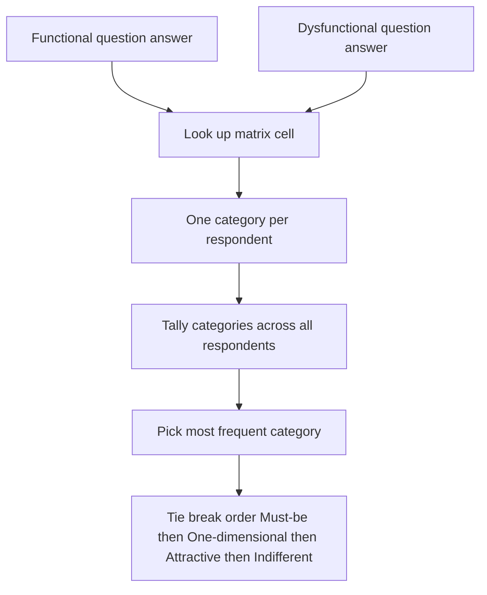

# Lecture 1 — Prioritization Frameworks: RICE, Weighted Scoring, and Kano

> **Duration:** ~2 hours. **Outcome:** You can compute a RICE score and a weighted score in SQL for every item in a real backlog, explain what each input measures and how it can be gamed, and run a Kano survey through the evaluation matrix to get a defensible category and a Better/Worse coefficient.

## 1. Why "just build what's most requested" fails

Every backlog looks the same the first time a new PM sees it: a pile of good ideas, each with a champion who's certain it's next. Sales wants the deal-blocker. Support wants the thing that would stop the tickets. An exec wants the thing they saw a competitor announce. Users want the thing with 1,800 forum upvotes. **All of these are real signals. None of them, alone, tells you what to build first.** A framework's job isn't to replace your judgment — it's to force every idea through the *same* set of questions, so a Sales VP's confidence and a forum's upvote count don't quietly outweigh a smaller, quieter feature that actually moves the business more.

This lecture covers two families of framework:

1. **Scoring frameworks** (RICE, weighted scoring) — reduce each backlog item to a single comparable number.
2. **The Kano model** — classifies *what kind* of value a feature delivers, which a single number can't capture on its own.

You'll use both, together, on Loopline's real 14-item backlog from the [week README](../README.md) — run the seed there before continuing.

## 2. RICE: Reach × Impact × Confidence ÷ Effort

RICE (popularized by Intercom) scores a backlog item on four inputs:

| Input | Question it answers | Typical scale |
|---|---|---|
| **Reach** | How many people/teams does this touch in a given period? | A real count (e.g., "teams/quarter") |
| **Impact** | How much does it move the needle *per person reached*? | 3 = massive, 2 = high, 1 = medium, 0.5 = low, 0.25 = minimal |
| **Confidence** | How sure are you about the Reach and Impact estimates? | 100% / 80% / 50% / 20% |
| **Effort** | How much work is it, total, across every function? | Person-weeks (or -months) |

$$\text{RICE} = \frac{\text{Reach} \times \text{Impact} \times \text{Confidence}}{\text{Effort}}$$

Bigger reach, bigger impact, and higher confidence all push the score up. More effort pulls it down. It's a **priority-per-unit-of-work** number, not a value number — that's the whole point: a huge, valuable feature that takes a year is often *worse* priority than a smaller one that's nearly as valuable and ships in two weeks.

### Computing it in SQL

This is exactly the kind of tabular, formula-driven calculation people reach for a spreadsheet to do. Don't. It's four numbers and one arithmetic expression per row — SQL does it, keeps it queryable, and lets you join it against dependencies and Kano results later in the week.

```sql
SELECT
    item_key,
    title,
    requested_by,
    reach,
    impact,
    confidence,
    effort_weeks,
    ROUND(reach * impact * confidence / effort_weeks, 2) AS rice_score
FROM backlog_items
ORDER BY rice_score DESC;
```

Run it against this week's seed and look at the top and bottom of the list. The top two are `recurring_tasks` (score 190) and `dark_mode` (score 150) — a genuinely valuable feature validated by user research, and a loud, low-impact cosmetic request, sitting right next to each other. Near the *bottom* sits `guest_external_access` (score 12) — the item tied to three signed enterprise deals. RICE alone would tell you to ship dark mode next quarter and let three deals sit. **That's not a flaw unique to this dataset — it's structural.** RICE has no concept of "this specific opportunity closes in 30 days" or "this is contractually required." Hold that thought; Lecture 2 fixes it with cost of delay.

### The four ways RICE gets gamed

Because RICE collapses everything to one number that determines what gets built, every input is a place someone with an agenda can lean on the scale — usually without realizing they're doing it:

1. **Inflated Reach.** Counting forum upvotes, pageviews, or "everyone would use this" as Reach, instead of a grounded estimate of teams actually affected per quarter. `dark_mode`'s 1,800 comes from vote count, not usage — a classic case (Challenge 2 digs into exactly this).
2. **Inflated Impact.** Rounding every pet feature up to "massive" because the champion *believes* it will be, with no evidence — Impact should trace back to a specific mechanism ("removes the #1 reason trial users churn," not "users will love it").
3. **Inflated Confidence.** Marking 100% confidence on an estimate that's actually a guess. `ai_task_summaries` in this week's seed is honestly scored at 20% confidence — no user validation exists yet. A stakeholder eager to ship it might quietly bump that to 80% to force the score up, without doing the validation that would justify it.
4. **Deflated Effort.** Underestimating the work — especially by only counting the "happy path" build and skipping QA, edge cases (Week 4!), and the operational cost of running it.

**Your job as the scorer:** write down *why* each number is what it is, in one clause, next to the score. "Reach: 40 — active Sales-tier teams that filed an escalation ticket this quarter" is auditable. "Reach: 40 — feels about right" is not, and it's exactly the gap an adversarial stakeholder will exploit.

## 3. Weighted scoring: RICE's more flexible cousin

RICE is a *specific* weighted formula. **Weighted scoring** generalizes the idea: pick the criteria that matter to *your* product and business, score each item 1–5 (or 1–10) on each, weight the criteria by importance, and sum.

$$\text{Weighted score} = \sum_i (\text{criterion}_i \times \text{weight}_i)$$

A weighted model for Loopline might use: **User value** (weight 3), **Strategic fit** (weight 2), **Revenue impact** (weight 3), **Effort** (weight −2, since more effort is worse). In SQL, once you have per-item scores for each criterion in a table (or computed from existing columns), the sum is one query:

```sql
-- Illustrative: a weighted score using columns already in backlog_items,
-- reusing WSJF's 1-10 inputs as stand-ins for "user value" and "revenue/strategic fit."
SELECT
    item_key,
    title,
    (user_business_value * 3 + risk_reduction_opp_enable * 2 - job_size_points * 0.5) AS weighted_score
FROM backlog_items
ORDER BY weighted_score DESC;
```

**When to reach for weighted scoring instead of RICE:** when your business cares about a dimension RICE doesn't model well — strategic fit with a stated bet, brand risk, technical debt paid down, regulatory requirement — and you'd rather make that dimension an explicit, weighted input than force it into "Impact." The tradeoff: weighted scoring is more flexible and more gameable in more places, because there are more knobs. **More criteria is not automatically better** — every extra criterion is another place a stakeholder can push a number. Keep it to 3–5 criteria you can each defend in one sentence.

## 4. The Kano model: not every feature earns value the same way

RICE and weighted scoring both assume "more value is more value," on one scale. The **Kano model** (Noriaki Kano, 1984) challenges that: it says a feature's relationship between *how well you build it* and *how satisfied users are* comes in different shapes, and mixing them up leads to overinvesting in the wrong ones.

### The five categories

| Category | Shape | What it means | Example (from this week's backlog) |
|---|---|---|---|
| **Must-be / Basic** | Its absence causes strong dissatisfaction; its presence barely registers as delight — it's just expected | Table stakes. You lose points for not having it, you don't gain points for having it | Recurring tasks, in a market where competitors already have it |
| **One-dimensional / Performance** | Satisfaction scales roughly linearly with how well you do it | "More/better is better," proportionally | A faster sync, a more accurate search |
| **Attractive / Delighter** | Users don't expect it, so its absence causes no complaint — but its presence delights | Differentiators. High upside, no downside if skipped this quarter | A genuinely well-executed AI summary feature, for the users who trust it |
| **Indifferent** | Users don't care whether you build it or not | Low priority regardless of how loudly requested | Often: cosmetic requests validated only by vote count, not behavior |
| **Reverse** | Some users are actively *less* satisfied when the feature exists | Rare, but real for AI/privacy/trust features and any change to defaults | A user who actively distrusts AI-written summaries of their own tasks |

There's a sixth outcome, **Questionable**, which isn't a real category — it means the respondent's two answers contradict each other (e.g., "I'd love it" *and* "I'd love it if you didn't build it"), which usually means the survey question itself was unclear.

### The two-question survey

Kano classifies each feature from **two questions per respondent**, both on the same 5-point scale:

- **Functional question:** *"If Loopline **had** this feature, how would you feel?"*
- **Dysfunctional question:** *"If Loopline **did not have** this feature, how would you feel?"*

| Code | Answer |
|---|---|
| 1 | I like it that way |
| 2 | I expect it that way (must-be) |
| 3 | I am neutral |
| 4 | I can live with it that way |
| 5 | I dislike it that way |

### The evaluation matrix

Cross-tabulate the two answers for one respondent, one feature, and the pair lands in exactly one cell of this fixed matrix:

| Functional ↓ / Dysfunctional → | 1 (like) | 2 (must-be) | 3 (neutral) | 4 (live with) | 5 (dislike) |
|---|---|---|---|---|---|
| **1 (like)** | Q | A | A | A | O |
| **2 (must-be)** | R | I | I | I | M |
| **3 (neutral)** | R | I | I | I | M |
| **4 (live with)** | R | I | I | I | M |
| **5 (dislike)** | R | R | R | R | Q |

(A = Attractive, O = One-dimensional, M = Must-be, I = Indifferent, R = Reverse, Q = Questionable.)

Every respondent gives you one category. To classify the *feature*, tally categories across all respondents and take the **most frequent one** — with a documented tie-break rule (course convention: **M > O > A > I**, since a tie leaning toward "this disappoints people if missing" is the safer business assumption than leaning toward "nobody cares").


*How two survey answers become one Kano category per respondent, then a feature-level classification.*

### Running it in SQL

Map the matrix as a `CASE` expression and classify every response in the seed's `kano_survey_responses` table in one query:

```sql
SELECT
    item_key,
    functional_answer,
    dysfunctional_answer,
    CASE
        WHEN functional_answer = 1 AND dysfunctional_answer = 1 THEN 'Q'
        WHEN functional_answer = 1 AND dysfunctional_answer IN (2,3,4) THEN 'A'
        WHEN functional_answer = 1 AND dysfunctional_answer = 5 THEN 'O'
        WHEN functional_answer IN (2,3,4) AND dysfunctional_answer = 1 THEN 'R'
        WHEN functional_answer IN (2,3,4) AND dysfunctional_answer IN (2,3,4) THEN 'I'
        WHEN functional_answer IN (2,3,4) AND dysfunctional_answer = 5 THEN 'M'
        WHEN functional_answer = 5 AND dysfunctional_answer IN (1,2,3,4) THEN 'R'
        WHEN functional_answer = 5 AND dysfunctional_answer = 5 THEN 'Q'
    END AS kano_category
FROM kano_survey_responses
WHERE item_key = 'recurring_tasks';
```

Then tally per feature:

```sql
WITH classified AS (
    SELECT
        item_key,
        CASE
            WHEN functional_answer = 1 AND dysfunctional_answer = 1 THEN 'Q'
            WHEN functional_answer = 1 AND dysfunctional_answer IN (2,3,4) THEN 'A'
            WHEN functional_answer = 1 AND dysfunctional_answer = 5 THEN 'O'
            WHEN functional_answer IN (2,3,4) AND dysfunctional_answer = 1 THEN 'R'
            WHEN functional_answer IN (2,3,4) AND dysfunctional_answer IN (2,3,4) THEN 'I'
            WHEN functional_answer IN (2,3,4) AND dysfunctional_answer = 5 THEN 'M'
            WHEN functional_answer = 5 AND dysfunctional_answer IN (1,2,3,4) THEN 'R'
            WHEN functional_answer = 5 AND dysfunctional_answer = 5 THEN 'Q'
        END AS kano_category
    FROM kano_survey_responses
)
SELECT item_key, kano_category, COUNT(*) AS n
FROM classified
GROUP BY item_key, kano_category
ORDER BY item_key, n DESC;
```

Run this against the seed's three surveyed features and you'll get:

- **`recurring_tasks`** → dominated by **M** (9 of 20) — it's crossed over from delighter to *table stakes*; shipping it late costs you, shipping it well earns no extra credit.
- **`dark_mode`** → dominated by **I** (12 of 20), with 6 Attractive and 2 Questionable — the forum is loud, but most respondents are genuinely indifferent underneath.
- **`ai_task_summaries`** → dominated by **A** (10 of 20), but with a real cluster of **R** (4 of 20) — most people would be delighted, and a vocal minority would actively dislike it existing. That split is itself a finding worth writing down, not averaging away.

### The Better/Worse coefficient

A single dominant category is useful but throws away information. The **Better** and **Worse** coefficients quantify the *shape* of the opportunity:

$$\text{Better} = \frac{A + O}{A + O + M + I} \qquad \text{Worse} = -\frac{O + M}{A + O + M + I}$$

**Better** (0 to 1) is roughly "how much would building this well increase satisfaction." **Worse** (−1 to 0) is "how much would *not* building it decrease satisfaction" — a bigger negative number means a more painful gap if you skip it. For `recurring_tasks` (A=0, O=5, M=9, I=6): Better = (0+5)/20 = 0.25, Worse = −(5+9)/20 = −0.70. Translation: building it doesn't delight anyone much (Better is modest), but *not* building it hurts a lot (Worse is steep) — exactly what "Must-be" predicts, quantified.

## 5. Putting RICE and Kano together

They answer different questions and neither replaces the other:

- **RICE** asks: *given the work, how much value per unit of effort?*
- **Kano** asks: *what kind of value is it, and what happens if we skip it?*

A practical rule this course uses: **Kano Must-be items get a floor, not a ceiling** — a low RICE score on a Must-be item (like `recurring_tasks`, whose RICE score is actually strong here, but imagine a case where it wasn't) doesn't mean "skip it," it means "the Worse coefficient tells you the cost of skipping it, factor that into cost of delay" — which is exactly Lecture 2's subject. Kano **Indifferent** items, on the other hand, should make you *distrust* a high Reach number, no matter how it was computed — that's `dark_mode` in one sentence.

## 6. Check yourself

- Write the RICE formula from memory, and name what happens to the score as Effort increases while everything else stays fixed.
- Name the four inputs to RICE and one concrete way each can be gamed.
- What's the difference between a weighted-scoring model and RICE, and when would you reach for the former?
- Draw the Kano evaluation matrix's four corners from memory: (like, like), (like, dislike), (must-be-ish, dislike), (dislike, dislike).
- What does a Must-be classification with a strongly negative Worse coefficient actually tell a PM to do?
- Why doesn't a Questionable (Q) classification mean anything about the feature itself?

If those are automatic, Lecture 2 shows you where RICE actively misleads you — and the framework (cost of delay / WSJF) that fixes it.

## Further reading

- **Intercom, "RICE: Simple prioritization for product managers":** <https://www.intercom.com/blog/rice-simple-prioritization-for-product-managers/>
- **Kano, Seraku, Takahashi, Tsuji, "Attractive Quality and Must-Be Quality" (1984, the original paper, summarized):** <https://en.wikipedia.org/wiki/Kano_model>
- **Foldit / 280 Group, "Kano Model Analysis" (worked example with the evaluation matrix):** <https://www.productplan.com/glossary/kano-model/>
- **ProductPlan, "Weighted Scoring Prioritization Model":** <https://www.productplan.com/glossary/weighted-scoring-prioritization-model/>
