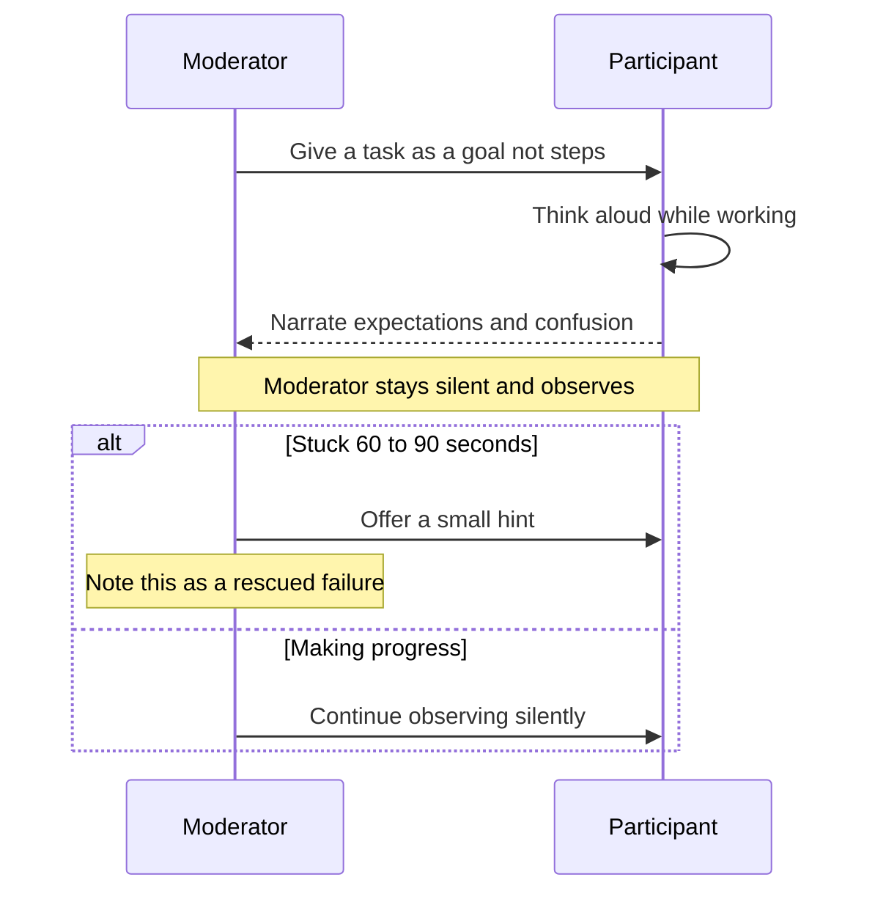
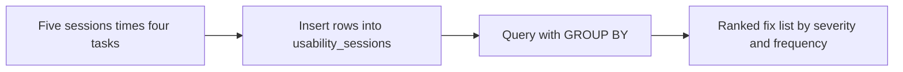

# Lecture 2 — Running Usability Tests

> **Duration:** ~2 hours. **Outcome:** You can write task-based test scenarios with real success criteria, run a moderated think-aloud session, and store and query the results in SQL — turning five sessions of raw observation into a prioritized, evidence-backed fix list.

Lecture 1 gave you a way to *hypothesize* where a flow will hurt. A usability test is how you find out whether you're right. It is the single highest-leverage half-day a PM can spend — five people, an hour of your afternoon, and you will know things about your product that a thousand rows of analytics can't tell you, because analytics tells you *what* happened and a usability test tells you *why*.

## 1. Usability testing vs. A/B testing

These get confused constantly, and the confusion causes real damage — teams run the wrong one and draw the wrong conclusion.

| | Usability test | A/B test (Week 7) |
|---|---|---|
| **Question it answers** | *Why* do people struggle, and where exactly? | *Which* version performs better, on average? |
| **Sample size** | 5–8 participants is often enough | Hundreds to thousands, sized for statistical power |
| **Data type** | Qualitative — observed struggle, verbatim quotes, screen recordings | Quantitative — a single metric moving (conversion, retention) |
| **When to run it** | Before you build, on a prototype; or on a live flow that's underperforming and you don't know why | After you've built two variants and need a number |
| **What it can't tell you** | Whether the fix actually moved the metric at scale | *Why* the losing variant lost |

They're complementary, not competitors: a usability test on Loopline's checkout flow tells you *the payment-failure screen leaves people stuck and confused*; an A/B test afterward tells you whether the redesigned failure screen actually raised checkout completion rate. Skipping the usability test and going straight to an A/B test means you're guessing at what to test; skipping the A/B test after a usability-driven redesign means you never confirm the fix worked in the wild, at scale, for people who weren't watched.

## 2. Designing the test: tasks, not questions

The core unit of a usability test is a **task** — an instruction that describes a goal, never the steps to reach it. This is the most common design mistake beginners make: writing a task that leaks the solution.

**Bad task (leaks the UI):** "Click 'Upgrade' in Team Settings, then select the Team plan."
**Good task:** "Your team just grew to 12 people and the Free plan caps out at 5. Get everyone paid access."

The good version tells the participant their *goal*, in their own likely mental model, and lets the interface either help them find the path or fail to. If you tell them where to click, you're testing whether they can follow instructions, not whether they can use the product.

### Every task needs a written success criterion, decided *before* the session

Decide, in advance, exactly what "done" looks like — otherwise you'll unconsciously grade participants generously when you're rooting for your own design.

```
Task 3: Get your team paid access for 12 seats.
Success criterion: participant reaches the "Success" screen with
seat count = 12 and Team plan selected, without moderator help.
Partial success: reaches Success screen but with wrong seat count
(counts as a failure for this task — the number matters).
Failure: gives up, asks for help, or abandons before reaching Success.
```

Write 3–5 tasks per session, ordered from a natural entry point to a natural end, roughly matching how a real user would chain goals together in one sitting. More than 5–6 tasks and both you and the participant will be exhausted before task 4 tells you anything useful.

## 3. The think-aloud protocol

**Think-aloud** means asking the participant to narrate their thoughts continuously while they work — what they're looking at, what they expect to happen, what confuses them — rather than working silently and reporting afterward. It is the single technique that turns a usability test from "watching someone use a product" into "hearing someone's mental model in real time."

**The script you say before every session:**

> "I'm going to give you a few tasks to try in this product. As you work, please say out loud everything you're thinking — what you're looking at, what you expect to happen when you click something, anything that confuses you or seems off. There are no wrong answers here; if something doesn't work, that's useful information about the product, not about you. I built this, not you, so nothing you say can hurt my feelings — and I won't help you unless you're completely stuck, because I need to see what happens naturally. Any questions before we start?"

That last line matters. Participants will look to you for help constantly — resist it. The moment you say "try clicking the gear icon," you've destroyed the data for that task; you now know the icon is findable *with a hint*, which tells you nothing about whether it's findable without one. Let silence and struggle happen. Only intervene if the participant is truly stuck for 60–90 seconds with no forward motion, and when you do, note it — that's a failure, softened by a rescue, not a success.


*How a moderated think-aloud session runs from task to intervention decision.*

### Moderated vs. unmoderated

- **Moderated** — you're in the room (or on a call), watching live, able to ask follow-up questions ("you paused there — what were you expecting?"). Higher-quality data, more effort per session. This is the default for this course.
- **Unmoderated** — the participant records themselves completing tasks alone, using a tool, and you review the recording later. Scales further (you can run more sessions in less of your own time) but you lose the ability to probe in the moment.

Start moderated. The follow-up questions you ask live are where half the insight comes from — "you paused there, what were you expecting to happen?" is a question a recording can't answer for you.

## 4. The 5-user rule

Jakob Nielsen's research finding, now decades old and repeatedly replicated: **testing with 5 users uncovers about 85% of a flow's usability problems.** The math behind it: if a given problem has, say, a 31% chance of any one user hitting it, the probability that at least one of 5 independent users hits it climbs fast, while the *marginal* new problems found per additional user beyond 5 drops sharply — user 6, 7, 8 mostly re-confirm problems 1–5 already surfaced.

The practical implication for a PM: **don't wait for a large sample to act.** Five well-chosen sessions on one flow, done well (real tasks, think-aloud, no leading), will find almost everything expensive and worth fixing. Spend your remaining budget running *another round of 5* after you've shipped a fix, not padding the first round to 15.

This is a heuristic, not a law — it assumes participants are reasonably similar to your real user base and that you're testing one flow, not sampling across wildly different user segments (a Loopline free-tier hobbyist and a Loopline enterprise IT admin are different populations; test 5 of each if both matter, not 5 total).

## 5. Log results in SQL, not a spreadsheet

Five sessions × four tasks is 20 rows of structured, queryable data — participant, task, success, time, errors, notable quote. That is a database table by definition: fixed columns, one row per observation, and questions you'll want to ask of it ("which task has the lowest success rate," "what's the median time on task 3," "show me every session that hit a severity-4 issue"). A spreadsheet can *hold* this data, but the moment you want an honest aggregate — grouped by task, filtered by severity — you're one merged-cell or one silently-wrong `AVERAGE()` range away from a number you'd present to a VP with total confidence and be wrong. SQL forces the shape to stay correct and makes every aggregate reproducible from a query you can re-run and hand to someone else.

Using the `usability_sessions` table from this week's [README setup](../README.md#set-up-the-usability-log-table), here's a full session's worth of inserts for Loopline's checkout flow:

```sql
INSERT INTO usability_sessions
    (participant, flow_name, task_number, task_label, success, time_seconds, error_count, severity_hint, notable_quote)
VALUES
('P1', 'team_plan_checkout', 1, 'Find where to upgrade the team', TRUE,  22, 0, NULL,
    NULL),
('P1', 'team_plan_checkout', 2, 'Set seat count to 12',            TRUE,  40, 1, 2,
    'Wait, did it save the 12? I don''t see it anywhere now.'),
('P1', 'team_plan_checkout', 3, 'Complete payment',                FALSE, NULL, 3, 4,
    'It just says failed. Failed how? Did it charge me or not?'),
('P2', 'team_plan_checkout', 1, 'Find where to upgrade the team', TRUE,  35, 1, 1,
    NULL),
('P2', 'team_plan_checkout', 2, 'Set seat count to 12',            TRUE,  51, 0, NULL,
    NULL),
('P2', 'team_plan_checkout', 3, 'Complete payment',                TRUE,  95, 2, 3,
    'Oh good, it worked, but I genuinely thought it failed the first time.');
```

Repeat for all 5 participants across all tasks (Exercise 2 has you do exactly this). Then the whole point of putting it in SQL pays off — you can ask real questions:

```sql
-- Success rate per task, across all participants
SELECT
    task_number,
    task_label,
    COUNT(*)                                   AS attempts,
    SUM(CASE WHEN success THEN 1 ELSE 0 END)   AS successes,
    ROUND(100.0 * SUM(CASE WHEN success THEN 1 ELSE 0 END) / COUNT(*), 0) AS success_pct
FROM usability_sessions
WHERE flow_name = 'team_plan_checkout'
GROUP BY task_number, task_label
ORDER BY task_number;

-- Median-ish completion time per task (successful attempts only)
SELECT task_number, task_label, AVG(time_seconds) AS avg_seconds
FROM usability_sessions
WHERE flow_name = 'team_plan_checkout' AND success = TRUE
GROUP BY task_number, task_label
ORDER BY task_number;

-- The worst offenders: every task with a severity-3+ issue, ranked by how often it hit
SELECT
    task_number,
    task_label,
    COUNT(*)              AS sessions_hit,
    MAX(severity_hint)    AS worst_severity
FROM usability_sessions
WHERE severity_hint >= 3
GROUP BY task_number, task_label
ORDER BY worst_severity DESC, sessions_hit DESC;
```

That last query is your fix list, ranked, straight out of the data — no spreadsheet pivot table, no manual tally on a whiteboard photo that someone loses. `GROUP BY` did the counting; you did the deciding.


*Raw observations become a defensible ranked fix list through SQL, not a spreadsheet.*

## 6. From observations to a prioritized fix list

Once the SQL summarizes what happened, prioritize fixes the same way you'd prioritize any backlog item (Week 5) — **severity × frequency**:

| Issue | Severity (0–4) | Sessions hit / 5 | Priority |
|---|---:|---:|---|
| Payment failure gives no reason or next step | 4 | 4/5 | Fix before ship |
| Seat count disappears from view after selection | 2 | 5/5 | High — hits everyone, low-cost fix |
| Legal text competes visually with the CTA | 2 | 2/5 | Medium |
| No time estimate on the processing spinner | 1 | 3/5 | Low — nice to have |

A severity-4 issue that only 1 of 5 people hit still deserves a hard look (catastrophic + rare can be worse than annoying + universal, depending on what the catastrophe is — losing a payment is worse than a cosmetic wobble even if it's rarer). A severity-1 issue that 5 of 5 people hit is usually still lower priority than a severity-3 that hit 2 of 5. There's no formula that replaces judgment here — but the table, built from queried data, is what makes the judgment defensible in a room full of stakeholders who weren't in the sessions with you.

## 7. Check yourself

- Rewrite this leaky task as a proper goal-based task: "Click the gear icon, then 'Billing,' then update your card."
- Why does think-aloud beat asking "how did that feel?" after the fact?
- A participant is stuck for 45 seconds on task 2. Do you help? What about 90 seconds?
- What does the 5-user rule claim, and what does it *not* claim (name one thing 5 users can't tell you that an A/B test can)?
- Why does a `GROUP BY` query beat a spreadsheet pivot table for summarizing session data, specifically?
- Rank these two by priority and justify it: Issue A (severity 4, 1/5 sessions) vs. Issue B (severity 1, 5/5 sessions).

If those are automatic, Lecture 3 takes the findings from a test like this into a critique session with your design and engineering partners — and into the harder conversation about which fixes are worth the cost.

## Further reading

- **Nielsen Norman Group — "Why You Only Need to Test with 5 Users":** <https://www.nngroup.com/articles/why-you-only-need-to-test-with-5-users/>
- **Nielsen Norman Group — "Thinking Aloud: The #1 Usability Tool":** <https://www.nngroup.com/articles/thinking-aloud-the-1-usability-tool/>
- **Nielsen Norman Group — "Moderated vs. Unmoderated Usability Testing":** <https://www.nngroup.com/articles/moderated-unmoderated-usability-testing/>
- **PostgreSQL — `GROUP BY` reference:** <https://www.postgresql.org/docs/current/queries-table-expressions.html#QUERIES-GROUPING-SETS>
