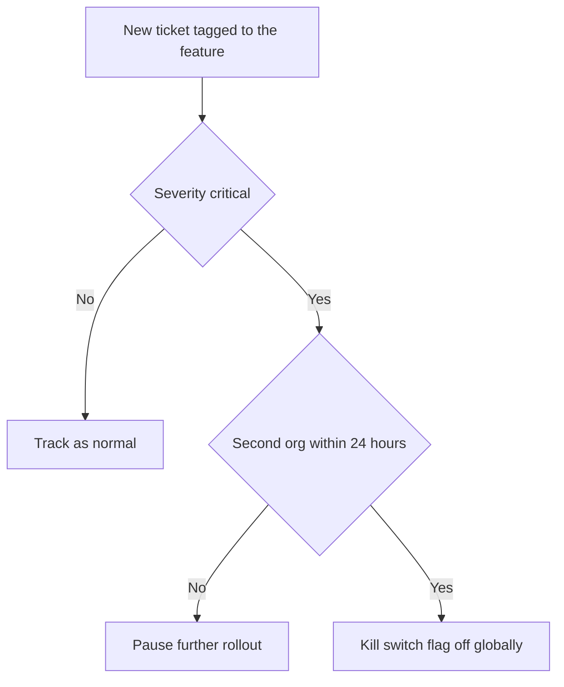
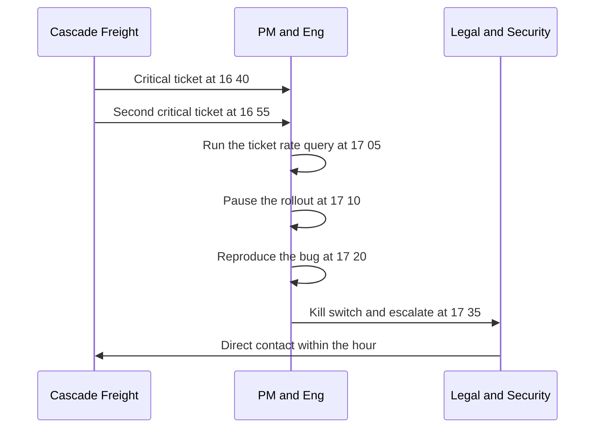

# Lecture 3 — Instrumented Rollouts

> **Duration:** ~2 hours. **Outcome:** You can explain what a feature flag buys you, define launch success and rollback criteria in SQL before a launch starts, build a launch dashboard from the seed data, and walk through a real incident — the Cascade Freight permission bug — from first signal to rollback decision.

Lectures 1 and 2 got the words and the audience right. This lecture makes the rollout **observable** — so "is the launch working" has a query behind it, not a gut check, and so a real problem gets caught in hours, not discovered a week later when a customer escalates. Run every query below against the seed data from the [week README](../README.md).

## 1. Feature flags: decoupling deploy from release

A **feature flag** is a runtime switch that decides whether a piece of already-deployed code actually executes for a given user, org, or request. The critical idea: **deploying code and releasing a feature become two separate events.**

```
                     Without flags                          With flags
Engineering ships → immediately live for 100% of users → engineering ships → code is live but OFF
                                                              → PM turns flag on for org 1, org 2, ...
                                                              → PM turns flag off instantly if something breaks
```

Without a flag, "roll back" means reverting a deploy — slow, and it undoes *every* change in that deploy, not just the risky one. With a flag, rollback is an instant, targeted toggle: turn Guest Access off for everyone, or for one org, in seconds, without touching anything else that shipped alongside it. This is what makes phased rollout possible at all — the `rollout_exposures` table in the seed data *is* a record of flag state changes, one row per org per time the flag flipped on.

Two flag shapes matter for this week:

- **Percentage/cohort rollout** — the flag targets a defined set (an explicit org list, a percentage of traffic, a region). This is what the seed data models: `beta` (8 named orgs) → `ga_25` (8 more) → `ga_100` (remaining 8).
- **Kill switch** — a single global boolean that turns the whole feature off instantly, independent of the cohort logic. Every risky launch should ship with one, tested *before* launch, not improvised during an incident.

## 2. Define success and rollback criteria before you launch, not during

Write these down and get them agreed by the RACI's Accountable owners **before** the first customer is exposed. If you wait until the rollout is underway, every threshold decision happens under pressure, with whoever's most anxious (or most confident) in the room winning the argument instead of the pre-agreed number.

**Leading indicators** — available within hours, tell you the funnel is healthy:

- **Invite → accept rate**: are invited guests actually accepting?
- **Accept → first-action rate**: are accepted guests actually doing anything, or is the feature a dead end after signup?
- **Time-to-first-action**: how long from flag-on to real usage?

**Lagging indicators** — take days to weeks, tell you the feature is *valuable*, not just functional:

- Retention of guest usage over subsequent weeks (does the client keep coming back, or was it a one-time login?)
- Expansion/renewal impact on the accounts this unblocked (did the 3 blocked deals actually close?)

**Rollback triggers** — numeric, pre-agreed thresholds that end the "should we pause" debate:

| Trigger | Threshold | Action |
|---|---|---|
| Any `critical` severity ticket tied to the feature | ≥ 1 | Immediate pause of further rollout; existing exposure stays live pending triage |
| `critical` tickets from more than one org within 24h | ≥ 2 orgs | Kill switch — flag off globally, not just paused |
| `high`+`critical` ticket rate among exposed orgs | > 10% of exposed orgs in a wave | Pause the wave; do not proceed to next wave |
| Invite → accept rate | < 30% sustained over a wave | Not a rollback trigger — a positioning/messaging problem to investigate, not a safety issue |

Notice the asymmetry: a **safety** problem (permission bug, data exposure) gets a hair-trigger, automatic-feeling response. An **adoption** problem (low accept rate) gets investigated, not rolled back on — rolling back a feature because people aren't using it fast enough is usually the wrong instinct; rolling back because it's actively harming customers is never wrong to consider.


*One bad ticket escalates from a pause to a global kill switch by pre-agreed rule, not debate.*

## 3. Building the launch dashboard in SQL

### 3.1 — Exposure and timing, by phase

Start with the shape of the rollout itself: who's exposed, and when.

```sql
SELECT
    re.phase,
    COUNT(*)                                   AS orgs_exposed,
    MIN(re.flag_enabled_at)                    AS phase_started,
    MAX(re.flag_enabled_at)                    AS phase_last_org_enabled
FROM rollout_exposures re
GROUP BY re.phase
ORDER BY phase_started;
```

This is the query you'd run first in any incident: "when did each wave start, and how many orgs are actually exposed right now." Everything else joins against this.

### 3.2 — The activation funnel: invited → accepted → first action

The core leading-indicator query. Note the deliberate use of `COUNT` on nullable timestamp columns — `accepted_at` and `first_action_at` are `NULL` exactly when that step never happened, so counting non-null values *is* counting completions:

```sql
SELECT
    o.segment,
    COUNT(*)                                                       AS invites_sent,
    COUNT(gi.accepted_at)                                          AS accepted,
    COUNT(gi.first_action_at)                                      AS took_action,
    ROUND(100.0 * COUNT(gi.accepted_at) / COUNT(*), 1)             AS pct_accepted,
    ROUND(100.0 * COUNT(gi.first_action_at)
          / NULLIF(COUNT(gi.accepted_at), 0), 1)                   AS pct_of_accepted_that_activated
FROM guest_invitations gi
JOIN orgs o ON o.org_id = gi.org_id
GROUP BY o.segment
ORDER BY invites_sent DESC;
```

`NULLIF(COUNT(gi.accepted_at), 0)` guards the second percentage against a divide-by-zero if a segment somehow had zero accepted invites — a habit worth having any time a denominator could legitimately be zero. Run this and you'll see Enterprise and Mid-Market accepting and activating at a healthy clip; that's the funnel doing its job as a leading indicator that the feature is landing, not just shipping.

### 3.3 — Time-to-activate, by phase

Speed matters as a leading indicator too — a guest who takes three days to accept an invite is a friction signal, even before you look at ticket data:

```sql
SELECT
    re.phase,
    ROUND(AVG(
        (julianday(gi.accepted_at) - julianday(gi.invited_at)) * 24 * 60
    ), 0)                                            AS avg_minutes_to_accept   -- SQLite (julianday)
FROM guest_invitations gi
JOIN orgs o          ON o.org_id = gi.org_id
JOIN rollout_exposures re ON re.org_id = o.org_id
WHERE gi.accepted_at IS NOT NULL
GROUP BY re.phase
ORDER BY re.phase;
```

On PostgreSQL, replace the `julianday(...)` arithmetic with `EXTRACT(EPOCH FROM (gi.accepted_at - gi.invited_at)) / 60`:

```sql
SELECT
    re.phase,
    ROUND(AVG(EXTRACT(EPOCH FROM (gi.accepted_at - gi.invited_at)) / 60), 0) AS avg_minutes_to_accept
FROM guest_invitations gi
JOIN orgs o          ON o.org_id = gi.org_id
JOIN rollout_exposures re ON re.org_id = o.org_id
WHERE gi.accepted_at IS NOT NULL
GROUP BY re.phase
ORDER BY re.phase;
```

### 3.4 — The ticket-rate rollback check

This is the query that operationalizes the rollback trigger table from Section 2 — not a description of a threshold, but the exact check that tells you whether it's been crossed:

```sql
SELECT
    o.org_id,
    o.org_name,
    o.segment,
    re.phase,
    COUNT(*) FILTER (WHERE st.severity = 'critical') AS critical_tickets,
    COUNT(*) FILTER (WHERE st.severity IN ('high','critical')) AS high_plus_tickets,
    COUNT(*)                                          AS total_feature_tickets
FROM support_tickets st
JOIN orgs o               ON o.org_id = st.org_id
JOIN rollout_exposures re ON re.org_id = o.org_id
WHERE st.category LIKE 'guest_access%'
GROUP BY o.org_id, o.org_name, o.segment, re.phase
HAVING COUNT(*) FILTER (WHERE st.severity = 'critical') >= 1
ORDER BY critical_tickets DESC, high_plus_tickets DESC;
```

(SQLite 3.35+ supports `FILTER`; if your build doesn't, replace each `COUNT(*) FILTER (WHERE cond)` with `SUM(CASE WHEN cond THEN 1 ELSE 0 END)` — functionally identical.)

Run this against the seed data and exactly one row comes back: **Cascade Freight (org 17), phase `ga_100`, 2 critical tickets.** That's not a coincidence in this dataset — it's the incident this lecture is building toward. This single query is the difference between "support mentioned something feels off" and "here is the exact org, the exact phase, and the exact count that crosses our pre-agreed rollback trigger."

### 3.5 — Wave-level health check, the go/no-go query

Before advancing to the next wave (Lecture 2's go/no-go gate), run the aggregate version — is *this wave*, as a whole, healthy enough to expand from:

```sql
SELECT
    re.phase,
    COUNT(DISTINCT re.org_id)                                          AS orgs_exposed,
    COUNT(DISTINCT st.org_id) FILTER (WHERE st.severity IN ('high','critical')) AS orgs_with_high_plus_ticket,
    ROUND(100.0 * COUNT(DISTINCT st.org_id) FILTER (WHERE st.severity IN ('high','critical'))
          / COUNT(DISTINCT re.org_id), 1)                               AS pct_orgs_with_high_plus_ticket
FROM rollout_exposures re
LEFT JOIN support_tickets st
       ON st.org_id = re.org_id AND st.category LIKE 'guest_access%'
GROUP BY re.phase
ORDER BY re.phase;
```

Compare the `pct_orgs_with_high_plus_ticket` column against Section 2's 10% threshold for each phase. `beta` and `ga_25` come back well under 10%. `ga_100` — because of the two critical tickets from a single org — is right at the edge, and a single additional org having a similar issue would cross it. That's exactly the kind of number a go/no-go review is supposed to surface plainly, instead of a room full of people guessing whether "a couple of tickets" is fine.

## 4. Case study: the Cascade Freight incident, from signal to decision

Walk the timeline as it would actually happen:

- **`2026-03-03 16:40`** — Cascade Freight (org 17, Enterprise, exposed to `ga_100` the day before) opens a `critical` ticket: a guest they invited to one project can see tasks in a second, unrelated project.
- **`16:55`** — A second `critical` ticket from the same org, same category, confirms it's not a one-off misclick — it's reproducible.
- **`17:05`** — The Section 3.4 query is run. It returns exactly one org, with 2 critical tickets. Per the Section 2 trigger table, **≥1 critical ticket → immediate pause of further rollout.**
- **`17:10`** — Rollout is paused: no new orgs get the flag turned on. Existing `ga_100` orgs' flags stay live for now — the org list is small enough, and the exposure recent enough, that pulling the flag for orgs with no evidence of the bug isn't yet warranted, but this is a judgment call the PM and eng lead make together, explicitly, not a default.
- **`17:20`** — Engineering reproduces the bug: a project-membership cache wasn't invalidated correctly when a guest was removed from one project and re-invited to another under specific timing, briefly leaking the old project's tasks. This is a genuine security-relevant bug, not a UI glitch.
- **`17:35`** — Kill switch decision: because the root cause touches data exposure (not just a broken button), the team escalates past "pause the rollout" to **the kill switch — flag off for all orgs**, per the second trigger row (multi-org risk profile, even though only one org has reported it so far; the caching bug is generic enough that any org could hit it next).
- **Within the hour** — Legal/security is looped in per the RACI (Section 3, Lecture 2) to assess whether this constitutes a reportable exposure. Cascade Freight is contacted directly, not via a generic status page. A fix is scoped.

Notice what made this fast: **the trigger thresholds were already agreed before launch**, so nobody spent the first 20 minutes debating whether 2 tickets was "a big deal." The debate that *did* happen — full kill switch vs. targeted pause — was a real judgment call, appropriately escalated, but it happened on top of data that was already unambiguous. That's what instrumenting a rollout buys you: not the removal of judgment, but the removal of *delay* before judgment gets applied.


*From first ticket to kill switch, pre-agreed thresholds removed the delay, not the judgment.*

## 5. Postmortem, blamelessly

After the immediate incident is handled, the launch owner writes a short, blameless postmortem — not to assign fault, but to make the next launch safer:

1. **What happened**, in plain language and a timeline (the section above, cleaned up).
2. **Root cause** — the actual mechanism (cache invalidation on project re-assignment), not a person.
3. **Why the tiered rollout worked as designed** — the bug was caught at 24 orgs, not 2,400, because the phased approach limited blast radius exactly as intended.
4. **What will change** — a specific test added for the exact re-invite-to-a-different-project sequence; a monitoring alert added so a second occurrence pages someone instead of waiting for a support ticket.
5. **Re-launch criteria** — the specific, checkable conditions that must be true before the flag goes back on, and for whom (does it restart from `beta`, or resume from `ga_100` once the fix is verified against the exact repro case?).

Challenge 2 has you write this recovery plan in full.

## 6. Check yourself

- What does a feature flag decouple, and why does that matter for how fast you can respond to a problem?
- Name one leading indicator and one lagging indicator for the Guest Access rollout, and explain why you'd react differently to each looking bad.
- Why does the rollback trigger table treat a single critical ticket so much more seriously than a low accept rate?
- Walk through, from memory, what the Section 3.4 query returns against the seed data and why.
- In the Cascade Freight incident, why did the team escalate from "pause the rollout" to "kill switch" rather than stopping at pause?
- What's the difference between a postmortem's purpose and assigning blame — and why does that distinction matter for whether people report problems honestly next time?

This closes the lecture set. Exercises 1–3 have you write the positioning statement, the launch checklist, and this lecture's SQL yourself from a blank slate; Challenges 1–2 stretch into a genuinely risky new launch and a full recovery plan.

## Further reading

- **LaunchDarkly — kill switches and progressive rollouts:** <https://launchdarkly.com/blog/what-is-a-feature-flag-kill-switch/>
- **Google SRE Book — Postmortem Culture: Learning from Failure:** <https://sre.google/sre-book/postmortem-culture/>
- **Atlassian — incident postmortem template:** <https://www.atlassian.com/incident-management/postmortem>
- **PostgreSQL — aggregate `FILTER` clause:** <https://www.postgresql.org/docs/current/sql-expressions.html#SYNTAX-AGGREGATES>
- **SQLite — date and time functions (`julianday`):** <https://www.sqlite.org/lang_datefunc.html>
