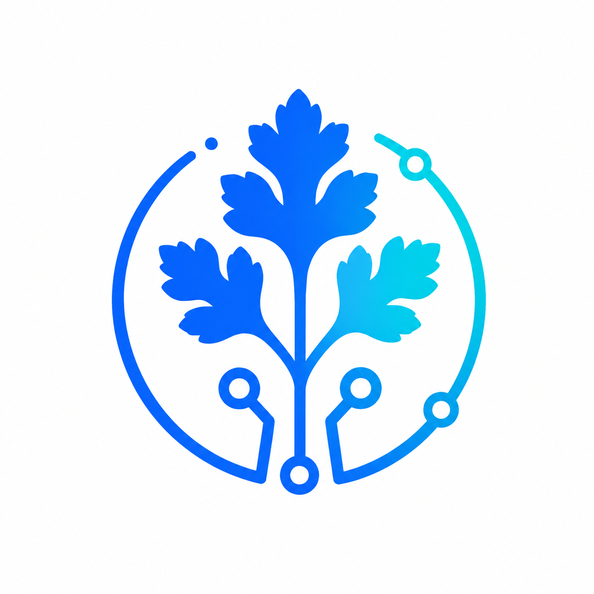

<div align="center">



# AI 产品经理成长路线

_从 0 到 1 学 AI 产品经理：课程、项目、模板、术语、作品集，一套可以持续学习和共建的开源公益学习平台。_


**给想转向 AI 产品经理的人，一条真正能读、能练、能做项目、能沉淀作品集的学习路径。**

**维护者：Coriander · 在线站点：[aipro.agentskill.asia](http://aipro.agentskill.asia/)**

```bash
git clone https://github.com/AliceDel66/ai-pm-roadmap.git
cd ai-pm-roadmap
npm install
npm run dev
```

[开始学习](50-AI与数字化/50-6%20AI%20产品经理成长路线/ai-pm-roadmap-main/content/README.md) · [贡献指南](CONTRIBUTING.md) · [内容规范](content-style-guide.md)

</div>

---

## 这个项目是什么

**AI 产品经理成长路线 / AI 产品经理学习平台** 是一个开源公益课程站点。它不是单页路线图，也不是零散资料收藏夹，而是一套围绕 AI 产品经理能力模型设计的系统学习内容。

当前仓库由 **Coriander** 维护，线上品牌站点为 **AgentSkill.asia**。在保留原有课程体系的基础上，项目会同步迭代站点品牌、视觉资源与公开说明文档，便于内容站点和代码仓库保持一致。

学习者可以在这个项目里完成：

- 系统理解 AI 产品经理的岗位职责、能力模型和职业路径。
- 学习产品经理基础能力，包括用户调研、需求分析、竞品分析、PRD、原型和项目推进。
- 掌握 LLM、Prompt、Token、Embedding、向量数据库、RAG、Agent、评估等 AI 产品基础知识。
- 拆解 AI 聊天助手、知识库问答、图片生成、智能客服、Agent 工作流等典型产品形态。
- 完成 6 个实战项目教程，并整理成可展示的 AI 产品经理作品集。
- 使用模板库输出 PRD、竞品分析、Prompt 设计、RAG 方案、Agent 方案、复盘文档等材料。

---

## 维护者信息

- 英文名：**Coriander**
- 技术站点：**https://www.agentskill.asia/**
- 关注方向：AI 应用开发、前端工程、Electron 桌面端、RAG 知识库、Agent 工作流与自动化工具
- GitHub：**https://github.com/AliceDel66**

---

## 适合谁

| 人群         | 你会获得什么                                         |
| ------------ | ---------------------------------------------------- |
| 传统产品经理 | 补齐 AI 基础、技术协作、模型能力和 AI 产品设计方法   |
| 产品新人     | 从岗位认知、基础方法到项目作品集，按阶段建立完整能力 |
| 准备面试的人 | 用课程作业、项目教程和模板沉淀面试材料与作品集       |
| 开源贡献者   | 可以按内容规范补充课程案例、模板、术语和项目教程     |

---

## 内容结构

```text
content/
  course/       7 个阶段的系统课程
  projects/     6 个完整实战项目教程
  templates/    15 个可直接复制使用的产品模板
  glossary/     AI 产品经理高频术语库
docs/
  content-style-guide.md
```

课程页面支持 Markdown 渲染、目录跳转、阅读进度和 localStorage 学习进度。模板库、术语库、实战项目和搜索页会自动读取 `content/` 下的 Markdown 内容。

课程自测题支持交互式作答：单选、多选和判断题会在提交后判断对错并展示解析；简答题和案例分析题会在提交后展示参考答案和解析。切换到其他课程或项目页面时，当前自测题选择会自动重置，避免不同页面之间串题。

---

## 教学动画系统

本项目支持在课程 Markdown 中通过 `[animation:动画ID]` 插入交互式 2D 教学动画，用于展示 RAG、Agent、Prompt、API 调用、流式响应、AI 图片生成、智能客服和商业化漏斗等抽象流程。

动画系统基于开源免费依赖 `@xyflow/react` 和 `motion` 实现，动画数据全部在项目本地维护，不依赖外部服务、远程脚本、版权图片或真实品牌素材。社区贡献者可以按照 [docs/animation-system.md](animation-system.md) 新增流程动画、步骤动画或概念对比动画。

---

## 课程路线

| 阶段 | 主题                 | 你会产出什么                                                   |
| ---- | -------------------- | -------------------------------------------------------------- |
| 01   | 认识 AI 产品经理     | 岗位理解、能力模型、AI 产品分析报告                            |
| 02   | 产品经理基础能力     | 用户研究、需求分析、竞品分析、PRD 和原型说明                   |
| 03   | AI 基础知识          | LLM、Prompt、Token、Embedding、RAG、Agent 和评估知识图谱       |
| 04   | AI 产品设计方法      | 聊天助手、写作产品、图片生成、知识库、Agent 工作流方案         |
| 05   | 技术协作与落地       | API 对接、流式响应、数据结构、RAG Pipeline、日志和成本协作文档 |
| 06   | 实战项目训练         | 6 类 AI 产品完整项目教程与作品集材料                           |
| 07   | 高阶 AI 产品经理能力 | 商业化、增长、指标、成本优化、风险合规和面试表达               |

---

## 实战项目

| 项目                      | 训练重点                                    |
| ------------------------- | ------------------------------------------- |
| AI 聊天助手产品设计       | 对话体验、Prompt 策略、上下文管理、异常兜底 |
| 企业知识库问答系统        | RAG 检索、知识库结构、权限边界、答案引用    |
| AI 图片生成平台           | 生图流程、风格参数、任务队列、成本控制      |
| AI 智能客服系统           | 意图识别、人工转接、质检评估、服务指标      |
| AI Agent 自动化工作流平台 | 工具调用、流程编排、状态追踪、失败恢复      |
| AI 产品官网与商业化落地   | 定价、转化路径、指标看板、上线验收          |

每个项目教程都包含背景、用户、痛点、MVP、功能清单、页面结构、用户流程、AI 能力点、技术协作、数据指标、PRD 大纲、原型说明、Prompt 设计、风险边界和作品集产出。

---

## 能做什么

| 能力         | 对应内容       | 典型交付物                                   |
| ------------ | -------------- | -------------------------------------------- |
| 产品分析     | 阶段 1、模板库 | AI 产品分析报告、岗位能力拆解                |
| 需求与方案   | 阶段 2、阶段 4 | PRD、用户流程、原型说明、AI 产品方案         |
| AI 基础理解  | 阶段 3、术语库 | AI 概念图谱、Prompt 方案、RAG/Agent 基础说明 |
| 技术协作     | 阶段 5         | API 对接说明、数据结构、日志监控、成本估算   |
| 项目实战     | 阶段 6、项目库 | 可展示的 AI 产品项目作品集                   |
| 商业化与面试 | 阶段 7、模板库 | 增长指标、商业化方案、项目复盘、面试表达材料 |

---

## 本地运行

```bash
npm install
npm run dev
```

构建生产版本：

```bash
npm run build
```

预览构建结果：

```bash
npm run preview
```

---

## 如何贡献

1. 阅读 [CONTRIBUTING.md](CONTRIBUTING.md)。
2. 参考 [docs/content-style-guide.md](content-style-guide.md)。
3. 在 `content/` 下新增或修改 Markdown。
4. 确保 frontmatter 与加载器兼容。
5. 提交前运行 `npm run build`。

优先欢迎贡献：课程案例补充、项目教程迭代、模板示例完善、术语补充、错别字修复、可读性优化和适合新手的图示设计。

---

## 图片占位规则

课程和项目教程会预留图片位置，但仓库不要求提交生成图片。请使用统一文本格式：

```md
> 图片占位
> 建议文件名：example.png
> 图片用途：说明这张图用于帮助学习者理解什么。
> 生图提示词：中文提示词，16:9，清爽科技教育风格，蓝紫渐变，无水印，无真实品牌 Logo。
```

---

## 许可·使用授权

本项目目前采用 **Personal Use Only / 个人学习与非商业使用授权**。在没有获得项目维护者明确书面授权前，请按以下规则使用。

### 允许的使用

- 个人学习、研究、阅读、练习和作品集准备。
- Fork、Star、提 Issue、提交 Pull Request 参与共建。
- 在非商业分享、学习笔记、公益社群学习中引用少量内容，但需要注明来源和仓库链接。
- 基于本项目内容进行个人改写、整理和练习，但不得去除原始来源声明后再次公开发布为自己的原创课程。

### 需要提前获得授权的使用

- 用于公司内训、商业课程、训练营、付费社群、咨询交付、客户项目或招聘培训。
- 将课程、模板、项目教程、术语库整体或大规模复制到其他网站、App、小程序、知识库、网盘资料包或商业产品中。
- 将本项目内容改名、换皮、包装后出售、引流、投放广告或作为付费资料分发。
- 将本项目作为商业 SaaS、教育平台、企业知识库或 AI 产品的一部分对外提供服务。

### 禁止的使用

- 删除来源、隐藏出处、冒充原创作者或误导他人认为内容由你独立创作。
- 批量搬运、镜像发布、闭源售卖或用于违反法律法规的场景。
- 使用本项目内容训练、微调或构建对外商业化模型、数据集、知识库，除非已获得明确授权。

### 版权与责任

- 本项目中的课程、模板、术语、案例文字均要求原创；可以分析公开产品体验，但必须用自己的语言总结，不复制第三方文章、课程、书籍、官网文案或商业文档。
- 项目依赖的第三方开源库遵循其各自许可证。
- 本项目按现状提供，不承诺内容完全准确、适用于所有业务场景，也不承担因使用本项目产生的直接或间接损失。

如需商业使用、企业内训、课程合作或授权转载，请通过 GitHub Issue 联系项目维护者。

---

<div align="center">

**如果这个项目帮你建立了 AI 产品经理学习路径，欢迎 Star、提 Issue 或参与共建。**

</div>
