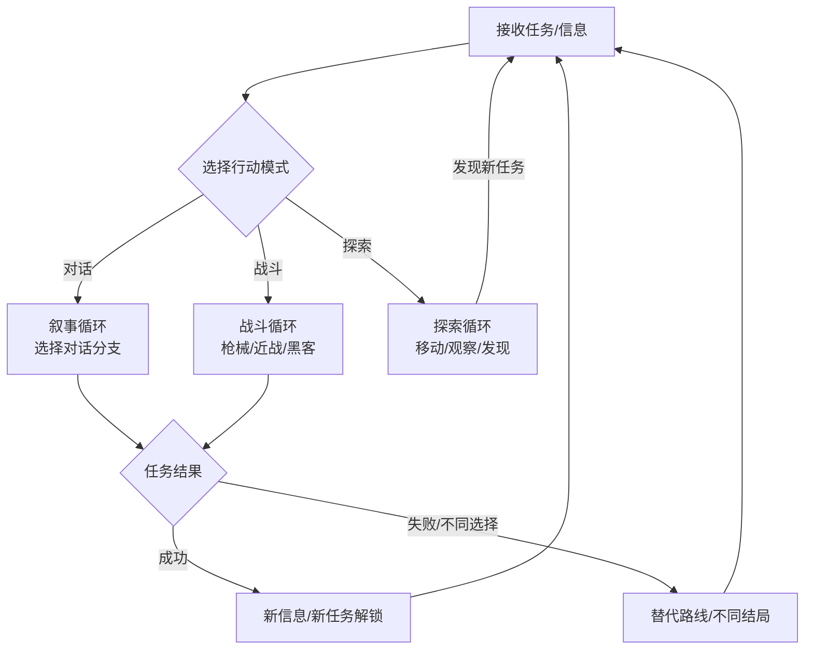
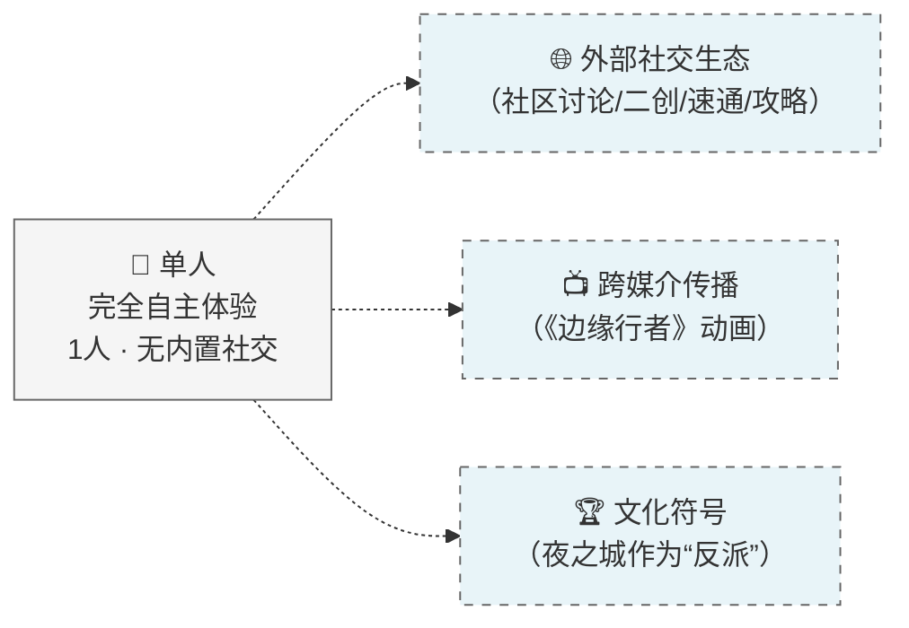
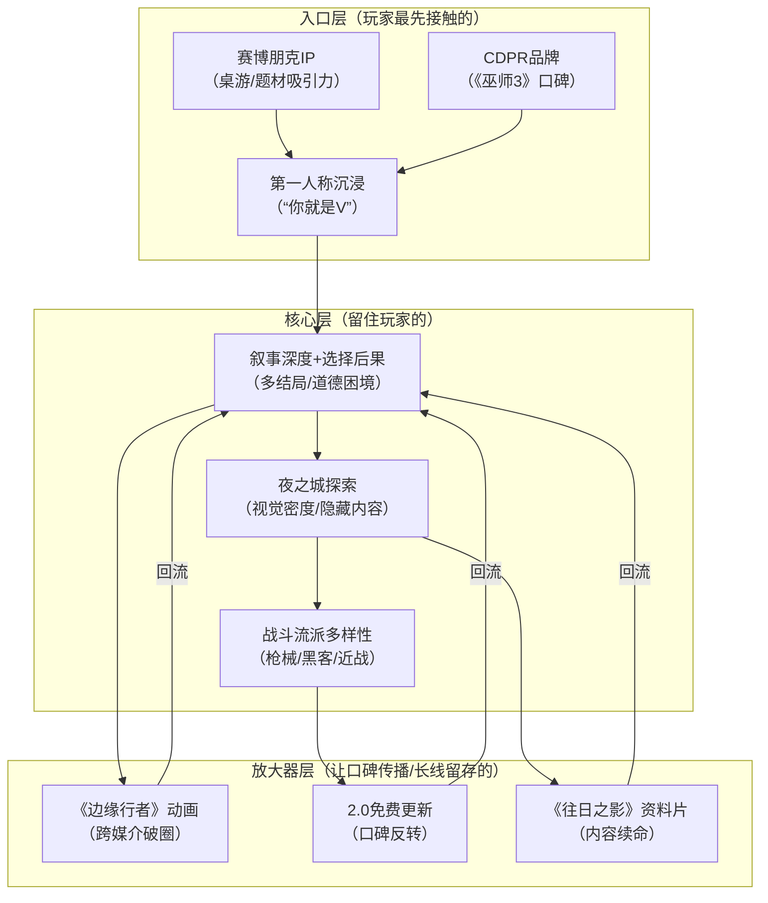

# 赛博朋克2077：叙事深度、开放世界与玩家选择的系统耦合

## 一、基本信息

| 项目 | 内容 |
|:-----|:-----|
| **游戏名称** | 赛博朋克2077（Cyberpunk 2077） |
| **开发商/发行商** | CD Projekt Red |
| **上线日期** | 2020-12-10 |
| **平台** | PC / PS5 / Xbox Series X\|S / PS4 / Xbox One |
| **底层驱动（主导）** | 内容叙事型 |
| **底层驱动（次要）** | 操作心流型 |
| **商业化模式** | 买断制（标准版298元）+ 付费资料片《往日之影》 |
| **拆解版本** | 2.13 + 往日之影 |
| **拆解日期** | 2026-08-25 |

## 二、拆解侧重点说明

> 根据[[90-2-1-2 底层驱动分类图谱]]和[[90-2-1-3 拆解维度标准SOP]]的权重分配，本篇报告的分析重心如下：

| 维度 | 权重 | 说明 |
|:-----|:----:|:-----|
| 第1层：核心循环（分钟级） | ★★★ | 战斗/对话/探索三种循环的交替是叙事的载体，但非驱动核心；重点分析“选择→后果”的叙事循环 |
| 第2层：成长循环（天/周级） | ★★★ | 技能树/义体/装备的成长路径，以及2.0版本重做后的设计逻辑 |
| 第3层：商业化设计 | ★★ | 买断制+资料片模式，重点分析《往日之影》的定价策略与本体修复后的商业反转 |
| 第4层：社交结构 | ★ | 纯单机游戏，无内置社交，但“夜之城”作为文化符号创造了强大的外部社区生态 |
| 第5层：长线留存机制 | ★★★★ | 多结局驱动重玩、资料片内容扩展、以及“口碑反转”带来的长尾效应 |
| 第6层：美术/UI/信息传达 | ★★★★★ | 第一人称沉浸、霓虹美学UI、去HUD化设计——这是内容叙事型游戏UI的标杆案例 |

> **系统视角声明**：本报告采用系统视角，不将游戏的成功或失败归因于单一因素，而是试图描述各要素之间的协同、耦合与相互强化关系。各章节的分析结论将在“第十一章 系统因果分析”中整合为完整的因果网络图。

## 三、第1层：核心循环（分钟级）

> **定义**：玩家在游戏中最基本的“操作-反馈-决策”单元。参考[[90-2-1-3 拆解维度标准SOP#1.3 第1层：核心循环]]。

### 3.1 最小循环描述

《赛博朋克2077》的核心循环是“三轨并行”结构——玩家的每一分钟可能在三种模式中切换：

**叙事循环**：
接收任务信息 → 前往任务地点 → 与NPC对话（选择分支）→ 执行任务（战斗/潜行/黑客）→ 任务结果反馈 → 新信息/新任务解锁

**战斗循环**（以枪战为例）：

观察敌人位置/类型 → 选择武器/义体能力 → 瞄准/射击 → 命中判定 → 伤害数字/受击反馈 → 敌人反应（反击/掩体/死亡）→ 下一个目标

**探索循环**：

观察环境（视觉锚点）→ 决定前往方向 → 移动（步行/载具）→ 发现新地点/NPC/事件 → 评估是否介入 → 探索或绕行

三种循环的切换是即时的——玩家可以在对话中拔出枪（改变叙事走向），可以在战斗中黑入摄像头（从战斗切换为潜行），可以在开车时接到新任务电话（探索被叙事打断）。CDPR将此设计称为“电影式叙事”——“谈话的结果很大程度上取决于玩家的选择，如果拔出了枪，那谈话也就朝着一个完全不同的方向进行”[reference:0]。

### 3.2 循环结构图

### 3.3 关键参数

|参数|数值|说明|
|---|---|---|
|单次战斗遭遇时长|30秒-5分钟|取决于敌人数量和玩家流派|
|单次对话决策窗口|无限（玩家可停留思考）|对话无时间限制，但选择不可逆|
|操作到反馈的延迟|约50ms（PC）/ 因平台而异|2.0版本后优化明显|
|循环中的决策点数量|2-6个|对话分支通常3-4个选项；战斗中有流派选择空间|
|随机元素占比|低|伤害有浮动但非核心，主要随机来自敌人AI行为选择|

### 3.4 爽感来源分析

《赛博朋克2077》的爽感来源有三层，对应三种核心循环：

**叙事层面**：“选择有意义”——玩家在对话中的每个选择都会产生可感知的后果，这种“我影响了故事”的掌控感是内容叙事型游戏最核心的多巴胺触发器。任务失败不会导致重启关卡，只有死亡才会重启——每一项任务都会对故事产生连锁反应。

**战斗层面**：“流派多样性”——玩家可以走纯枪械路线、黑客路线、近战路线或潜行路线，不同流派的战斗体验差异巨大。一种玩法玩腻了可以换另一种，相当于在同一款游戏里体验几种不同的游戏。

**探索层面**：“发现感”——夜之城的视觉密度和信息层次极高，每条不起眼的小巷里都可能藏着一个隐藏任务入口或彩蛋。

### 3.5 潜在疲劳点

1. **叙事节奏的“断裂”**：《往日之影》中偶尔会有强制性的剧情等待——比如“等上一天里德才给V打电话”——这会打断紧凑的叙事节奏。
    
2. **战斗与叙事的“割裂感”**：部分玩家反馈，在沉浸式叙事中突然切入高强度战斗，会产生“叙事-玩法”的 dissonance（不协调感）。
    
3. **开放世界的“填充物疲劳”**：虽然支线任务质量极高，但部分“委托”类任务仍带有“去某地杀某人”的模板感。
    

### 3.6 ← → 与其他层的交互

|关联层|交互关系|
|---|---|
|第2层（成长循环）|核心循环中的战斗表现受技能树和义体配置影响——你点的技能决定了你能用什么方式完成任务（枪战/黑客/潜行），这反过来影响叙事选择的空间|
|第3层（商业化）|买断制意味着核心循环不受付费干扰——所有玩家体验到的战斗手感/叙事选择是同一套标准|
|第4层（社交结构）|无内置社交，但核心循环中的“选择后果”是社区讨论的核心素材——“你选了哪个结局？”“你怎么处理这个NPC？”成为外部社区的核心话题|
|第5层（长线留存）|多结局设计让核心循环中的“选择”具有重玩价值——玩家会为了看不同结局而重新体验核心循环|
|第6层（UI/信息）|第一人称视角和去HUD化设计让核心循环中的“沉浸感”最大化——玩家看到的就是V看到的|

## 四、第2层：成长循环（天/周级）

> **定义**：玩家在每日/每周时间尺度上的行为模式。参考[[90-2-1-3 拆解维度标准SOP#1.4 第2层：成长循环]]。

### 4.1 每日必做（Daily）

> 《赛博朋克2077》为纯单机RPG，无“每日必做”概念，以“任务进度”驱动。以下为玩家自然行为模式：

|行为|耗时|奖励|驱动力类型|
|---|---|---|---|
|推进主线任务|1-3小时|剧情推进 + 经验值|内容+数值|
|完成支线任务|30分钟-2小时/个|经验+装备+金钱+故事|内容+数值|
|探索新区域|不定|新任务/收集品/装备|内容|
|升级技能/安装义体|10-30分钟|战斗能力提升|数值|

### 4.2 每周目标（Weekly）

> 无“每周重置”概念，以“阶段性目标”为单位。

|目标|重置周期|奖励|是否强制|
|---|---|---|---|
|完成当前章节主线|一次性|剧情推进|是|
|完成某角色支线线|一次性|角色故事 + 特殊奖励|否|
|达到某属性等级|一次性|解锁新技能|否|

### 4.3 资源循环图

text

[完成任务/击败敌人] → [经验值] → [等级提升] → [属性点+专长点] → [解锁新技能/强化]
                                    ↓
[搜刮/任务奖励] → [金钱/材料] → [购买/升级装备] → [战斗能力提升]
                                    ↓
[完成任务/商店购买] → [义体] → [安装义体] → [新能力/新玩法]

文字说明：  
《赛博朋克2077》的成长系统是“三轨并行”——等级（属性+专长）、装备（武器+服装）、义体（身体改造）三条线同时推进。2.0版本重做了技能树和专长系统，所有旧档的属性点和专长技能点都会重置。重做后的技能树提供了更多的选择和深度，义体和义体容量系统也得到了改进。新的Relic技能树在《往日之影》中引入。

### 4.4 断档期识别

- 主线推进过快导致支线未完成 → 主线结束后部分支线不可逆关闭 → 玩家需要二周目补全
    
- 等级不足无法挑战高难度任务 → 需要通过支线/探索刷经验
    

### 4.5 长线目标

|时间维度|核心目标|进度可视化方式|
|---|---|---|
|20-40小时|通关主线|主线任务列表进度|
|40-80小时|全支线/全委托完成|任务日志 + 地图图标|
|80+小时|多结局达成 / 全收集|成就列表|

### 4.6 ← → 与其他层的交互

|关联层|交互关系|
|---|---|
|第1层（核心循环）|成长系统的价值在于“解锁新的核心循环方式”——点了黑客技能，你就可以用“黑入摄像头”的方式完成原本需要枪战的关卡|
|第3层（商业化）|买断制下成长系统不存在“付费加速”，保证了所有玩家体验到的成长曲线一致|
|第4层（社交结构）|无社交，但“我的V是什么流派”成为社区讨论的核心话题之一|
|第5层（长线留存）|多结局需要不同属性/技能配置才能解锁——玩家需要规划不同的成长路径来体验不同结局|

## 五、第3层：商业化设计

> **定义**：游戏如何将玩家体验转化为收入。参考[[90-2-1-3 拆解维度标准SOP#1.5 第3层：商业化设计]]。

### 5.1 付费入口总览

|付费类型|付费形式|对应心理账户|价格区间|
|---|---|---|---|
|游戏本体|一次性买断|“购买一款3A大作”|298元（标准版）|
|资料片《往日之影》|一次性买断|“续写V的故事”|149元|
|终极版|一次性买断|“全套体验”|约448元|

### 5.2 核心付费路径

《赛博朋克2077》的商业化路径经历了三个阶段：

**阶段一（2020-2022）：口碑崩塌期**。首发因大量BUG和优化问题被全网批评。PS4版帧数经常掉到10帧出头，IGN给主机版4分。2020年12月18日，索尼宣布将游戏从PS商店下架，为所有玩家全额退款——这是PlayStation历史上第一次。CDPR股价一周暴跌60%，市值蒸发超过70亿美元。

**阶段二（2022-2023）：口碑修复期**。2022年9月，Netflix动画《赛博朋克：边缘行者》上线，烂番茄新鲜度100%，豆瓣9.2。动画播出后，游戏Steam在线人数冲到13.6万。2023年9月，CDPR推出2.0版本免费更新——技能树全部重做、义体系统加容量限制、警察系统重写、加入载具战斗。

**阶段三（2023至今）：商业反转期**。2023年9月《往日之影》发售。截至2025年5月，资料片销量突破1000万份。本体累计销量突破3500万份。2025年全年营收8.67亿兹罗提（约16亿人民币），净利润5.94亿兹罗提（约11亿人民币），净利润率60.1%。

### 5.3 付费深度分析

|维度|数据|说明|
|---|---|---|
|零氪vs满氪战力差距|无差距|买断制下所有玩家体验一致|
|本体+资料片完整花费|约447元|本体298+资料片149|
|是否有付费上限|是|本体+资料片一次性付费|

### 5.4 付费与体验的关系

《赛博朋克2077》的商业化最值得分析的点不是“怎么赚钱”，而是 **“如何用免费更新挽回付费信任”** 。

2.0版本更新对所有玩家免费——不收费。这种策略的核心逻辑是：**先修复产品，再卖扩展内容**。CDPR没有在2.0版本上收费，而是将其作为“修复信任”的投资，然后用《往日之影》的高质量内容驱动新的付费。《往日之影》在Steam获得90%好评，证明了“先修复再卖货”策略的有效性。

### 5.5 诱导性设计识别

|设计手法|是否存在|具体表现|
|---|---|---|
|首充双倍/限时优惠|❌|买断制，无内购|
|概率展示（保底/随机）|❌|无抽卡|
|限时卡池/限定皮肤|❌|无内购|
|沉没成本诱导|❌|买断制不产生持续付费压力|
|社交展示（付费身份的可见性）|❌|无内购展示|

### 5.6 ← → 与其他层的交互

|关联层|交互关系|
|---|---|
|第1层（核心循环）|2.0版本重做技能树和警察系统后，核心循环体验发生了质变——从“半成品”变成了“承诺中的游戏”|
|第2层（成长循环）|2.0版本重置了所有玩家的技能点，重新设计了成长路径，相当于“重新开始玩”|
|第4层（社交结构）|《边缘行者》动画的“破圈”效应证明了外部内容（动画）可以反向驱动游戏销售——这是一种“跨媒介社交传播”|
|第5层（长线留存）|免费2.0更新 + 付费《往日之影》的组合拳，让一款发售3年的游戏重新成为话题|

## 六、第4层：社交结构

> **定义**：游戏如何组织和定义玩家之间的关系。参考[[90-2-1-3 拆解维度标准SOP#1.6 第4层：社交结构]]。

### 6.1 社交层级图

《赛博朋克2077》为纯单机游戏，无内置社交系统。但其“社交结构”体现在**游戏外部**——夜之城作为一个文化符号，在玩家社群中形成了独特的社交生态。

### 6.2 社交驱动力分析

|社交形式|是否强制|核心驱动力|回报类型|
|---|---|---|---|
|好友/关注|❌ 不存在|—|—|
|组队/联机|❌ 不存在|—|—|
|公会/帮派|❌ 不存在|—|—|
|阵营/势力|❌ 不存在|—|—|

### 6.3 社交身份的可见性

不适用（无社交系统）。

### 6.4 负面社交处理

不适用（无社交系统）。

### 6.5 ← → 与其他层的交互

|关联层|交互关系|
|---|---|
|第1层（核心循环）|无社交系统意味着核心循环的体验完全“内向”——玩家面对的是夜之城和V自己，没有任何“被别人看到”的压力|
|第2层（成长循环）|成长路径无需依赖他人，成就感纯粹来自“自我探索”而非“比较”|
|第3层（商业化）|《边缘行者》动画的“破圈”证明：外部社交传播可以反向驱动游戏销售——这是一种“去中心化”的社交裂变|
|第5层（长线留存）|CDPR官方确认，“真正的终极反派，并非任何角色，而是夜之城本身”——夜之城作为文化符号，是玩家“留在游戏中”的情感锚点|

## 七、第5层：长线留存机制

> **定义**：游戏如何让玩家在“通关之后”仍然愿意回到游戏中。参考[[90-2-1-3 拆解维度标准SOP#1.7 第5层：长线留存机制]]。

### 7.1 内容更新节奏

|更新类型|频率|内容量|预告周期|
|---|---|---|---|
|大型免费更新（2.0）|一次性（2023年9月）|技能树重做+警察系统+载具战斗|约1个月|
|资料片《往日之影》|一次性（2023年9月）|新区域+新主线+新结局|约3个月|
|小型补丁|不定期|BUG修复+平衡调整|即时|

### 7.2 第30天 vs 第180天的留存驱动力

|时间节点|核心驱动力|玩家状态|
|---|---|---|
|第30天（通关后）|多结局探索 + 支线补完|仍有未完成的内容目标|
|第180天|二周目不同流派体验 / DLC回归|进入“为爱发电”或等待资料片阶段|

### 7.3 回归机制

|机制|描述|效果评估|
|---|---|---|
|多结局（5种以上）|每个结局需要不同选择/路径|高——驱动1-2次重玩|
|2.0免费更新|核心系统重做|极高——口碑反转的核心驱动力|
|《往日之影》资料片|新区域+新故事+新结局|极高——销量破千万|
|《边缘行者》动画|Netflix动画引爆关注|极高——Steam在线冲到13.6万|

### 7.4 退出成本分析

《赛博朋克2077》的退出成本几乎为零——单机买断制，无社交契约、无持续付费。玩家留存的唯一原因是“还想继续体验夜之城”。

**但有一种特殊的“退出成本”** ：情感投入。V的故事、与强尼·银手的关系、与朱迪/帕南等人的羁绊——这些情感连接让玩家在通关后仍然“舍不得离开”夜之城。

### 7.5 终局内容

- 多结局达成（至少5种主要结局，每种流程差异巨大）
- 全支线/全委托完成
- 全成就解锁
- 不同流派体验（枪械/黑客/近战/潜行）
- 《往日之影》新增结局——“一个令人撕心裂肺的全新结局”

### 7.6 ← → 与其他层的交互

|关联层|交互关系|
|---|---|
|第1层（核心循环）|多结局设计让核心循环中的“选择”具有重玩价值——玩家会在二周目刻意做出不同选择|
|第2层（成长循环）|不同结局需要不同属性/技能配置，驱动玩家规划不同的成长路径|
|第3层（商业化）|《往日之影》资料片为长线留存提供了“内容续命”——新区域+新结局让老玩家有理由回来|
|第4层（社交结构）|“夜之城是真正的反派”——城市本身作为文化符号，是玩家“留在游戏中”的情感锚点|

## 八、第6层：美术/UI/信息传达

> **定义**：视觉和界面设计如何服务于“让玩家看懂、融入、不疲倦”。参考[[90-2-1-3 拆解维度标准SOP#1.8 第6层：美术/UI/信息传达]]。

### 8.1 审美调性分析

|维度|描述|是否服务于核心体验|
|---|---|---|
|整体美术风格|赛博朋克霓虹美学，高对比度，互补色为主|是——视觉风格本身就是叙事的一部分|
|色彩倾向|霓虹灯色彩（粉/蓝/紫/黄），互为互补色|是——营造超现实的迷幻氛围|
|角色设计语言|高度风格化，突出“义体改造”的视觉特征|是——身体改造是赛博朋克核心主题|
|场景/环境风格|夜之城六大区域各有不同建筑风格|是——区域视觉编码辅助“身在何处”的认知|
|UI视觉风格|霓虹色彩+荧光字体+剧情UI（diegetic UI）|是——风格化与沉浸感并重|

### 8.2 UI效率分析

|常用操作|操作步骤数|是否合理|
|---|---|---|
|打开地图|1步（M键/触摸板）|是|
|切换武器|1-2步（滚轮/数字键）|是|
|使用道具|1步（快捷键）|是|
|查看任务|1步（J键）|是|
|扫描环境|1步（Tab键）|是|

### 8.3 信息传达效率分析

|信息类型|传达方式|响应速度|是否清晰|
|---|---|---|---|
|血量/状态|HUD左上角 + 屏幕边缘特效|即时|是|
|敌人位置|小地图红点 + 扫描标记|即时|是|
|任务/目标提示|地图标记 + 屏幕导航点|即时|是|
|战斗反馈|伤害数字+音效+受击动画|即时|是|
|对话选择|屏幕中央对话轮|即时|是|

### 8.4 优秀设计与可改进点

**优秀设计（≥3处）**：

1. **去HUD化的沉浸设计**：CDPR希望把显示信息的HUD转化成为游戏玩法的一部分。血量、弹药等关键信息在非战斗状态下自动淡出，让玩家的视野在探索时保持“干净”。
2. **剧情UI（Diegetic UI）**：部分UI元素存在于游戏3D空间中，玩家和游戏角色都能意识到UI的存在。比如V眼中的扫描界面、义体状态显示——UI本身就是叙事的一部分。
3. **霓虹色彩的美学自洽**：UI颜色采用了典型的赛博朋克霓虹灯色彩，与题材设定达到了完美的自洽。互补色设计营造出独特的视觉效果和超现实的迷幻氛围。
4. **第一人称的强制沉浸**：全程第一人称视角让玩家“成为”V，而非“控制”V——这是内容叙事型游戏最极致的沉浸设计。

**可改进点（≥3处）**：

1. **风格化与易用性的冲突**：霓虹色彩+荧光字体虽然视觉上惊艳，但“色彩颤动”效果导致文字阅读体验不佳——红色文字盯久了会模糊不清。这是UI设计中风格化和易用性的经典冲突。
2. **信息过载问题**：游戏初期，地图上的任务标记、商店标记、问号点同时涌来，新玩家的认知负担极高。
3. **小地图的“跟车”体验不佳**：驾驶时小地图缩放比例不合适，高速行驶时经常错过转弯路口——这一问题在后续更新中有所改善。

### 8.5 ← → 与其他层的交互

|关联层|交互关系|
|---|---|
|第1层（核心循环）|第一人称视角+去HUD化设计让核心循环中的“沉浸感”最大化——你看到的就是V看到的，没有“游戏界面”在中间阻隔|
|第2层（成长循环）|义体系统的UI设计（身体改造界面）本身就是叙事的一部分——你在“改造自己”的过程中，视觉上看到的是V的身体被替换|
|第3层（商业化）|无内购意味着UI中不需要嵌入商店入口——界面设计的目标是“沉浸”而非“转化”|
|第4层（社交结构）|无社交系统意味着UI中不需要社交入口——所有界面空间都服务于单人体验|

## 九、弃坑拐点分析

|阶段|典型流失原因|机制层面是否存在预防设计|
|---|---|---|
|新手期（首发前3小时）|大量BUG、优化差、画面崩坏|2.0版本后已大幅修复，但首发时的口碑伤害不可逆|
|成长期（中期）|主线推进太快导致支线关闭|任务日志会提示“该任务将在某节点后不可用”|
|成熟期（后期）|主线通关后内容枯竭|多结局+支线补完+资料片提供延展|
|长线期（通关后）|“我全都看过了”|不同流派体验+不同结局选择驱动二周目|

## 十、横向穿刺锚点

|锚点|本游戏数据|关联专题|
|---|---|---|
|核心循环时长|5-30秒（战斗遭遇/对话决策）||
|每日必做耗时|无“每日”概念||
|首充金额/回报率|买断制，无首充||
|本体+资料片完整花费|约447元||
|零氪与满氪战力差距|无差距||
|公会人数上限|不适用|[[90-2-1-21 专题_社交结构金字塔]]|
|大版本更新周期|一次性（2.0）|[[90-2-1-22 专题_赛季制与版本更新节奏研究]]|
|回归奖励规模|2.0免费更新||
|通关后留存驱动力|多结局/二周目/资料片|[[90-2-1-20 专题_DAU曲线与弃坑拐点分析]]|

## 十一、系统因果分析

> **本章为必填项，是本报告的核心章节。** 本章将前10章的各层分析整合为一张“系统因果网络图”，标识各要素之间的协同、耦合与相互强化关系。

### 11.1 因果网络图

**图例说明**：

- **入口层**：玩家通过什么进入游戏/被吸引
- **核心层**：玩家为什么持续玩下去
- **放大器层**：玩家为什么带朋友来、为什么回流
- **实线箭头**：直接因果/支撑关系
- **虚线箭头**：反馈强化关系

### 11.2 入口/核心/放大器分层说明

|层级|包含要素|作用|
|---|---|---|
|**入口层**|赛博朋克IP、CDPR品牌、第一人称沉浸|降低用户获取成本，制造第一印象|
|**核心层**|叙事深度+选择后果、夜之城探索、战斗流派多样性|创造持续游玩的动机，形成情感投入|
|**放大器层**|《边缘行者》动画、2.0免费更新、《往日之影》资料片|驱动口碑传播、社交裂变、长线回流|

### 11.3 必要非充分说明

> **必填项**。明确声明单一因素不足以解释游戏的成功或失败。

**声明**：本报告认为，《赛博朋克2077》的“口碑反转+商业成功”是以下多因素共同作用的结果：赛博朋克题材的文化号召力、CDPR的品牌信任（尽管首发受损）、第一人称视角的沉浸设计、多结局叙事的重玩价值、夜之城作为“角色”的世界观塑造、战斗流派的多样性、以及——最关键的三重外部助推——《边缘行者》动画的破圈传播、2.0免费更新的诚意修复、《往日之影》资料片的高质量内容扩展。

其中：

- **叙事深度+多结局**是“留住玩家”的**必要非充分条件**——没有“选择有意义”的叙事设计，赛博朋克2077只是一款开放世界射击游戏；但仅有叙事深度，没有夜之城的探索价值和战斗系统的多样性，玩家也会在“看完故事”后离开；
- **《边缘行者》动画**是“破圈”的**强化因子**——它让一款发售近两年的单机游戏重新成为全球话题，证明了跨媒介内容对游戏销售的驱动能力；
- **2.0免费更新**是“信任修复”的**稳定器**——CDPR没有在新版本上收费，而是将其作为“修复承诺”的投资，为《往日之影》的商业成功铺平了道路；
- **《往日之影》资料片**是“长尾变现”的**放大器**——本体修复口碑后，用高质量付费内容将信任转化为收入。

**单一归因警告**：任何将《赛博朋克2077》的成功归结为单一因素的解释，在本报告的框架下均被视为不完整的分析。

### 11.4 系统脆弱性识别

|脆弱环节|后果|现实案例/假设场景|
|---|---|---|
|首发质量崩塌|品牌信任归零、销量腰斩|2020年12月PS商店下架事件|
|叙事“选择”的 illusion（幻觉）|玩家感知“无论怎么选结果都一样”|部分玩家反馈结局选择“殊途同归”的争议|
|无社交系统的“孤岛效应”|缺乏社交退出成本，玩家通关即走|单机买断制的天然局限|

### 11.5 正向循环 vs 恶性循环

**恶性循环（首发期——2020-2022）**：

> 首发BUG多/优化差 → 口碑崩塌 → 玩家退款/差评 → 索尼下架 → 股价暴跌 → 品牌信任归零 → 销量停滞

**正向循环（修复期——2022至今）**：

> 《边缘行者》动画破圈 → 玩家回流体验游戏 → 口碑开始回暖 → 2.0免费更新修复核心系统 → 玩家认可“诚意” → 《往日之影》高质量资料片发售 → 销量破千万 → 本体累计3500万 → 品牌信任重建

## 十二、总结

### 12.1 一句话评价

《赛博朋克2077》是游戏史上最极端的“高开低走→触底反弹”案例——它的成功不是首发时的承诺兑现，而是用三年时间、一次免费大更、一部动画和一部高质量资料片，把“半成品”重新拼成了“杰作”。

### 12.2 核心发现（3-5条）

1. **叙事作为核心驱动力的“双刃剑”**：内容叙事型游戏的最大优势是“情感投入”——玩家会因为V的故事而留下；最大风险是“叙事一旦结束，玩家就离开”。多结局设计是CDPR应对这一风险的核心策略——各结局流程差异巨大，且提供的信息大不相同、互为补充。
    
2. **“夜之城”作为反派的沉浸设计**：CDPR官方确认，“真正的终极反派，并非任何角色，而是夜之城本身”。将“城市”本身设计为叙事核心，是开放世界游戏中最高级的世界观构建——玩家探索的不是“地图”，而是“对手”。
    
3. **“免费修复→付费扩展”的商业反转模型**：2.0版本免费更新重做了核心系统，修复了玩家对CDPR的信任；然后用《往日之影》的高质量内容将信任转化为收入。这是一种“先还债、再赚钱”的商业逻辑，在服务型游戏主导的行业中显得尤为独特。
    
4. **跨媒介传播的“核爆效应”**：《边缘行者》动画播出后，一款发售近两年的单机游戏Steam在线人数冲到13.6万。这证明了“游戏本体作为IP核心+外部内容作为传播引擎”的模型可以产生远超传统营销的裂变效果。

### 12.3 可借鉴的设计点

1. **“去HUD化”的沉浸设计**：将HUD信息转化为游戏内“剧情UI”——让UI本身成为叙事的一部分，而非“游戏和玩家之间的隔阂”。
    
2. **“城市即反派”的世界观构建**：夜之城的设计证明，开放世界不需要“任务密集”才能吸引探索——视觉密度和信息层次本身就是探索的驱动力。
    
3. **“叙事选择≠善恶标签”的道德困境**：《赛博朋克2077》不设善恶标注，每个选择都是“两害相权”——这比“好人/坏人”的二选一更具情感重量和重玩价值。

### 12.4 需警惕的陷阱

1. **首发质量的不可逆伤害**：即使后续修复得再好，首发时的口碑崩塌也会永久性地损失一部分潜在用户。CDPR用三年时间修复了口碑，但不是每家公司都有这个资源和运气。
    
2. **叙事驱动型游戏的“内容枯竭”天花板**：单机买断制的“长线”有天然边界——内容一旦消耗完，玩家就会离开。多结局和资料片只能延缓，无法避免。
    
3. **“选择illusion”的信任风险**：如果玩家感知到“我的选择其实不影响结局”，叙事驱动型游戏的核心承诺就崩塌了。CDPR的叙事总监明确表示“结局是按照我们想要的方式写的——让玩家感到不安，迫使他们思考，而不是直接给出答案”——但这种设计哲学的边界需要精确把控。

## 十三、关联笔记

- [[90-2-1-1 拆解总索引_MOC]]
- [[90-2-1-2 底层驱动分类图谱]]
- [[90-2-1-3 拆解维度标准SOP]]
- [[90-2-1-8 只狼_战斗手感、死亡惩罚与叙事沉浸的系统耦合]]（同为内容叙事型，对比“日式叙事”vs“西式叙事”的差异）
- [[90-2-1-16 原神_战斗系统、内容更新与IP传播的系统协同]]（同为内容叙事型，对比“单机买断”vs“服务型”的内容驱动逻辑）
- [[90-2-1-20 专题_DAU曲线与弃坑拐点分析]]（单机买断制的长尾曲线 vs 服务型游戏）