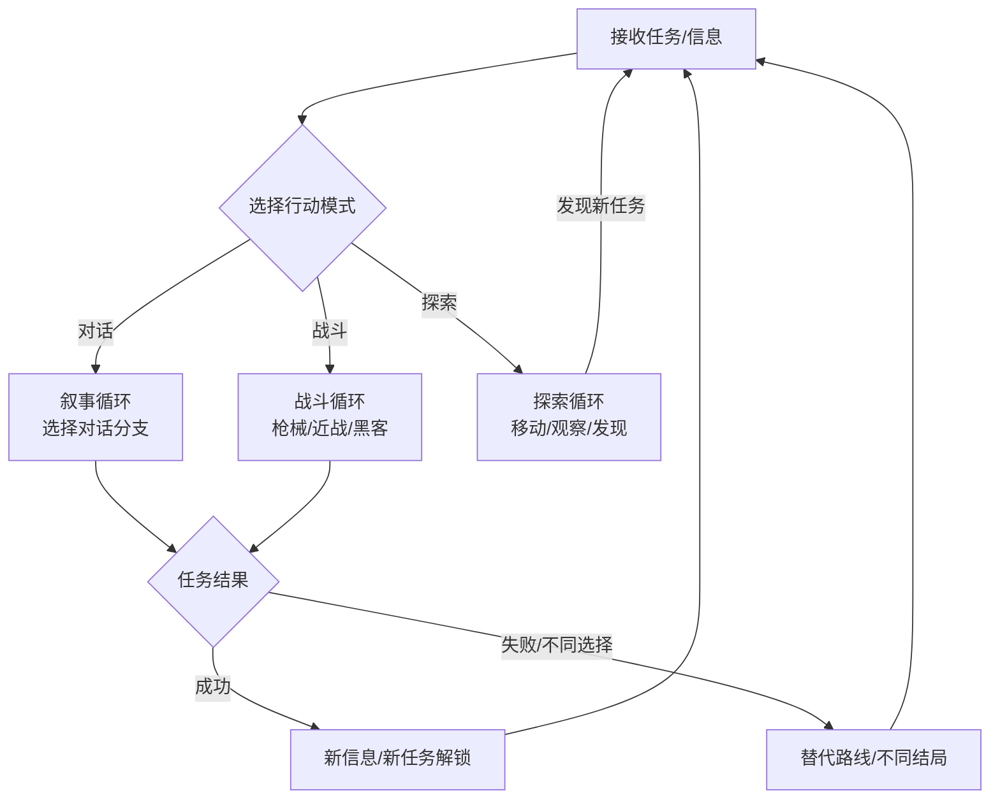

# 赛博朋克2077：叙事深度、开放世界与玩家选择的系统耦合

## 一、基本信息

| 项目 | 内容 |
|:-----|:-----|
| **游戏名称** | 赛博朋克2077（Cyberpunk 2077） |
| **开发商/发行商** | CD Projekt Red |
| **上线日期** | 2020-12-10 |
| **平台** | PC / PS5 / Xbox Series X\|S / PS4 / Xbox One |
| **底层驱动（主导）** | 内容叙事型 |
| **底层驱动（次要）** | 操作心流型 |
| **商业化模式** | 买断制（标准版298元）+ 付费资料片《往日之影》 |
| **拆解版本** | 2.13 + 往日之影 |
| **拆解日期** | 2026-08-25 |

## 二、拆解侧重点说明

> 根据[[90-2-1-2 底层驱动分类图谱]]和[[90-2-1-3 拆解维度标准SOP]]的权重分配，本篇报告的分析重心如下：

| 维度 | 权重 | 说明 |
|:-----|:----:|:-----|
| 第1层：核心循环（分钟级） | ★★★ | 战斗/对话/探索三种循环的交替是叙事的载体，但非驱动核心；重点分析“选择→后果”的叙事循环 |
| 第2层：成长循环（天/周级） | ★★★ | 技能树/义体/装备的成长路径，以及2.0版本重做后的设计逻辑 |
| 第3层：商业化设计 | ★★ | 买断制+资料片模式，重点分析《往日之影》的定价策略与本体修复后的商业反转 |
| 第4层：社交结构 | ★ | 纯单机游戏，无内置社交，但“夜之城”作为文化符号创造了强大的外部社区生态 |
| 第5层：长线留存机制 | ★★★★ | 多结局驱动重玩、资料片内容扩展、以及“口碑反转”带来的长尾效应 |
| 第6层：美术/UI/信息传达 | ★★★★★ | 第一人称沉浸、霓虹美学UI、去HUD化设计——这是内容叙事型游戏UI的标杆案例 |

> **系统视角声明**：本报告采用系统视角，不将游戏的成功或失败归因于单一因素，而是试图描述各要素之间的协同、耦合与相互强化关系。各章节的分析结论将在“第十一章 系统因果分析”中整合为完整的因果网络图。

## 三、第1层：核心循环（分钟级）

> **定义**：玩家在游戏中最基本的“操作-反馈-决策”单元。参考[[90-2-1-3 拆解维度标准SOP#1.3 第1层：核心循环]]。

### 3.1 最小循环描述

《赛博朋克2077》的核心循环是“三轨并行”结构——玩家的每一分钟可能在三种模式中切换：

**叙事循环**：
接收任务信息 → 前往任务地点 → 与NPC对话（选择分支）→ 执行任务（战斗/潜行/黑客）→ 任务结果反馈 → 新信息/新任务解锁

**战斗循环**（以枪战为例）：

观察敌人位置/类型 → 选择武器/义体能力 → 瞄准/射击 → 命中判定 → 伤害数字/受击反馈 → 敌人反应（反击/掩体/死亡）→ 下一个目标

**探索循环**：

观察环境（视觉锚点）→ 决定前往方向 → 移动（步行/载具）→ 发现新地点/NPC/事件 → 评估是否介入 → 探索或绕行

三种循环的切换是即时的——玩家可以在对话中拔出枪（改变叙事走向），可以在战斗中黑入摄像头（从战斗切换为潜行），可以在开车时接到新任务电话（探索被叙事打断）。CDPR将此设计称为“电影式叙事”——“谈话的结果很大程度上取决于玩家的选择，如果拔出了枪，那谈话也就朝着一个完全不同的方向进行”[reference:0]。

### 3.2 循环结构图

