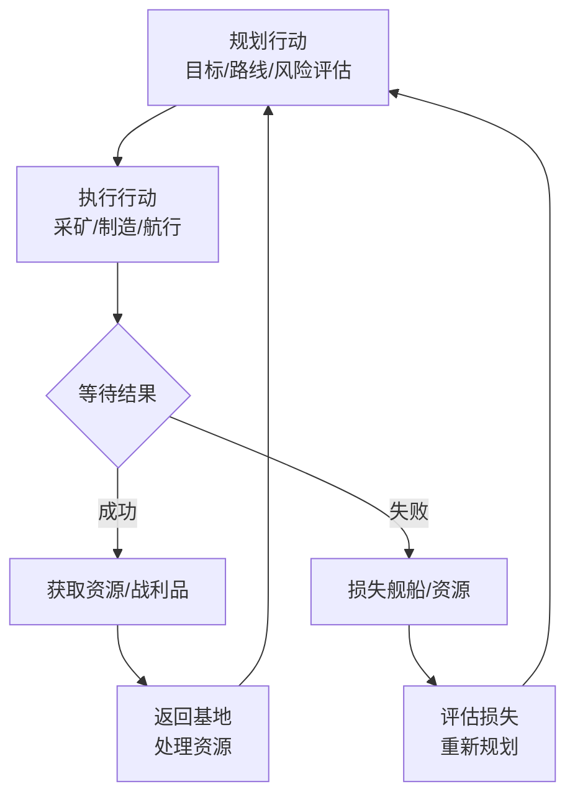
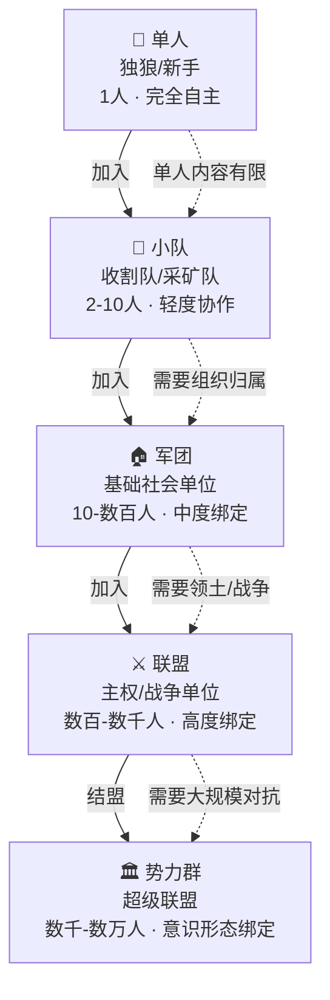
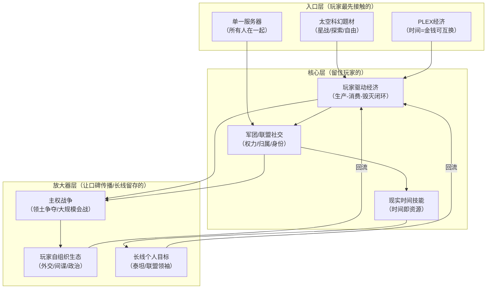

## 一、基本信息

| 项目 | 内容 |
|:-----|:-----|
| **游戏名称** | EVE Online（星战前夜） |
| **开发商/发行商** | CCP Games |
| **上线日期** | 2003-05-06（欧服）/ 2006-06（国服） |
| **平台** | PC |
| **底层驱动（主导）** | 社交经济型 |
| **底层驱动（次要）** | 数值策略型 |
| **商业化模式** | 月卡/年卡订阅制 + PLEX（可交易游戏时长）|
| **拆解版本** | Equinox + 2026年Aura Guidance更新 |
| **拆解日期** | 2026-08-25 |

## 二、拆解侧重点说明

> 根据[[90-2-1-2 底层驱动分类图谱]]和[[90-2-1-3 拆解维度标准SOP]]的权重分配，本篇报告的分析重心如下：

| 维度 | 权重 | 说明 |
|:-----|:----:|:-----|
| 第1层：核心循环（分钟级） | ★★ | EVE的战斗/采集/制造循环节奏极慢，单次行动周期以分钟到小时计，重点分析“行动-后果”的延迟反馈机制 |
| 第2层：成长循环（天/周级） | ★★★★★ | 技能队列（现实时间训练）是EVE最独特的成长系统，需重点拆解“时间即资源”的设计逻辑 |
| 第3层：商业化设计 | ★★★★ | 月卡+PLEX双轨制（可交易游戏时长）是EVE经济系统的核心调节器 |
| 第4层：社交结构 | ★★★★★ | 军团→联盟→势力群的层级结构、主权战争、玩家自组织权力博弈——这是社交经济型游戏的终极形态 |
| 第5层：长线留存机制 | ★★★★ | 20年单一服务器、玩家自驱内容、主权争夺的“永不结束的游戏” |
| 第6层：美术/UI/信息传达 | ★★★ | 星图、市场界面、军团管理工具——信息密度极高的“数据仪表盘”设计 |

> **系统视角声明**：本报告采用系统视角，不将游戏的成功或失败归因于单一因素，而是试图描述各要素之间的协同、耦合与相互强化关系。各章节的分析结论将在“第十一章 系统因果分析”中整合为完整的因果网络图。

## 三、第1层：核心循环（分钟级）

> **定义**：玩家在游戏中最基本的“操作-反馈-决策”单元。参考[[90-2-1-3 拆解维度标准SOP#1.3 第1层：核心循环]]。

### 3.1 最小循环描述

EVE的核心循环不是“秒级”的，而是“分钟到小时级”的。这是EVE与几乎所有其他游戏最本质的区别。

**以采矿为例的完整循环**：

规划航线（选择矿区）→ 驾驶舰船前往 → 启动采矿激光 → 等待矿石采集（数分钟）→  
矿石进入货舱 → 货舱满 → 返回空间站 → 精炼/出售 → 规划下一趟

text

**以PVP遭遇战为例**：

侦察（扫描星系）→ 发现目标 → 评估敌我实力 → 决定交战/撤退 →  
（如交战）锁定目标 → 启动武器 → 等待武器循环（数秒到数十秒）→ 伤害结算 →  
护盾/装甲/结构损伤 → 决定继续/撤退 → 战损或战利品

text

**核心特征**：EVE的每个行动都有“延迟”——采矿激光需要时间产出矿石，武器有循环时间，跃迁需要时间到达目的地，技能训练需要现实时间完成。这种“延迟”设计让每一个决策都带有“时间成本”，玩家必须在行动前进行更充分的评估。
### 3.2 循环结构图

### 3.3 关键参数

|参数|数值|说明|
|---|---|---|
|单次行动周期|数分钟-数小时|采矿/制造/跃迁均有明确时间消耗|
|武器循环时间|2-20秒|不同武器类型差异极大|
|技能训练|现实时间（秒-年）|技能队列以现实时间推进|
|大型会战时长|数小时-数天|2018年“血色清洗”会战持续14小时|
|随机元素占比|低|EVE的核心是玩家之间的博弈，随机性主要来自对手行为的不确定性|

### 3.4 爽感来源分析

EVE的爽感是“延迟满足”的极致形态。

1. **长期规划的实现感**：当你为一个目标（如购买一艘泰坦）规划了数月，最终达成时的满足感远超“即时反馈”型游戏。EVE的“成长曲线”是可适应每个玩家的——玩家可以在框架内书写自己的故事。
    
2. **风险与回报的张力**：EVE的死亡惩罚极其严厉——舰船被毁即永久消失。这种“全损”机制让每一次高风险行动都充满肾上腺素。
    
3. **权力博弈的智力快感**：在联盟层面，一场成功的战略部署（如偷袭敌方主权设施）带来的不是“操作赢了”，而是“我算计赢了”。
    
4. **经济博弈的成就感**：EVE的市场体系无限趋近于现实世界——任何玩家使用的任何装备、任何舰船，几乎都出自另一个玩家之手。在市场中低买高卖、操纵物价，本身就是一种“玩法”。
    

### 3.5 潜在疲劳点

1. **行动周期过长导致的“等待焦虑”**：采矿需要持续盯着屏幕等待矿石填满货舱，这个过程缺乏即时正反馈。
    
2. **死亡惩罚的“毁灭性打击”**：一艘精心配装的舰船被毁意味着数小时到数周的努力化为乌有，部分玩家会因此永久流失。
    
3. **“内容需要自己找”的迷茫**：EVE不提供“任务线”式的引导，新手玩家经常问“我该做什么”——这也是CCP持续优化新手引导的原因。
    

### 3.6 ← → 与其他层的交互

|关联层|交互关系|
|---|---|
|第2层（成长循环）|核心循环中的每个行动（采矿/制造/战斗）都在为技能训练和资源积累服务——行动的结果是“成长”的输入|
|第3层（商业化）|PLEX可以通过游戏内市场用ISK购买——这意味着“花钱买时间”和“花时间赚钱”在同一条经济线上可相互转化|
|第4层（社交结构）|核心循环中的“生产”行为（采矿/制造）为军团的战争机器提供物资基础——“经济生产”与“军事消耗”在军团层面形成闭环|
|第5层（长线留存）|核心循环的“慢节奏”本身就是长线留存的设计——你不可能在几天内“通关”EVE，因为技能训练需要现实时间|

## 四、第2层：成长循环（天/周级）

> **定义**：玩家在每日/每周时间尺度上的行为模式。参考[[90-2-1-3 拆解维度标准SOP#1.4 第2层：成长循环]]。

### 4.1 每日/每周行为模式

EVE没有“每日必做”的任务系统——玩家的行为完全由自己的目标驱动。

|行为类型|耗时|产出|玩家类型|
|---|---|---|---|
|采矿/行星开发|1-4小时/次|矿石/原材料|生产型玩家|
|制造/科研|持续（生产线队列）|舰船/装备/蓝图|工业型玩家|
|市场交易|不定|ISK利润|商业型玩家|
|PVP巡逻/收割|1-3小时/次|击杀/战利品|战斗型玩家|
|探索/扫描|1-2小时/次|数据/遗迹/虫洞|探索型玩家|

### 4.2 技能系统（核心成长机制）

EVE最独特的成长系统是**技能队列**——技能不通过“打怪升级”获得，而是通过**现实时间的训练**。

|技能等级|训练时间（估算）|说明|
|---|---|---|
|1级|数分钟-数小时|基础入门|
|2级|数小时-数天|初步掌握|
|3级|数天-数周|熟练操作|
|4级|数周-数月|专家级别|
|5级|数月至1年+|顶级精通|

**设计逻辑**：

- 技能训练在玩家离线时仍然进行——这意味着“时间”本身就是EVE的核心资源
    
- 玩家无法“肝”出技能——你只能等待，或者用“技能注入器”（可通过PLEX获取）加速
    
- 这种设计保证了“老玩家”和“新玩家”之间存在不可逾越的差距，但也让每个玩家的成长路径具有长期规划价值
    

**2026年更新**：CCP推出了Aura Guidance系统，将真实新手帮助问题的答案以自动化、易消化的方式呈现给新玩家。同时推出了Exordium新手区域，让新玩家在专属安全区域学习核心系统。CCP的长期战略是“让新玩家更容易进入游戏，但不牺牲老玩家珍视的深度”——目标不是简化EVE，而是让它的复杂性更容易接触。

### 4.3 资源循环图

text

[采矿/打捞/行星开发] → [原材料] → [制造] → [舰船/装备]
                                    ↓
[市场交易] ← [ISK] ← [出售成品]     [使用/消耗]
    ↓                                ↓
[购买PLEX] → [延长游戏时间]      [战斗中被毁] → [残骸/打捞] → [回收材料]
    ↓
[购买技能注入器] → [加速技能训练]

文字说明：  
EVE的资源循环是一个完整的“生产-消费-毁灭-再生产”闭环。玩家生产资源→制造舰船→在战斗中使用舰船→舰船被毁→残骸被打捞回收→重新进入生产环节。任何大型会战动辄消耗几百甚至上千艘大型舰船。这个循环的每一环都与其他环节紧密相连——**“经济特性将所有东西以不可思议的方式拧在了一起，每一环的变动都可能对其他环节产生影响”** 。

### 4.4 断档期识别

- **技能队列空窗期**：当玩家没有规划好技能训练队列时，会感觉“时间被浪费了”
    
- **目标缺失期**：完成一个长期目标（如购买泰坦）后，如果没有下一个目标，玩家会进入迷茫期
    
- **战争间歇期**：大型会战结束后，军团进入休整期，部分PVP玩家会感到无聊
### 4.5 长线目标

|时间维度|核心目标|进度可视化方式|
|---|---|---|
|1-3个月|掌握基础技能、加入军团、拥有第一艘巡洋舰|技能点数 + 资产总值|
|3-12个月|拥有战列舰/旗舰、参与主权战争|技能点数 + 军团贡献|
|1-3年|拥有泰坦/超级航母、成为军团管理/联盟指挥|资产总值 + 社会地位|
|3年+|影响新伊甸的权力格局|历史成就 + 社区声望|

### 4.6 ← → 与其他层的交互

|关联层|交互关系|
|---|---|
|第1层（核心循环）|技能等级决定了你能驾驶什么舰船、使用什么装备——成长直接解锁新的核心循环可能性|
|第3层（商业化）|PLEX可以兑换ISK，ISK可以购买技能注入器——付费可以“加速”成长，但不等于“跳过”成长|
|第4层（社交结构）|军团会为新玩家提供技能规划建议、甚至资助技能书——社交关系降低了个人的成长成本|
|第5层（长线留存）|技能训练以现实时间计算，意味着“离开一天就落后一天”——退出成本被时间本身量化|

## 五、第3层：商业化设计

> **定义**：游戏如何将玩家体验转化为收入。参考[[90-2-1-3 拆解维度标准SOP#1.5 第3层：商业化设计]]。

### 5.1 付费入口总览

|付费类型|付费形式|对应心理账户|价格区间|
|---|---|---|---|
|月卡（Omega克隆）|订阅制|“入场券”——不付费无法使用高级舰船/技能|约60-120元/月|
|PLEX|一次性购买（可交易）|“游戏内货币的替代品”|不定（随市场波动）|
|技能注入器|一次性购买（可交易）|“加速成长”|不定（随市场波动）|

### 5.2 PLEX系统：商业化设计的核心

PLEX（Pilot License Extension）是EVE商业化设计中最精妙的部分：

|特性|说明|
|---|---|
|**可交易性**|玩家用现金购买PLEX后，可以在游戏内市场出售给其他玩家换取ISK|
|**双向兑换**|玩家也可以用ISK从其他玩家处购买PLEX来延长游戏时间|
|**价格由市场决定**|PLEX的ISK价格由供需决定，CCP不直接定价|

**这意味着**：

- 愿意花钱的玩家可以用现金换ISK（“氪金换时间”）
    
- 愿意花时间的玩家可以用ISK换游戏时间（“肝游戏不花钱”）
    
- 两种玩家在同一条经济线上交易，形成了一个**自平衡的“时间-金钱”兑换市场**
    

2025年，CCP对PLEX市场进行了重大调整，引入了“全球PLEX市场”系统。新系统通过全球卖家池进行交易，“这种无摩擦系统旨在提高流动性，实现公平的市场均衡，并支持EVE不断发展的经济”。

### 5.3 付费深度分析

|维度|数据|说明|
|---|---|---|
|零氪vs满氪战力差距|显著（但可追赶）|Omega克隆可使用T2舰船和高级技能，Alpha克隆有限制|
|月卡价格|约60-120元/月|不同地区和订阅时长有差异|
|PLEX价格|随市场波动|受游戏内经济影响|
|是否有付费上限|无限|可无限购买PLEX和技能注入器|

### 5.4 付费与体验的关系

EVE的商业化设计遵循一个核心原则：**“付费可以加速，但不能替代”**。

- 付费购买PLEX→出售换ISK→购买更好的舰船→**但你仍然需要技能点数来驾驶它**
    
- 付费购买技能注入器→加速技能训练→**但你仍然需要学习如何正确使用这些技能**
    
- 付费不能让你“无敌”——一艘价值连城的泰坦如果操作不当，仍然会在几分钟内被摧毁
    

这种设计让“付费玩家”和“免费玩家”之间存在差距，但这个差距是**可追赶的**——只要你有足够的时间和策略。

### 5.5 诱导性设计识别

|设计手法|是否存在|具体表现|
|---|---|---|
|首充双倍/限时优惠|✅|偶尔有Omega克隆优惠|
|概率展示（保底/随机）|❌|无抽卡机制|
|限时卡池/限定皮肤|✅|限量版舰船皮肤（纯外观）|
|沉没成本诱导|✅|月卡订阅的“不用就亏”心理|
|社交展示（付费身份的可见性）|✅|昂贵舰船/皮肤在社交场景中的展示价值|

### 5.6 ← → 与其他层的交互

|关联层|交互关系|
|---|---|
|第1层（核心循环）|PLEX-ISK兑换让“商业”成为核心循环的一种合法路径——玩家可以完全不战斗，只靠市场交易“玩”EVE|
|第2层（成长循环）|PLEX可兑换ISK，ISK可购买技能注入器——付费可以直接加速成长，但不等于“一键满级”|
|第4层（社交结构）|军团的经济实力（由成员贡献的ISK/PLEX支撑）直接影响战争能力——商业化收入间接转化为军团的战斗力|
|第5层（长线留存）|PLEX的可交易性创造了“玩家养玩家”的经济生态——免费玩家通过游戏内劳动为付费玩家提供服务，形成双向依存|

## 六、第4层：社交结构

> **定义**：游戏如何组织和定义玩家之间的关系。参考[[90-2-1-3 拆解维度标准SOP#1.6 第4层：社交结构]]。

**这是EVE的核心层——社交经济型游戏的终极形态。**

### 6.1 社交层级图

### 6.2 军团——EVE的基础社会单位

军团是EVE玩家群体的基础“社会单位”。**“军团成员的‘效忠’对象是军团或者军团CEO，而不是联盟或者联盟CEO”** 。

|军团要素|说明|
|---|---|
|**组织形式**|类似中世纪的领主与领民——CEO拥有最高决策权|
|**核心权限**|批准新成员加入、设定外交关系、发动战争|
|**经济基础**|军团税收、共享资产、战争补给|
|**文化认同**|每个军团有独特的文化和行事风格|

### 6.3 联盟——主权战争的核心单位

联盟由多个军团组成，是EVE中PvP最常用的计量单位。

|联盟要素|说明|
|---|---|
|**核心特权**|可宣布0.0星系主权|
|**权力结构**|建立联盟的军团自动成为“执行军团”，相当于联盟的CEO|
|**大规模会战**|围绕联盟间的主权与利益冲突展开|
|**官僚体系**|联盟领导者借用国家治理技术——如税收和层级官僚机构|

**“玩家+资源+更多玩家=冲突。这是驱动EVE Online的基本数学”** 。

### 6.4 势力群——超级联盟的意识形态绑定

|势力群（欧服）|核心联盟|特征|
|---|---|---|
|**The Imperium**|Goonswarm Federation|欧服最强大的联盟群，领土横跨多个星域|
|**PanFam**|Pandemic Horde|与Imperium形成对抗格局|
|**WinterCo**|多个联盟联合|第三极势力|
|**The Initiative**|INIT.|控制Fountain、Delve等星域|

### 6.5 玩家自组织与权力博弈

EVE的社交结构不是“设计出来的”，而是**玩家自组织演化出来的**。

|现象|说明|
|---|---|
|**税收制度**|联盟向军团征税，军团向成员征税——形成了类似国家的财政体系|
|**外交关系**|联盟之间通过游戏内聊天和其他渠道进行谈判、结盟和宣战|
|**间谍活动**|玩家会派遣间谍潜入敌对联盟获取情报——这是EVE独有的“游戏内谍战”|
|**玩家葬礼**|玩家自发为去世的成员举行守夜仪式|
|**慈善活动**|玩家组织24小时慈善直播，为儿童医院筹集超过11000美元|

### 6.6 国服的特殊生态

国服EVE曾经历经济崩溃，“整个游戏就像是一个完整的生态环境被破坏了一样，整个生态链都崩溃了”。国服玩家群体因此形成了独特的文化——部分玩家选择转战欧服以寻求更活跃的游戏环境。

### 6.7 ← → 与其他层的交互

|关联层|交互关系|
|---|---|
|第1层（核心循环）|社交结构决定了核心循环的“规模”——单人采矿和军团级后勤保障的采矿舰队是完全不同的体验|
|第2层（成长循环）|军团为新玩家提供技能规划和物资支持——社交关系降低了个人的成长门槛|
|第3层（商业化）|军团的战争机器依赖成员的ISK/PLEX投入——商业化收入被“社会化”为集体战斗力|
|第5层（长线留存）|社交契约是EVE最强的退出成本——“我的军团需要我”比任何个人成就都更能留住玩家|

## 七、第5层：长线留存机制

> **定义**：游戏如何让玩家在“玩了一个月之后”仍然愿意留下来。参考[[90-2-1-3 拆解维度标准SOP#1.7 第5层：长线留存机制]]。

### 7.1 内容更新节奏

|更新类型|频率|内容量|说明|
|---|---|---|---|
|资料片/扩展包|约1-2年/次|新系统/新机制|如Equinox扩展重做了主权系统|
|季度更新|每季度|平衡调整+新内容|CCP的持续运营节奏|
|小型补丁|不定期|BUG修复+优化|持续迭代|

### 7.2 “玩家即内容”的留存逻辑

EVE最独特的长线留存机制是：**内容不由CCP生产，而是由玩家自己生产**。

|内容类型|谁生产的|说明|
|---|---|---|
|战争|玩家联盟|主权战争、领土争夺|
|经济波动|玩家市场|供需变化、价格操纵|
|政治博弈|玩家联盟|外交、结盟、背叛|
|社交活动|玩家社群|葬礼、慈善、聚会|

EVE的“内容引擎”不是版本更新，而是**玩家之间的冲突与合作**。“EVE Online从根本上讲是关于创造、贸易、毁灭以及在此过程中建立的友谊”。

### 7.3 单一服务器的社交密度

EVE采用**单一服务器架构**（欧服）——所有玩家在同一个宇宙中互动。这意味着：

- 你在游戏中遇到的每一个人都是“真实的人”，而非NPC或跨服玩家
    
- 你的行为可能影响数万名其他玩家的游戏体验
    
- 社交网络的密度和复杂度远超分服游戏
    

### 7.4 退出成本分析

EVE的退出成本是**所有游戏中最高的之一**：

|退出成本类型|说明|
|---|---|
|**时间成本**|数年的技能训练、资产积累——离开意味着“浪费”了数千小时|
|**社交成本**|军团/联盟中的社会关系、团队责任——“我走了他们怎么办”|
|**资产成本**|舰船、装备、ISK的积累——离开意味着放弃所有资产|
|**身份成本**|在EVE社区中的声望和地位——离开意味着“放弃”了社会身份|

### 7.5 终局内容

EVE没有“终局”——游戏在玩家达到“最高级别”后不会结束，因为：

- **权力格局永远在变化**：联盟崛起、衰落、重组是常态
    
- **经济永远在波动**：PLEX价格、原材料价格、战争消耗持续变化
    
- **个人目标永远可以更新**：从“拥有泰坦”到“指挥一场会战”到“建立一个联盟”
    

### 7.6 ← → 与其他层的交互

|关联层|交互关系|
|---|---|
|第1层（核心循环）|“玩家即内容”意味着核心循环的内容供给永不枯竭——只要还有玩家在活动，就有新的事情可做|
|第2层（成长循环）|技能训练的“现实时间”特性让成长永无止境——总有下一个技能可以训练|
|第3层（商业化）|PLEX市场的波动本身就是一种“内容”——玩家可以像炒股票一样交易PLEX|
|第4层（社交结构）|社交结构是长线留存的核心引擎——玩家留下的不是因为游戏内容，而是因为“人”|

## 八、第6层：美术/UI/信息传达

> **定义**：视觉和界面设计如何服务于“让玩家看懂、融入、不疲倦”。参考[[90-2-1-3 拆解维度标准SOP#1.8 第6层：美术/UI/信息传达]]。

### 8.1 审美调性分析

|维度|描述|是否服务于核心体验|
|---|---|---|
|整体美术风格|冷色调太空科幻，强调“空旷”与“孤独”|是——太空的浩瀚感是EVE世界观的核心|
|色彩倾向|深空蓝黑为主，点缀星云色彩|是——强化“在宇宙中渺小”的感知|
|舰船设计|四种种族四种风格（艾玛/盖伦特/加达里/米玛塔尔）|是——种族身份通过视觉编码|
|场景/环境风格|7000+恒星系统，风格差异通过星云/背景实现|是——区域视觉编码辅助导航|
|UI视觉风格|信息密度极高，类似“数据仪表盘”|是——EVE的复杂度需要通过高密度UI承载|

### 8.2 UI效率分析

|常用操作|操作步骤数|是否合理|
|---|---|---|
|打开星图|1步（快捷键F10）|是|
|查看市场|1步（快捷键）|是|
|扫描星系|2-3步|是（但新手学习成本高）|
|查看军团信息|2步|是|

EVE的UI设计目标是“信息效率”而非“美观”。市场界面类似于纳斯达克交易系统，星图类似于航空管制系统——这种设计服务于EVE的核心体验：**数据驱动的决策**。

### 8.3 信息传达效率分析

|信息类型|传达方式|响应速度|是否清晰|
|---|---|---|---|
|舰船状态（护盾/装甲/结构）|HUD环形指示器|即时|是|
|目标锁定状态|目标列表+锁定指示器|即时|是|
|星系安全等级|UI颜色编码（绿/黄/红/黑）|即时|是——这是EVE最核心的安全信息|
|市场物价|列表+图表|即时|是（但需要学习解读）|
|技能训练进度|技能队列界面|即时|是|

### 8.4 优秀设计与可改进点

**优秀设计（≥3处）**：

1. **安全等级的颜色编码**：高安（绿色）→低安（黄色）→00（红色/黑色）——玩家一眼就能判断当前星系的危险程度
    
2. **舰船状态的环形指示器**：护盾/装甲/结构三层环形显示，在战斗中一目了然
    
3. **星图的热力图功能**：可显示各星系的玩家活动密度、击杀记录、市场数据——将海量数据压缩为可视化信息
    

**可改进点（≥3处）**：

1. **新手引导的信息过载**：EVE的UI对新手极不友好——大量功能和数据同时呈现，新玩家不知道从哪里开始
    
2. **市场界面的学习曲线陡峭**：虽然功能强大，但理解“如何看市场”“如何下订单”需要大量学习
    
3. **军团管理工具的功能隐藏**：军团CEO需要使用的管理功能分散在多个界面中
    

### 8.5 ← → 与其他层的交互

|关联层|交互关系|
|---|---|
|第1层（核心循环）|星图和市场界面是核心循环中“规划”阶段的核心工具——没有这些数据，玩家无法做出 informed decision|
|第2层（成长循环）|技能队列界面是成长循环的“控制面板”——玩家在这里规划未来数月的成长路径|
|第3层（商业化）|市场界面是PLEX交易的核心场所——UI的效率直接影响经济系统的流动性|
|第4层（社交结构）|军团/联盟管理界面是社交结构的“治理工具”——CEO通过它管理成员、税收和外交|

## 九、弃坑拐点分析

|阶段|典型流失原因|机制层面是否存在预防设计|
|---|---|---|
|新手期（前1-7天）|学习曲线过陡、不知道该做什么、被高安“强暴”|2026年推出Exordium新手区域和Aura Guidance系统|
|成长期（第1-3月）|技能训练太慢、目标感缺失|技能队列规划工具、军团新人指导|
|成熟期（第3-12月）|舰船被毁导致“毁灭性打击”|军团战损补偿机制（部分军团提供）|
|长线期（1年+）|军团/联盟瓦解、政治生态恶化|可加入其他军团/联盟——EVE的社交结构足够多元|

## 十、横向穿刺锚点

|锚点|本游戏数据|关联专题|
|---|---|---|
|核心行动周期|数分钟-数小时||
|成长方式|现实时间技能训练||
|月卡/订阅价格|约60-120元/月||
|PLEX可交易性|是（玩家间双向交易）||
|零氪vs付费差距|显著（但可追赶）||
|最大社交单元|数万人（势力群）|[[90-2-1-21 专题_社交结构金字塔]]|
|内容更新频率|约1-2年/资料片|[[90-2-1-22 专题_赛季制与版本更新节奏研究]]|
|服务器架构|单一服务器||
|退出成本|极高（数年投入）||

## 十一、系统因果分析

> **本章为必填项，是本报告的核心章节。** 本章将前10章的各层分析整合为一张“系统因果网络图”，标识各要素之间的协同、耦合与相互强化关系。

### 11.1 因果网络图

**图例说明**：

- **入口层**：玩家通过什么进入游戏/被吸引
    
- **核心层**：玩家为什么持续玩下去
    
- **放大器层**：玩家为什么带朋友来、为什么回流
    
- **实线箭头**：直接因果/支撑关系
    
- **虚线箭头**：反馈强化关系
    

### 11.2 入口/核心/放大器分层说明

|层级|包含要素|作用|
|---|---|---|
|**入口层**|太空科幻题材、单一服务器、PLEX经济|吸引特定类型的玩家（策略型/社交型/经济型）|
|**核心层**|玩家驱动经济、军团/联盟社交、现实时间技能|创造“无法在其他游戏获得”的独特体验|
|**放大器层**|主权战争、玩家自组织生态、长线个人目标|创造“新闻事件”、社区话题、个人传奇|

### 11.3 必要非充分说明

> **必填项**。明确声明单一因素不足以解释游戏的成功或失败。

**声明**：本报告认为，《EVE Online》的20年长线运营是以下多因素共同作用的结果：太空科幻题材的独特性、单一服务器架构的社交密度、玩家驱动经济的真实感、军团-联盟-势力群的社交层级、现实时间技能训练创造的长期规划感、以及主权战争和玩家自组织生态创造的“永不结束的游戏”。

其中：

- **玩家驱动经济**是EVE“独特性”的**必要非充分条件**——如果没有一个完全由玩家驱动的经济系统，EVE只是一款普通的太空MMO；但仅有经济系统，没有与之匹配的社交结构和战争机制，经济本身也无法形成闭环；
    
- **军团/联盟社交结构**是“留存”的**核心稳定器**——EVE的社交契约强度远超其他游戏，“我的军团需要我”是玩家留下的首要原因；
    
- **主权战争**是“内容”的**放大器**——战争是EVE最大的“内容生产机器”，每一次大规模会战都是一次社区事件；
    
- **现实时间技能系统**是“退出成本”的**强化因子**——技能训练的不可中断性让“离开一天就落后一天”成为真实的时间焦虑；
    
- **PLEX系统**是“经济”的**调节器**——它让“时间”和“金钱”在同一个经济体系内可兑换，创造了一个自平衡的玩家经济。
    

**单一归因警告**：任何将《EVE Online》的成功归结为单一因素的解释，在本报告的框架下均被视为不完整的分析。

### 11.4 系统脆弱性识别

|脆弱环节|后果|现实案例/假设场景|
|---|---|---|
|经济系统失衡|通货膨胀/通货紧缩导致普通玩家无法参与经济活动|国服经济崩溃的案例|
|大型联盟垄断|00地区被少数势力瓜分→新玩家/小军团无法进入→生态僵化|欧服“四大势力群”格局的潜在风险|
|新手留存不足|学习曲线过陡导致新玩家在初期流失→人口老龄化→生态萎缩|CCP持续投入新手引导优化的原因|
|脚本/外挂泛滥|破坏经济系统的公平性→普通玩家失去生产动力|国服脚本问题的历史教训|

### 11.5 正向循环 vs 恶性循环

**正向循环（增长飞轮）** ：

> 新玩家加入 → 加入军团学习 → 技能成长/资产积累 → 参与军团活动 → 贡献军团战争机器 → 军团获胜/扩张 → 更多领土/资源 → 吸引更多玩家加入

**恶性循环（衰退螺旋）** ：

> 经济失衡 → 普通玩家无法盈利 → 生产活动减少 → 物资短缺 → 战争成本上升 → 联盟收缩 → 领土减少 → 资源更少 → 玩家流失 → 生态萎缩

## 十二、总结

### 12.1 一句话评价

《EVE Online》不是一款“游戏”，而是一个**可玩的虚拟社会**——它的核心不是战斗、不是剧情、不是探索，而是**人与人之间的经济博弈、权力争夺和社会协作**。

### 12.2 核心发现（3-5条）

1. **“玩家即内容”的终极范式**：EVE证明了“内容不需要由开发商生产”——玩家之间的冲突、合作、背叛、外交本身就是取之不尽的内容源。CCP的角色不是“内容创作者”，而是“规则制定者和舞台搭建者”。
    
2. **经济系统作为“伟大的平衡引擎”**：EVE的市场是“伟大的平衡引擎”——它通过玩家之间的供需关系自我调节，不需要CCP干预。PLEX系统让“时间”和“金钱”在同一个经济体系内可兑换，创造了一个自平衡的玩家经济。
    
3. **社交结构作为退出成本**：军团-联盟-势力群的三级社交结构创造了游戏史上最高的退出成本。玩家留下的不是因为“游戏好玩”，而是因为“我不能离开我的军团”。
    
4. **现实时间作为资源**：技能训练以现实时间推进的设计，让“时间”本身成为EVE最核心的资源。这种设计将玩家的“在线时长焦虑”转化为“规划能力”——你不需要“肝”，但你需要“规划”。
    

### 12.3 可借鉴的设计点

1. **“生产-消费-毁灭”的完整经济闭环**：EVE证明了“物品必须可销毁”是健康经济的前提——如果物品不消耗，生产就会过剩，经济就会崩溃
    
2. **PLEX作为“时间-金钱兑换器”**：让付费玩家和免费玩家在同一个经济体系内交易，创造了自平衡的商业化模型
    
3. **玩家自组织的权力结构**：不设计“公会系统”的细节，而是提供“联盟宣布主权”的工具——让玩家自己演化出 governance 结构
    
4. **单一服务器的社交密度**：虽然技术成本极高，但单一服务器创造的“所有人都在同一个世界”的感知是分服游戏无法替代的
    

### 12.4 需警惕的陷阱

1. **新手友好的“不可能三角”**：EVE的深度和复杂度是其核心卖点，但也是新手留存的最大障碍。CCP的长期战略是“让复杂性更容易接触，而不是让EVE变简单”——这个平衡极难把握。
    
2. **经济系统的“蝴蝶效应”**：经济系统的每一环变动都可能对其他环节产生影响——一次不当的经济调整可能导致整个生态链崩溃。
    
3. **权力垄断的“僵化风险”**：当少数联盟垄断了00地区的大部分领土时，小军团和新玩家无法进入，生态会逐渐僵化。
    
4. **“游戏即工作”的 burnout**：部分玩家在EVE中的角色类似于“全职工作”——物流、后勤、外交、管理——这种“第二份工作”的感觉可能导致长期 burnout。
    

## 十三、关联笔记

- [[90-2-1-1 拆解总索引_MOC]]
    
- [[90-2-1-2 底层驱动分类图谱]]
    
- [[90-2-1-3 拆解维度标准SOP]]
    
- [[90-2-1-7 魔兽世界_数值体系、团队协作与长线运营的系统协同]]（同为社交经济型，对比“副本协作”vs“开放世界PVP”的社交结构）
    
- [[90-2-1-18 逆水寒手游_智能社交、MMO轻量化与长线运营的系统协同]]（同为社交经济型，对比“硬核社交”vs“轻量化社交”的设计差异）
    
- [[90-2-1-21 专题_社交结构金字塔]]（军团-联盟-势力群的三级结构分析）
    
- [[90-2-1-22 专题_赛季制与版本更新节奏研究]]（EVE的“无赛季”vs 其他游戏的赛季制）