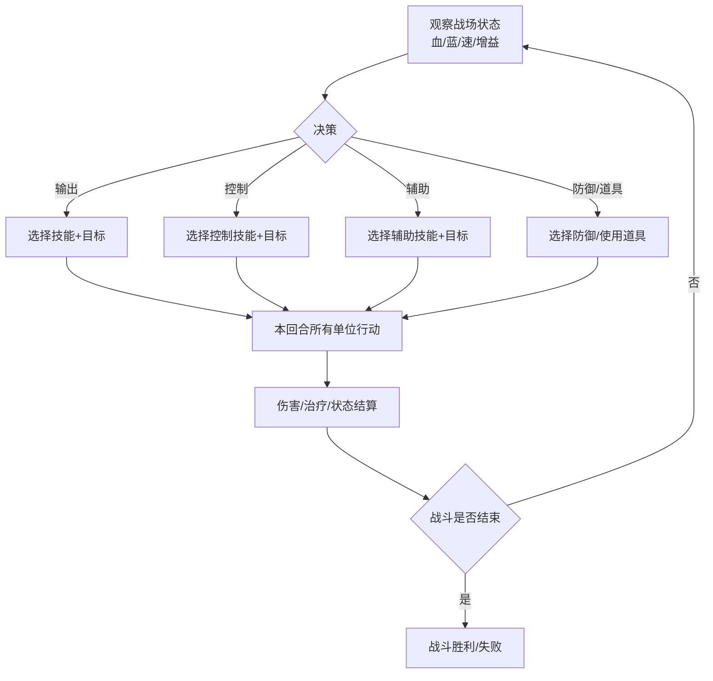
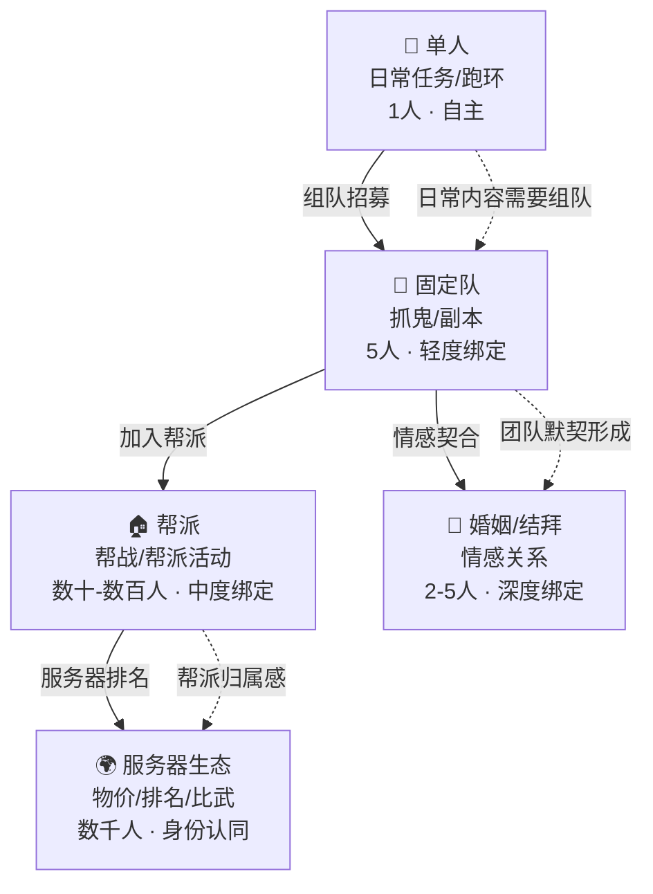
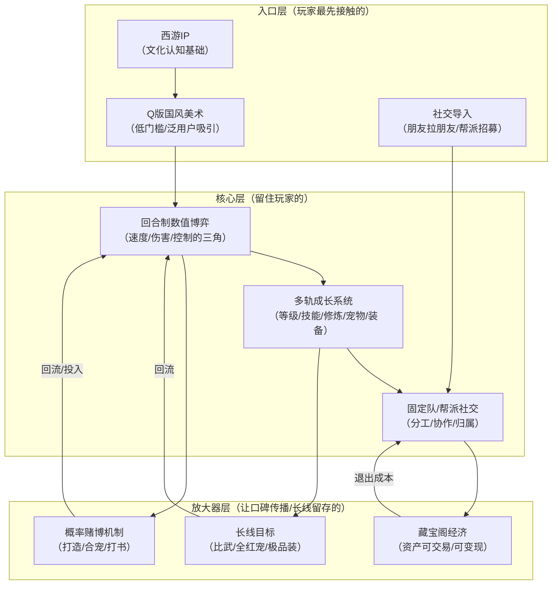

## 一、基本信息

| 项目 | 内容 |
|:-----|:-----|
| **游戏名称** | 梦幻西游（端游）/ 梦幻西游手游 |
| **开发商/发行商** | 网易 |
| **上线日期** | 2003-12-18（端游）/ 2015-03-26（手游） |
| **平台** | PC / iOS / Android |
| **底层驱动（主导）** | 数值策略型 |
| **底层驱动（次要）** | 社交经济型 |
| **商业化模式** | 点卡/月卡（端游）+ 道具内购（手游）|
| **拆解版本** | [待填写] |
| **拆解日期** | [待填写] |

## 二、拆解侧重点说明

> 根据[[90-2-1-2 底层驱动分类图谱]]和[[90-2-1-3 拆解维度标准SOP]]的权重分配，本篇报告的分析重心如下：

| 维度 | 权重 | 说明 |
|:-----|:----:|:-----|
| 第1层：核心循环（分钟级） | ★★★★ | 回合制战斗的“速度-伤害-控制”三角博弈是数值策略的核心战场 |
| 第2层：成长循环（天/周级） | ★★★★★ | 师门/抓鬼/副本的日常循环、修炼/技能/装备的多轨成长是数值型游戏的典范 |
| 第3层：商业化设计 | ★★★★★ | 端游点卡制+手游道具制的双轨模式、藏宝阁经济生态是网易商业化的核心引擎 |
| 第4层：社交结构 | ★★★★ | 固定队、帮派、婚姻、结拜——梦幻的社交结构是MMO社交分层的经典模型 |
| 第5层：长线留存机制 | ★★★★ | 版本更新、新门派/新等级、经济系统的“保值”设计 |
| 第6层：美术/UI/信息传达 | ★★★ | Q版国风美术、回合制战斗的信息可视化设计 |

> **系统视角声明**：本报告采用系统视角，不将游戏的成功或失败归因于单一因素，而是试图描述各要素之间的协同、耦合与相互强化关系。各章节的分析结论将在“第十一章 系统因果分析”中整合为完整的因果网络图。

## 三、第1层：核心循环（分钟级）

> **定义**：玩家在游戏中最基本的“操作-反馈-决策”单元。参考[[90-2-1-3 拆解维度标准SOP#1.3 第1层：核心循环]]。

### 3.1 最小循环描述

《梦幻西游》的战斗是**回合制**的——每回合约15-30秒，玩家需要在有限时间内完成操作，然后等待所有单位行动完毕，进入下一回合。

单回合战斗循环链条：

观察战场状态（敌我血量/蓝量/增益/减益/速度排序）→ 决策（选择技能/目标/防御/道具）→  
执行操作（点击技能→选择目标）→ 等待本回合所有单位行动 →  
观看战斗动画/伤害数字/状态变化 → 进入下一回合

text

**核心博弈点**：
- **速度决定出手顺序**——速度快的单位先出手，可能先手控制或击杀敌方关键单位
- **技能选择决定战局**——是用输出技能压血线，还是用控制技能限制对手，还是用辅助技能保护队友
- **目标选择决定效率**——集火哪个目标、优先击杀哪个单位
### 3.2 循环结构图

### 3.3 关键参数

|参数|数值|说明|
|---|---|---|
|单回合时长|15-30秒|操作时间+动画播放时间|
|操作到反馈的延迟|约0.5-2秒|回合制游戏的“延迟”是等待所有单位行动|
|循环中的决策点数量|3-5个|技能选择+目标选择+时机判断+资源管理|
|随机元素占比|中高|暴击、封印命中率、连击、必杀、法术波动等大量随机元素构成数值策略的“概率层”|

### 3.4 爽感来源分析

《梦幻西游》的爽感来自**计算与概率的博弈**：

1. **数值爆发的瞬间**：物理系的“必杀”触发、法系的“法术暴击”触发——大数字跳出时的视觉冲击和音效反馈是最直接的多巴胺触发器
    
2. **封印命中的“赌赢了”**：封印技能有命中率——当你成功封印住对方关键单位时，产生了“我赌赢了”的快感
    
3. **策略生效的“算赢了”**：当你预判了对手的行动并做出针对性应对（如预判对方会封印你，提前使用了抗封技能）时，产生了“我算到了”的智力满足感
    
4. **宠物合宠/打书的“赌博快感”**：宠物合成和技能打书是梦幻最核心的“概率赌博”玩法——成功时的回报极高
    

### 3.5 潜在疲劳点

1. **回合制的“等待感”**：每回合15-30秒的等待时间（尤其是观看动画时）会产生“等待焦虑”
    
2. **重复战斗的“机械感”**：日常抓鬼、师门等重复性战斗在数百次后会产生强烈疲劳
    
3. **概率失败的“挫败感”**：封印连续失败、打书连续失败时的挫败感极强——“20%命中率连续5次不中”的概率事件会挑战玩家的公平感
    

### 3.6 ← → 与其他层的交互

|关联层|交互关系|
|---|---|
|第2层（成长循环）|核心循环中的战斗表现（伤害数字、封印成功率）是成长的直接反馈——新装备/新技能让数字更大，数字更大驱动玩家追求下一件装备|
|第3层（商业化）|道具付费（手游）可以加速成长、提供更好的装备/宠物——付费直接影响核心循环中的数值表现|
|第4层（社交结构）|核心战斗支持5人组队——玩家的个人数值和操作直接影响团队效率，社交压力驱动个人持续投入成长|
|第5层（长线留存）|核心循环的“策略深度”为长线提供了持续的“精进空间”——总有更好的配速、更优的技能组合、更高的输出追求|
|第6层（UI/信息）|回合制战斗的“速度排序”是UI设计的核心——谁先动、谁后动必须一目了然|

## 四、第2层：成长循环（天/周级）

> **定义**：玩家在每日/每周时间尺度上的行为模式。参考[[90-2-1-3 拆解维度标准SOP#1.4 第2层：成长循环]]。

### 4.1 每日必做（Daily）——端游版

|行为|耗时|奖励|驱动力类型|
|---|---|---|---|
|师门任务|15-20分钟|经验+金钱+师门贡献|数值+资源|
|抓鬼（双倍时间）|1-2小时|经验+金钱+环装|数值|
|副本（普通副本）|30-60分钟/个|经验+积分+装备|数值+内容|
|宝图任务|15分钟|宝图（可挖宝）|资源+概率|
|帮派任务|10-15分钟|帮贡+经验|数值+社交|

### 4.2 每日必做（Daily）——手游版

|行为|耗时|奖励|驱动力类型|
|---|---|---|---|
|师门任务|10分钟|经验+金钱|数值|
|抓鬼（双倍）|30-60分钟|经验+环装|数值|
|秘境降妖|15-20分钟|经验+道具|数值|
|日常活动（如科举/帮派）|15-30分钟|经验+帮贡|数值+社交|
|限时活动|不定|特殊奖励|数值+内容|

### 4.3 每周目标（Weekly）

|目标|重置周期|奖励|是否强制|
|---|---|---|---|
|侠士副本|每周|高级装备/道具|是（核心内容）|
|帮派竞赛/帮战|每周|帮贡+奖励|否（核心社交）|
|比武大会|每月|称谓+奖励|否（核心PVP）|
|跑环/任务链|每周|高级装备书铁|否（高收益）|

### 4.4 资源循环图

text

[日常任务] → [经验] → [等级提升] → [解锁新技能/新宠物]
     ↓
[抓鬼/副本] → [金钱/环装] → [出售/分解] → [游戏币]
     ↓
[帮派任务] → [帮贡] → [帮派技能] → [能力提升]
     ↓
[副本/活动] → [积分] → [兑换道具] → [能力提升]

文字说明：  
《梦幻西游》的成长系统是“多轨并行”——经验（等级）、技能、修炼、宠物、装备五条成长线同时推进，每条线都有独立的资源循环。玩家的日常行为被设计为“同时产出多种资源”——抓鬼既给经验又给金钱和装备，副本既给经验又给积分。这种“多资源并行产出”的设计让玩家感觉“每一分钟都没有浪费”。

### 4.5 断档期识别

- **等级卡点**：服务器等级限制导致玩家无法继续升级→经验溢出→失去成长目标
    
- **装备“毕业”后的迷茫**：全身装备已达标→核心装备已拥有→缺乏新的数值目标
    
- **版本末期**：当前版本内容已全部体验→等待新资料片
    

### 4.6 长线目标

|时间维度|核心目标|进度可视化方式|
|---|---|---|
|1-3个月|满级（当前服务器等级上限）|等级数字 + 经验条|
|3-6个月|全身装备达标 + 修炼满|装备评分 + 修炼等级|
|6-12个月|顶级宠物合宠 + 极品装备打造|宠物评分 + 装备属性|
|1年+|全服排名 / 比武大会冠军|排行榜 + 成就系统|

### 4.7 ← → 与其他层的交互

|关联层|交互关系|
|---|---|
|第1层（核心循环）|成长反馈最直接的体现是“伤害数字变大了”——核心循环中的每一刀/每一法都是成长的“刻度”|
|第3层（商业化）|手游的道具付费直接加速成长——买经验丹、买强化石、买宠物——付费与成长深度耦合|
|第4层（社交结构）|固定队需求要求玩家成长速度“不掉队”——如果队友都升到100级了你还在90级，你会被换掉|
|第5层（长线留存）|服务器等级上限的分阶段开放（如“本周最高可升至89级，下周开放至99级”）是长线留存的核心节奏器|

## 五、第3层：商业化设计

> **定义**：游戏如何将玩家体验转化为收入。参考[[90-2-1-3 拆解维度标准SOP#1.5 第3层：商业化设计]]。

### 5.1 付费入口总览

《梦幻西游》端游和手游的商业化模式差异巨大，分别分析：

**端游版**（点卡制）：

|付费类型|付费形式|对应心理账户|价格区间|
|---|---|---|---|
|点卡|按小时计费|“入场券”——玩游戏就要花钱|0.6元/小时|
|月卡|订阅制|“长期玩家更划算”|约60元/月|
|藏宝阁交易|玩家间交易（官方抽成）|“装备/账号买卖”|不定|

**手游版**（道具制）：

|付费类型|付费形式|对应心理账户|价格区间|
|---|---|---|---|
|首充|一次性|“反正就6块钱”|6元|
|月卡/成长基金|订阅制|“每天都领”|30-98元/月|
|装备打造/强化|道具购买|“变强”|不定|
|宠物合成/打书|道具购买|“赌运气”|不定|
|外观/坐骑|直购|“好看”|30-200元|

### 5.2 藏宝阁：梦幻经济系统的核心

**藏宝阁**是网易为《梦幻西游》打造的官方玩家交易平台——玩家可以在其中交易游戏内的装备、宠物、游戏币、甚至整个账号。

|特性|说明|
|---|---|
|**官方担保**|交易由网易官方担保，降低玩家间的信任风险|
|**手续费抽成**|网易从每笔交易中抽取一定比例的手续费|
|**资产“保值”感知**|玩家可以随时将游戏资产变现→感知到“我投入的钱不是沉没成本”|
|**新玩家入口**|新玩家可以直接购买成品账号/装备→跳过了漫长的新手期|

**藏宝阁的商业逻辑**：

- 端游：玩家购买点卡→游戏中产出装备/宠物→藏宝阁出售→变现。网易同时赚取点卡收入和交易手续费。
    
- 手游：玩家购买道具→打造装备/合成宠物→藏宝阁出售→变现。网易同时赚取道具收入和交易手续费。
    

藏宝阁不仅是一个交易平台，更是**梦幻经济系统的“调节阀”** ——当游戏内装备价格过高时，藏宝阁的供给会增加（更多玩家愿意出售），价格自然回落。

### 5.3 付费深度分析

|维度|端游数据|手游数据|说明|
|---|---|---|---|
|零氪vs满氪战力差距|巨大|巨大|梦幻的付费深度极深|
|月卡/点卡基础消费|约60元/月|30-98元/月|基础入场成本|
|顶级装备打造花费|数万-数十万|数万-数十万|极品装备的期望成本极高|
|极品宠物合成花费|数万-数十万|数万-数十万|多技能全红宠的合成是概率黑洞|
|是否有付费上限|无限|无限|装备和宠物的“极品”没有上限|

### 5.4 付费与体验的关系

《梦幻西游》的付费与体验的关系是 **“付费=变强”** 的直接等式：

- 付费购买强化石 → 装备强化 → 数值提升
    
- 付费购买兽决 → 宠物打书 → 战斗力提升
    
- 付费购买装备 → 直接穿戴 → 立即变强
    

这种设计让付费玩家获得明确的“变强感知”，但代价是免费玩家与付费玩家的差距会随时间急剧拉大。

### 5.5 诱导性设计识别

|设计手法|端游|手游|具体表现|
|---|---|---|---|
|首充双倍/限时优惠|❌|✅|首充双倍元宝|
|概率展示（保底/随机）|✅|✅|装备打造/宠物打书是纯概率，有保底机制|
|限时卡池/限定道具|❌|✅|限时活动获得限定道具|
|沉没成本诱导|✅|✅|装备打造/宠物打书的“已经投入了这么多，不能停”的心理|
|社交展示（付费身份的可见性）|✅|✅|极品装备/稀有宠物的外观和属性展示|

### 5.6 ← → 与其他层的交互

|关联层|交互关系|
|---|---|
|第1层（核心循环）|付费直接提升核心循环中的数值表现——伤害更大、速度更快、生存更强|
|第2层（成长循环）|付费加速成长循环——买经验、买材料、买装备，跳过等待时间|
|第4层（社交结构）|付费差距创造了“大R/中R/平民”的社交分层——不同付费层次的玩家在游戏中的社会地位不同|
|第5层（长线留存）|藏宝阁的“资产可变现”设计创造了独特的退出成本——“我的账号/装备值X万，不能随便放弃”|

## 六、第4层：社交结构

> **定义**：游戏如何组织和定义玩家之间的关系。参考[[90-2-1-3 拆解维度标准SOP#1.6 第4层：社交结构]]。

### 6.1 社交层级图

### 6.2 固定队——梦幻的“最小社交单元”

固定队是《梦幻西游》最核心的社交形式——5个玩家组成固定队伍，共同完成抓鬼、副本等日常内容。

|特性|说明|
|---|---|
|**职业互补**|5人队伍通常包括物理输出、法系输出、封印、治疗、辅助——每个玩家有明确分工|
|**长期协作**|固定队的成员通常每天同一时间上线，共同完成日常任务|
|**社交退出成本**|“我的队友需要我”——固定队成员之间形成了轻度但紧密的社交契约|

### 6.3 帮派——中观社交单元

帮派是梦幻的“中型社会组织”，提供归属感和集体目标。

|特性|说明|
|---|---|
|**帮派技能**|帮派提供强身术、冥想等核心技能的学习和升级——帮派等级越高，技能上限越高|
|**帮派活动**|帮派强盗、帮派迷宫、帮派竞赛等集体活动|
|**帮战/帮派竞赛**|帮派之间的PVP对抗，是梦幻最核心的群体战斗内容|
|**帮派归属感**|帮派聊天频道、帮派红包、帮派职位构成了归属感的基础|

### 6.4 婚姻与结拜——情感社交单元

|系统|说明|
|---|---|
|**婚姻系统**|异性玩家可结婚——共同居所、夫妻技能、夫妻称谓|
|**结拜系统**|2-5名玩家可结拜——结拜称谓、结拜技能|
|**情感绑定**|婚姻和结拜是“情感型”社交，退出成本高于功能性社交（固定队）|

### 6.5 社交身份的可见性

|身份标识|可见范围|说明|
|---|---|---|
|等级/门派|全服可见|角色头顶的门派标志+等级数字|
|装备评分|可查看|衡量玩家“实力”的核心指标|
|称谓|全服可见|比武状元、帮派职位、婚姻/结拜称谓|
|宠物评分|可查看|宠物“实力”的量化指标|
|帮派名称|全服可见|名字前的帮派前缀|
|排行榜|全服可见|等级榜、战力榜、财富榜|

### 6.6 ← → 与其他层的交互

|关联层|交互关系|
|---|---|
|第1层（核心循环）|5人组队战斗要求明确分工——固定队的默契直接影响战斗效率|
|第2层（成长循环）|帮派技能上限取决于帮派等级——个人成长与帮派发展绑定|
|第3层（商业化）|社交展示（排行榜/称谓/装备评分）驱动玩家持续付费——“我要上榜”|
|第5层（长线留存）|固定队/帮派/婚姻的三重社交网络创造了极深的退出成本——“我的队友/帮友/伴侣怎么办”|

## 七、第5层：长线留存机制

> **定义**：游戏如何让玩家在“玩了一个月之后”仍然愿意留下来。参考[[90-2-1-3 拆解维度标准SOP#1.7 第5层：长线留存机制]]。

### 7.1 内容更新节奏

|更新类型|频率|内容量|说明|
|---|---|---|---|
|资料片/大版本|约1-2年/次|新门派/新等级/新系统|如“东海秘境”“凌波城”等|
|节日活动|每月|限时任务+奖励|春节、中秋、周年庆等|
|每周维护|每周|平衡调整+BUG修复|固定周二维护|

### 7.2 第30天 vs 第180天的留存驱动力

|时间节点|核心驱动力|玩家状态|
|---|---|---|
|第30天|等级成长 + 装备初成|处于“每天都在变强”的正向循环中|
|第180天|固定队/帮派社交 + 长线目标（满修/极品宠）|社交契约+数值目标双重绑定|

### 7.3 回归机制

|机制|描述|效果评估|
|---|---|---|
|新门派/新角色|玩家想体验新内容|高——新门派发布时回流明显|
|等级上限提升|“又可以升级了”的冲动|高——每次开放新等级都有回流潮|
|节日活动|限时奖励驱动|中——依赖活动奖励的吸引力|
|好友召回|帮派/好友邀请|高——社交关系是最强的召回引擎|

### 7.4 退出成本分析

《梦幻西游》的退出成本是所有游戏中**最高的之一**：

|退出成本类型|说明|
|---|---|
|**时间成本**|数年的日常积累、技能修炼、宠物培养——“不能浪费”|
|**金钱成本**|装备/宠物/账号的现金投入——“我的号值几万块”|
|**社交成本**|固定队/帮派/婚姻的多重社交契约——“他们需要我”|
|**资产可变现性**|藏宝阁的存在让“放弃”变成了“出售”——“即使我不玩了，账号还能卖钱”|

**特别说明**：藏宝阁的存在让《梦幻西游》的退出成本产生了独特的“双刃剑”效应：

- **正面**：账号可出售→玩家的投入有了“变现”出口→更愿意长期投入
    
- **负面**：当玩家决定“卖号”时，退出决策变得更“理性”和“彻底”——一旦卖号，几乎没有回流可能
    

### 7.5 终局内容

- 比武大会（PVP）——全服顶尖玩家的对抗舞台
    
- 帮派竞赛——大型群体PVP
    
- 装备“极品化”——追求满属性、特技装备
    
- 宠物“全红化”——追求12技能全红宠
    
- 排行榜竞争——等级榜、战力榜、财富榜
    

### 7.6 ← → 与其他层的交互

|关联层|交互关系|
|---|---|
|第1层（核心循环）|新门派/新技能本质上是“新的核心循环解锁”——玩家为了体验新机制而回归|
|第2层（成长循环）|等级上限提升重置了成长循环的顶端——从“已毕业”回到“重新爬坡”|
|第3层（商业化）|新版本=新付费点（新装备/新宠物）——内容更新驱动新的付费循环|
|第4层（社交结构）|社交退出成本是长线留存最稳定器——固定队/帮派的绑定远胜任何个人目标|

## 八、第6层：美术/UI/信息传达

> **定义**：视觉和界面设计如何服务于“让玩家看懂、融入、不疲倦”。参考[[90-2-1-3 拆解维度标准SOP#1.8 第6层：美术/UI/信息传达]]。

### 8.1 审美调性分析

|维度|描述|是否服务于核心体验|
|---|---|---|
|整体美术风格|Q版国风，明亮色彩，角色造型可爱|是——降低“战斗”的紧张感，吸引泛用户|
|色彩倾向|明亮、饱和度高，场景色彩丰富|是——营造“梦幻”的轻松氛围|
|角色设计语言|18个门派各有特色，Q版比例放大辨识特征|是——门派识别通过视觉编码|
|场景/环境风格|长安城、建邺城等经典场景，风格统一|是——区域视觉编码辅助导航|
|UI视觉风格|国风边框+金色镶边，信息密集但有序|是——风格化与功能性的平衡|

### 8.2 UI效率分析

|常用操作|操作步骤数|是否合理|
|---|---|---|
|释放技能|2-3步（打开技能栏→选择技能→选择目标）|是|
|使用道具|2-3步（打开背包→选择道具→选择目标）|是|
|查看状态|1步（快捷键）|是|
|自动战斗|1步（开启自动）|是|

### 8.3 信息传达效率分析

|信息类型|传达方式|响应速度|是否清晰|
|---|---|---|---|
|角色血量/蓝量|血条+蓝条+数字|即时|是|
|速度排序|回合制界面的“行动条”|即时|是——谁先动一目了然|
|增益/减益状态|小图标+剩余回合数|即时|是|
|战斗反馈（伤害/治疗）|数字弹出+血量变化+特效|即时|是|
|任务/目标提示|任务追踪列表+小地图标记|即时|是|

### 8.4 优秀设计与可改进点

**优秀设计（≥3处）**：

1. **速度排序的可视化**：回合制战斗中，出手顺序决定胜负。游戏通过“行动条”清晰展示每个单位的出手顺序，玩家可以在行动前预判战局
    
2. **增益/减益状态的图标化**：大量BUFF/DEBUFF状态通过不同颜色和形状的图标展示，熟练玩家一眼就能判断当前状态
    
3. **自动战斗系统**：日常重复性战斗（如抓鬼）可以开启自动战斗，有效降低了重复性内容的疲劳感
    
4. **战斗加速功能**：手游版提供了战斗加速功能，缩短了回合制战斗的等待时间
    

**可改进点（≥3处）**：

1. **信息密度对新手不友好**：满屏的图标、数字、状态变化对新玩家的认知负担极高
    
2. **关键信息的“淹没”风险**：在大型战斗中，多个单位的增益/减益图标堆叠在一起，难以快速定位关键状态
    
3. **任务指引的“点击跟随”模式**：部分任务需要玩家自行寻找NPC位置，缺乏“自动寻路”的便利性（端游早期版本）
    

### 8.5 ← → 与其他层的交互

|关联层|交互关系|
|---|---|
|第1层（核心循环）|速度排序的可视化是回合制战斗决策的核心依据——玩家需要一眼看出“谁先出手”|
|第2层（成长循环）|等级/修为/装备评分的可视化是成长的“进度条”——数字的持续增长驱动成长动机|
|第3层（商业化）|装备评分/宠物评分的可视化是付费的“刺激”——分数低的地方就是“你需要付费提升的地方”|
|第4层（社交结构）|称谓/帮派/装备评分在社交场景中的可见性构成了“社交身份”的视觉基础|

## 九、弃坑拐点分析

|阶段|典型流失原因|机制层面是否存在预防设计|
|---|---|---|
|新手期（前1-3天）|Q版画风吸引入坑，但回合制节奏慢/操作复杂导致不适应|新手引导 + 自动战斗|
|成长期（第1-2周）|升级慢/组不到队/不知道干什么|师门/抓鬼/主线任务提供清晰路径|
|成熟期（第1-2月）|卡等级/装备打造失败/宠物打书失败|服务器等级限制 + 概率保底|
|长线期（3月以上）|内容耗尽/固定队解散/大R差距过大|新资料片 + 社交退出成本（固定队/帮派）|

## 十、横向穿刺锚点

|锚点|端游数据|手游数据|关联专题|
|---|---|---|---|
|核心循环时长|15-30秒/回合|15-30秒/回合||
|每日必做耗时|1-2小时|30-60分钟||
|月卡/点卡基础消费|约60元/月|30-98元/月||
|付费与战力关系|强相关|强相关||
|零氪vs满氪战力差距|巨大|巨大||
|最大社交单元|数千人（服务器）|数千人（服务器）|[[90-2-1-21 专题_社交结构金字塔]]|
|大版本更新周期|约1-2年|约1-2年|[[90-2-1-22 专题_赛季制与版本更新节奏研究]]|
|回归机制|新门派/新等级|新门派/新等级||
|退出成本|极高|极高||

## 十一、系统因果分析

> **本章为必填项，是本报告的核心章节。** 本章将前10章的各层分析整合为一张“系统因果网络图”，标识各要素之间的协同、耦合与相互强化关系。

### 11.1 因果网络图

**图例说明**：

- **入口层**：玩家通过什么进入游戏/被吸引
    
- **核心层**：玩家为什么持续玩下去
    
- **放大器层**：玩家为什么带朋友来、为什么回流
    
- **实线箭头**：直接因果/支撑关系
    
- **虚线箭头**：反馈强化关系
    

### 11.2 入口/核心/放大器分层说明

|层级|包含要素|作用|
|---|---|---|
|**入口层**|Q版国风美术、西游IP、社交导入|降低用户获取成本，制造第一印象|
|**核心层**|回合制数值博弈、多轨成长系统、固定队/帮派社交|创造持续游玩的动机，形成习惯|
|**放大器层**|藏宝阁经济、概率赌博机制、长线目标|驱动口碑传播、社交裂变、长线回流|

### 11.3 补充说明

《梦幻西游》的20年长线运营是以下多因素共同作用的结果：Q版国风美术的低门槛吸引力、西游IP的文化认知基础、回合制数值博弈的策略深度、多轨成长系统的持续目标感、固定队/帮派社交的退出成本、藏宝阁经济的资产“保值”感知、以及概率赌博机制（打造/合宠/打书）创造的“一夜暴富”幻想。

其中：

- **多轨成长系统**是长线留存的**必要非充分条件**——等级、技能、修炼、宠物、装备五条成长线并行，让玩家在任何阶段都有“可提升的空间”；但仅有成长系统，没有社交结构的绑定，玩家会在“毕业”后离开；
    
- **固定队/帮派社交**是退出成本的**核心稳定器**——“我的队友需要我”的情感绑定远超任何个人成就的留存力；
    
- **藏宝阁经济**是付费意愿的**强化因子**——“我的投入可以变现”的感知让玩家更愿意为游戏投入金钱和时间；
    
- **概率赌博机制（打造/合宠/打书）** 是“内容消耗”的**放大器**——它创造了“再试一次”的无限循环，是梦幻“魔性”的核心来源。
    

**单一归因警告**：任何将《梦幻西游》的成功归结为单一因素的解释，在本报告的框架下均被视为不完整的分析。

### 11.4 系统脆弱性识别

|脆弱环节|后果|现实案例/假设场景|
|---|---|---|
|经济系统通胀|游戏币贬值→普通玩家购买力下降→失去生产动力|端游多次“金币贬值”危机|
|大R与平民差距过大|平民玩家在PVP中毫无还手之力→失去参与动力→人口流失|比武大会“氪金碾压”的争议|
|固定队解散|核心社交单元瓦解→日常效率下降→连锁流失|主力队友AFK导致整个固定队解散|
|概率设计的“公平性质疑”|玩家感知“系统在操控概率”→信任崩塌→弃坑|“打书成功率被暗改”的社区争议|

### 11.5 正向循环 vs 恶性循环

**正向循环（增长飞轮）** ：

> 新玩家入坑 → Q版美术+西游IP吸引 → 加入帮派/固定队 → 多轨成长持续变强 → 参与帮战/比武 → 社交绑定加深 → 投入藏宝阁交易 → 资产“保值”感知 → 更愿意长期投入 → 社交裂变拉新玩家

**恶性循环（衰退螺旋）** ：

> 经济通胀 → 平民购买力下降 → 生产活动减少 → 物资短缺 → 物价上涨 → 更多玩家买不起 → 人口流失 → 社交链断裂 → 固定队解散 → 连锁流失 → 生态萎缩

## 十二、总结

### 12.1 一句话评价

《梦幻西游》是中国游戏史上最成功的“数值+社交”双引擎游戏——它用多轨成长系统创造了永不停歇的“变强”目标，用固定队/帮派社交创造了无法割舍的“人情”绑定，用藏宝阁经济创造了“投入有回报”的消费信心。

### 12.2 核心发现

1. **“多轨成长”的持续目标感**：等级、技能、修炼、宠物、装备五条成长线并行，让玩家在任何阶段都有“可提升的空间”。当一条线暂时卡住时，其他线还在推进——这种“冗余成长路径”让玩家永远不会真正“无事可做”。（手游版提供每日引导，告诉玩家需要完成哪些任务以获得最大收益。）
    
2. **“概率赌博”的无限循环**：装备打造、宠物合宠、技能打书都是“高投入+高随机”的设计——一次成功的回报可能超过数月积累。这种“一夜暴富”的幻想创造了“再试一次”的无限循环，是梦幻“魔性”的核心来源。
    
3. **“固定队+帮派”的双重社交退出成本**：固定队提供功能性社交（“和你组队效率最高”），帮派提供归属感社交（“我们是同一个帮的”）——两者叠加创造了游戏史上最深的退出成本之一。
    
4. **“藏宝阁”的资产保值幻觉**：藏宝阁让玩家感知“我的投入可以变现”——这种感知驱动了更高的付费意愿和更低的流失率。但实际上，绝大多数玩家在出售账号时都会面临“投入10万卖出1万”的折价现实。
    

### 12.3 可借鉴的设计点

1. **“多轨并行”的成长系统**：不要只有“等级”一条成长线——技能、装备、宠物、成就等多元成长路径让玩家在不同阶段都有目标
    
2. **“官方担保”的玩家交易平台**：藏宝阁证明了“官方介入玩家交易”可以同时实现“资产保值感知”和“平台抽成收入”
    
3. **“概率+高回报”的消耗机制**：宠物打书、装备打造这类“高风险高回报”的设计是维持长线内容消耗的有效手段
    
4. **“固定队”的最小社交单元**：让玩家形成“固定5人组”的日常协作习惯——这个单元的凝聚力远超“随机匹配”

### 12.4 需警惕的陷阱

1. **“付费与数值强关联”的长期代价**：虽然付费=变强的模式在短期内创造了高收入，但长期来看，平民与大R的差距会持续拉大，最终导致平民玩家流失→大R失去“氪金碾压”的对象→大R也流失
    
2. **“概率设计”的公信力风险**：当玩家感知“概率被暗改”时，信任会迅速崩塌。梦幻的“合宠/打书”概率长期处于“黑箱”状态——这是持续的风险点
    
3. **“藏宝阁”对游戏内经济的影响**：藏宝阁虽然是收入引擎，但也可能扭曲游戏内经济——当装备/宠物的“真实价格”被藏宝阁定价时，游戏内的自由交易市场会受到挤压
    

## 十三、关联笔记

- [[90-2-1-1 拆解总索引_MOC]]
- [[90-2-1-2 底层驱动分类图谱]]
- [[90-2-1-3 拆解维度标准SOP]]
- [[90-2-1-7 魔兽世界_数值体系、团队协作与长线运营的系统协同]]（同为数值策略型，对比“副本协作”vs“回合制PVP”的数值设计）
- [[90-2-1-18 逆水寒手游_智能社交、MMO轻量化与长线运营的系统协同]]（同为网易系MMO，对比“硬核数值”vs“轻量化社交”的设计差异）
- [[90-2-1-21 专题_社交结构金字塔]]（固定队-帮派-婚姻-服务器的社交层级分析）
- [[90-2-1-22 专题_赛季制与版本更新节奏研究]]（梦幻“无赛季”vs其他游戏的赛季制对比）