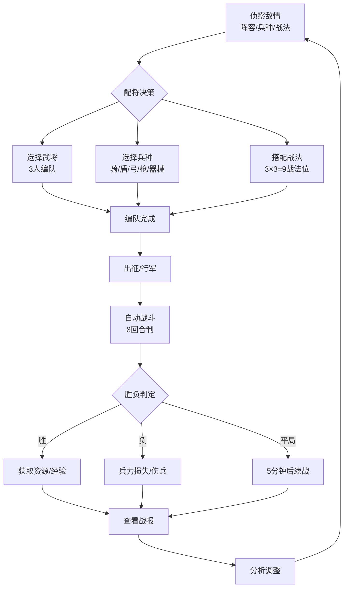
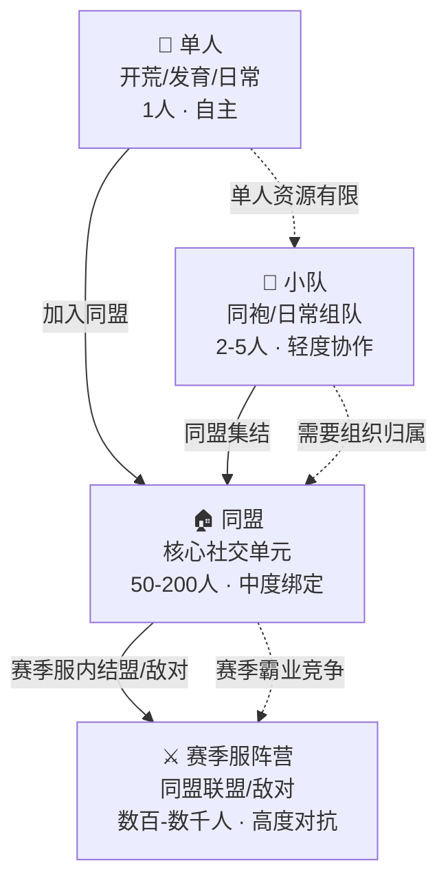

## 一、基本信息

| 项目 | 内容 |
|:-----|:-----|
| **游戏名称** | 三国志战略版 |
| **开发商/发行商** | 灵犀互娱（阿里巴巴旗下）[reference:0] |
| **上线日期** | 2019-09-20[reference:1] |
| **平台** | iOS / Android |
| **底层驱动（主导）** | 数值策略型 |
| **底层驱动（次要）** | 社交经济型 |
| **商业化模式** | 免费+内购（武将抽卡/月卡/赛季通行证）[reference:2] |
| **拆解版本** | [待填写] |
| **拆解日期** | 2026-08-25 |


## 二、拆解侧重点说明

> 根据[[90-2-1-2 底层驱动分类图谱]]和[[90-2-1-3 拆解维度标准SOP]]的权重分配，本篇报告的分析重心如下：

| 维度 | 权重 | 说明 |
|:-----|:----:|:-----|
| 第1层：核心循环（分钟级） | ★★★★ | 战前配将+战中自动战斗的“策略先行”模式是数值策略型游戏的典型形态，需重点拆解兵种克制、战法联动的博弈逻辑 |
| 第2层：成长循环（天/周级） | ★★★★★ | 开荒-发育-打架-赛季重置的循环是赛季制SLG的核心节奏，武将等级/战法点/城建的多轨成长是关键 |
| 第3层：商业化设计 | ★★★★ | 抽卡是核心付费点，需分析“每日半价”机制、大小月卡设计、以及“5+1”保底规则 |
| 第4层：社交结构 | ★★★★★ | 同盟-军团-赛季服的三级结构、攻城战、外交博弈——这是社交经济型游戏的典型战场 |
| 第5层：长线留存机制 | ★★★★ | 赛季重置+新剧本是长线留存的引擎，2-3个月一个赛季的节奏创造了持续的“重新开始”动机 |
| 第6层：美术/UI/信息传达 | ★★★ | 3D沙盘地图、战报系统、配将界面的信息密度管理 |

> **系统视角声明**：本报告采用系统视角，不将游戏的成功或失败归因于单一因素，而是试图描述各要素之间的协同、耦合与相互强化关系。各章节的分析结论将在“第十一章 系统因果分析”中整合为完整的因果网络图。


## 三、第1层：核心循环（分钟级）

> **定义**：玩家在游戏中最基本的“操作-反馈-决策”单元。参考[[90-2-1-3 拆解维度标准SOP#1.3 第1层：核心循环]]。


### 3.1 最小循环描述

《三国志战略版》的战斗采用**自动战斗**模式——玩家不直接操控战斗过程，而是在战前完成所有策略配置，战斗由系统自动结算[reference:3]。

完整的核心循环链条：

**战前阶段（决策层）**：

观察敌情（侦察对方阵容/兵种/战法）→ 评估克制关系 → 选择出战武将 →  
配置兵种（骑/盾/弓/枪/器械）→ 搭配战法（3个武将×3个战法=9个战法位）→  
选择阵法/兵书 → 确认出征

**战中阶段（执行层）**：

部队行军至目标 → 触发战斗 → 系统按回合制自动执行（8回合上限）→  
实时计算伤害/治疗/控制效果 → 胜负判定 → 战报生成


**战后阶段（反馈层）**：

查看战报（详细伤害/治疗/控制数据）→ 分析成败原因 → 调整配将/战法 →  
再次出征


### 3.2 循环结构图


### 3.3 关键参数

|参数|数值|说明|
|---|---|---|
|单场战斗时长|约15-30秒|8回合自动结算，动画可跳过|
|兵种克制关系|骑克盾→盾克弓→弓克枪→枪克骑|循环克制，器械被所有兵种克制|
|单场战斗回合上限|8回合|超时判定平局，5分钟后可续战|
|单次出征部队数|1-3队（随等级解锁）|多线操作空间随成长逐步开放|
|随机元素占比|中|战法发动概率（如35%/45%发动率）、暴击、控制命中率等构成核心随机层|

### 3.4 爽感来源分析

《三国志战略版》的爽感来自“算赢了”而非“打爽了”：

1. **配将成功的“智力快感”**：当你通过兵种克制（骑克盾）和战法联动（如“夺魂挟魄”+“杯蛇鬼车”的组合），用一套“平民阵容”击败了对方“满红大佬”时，产生的是“我比你聪明”的智力优越感。
    
2. **战报数据的“分析快感”**：每场战斗后生成的详细战报（伤害/治疗/控制数据）让玩家可以像数据分析师一样复盘——“这一场我的庞统打出了2.9万伤害”。
    
3. **“一发入魂”的抽卡快感**：每日免费/半价抽卡中抽到核心橙将时，产生的“赌赢了”的多巴胺冲击。
    
4. **攻城拔寨的“集体荣誉”**：同盟攻城战中，数百人同时压秒进攻同一座城池，攻城榜上留下自己的名字——这是一种“我们做到了”的集体快感。
    

### 3.5 潜在疲劳点

1. **“配将-战报-调整”循环的重复感**：每一场战斗都需要重复“侦察-配将-出征-看战报-调整”的流程，在数百次战斗后会形成机械疲劳。
    
2. **战法发动概率的“赌脸”体验**：核心战法往往只有35%-45%的发动概率——“关键回合战法不发动”导致的失败会产生“被系统针对”的挫败感。
    
3. **自动战斗的“失控感”**：玩家无法在战斗中做出即时决策，所有策略在战前已经锁定——当战斗走向不利时，玩家只能“看着自己输”，这种失控感是自动战斗模式的天生缺陷。
    

### 3.6 ← → 与其他层的交互

|关联层|交互关系|
|---|---|
|第2层（成长循环）|核心循环中的战斗胜负直接决定资源获取效率——打赢了获得更多经验/资源，打输了损失兵力（需要时间和资源恢复），胜负效率差距驱动玩家持续投入成长|
|第3层（商业化）|抽卡获得的核心武将直接改变配将池的深度——拥有更多橙将=更多配将可能性=更强的战斗表现，付费与核心循环的“策略空间”直接挂钩|
|第4层（社交结构）|核心循环中的“攻城战”是同盟协作的核心场景——单人的配将能力服务于集体的攻城效率，个人的策略价值在社交场景中被放大|
|第5层（长线留存）|每个新赛季引入的新武将/新战法会重新激活核心循环——玩家需要重新研究配将、重新适应环境，打破了循环的惯性疲劳|
|第6层（UI/信息）|战报系统的数据可视化是核心循环“反馈层”的关键——伤害/治疗/控制的详细拆解让玩家能够精确诊断问题所在|

## 四、第2层：成长循环（天/周级）

> **定义**：玩家在每日/每周时间尺度上的行为模式。参考[[90-2-1-3 拆解维度标准SOP#1.4 第2层：成长循环]]。

### 4.1 每日必做（Daily）

|行为|耗时|奖励|驱动力类型|
|---|---|---|---|
|免费/半价抽卡|1分钟|武将卡（每日1次免费+1次半价）|概率+数值|
|日常任务/活跃度|15-30分钟|经验+资源+金珠|数值+资源|
|征兵/训练|5分钟（操作）|兵力恢复|资源|
|攻城/打架（视战况）|30分钟-数小时|战功+资源+成就感|数值+社交|
|资源建设/科技升级|5-10分钟|资源产出提升|数值|

### 4.2 每周目标（Weekly）

|目标|重置周期|奖励|是否强制|
|---|---|---|---|
|赛季进程推进|赛季周期（2-3个月）|赛季奖励|是（核心内容）|
|同盟攻城|每周数次|金珠+资源+攻城榜排名|否（核心社交）|
|战功积累|每周|赛季贡献排名|否|
|周常任务|每周|金珠+资源|否|

### 4.3 资源循环图

text

[日常任务/抽卡] → [武将/战法] → [配将编队] → [出征战斗]
                                    ↓
[资源建筑/科技升级] ← [战斗获取资源] ← [战斗胜负]
        ↓
[更高级兵种/更多部队] → [更强战斗力] → [更多资源获取]

文字说明：  
《三国志战略版》的资源循环是“双轨并行”——**武将/战法**构成战斗力的“质”的维度（策略深度），**资源/城建**构成战斗力的“量”的维度（兵力/科技）。玩家的日常行为同时产出两种资源：抽卡和任务产出武将/战法（质），城建和资源产出兵力/科技（量）。两者缺一不可——只有好武将没有兵力打不了硬仗，只有兵力没有好武将打不过强敌。

值得注意的是，每个新赛季开启后，玩家的**城池、资源、建筑等级都会全部重置，只有武将和战法得以保留**——这意味着每个赛季都是一次“重新开荒”，玩家的长期积累主要体现在武将池和战法池的深度上。

### 4.4 断档期识别

- **赛季末期**：赛季目标已达成或已无法达成，玩家进入“躺平”状态，等待下赛季重置
    
- **武将池瓶颈期**：抽不到核心武将，配将空间受限，打架打不过→失去动力
    
- **开荒期过渡**：新赛季初期的“重新发育”阶段，资源紧张、兵力不足，部分玩家因开荒压力而流失
    

### 4.5 长线目标

|时间维度|核心目标|进度可视化方式|
|---|---|---|
|1个赛季（2-3个月）|赛季霸业/割据/历战|赛季结算奖励|
|3-6个赛季（6-12个月）|核心武将集齐/主力队成型|武将图鉴 + 战法库|
|1年+|全武将/全战法收集|图鉴完成度|

### 4.6 ← → 与其他层的交互

|关联层|交互关系|
|---|---|
|第1层（核心循环）|成长最直接的反馈是“能打过之前打不过的人了”——武将等级/战法等级提升后，核心循环中的战斗胜率随之提升|
|第3层（商业化）|抽卡是成长的核心入口——付费获得新武将=解锁新的配将可能性=新的成长路径|
|第4层（社交结构）|同盟的攻城节奏决定了个人成长的“时间表”——什么时候打哪座城、什么时候进入哪个资源州，由同盟统一指挥|
|第5层（长线留存）|赛季重置机制让成长循环“定期重启”——每个新赛季，所有玩家回到同一起跑线（武将/战法保留，其他重置），创造了持续的“重新开始”动机|

## 五、第3层：商业化设计

> **定义**：游戏如何将玩家体验转化为收入。参考[[90-2-1-3 拆解维度标准SOP#1.5 第3层：商业化设计]]。

### 5.1 付费入口总览

|付费类型|付费形式|对应心理账户|价格区间|
|---|---|---|---|
|武将抽卡（核心）|金珠抽卡（免费/半价/全价）|“收集武将”+“赌运气”|单抽198金珠/五连948金珠|
|大小月卡|订阅制|“每日领金珠”|30元/月（小月卡）+ 98元/月（大月卡）|
|赛季通行证|赛季购买|“打得多不亏”|约68-128元/赛季|
|首充/累充奖励|一次性|“反正要充”|68元/128元档位|

### 5.2 核心付费路径

《三国志战略版》的商业化路径遵循“**低门槛进入+高深度留存**”的逻辑：

**阶段一：免费/月卡玩家**

- 每日1次免费抽卡 + 1次半价抽卡（99金珠）
    
- 月卡提供稳定的金珠来源（每天领）
    
- 核心驱动力：“慢慢攒，总会有”
    

**阶段二：中氪玩家**

- 购买大小月卡 + 偶尔充值抽卡
    
- 目标：补齐核心武将、组建主力队
    
- 核心驱动力：“差一个武将就能组T0队了”
    

**阶段三：大R玩家**

- 持续充值抽卡，追求“满红”（武将满进阶）
    
- 核心驱动力：“满红和不满红是两个游戏”
    
- 付费上限极高——全武将满红的投入可达数十万元
    

### 5.3 付费深度分析

|维度|数据|说明|
|---|---|---|
|零氪vs满氪战力差距|巨大|满红武将的属性加成远超白板武将|
|单次五连抽价格|948金珠（约94.8元）|648元≈约65抽|
|单橙将期望花费|约200-500元（无保底时）|有“5+1”保底机制（5次普通后必出1个稀有）|
|全武将满红花费|数十万-百万级|无上限|
|是否有付费上限|无限|持续推出新武将|

### 5.4 付费与体验的关系

《三国志战略版》的付费与体验的关系是 **“付费=更大的策略空间”** ：

- 付费抽到更多武将 → 配将池更大 → 可以组更多强力阵容
    
- 付费抽到重复武将 → 武将“进阶”（满红）→ 属性提升 → 战斗中数值更强
    

**关键设计**：付费不直接“购买战斗力”，而是“购买可能性”——你抽到了吕布，不代表你自动变强；你还需要配好战法、选对兵种、搭配合适的队友。这种“付费→可能性→策略→战斗力”的链条，让付费行为被“策略”这一层中介所包裹，降低了“付费=变强”的直接感。

但也因此产生了争议：**“现在的月卡玩家就是给氪佬提供情绪价值，满打满算每天凑够两抽，攒一个稍微上得了台面的队伍，碰见满红幻神立马白给”** 。当付费差距大到策略无法弥补时，平民玩家的体验会受到严重侵蚀。

### 5.5 诱导性设计识别

|设计手法|是否存在|具体表现|
|---|---|---|
|首充双倍/限时优惠|✅|首充双倍金珠 + 累充68/128档位奖励|
|概率展示（保底/随机）|✅|“5+1”保底机制（5次普通后必出稀有）|
|限时卡池/限定武将|✅|S2开始限定武将出现，错过需等复刻|
|沉没成本诱导|✅|抽卡投入的“已经抽了这么多，不能停”的心理|
|社交展示（付费身份的可见性）|✅|满红武将的红色星标在配将界面/战报中可见|

### 5.6 ← → 与其他层的交互

|关联层|交互关系|
|---|---|
|第1层（核心循环）|付费获得的武将/战法直接进入核心循环的“配将池”——更多武将=更多配将可能性=更多策略深度|
|第2层（成长循环）|付费加速成长——抽到核心武将直接改变赛季的发育路径和战斗力上限|
|第4层（社交结构）|付费差距在同盟中创造了“大R主力”和“平民辅助”的分工——大R负责攻坚，平民负责铺路/拆城|
|第5层（长线留存）|每个新赛季推出新武将，持续创造新的付费点和配将需求，驱动大R持续投入|

## 六、第4层：社交结构

> **定义**：游戏如何组织和定义玩家之间的关系。参考[[90-2-1-3 拆解维度标准SOP#1.6 第4层：社交结构]]。

**这是《三国志战略版》的核心层之一——“赛季制SLG”的本质是“社交博弈”。**

### 6.1 社交层级图


### 6.2 同盟——核心社交单元

同盟是《三国志战略版》最核心的社交单元。

|特性|说明|
|---|---|
|**人数上限**|约200人|
|**核心活动**|攻城、资源战、关卡争夺|
|**组织架构**|盟主+副盟主+指挥官+外交官|
|**管理工具**|同盟邮件、法令系统、地图标记|
|**核心目标**|攻取洛阳、一统九州|

**同盟内部的协作机制**：

|协作形式|说明|
|---|---|
|**分工协作**|主力清防部队 + 器械拆城队伍，统一压秒进攻|
|**铺路/协防**|成员间互换分城权限、利用营地驻扎缩短补给线|
|**情报共享**|通过同盟邮件和地图标记系统同步作战指令|
|**夜袭战术**|晚上十点后组织夜袭，或声东击西|

### 6.3 小队——“同袍”单元

|特性|说明|
|---|---|
|**人数**|2-5人|
|**核心活动**|日常组队、协同作战|
|**功能**|共享资源、互相支援|

### 6.4 赛季服——宏观对抗单元

每个赛季服是一个独立的“战场”，多个同盟在其中争夺霸权：

|特性|说明|
|---|---|
|**参与人数**|数百-数千人|
|**核心对抗**|同盟之间的联盟与敌对|
|**赛季目标**|霸业/割据/历战三种结算结果|
|**赛季重置**|赛季结束后，下赛季重新分组|

### 6.5 社交身份的可见性

|身份标识|可见范围|说明|
|---|---|---|
|同盟名称|全服可见|名字前的同盟前缀|
|同盟职位|全服可见|盟主/副盟主/指挥官等|
|攻城榜排名|全服可见|攻城贡献排名|
|武将“满红”标识|战报/配将界面可见|红色星标=满进阶|
|赛季结算称号|全服可见|霸业/割据/历战|

### 6.6 外交与博弈

同盟之间的外交是《三国志战略版》策略深度的最高体现：

- **结盟**：两个同盟达成协议，共享资源、互相支援
    
- **背叛**：赛季中期的“背刺”是常见的戏剧性事件
    
- **情报战**：通过间谍获取敌对同盟的作战计划
    
- **谈判**：城池归属、资源分配、停战协议
    

### 6.7 ← → 与其他层的交互

|关联层|交互关系|
|---|---|
|第1层（核心循环）|攻城战将“个人配将”升级为“集体行动”——个人的战斗胜负影响同盟的攻城进度，同盟的攻城目标决定个人的战斗方向|
|第2层（成长循环）|同盟的科技等级/资源加成直接影响个人成长效率——加入强大的同盟=更快的发育速度|
|第3层（商业化）|同盟中的“大R”承担攻坚主力角色，平民玩家承担铺路/拆城角色——付费差距在社交分工中被“合理化”|
|第5层（长线留存）|同盟社交是《三国志战略版》最强的退出成本——“我的同盟需要我”是玩家留下的首要原因|

## 七、第5层：长线留存机制

> **定义**：游戏如何让玩家在“玩了一个月之后”仍然愿意留下来。参考[[90-2-1-3 拆解维度标准SOP#1.7 第5层：长线留存机制]]。

### 7.1 赛季制——核心长线引擎

《三国志战略版》最核心的长线留存机制是**赛季制**。

|参数|数据|说明|
|---|---|---|
|单赛季时长|2-3个月|每个赛季一个完整“剧本”|
|赛季总数|28个+（截至2026年）|持续推出新剧本|
|赛季结构|S1→S2→S3→PK赛季|前3个赛季为必经阶段|
|PK赛季剧本|三选一|如“英雄露颖”“群雄割据”“赤壁之战”|

**赛季重置机制**：

|保留内容|重置内容|
|---|---|
|武将（含进阶/红度）|城池等级|
|战法（含战法点）|建筑等级|
|装备|资源储量|
|武将等级（部分保留）|科技等级|

每个新赛季开启后，玩家的**城池、资源、建筑等级都会全部重置，只有武将和战法得以保留**。这种设计让每个赛季都是一次“重新开荒”，创造了持续的“重新开始”动机。

### 7.2 内容更新节奏

|更新类型|频率|内容量|说明|
|---|---|---|---|
|新赛季剧本|2-3个月/次|新机制+新武将+新战法|核心内容引擎|
|新武将/新战法|随赛季推出|2-4个新武将|驱动抽卡和配将|
|平衡性调整|不定期|武将/战法数值调整|维持环境活力|

### 7.3 第30天 vs 第180天的留存驱动力

|时间节点|核心驱动力|玩家状态|
|---|---|---|
|第30天（赛季中段）|同盟攻城+赛季进程|处于“为同盟打仗”的社交驱动中|
|第180天（跨2-3个赛季）|新赛季重置+新剧本+新武将|每个赛季都是“重新开始”的动机|

### 7.4 回归机制

|机制|描述|效果评估|
|---|---|---|
|新赛季/新剧本|“又有新内容了”|高——每个新赛季都是回流高峰|
|好友召回|同盟成员邀请回归|高——社交关系是最强召回引擎|
|新武将/新战法|“想试试新阵容”|中——配将玩家的核心动机|
|赛季结算奖励|赛季末发放奖励|中——驱动玩家“打完这个赛季”|

### 7.5 退出成本分析

《三国志战略版》的退出成本极高：

|退出成本类型|说明|
|---|---|
|**时间成本**|数月的赛季投入、开荒积累——“不能白打”|
|**金钱成本**|抽卡投入、月卡投入——“充了这么多钱”|
|**社交成本**|同盟中的角色和责任——“我的同盟需要我”|
|**“再来一赛季”的惯性**|每个赛季结束时的“下赛季重新开始”承诺——总是“再玩一个赛季”|

### 7.6 终局内容

- 赛季霸业争夺——每个赛季的最高荣誉
    
- 全武将/全战法收集——图鉴完成度
    
- 顶级配将——研究“T0阵容”的理论最优解
    
- 同盟管理——担任盟主/指挥官，体验“治国”的乐趣
    

### 7.7 ← → 与其他层的交互

|关联层|交互关系|
|---|---|
|第1层（核心循环）|新赛季引入的新武将/新战法重新激活了配将循环——玩家需要重新研究环境、重新搭配阵容|
|第2层（成长循环）|赛季重置让成长循环“定期归零”——每个赛季都是一次“重新开荒”，创造了持续的“重新开始”动机|
|第3层（商业化）|每个新赛季推出新武将，创造了持续的付费点——玩家为了新赛季的竞争力而持续抽卡|
|第4层（社交结构）|赛季重置后同盟重组——上个赛季的敌人可能成为这个赛季的盟友，社交关系在赛季间流动|

## 八、第6层：美术/UI/信息传达

> **定义**：视觉和界面设计如何服务于“让玩家看懂、融入、不疲倦”。参考[[90-2-1-3 拆解维度标准SOP#1.8 第6层：美术/UI/信息传达]]。

### 8.1 审美调性分析

|维度|描述|是否服务于核心体验|
|---|---|---|
|整体美术风格|3D写实风格，三国题材，沙盘大地图|是——“拟真沙盘”强化了“真实战争”的沉浸感|
|色彩倾向|大地色系为主（绿/褐/黄），城池/军队色彩区分|是——区域视觉编码辅助战略决策|
|角色设计|三国武将写实化，服饰/武器符合历史印象|是——武将辨识度通过视觉编码|
|场景/环境|3D斜面视角大地图，山川/河流/关隘等地理要素|是——地形是战略决策的核心要素|
|UI视觉风格|暗色底框+金色装饰，信息密度中等|是——风格化与功能性的平衡|

### 8.2 UI效率分析

|常用操作|操作步骤数|是否合理|
|---|---|---|
|出征/攻城|3-4步（选部队→选目标→确认）|是|
|配将/换战法|3-5步（进入编队→选武将→选战法→确认）|是（但操作频繁）|
|查看战报|1-2步|是|
|抽卡|1-2步|是|

### 8.3 信息传达效率分析

|信息类型|传达方式|响应速度|是否清晰|
|---|---|---|---|
|部队行军状态|地图上移动的军队模型+行军时间|即时|是|
|城池/关口归属|地图色块+旗帜标识|即时|是——同盟势力范围一目了然|
|战斗结果|战报系统（详细数据）|即时|是——数据维度丰富|
|兵种克制|编队界面兵种图标+克制箭头|即时|是|
|武将状态|体力/兵力/等级|即时|是|

### 8.4 优秀设计与可改进点

**优秀设计（≥3处）**：

1. **3D沙盘地图的视觉编码**：通过地图色块和旗帜标识同盟势力范围，玩家一眼就能判断“这里是谁的地盘”——这是战略决策的核心信息。
    
2. **战报系统的数据深度**：每场战斗生成详细的伤害/治疗/控制数据报表，让玩家能够精确诊断配将问题——“这一场我的庞统打了2.9万伤害”。
    
3. **兵种克制的可视化**：编队界面通过兵种图标和克制箭头清晰展示克制关系，降低了新玩家的学习成本。
    
4. **自由行军机制**：部队到达指定区域后可以继续前往下一个目标地而不是强制返回主城，行军过程中可实时调整方向。
    

**可改进点（≥3处）**：

1. **配将操作的“高频率+多步骤”矛盾**：配将是玩家最频繁的操作之一，但每次调整都需要3-5步——在需要频繁调整阵容的赛季中，操作成本较高。
    
2. **战报信息的“数据过载”**：详细战报提供了海量数据，但新玩家难以快速解读——“这些数字意味着什么？”
    
3. **地图缩放的信息密度管理**：大地图缩放时，关键信息（如部队位置/城池归属）的清晰度会变化，部分情况下信息被遮挡。
    

### 8.5 ← → 与其他层的交互

|关联层|交互关系|
|---|---|
|第1层（核心循环）|3D沙盘地图是“行军”环节的视觉载体——山川/关隘/资源点的可视化呈现是战略决策的视觉基础|
|第2层（成长循环）|战报系统的数据可视化是成长反馈的核心——伤害数字的持续增长是“我变强了”的可视化证据|
|第3层（商业化）|抽卡界面的“金光”特效是付费反馈的关键——橙将出现时的视觉/音效冲击是“赌赢了”的多巴胺触发器|
|第4层（社交结构）|地图色块+旗帜标识是同盟势力范围的视觉化呈现——“我们占了多大地方”是同盟凝聚力的视觉锚点|

## 九、弃坑拐点分析

|阶段|典型流失原因|机制层面是否存在预防设计|
|---|---|---|
|新手期（前1-3天）|开荒节奏慢、资源紧张、不知道配将|新手引导 + 开荒攻略社区支持|
|成长期（第1-2周）|抽不到核心武将、打架打不过|每日免费/半价抽卡 + “5+1”保底|
|成熟期（第1-2月）|同盟战事不利、被压制、失去赛季目标|赛季内可“转服”/下赛季重新开始|
|长线期（3月以上）|赛季结束/新赛季开荒压力|新赛季重置+新剧本的“重新开始”动机|

## 十、横向穿刺锚点

|锚点|本游戏数据|关联专题|
|---|---|---|
|核心循环时长|约15-30秒（单场战斗）||
|每日必做耗时|30-60分钟||
|首充金额/回报率|首充双倍金珠||
|月卡/通行证价格与回报|30元/月+98元/月||
|单橙将期望花费|约200-500元||
|零氪与满氪战力差距|巨大||
|最大社交单元人数|约200人（同盟）|[[90-2-1-21 专题_社交结构金字塔]]|
|赛季重置周期|2-3个月/赛季|[[90-2-1-22 专题_赛季制与版本更新节奏研究]]|
|回归奖励规模|新赛季/新剧本吸引力||
|赛季剧本总数|28个+|[[90-2-1-22 专题_赛季制与版本更新节奏研究]]|

## 十一、系统因果分析

> **本章为必填项，是本报告的核心章节。** 本章将前10章的各层分析整合为一张“系统因果网络图”，标识各要素之间的协同、耦合与相互强化关系。

### 11.1 因果网络图
```
graph TD
    subgraph 入口层["入口层（玩家最先接触的）"]
        A["三国IP<br>（三国志13改编权）[reference:76]"]
        B["SLG品类认知<br>（率土-like用户基础）"]
        C["自由行军机制<br>（区别于传统SLG）[reference:77]"]
    end
    subgraph 核心层["核心层（留住玩家的）"]
        D["配将策略深度<br>（兵种克制/战法联动）"]
        E["同盟社交+攻城<br>（集体目标/归属感）"]
        F["赛季制重置<br>（定期重新开始）[reference:78]"]
    end
    subgraph 放大器层["放大器层（让口碑传播/长线留存的）"]
        G["新赛季/新剧本<br>（内容持续供给）[reference:79]"]
        H["抽卡+5+1保底<br>（付费/概率博弈）[reference:80]"]
        I["同盟外交/背叛<br>（玩家自驱故事）"]
    end
    A --> D
    B --> D
    C --> D
    D --> E
    E --> F
    F --> G
    D --> H
    E --> I
    G -->|"回流"| D
    H -->|"投入"| D
    I -->|"话题"| E
```

**图例说明**：

- **入口层**：玩家通过什么进入游戏/被吸引
    
- **核心层**：玩家为什么持续玩下去
    
- **放大器层**：玩家为什么带朋友来、为什么回流
    
- **实线箭头**：直接因果/支撑关系
    
- **虚线箭头**：反馈强化关系
    

### 11.2 入口/核心/放大器分层说明

|层级|包含要素|作用|
|---|---|---|
|**入口层**|三国IP、SLG品类认知、自由行军机制|降低用户获取成本，制造第一印象|
|**核心层**|配将策略深度、同盟社交+攻城、赛季制重置|创造持续游玩的动机，形成习惯|
|**放大器层**|新赛季/新剧本、抽卡+5+1保底、同盟外交/背叛|驱动口碑传播、社交裂变、长线回流|

### 11.3 必要非充分说明

> **必填项**。明确声明单一因素不足以解释游戏的成功或失败。

**声明**：本报告认为，《三国志战略版》的七年长线运营（2019年上线至今）是以下多因素共同作用的结果：三国IP的文化号召力、SLG品类已验证的用户需求、自由行军机制带来的体验差异化、兵种克制+战法联动的配将策略深度、同盟社交+攻城战的集体归属感、2-3个月赛季制的持续重置动机、以及每个新赛季推出新剧本/新武将的内容供给能力。

其中：

- **配将策略深度**是“留住策略型玩家”的**必要非充分条件**——没有兵种克制和战法联动的深度，游戏只是一款普通的SLG；但仅有策略深度，没有社交结构和赛季制的配合，玩家会在“研究透了”之后离开；
    
- **同盟社交+攻城战**是“留存”的**核心稳定器**——“我的同盟需要我”的情感绑定远超任何个人成就的留存力；
    
- **赛季制重置**是“长线”的**强化因子**——每2-3个月一次的“重新开始”创造了持续的“再来一赛季”动机；
    
- **新赛季/新剧本**是“内容供给”的**放大器**——持续推出的新机制和新武将不断刷新配将环境，防止策略固化。
    

**单一归因警告**：任何将《三国志战略版》的成功归结为单一因素的解释，在本报告的框架下均被视为不完整的分析。

### 11.4 系统脆弱性识别

|脆弱环节|后果|现实案例/假设场景|
|---|---|---|
|付费差距过大|平民玩家失去竞争力→流失→大R失去“碾压对象”→大R也流失|“满红拒马和法官能一人堵着一个盟”的社区反馈|
|赛季内容同质化|玩家对“换皮赛季”产生疲劳→流失|28个赛季剧本中部分被指“换汤不换药”|
|同盟管理压力|盟主/指挥 burnout→同盟解散→连锁流失|大型同盟的管理层“累退”现象|
|新玩家追赶困难|老玩家武将池深不可测→新玩家永远追不上→新血不足|SLG品类的共性难题|

### 11.5 正向循环 vs 恶性循环

**正向循环（增长飞轮）**：

> 新赛季开启 → 玩家回流开荒 → 同盟重组/集结 → 赛季进程推进 → 攻城/打架/外交 → 赛季故事产生 → 社区讨论发酵 → 新玩家被吸引 → 下赛季更多人参战

**恶性循环（衰退螺旋）**：

> 付费差距过大 → 平民玩家体验恶化 → 人口流失 → 同盟人数不足 → 攻城战打不起来 → 赛季内容空洞 → 更多玩家流失 → 生态萎缩 → 大R失去对手 → 大R也流失

## 十二、总结

### 12.1 一句话评价

《三国志战略版》是“数值策略型+社交经济型”的完美融合——它用兵种克制和战法联动的配将深度留住了“策略脑”，用同盟攻城和赛季重置的社交结构留住了“兄弟情”，用2-3个月一赛季的节奏创造了“永远有下一局”的持续动机。

### 12.2 核心发现（3-5条）

1. **“策略先行”的决策-执行分离模式**：自动战斗+战前配将的设计将SLG的策略核心从“操作”转移到“决策”——玩家比拼的不是手速，而是对兵种克制、战法联动、阵容搭配的理解深度。这种设计降低了操作门槛，却提升了策略上限。
    
2. **赛季制作为“永动机”**：每2-3个月一次赛季重置（城池/建筑清零，武将/战法保留），创造了持续的“重新开始”动机——玩家永远不会“毕业”，因为每个赛季都是一次新的开荒。28个赛季剧本的持续供给，让“内容枯竭”被无限推迟。
    
3. **同盟社交作为退出成本**：200人同盟的组织架构、攻城战的集体荣誉、外交博弈的戏剧性——这些社交元素创造了远超个人成就的退出成本。“我的同盟需要我”是玩家留下的首要原因。
    
4. **“付费=策略空间”的商业化模型**：付费不直接购买战斗力，而是购买“更多的配将可能性”——抽到新武将=解锁新阵容=新的策略深度。这种设计让付费行为被“策略”这一层中介所包裹，但也导致了“满红幻神”与平民玩家之间的巨大鸿沟。
    

### 12.3 可借鉴的设计点

1. **“自动战斗+战前配将”的决策-执行分离**：将策略核心从“操作”转移到“决策”，降低了操作门槛，提升了策略上限——适合移动端SLG品类的设计范式
    
2. **赛季制的内容供给模型**：2-3个月一赛季+新剧本/新武将的节奏，创造了持续的“重新开始”动机，是长线运营的经典范式
    
3. **兵种克制的“剪刀石头布”模型**：骑→盾→弓→枪→骑的循环克制，简单易懂但深度无限——玩家永远在“猜对方会出什么”的博弈中
    
4. **同盟外交的玩家自驱内容**：不设计固定的阵营，让玩家自行结盟/背叛——玩家之间的政治博弈本身就是最丰富的内容来源
    

### 12.4 需警惕的陷阱

1. **付费差距的“平民空心化”风险**：当满红武将的属性优势大到策略无法弥补时，平民玩家会加速流失→大R失去“碾压对象”→大R也流失→生态萎缩。这是所有“数值型付费”SLG的终极风险。
    
2. **赛季内容的“换皮化”风险**：28个赛季剧本中，部分被玩家诟病为“换汤不换药”——当新赛季无法提供真正的新鲜感时，赛季制的“重新开始”动机就会失效。
    
3. **同盟管理的“ burnout”风险**：盟主/指挥官需要投入大量时间进行组织协调——当管理层因疲劳而退坑时，整个同盟可能瓦解，引发连锁流失。
    
4. **新玩家追赶的“绝望感”**：老玩家的武将池和战法库深度远超新玩家——新玩家永远在追赶，永远追不上→新血不足→人口老龄化。
    

## 十三、关联笔记

- [[90-2-1-1 拆解总索引_MOC]]
- [[90-2-1-2 底层驱动分类图谱]]
- [[90-2-1-3 拆解维度标准SOP]]
- [[90-2-1-12 梦幻西游_数值成长、经济系统与社交分层的系统协同]]（同为数值策略型，对比“回合制RPG”vs“赛季制SLG”的数值设计差异）
- [[90-2-1-18 逆水寒手游_智能社交、MMO轻量化与长线运营的系统协同]]（同为社交经济型，对比“SLG同盟”vs“MMO帮派”的社交结构差异）
- [[90-2-1-21 专题_社交结构金字塔]]（同盟-小队-赛季服的三级社交结构分析）
- [[90-2-1-22 专题_赛季制与版本更新节奏研究]]（赛季制SLG的赛季重置机制与其他品类对比）
    

## 十四、拆解日志