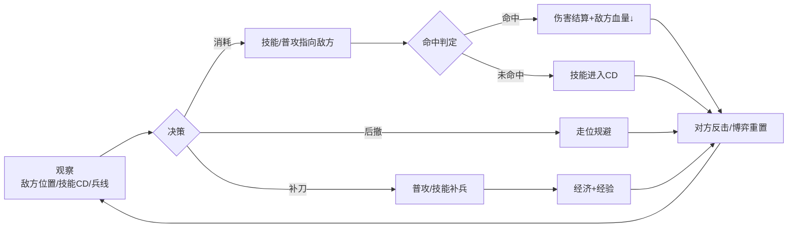

## 一、基本信息

| 项目 | 内容 |
|:-----|:-----|
| **游戏名称** | 王者荣耀（Honor of Kings） |
| **开发商/发行商** | 腾讯天美工作室群 |
| **上线日期** | 2015-11-26 |
| **平台** | iOS / Android |
| **底层驱动（主导）** | 操作心流型 |
| **底层驱动（次要）** | 社交经济型 |
| **商业化模式** | 免费+内购（皮肤/英雄/通行证） |
| **拆解版本** | S45赛季 |
| **拆解日期** | 2026-08-25 |

## 二、拆解侧重点说明

> 根据[[90-2-1-2 底层驱动分类图谱]]和[[90-2-1-3 拆解维度标准SOP]]的权重分配，本篇报告的分析重心如下：

| 维度 | 权重 | 说明 |
|:-----|:----:|:-----|
| 第1层：核心循环（分钟级） | ★★★★★ | 技能前摇/后摇、走位博弈、打击反馈是操作心流的根基，需重点拆解移动端MOBA的操作简化逻辑与手感优化 |
| 第2层：成长循环（天/周级） | ★★★★ | 排位赛的段位系统是每日/每周的核心驱动力，是“再打一局”最直接的动机 |
| 第3层：商业化设计 | ★★★★ | 皮肤是核心付费点，需分析皮肤定价策略、手感差异、通行证模型与“先享付”等创新机制 |
| 第4层：社交结构 | ★★★★★ | 微信/QQ关系链导入、开黑车队、战队系统——社交是王者留存的核心壁垒 |
| 第5层：长线留存机制 | ★★★★ | 赛季重置、新英雄/新版本更新、IP内容化是长线运营的三驾马车 |
| 第6层：美术/UI/信息传达 | ★★★ | 技能特效清晰度、受击反馈、小地图信息密度、操作键位布局 |

> **系统视角声明**：本报告采用系统视角，不将游戏的成功或失败归因于单一因素，而是试图描述各要素之间的协同、耦合与相互强化关系。各章节的分析结论将在“第十一章 系统因果分析”中整合为完整的因果网络图。

## 三、第1层：核心循环（分钟级）

> **定义**：玩家在游戏中最基本的“操作-反馈-决策”单元。参考[[90-2-1-3 拆解维度标准SOP#1.3 第1层：核心循环]]。

### 3.1 最小循环描述

《王者荣耀》的核心微循环为“观察→走位→技能/普攻→判定→反馈→新状态”。单次技能交换的微循环约0.3-1.5秒，取决于英雄技能前摇、弹道速度与玩家反应速度。

以对线期法师与战士换血为例的完整链条：

观察对方位置/技能CD/兵线状态 → 判断是否可消耗 → 走位进入技能射程 → 释放技能（指向性/非指向性）→ 弹道飞行/即时命中 → 命中判定（直接命中/通过小兵/未命中）→ 伤害数字/受击特效弹出 → 血量变化 → 对方反击/走位后撤 → 进入下一次博弈

### 3.2 循环结构图

### 3.3 关键参数

|参数|数值|说明|
|---|---|---|
|单次循环时长|0.3-1.5秒|技能释放+弹道+反馈的完整链路|
|操作到反馈的延迟|约30-60ms（含网络补偿）|天美的延迟补偿技术是关键手感保障|
|循环中的决策点数量|3-5个|走位方向+技能选择+目标选择+召唤师技能+撤退/追击|
|随机元素占比|低（仅暴击）|几乎全部确定性判定，暴击是唯一的数值随机|

### 3.4 爽感来源分析

《王者荣耀》的爽感来源是层次化设计的：

1. **技能命中的即时反馈**：技能命中时的打击音效（如“嘭”的闷响）、伤害数字的彩色弹出（物理为红色/法术为紫色/真实为白色）、敌方血条的瞬间下降——形成了明确的正反馈信号。S45赛季牛魔重做后，一技能投掷斧头命中的反馈经过了专门优化。
    
2. **连招的流畅执行**：一套完整连招的成功打出（如不知火舞的“2技能减速→被动翻滚→1技能击飞→大招推人”），产生“我操作拉满了”的掌控感。赵怀真二技能新增的“受击后0.5秒内可滑步闪避”机制，就是通过操作响应创造连招深度的典型案例。
    
3. **团战的“大招时刻”**：一次完美的大招释放改变了整个战局（如吕布的大招跳中5人、张飞的大招吼退敌方阵型），产生了“英雄主义”的集体快感。
    
4. **击杀播报的仪式感**：击杀时的全屏横幅（“第一滴血！”“双杀！”“三杀！”“四杀！”“五杀！”）、特殊音效（“Pentakill！”）、金币弹窗——三重反馈形成了游戏中最强的多巴胺触发器。

### 3.5 潜在疲劳点

1. **对线期的“精神紧绷”**：高分段对线的每一秒都在进行走位博弈和技能交换，精神高度集中。一局游戏持续15-25分钟，后半程注意力必然下降。
    
2. **逆风局的“慢性死亡”**：当经济差大到无法逆转时，游戏进入“等待被推”阶段，玩家在5-10分钟里失去任何正反馈。
    
3. **英雄手感差异的“认知成本”**：王者有120+英雄，每个英雄的技能前摇/后摇/弹道速度都不同。切换英雄时需要重新适应手感，对新玩家的学习成本极高。S45赛季对戈娅的改动就是典型案例——移除原有攻速限制，手感全面优化，一技能新增穿墙与落地移速加成。

### 3.6 ← → 与其他层的交互

|关联层|交互关系|
|---|---|
|第2层（成长循环）|每局对战的胜负影响排位段位星数，星数驱动“再打一局”的冲动——核心循环的质量（对线表现/团战发挥）直接决定胜负概率|
|第3层（商业化）|皮肤通过“手感差异”（如不同皮肤的普攻弹道/技能特效/音效）间接影响核心循环的体验，形成了“付费影响手感”的心理账户|
|第4层（社交结构）|核心循环中存在明确的“分路系统”（对抗路/打野/中路/发育路/游走）——5人分工协作，个人的核心循环质量影响团队整体战斗力，社交压力驱动个人精进操作|
|第5层（长线留存）|新英雄上线本质上是“新一套核心循环的解锁”——玩家为了体验新机制/新连招而回归|
|第6层（UI/信息）|技能命中/受击的反馈通过“伤害数字+音效+屏幕震动+血条变化”四重通道传达，确保玩家在团战混战中依然能感知自己的操作结果|

## 四、第2层：成长循环（天/周级）

> **定义**：玩家在每日/每周时间尺度上的行为模式。参考[[90-2-1-3 拆解维度标准SOP#1.4 第2层：成长循环]]。

### 4.1 每日必做（Daily）

|行为|耗时|奖励|驱动力类型|
|---|---|---|---|
|排位赛（核心行为）|15-25分钟/局|段位星数|数值+社交|
|每日任务/活跃度|1-3局|金币+铭文碎片+战令经验|资源|
|战令任务（赛季期间）|1-3局|战令经验+代币|数值+内容|

### 4.2 每周目标（Weekly）

|目标|重置周期|奖励|是否强制|
|---|---|---|---|
|排位段位提升|赛季重置|赛季皮肤+钻石奖励|否（但为核心驱动力）|
|战令等级|赛季周期|皮肤+道具|否|
|每周任务|每周|战令经验|否|

### 4.3 资源循环图

text

[对局胜利] → [星数+1] → [段位晋升] → [赛季结算奖励] → [下赛季段位继承]
       ↓
[对局失败] → [星数-1] → [段位保护/掉星] → [再打一局]
       ↓
[每局结束] → [金币/铭文碎片] → [购买英雄/铭文] → [更多英雄选择]

文字说明：  
《王者荣耀》的资源循环是“双轨制”——一轨是“段位/星数”（玩家的身份标识，赛季重置），另一轨是“金币/铭文/皮肤碎片”（玩家的物品积累，长期累积）。段位是核心驱动力，物品是辅助驱动力。赛季重置让段位轨在每三个月左右“归零”，保证了长期的“重玩性”。S44赛季后，段位重置规则进一步调整——王者以下段位统一回落至铂金区间，荣耀50星以下回落至钻石分段，高分段新增60星、80星档位。

### 4.4 断档期识别

- 赛季末：当前段位已达成“目标段位”，且知道星数在赛季结束后会被重置 → “躺平期”
    
- 大版本更新前的“稳定期”：游戏环境已无新变化，玩家等待新英雄/新版本 → 活跃度自然下滑
    

### 4.5 长线目标

|时间维度|核心目标|进度可视化方式|
|---|---|---|
|1个赛季（约3个月）|达到目标段位（如钻石→星耀）|段位徽章+星数|
|2-3个赛季（6-9个月）|段位提升1-2个大段|赛季历程数据+王者印记|
|1年+|荣耀王者/巅峰赛高排名|全服排名+荣耀印记（每赛季首次登上荣耀段位增加一颗，每年最多四颗）|

### 4.6 ← → 与其他层的交互

|关联层|交互关系|
|---|---|
|第1层（核心循环）|段位是核心循环质量的“统计学汇总”——你打了100局，赢了60局，段位就是“你的水平”的外化表现|
|第3层（商业化）|战令将“对局量”转化为“付费回报”——你打得越多，战令的价值越高，形成“不能亏”的心理|
|第4层（社交结构）|段位是社交身份的核心标识——“你是什么段位？”是玩家社交的第一问|
|第5层（长线留存）|赛季重置是长线留存的最强机制——每个赛季初，“一切重来”的冲动驱动大量回流|

## 五、第3层：商业化设计

> **定义**：游戏如何将玩家体验转化为收入。参考[[90-2-1-3 拆解维度标准SOP#1.5 第3层：商业化设计]]。

### 5.1 付费入口总览

|付费类型|付费形式|对应心理账户|价格区间|
|---|---|---|---|
|皮肤|直购（点券）/抽奖|“我喜欢这个英雄”+“社交展示”|28-288元（传说/荣耀典藏）|
|英雄解锁|直购（点券）/金币|“我想玩这个新英雄”|6-68元|
|战令（赛季通行证）|赛季购买|“我打得多，买了不亏”|188点券（S42起调整）|
|积分夺宝|抽奖|“赌运气”|不确定|
|星传说皮肤“先享付”|分期/订阅|“低门槛体验”|300星币/月|

### 5.2 核心付费路径

玩家转化路径：

免费玩家（靠金币慢慢攒英雄）→ 遇到特别喜欢的英雄/皮肤 → 首次充值（“反正就6块钱”）→ 发现战令很划算 → 赛季战令购买 → 逐渐习惯“每个赛季花一笔钱” → 大节日/限定皮肤 → 冲动消费

**值得关注的新模式——“先享付”** ：

S43赛季推出的“星传说皮肤先享付”机制，颠覆了传统皮肤销售的“全款买断”模式。玩家无需一次性掏出约3000星币的“巨款”，只需支付300星币（约十分之一），即可先行拥有皮肤一个月的时间。这种模式将皮肤销售从“低频高额”的耐用品模式，转型向“高频小额”的订阅制快消品模式。

在玩家舆论场中，支持者认为这降低了尝试门槛，给冲动消费玩家一个冷静期；反对者则担忧“超前消费”的思维可能带来负面影响。

### 5.3 付费深度分析

|维度|数据|说明|
|---|---|---|
|零氪vs满氪战力差距|**无差距（仅英雄池+皮肤差异）**|皮肤不提供数值加成，英雄可通过金币获取|
|单个皮肤花费|28-288元|多数皮肤在50-90元区间|
|全皮肤收集花费|约10-20万元（估算）|持续更新的皮肤池|
|是否有付费上限|无限|持续推出新皮肤|

### 5.4 付费与体验的关系

《王者荣耀》的付费设计采用“纯粹的外观变现”——皮肤不改变数值，只在视觉效果/音效/回城动画/技能特效上做文章。这保证了“付费不影响核心循环的公平性”，但也意味着皮肤的设计质量必须足够高（手感差异、视觉升级、主题契合），才能驱动玩家付费。

值得注意的是，不同皮肤确实存在“手感差异”——如部分英雄的限定皮肤普攻弹道更流畅、技能动画更清晰、打击音效更厚重。这种差异虽然不改变伤害数值，但通过“视觉清晰度”和“操作感受”间接影响了核心循环体验。

**IP联动与文化内容作为付费驱动力**：2026年Q1，《王者荣耀》流水再创新高，腾讯财报将其归因于两点——一是“以中国水墨画和古丝绸之路文化为灵感的顶级皮肤”，二是“针对不同玩家群体的发行策略”。马年限定皮肤以“路启千秋”为主题，围绕丝绸之路进行创作，六款英雄皮肤分别对应三条丝路的文化节点。这种“文化表达深度”的持续发力，成为驱动付费增长的核心引擎。

### 5.5 诱导性设计识别

|设计手法|是否存在|具体表现|
|---|---|---|
|首充双倍/限时优惠|✅|首充双倍点券（各档位一次）|
|概率展示（保底/随机）|✅|积分夺宝有概率公示+荣耀水晶保底|
|限时卡池/限定皮肤|✅|节日限定/年限皮肤（“错过等一年”）|
|沉没成本诱导|✅|战令购买了就必须打满才“不亏”|
|社交展示（付费身份的可见性）|✅|皮肤在加载界面/游戏内的“身份标识”|

### 5.6 ← → 与其他层的交互

|关联层|交互关系|
|---|---|
|第1层（核心循环）|皮肤通过视觉/音效/手感差异间接影响核心循环体验——虽然不改变数值，但让“释放技能”的感知不同|
|第2层（成长循环）|战令将“对局量”转化为“付费回报”——你打得越多，战令的价值越高，形成“不能亏”的心理|
|第4层（社交结构）|皮肤在加载界面/游戏中的可见性使其成为“社交身份”的展示品——用限定皮肤=“我投入了”的心理暗示|
|第5层（长线留存）|皮肤收藏创造了“非竞技”的留存动机——即使不打排位，也会上线看看新皮肤|

## 六、第4层：社交结构

> **定义**：游戏如何组织和定义玩家之间的关系。参考[[90-2-1-3 拆解维度标准SOP#1.6 第4层：社交结构]]。

**这是《王者荣耀》最强的壁垒层——社交结构是王者“不可复制”的核心竞争力。**

### 6.1 社交层级图

graph TD
    A[👤 单人排位 独立匹配 1人 · 随机队友] 
    B[👥 开黑车队 固定队友 2-5人 · 轻度绑定]
    C[🏠 战队 集体组织 5-150人 · 中度绑定]
    D[🌐 微信/QQ关系链 现实社交导入 数十-数百人 · 深度绑定]
    A -->|互加好友| B
    B -->|战队招募| C
    C -->|社交链导入| D
    
    A -.->|单排孤独感| B
    B -.->|固定队形成| C
    C -.->|熟人社交扩散| D

### 6.2 微信/QQ关系链——最核心的社交壁垒

《王者荣耀》采用了**双好友制**——QQ好友和游戏好友共存。这种设计让游戏的社交网络直接建立在玩家已有的熟人关系之上：

- 打开游戏即可看到微信/QQ好友中谁在线、谁在游戏中、谁可以邀请
    
- 好友的战绩、英雄熟练度、登录时间等信息一览无余
    
- 开黑车队支持微信/QQ一键建群，助力更好沟通
    

**这一设计的战略意义**：玩家留下的原因不仅是“游戏好玩”，更是“我的朋友都在这里”。当游戏与玩家的现实社交网络重叠时，退出成本被无限放大。

### 6.3 开黑车队——最小社交单元

2024年S34赛季上线的“开黑车队”功能，将玩家自发组织的“开黑群”产品化：

|特性|说明|
|---|---|
|**人数上限**|每个车队50人|
|**同时加入数**|玩家可同时在5个不同车队|
|**核心功能**|车队内可即时了解彼此的组队状态并实现一键上车|
|**沟通工具**|支持微信/QQ一键建群|

### 6.4 战队系统——中观社交单元

战队是《王者荣耀》社交系统的第二大核心：

|特性|说明|
|---|---|
|**创建成本**|50点券|
|**核心机制**|成员通过实时对抗获取竞技点，帮助战队升级|
|**战队福利**|金币加成buff（1级10%→满级50%）|
|**战队商店**|可用战队币兑换体验皮肤|
|**排名结算**|赛季末根据战队排名发放金币奖励|

### 6.5 社交身份的可见性

|身份标识|可见范围|说明|
|---|---|---|
|段位徽章|全服可见|加载界面/好友列表/生涯页面|
|皮肤/特效|全服可见|加载界面/游戏内模型|
|战队名称|全服可见|名字前的战队前缀|
|王者印记|个人/好友可见|每赛季首次登上荣耀段位获得一颗|
|荣耀称号|全服可见|省标/市标/区标|

### 6.6 负面社交处理

- 挂机/送人头检测：自动检测+举报系统，验证后扣信誉分
    
- 辱骂/消极言论：实时检测+赛后举报，验证后禁言/封号
    
- 演员/故意输：S44赛季升级了对局信誉与评分体系——恶意连体、躲后排混分、无效吃线会被精准判定扣分
    

### 6.7 ← → 与其他层的交互

|关联层|交互关系|
|---|---|
|第1层（核心循环）|5v5团队结构要求5个玩家承担不同角色——你的核心循环执行质量直接决定团队胜负，团队胜负反过来影响你的段位|
|第2层（成长循环）|开黑车队的胜率通常高于单排——社交关系（配合默契）直接影响段位成长速度|
|第3层（商业化）|皮肤是“社交身份”的可视化展品——队友/对手都能看到你用的是什么皮肤，构成“面子消费”的驱动力|
|第5层（长线留存）|微信/QQ关系链是最强的退出成本——“我的朋友都在这里玩”是王者最不可复制的壁垒|

## 七、第5层：长线留存机制

> **定义**：游戏如何让玩家在“玩了一个月之后”仍然愿意留下来。参考[[90-2-1-3 拆解维度标准SOP#1.7 第5层：长线留存机制]]。

### 7.1 内容更新节奏

|更新类型|频率|内容量|说明|
|---|---|---|---|
|新赛季|约3个月/次|段位重置+新皮肤+系统调整|核心留存引擎|
|新英雄|约1-2个月/个|新英雄+伴生皮肤|S45赛季推出文化向英雄王维|
|大型版本|不定期|英雄重做+系统大改|S45对牛魔/戈娅/夏侯惇等老英雄重做|
|英雄重做|随版本|机制调整+手感优化|持续迭代老英雄体验|
|节日/联动活动|月/季|限定皮肤+活动奖励|春节/周年庆等|

### 7.2 第30天 vs 第180天的留存驱动力

|时间节点|核心驱动力|玩家状态|
|---|---|---|
|第30天|段位驱动+新英雄/新版本|处于“提升段位”的正向循环中|
|第180天|社交关系链+赛季目标+IP内容|微信/QQ好友在玩+赛季皮肤目标|

### 7.3 回归机制

|机制|描述|效果评估|
|---|---|---|
|新赛季/新版本|“重新开始”的冲动|极高——每个新赛季都是回流高峰|
|新英雄/新皮肤|“想试试新内容”|高——文化向英雄（如王维）吸引特定玩家|
|好友召回|微信/QQ好友邀请|极高——熟人社交是最强召回引擎|
|赛季皮肤|排位赛达到黄金段位即送|中——驱动轻度玩家“打上黄金”|

### 7.4 退出成本分析

《王者荣耀》的退出成本极高，且**分层设计**：

|退出成本类型|说明|
|---|---|
|**社交成本**|微信/QQ好友都在玩——“我不玩了，谁跟我开黑？”|
|**段位/成就资产**|“我花了一年打到王者”——段位是身份的一部分|
|**皮肤收藏**|“我充了这么多钱买的皮肤”——沉没成本极高|
|**技术记忆**|“我知道所有英雄的技能和连招”——学习曲线的时间成本|
|**赛季惯性**|“再玩一个赛季就上王者了”——永远有“下一个赛季”的承诺|

### 7.5 IP内容化——长线留存的新引擎

近些年，《王者荣耀》在内容上的投入越做越重，“做内容”这件看似不属于MOBA的事，被做成了最厚的护城河。

|内容形式|说明|
|---|---|
|**文化皮肤**|马年限定“路启千秋”串联丝绸之路文化脉络|
|**平行世界观**|“墨染江湖”系列在平行世界线上补充英雄故事|
|**赛年叙事**|长安赛年首次提供深度完整的IP世界观|
|**跨界联动**|与刘慈欣合作的“琥珀纪元”平行世界CG|

### 7.6 终局内容

- 荣耀王者/巅峰赛高排名——顶端段位的竞争永无止境
    
- 全皮肤/全英雄收集——持续更新的收藏池
    
- KPL赛事观赛+战队粉丝——“我支持这支队伍”的身份认同
    

### 7.7 ← → 与其他层的交互

|关联层|交互关系|
|---|---|
|第1层（核心循环）|新英雄/新版本本质上是“核心循环的变化”——新机制带来了新的“学习期”，打破循环的惯性疲劳|
|第2层（成长循环）|赛季重置是长线留存的核心机制——“段位归零”让老玩家从“已经毕业”回到“重新爬坡”|
|第3层（商业化）|新英雄发布同时推送皮肤——英雄的“新机制好奇心”是皮肤销售的内容前提|
|第4层（社交结构）|微信/QQ关系链是最强的留存引擎——“朋友在玩”比任何游戏内容都更能留住玩家|

## 八、第6层：美术/UI/信息传达

> **定义**：视觉和界面设计如何服务于“让玩家看懂、融入、不疲倦”。参考[[90-2-1-3 拆解维度标准SOP#1.8 第6层：美术/UI/信息传达]]。

### 8.1 审美调性分析

|维度|描述|是否服务于核心体验|
|---|---|---|
|整体美术风格|东方奇幻+现代混搭，色彩饱和，角色风格化|是——角色辨识度优先于写实|
|色彩倾向|亮区与暗区对比鲜明（战争迷雾系统）|是——视觉信息辅助战略决策|
|角色设计|120+英雄各有独特轮廓/配色/动作|是——团战中0.1秒识别敌方英雄是核心能力|
|场景/环境|王者峡谷“三条路”结构+野区，地形清晰|是——地图结构辅助战略记忆|
|UI视觉风格|暗色底框+金色装饰，信息密度适中|是——移动端信息密度需克制|

### 8.2 UI效率分析

|常用操作|操作步骤数|是否合理|
|---|---|---|
|释放技能|1步（点击技能按钮）|是|
|查看计分板|1步|是|
|发送信号|1-2步（拖拽/点击）|是|
|查看技能CD|1步（目视技能图标）|是|

### 8.3 信息传达效率分析

|信息类型|传达方式|响应速度|是否清晰|
|---|---|---|---|
|技能释放/命中|技能特效+伤害数字+音效|即时|是|
|技能冷却|图标“遮罩”+数字倒计时|即时|是|
|敌方位置|小地图头像+战争迷雾边界|即时|是|
|击杀/助攻|屏幕中央横幅+音效|即时|是|
|低血量警告|屏幕边缘红色脉动+角色喘息|即时|是|

### 8.4 优秀设计与可改进点

**优秀设计（≥3处）**：

1. **战争迷雾+小地图的“信息不对称”设计**：视野控制本身就是策略的一部分——信息是全图可见还是受限，决定了进攻/防守的决策逻辑
    
2. **“击杀播报”的仪式感**：击杀时的全屏横幅、音效、特殊播报——三重反馈形成了完整的多巴胺触发器
    
3. **技能特效的“可读性”**：每个英雄的技能有独特的颜色/形状编码，在团战中可快速识别
    
4. **低血量状态的多通道预警**：屏幕边缘红色脉动+角色喘息声+血条闪烁，确保玩家在激烈战斗中不会忽略自身状态
    

**可改进点（≥3处）**：

1. **新手引导的信息过载**：需要同时理解英雄技能/装备/地图/视野/分路——5个系统同时压上来，新玩家的认知负担极高
    
2. **装备系统的“闭卷考试”**：新玩家无法在游戏中快速理解“该出什么装备”——需要外部攻略支持
    
3. **部分英雄技能特效的“视觉噪音”**：在大型团战中，10个英雄的技能同时释放，特效重叠导致看不清谁放了什么
    

### 8.5 ← → 与其他层的交互

|关联层|交互关系|
|---|---|
|第1层（核心循环）|战争迷雾决定了核心循环的“信息输入”——是基于“可见信息”还是“不可见信息”做决策，直接改变了循环的决策逻辑|
|第2层（成长循环）|击杀播报的仪式感将“单次击杀”升级为“全局事件”，让“我变强了”的感知不仅属于自己，也属于9个其他玩家|
|第3层（商业化）|皮肤对技能特效的修改需要保持在“可读性”范围内——如果玩家认不出这是什么技能，就会直接影响核心循环的公平性|
|第4层（社交结构）|小地图上的信号系统是社交协作的核心工具——三组信号支撑了队友之间的无声沟通|

## 九、弃坑拐点分析

|阶段|典型流失原因|机制层面是否存在预防设计|
|---|---|---|
|新手期（前1-3天）|操作复杂+英雄/装备不熟悉+队友负面体验|人机模式/训练模式——但仍有大量新手被劝退|
|成长期（第1-2周）|排位定级结果低于预期、连败挫败感|段位保护卡+加星卡机制|
|成熟期（第1-2月）|卡在某个段位无法突破、匹配机制争议|段位保护分+“主段位副能力分”新算法|
|长线期（3月以上）|赛季末期“躺平”、社交疲劳|新英雄/新赛季/新皮肤是核心回流引擎|

## 十、横向穿刺锚点

|锚点|本游戏数据|关联专题|
|---|---|---|
|核心循环时长|0.3-1.5秒（单次技能交换）||
|每日必做耗时|约1-3局排位（15-75分钟）||
|首充金额/回报率|首充双倍点券||
|战令价格|188点券/赛季（S42起）||
|单皮肤期望花费|28-288元||
|零氪与满氪战力差距|无差距（皮肤不提供数值）||
|最大社交单元人数|50人（开黑车队）/150人（战队）|[[90-2-1-21 专题_社交结构金字塔]]|
|赛季重置周期|约3个月/赛季|[[90-2-1-22 专题_赛季制与版本更新节奏研究]]|
|回归奖励规模|新赛季/新英雄/新皮肤吸引力||
|DAU/MAU|DAU 1.39亿+ / MAU 2.6亿+||

## 十一、系统因果分析

> **本章为必填项，是本报告的核心章节。** 本章将前10章的各层分析整合为一张“系统因果网络图”，标识各要素之间的协同、耦合与相互强化关系。

### 11.1 因果网络图

graph TD
    subgraph 入口层["入口层（玩家最先接触的）"]
        A["移动端MOBA （随时随地开黑）"]
        B["微信/QQ社交导入 （朋友都在玩）"]
        C["英雄人设+视觉 （“你想玩谁？”）"]
    end
    subgraph 核心层["核心层（留住玩家的）"]
        D["操作手感+对局深度 （技能前摇/走位博弈）"]
        E["开黑社交关系 （固定车队/语音沟通）"]
        F["段位目标驱动 （排位星数/赛季目标）"]
    end
    subgraph 放大器层["放大器层（让口碑传播/长线留存的）"]
        G["皮肤审美+手感差异 （付费/社交展示）"]
        H["KPL赛事+直播生态 （职业选手/主播）"]
        I["赛季重置+IP内容化 （新赛季/文化皮肤）"]
    end
    A --> D
    B --> E
    C --> E
    D --> F
    E --> F
    D --> G
    F --> H
    E --> I
    G -->|"社交展示"| E
    H -->|"回流"| D
    I -->|"回流"| D

**图例说明**：

- **入口层**：玩家通过什么进入游戏/被吸引
    
- **核心层**：玩家为什么持续玩下去
    
- **放大器层**：玩家为什么带朋友来、为什么回流
    
- **实线箭头**：直接因果/支撑关系
    
- **虚线箭头**：反馈强化关系
    

### 11.2 入口/核心/放大器分层说明

|层级|包含要素|作用|
|---|---|---|
|**入口层**|移动端MOBA、微信/QQ社交导入、英雄人设+视觉|降低用户获取成本，制造第一印象|
|**核心层**|操作手感+对局深度、开黑社交关系、段位目标驱动|创造持续游玩的动机，形成习惯|
|**放大器层**|皮肤审美+手感差异、KPL赛事+直播生态、赛季重置+IP内容化|驱动口碑传播、社交裂变、长线回流|

### 11.3 必要非充分说明

> **必填项**。明确声明单一因素不足以解释游戏的成功或失败。

**声明**：本报告认为，《王者荣耀》的十年长青是以下多因素共同作用的结果：移动端MOBA的品类红利、微信/QQ关系链的社交导入、移动端操作手感优化（前摇/后摇/延迟补偿）、英雄人设的差异化设计（“你想玩谁？”的偶像投射）、段位目标驱动的每日/每周循环、皮肤商业化的外观变现模型、KPL赛事体系的生态反哺、以及IP内容化（文化皮肤/赛年叙事）的长线内容供给。

其中：

- **微信/QQ社交导入**是“用户获取”的**必要非充分条件**——没有熟人社交网络，王者无法在初期实现病毒式增长；但仅有社交导入，没有移动端操作手感的优化和MOBA品类的适配，社交也无法转化为留存；
    
- **操作手感+对局深度**是“留存”的**核心稳定器**——玩家留下的首要原因是“好玩”（技能释放流畅、走位博弈有深度），而非“朋友在玩”。但仅有手感，没有段位目标和社交生态的配合，玩家会在“玩腻了”之后离开；
    
- **KPL赛事+直播生态**是“传播力”的**放大器**——它将“玩游戏”升级为“看比赛”，将“普通玩家”升级为“战队粉丝”，创造了远超游戏本身的关注度；
    
- **赛季重置**是“长线”的**强化因子**——每3个月一次的段位归零创造了持续的“再来一赛季”动机；
    
- **皮肤+IP内容化**是“商业化”的**增强因子**——在不破坏核心循环公平性的前提下，通过文化表达和情感共鸣驱动持续付费。
    

**单一归因警告**：任何将《王者荣耀》的成功归结为单一因素的解释，在本报告的框架下均被视为不完整的分析。

### 11.4 系统脆弱性识别

|脆弱环节|后果|现实案例/假设场景|
|---|---|---|
|匹配机制失衡（ELO争议）|玩家感知“系统在针对我”→挫败感→弃坑|玩家发起“中国游戏算法诉讼第一案”|
|微信/QQ关系链断裂|社交退出成本消失→组队动力消失→连锁流失|好友集体AFK时的“雪崩”效应|
|英雄平衡性崩坏|少数版本英雄统治排位→对局策略单一→核心玩家厌倦|特定版本“射手荣耀”“坦克荣耀”的争议|
|皮肤定价争议|“皮肤越来越贵”的舆论→付费意愿下降|“先享付”模式引发的争议|

### 11.5 正向循环 vs 恶性循环

**正向循环（增长飞轮）**：

> 操作手感好+英雄有趣 → 我带朋友来玩 → 开黑车队形成 → 共同上分目标 → 社交绑定加固 → 段位越高越不想走 → 看KPL比赛又想打 → 新赛季重置又有了目标 → 老玩家回流+新玩家入坑

**恶性循环（衰退螺旋）**：

> 匹配机制失衡 → 对局体验下降 → 用户流失 → 匹配池缩小 → 对局质量进一步下降 → 流失加速 → 社区负评 → 新用户不敢入坑

## 十二、总结

### 12.1 一句话评价

《王者荣耀》的成功不是“MOBA品类+腾讯流量”的简单叠加，而是“移动端操作手感优化+熟人社交关系链+赛季制目标驱动+IP内容化长线供给”四者系统性耦合的结果——它用十年时间，从一款MOBA手游进化为了一个国民级社交平台。

### 12.2 核心发现（3-5条）

1. **“移动端MOBA的操作简化”是手感护城河**：王者不是简单地把端游MOBA搬到手机上，而是重新设计了操作逻辑——双摇杆、智能施法、技能前摇/后摇的移动端适配。天美的延迟补偿技术让全球玩家在差异网络环境下感受到“一致的响应”。S45赛季对牛魔、戈娅等老英雄的重做，证明了对“手感”的持续打磨是王者产品力的根基。
    
2. **微信/QQ关系链是退出的最高壁垒**：王者最不可复制的设计，不是英雄技能，不是地图机制，而是“打开游戏就能看到微信/QQ好友谁在线”的社交导入。当游戏与玩家的现实社交网络重叠时，退出成本被无限放大。2025年王者国服DAU突破1.39亿、全球MAU超2.6亿——这些数字背后是“每5个游戏玩家中就有1人每天打开王者”的社交密度。
    
3. **“赛季重置”是最简洁的长线留存工具**：用每3个月一次的段位归零解决了“游戏内容总会消耗完”的难题——不需要每年出资料片，只需要重置段位星数，玩家就会自发回来“重新证明自己”。S42赛季引入“主段位副能力分”新算法后，段位差5星以内的对局占比从66.8%升至99.6%。
    
4. **“皮肤+IP内容化”的商业化转型**：从单纯的“卖外观”升级为“卖文化表达”。马年限定“路启千秋”以丝绸之路为主题，“墨染江湖”以水墨风和中国传统乐器为切入点——皮肤不再是数值道具，而是文化载体和情感共鸣的媒介。2026年Q1流水再创新高，正是这一策略的验证。
    

### 12.3 可借鉴的设计点

1. **“微信/QQ关系链导入”的社交模型**：让游戏的社交网络直接建立在玩家已有的熟人关系之上——这是王者最不可复制的设计，也是所有社交类游戏可参照的最高范式
    
2. **“皮肤+手感”的耦合模式**：王者证明了“付费不影响公平性”是可行的——皮肤的特效/音效差异创造了“手感不同”的感知，但不改变数值本身。“先享付”模式进一步降低了顶级皮肤的体验门槛，将“低频高额”的耐用品转型为“高频小额”的订阅制
    
3. **“英雄不是技能，是人设”**：王者120+英雄的设计证明，“我玩谁”比“我玩什么技能组合”更具情感驱动力——这是IP思维在MOBA领域的最佳实践
    
4. **“赛季重置”作为内容引擎**：用最轻量级的机制（段位重置）创造了最持久的内容更新感——不需要开发新地图，只需要重置星数，就能让玩家觉得“新赛季开始了”
    
5. **“先享付”的商业化创新**：用分期/订阅模式降低顶级皮肤体验门槛，创造“即时满足”而非“漫长积攒”——这是手游商业化从“耐用品”向“快消品”转型的前沿探索
    

### 12.4 需警惕的陷阱

1. **匹配机制的“公平性信任危机”**：ELO机制长期被玩家诟病为“系统安排胜负”——“每当拿到MVP，下一局必匹配到练英雄的队友”被戏称为“ELO税”。2025年甚至有律师起诉腾讯要求公开匹配算法。S42赛季推出的“主段位副能力分”新算法是对这一危机的回应，但信任修复需要时间。
    
2. **皮肤经济的“通胀压力”**：持续推出新皮肤稀释了“稀有”的感知——早年“凤求凰”被视为传奇皮肤，现在每年推出数十款新皮肤，单个皮肤的感知价值在下降。“先享付”模式虽然降低了门槛，但也可能进一步稀释顶级皮肤的“稀缺性”认知。
    
3. **新玩家的“知识壁垒”在持续长高**：120+英雄×4个技能×100+件装备×地图理解=新玩家的学习成本远超十年前。这对“源源不断的新用户”构成了天然门槛。
    
4. **IP内容化的“边际效应递减”**：文化皮肤和赛年叙事在初期带来了巨大的口碑和付费回报，但随着投入越来越重，玩家的“审美疲劳”可能随之而来——文化表达需要持续创新，不能依赖同一套模板。
    

## 十三、关联笔记

- [[90-2-1-1 拆解总索引_MOC]]
    
- [[90-2-1-2 底层驱动分类图谱]]
    
- [[90-2-1-3 拆解维度标准SOP]]
    
- [[90-2-1-9 英雄联盟_操作博弈、赛季运营与电竞生态的系统协同]]（同为MOBA，对比“端游MOBA”vs“手游MOBA”的操作简化和社交重构）
    
- [[90-2-1-21 专题_社交结构金字塔]]（开黑车队-战队-微信关系链的社交层级分析）
    
- [[90-2-1-22 专题_赛季制与版本更新节奏研究]]（赛季重置机制在MOBA品类中的作用）