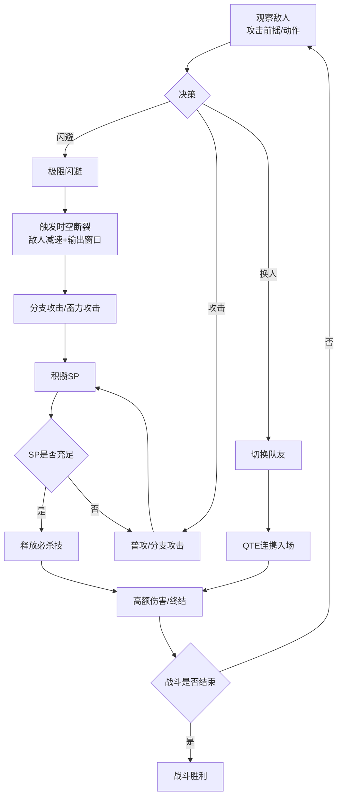
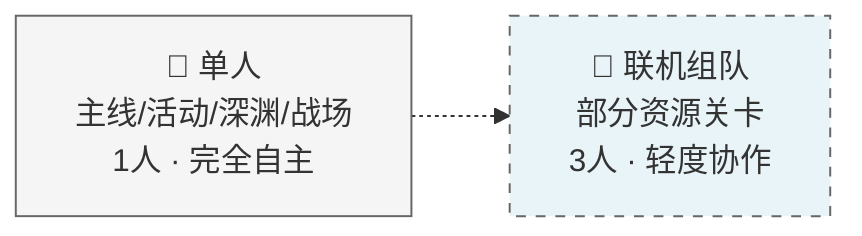
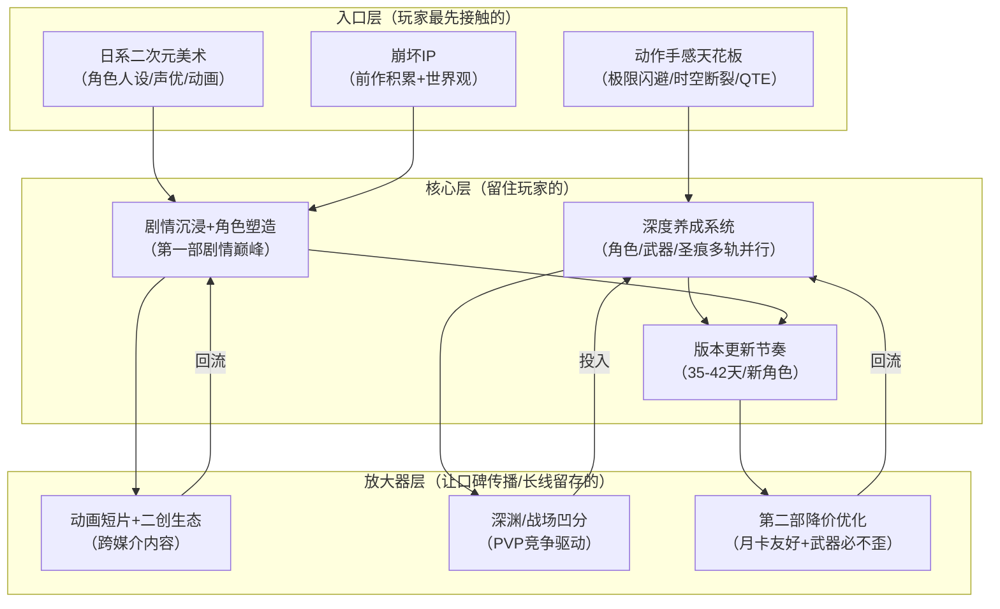

## 一、基本信息

| 项目 | 内容 |
|:-----|:-----|
| **游戏名称** | 崩坏3（Honkai Impact 3） |
| **开发商/发行商** | 米哈游 |
| **上线日期** | 2016-10-14 |
| **平台** | iOS / Android / PC / Steam / WeGame |
| **底层驱动（主导）** | 操作心流型 |
| **底层驱动（次要）** | 内容叙事型 |
| **商业化模式** | 免费+内购（角色/装备抽卡+月卡+战令） |
| **拆解版本** | 8.9版本「羽落万生」 |
| **拆解日期** | 2026-08-25 |


## 二、拆解侧重点说明

> 根据[[90-2-1-2 底层驱动分类图谱]]和[[90-2-1-3 拆解维度标准SOP]]的权重分配，本篇报告的分析重心如下：

| 维度 | 权重 | 说明 |
|:-----|:----:|:-----|
| 第1层：核心循环（分钟级） | ★★★★★ | 极限闪避→时空断裂、分支攻击→QTE连携、角色差异化战斗风格——这是崩坏3最核心的护城河[reference:0][reference:1] |
| 第2层：成长循环（天/周级） | ★★★★★ | 角色等级、晋升、技能、武器锻造/升级/超限、圣痕搭配/强化/洗练——多轨并行的深度养成系统[reference:2] |
| 第3层：商业化设计 | ★★★★ | 角色补给+装备补给的双池抽卡、月卡/战令、角色降价与武器必不歪的优化[reference:3] |
| 第4层：社交结构 | ★★ | 核心为单机体验，联机系统存在但非核心[reference:4] |
| 第5层：长线留存机制 | ★★★★ | 35-42天/版本的稳定更新节奏、新角色驱动、第一部剧情完结与第二部开启[reference:5][reference:6] |
| 第6层：美术/UI/信息传达 | ★★★★ | 日系画风、声优演出、动画短片、角色动画质量——内容叙事型游戏的视觉标杆[reference:7] |

> **系统视角声明**：本报告采用系统视角，不将游戏的成功或失败归因于单一因素，而是试图描述各要素之间的协同、耦合与相互强化关系。各章节的分析结论将在“第十一章 系统因果分析”中整合为完整的因果网络图。


## 三、第1层：核心循环（分钟级）

> **定义**：玩家在游戏中最基本的“操作-反馈-决策”单元。参考[[90-2-1-3 拆解维度标准SOP#1.3 第1层：核心循环]]。


### 3.1 最小循环描述

《崩坏3》的核心战斗循环以“极限闪避→时空断裂”为起点，以“分支攻击→QTE连携”为串联，构成了一个“闪避-反击-连招-终结”的完整动作链条[reference:8][reference:9]。

以琪亚娜「空之律者」为例的完整战斗循环：

观察敌人攻击前摇 → 精准闪避（触发时空断裂，敌人减速）→ 时空断裂期间输出（分支攻击/蓄力攻击）→ 积攒SP值 → 释放必杀技 → 触发QTE（切换队友入场）→ 新角色入场继续输出 → 循环

**不同角色的差异化战斗风格**[reference:10][reference:11]：
- 太刀角色（芽衣系）：高速连击、居合斩
- 镰刀角色（希儿系）：范围横扫、灵动位移
- 重剑角色（姬子系）：重剑爆发、高伤害低频率
- 拳套角色（符华系）：拳拳到肉、格斗连招[reference:12]

### 3.2 循环结构图



### 3.3 关键参数

|参数|数值|说明|
|---|---|---|
|单次循环时长|5-15秒|单次闪避-反击-连招的完整链路|
|时空断裂持续时间|约2-5秒|极限闪避触发，敌人减速，输出窗口|
|角色切换CD|约4秒|切换队友后的冷却时间|
|操作到反馈的延迟|约16-30ms|本地判定为主，网络影响小|
|循环中的决策点数量|3-5个|闪避时机+攻击选择+角色切换+必杀时机+位置控制|
|随机元素占比|低|暴击率是主要随机元素，技能发动概率由玩家操作触发|

### 3.4 爽感来源分析

《崩坏3》的爽感是**动作游戏手感的天花板**[](https://www.taptap.cn/review/48863839)：

1. **极限闪避→时空断裂的“子弹时间”**：在敌人攻击即将命中的瞬间完成闪避，触发时空断裂——敌人动作减速、玩家获得输出窗口。这种“千钧一发”的精准操作感是崩坏3最核心的多巴胺触发器。
    
2. **分支攻击与QTE连携的“连招快感”**：普攻→分支攻击→QTE切换→新角色入场→继续连招——一套完整的连招链条让玩家产生“我在操作一个动作游戏”的掌控感[](https://www.taptap.cn/review/48863839)。
    
3. **角色差异化的“手感多样性”**：太刀居合的流畅、镰刀横扫的范围、重剑爆发的厚重、拳套格斗的扎实——每个角色的操作手感完全不同，玩家可以找到最适合自己的“手感”。
    
4. **必杀技的“视觉高潮”**：积攒SP→释放必杀技→全屏特效+高额伤害——这是每场战斗的“高潮时刻”，配合华丽的角色动画和声优语音，形成了完整的感官冲击[](https://www.9game.cn/bhxy3/10557964.html#2)。
    

### 3.5 潜在疲劳点

1. **“最优流程”的固化**：随着角色设计迭代，部分新角色的操作被简化为“无脑跟着QTE按就行了”——虽然动作华丽，但玩家的实际参与感下降。
    
2. **凹分文化的“上班感”**：深渊和战场的PVP凹分模式，要求玩家反复刷同一关卡追求最高分数——这种“为分数而战”的体验容易让人感到疲惫[](https://www.taptap.cn/review/48863839)。
    
3. **高难度副本的角色绑定**：强势角色与配队组合高度固定，非版本强势角色几乎无上场空间[](https://www.9game.cn/bhxy3/10557964.html#2)。
    

### 3.6 ← → 与其他层的交互

|关联层|交互关系|
|---|---|
|第2层（成长循环）|核心循环中的战斗表现受角色评阶、武器、圣痕直接影响——更强的装备=更高的伤害数字=更快的通关效率|
|第3层（商业化）|新角色往往带来新的战斗机制和操作手感——玩家为了“体验新操作方式”而抽卡，付费与“手感新鲜感”直接挂钩|
|第4层（社交结构）|核心为单机体验，联机内容为非核心——核心循环的体验完全“内向”，玩家面对的是敌人和操作本身|
|第5层（长线留存）|每个新版本推出的新角色带来新的核心循环体验——玩家为了“玩新角色”而持续登录|
|第6层（UI/信息）|时空断裂的视觉特效、伤害数字的弹出、必杀技的全屏动画——UI和特效是核心循环反馈的关键载体|

## 四、第2层：成长循环（天/周级）

> **定义**：玩家在每日/每周时间尺度上的行为模式。参考[[90-2-1-3 拆解维度标准SOP#1.4 第2层：成长循环]]。

### 4.1 每日必做（Daily）

|行为|耗时|奖励|驱动力类型|
|---|---|---|---|
|日常任务/活跃度|10-20分钟|水晶+经验+材料|资源|
|刷角色碎片副本|5-15分钟|角色碎片|数值|
|材料副本/活动关卡|10-20分钟|养成材料|资源|
|家园系统收菜|5分钟|金币+材料|资源|

### 4.2 每周目标（Weekly）

|目标|重置周期|奖励|是否强制|
|---|---|---|---|
|深渊（量子奇点/超弦空间）|每周2次|水晶+材料|是（核心资源来源）|
|记忆战场|每周|水晶+材料|是（核心资源来源）|
|周常任务|每周|水晶+材料|否|
|乐土（往世乐土）|每周|水晶+材料|否|

### 4.3 资源循环图

text

[日常任务/深渊/战场] → [水晶] → [角色补给/装备补给] → [新角色/新装备]
                                    ↓
[刷副本/活动] → [角色碎片/养成材料] → [角色晋升/装备强化] → [战力提升]
                                    ↓
[战力提升] → [更高层深渊/更高分战场] → [更多水晶] → [更多抽卡]

文字说明：  
《崩坏3》的资源循环是一个“投入→产出→再投入”的闭环。玩家通过日常和周常内容获取水晶和养成材料，水晶用于抽卡获取新角色和新装备，养成材料用于提升已有角色的战力，战力提升后可以挑战更高难度的深渊和战场，获得更多水晶奖励，形成正向循环[](https://www.9game.cn/bhxy3/10557964.html#2)。

**养成维度**[](https://www.9game.cn/bhxy3/10557964.html#2)：

- 角色等级（喂食经验芯片）[](https://a.9game.cn/bhxy3/11198552.html)
    
- 角色评阶（B→A→S→SS→SSS，通过碎片晋升）[](https://a.9game.cn/bhxy3/11198552.html)
    
- 技能等级（消耗金币和技能点）[](https://a.9game.cn/bhxy3/11198552.html)
    
- 武器（锻造、升级、超限）[](https://baike.baidu.com/item/%E5%B4%A9%E5%9D%8F3/20112961?lemmaFrom=lemma_starMap&fromModule=lemma_starMap&starNodeId=5274c626664feffb8b4e83e9&lemmaIdFrom=62442543#1#2)
    
- 圣痕（搭配、强化、进化、洗练）[](https://baike.baidu.com/item/%E5%B4%A9%E5%9D%8F3/20112961?lemmaFrom=lemma_starMap&fromModule=lemma_starMap&starNodeId=5274c626664feffb8b4e83e9&lemmaIdFrom=62442543#1#2)[](https://www.9game.cn/bhxy3/11219167.html#1)
    
- 神之键、星之环、协同者等衍生系统[](https://www.9game.cn/bhxy3/10557964.html#2)
    

### 4.4 断档期识别

- **版本末期**：当前版本内容已体验完毕，等待下个版本更新
    
- **抽卡资源枯竭期**：水晶耗尽但未抽到目标角色/装备→失去短期目标
    
- **卡关期**：战力不足无法通过高难副本→需要长时间积累养成资源
    

### 4.5 长线目标

|时间维度|核心目标|进度可视化方式|
|---|---|---|
|1个版本（35-42天）|抽取当期新角色+毕业装备|角色图鉴+装备收集|
|3-6个月|主力队伍成型（主C+双辅助）|深渊段位+战场分数|
|1年+|全角色收集/全图鉴|图鉴完成度+收藏|

### 4.6 ← → 与其他层的交互

|关联层|交互关系|
|---|---|
|第1层（核心循环）|成长最直接的反馈是“伤害数字变大了”——角色晋升/装备升级后，核心循环中的输出效率提升|
|第3层（商业化）|抽卡是成长的核心入口——付费获得新角色=解锁新的战斗体验和成长路径|
|第4层（社交结构）|成长主要服务于单人内容（深渊/战场），社交要素较弱|
|第5层（长线留存）|每版本新角色+新装备持续刷新成长目标，防止“毕业即退坑”|

## 五、第3层：商业化设计

> **定义**：游戏如何将玩家体验转化为收入。参考[[90-2-1-3 拆解维度标准SOP#1.5 第3层：商业化设计]]。

### 5.1 付费入口总览

|付费类型|付费形式|对应心理账户|价格区间|
|---|---|---|---|
|角色补给（抽卡）|水晶抽取|“收集角色”+“体验新玩法”|280水晶/抽，90抽保底[](https://www.taptap.cn/review/48863839)|
|装备补给（抽卡）|水晶抽取|“毕业配装”|280水晶/抽，60抽保底[](https://www.taptap.cn/review/48863839)|
|月卡|订阅制|“每日领水晶”|30元/月|
|大月卡/战令|赛季购买|“打得多不亏”|约60元/月[](https://www.taptap.cn/review/48863839)|
|水晶直购|一次性|“应急抽卡”|648元=8088水晶|

### 5.2 核心付费路径

《崩坏3》的商业化路径经历了重要优化：

**第二部降价调整**：

- 角色池降价，圣痕可肝，武器必不歪
    
- 如果角色只想要S0，且只想要解锁对应圣痕武器即可，整体需要消耗的水晶极大减少，所花费的最多抽数从300抽下降至150抽
    
- 大小月卡玩家可以轻松做到第二部新角色全0+1（角色+专武）[](https://www.taptap.cn/review/48863839)
    

**月卡经济**：

- 30元月卡：直接获得300水晶，之后30天每天60水晶
    
- 总计约2100水晶（约合7.5抽）
    
- 重复购买可累计月卡时长，最大连购7个月
    

### 5.3 付费深度分析

|维度|数据|说明|
|---|---|---|
|零氪vs满氪战力差距|显著|角色评阶（S→SSS）和武器精炼影响巨大|
|单抽价格|280水晶（约28元）|648元≈约29抽|
|角色保底|90抽（约25200水晶）|[](https://www.taptap.cn/review/48863839)|
|装备保底|60抽（约16800水晶）|[](https://www.taptap.cn/review/48863839)|
|全角色+全装备期望花费|约31万水晶（约2.2万元）|红莲年均收入18万水晶|
|是否有付费上限|无限|持续推出新角色和新装备|

### 5.4 付费与体验的关系

《崩坏3》的付费与体验的关系经历了从“重氪导向”到“月卡友好”的转变：

- 早期：角色+武器+圣痕三池全抽，毕业成本极高
    
- 第二部后：角色池降价、圣痕可肝、武器必不歪——大幅降低了毕业门槛
    
- 当前：大小月卡玩家可做到新角色全0+1（角色+专武），零氪可体验剧情和活动[](https://www.taptap.cn/review/48863839)
    

**仍存在的问题**[](https://www.taptap.cn/review/48863839)：

- 想追求更高强度（SS阶、高精炼武器）需要大量氪金
    
- 武器精炼系统争议大——高精炼提升明显但成本极高
    

### 5.5 诱导性设计识别

|设计手法|是否存在|具体表现|
|---|---|---|
|首充双倍/限时优惠|✅|水晶首次充值双倍（版本更新后重置）|
|概率展示（保底/随机）|✅|角色90抽保底，装备60抽保底[](https://www.taptap.cn/review/48863839)|
|限时卡池/限定角色|✅|新角色在版本更新当天实装进卡池|
|沉没成本诱导|✅|抽卡投入的“已经抽了这么多”心理|
|社交展示（付费身份的可见性）|✅|高评阶角色在组队/排行榜中可见|

### 5.6 ← → 与其他层的交互

|关联层|交互关系|
|---|---|
|第1层（核心循环）|新角色带来新的战斗机制和操作手感——玩家为“体验新玩法”而付费|
|第2层（成长循环）|抽卡获得新角色/装备是成长的核心入口——付费直接解锁新的成长路径|
|第4层（社交结构）|付费差距在深渊/战场排行榜中可见——排名驱动竞争性付费|
|第5层（长线留存）|每月新角色持续创造付费点——玩家为“收集”和“强度”持续投入|

## 六、第4层：社交结构

> **定义**：游戏如何组织和定义玩家之间的关系。参考[[90-2-1-3 拆解维度标准SOP#1.6 第4层：社交结构]]。

### 6.1 社交层级图

《崩坏3》的核心体验是**单机向**的——玩家面对的是敌人和关卡，而非其他玩家[](https://www.9game.cn/bhxy3/10557964.html#2)。

### 6.2 社交驱动力分析

|社交形式|是否强制|核心驱动力|回报类型|
|---|---|---|---|
|好友/关注|否|助战借用|效率|
|联机组队|部分关卡强制|资源获取|资源|
|公会/舰团|否|舰团奖励|资源|
|排行榜|否（PVP凹分）|竞争/排名|社交+资源|

### 6.3 社交身份的可见性

- 深渊段位：反映玩家的战力水平
    
- 战场排名：反映玩家的操作和配队水平
    
- 角色/装备展示：在助战界面可见
    
```

### 6.4 负面社交处理

- 联机系统存在“中途跑路、练度不足、不配合救援”等问题，多年未得到有效优化[](https://www.9game.cn/bhxy3/10557964.html#2)
    
- 部分资源关卡强制要求联机且无单人通关渠道，社恐或偏好单机的玩家被迫社交[](https://www.9game.cn/bhxy3/10557964.html#2)
    

### 6.5 ← → 与其他层的交互

|关联层|交互关系|
|---|---|
|第1层（核心循环）|核心循环体验完全“内向”——玩家面对的是敌人和操作本身，不受社交干扰|
|第2层（成长循环）|成长主要服务于单人内容，社交要素较弱|
|第3层（商业化）|排行榜驱动竞争性付费——“我要上榜”的动机驱动部分玩家持续投入|
|第5层（长线留存）|社交要素较弱，留存主要依赖“内容+养成”而非“社交绑定”|

## 七、第5层：长线留存机制

> **定义**：游戏如何让玩家在“玩了一个月之后”仍然愿意留下来。参考[[90-2-1-3 拆解维度标准SOP#1.7 第5层：长线留存机制]]。

### 7.1 内容更新节奏

|更新类型|频率|内容量|说明|
|---|---|---|---|
|大版本|35-42天/次|新角色+新活动+新内容|稳定更新节奏[](https://www.373down.com/news/2744.html)|
|新角色|约1个月/个|全新女武神|S级角色间隔约40天，A级/SP角色补充更快[](https://www.373down.com/news/2744.html)|
|春节/周年庆版本|年度|律者级/年度核心角色|“重量级”角色，强度高、保值期长[](https://www.373down.com/news/2744.html)|

**更新节奏变化**：曾经紧凑的更新节奏逐渐放缓，如今已演变成两个月才更新一个版本。

### 7.2 第30天 vs 第180天的留存驱动力

|时间节点|核心驱动力|玩家状态|
|---|---|---|
|第30天|新版本内容+新角色体验|处于“玩新内容”的正向循环中|
|第180天|角色养成+剧情推进+版本更新|养成目标+内容期待双重驱动|

### 7.3 回归机制

|机制|描述|效果评估|
|---|---|---|
|新版本/新角色|“又有新内容了”|高——每个新版本都是回流高峰|
|周年庆/春节版本|福利+重量级角色|极高——年度回流高峰|
|老角色重置/新装甲|经典角色新形态|中——情怀驱动|

### 7.4 退出成本分析

|退出成本类型|说明|
|---|---|
|**时间成本**|数年的养成积累、角色收集|
|**金钱成本**|抽卡投入、月卡投入|
|**情感成本**|第一部剧情的情感投入——从琪亚娜的成长到逐火十三英桀的群像[](https://www.taptap.cn/review/48863839)|
|**“版本惯性”**|每个新版本都有新内容——永远有“下个版本再看看”的理由|

### 7.5 终局内容

- 深渊（量子奇点/超弦空间）——PVP凹分，追求更高段位
    
- 记忆战场——挑战高难度Boss，追求更高分数
    
- 往世乐土——Rogue-like模式，挑战不同角色
    
- 全角色/全装备收集——图鉴完成度
    

### 7.6 ← → 与其他层的交互

|关联层|交互关系|
|---|---|
|第1层（核心循环）|新角色带来新的核心循环体验——玩家为“玩新角色”而持续登录|
|第2层（成长循环）|版本更新刷新成长目标——新角色+新装备=新的养成目标|
|第3层（商业化）|每个新版本推出新角色+新装备，创造持续付费点|
|第4层（社交结构）|社交要素较弱，留存主要依赖“内容+养成”驱动|

## 八、第6层：美术/UI/信息传达

> **定义**：视觉和界面设计如何服务于“让玩家看懂、融入、不疲倦”。参考[[90-2-1-3 拆解维度标准SOP#1.8 第6层：美术/UI/信息传达]]。

### 8.1 审美调性分析

|维度|描述|是否服务于核心体验|
|---|---|---|
|整体美术风格|日系二次元+科幻，角色精美，场景华丽|是——“为世界上所有的美好而战”的视觉表达|
|色彩倾向|明亮饱和，角色配色鲜明|是——角色辨识度优先|
|角色设计|每个女武神有独特的人设和视觉风格|是——“为爱付费”的视觉基础[](https://www.9game.cn/bhxy3/10557964.html#2)|
|场景/环境|科幻+奇幻混合风格|是——世界观沉浸|
|UI视觉风格|二次元风格，信息密度中等|是——风格化与功能性的平衡|

### 8.2 UI效率分析

|常用操作|操作步骤数|是否合理|
|---|---|---|
|进入战斗|2-3步|是|
|角色切换|1步（战斗中点击头像）|是|
|释放必杀技|1步（点击必杀按钮）|是|
|查看角色/装备|2-3步|是|

### 8.3 信息传达效率分析

|信息类型|传达方式|响应速度|是否清晰|
|---|---|---|---|
|角色血量/SP|HUD左上角|即时|是|
|时空断裂触发|屏幕特效+音效+减速|即时|是——核心反馈|
|技能冷却|图标遮罩+数字|即时|是|
|连招/QTE提示|屏幕提示+特效|即时|是|
|伤害数字|数字弹出+特效|即时|是|

### 8.4 优秀设计与可改进点

**优秀设计（≥3处）**：

1. **时空断裂的视觉+操作反馈**：极限闪避触发时空断裂时，屏幕色调变化、敌人减速、音效提示——三重反馈让玩家清晰感知“我成功了”
    
2. **QTE连携的视觉引导**：当满足QTE触发条件时，屏幕出现提示图标和特效，引导玩家切换角色完成连招
    
3. **角色差异化的视觉编码**：每个角色的武器类型、攻击特效、配色方案都不同——玩家一眼就能识别当前操作的角色
    
4. **动画短片的剧情演出**：官方斥巨资制作的动画短片、主题曲、漫画，推动了二创生态的发展[](https://www.9game.cn/bhxy3/10557964.html#2)
    

**可改进点（≥3处）**：

1. **信息密度对新玩家不友好**：几百章主线剧情、几十个系统、上百个角色——新人“绝对会一头雾水”[](https://www.taptap.cn/review/48863839)
    
2. **字体又小又密**：神之键、星之环、协同者等衍生系统不断叠加，玩家需要同时学习多个养成维度[](https://www.9game.cn/bhxy3/10557964.html#2)
    
3. **新手引导不足**：纯新人面对复杂的养成系统和战斗机制，缺乏清晰的上手路径
    

### 8.5 ← → 与其他层的交互

|关联层|交互关系|
|---|---|
|第1层（核心循环）|时空断裂的视觉特效是核心循环反馈的关键——玩家通过视觉变化感知“闪避成功”|
|第2层（成长循环）|角色/装备的视觉表现（华丽度/特效）是成长的“可见回报”——越强的角色特效越华丽|
|第3层（商业化）|角色动画短片是付费的“情感驱动”——“为爱付费”建立在角色塑造的视觉基础上[](https://www.9game.cn/bhxy3/10557964.html#2)|
|第4层（社交结构）|角色展示界面是社交身份的视觉基础——高评阶角色在助战/排行榜中可见|

## 九、弃坑拐点分析

|阶段|典型流失原因|机制层面是否存在预防设计|
|---|---|---|
|新手期（前1-7天）|系统复杂、角色弱、不知道养谁|新手池6抽优惠[](https://www.taptap.cn/review/48863839)——但远远不够|
|成长期（第1-2月）|抽卡资源不足、抽不到想要的角色|月卡+日常积累|
|成熟期（第3-6月）|数值膨胀导致老角色退环境[](https://www.taptap.cn/review/48863839)|新角色持续推出——但老角色几乎无法上场[](https://www.9game.cn/bhxy3/10557964.html#2)|
|长线期（6月以上）|核心玩法老化、深渊战场“上班感”[](https://www.taptap.cn/review/48863839)|第二部尝试创新——但整体变化不大[](https://www.taptap.cn/review/48863839)|

## 十、横向穿刺锚点

|锚点|本游戏数据|关联专题|
|---|---|---|
|核心循环时长|5-15秒（单次连招）||
|每日必做耗时|30-60分钟||
|单抽价格|280水晶（约28元）||
|角色保底|90抽||
|装备保底|60抽||
|月卡价格与回报|30元/月≈2100水晶||
|大月卡价格|约60元/月||
|版本更新周期|35-42天|[[90-2-1-22 专题_赛季制与版本更新节奏研究]]|
|新角色频率|约1个月/个|[[90-2-1-22 专题_赛季制与版本更新节奏研究]]|
|最大社交单元|3人（联机组队）|[[90-2-1-21 专题_社交结构金字塔]]|

## 十一、系统因果分析

> **本章为必填项，是本报告的核心章节。** 本章将前10章的各层分析整合为一张“系统因果网络图”，标识各要素之间的协同、耦合与相互强化关系。

### 11.1 因果网络图



**图例说明**：

- **入口层**：玩家通过什么进入游戏/被吸引
    
- **核心层**：玩家为什么持续玩下去
    
- **放大器层**：玩家为什么带朋友来、为什么回流
    
- **实线箭头**：直接因果/支撑关系
    
- **虚线箭头**：反馈强化关系
    

### 11.2 入口/核心/放大器分层说明

|层级|包含要素|作用|
|---|---|---|
|**入口层**|动作手感天花板、日系二次元美术、崩坏IP|降低用户获取成本，制造第一印象|
|**核心层**|深度养成系统、剧情沉浸+角色塑造、版本更新节奏|创造持续游玩的动机，形成习惯|
|**放大器层**|动画短片+二创生态、深渊/战场凹分、第二部降价优化|驱动口碑传播、社交裂变、长线回流|

### 11.3 必要非充分说明

> **必填项**。明确声明单一因素不足以解释游戏的成功或失败。

**声明**：本报告认为，《崩坏3》的九年长线运营（2016年至今）是以下多因素共同作用的结果：动作手感的天花板级品质（极限闪避→时空断裂、分支攻击→QTE连携）、日系二次元美术+声优演出的审美吸引力、第一部剧情的深度与情感共鸣、多轨并行的深度养成系统、35-42天/版本的稳定更新节奏、动画短片+二创生态的跨媒介传播、以及深渊/战场PVP凹分的竞争驱动。

其中：

- **动作手感**是“留住动作玩家”的**必要非充分条件**——没有顶级的打击感和操作反馈，崩坏3只是一款普通的二次元抽卡游戏；但仅有手感，没有养成深度和剧情支撑，玩家会在“玩腻了”之后离开；
    
- **剧情+角色塑造**是“情感留存”的**核心稳定器**——第一部剧情从琪亚娜的成长到逐火十三英桀的群像，让玩家形成“为爱付费”的情感绑定[](https://www.taptap.cn/review/48863839)[](https://www.9game.cn/bhxy3/10557964.html#2)；
    
- **版本更新节奏**是“内容供给”的**放大器**——每月一个新角色的稳定节奏创造了持续的新鲜感和付费动机；
    
- **第二部降价优化**是“信任修复”的**强化因子**——角色池降价、圣痕可肝、武器必不歪，让月卡玩家也能轻松全0+1[](https://www.taptap.cn/review/48863839)。
    

**单一归因警告**：任何将《崩坏3》的成功归结为单一因素的解释，在本报告的框架下均被视为不完整的分析。

### 11.4 系统脆弱性识别

|脆弱环节|后果|现实案例/假设场景|
|---|---|---|
|数值膨胀+老角色退环境|第一部角色几乎全部退环境，新手被迫抽新角色[](https://www.taptap.cn/review/48863839)|老玩家回归后发现“我的满配角色不能用了”|
|核心玩法老化|深渊和战场还是老一套PVP凹分模式[](https://www.taptap.cn/review/48863839)|与绝区零等新竞品相比新鲜感不足[](https://www.taptap.cn/review/48863839)|
|更新节奏放缓|玩家等待时间变长，活跃度下降|“两个月才更新一个版本”的担忧|
|新手入坑门槛极高|几百章剧情、几十个系统、上百个角色[](https://www.taptap.cn/review/48863839)|纯新人“绝对会一头雾水”|

### 11.5 正向循环 vs 恶性循环

**正向循环（增长飞轮）** ：

> 新版本发布 → 新角色上线 → 玩家抽卡体验新机制 → 养成投入+剧情推进 → 深渊/战场验证强度 → 社区讨论发酵 → 动画短片/二创破圈 → 新玩家被吸引 → 下个版本继续

**恶性循环（衰退螺旋）** ：

> 数值膨胀 → 老角色退环境 → 玩家投入贬值 → 付费意愿下降 → 流水下滑 → 资源投入减少 → 内容质量下降 → 更多玩家流失 → 生态萎缩

## 十二、总结

### 12.1 一句话评价

《崩坏3》是国产二游中“动作手感+剧情深度+版本节奏”三者耦合最成功的产品——它用天花板级的打击感留住了动作玩家，用第一部剧情的巅峰水准留住了情感玩家，用每月一个新角色的稳定节奏留住了养成玩家，三者共同构成了长达九年的长线运营。

### 12.2 核心发现（3-5条）

1. **“极限闪避→时空断裂”是动作手感的核心护城河**：这套机制放到2026年依然没有对手[](https://www.taptap.cn/review/48863839)。它不是简单的“闪避无敌帧”，而是通过“子弹时间”创造了“闪避成功→输出窗口”的因果链条——每一次精准闪避都是一次“我做到了”的正反馈。
    
2. **第一部剧情是国产二游的巅峰之作**：从琪亚娜的成长到逐火十三英桀的群像，再到爱莉希雅的牺牲和终章的告别[](https://www.taptap.cn/review/48863839)——剧情深度和情感共鸣让玩家形成了“为爱付费”的长期绑定[](https://www.9game.cn/bhxy3/10557964.html#2)。这是崩坏3区别于纯数值驱动型游戏的核心差异。
    
3. **“35-42天/版本+每月新角色”的稳定节奏**：这是崩坏3长线运营的“节拍器”[](https://www.373down.com/news/2744.html)。玩家知道“每个月都有新东西”——这种可预期的内容供给创造了持续的登录动机和付费窗口。
    
4. **第二部降价是商业模式的自我革命**：角色池降价、圣痕可肝、武器必不歪——将毕业成本从300抽降至150抽。这种“主动降价”在服务型游戏中极为罕见，是对“月卡友好”方向的战略性转向[](https://www.taptap.cn/review/48863839)。
    

### 12.3 可借鉴的设计点

1. **“时空断裂”作为动作游戏的反馈机制**：将“闪避成功”从“没受伤”升级为“获得了输出窗口”——这种“奖励型防御”比单纯的“惩罚型防御”更能产生正反馈
    
2. **“为爱付费”的角色塑造模型**：通过主线剧情+角色支线+动画短片+声优演出的多维度塑造，让玩家对角色产生情感投入[](https://www.9game.cn/bhxy3/10557964.html#2)——付费动机从“变强”升级为“喜欢”
    
3. **“版本更新=新角色”的内容节奏**：将版本更新的核心锚点设定为新角色——每个版本都有“抽卡理由”，创造了稳定的付费节奏
    
4. **“武器必不歪”的信任修复机制**：在抽卡游戏中，“武器必不歪”是对玩家最直接的善意——它消除了“抽到角色但没武器”的挫败感
    

### 12.4 需警惕的陷阱

1. **数值膨胀的“老角色淘汰”危机**：第一部角色几乎全部退环境，深渊和战场完全上不了场[](https://www.taptap.cn/review/48863839)。新玩家被迫只能抽新角色，老玩家的投入贬值——这是长线运营游戏最难平衡的问题。
    
2. **核心玩法老化的“创新困境”**：第二部虽然加了跳跃和钩索，但整体玩法和第一部区别不大[](https://www.taptap.cn/review/48863839)。与绝区零等新竞品相比，新鲜感明显不足[](https://www.taptap.cn/review/48863839)。
    
3. **新手入坑的“认知壁垒”**：九年老游戏，几百章主线剧情、几十个系统、上百个角色[](https://www.taptap.cn/review/48863839)——新玩家的学习成本极高，新手留存是长期隐患。
    
4. **更新节奏放缓的“内容焦虑”**：曾经紧凑的更新节奏逐渐放缓至两个月一版——玩家担忧游戏步《崩坏2》后尘，进入“慢性死亡”状态。
    

## 十三、关联笔记

- [[90-2-1-1 拆解总索引_MOC]]
    
- [[90-2-1-2 底层驱动分类图谱]]
    
- [[90-2-1-3 拆解维度标准SOP]]
    
- [[90-2-1-8 只狼_战斗手感、死亡惩罚与叙事沉浸的系统耦合]]（同为操作心流型，对比“主机ACT”vs“手游ACT”的操作设计差异）
    
- [[90-2-1-14 王者荣耀_操作手感、社交生态与赛季运营的系统协同]]（同为操作心流型，对比“PVP MOBA”vs“PVE ACT”的操作手感设计）
    
- [[90-2-1-16 原神_战斗系统、内容更新与IP传播的系统协同]]（同属米哈游系，对比“箱庭ACT”vs“开放世界ARPG”的内容驱动逻辑）
    
- [[90-2-1-22 专题_赛季制与版本更新节奏研究]]（35-42天/版本的更新节奏分析）