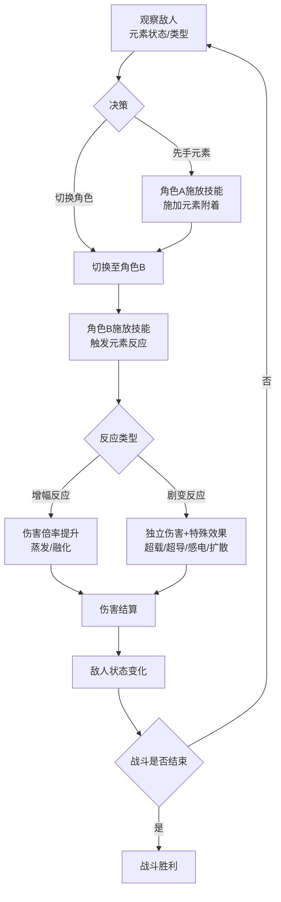
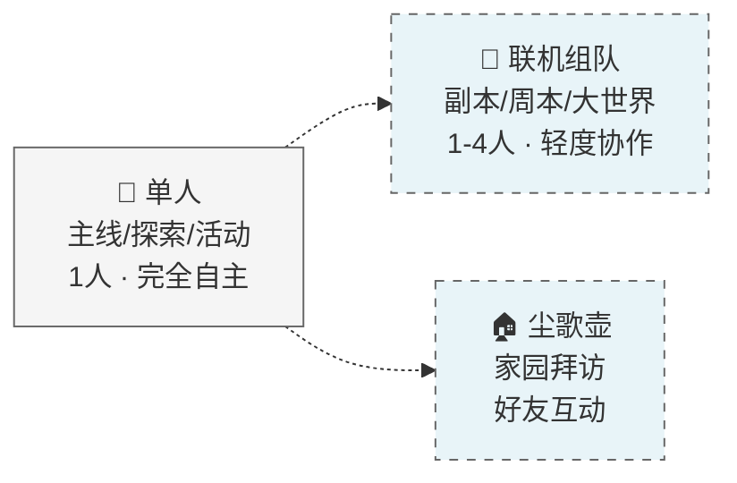
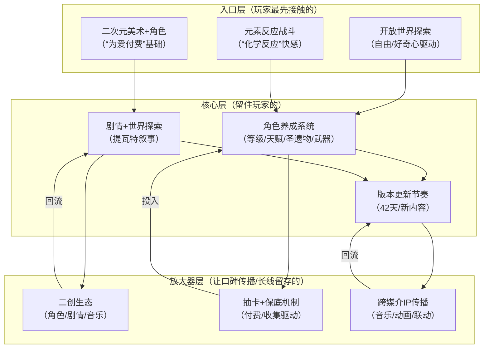

## 一、基本信息

| 项目 | 内容 |
|:-----|:-----|
| **游戏名称** | 原神（Genshin Impact） |
| **开发商/发行商** | 米哈游 |
| **上线日期** | 2020-09-28（全球公测）[reference:0] |
| **平台** | PC / iOS / Android / PS4 / PS5（2021年4月上线）[reference:1] |
| **底层驱动（主导）** | 内容叙事型 |
| **底层驱动（次要）** | 数值策略型 |
| **商业化模式** | 免费+内购（角色/武器抽卡+月卡+战令） |
| **拆解版本** | [待填写] |
| **拆解日期** | 2026-08-25 |

## 二、拆解侧重点说明

> 根据[[90-2-1-2 底层驱动分类图谱]]和[[90-2-1-3 拆解维度标准SOP]]的权重分配，本篇报告的分析重心如下：

| 维度 | 权重 | 说明 |
|:-----|:----:|:-----|
| 第1层：核心循环（分钟级） | ★★★★★ | 元素反应系统是原神战斗的“灵魂”——七种元素相互作用产生的增幅/剧变反应构成了战斗策略的深度 |
| 第2层：成长循环（天/周级） | ★★★★★ | 树脂体力系统、每日委托、周本BOSS、深境螺旋构成了玩家的日常/周常节奏 |
| 第3层：商业化设计 | ★★★★ | 角色+武器双池抽卡、大小月卡、命座系统——原神是全球最成功的抽卡商业化模型之一 |
| 第4层：社交结构 | ★★ | 核心为单机体验，联机为轻度辅助（副本/尘歌壶/大世界） |
| 第5层：长线留存机制 | ★★★★★ | 42天/版本的稳定更新节奏、新区域/新角色/新剧情的内容供给——这是原神长线运营的核心引擎 |
| 第6层：美术/UI/信息传达 | ★★★★ | 二次元开放世界美术、元素视野、角色切换UI——内容叙事型游戏的视觉标杆 |

> **系统视角声明**：本报告采用系统视角，不将游戏的成功或失败归因于单一因素，而是试图描述各要素之间的协同、耦合与相互强化关系。各章节的分析结论将在“第十一章 系统因果分析”中整合为完整的因果网络图。

## 三、第1层：核心循环（分钟级）

> **定义**：玩家在游戏中最基本的“操作-反馈-决策”单元。参考[[90-2-1-3 拆解维度标准SOP#1.3 第1层：核心循环]]。

### 3.1 最小循环描述

《原神》的核心循环围绕**元素反应系统**展开——七种元素（水、火、冰、岩、风、雷、草）相互作用产生特殊效果，构成提瓦特大陆战斗体系的基础[reference:2]。

以“蒸发反应”为例的完整战斗循环：

先手施加一种元素附着（如水元素）→ 切换角色 → 用另一种元素触发反应（如火元素触发蒸发，伤害倍率提升至2.0倍）[reference:3]→ 伤害数字弹出 → 敌人状态变化 → 继续施加元素附着 → 循环

**元素反应的两大类**[reference:4]：

| 类型 | 说明 | 示例 |
|:-----|:-----|:-----|
| **增幅反应** | 通过提升原伤害比例生效，受暴击、抗性等属性影响 | 蒸发（火+水）：火触发1.5倍/水触发2.0倍；融化（火+冰）：类似增幅 |
| **剧变反应** | 造成独立伤害，与角色等级、元素精通相关，无法暴击 | 超载（火+雷）、超导（冰+雷，降低40%物理抗性）、感电（水+雷）、扩散（风元素传播其他元素）[reference:5] |

### 3.2 循环结构图

### 3.3 关键参数

|参数|数值|说明|
|---|---|---|
|单次元素反应循环|约5-30秒|取决于角色技能CD和元素附着效率|
|元素附着持续时间|约9.5-12秒|弱附着/强附着的差异|
|角色切换CD|约1-2秒|可快速切换完成元素反应|
|元素反应伤害类型|增幅反应可暴击 / 剧变反应不可暴击|决定了不同角色的配装思路|
|随机元素占比|低|暴击率是主要随机元素，元素反应本身为确定性机制|

### 3.4 爽感来源分析

《原神》的爽感来自**元素反应的“化学反应”快感**：

1. **元素反应的“1+1>2”效应**：单一元素的伤害有限，但两种元素结合后产生的增幅（2倍伤害）或剧变（范围伤害+特殊效果）——这种“组合爆炸”的反馈是原神战斗最核心的多巴胺触发器。
    
2. **角色切换的“连招感”**：先手角色挂元素→切换→后手角色触发反应→再切换→继续循环——四个角色在战场上的快速切换形成了类似ACT游戏的连招体验。
    
3. **“反应可见性”的即时反馈**：元素反应触发时，屏幕上的特效（火焰爆炸、冰冻碎裂、雷电传导）、伤害数字的颜色变化（增幅反应为白色数字+特殊标记）——让玩家清晰感知“我触发了反应”。
    
4. **大世界探索的“元素解谜”**：元素不仅是战斗工具，也是探索工具——火点燃火炬、冰冻结水面、风激活风场——战斗与探索在同一套元素系统下统一。
    

### 3.5 潜在疲劳点

1. **“最优反应”的固化**：随着Meta环境的稳定，部分元素反应（如蒸发、融化）成为“最优解”，其他反应（如超导、结晶）使用率较低——玩家的配队选择被“强度”而非“趣味”驱动。
    
2. **角色切换的“操作门槛”**：高水平的元素反应循环需要精确的角色切换时机和元素附着管理——对休闲玩家而言，学习成本较高。
    
3. **大世界战斗的“碾压感”**：当角色练度足够高时，大世界怪物被秒杀，元素反应还没来得及触发战斗就结束了——核心循环在大世界中被“跳过”。
    

### 3.6 ← → 与其他层的交互

|关联层|交互关系|
|---|---|
|第2层（成长循环）|元素反应的伤害受角色等级、元素精通、暴击率等属性影响——成长系统直接决定了核心循环的“伤害数字”|
|第3层（商业化）|新角色往往带来新的元素机制和反应路径——玩家为“解锁新的元素反应组合”而抽卡|
|第4层（社交结构）|联机时4人各操作一个角色，需要协同触发元素反应——核心循环从“单人连招”升级为“团队配合”|
|第5层（长线留存）|新区域引入新元素（如须弥的草元素）——新元素=新的反应组合=核心循环被刷新|
|第6层（UI/信息）|元素视野、元素附着状态的视觉提示、反应特效——UI是核心循环反馈的关键载体|

## 四、第2层：成长循环（天/周级）

> **定义**：玩家在每日/每周时间尺度上的行为模式。参考[[90-2-1-3 拆解维度标准SOP#1.4 第2层：成长循环]]。

### 4.1 每日必做（Daily）

|行为|耗时|奖励|驱动力类型|
|---|---|---|---|
|每日委托（4个）|10-15分钟|原石+冒险经验|资源|
|消耗树脂（体力）|10-20分钟|角色突破材料/圣遗物/摩拉|数值|
|采集/挖矿（可选）|10-30分钟|角色突破材料/矿石|资源|
|尘歌壶收菜|5分钟|洞天宝钱+角色好感度|资源|

**树脂系统说明**：

- 原粹树脂（体力）每8分钟恢复1点，上限200点（4.7版本后从160提升至200）
    
- 每天自然恢复180点
    
- 可通过原石兑换补充，每天最多6次，价格递增
    

### 4.2 每周目标（Weekly）

|目标|重置周期|奖励|是否强制|
|---|---|---|---|
|周本BOSS（3次减半）|每周|角色天赋突破材料|是（核心资源）|
|深境螺旋（9-12层）|每月1日/16日重置|原石+摩拉+经验书|是（核心原石来源）|
|纪行（战令）任务|版本周期|经验+资源|否|
|声望任务|每周|声望经验+食谱/图纸|否|

### 4.3 资源循环图

text

[每日委托/树脂消耗] → [原石/养成材料] → [角色突破/天赋升级/圣遗物刷取] → [战力提升]
                                    ↓
[深境螺旋/周本BOSS] → [原石/天赋材料] → [更多抽卡/更强角色] → [更高深渊层数]
                                    ↓
[版本活动] → [原石/限定材料] → [版本限定奖励] → [继续积累]

文字说明：  
《原神》的资源循环是“多轨并行”的——冒险等级（世界等级）、角色等级、天赋等级、武器等级、圣遗物五条成长线同时推进。原石是“抽卡资源”，养成材料是“战力资源”，两者在每日/每周循环中分别产出。

### 4.4 断档期识别

- **版本末期**：当前版本内容已全部完成（地图探索100%、活动全部通关、深渊满星）→ 等待下个版本更新
    
- **树脂枯竭期**：树脂用完后无法继续刷取材料 → 每日上线时间大幅缩短
    
- **卡池空窗期**：不打算抽当前UP角色 → 抽卡动机缺失
    

### 4.5 长线目标

|时间维度|核心目标|进度可视化方式|
|---|---|---|
|1个版本（42天）|抽取当期UP角色+专武|角色图鉴+武器图鉴|
|3-6个月|主力队伍成型（2队8人）|深境螺旋满星|
|1年+|全角色收集/全地图100%探索|图鉴完成度+探索度|

### 4.6 ← → 与其他层的交互

|关联层|交互关系|
|---|---|
|第1层（核心循环）|成长最直接的反馈是“伤害数字变大了”——角色等级/天赋/圣遗物提升后，元素反应的伤害随之提升|
|第3层（商业化）|原石是抽卡的核心资源——每日委托和深渊是免费原石的主要来源，付费则直接购买抽卡机会|
|第4层（社交结构）|成长主要服务于单人内容，联机内容（副本）需要队伍整体练度，但非强制|
|第5层（长线留存）|42天/版本的更新节奏持续刷新成长目标——新角色=新的养成目标|

## 五、第3层：商业化设计

> **定义**：游戏如何将玩家体验转化为收入。参考[[90-2-1-3 拆解维度标准SOP#1.5 第3层：商业化设计]]。

### 5.1 付费入口总览

|付费类型|付费形式|对应心理账户|价格区间|
|---|---|---|---|
|角色祈愿（抽卡）|纠缠之缘（160原石/抽）|“收集角色”+“体验新玩法”|160原石/抽，90抽小保底|
|武器祈愿（抽卡）|纠缠之缘|“毕业配装”|160原石/抽，80抽保底|
|空月祝福（小月卡）|订阅制|“每日领原石”|30元/月|
|珍珠纪行（大月卡）|版本购买|“打得多不亏”|68元/版本|
|创世结晶直购|一次性|“应急抽卡”|6-648元档位|

### 5.2 核心付费路径

**空月祝福（小月卡）** ：购买即得300创世结晶，之后30天内每天登录领取90原石。总计3000原石（约18.75抽），性价比为全游戏最高——约每元100原石。可叠加购买，最多累计6个月。

**珍珠纪行（大月卡）** ：分为免费版和付费版（68元），付费版提供大量养成资源。高价档位“珍珠之歌”额外提供创世结晶。

**角色祈愿保底机制**：

- 90抽内必出五星角色（小保底）
    
- 若首次未获得当期UP角色，则下次保底必得该角色（大保底）
    
- 大小保底状态会继承至后续角色活动祈愿
    
- 5.0版本新增“捕获明光”机制，极小概率直接获取UP角色
    

### 5.3 付费深度分析

|维度|数据|说明|
|---|---|---|
|零氪vs满氪战力差距|显著（命座+精炼）|角色命座和武器精炼影响巨大|
|单抽价格|160原石（约16元）|648元≈约50抽|
|角色小保底|90抽（约14400原石）||
|角色大保底|180抽（约28800原石）||
|武器保底|80抽（约12800原石）||
|全角色+全武器满命满精期望花费|数十万-百万级|无上限|
|是否有付费上限|无限|持续推出新角色和新武器|

### 5.4 付费与体验的关系

《原神》的付费与体验的关系是 **“付费=更多角色+更强角色”** ：

- 付费抽到新角色 → 解锁新的元素反应组合和战斗体验
    
- 付费抽到重复角色 → 解锁命座 → 角色能力质变（部分角色关键命座在2命或6命）
    
- 付费抽到专武 → 角色输出上限大幅提升
    

**关键设计**：付费不直接“购买战斗力”，而是“购买角色”——角色是体验的载体，抽到角色后还需要投入养成资源（树脂、材料、摩拉）才能发挥战斗力。这种“抽卡+养成”的双重投入模型，让付费行为被“养成”这一层中介所包裹。

### 5.5 诱导性设计识别

|设计手法|是否存在|具体表现|
|---|---|---|
|首充双倍/限时优惠|✅|各档位创世结晶首次双倍|
|概率展示（保底/随机）|✅|90抽保底+50%UP概率|
|限时卡池/限定角色|✅|角色UP池持续21天，错过等复刻|
|沉没成本诱导|✅|抽卡投入的“已经抽了这么多”心理|
|社交展示（付费身份的可见性）|✅|角色/武器在联机和展示界面可见|

### 5.6 ← → 与其他层的交互

|关联层|交互关系|
|---|---|
|第1层（核心循环）|新角色带来新的元素机制和反应路径——玩家为“解锁新的战斗体验”而抽卡|
|第2层（成长循环）|抽卡获得新角色是成长的核心入口——新角色=新的养成目标=新的树脂消耗方向|
|第4层（社交结构）|付费差距在联机时可见——展示高命座/专武角色构成社交身份|
|第5层（长线留存）|每个版本推出新角色，持续创造付费点和“抽卡理由”|

## 六、第4层：社交结构

> **定义**：游戏如何组织和定义玩家之间的关系。参考[[90-2-1-3 拆解维度标准SOP#1.6 第4层：社交结构]]。

### 6.1 社交层级图

《原神》的核心体验是**单机向**的——玩家在提瓦特大陆的探索和剧情体验是完全独立的。联机系统为轻度辅助。

### 6.2 社交驱动力分析

|社交形式|是否强制|核心驱动力|回报类型|
|---|---|---|---|
|好友/关注|否|联机组队/尘歌壶拜访|效率+社交|
|联机组队（副本/周本）|可选|效率提升/好友互助|效率|
|尘歌壶拜访|否|参观/助力加速制作|社交|
|世界聊天/社群|否|信息交流/组队招募|社交|

### 6.3 社交身份的可见性

- 角色展示：好友列表/联机时可见，展示玩家的角色收集和练度
    
- 尘歌壶：玩家可拜访好友的尘歌壶，即使好友离线也可进入
    
- 名片/成就：展示玩家的游戏进度和成就
    

### 6.4 负面社交处理

- 联机为可选模式，不强制社交——避免强制社交带来的负面体验
    
- 非好友无法申请进入尘歌壶
    

### 6.5 ← → 与其他层的交互

|关联层|交互关系|
|---|---|
|第1层（核心循环）|联机时4人各操作一个角色，需要协同触发元素反应——核心循环从“单人连招”升级为“团队配合”|
|第2层（成长循环）|成长主要服务于单人内容，联机为辅|
|第3层（商业化）|角色展示是社交身份的视觉基础——高命座/专武角色在联机时可见|
|第5层（长线留存）|社交要素较弱，留存主要依赖“内容更新+角色收集”而非“社交绑定”|

## 七、第5层：长线留存机制

> **定义**：游戏如何让玩家在“玩了一个月之后”仍然愿意留下来。参考[[90-2-1-3 拆解维度标准SOP#1.7 第5层：长线留存机制]]。

### 7.1 版本更新节奏

《原神》最核心的长线留存机制是**42天/版本**的稳定更新节奏。

|参数|数据|说明|
|---|---|---|
|版本周期|42天（6周）|从1.0至今保持稳定|
|卡池结构|上半21天+下半21天|每个版本2个UP池|
|新区域|约3个月一张新地图|版本更新中逐步开放|
|新国度|约1年一个|蒙德→璃月→稻妻→须弥→枫丹→纳塔|

**“竞品都被米哈游带入了42天一个版本的节奏”** ——这是原神对行业最大的影响之一。

### 7.2 第30天 vs 第180天的留存驱动力

|时间节点|核心驱动力|玩家状态|
|---|---|---|
|第30天|新版本内容+新角色体验|处于“玩新内容”的正向循环中|
|第180天（跨4个版本）|新区域/新国度+角色收集+剧情推进|“下个版本有新地图”的期待|

### 7.3 回归机制

|机制|描述|效果评估|
|---|---|---|
|新版本/新区域|“又有新地图了”|极高——每个新版本都是回流高峰|
|新角色UP|“想抽这个角色”|高——新角色驱动抽卡和回归|
|海灯节/周年庆|福利+重量级内容|极高——年度回流高峰|
|好友召回|社交邀请|中|

### 7.4 退出成本分析

|退出成本类型|说明|
|---|---|
|**时间成本**|数年的探索积累、角色养成|
|**金钱成本**|抽卡投入、月卡投入|
|**情感成本**|对角色（“老婆”/“老公”）的情感投入——这是原神最独特的退出成本|
|**“版本惯性”**|每个版本都有新内容——永远有“下个版本再看看”的理由|

### 7.5 终局内容

- 深境螺旋满星——PVE强度的最高验证
    
- 全地图100%探索——探索型玩家的终极目标
    
- 全角色/全武器收集——图鉴完成度
    
- 角色“毕业”——顶级圣遗物+满天赋
    

### 7.6 ← → 与其他层的交互

|关联层|交互关系|
|---|---|
|第1层（核心循环）|新角色带来新的元素机制——核心循环的“反应组合”被持续刷新|
|第2层（成长循环）|新版本=新角色+新养成目标——成长循环持续获得新内容|
|第3层（商业化）|每个版本推出新角色+新武器，创造持续付费点|
|第4层（社交结构）|社交要素较弱，留存主要依赖“内容更新+角色收集”|

## 八、第6层：美术/UI/信息传达

> **定义**：视觉和界面设计如何服务于“让玩家看懂、融入、不疲倦”。参考[[90-2-1-3 拆解维度标准SOP#1.8 第6层：美术/UI/信息传达]]。

### 8.1 审美调性分析

|维度|描述|是否服务于核心体验|
|---|---|---|
|整体美术风格|二次元开放世界，色彩明亮，风格化渲染|是——“提瓦特”世界的视觉表达|
|色彩倾向|各区域差异极大（蒙德翠绿/璃月金黄/稻妻紫黑/须弥红褐）|是——区域视觉编码辅助探索|
|角色设计|每个角色有独特的人设、服饰、动作模组|是——“为爱付费”的视觉基础|
|场景/环境|开放世界，地标明确（七天神像/传送点）|是——探索驱动力的一部分|
|UI视觉风格|二次元风格，信息密度中等|是——风格化与功能性的平衡|

### 8.2 UI效率分析

|常用操作|操作步骤数|是否合理|
|---|---|---|
|切换角色|1步（按键/点击头像）|是|
|释放元素战技/爆发|1步（按键）|是|
|打开地图|1步（M键）|是|
|使用道具/食物|2-3步|是|

### 8.3 信息传达效率分析

|信息类型|传达方式|响应速度|是否清晰|
|---|---|---|---|
|角色血量/元素能量|HUD左下角|即时|是|
|元素附着状态|敌人身上的元素图标|即时|是——核心战斗信息|
|元素反应触发|特效+伤害数字+音效|即时|是|
|任务/目标提示|地图标记+导航|即时|是|
|探索点|地图图标+神瞳标记|即时|是|

### 8.4 优秀设计与可改进点

**优秀设计（≥3处）**：

1. **元素视野**：长按查看周围元素痕迹——将“探索”和“元素系统”统一在同一套视觉语言下
    
2. **区域视觉编码**：蒙德（欧洲田园）→璃月（中国山水）→稻妻（日本和风）→须弥（中东/南亚）→枫丹（欧洲蒸汽朋克）——每个区域有独特的色彩和建筑风格
    
3. **角色切换的流畅动画**：角色切换时有入场/退场动画，切换过程中有短暂的无敌帧——既服务于战斗节奏，也强化了“小队”的视觉感受
    
4. **七天神像/传送点的地标设计**：高辨识度的视觉锚点，降低探索中的“迷路”焦虑
    

**可改进点（≥3处）**：

1. **圣遗物系统的信息过载**：主词条+副词条+套装效果+强化——新玩家面对圣遗物系统时认知负担极高
    
2. **地图标记的“密集恐惧”**：随着版本更新，地图上的传送点、任务标记、资源点越来越多——信息密度持续上升
    
3. **角色突破材料的“跨区域”问题**：新角色需要新区域的材料，但未开放该区域的新玩家无法获取——UI未清晰提示“该材料在未开放区域”
    

### 8.5 ← → 与其他层的交互

|关联层|交互关系|
|---|---|
|第1层（核心循环）|元素附着状态的视觉提示是核心循环反馈的关键——玩家通过敌人身上的元素图标判断“该用什么元素触发反应”|
|第2层（成长循环）|冒险等级/世界等级的UI展示是成长的“进度条”——数值增长驱动成长动机|
|第3层（商业化）|抽卡界面的“金光”特效是付费反馈的关键——五星角色出现时的视觉/音效冲击是“赌赢了”的多巴胺触发器|
|第4层（社交结构）|角色展示界面是社交身份的视觉基础——展示角色收集和练度|

## 九、弃坑拐点分析

|阶段|典型流失原因|机制层面是否存在预防设计|
|---|---|---|
|新手期（前1-7天）|开放世界“不知道该做什么”|冒险等级引导+主线任务指引——但仍有部分玩家迷失|
|成长期（第1-2月）|树脂不够用、养成周期长|每日委托+树脂自然恢复——但养成节奏仍被批评为“太慢”|
|成熟期（第3-6月）|内容消耗完、长草期|42天版本更新——但版本末期仍有长草感|
|长线期（6月以上）|深渊满星后缺乏目标、角色退环境|新角色+新区域持续供给——但老角色使用率持续下降|

## 十、横向穿刺锚点

|锚点|本游戏数据|关联专题|
|---|---|---|
|核心循环时长|5-30秒（元素反应循环）||
|每日必做耗时|20-40分钟||
|单抽价格|160原石（约16元）||
|角色保底|90抽（小保底）/180抽（大保底）||
|武器保底|80抽||
|月卡价格与回报|30元/月≈3000原石||
|大月卡价格|68元/版本||
|版本更新周期|42天|[[90-2-1-22 专题_赛季制与版本更新节奏研究]]|
|新角色频率|约1-2个/版本|[[90-2-1-22 专题_赛季制与版本更新节奏研究]]|
|最大社交单元|4人（联机组队）|[[90-2-1-21 专题_社交结构金字塔]]|
|收入表现|2025年国区iOS预估9401.46万美元||

## 十一、系统因果分析

> **本章为必填项，是本报告的核心章节。** 本章将前10章的各层分析整合为一张“系统因果网络图”，标识各要素之间的协同、耦合与相互强化关系。

### 11.1 因果网络图

**图例说明**：

- **入口层**：玩家通过什么进入游戏/被吸引
    
- **核心层**：玩家为什么持续玩下去
    
- **放大器层**：玩家为什么带朋友来、为什么回流
    
- **实线箭头**：直接因果/支撑关系
    
- **虚线箭头**：反馈强化关系
    

### 11.2 入口/核心/放大器分层说明

|层级|包含要素|作用|
|---|---|---|
|**入口层**|开放世界探索、二次元美术+角色、元素反应战斗|降低用户获取成本，制造第一印象|
|**核心层**|角色养成系统、剧情+世界探索、版本更新节奏|创造持续游玩的动机，形成习惯|
|**放大器层**|二创生态、抽卡+保底机制、跨媒介IP传播|驱动口碑传播、社交裂变、长线回流|

### 11.3 必要非充分说明

> **必填项**。明确声明单一因素不足以解释游戏的成功或失败。

**声明**：本报告认为，《原神》的全球现象级成功是以下多因素共同作用的结果：开放世界探索的自由感、二次元美术+角色塑造的审美吸引力、元素反应战斗系统的策略深度、多轨并行的角色养成系统、提瓦特世界观的叙事沉浸、42天/版本的稳定更新节奏、以及跨媒介IP传播（音乐、动画、联动）的二创生态。

其中：

- **元素反应战斗系统**是“留住动作/策略玩家”的**必要非充分条件**——没有元素反应的深度，原神只是一款普通的开放世界探索游戏；但仅有战斗系统，没有角色养成和内容更新的配合，玩家会在“研究透了”之后离开；
    
- **角色养成系统+42天版本更新**是“长线留存”的**核心稳定器**——持续的养成目标和可预期的内容供给，共同构成了“永远有事做”的体验；
    
- **二创生态+跨媒介IP传播**是“破圈”的**放大器**——角色/剧情/音乐的二创内容让原神从“一款游戏”升级为“一种文化现象”；
    
- **抽卡+保底机制**是“商业化”的**强化因子**——90抽保底+50%UP概率的设计，在“赌运气”和“确定性”之间找到了平衡点。
    

**单一归因警告**：任何将《原神》的成功归结为单一因素的解释，在本报告的框架下均被视为不完整的分析。

### 11.4 系统脆弱性识别

|脆弱环节|后果|现实案例/假设场景|
|---|---|---|
|内容更新断档（长草期）|玩家无事可做→活跃度下降→流失|版本末期的“长草期”争议|
|数值膨胀+角色退环境|老角色被新角色取代→投入贬值→付费意愿下降|部分老角色在深渊中使用率持续走低|
|新手追赶困难|新玩家面对大量内容和角色望而却步→新血不足|4年+的内容积累对新玩家的认知负担|
|商业化争议|角色+武器双池、命座+精炼的付费深度争议|“648一单”的舆论持续存在|

### 11.5 正向循环 vs 恶性循环

**正向循环（增长飞轮）** ：

> 新版本发布 → 新区域/新角色上线 → 玩家探索+抽卡+养成 → 社区讨论+二创发酵 → 跨媒介传播破圈 → 新玩家被吸引 → 下个版本继续 → 42天节奏持续运转

**恶性循环（衰退螺旋）** ：

> 内容更新质量下降 → 玩家活跃度降低 → 付费意愿下降 → 流水下滑 → 研发投入减少 → 内容质量进一步下降 → 玩家流失加速 → 生态萎缩

## 十二、总结

### 12.1 一句话评价

《原神》是全球游戏史上最成功的“内容驱动型”服务型游戏之一——它用42天/版本的稳定节奏持续供给新内容，用元素反应战斗系统创造了策略深度，用角色塑造和二创生态构建了“为爱付费”的情感闭环，三者共同构成了长达数年的正向增长飞轮。

### 12.2 核心发现（3-5条）

1. **“元素反应”是战斗系统的灵魂**：七种元素相互作用产生的增幅/剧变反应，构成了原神战斗策略的核心深度。它不是简单的“属性克制”，而是“化学反应”——玩家需要思考“先挂什么元素、再触发什么反应、用什么角色来完成”。这种深度让战斗系统在4年后仍有新鲜感。
    
2. **“42天版本节奏”是长线运营的节拍器**：从1.0至今，原神保持了每42天一个大版本的稳定节奏。这种可预期的内容供给创造了持续的登录动机——“下个版本有新地图/新角色”的期待，比任何每日任务都更能留住玩家。
    
3. **“角色塑造”是付费的核心驱动**：原神不卖“数值”，卖的是“角色”——通过主线剧情、角色传说任务、语音、人设、外观的多维度塑造，让玩家对角色产生情感投入。抽卡动机从“变强”升级为“喜欢”，这是“为爱付费”模型的巅峰实践。
    
4. **“二创生态”是IP传播的放大器**：角色/剧情/音乐的二创内容让原神从“一款游戏”升级为“一种文化现象”。HoYoFair等官方二创活动、全球范围内的同人创作、音乐会的全球巡演——这些跨媒介内容不断将新用户引入游戏，形成了“内容→用户→二创→更多用户”的正向循环。
    

### 12.3 可借鉴的设计点

1. **“元素反应”作为战斗核心机制**：将战斗系统设计为“组合式”而非“堆叠式”——玩家通过组合不同元素产生不同效果，而不是单纯堆数值。这种设计让策略深度与角色收集形成正反馈。
    
2. **“42天版本节奏”的内容供给模型**：稳定的版本周期+可预期的内容量，让玩家形成“每个版本都有新东西”的心理预期——这是服务型游戏长线运营的黄金节奏。
    
3. **“角色驱动”的商业化模型**：不卖“数值包”，卖“角色体验”——通过剧情、人设、外观、语音的多维度塑造，让玩家为“喜欢”而非“变强”付费。
    
4. **“跨媒介IP传播”的二创生态**：从音乐（HOYO-MiX）到动画（《原神》动画项目）到线下音乐会——将游戏IP延伸到游戏之外，形成“内容→用户→二创→更多用户”的正向循环。
    

### 12.4 需警惕的陷阱

1. **内容更新的“质量压力”**：42天/版本的节奏意味着持续的高强度内容生产。当内容质量出现波动时，玩家的“长草期”感知会加剧，可能导致活跃度下降。
    
2. **数值膨胀的“老角色危机”**：随着新角色持续推出，老角色的使用率持续走低。玩家投入大量资源养成的角色“退环境”，会导致“投入贬值”的感知和付费意愿下降。
    
3. **新手入坑的“追赶焦虑”**：4年+的内容积累、60+角色、7个国度——新玩家的学习成本和追赶成本极高，新手留存是长期隐患。
    
4. **商业化深度的“舆论风险”**：角色+武器双池、命座+精炼的付费深度，持续面临“太贵了”“逼氪”的舆论压力——需要在商业化和玩家信任之间持续平衡。
    

## 十三、关联笔记

- [[90-2-1-1 拆解总索引_MOC]]
- [[90-2-1-2 底层驱动分类图谱]]
- [[90-2-1-3 拆解维度标准SOP]]
- [[90-2-1-10 赛博朋克2077_叙事深度、开放世界与玩家选择的系统耦合]]（同为内容叙事型，对比“单机买断”vs“服务型”的内容驱动逻辑）
- [[90-2-1-15 崩坏3_动作手感、角色养成与版本节奏的系统耦合]]（同属米哈游系，对比“箱庭ACT”vs“开放世界ARPG”的内容驱动逻辑）
- [[90-2-1-22 专题_赛季制与版本更新节奏研究]]（42天/版本的更新节奏分析）