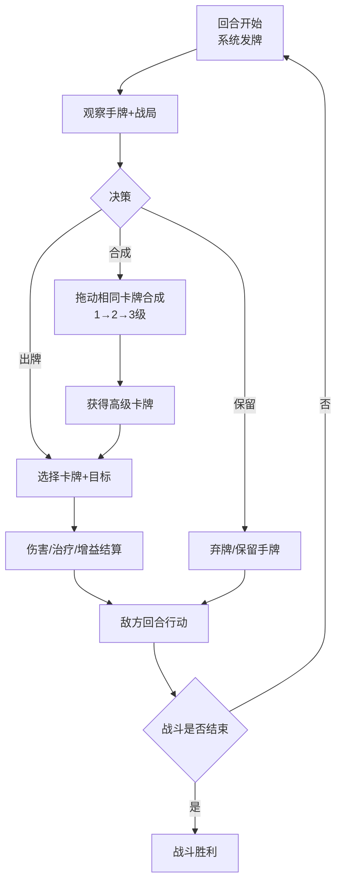
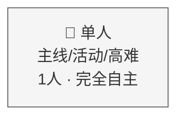
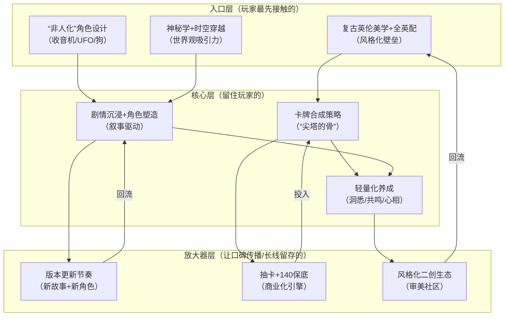

## 一、基本信息

| 项目 | 内容 |
|:-----|:-----|
| **游戏名称** | 重返未来：1999（Reverse: 1999） |
| **开发商/发行商** | 广州深蓝互动网络科技有限公司[reference:0] |
| **上线日期** | 2023-05-31（中国大陆）/ 2023-10-26（全球）[reference:1] |
| **平台** | iOS / Android / PC（Steam）[reference:2] |
| **底层驱动（主导）** | 内容叙事型 |
| **底层驱动（次要）** | 数值策略型 |
| **商业化模式** | 免费+内购（角色抽卡+月卡+战令） |
| **拆解版本** | 4.0 |
| **拆解日期** | 2026-08-25 |

## 二、拆解侧重点说明

> 根据[[90-2-1-2 底层驱动分类图谱]]和[[90-2-1-3 拆解维度标准SOP]]的权重分配，本篇报告的分析重心如下：

| 维度 | 权重 | 说明 |
|:-----|:----:|:-----|
| 第1层：核心循环（分钟级） | ★★★★ | 卡牌合成-出牌的回合制策略博弈，是“杀戮尖塔式”策略内核的落地载体 |
| 第2层：成长循环（天/周级） | ★★★ | 洞悉-共鸣-心相-塑造的四维养成体系，相对轻量化 |
| 第3层：商业化设计 | ★★★★ | 140抽保底、限定角色、累充争议——商业化与口碑的平衡是运营核心挑战 |
| 第4层：社交结构 | ★ | 纯单机体验，无内置社交系统 |
| 第5层：长线留存机制 | ★★★★ | 版本更新节奏、主线推进、角色塑造驱动持续登录 |
| 第6层：美术/UI/信息传达 | ★★★★★ | 复古英伦美学、全英配、风格化UI——这是重返未来最核心的差异化壁垒 |

> **系统视角声明**：本报告采用系统视角，不将游戏的成功或失败归因于单一因素，而是试图描述各要素之间的协同、耦合与相互强化关系。各章节的分析结论将在“第十一章 系统因果分析”中整合为完整的因果网络图。

## 三、第1层：核心循环（分钟级）

> **定义**：玩家在游戏中最基本的“操作-反馈-决策”单元。参考[[90-2-1-3 拆解维度标准SOP#1.3 第1层：核心循环]]。

### 3.1 最小循环描述

《重返未来：1999》的战斗是**回合制卡牌策略**——每回合系统随机发牌，玩家消耗行动力使用技能牌，或通过“移牌合成”将相同卡牌合成为更高级的卡牌[reference:3][reference:4]。

单回合战斗循环链条：

观察手牌（3张角色技能牌+随机发牌）→ 评估当前战局（敌方血量/状态/属性克制）→ 决策（出牌/移牌合成/弃牌）→ 执行操作 → 伤害/治疗/增益结算 → 敌方回合行动 → 进入下一回合

**核心博弈点**：
- **合成vs即时输出**：是立即使用低阶卡牌建立优势，还是保留手牌等待合成高阶技能以打出爆发伤害？[reference:5]
- **资源管理**：每回合行动力有限（通常2-3点），需要合理分配
- **属性克制**：现实/精神伤害对应不同防御类型[reference:6]

**外媒评价**：“P系列的皮，尖塔的骨”——虽然没有牌组构筑，但战斗逻辑与《杀戮尖塔》神似[reference:7][reference:8]。卡牌分为1-3级，“移牌合成”机制增加了策略深度[reference:9]。

### 3.2 循环结构图

### 3.3 关键参数

|参数|数值|说明|
|---|---|---|
|单回合操作时间|约30-60秒|含决策+操作时间|
|每回合行动力|2-3点|取决于角色和状态|
|手牌上限|7张|超出需弃牌|
|卡牌等级|1-3级|通过移牌合成升级|
|属性克制|现实/精神/属性|对应不同防御类型|
|随机元素占比|中高|发牌随机性是核心策略变量|

### 3.4 爽感来源分析

《重返未来：1999》的爽感来自**策略决策的智力快感**：

1. **“合成爆发”的延迟满足**：将两张1级牌合成为2级牌，再将两张2级合成为3级——3级牌的高额伤害/效果带来的“蓄力一击”快感，是战斗中最强的多巴胺触发器。
    
2. **“算到了”的智力满足**：预判敌方行动、合理分配行动力、规划手牌合成路径——当你的策略完美执行时，产生的是“我算赢了”的智力快感。
    
3. **角色技能联动的“化学反应”**：不同角色的技能牌之间存在配合——先上debuff再打输出、先加buff再爆发，形成连招感。
    

### 3.5 潜在疲劳点

1. **发牌随机性的“运气成分”**：当关键回合抽不到想要的牌时，会产生“被系统针对”的挫败感。
    
2. **战斗节奏偏慢**：回合制+卡牌策略的决策时间较长，不适合追求“快节奏”的玩家。
    
3. **后期战斗的重复感**：部分玩家反馈“后期战斗玩法太单调，容易玩腻”。
    

### 3.6 ← → 与其他层的交互

|关联层|交互关系|
|---|---|
|第2层（成长循环）|角色洞悉等级解锁新技能机制——成长直接改变核心循环的“可用卡牌池”和策略空间|
|第3层（商业化）|新角色带来新的技能牌组和机制——玩家为“解锁新的策略玩法”而抽卡|
|第4层（社交结构）|纯单机体验，核心循环不受社交干扰|
|第5层（长线留存）|每个版本新角色带来新的卡牌机制——核心循环的策略深度被持续刷新|
|第6层（UI/信息）|卡牌合成拖拽操作的流畅度、UI反馈的精致感——直接影响核心循环的操作体验|

## 四、第2层：成长循环（天/周级）

> **定义**：玩家在每日/每周时间尺度上的行为模式。参考[[90-2-1-3 拆解维度标准SOP#1.4 第2层：成长循环]]。

### 4.1 每日必做（Daily）

|行为|耗时|奖励|驱动力类型|
|---|---|---|---|
|每日任务/活跃度|10-20分钟|雨滴+微尘+利齿子儿|资源|
|体力消耗（刷材料本）|10-20分钟|养成材料|数值|
|家园系统收菜|5分钟|资源|资源|

**体力系统争议**：玩家反馈“体力太少了，想打资源，打两三次就没了”。体力恢复速度偏慢，限制了每日可玩内容的量。

### 4.2 每周目标（Weekly）

|目标|重置周期|奖励|是否强制|
|---|---|---|---|
|周常任务|每周|雨滴+资源|否|
|版本活动（限时）|版本周期|限定奖励|是（核心内容）|
|深渊/高难挑战|月/版本|资源|否|

### 4.3 资源循环图

text

[日常任务/体力消耗] → [微尘/利齿子儿/材料] → [角色升级/洞悉] → [战力提升]
                                    ↓
[版本活动] → [雨滴/限定材料] → [抽卡] → [新角色] → [新养成目标]
                                    ↓
[周常/高难] → [资源] → [共鸣拼图/心相强化] → [进一步战力提升]

文字说明：  
《重返未来：1999》的养成系统相对轻量化，分为四个维度：

|养成维度|说明|
|---|---|
|**等级**|消耗微尘（经验）与利齿子儿（货币）提升等级，受洞悉等级限制|
|**洞悉**|角色突破。等级升满后需洞悉，洞悉后等级归1，属性提升、等级上限提升、解锁新立绘|
|**共鸣**|在固定格网中拼接不同形状的模块来提升属性，类似“俄罗斯方块”|
|**心相**|角色装备，提供机制属性与特效，公测版本已删除心相池变为免费装备|
|**塑造**|重复获得角色时提升，只影响技能数值而非机制拆分|

### 4.4 断档期识别

- **体力枯竭期**：体力用完后无法继续刷材料，每日上线时间大幅缩短
    
- **版本末期**：当前版本活动已全部完成→等待下个版本
    
- **卡池空窗期**：不打算抽当前UP角色→抽卡动机缺失
    

### 4.5 长线目标

|时间维度|核心目标|进度可视化方式|
|---|---|---|
|1个版本（约42天）|抽取当期UP角色|角色图鉴|
|3-6个月|主力队伍成型（3-4人洞悉3）|角色练度+共鸣等级|
|1年+|全角色收集/全图鉴|图鉴完成度|

### 4.6 ← → 与其他层的交互

|关联层|交互关系|
|---|---|
|第1层（核心循环）|洞悉解锁新技能机制——成长直接改变核心循环的可用策略|
|第3层（商业化）|抽卡获得新角色=新的养成目标——付费驱动成长循环持续运转|
|第4层（社交结构）|纯单机体验，成长不受社交影响|
|第5层（长线留存）|每个版本新角色持续刷新养成目标——“永远有角色可以养”|

## 五、第3层：商业化设计

> **定义**：游戏如何将玩家体验转化为收入。参考[[90-2-1-3 拆解维度标准SOP#1.5 第3层：商业化设计]]。

### 5.1 付费入口总览

|付费类型|付费形式|对应心理账户|价格区间|
|---|---|---|---|
|角色抽卡|雨滴抽取（独一律）|“收集角色”+“体验新玩法”|140抽保底|
|月卡|订阅制|“每日领雨滴”|约30元/月|
|战令|版本购买|“打得多不亏”|约68元/版本|
|皮肤/时装|直购|“角色装扮”|68-168元|
|限时累充|活动期间付费|“额外奖励”|争议极大|

### 5.2 核心付费路径

**开服初期（2023）**：相比头部3D大世界二游的180抽大保底+武器池，1999的140抽保底+无武器池的设计把抽卡成本压下来了。加上福利投放、限定200抽兑换等设计，部分玩家认为“可以接受”。

**三周年危机（2026）**：2026年4月，三周年版本前瞻直播后，官方评论区被超过80万条评论刷屏，一场足以载入二游史册的重大舆情爆发。

|争议点|具体表现|
|---|---|
|**空降限时累充**|公测三年来从未设置过累充系统，这次不仅新增累充，还规定“只计算活动期间付费金额”，过去三年充值记录一键清零|
|**累充奖励含往期限定**|当年玩家重金拿下的限定角色，如今新玩家靠一单就能获取，老玩家情怀和投入大幅贬值|
|**多卡池连环逼氪**|全新限定角色+限时UP角色+高人气角色狂想系统同时开放，各卡池之间抽数不互通|
|**福利大幅缩水**|全勤玩家只能拿到45抽，对比二周年/半周年福利直接腰斩|
|**时装折扣券缩水**|去年送两张365面额通用券，今年变成390面额通用券+200面额当季专用券，实际优惠更小|

**玩家反应**：投票显示47%玩家“非常不满意”，仅3.4%“满意”。“没大厂的命，得了大厂的病”成为社区高频评价。

### 5.3 付费深度分析

|维度|数据|说明|
|---|---|---|
|零氪vs满氪战力差距|显著|塑造等级+限定角色影响大|
|角色保底|140抽|相比头部产品较低|
|单抽价格|约16元|标准二游定价|
|限定获取|200抽保底兑换|部分限定池|
|全角色收集期望|较高|持续推出新角色|
|是否有付费上限|无限|持续推出新角色和新皮肤|

### 5.4 付费与体验的关系

《重返未来：1999》的付费与体验的关系是 **“付费=更多角色+更强角色”** ：

- 付费抽到新角色 → 解锁新的技能牌组和策略玩法
    
- 付费抽到重复角色 → 提升塑造等级 → 技能数值提升（但不拆分机制）
    
- 付费购买皮肤 → 角色外观变化
    

**关键设计**：公测版本明确“塑造提升不会有机制拆分，塑造只影响角色的技能数值”。这意味着零氪玩家和满氪玩家的“玩法体验”是一致的，差距仅在数值层面——这是一个重要的商业化底线设计。

### 5.5 诱导性设计识别

|设计手法|是否存在|具体表现|
|---|---|---|
|首充双倍/限时优惠|✅|首充双倍雨滴|
|概率展示（保底/随机）|✅|140抽保底|
|限时卡池/限定角色|✅|限定角色+复刻机制|
|沉没成本诱导|✅|抽卡投入的“已经抽了这么多”心理|
|社交展示（付费身份的可见性）|❌|无社交系统，付费身份不可见|

### 5.6 ← → 与其他层的交互

|关联层|交互关系|
|---|---|
|第1层（核心循环）|新角色带来新的技能牌组——付费=解锁新的策略玩法|
|第2层（成长循环）|抽卡获得新角色=新的养成目标——付费驱动成长循环|
|第4层（社交结构）|无社交系统，付费不受社交压力驱动|
|第5层（长线留存）|三周年累充争议导致部分玩家流失——商业化决策直接影响留存|

## 六、第4层：社交结构

> **定义**：游戏如何组织和定义玩家之间的关系。参考[[90-2-1-3 拆解维度标准SOP#1.6 第4层：社交结构]]。

### 6.1 社交层级图

《重返未来：1999》为**纯单机体验**的游戏，无内置社交系统。

### 6.2 社交驱动力分析

|社交形式|是否强制|核心驱动力|回报类型|
|---|---|---|---|
|好友/关注|❌ 不存在|—|—|
|组队/联机|❌ 不存在|—|—|
|公会/帮派|❌ 不存在|—|—|
|阵营/势力|❌ 不存在|—|—|

### 6.3 社交身份的可见性

不适用（无社交系统）。

### 6.4 负面社交处理

不适用（无社交系统）。

### 6.5 ← → 与其他层的交互

|关联层|交互关系|
|---|---|
|第1层（核心循环）|无社交系统意味着核心循环的体验完全“内向”——玩家面对的是卡牌和策略，不受社交干扰|
|第2层（成长循环）|成长路径完全独立，无需依赖他人|
|第3层（商业化）|无社交展示型付费内容，付费驱动纯粹来自“个人喜好”和“强度需求”|
|第5层（长线留存）|无社交退出成本，留存纯粹依赖“内容+角色+策略”驱动|

## 七、第5层：长线留存机制

> **定义**：游戏如何让玩家在“玩了一个月之后”仍然愿意留下来。参考[[90-2-1-3 拆解维度标准SOP#1.7 第5层：长线留存机制]]。

### 7.1 内容更新节奏

|更新类型|频率|内容量|说明|
|---|---|---|---|
|大版本|约42天/次|新主线+新角色+新活动|稳定更新节奏|
|新角色|约1-2个/版本|新六星角色+配套剧情|驱动抽卡|
|春节/周年庆版本|年度|重量级内容+福利|年度回流高峰|
|主线推进|随版本|新章节+新剧情|叙事驱动型核心|

### 7.2 第30天 vs 第180天的留存驱动力

|时间节点|核心驱动力|玩家状态|
|---|---|---|
|第30天|主线剧情+角色养成|处于“看故事+养角色”的正向循环中|
|第180天|版本更新+新角色期待|“下个版本有什么新角色”的期待驱动|

### 7.3 回归机制

|机制|描述|效果评估|
|---|---|---|
|新版本/新主线|“又有新故事了”|高——叙事驱动型核心回流引擎|
|新角色UP|“想抽这个角色”|高——角色驱动抽卡和回归|
|春节/周年庆|福利+重量级内容|高——年度回流高峰|
|好友召回|无社交系统|不适用|

### 7.4 退出成本分析

|退出成本类型|说明|
|---|---|
|**时间成本**|数月的角色养成积累|
|**金钱成本**|抽卡投入、月卡投入|
|**情感成本**|对角色和剧情的情感投入——这是重返未来最独特的退出成本|
|**“版本惯性”**|每个版本都有新故事和新角色——永远有“下个版本再看看”的理由|

### 7.5 终局内容

- 主线剧情全通——叙事驱动型玩家的核心目标
    
- 高难挑战（鬃毛、迷思海等）——策略验证
    
- 全角色/全图鉴收集——收藏型玩家的终极目标
    
- 角色“毕业”——洞悉3+共鸣10+心相满级
    

### 7.6 ← → 与其他层的交互

|关联层|交互关系|
|---|---|
|第1层（核心循环）|新角色带来新的卡牌机制——核心循环的策略深度被持续刷新|
|第2层（成长循环）|新版本=新角色+新养成目标——成长循环持续获得新内容|
|第3层（商业化）|每个版本推出新角色，创造持续付费点——但三周年累充争议暴露了商业化与玩家信任的脆弱平衡|
|第4层（社交结构）|无社交系统，留存纯粹依赖“内容+角色”驱动|

## 八、第6层：美术/UI/信息传达

> **定义**：视觉和界面设计如何服务于“让玩家看懂、融入、不疲倦”。参考[[90-2-1-3 拆解维度标准SOP#1.8 第6层：美术/UI/信息传达]]。

### 8.1 审美调性分析

|维度|描述|是否服务于核心体验|
|---|---|---|
|整体美术风格|复古英伦+神秘学，20世纪美学，多种艺术风格交织|是——风格本身就是叙事的一部分|
|色彩倾向|复古老旧与现代时尚的平衡|是——“时代感”的视觉表达|
|角色设计|独树一帜，“你在卡池里可能抽到一台收音机、一块玻璃片、一架UFO、旋转木马、三台电视组成的TTT、一套空铠甲，甚至一只狗”|是——角色设计的“非人化”是最大差异化|
|场景/环境|近现代背景，复古英伦风格|是——时空穿梭的世界观视觉锚点|
|UI视觉风格|“从启动画面到战斗结算界面，处处体现出类似Atlus旗下作品所特有的炫酷与精细感”|是——“P系列风格外壳”的视觉呈现|

### 8.2 UI效率分析

|常用操作|操作步骤数|是否合理|
|---|---|---|
|进入战斗|2-3步|是|
|卡牌合成/出牌|1-2步（拖拽/点击）|是|
|查看角色/养成|2-3步|是|
|抽卡|1-2步|是|

### 8.3 信息传达效率分析

|信息类型|传达方式|响应速度|是否清晰|
|---|---|---|---|
|角色血量/状态|HUD显示|即时|是|
|手牌信息|屏幕下方卡牌|即时|是|
|卡牌等级|卡牌上的等级标识|即时|是|
|属性克制|颜色/图标标识|即时|是|
|战斗反馈|伤害数字+特效+音效|即时|是|

### 8.4 优秀设计与可改进点

**优秀设计（≥3处）**：

1. **“全英配”的沉浸感**：角色全程英配，充满时代情调。在堪称地道的英音配音加持下，充满了高级感——这是重返未来区别于所有竞品的核心审美壁垒。
    
2. **“非人化”角色设计**：抽到收音机、玻璃片、UFO、旋转木马、甚至一只狗——这种“非人化”的角色设计在二游领域前所未有，极大地拓展了“角色”的定义边界。
    
3. **风格化UI的“一致性”**：从启动画面到战斗结算界面，UI设计处处体现出炫酷与精细感。风格化力度是前所未有且颠覆性的——审美调性贯穿所有界面，形成了完整的沉浸体验。
    
4. **“共鸣”系统的视觉化设计**：在固定格网中拼接不同形状的模块——将数值养成转化为可视化的“拼图”操作，增加了养成的趣味性和视觉层次感。
    

**可改进点（≥3处）**：

1. **文字量大、剧情节奏偏慢**：游戏文字量大，剧情门槛较高——部分玩家反馈“看剧情越来越累”。
    
2. **字体/信息密度问题**：部分界面文字偏小，信息密度对新手不友好。
    
3. **体力系统的UI焦虑**：体力太少，打两三次就没了——体力不足的视觉提示持续制造“不够用”的焦虑感。
    

### 8.5 ← → 与其他层的交互

|关联层|交互关系|
|---|---|
|第1层（核心循环）|卡牌合成拖拽操作的流畅度、UI反馈的精致感——直接影响核心循环的操作体验|
|第2层（成长循环）|共鸣系统的“拼图”视觉化设计——将数值养成转化为可感知的视觉操作|
|第3层（商业化）|角色立绘/模型的美术质量是“为爱付费”的视觉基础——玩家为“好看”付费|
|第4层（社交结构）|无社交系统，审美体验完全服务于个人沉浸|

## 九、弃坑拐点分析

|阶段|典型流失原因|机制层面是否存在预防设计|
|---|---|---|
|新手期（前1-7天）|文字量大、剧情门槛高、战斗机制不理解|新手引导+剧情逐步展开|
|成长期（第1-2月）|体力不够用、养成节奏慢|月卡+日常资源——但体力系统仍是痛点|
|成熟期（第3-6月）|内容消耗完、长草期|版本更新——但版本末期仍有长草感|
|长线期（6月以上）|三周年累充争议、角色膨胀、剧情质量波动|商业化信任修复是关键挑战|

## 十、横向穿刺锚点

|锚点|本游戏数据|关联专题|
|---|---|---|
|核心循环时长|30-60秒/回合||
|每日必做耗时|20-40分钟||
|单抽价格|约16元||
|角色保底|140抽||
|月卡价格与回报|约30元/月||
|版本更新周期|约42天|[[90-2-1-22 专题_赛季制与版本更新节奏研究]]|
|新角色频率|约1-2个/版本|[[90-2-1-22 专题_赛季制与版本更新节奏研究]]|
|最大社交单元|不适用（单机）|[[90-2-1-21 专题_社交结构金字塔]]|
|零氪与满氪战力差距|显著（塑造等级）||

## 十一、系统因果分析

> **本章为必填项，是本报告的核心章节。** 本章将前10章的各层分析整合为一张“系统因果网络图”，标识各要素之间的协同、耦合与相互强化关系。

### 11.1 因果网络图

    
**图例说明**：

- **入口层**：玩家通过什么进入游戏/被吸引
    
- **核心层**：玩家为什么持续玩下去
    
- **放大器层**：玩家为什么带朋友来、为什么回流
    
- **实线箭头**：直接因果/支撑关系
    
- **虚线箭头**：反馈强化关系
    

### 11.2 入口/核心/放大器分层说明

|层级|包含要素|作用|
|---|---|---|
|**入口层**|复古英伦美学+全英配、“非人化”角色设计、神秘学+时空穿越世界观|降低用户获取成本，制造第一印象——风格化是最大钩子|
|**核心层**|卡牌合成策略、剧情沉浸+角色塑造、轻量化养成|创造持续游玩的动机——策略+故事+养成三核驱动|
|**放大器层**|版本更新节奏、抽卡+140保底、风格化二创生态|驱动口碑传播、社交裂变、长线回流|

### 11.3 必要非充分说明

> **必填项**。明确声明单一因素不足以解释游戏的成功或失败。

**声明**：本报告认为，《重返未来：1999》的差异化成功是以下多因素共同作用的结果：复古英伦美学+全英配的风格化壁垒、“非人化”角色设计的颠覆性创新、神秘学+时空穿越的世界观吸引力、卡牌合成策略的战斗深度、剧情沉浸+角色塑造的叙事驱动、轻量化的养成系统、以及42天/版本的稳定更新节奏。

其中：

- **复古英伦美学+全英配**是“用户获取”的**必要非充分条件**——没有这套风格化体系，重返未来只是一款普通的策略卡牌游戏；但仅有风格化，没有策略深度和叙事支撑，玩家会在“新鲜感”消退后离开；
    
- **卡牌合成策略**是“留存”的**核心稳定器**——“P系列的皮，尖塔的骨”证明了策略深度是留住玩家的关键；
    
- **剧情沉浸+角色塑造**是“情感留存”的**强化因子**——“封神的剧情中所蕴含的深刻游戏内涵”让玩家形成情感绑定；
    
- **版本更新节奏**是“长线”的**放大器**——持续的新故事和新角色让玩家“永远有下个版本”的期待。
    

**单一归因警告**：任何将《重返未来：1999》的成功归结为单一因素的解释，在本报告的框架下均被视为不完整的分析。

### 11.4 系统脆弱性识别

|脆弱环节|后果|现实案例/假设场景|
|---|---|---|
|商业化信任崩塌|三周年累充争议引发大规模舆情，评论区80万+刷屏|2026年4月三周年危机|
|剧情质量波动|“越来越注重宏大叙事，人物变成概念的体现者”|部分玩家反馈剧情“拖沓”|
|角色膨胀|新角色强度碾压旧角色，“不抽就版本掉队”|限定辅助机制碾压现有角色|
|体力系统焦虑|体力太少导致每日可玩内容有限|长期存在的玩家痛点|

### 11.5 正向循环 vs 恶性循环

**正向循环（增长飞轮）** ：

> 新版本发布 → 新角色+新剧情上线 → 玩家抽卡体验新内容 → 社区讨论+二创发酵 → 风格化审美破圈 → 新玩家被吸引 → 下个版本继续 → 42天节奏持续运转

**恶性循环（衰退螺旋）** ：

> 商业化争议（累充/多卡池）→ 玩家信任崩塌 → 付费意愿下降 → 流水下滑 → 运营压力增大 → 商业化进一步激进 → 更多玩家流失 → 生态萎缩

## 十二、总结

### 12.1 一句话评价

《重返未来：1999》是二游领域“风格化”的极致演绎——它用复古英伦美学+全英配+“非人化”角色设计构建了无法复制的审美壁垒，用卡牌合成策略+深度叙事+轻量化养成的组合留住了玩家，但三周年的商业化危机暴露了“风格化”与“商业化”之间的脆弱平衡。

### 12.2 核心发现（3-5条）

1. **“风格化”是最大的护城河，也是最脆弱的护城河**：复古英伦美学+全英配+神秘学世界观，在二游领域“前所未有且颠覆性的”。这种风格化贯穿了美术、世界观、人设、剧情、演出、文本风格乃至音乐。但风格化的维护成本极高——一旦商业化动作破坏了审美一致性（如三周年累充争议），风格化带来的品牌好感会被迅速消耗。
    
2. **“非人化”角色设计拓展了“角色”的定义**：你在卡池里可能抽到一台收音机、一块玻璃片、一架UFO、旋转木马、三台电视组成的TTT、一套空铠甲，甚至一只狗。这种“非人化”的设计在二游领域前所未有，极大地拓展了“角色收集”的定义边界——玩家收集的不是“人”，而是“概念”和“物件”。
    
3. **“P系列的皮，尖塔的骨”的策略深度**：虽然UI和美术风格借鉴了《女神异闻录》系列的炫酷感，但战斗系统的核心逻辑与《杀戮尖塔》高度相似。卡牌分三级、移牌合成、资源积累与即时输出的权衡——这套策略体系让重返未来在“好看”之外有了“好玩”的支撑。
    
4. **“塑造不拆机制”的商业化底线**：公测版本明确“塑造提升不会有机制拆分，塑造只影响角色的技能数值”。这意味着零氪和满氪玩家的“玩法体验”是一致的——这是一个重要的商业化底线设计，也是玩家在开服初期认可抽卡体验的原因之一。
    
5. **三周年危机：风格化品牌的“信任税”**：2026年4月，三周年版本因空降累充、多卡池逼氪、福利缩水引发80万+评论刷屏。“没大厂的命，得了大厂的病”成为社区高频评价——当风格化品牌做出“大厂式”商业化操作时，玩家的背叛感会被放大。
    

### 12.3 可借鉴的设计点

1. **“全英配+复古美学”的风格化壁垒**：在二次元手游市场中，用“英伦审美+全英配音+复古艺术”构建了无法复制的差异化——风格化做到极致本身就是护城河
    
2. **“非人化”角色设计的创新**：打破“角色=人”的惯性思维，将收音机、UFO、狗等非人存在纳入卡池——拓展了“角色收集”的定义边界
    
3. **“塑造不拆机制”的底线设计**：重复获取角色只提升数值不拆分机制——保证了零氪玩家的“玩法完整性”
    
4. **“共鸣拼图”的养成可视化**：将数值养成转化为“俄罗斯方块”式的拼图操作——增加了养成的趣味性和视觉层次感
    
5. **“无武器池”的抽卡减负**：相比头部产品的角色+武器双池，1999无武器池的设计降低了毕业成本
    

### 12.4 需警惕的陷阱

1. **风格化与商业化的冲突**：当风格化品牌做出“大厂式”商业化操作时，玩家的背叛感会被放大。三周年累充争议证明了这一点——风格化是双刃剑，它既是护城河，也是放大镜。
    
2. **剧情“宏大叙事化”的风险**：部分玩家反馈“越来越注重宏大叙事，人物变成概念的体现者”——当叙事从“人物驱动”转向“概念驱动”时，情感共鸣可能被稀释。
    
3. **角色膨胀的“版本掉队”焦虑**：“不抽就版本掉队”——当新角色强度碾压旧角色时，玩家的投入贬值感知会加速流失。
    
4. **体力系统的“内容天花板”**：体力太少导致每日可玩内容有限——在缺乏社交系统的前提下，内容消耗速度直接决定了玩家的在线时长和留存。
    

## 十三、关联笔记

- [[90-2-1-1 拆解总索引_MOC]]
- [[90-2-1-2 底层驱动分类图谱]]
    
- [[90-2-1-3 拆解维度标准SOP]]
    
- [[90-2-1-10 赛博朋克2077_叙事深度、开放世界与玩家选择的系统耦合]]（同为内容叙事型，对比“西式3A叙事”vs“二次元风格化叙事”的差异）
    
- [[90-2-1-16 原神_战斗系统、内容更新与IP传播的系统协同]]（同为内容叙事型，对比“开放世界ARPG”vs“卡牌策略RPG”的内容驱动逻辑）
    
- [[90-2-1-22 专题_赛季制与版本更新节奏研究]]（42天/版本的更新节奏分析）