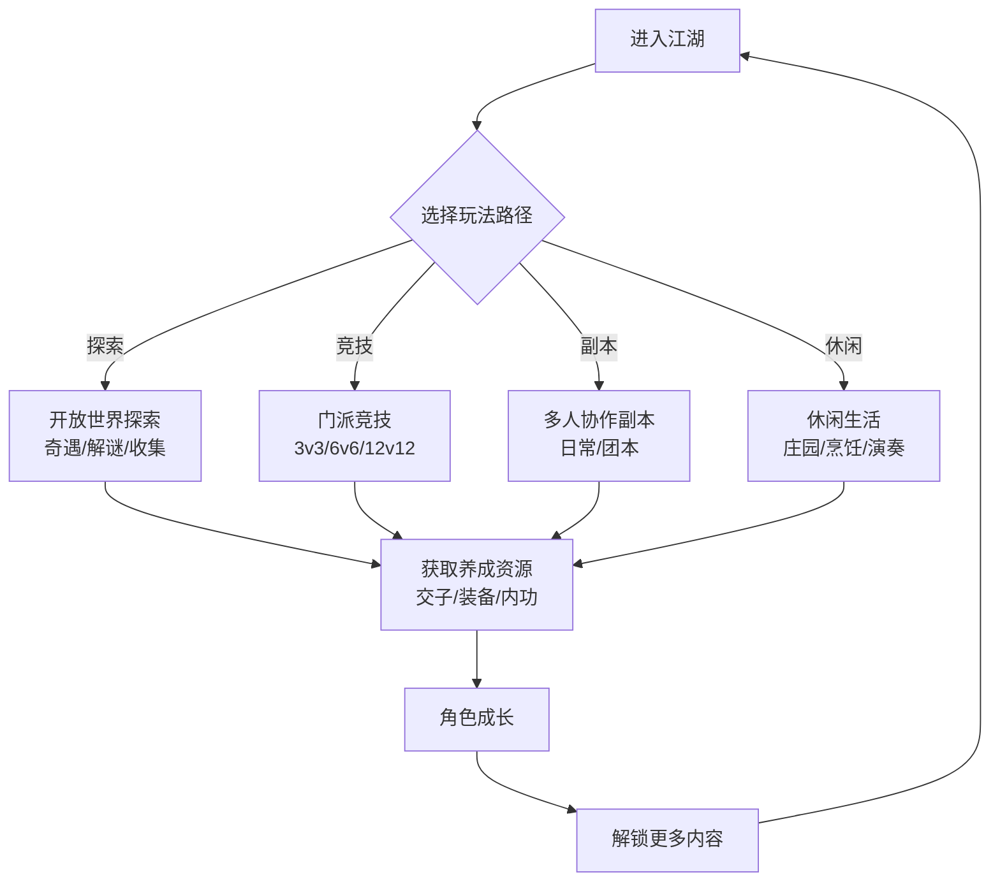

## 一、基本信息

| 项目 | 内容 |
|:-----|:-----|
| **游戏名称** | 逆水寒手游 |
| **开发商/发行商** | 网易游戏 |
| **上线日期** | 2023-06-30 |
| **平台** | iOS / Android / PC云游戏 |
| **底层驱动（主导）** | 社交经济型 |
| **底层驱动（次要）** | 内容叙事型 |
| **商业化模式** | 免费+内购（外观/月卡/战令） |
| **拆解版本** | S3「江湖重启」 |
| **拆解日期** | 2026-08-25 |


## 二、拆解侧重点说明

> 根据[[90-2-1-2 底层驱动分类图谱]]和[[90-2-1-3 拆解维度标准SOP]]的权重分配，本篇报告的分析重心如下：

| 维度 | 权重 | 说明 |
|:-----|:----:|:-----|
| 第1层：核心循环（分钟级） | ★★★ | “探索-养成-竞技-社交”的正向循环，无强制日常打卡，玩家自由选择玩法路径[reference:0] |
| 第2层：成长循环（天/周级） | ★★★★★ | “殊途同归”多轨制段位系统、赛季制重置、养成精简是MMO轻量化的核心创新[reference:1] |
| 第3层：商业化设计 | ★★★★ | “彻底不卖数值”+外观付费+月卡战令，60%以上收入来自外观[reference:2][reference:3] |
| 第4层：社交结构 | ★★★★★ | AI NPC社交、帮会系统、结义系统、好友朋友圈——智能社交是逆水寒最核心的差异化壁垒[reference:4] |
| 第5层：长线留存机制 | ★★★★★ | 十年开发计划、赛季制更新、AI内容持续迭代[reference:5] |
| 第6层：美术/UI/信息传达 | ★★★ | 国风开放世界美术、移动端光追、全景式还原《清明上河图》市井百态[reference:6][reference:7] |

> **系统视角声明**：本报告采用系统视角，不将游戏的成功或失败归因于单一因素，而是试图描述各要素之间的协同、耦合与相互强化关系。各章节的分析结论将在“第十一章 系统因果分析”中整合为完整的因果网络图。


## 三、第1层：核心循环（分钟级）

> **定义**：玩家在游戏中最基本的“操作-反馈-决策”单元。参考[[90-2-1-3 拆解维度标准SOP#1.3 第1层：核心循环]]。


### 3.1 最小循环描述

《逆水寒》手游的核心循环与传统MMO有本质区别——**没有设置硬性的“每日打卡”门槛**，所有养成资源几乎都可以通过开放世界探索、隐藏任务、休闲玩法获取[reference:8]。

完整的核心循环链条：

进入江湖 → 自由选择玩法路径（探索/竞技/副本/休闲）→ 参与所选内容 →  
获得养成资源（交子/装备/内功等）→ 角色成长 → 解锁更多内容 → 继续自由选择

**四大玩法路径并行**[reference:9]：

| 路径 | 内容 | 特点 |
|:-----|:-----|:-----|
| **开放世界探索** | 磁州、汴京、杭州、东极海等数十张地图，上百个隐藏奇遇、解谜机关 | 探索驱动，无强制目标 |
| **门派竞技** | 八大职业（素问/神相/血河/碎梦/铁衣/龙吟/九灵/潮光），3v3/6v6/12v12竞技 | 公平竞技，技术为王 |
| **多人协作副本** | 日常副本到高难团本，装备不绑定支持自由交易 | 协作驱动，难度分层 |
| **休闲生活** | 烹饪、垂钓、制茶、演奏、庄园建造等数十种内容 | 纯休闲，无战力压力 |
### 3.2 循环结构图

### 3.3 关键参数

|参数|数值|说明|
|---|---|---|
|单次探索/活动周期|10-30分钟|可根据玩家时间自由调整|
|每日必做耗时|无强制|“殊途同归”打破MMO每日打卡套路[](https://apps.apple.com/cn/app/%E9%80%86%E6%B0%B4%E5%AF%92/id1541570980?itscg=10500&itsct=lny_cclp_cn&ls=1#1)|
|职业数量|8个|素问/神相/血河/碎梦/铁衣/龙吟/九灵/潮光[](https://m.toutiao.com/article/7654584728913232384/?upstream_biz=VolcEngine#1)|
|赛季重置周期|约3-4个月|段位与养成进度全面重置|
|随机元素占比|中|副本掉落、奇遇触发等构成随机层|

### 3.4 爽感来源分析

《逆水寒》手游的爽感来自**自由选择+多路径成长**：

1. **“想玩什么就玩什么”的自由感**：玩家不需要被强制绑定每日重复的日常任务，完全可以按照自己的喜好选择游戏内容[](https://m.toutiao.com/article/7654584728913232384/?upstream_biz=VolcEngine#1)。无论是做闲云野鹤探索江湖，还是做竞技高手登顶论武，都能获得完整的游戏体验。
    
2. **开放世界探索的“发现感”**：每张地图都藏有上百个隐藏奇遇和解谜机关，哪怕是玩一两年的老玩家也经常能发现之前没解锁的隐藏内容[](https://m.toutiao.com/article/7654584728913232384/?upstream_biz=VolcEngine#1)。
    
3. **公平竞技的“技术快感”**：3v3论武、6v6战场、12v12公平竞技赛场，装备和数值被平衡，胜负取决于操作和策略。
    
4. **社交互动的“人情味”**：和好友聊天、在朋友圈吃瓜、触发随机奇遇——很多玩家上线不需要完成固定任务，只是在江湖里逛逛就能获得足够的乐趣[](https://m.toutiao.com/article/7654584728913232384/?upstream_biz=VolcEngine#1)。
    

### 3.5 潜在疲劳点

1. **内容量过大导致的“选择焦虑”**：四大玩法路径、数十种休闲内容、上百个隐藏奇遇——部分玩家可能因“选择太多”而产生迷茫。
    
2. **PVE副本难度争议**：部分玩家反馈“PVE是宝宝本”，挑战性不足；也有玩家认为公测初期舞阳城难度对手机端过高。
    
3. **“缝合怪”标签的双刃剑**：游戏中融入了吃鸡、荒岛求生、斗地主、打麻将、黎明杀机、5v5推塔等多种玩法——丰富但也可能让核心体验失焦。
    

### 3.6 ← → 与其他层的交互

|关联层|交互关系|
|---|---|
|第2层（成长循环）|核心循环的“自由选择”直接服务于“殊途同归”系统——无论玩家选择哪条路径，都能获得完整的养成资源|
|第3层（商业化）|核心循环不设付费门槛——所有玩法路径对免费玩家完全开放，付费仅影响外观|
|第4层（社交结构）|核心循环中的“休闲生活”和“探索”是社交的天然场景——玩家在逛风景、盖房子、和朋友聊天中获得社交乐趣|
|第5层（长线留存）|核心循环的“自由选择”降低了玩家的“上班感”，让“想玩就玩、想走就走”成为可能——反而提高了长线留存|

## 四、第2层：成长循环（天/周级）

> **定义**：玩家在每日/每周时间尺度上的行为模式。参考[[90-2-1-3 拆解维度标准SOP#1.4 第2层：成长循环]]。

### 4.1 “殊途同归”——MMO领域前所未有的设计

《逆水寒》手游开创性地设计了MMO领域内前所未有的“殊途同归”式游玩引擎驱动内核：

|设计原则|说明|
|---|---|
|**日课任务无限刷新**|玩家可以无限刷新日常任务，直到刷到自己喜欢或简单的任务再去完成|
|**养成资源与玩法解绑**|无论游玩什么玩法都能拿满系统性的收益|
|**多轨制段位系统**|段位系统分为副本（PVE）、试剑天下（PVP）、公平论武（PVP）、闲趣（休闲玩法）四大轨道，4选2奖励通用|
|**活力值随心分配**|玩家可自由分配活力值到不同玩法|

### 4.2 每日行为（非强制）

|行为|耗时|奖励|驱动力类型|
|---|---|---|---|
|青崖书（日课）|可自由刷新|交子+养成资源|资源|
|开放世界探索|自由决定|奇遇奖励+收集品|内容+资源|
|休闲玩法|自由决定|交子+好感度|资源+社交|
|竞技场|自由决定|段位分|数值+社交|

### 4.3 每周目标（Weekly）

|目标|重置周期|奖励|是否强制|
|---|---|---|---|
|段位结算|赛季周期|赛季奖励|否|
|帮会活动|每周|帮贡+资源|否|
|周本/团本|每周|装备+材料|否|

### 4.4 养成系统精简（2026三周年改革）

2026年三周年前夕，《逆水寒》手游对养成与经济系统进行了颠覆性重构[](https://www.taptap.cn/moment/773636829374056861)：

|改动|说明|
|---|---|
|**货币大一统**|复杂货币统一为交子，各类活动代币全面取消，同步提升交子产出量[](https://www.taptap.cn/moment/773636829374056861)|
|**养成大精简**|仅保留强化、内功、武蕴三大模块，移除特技打造、玉石、特质[](https://www.taptap.cn/moment/773636829374056861)|
|**属性合并**|内外功属性合并，命中、格挡等难以理解的属性被移除，数值全面压缩[](https://www.taptap.cn/moment/773636829374056861)|
|**殊途同归2.0**|核心目标是实现上手易、过程爽、精通难[](https://www.taptap.cn/moment/773636829374056861)|

### 4.5 断档期识别

- **赛季末期**：赛季目标已达成或无法达成→等待下赛季重置
    
- **版本内容消耗完**：当前版本探索完毕→等待新资料片
    
- **养成“毕业”**：角色已养成至赛季天花板→等待新赛季新目标
    

### 4.6 长线目标

|时间维度|核心目标|进度可视化方式|
|---|---|---|
|1个赛季（约3-4个月）|段位达成/赛季奖励|段位徽章|
|3-6个月|主力角色养成毕业|战力评分|
|1年+|全地图探索/全收集|探索度+图鉴|

### 4.7 ← → 与其他层的交互

|关联层|交互关系|
|---|---|
|第1层（核心循环）|“殊途同归”让核心循环的“自由选择”有了实质回报——无论选哪条路，成长都不会落后|
|第3层（商业化）|赛季重置+不卖数值，让付费与成长解耦——付费玩家无法通过花钱缩短赛季成长周期|
|第4层（社交结构）|多轨制段位系统让不同偏好的玩家（PVE/PVP/休闲）都能找到自己的社交圈层|
|第5层（长线留存）|赛季重置创造了“每个赛季都是新开始”的持续动机，养成精简降低了回归门槛|

## 五、第3层：商业化设计

> **定义**：游戏如何将玩家体验转化为收入。参考[[90-2-1-3 拆解维度标准SOP#1.5 第3层：商业化设计]]。

### 5.1 核心原则：彻底不卖数值

《逆水寒》手游在商业化上做出了MMO领域最激进的承诺——**彻底不卖数值**[](https://shouyou.gamersky.com/news/202302/1569798.shtml#1)。

|承诺|具体表现|
|---|---|
|**不卖数值**|删除“装备随机词条”和“装备重锻”，改为“固定掉落装备”模式[](https://shouyou.gamersky.com/news/202302/1569798.shtml#1)|
|**赛季制免费**|赛季制且不需要买点卡[](https://shouyou.gamersky.com/news/202302/1569798.shtml#1)|
|**装备面前人人平等**|想要什么装备就去打对应BOSS、探索江湖，只有掉或不掉的运气干扰[](https://shouyou.gamersky.com/news/202302/1569798.shtml#1)|
|**付费不P2W**|付费项目只有时装外观与战令月卡，基本没有其他“pay to win”的氪金项目[](https://page.sm.cn/blm/midpage-317/index?id=10_a6477b3641b91fc17384b9c466036cf9&q=%e6%9c%80%e8%bf%91%e9%80%86%e6%b0%b4%e5%af%92%e4%b8%ba%e5%95%a5%e5%8f%88%e7%81%ab%e4%ba%86)|

### 5.2 付费入口总览

|付费类型|付费形式|对应心理账户|价格区间|
|---|---|---|---|
|外观（直售）|直购|“好看”+“社交展示”|6元起，288元封顶[](https://page.sm.cn/blm/midpage-317/index?id=10_a6477b3641b91fc17384b9c466036cf9&q=%e6%9c%80%e8%bf%91%e9%80%86%e6%b0%b4%e5%af%92%e4%b8%ba%e5%95%a5%e5%8f%88%e7%81%ab%e4%ba%86)|
|外观（抽奖）|抽卡（18元/抽）|“赌运气”+“稀有展示”|18元/抽，有保底|
|月卡|订阅制|“每日领资源”|约30元/月|
|战令/通行证|赛季购买|“打得多不亏”|约68元/赛季|

**商业化收入结构**（官方披露）：

|收入来源|占比|
|---|---|
|外观付费|60%以上|
|月卡+战令|主要稳定性收入|
|功能性道具|小部分|
|元宇宙植入广告|新模式|

### 5.3 “6元皮肤”的价格战策略

《逆水寒》手游喊出了“价格战”的口号——直售时装价格为全MMO品类价格最低、质量最高[](https://page.sm.cn/blm/midpage-317/index?id=10_a6477b3641b91fc17384b9c466036cf9&q=%e6%9c%80%e8%bf%91%e9%80%86%e6%b0%b4%e5%af%92%e4%b8%ba%e5%95%a5%e5%8f%88%e7%81%ab%e4%ba%86)：

- 6元时装曾助游戏登顶畅销榜，官方称之为“一场六块钱的胜利”[](https://page.sm.cn/blm/midpage-317/index?id=10_a6477b3641b91fc17384b9c466036cf9&q=%e6%9c%80%e8%bf%91%e9%80%86%e6%b0%b4%e5%af%92%e4%b8%ba%e5%95%a5%e5%8f%88%e7%81%ab%e4%ba%86)
    
- 最高档直售时装配合半价券售价144元，细节拉满[](https://page.sm.cn/blm/midpage-317/index?id=10_a6477b3641b91fc17384b9c466036cf9&q=%e6%9c%80%e8%bf%91%e9%80%86%e6%b0%b4%e5%af%92%e4%b8%ba%e5%95%a5%e5%8f%88%e7%81%ab%e4%ba%86)
    
- 玩家评价：“这种顶级质量放在隔壁MMO不得卖到上万”[](https://page.sm.cn/blm/midpage-317/index?id=10_a6477b3641b91fc17384b9c466036cf9&q=%e6%9c%80%e8%bf%91%e9%80%86%e6%b0%b4%e5%af%92%e4%b8%ba%e5%95%a5%e5%8f%88%e7%81%ab%e4%ba%86)
    

### 5.4 付费深度分析

|维度|数据|说明|
|---|---|---|
|零氪vs满氪战力差距|**无差距**|不卖数值，付费不影响战力[](https://page.sm.cn/blm/midpage-317/index?id=10_a6477b3641b91fc17384b9c466036cf9&q=%e6%9c%80%e8%bf%91%e9%80%86%e6%b0%b4%e5%af%92%e4%b8%ba%e5%95%a5%e5%8f%88%e7%81%ab%e4%ba%86)|
|单抽价格（外观抽奖）|18元/抽|纯外观，不影响战力|
|外观保底|15次必得外观|累计15次使用必得外观|
|直售外观价格|6-288元|全MMO品类最低[](https://page.sm.cn/blm/midpage-317/index?id=10_a6477b3641b91fc17384b9c466036cf9&q=%e6%9c%80%e8%bf%91%e9%80%86%e6%b0%b4%e5%af%92%e4%b8%ba%e5%95%a5%e5%8f%88%e7%81%ab%e4%ba%86)|
|月卡价格|约30元/月|性价比高|
|是否有付费上限|无限|持续推出新外观|

### 5.5 付费与体验的关系

《逆水寒》的付费与体验的关系是 **“付费=好看+社交展示”** ：

- 付费购买外观 → 角色更漂亮/更独特 → 在社交场景中更显眼
    
- 付费购买月卡/战令 → 获取更多资源 → 加速养成（但不改变战力上限）
    
- 付费不购买任何数值优势 → 零氪玩家和付费玩家在战斗中的起点完全一致
    

“不卖数值”让《逆水寒》的商业生态向MOBA、FPS等大DAU产品类型看齐——依靠庞大的用户基数和高质量的外观内容实现持续盈利。

### 5.6 诱导性设计识别

|设计手法|是否存在|具体表现|
|---|---|---|
|首充双倍/限时优惠|✅|首充福利|
|概率展示（保底/随机）|✅|外观抽奖有保底|
|限时卡池/限定外观|✅|限定时装+坐骑|
|沉没成本诱导|✅|抽奖投入的“已经抽了这么多”心理|
|社交展示（付费身份的可见性）|✅|外观在社交场景中高度可见|

### 5.7 ← → 与其他层的交互

|关联层|交互关系|
|---|---|
|第1层（核心循环）|不卖数值意味着核心循环的公平性不受付费影响——零氪和付费玩家的战斗体验一致|
|第2层（成长循环）|赛季重置+不卖数值，让“每个赛季重新开始”对所有玩家公平|
|第4层（社交结构）|外观是社交身份的“可见标签”——付费玩家的外观在社交场景中被看见，构成“展示型消费”的驱动力|
|第5层（长线留存）|不卖数值的长期信任是长线留存的基础——玩家相信“我不会被氪金玩家碾压”|

## 六、第4层：社交结构

> **定义**：游戏如何组织和定义玩家之间的关系。参考[[90-2-1-3 拆解维度标准SOP#1.6 第4层：社交结构]]。

**这是《逆水寒》手游最核心的差异化层——智能社交是逆水寒最大的创新。**

### 6.1 社交层级图
```
graph TD
    A[👤 单人<br>探索/剧情/休闲<br>1人 · 完全自主] 
    B[👥 好友/结义<br>小型社交单元<br>2-10人 · 轻度绑定]
    C[🏠 帮会<br>中型组织<br>40-200人 · 中度绑定]
    D[🤖 AI NPC/门客<br>智能社交<br>1人+NPC · 无压力社交]
    E[📱 朋友圈/茶壶<br>社区型社交<br>全服可见 · 弱绑定]
    A -->|加好友| B
    B -->|加入帮会| C
    A -->|创建门客| D
    B -->|发朋友圈| E
    
    A -.->|社恐福音| D
    B -.->|固定队形成| C
    C -.->|帮会归属感| E
```

### 6.2 AI智能NPC——“永不下线”的数字分身

《逆水寒》是国内首款为NPC加载人工智能引擎的手游，NPC与游戏机制深度融合[](https://apps.apple.com/cn/app/%E9%80%86%E6%B0%B4%E5%AF%92/id1541570980?itscg=10500&itsct=lny_cclp_cn&ls=1#1)：

|AI社交功能|说明|
|---|---|
|**智能NPC互动**|玩家可与NPC无限交流，甚至插手NPC私生活，改变江湖走向[](https://apps.apple.com/cn/app/%E9%80%86%E6%B0%B4%E5%AF%92/id1541570980?itscg=10500&itsct=lny_cclp_cn&ls=1#1)|
|**NPC记忆系统**|NPC会记得玩家说过的话和做过的事，并基于深度学习给予智能反馈[](https://apps.apple.com/cn/app/%E9%80%86%E6%B0%B4%E5%AF%92/id1541570980?itscg=10500&itsct=lny_cclp_cn&ls=1#1)|
|**AI门客**|玩家可自捏AI门客，设定姓名、性格、外貌、声音|
|**AI门客陪伴**|可语音聊天、同游约拍、帮忙拍照|
|**AI分身社交**|好友不在线时，玩家依然能和其AI分身互动[](https://m.163.com/dy/article/KAAPUO0D0526D8LR.html?spss=adap_pc)|
|**“永不下线”愿景**|AI让玩家“永不下线”，永远在游戏里拥有智能化的数字分身|

**技术支撑**：系统依托阿里云大模型与分布式算力，支持千万级用户稳定交互[](https://fuxi.netease.com/database/2750)。游戏已接入DeepSeek大模型，成为世界首款接入DeepSeek的AI游戏。

**情感案例**：有玩家通过AI技术重现已故亲人形象，让父亲“一直跟随在她身边”，使游戏世界成为情感寄托的新载体[](https://m.163.com/dy/article/KAAPUO0D0526D8LR.html?spss=adap_pc)。

### 6.3 帮会系统——中观社交单元

|特性|说明|
|---|---|
|**创建门槛**|角色28级，消耗300纹玉，5人响应|
|**初始容量**|1级帮会40名成员+5名学徒|
|**核心建筑**|群英阁（主殿）等5种建筑|
|**核心活动**|帮会联赛（周六晚8点）、传功、团建|
|**帮会仓库**|方便成员管理共同资源和装备|

### 6.4 朋友圈/茶壶——社区型社交

- **朋友圈系统**：AI NPC和玩家都会发朋友圈分享生活点滴[](https://m.163.com/dy/article/KAAPUO0D0526D8LR.html?spss=adap_pc)
    
- **茶壶/八卦**：玩家评价“每天都能吃得饱饱的，去朋友圈里一看，哇塞，全部都是瓜”
    

### 6.5 社恐福音——不强制社交

《逆水寒》破除了传统网络游戏“强制玩家社交”的怪圈[](https://apps.apple.com/cn/app/%E9%80%86%E6%B0%B4%E5%AF%92/id1541570980?itscg=10500&itsct=lny_cclp_cn&ls=1#1)：

|设计|说明|
|---|---|
|**单人可打团本**|基于AI技术打造“NPC亲友团”[](https://apps.apple.com/cn/app/%E9%80%86%E6%B0%B4%E5%AF%92/id1541570980?itscg=10500&itsct=lny_cclp_cn&ls=1#1)|
|**单人体验超100小时**|完全可以当做单机开放世界RPG游玩[](https://apps.apple.com/cn/app/%E9%80%86%E6%B0%B4%E5%AF%92/id1541570980?itscg=10500&itsct=lny_cclp_cn&ls=1#1)|
|**AI队友**|单人副本可和AI队友并肩作战[](https://www.163.com/dy/article/KF33DFOJ054697W2.html?clickfrom=w_game#1)|

### 6.6 ← → 与其他层的交互

|关联层|交互关系|
|---|---|
|第1层（核心循环）|AI NPC让单人探索也有了“社交感”——NPC会记得你、陪你玩、发朋友圈，核心循环从“孤独探索”变成了“有人陪”|
|第2层（成长循环）|帮会活动提供了集体成长目标——个人成长与帮会发展相互促进|
|第3层（商业化）|外观是社交场景中的“身份标签”——付费外观在朋友圈、帮会、组队中被看见，形成展示型消费驱动|
|第5层（长线留存）|AI门客和社交关系创造了情感退出成本——“我的门客/帮会/朋友在这里”|

## 七、第5层：长线留存机制

> **定义**：游戏如何让玩家在“玩了一个月之后”仍然愿意留下来。参考[[90-2-1-3 拆解维度标准SOP#1.7 第5层：长线留存机制]]。

### 7.1 十年开发计划

《逆水寒》手游是网易从上线伊始就确定了未来十年规划、一定会持续服务玩家至少十年的游戏：

|规划内容|说明|
|---|---|
|**内容储备**|开发组着手研发的内容储备已延伸至2028年，更新规划到2033年|
|**研发经费保障**|已获得网易长期研发专项基金支持[](https://www.163.com/dy/article/KF33DFOJ054697W2.html?clickfrom=w_game#1)|
|**版图规划**|开放世界版图将囊括整个欧亚大陆|

### 7.2 内容更新节奏

|更新类型|频率|内容量|说明|
|---|---|---|---|
|大资料片|约3-4个月|新地图+新玩法+新剧情|如“魔主归来”主题资料片|
|大版本更新|月/季度|20+项更新内容|高频更新|
|赛季重置|约3-4个月|段位与养成重置|赛季制核心|

**版本迭代节奏**：从3.1.4到3.3.4，版本号密集迭代，保持了高频的内容更新节奏。

### 7.3 第30天 vs 第180天的留存驱动力

|时间节点|核心驱动力|玩家状态|
|---|---|---|
|第30天|开放世界探索+帮会社交+赛季目标|处于“探索江湖”的新鲜期|
|第180天|AI门客情感绑定+帮会归属感+新版本期待|“门客/帮会/朋友在这里”的情感连接|

### 7.4 回归机制

|机制|描述|效果评估|
|---|---|---|
|新资料片/新地图|“又有新内容了”|高——每次资料片都是回流高峰|
|赛季重置|“重新开始”的冲动|高——赛季制核心回流引擎|
|AI门客进化|AI能力持续升级|中——AI门客功能迭代驱动回归|
|低价高质量外观|6元皮肤等|高——“一场六块钱的胜利”[](https://page.sm.cn/blm/midpage-317/index?id=10_a6477b3641b91fc17384b9c466036cf9&q=%e6%9c%80%e8%bf%91%e9%80%86%e6%b0%b4%e5%af%92%e4%b8%ba%e5%95%a5%e5%8f%88%e7%81%ab%e4%ba%86)|

### 7.5 退出成本分析

|退出成本类型|说明|
|---|---|
|**AI门客情感成本**|自捏AI门客是“独一无二”的——离开意味着“抛弃”自己创造的数字生命|
|**社交成本**|帮会、结义、好友——“他们还在玩”|
|**时间成本**|数月的探索积累、庄园建造|
|**“版本惯性”**|每个版本都有新内容——永远有“下个版本再看看”的理由|

### 7.6 终局内容

- 全地图100%探索——探索型玩家的终极目标
    
- 全外观/全收集——收藏型玩家的目标
    
- 顶级竞技段位——竞技型玩家的目标
    
- 庄园“毕业”——生活玩家的终极追求
    

### 7.7 ← → 与其他层的交互

|关联层|交互关系|
|---|---|
|第1层（核心循环）|十年开发计划确保核心循环的“内容供给”不会枯竭——总有新地图、新玩法、新内容|
|第2层（成长循环）|赛季重置让成长循环“定期重启”——每个赛季都是新的开始|
|第3层（商业化）|每个版本推出新外观，创造持续付费点——但“不卖数值”的承诺让付费不影响公平性|
|第4层（社交结构）|AI门客的情感绑定是逆水寒最独特的长线留存机制——“门客会发朋友圈”让“离开”变得困难|

## 八、第6层：美术/UI/信息传达

> **定义**：视觉和界面设计如何服务于“让玩家看懂、融入、不疲倦”。参考[[90-2-1-3 拆解维度标准SOP#1.8 第6层：美术/UI/信息传达]]。

### 8.1 审美调性分析

|维度|描述|是否服务于核心体验|
|---|---|---|
|整体美术风格|国风开放世界武侠，以纯粹的东方古典审美结合现代芯片图形技术[](https://apps.apple.com/cn/app/%E9%80%86%E6%B0%B4%E5%AF%92/id1541570980?itscg=10500&itsct=lny_cclp_cn&ls=1#1)|是——风格本身就是“会呼吸的江湖”的视觉表达|
|色彩倾向|各区域差异大，还原《清明上河图》式市井百态[](https://apps.apple.com/cn/app/%E9%80%86%E6%B0%B4%E5%AF%92/id1541570980?itscg=10500&itsct=lny_cclp_cn&ls=1#1)|是——区域视觉编码辅助沉浸|
|场景/环境|全景式还原大宋自然风光与市井生活[](https://apps.apple.com/cn/app/%E9%80%86%E6%B0%B4%E5%AF%92/id1541570980?itscg=10500&itsct=lny_cclp_cn&ls=1#1)|是——探索驱动力的一部分|
|UI视觉风格|国风+现代简洁，信息密度中等|是——风格化与功能性的平衡|

### 8.2 UI效率分析

|常用操作|操作步骤数|是否合理|
|---|---|---|
|进入探索|1-2步|是|
|切换玩法模式|2-3步|是|
|社交互动|1-2步|是|
|查看养成|2-3步|是|

### 8.3 信息传达效率分析

|信息类型|传达方式|响应速度|是否清晰|
|---|---|---|---|
|角色状态|HUD显示|即时|是|
|探索提示|地图标记+奇遇提示|即时|是|
|社交信息|好友状态+帮会通知|即时|是|
|战斗反馈|伤害数字+特效|即时|是|

### 8.4 优秀设计与可改进点

**优秀设计（≥3处）**：

1. **移动端光追技术**：作为移动端光追的先行者，提供了端游级别的画质体验[](https://shouyou.gamersky.com/news/202302/1569798.shtml#1)
    
2. **全景式市井还原**：全景式还原《清明上河图》式的市井百态，让玩家在细腻的烟火气息中体验百味人生[](https://apps.apple.com/cn/app/%E9%80%86%E6%B0%B4%E5%AF%92/id1541570980?itscg=10500&itsct=lny_cclp_cn&ls=1#1)
    
3. **全平台数据互通**：PC云游戏端支持4K画质、120帧高刷，全平台数据互通[](https://m.toutiao.com/article/7654584728913232384/?upstream_biz=VolcEngine#1)
    

**可改进点（≥3处）**：

1. **画面表现的中低端手机适配**：部分玩家反馈“手机看远景有种贴画的感觉”[](https://www.9game.cn/nishuihan1/11505679.html#1)
    
2. **信息密度管理**：大量玩法入口和系统提示对新玩家造成认知负担
    
3. **UI的“缝合感”**：大量玩法融合导致UI风格统一性受到挑战
    

### 8.5 ← → 与其他层的交互

|关联层|交互关系|
|---|---|
|第1层（核心循环）|开放世界的视觉品质是探索驱动力的基础——好看的风景本身就是“逛一逛”的理由[](https://m.toutiao.com/article/7654584728913232384/?upstream_biz=VolcEngine#1)|
|第2层（成长循环）|养成精简后的UI设计让“角色强弱一目了然”[](https://www.taptap.cn/moment/773636829374056861)|
|第3层（商业化）|外观的视觉品质是付费的核心驱动——好看的外观才能卖出好价钱|
|第4层（社交结构）|朋友圈、帮会等社交场景的UI设计是社交互动的基础载体|

## 九、弃坑拐点分析

|阶段|典型流失原因|机制层面是否存在预防设计|
|---|---|---|
|新手期（前1-7天）|内容量过大导致“选择焦虑”|“殊途同归”自由选择路径——但仍有选择困难|
|成长期（第1-2月）|开放世界探索完、PVE难度不足|新版本持续更新+赛季重置|
|成熟期（第3-6月）|内容消耗完、社交圈固化|十年开发计划+新资料片|
|长线期（6月以上）|“没追求才弃的，0氪爽玩”|赛季重置+新内容持续供给|

## 十、横向穿刺锚点

|锚点|本游戏数据|关联专题|
|---|---|---|
|核心循环时长|10-30分钟（单次探索）||
|每日必做耗时|无强制||
|首充金额/回报率|首充福利||
|月卡价格与回报|约30元/月||
|外观价格区间|6-288元||
|零氪与满氪战力差距|无差距||
|最大社交单元|200人（帮会）|[[90-2-1-21 专题_社交结构金字塔]]|
|赛季重置周期|约3-4个月|[[90-2-1-22 专题_赛季制与版本更新节奏研究]]|
|十年内容规划|2023-2033年|[[90-2-1-22 专题_赛季制与版本更新节奏研究]]|
|注册用户|超1亿[](https://www.9game.cn/nishuihan1/11505679.html#1)||
|首日DAU|1138万[](https://page.sm.cn/blm/midpage-317/index?id=10_a6477b3641b91fc17384b9c466036cf9&q=%e6%9c%80%e8%bf%91%e9%80%86%e6%b0%b4%e5%af%92%e4%b8%ba%e5%95%a5%e5%8f%88%e7%81%ab%e4%ba%86)||

## 十一、系统因果分析

> **本章为必填项，是本报告的核心章节。** 本章将前10章的各层分析整合为一张“系统因果网络图”，标识各要素之间的协同、耦合与相互强化关系。

### 11.1 因果网络图
```
graph TD
    subgraph 入口层["入口层（玩家最先接触的）"]
        A["国风开放世界<br>（“会呼吸的江湖”）"]
        B["AI智能NPC<br>（“永不下线”的数字分身）"]
        C["“不肝不氪”承诺<br>（殊途同归/不卖数值）"]
    end
    subgraph 核心层["核心层（留住玩家的）"]
        D["自由玩法选择<br>（探索/竞技/副本/休闲）"]
        E["AI社交+真人社交<br>（门客/帮会/朋友圈）"]
        F["赛季制+养成精简<br>（每个赛季重新开始）"]
    end
    subgraph 放大器层["放大器层（让口碑传播/长线留存的）"]
        G["十年开发计划<br>（长线信任）"]
        H["低价高质量外观<br>（6元皮肤/价格战）"]
        I["AI UGC生态<br>（剧组模式/二创传播）"]
    end
    A --> D
    B --> E
    C --> D
    D --> F
    E --> F
    D --> H
    E --> I
    F --> G
    G -->|"信任"| C
    H -->|"回流"| D
    I -->|"破圈"| A
```

**图例说明**：

- **入口层**：玩家通过什么进入游戏/被吸引
    
- **核心层**：玩家为什么持续玩下去
    
- **放大器层**：玩家为什么带朋友来、为什么回流
    
- **实线箭头**：直接因果/支撑关系
    
- **虚线箭头**：反馈强化关系
    

### 11.2 入口/核心/放大器分层说明

|层级|包含要素|作用|
|---|---|---|
|**入口层**|国风开放世界、AI智能NPC、“不肝不氪”承诺|降低用户获取成本，制造第一印象——AI和“不卖数值”是最大钩子|
|**核心层**|自由玩法选择、AI社交+真人社交、赛季制+养成精简|创造持续游玩的动机——自由+社交+赛季三核驱动|
|**放大器层**|十年开发计划、低价高质量外观、AI UGC生态|驱动口碑传播、社交裂变、长线回流|

### 11.3 必要非充分说明

> **必填项**。明确声明单一因素不足以解释游戏的成功或失败。

**声明**：本报告认为，《逆水寒》手游的“三年长青”是以下多因素共同作用的结果：国风开放世界的视觉品质、AI智能NPC的技术创新、 “不肝不氪”（殊途同归/不卖数值）的玩家信任、自由玩法选择的低门槛、AI社交+真人社交的双轨社交体系、赛季制+养成精简的长线节奏、以及十年开发计划的长期承诺[](https://www.163.com/dy/article/KF33DFOJ054697W2.html?clickfrom=w_game#1)。

其中：

- **AI智能NPC+不强制社交**是“破圈”的**必要非充分条件**——没有AI技术的加持，逆水寒只是一款品质较高的MMO；但仅有AI技术，没有“不卖数值”的信任基础，玩家也不会长期留存；
    
- **“殊途同归”自由选择**是“留存”的**核心稳定器**——它解决了传统MMO“玩起来像上班”的核心痛点[](https://shouyou.gamersky.com/news/202302/1569798.shtml#1)，让玩家可以“想玩就玩、想走就走”[](https://shouyou.gamersky.com/news/202302/1569798.shtml#1)；
    
- **赛季制+养成精简**是“长线”的**强化因子**——每赛季重置+持续精简养成，让“回归”和“新入坑”的门槛持续降低[](https://www.taptap.cn/moment/773636829374056861)；
    
- **AI UGC生态（剧组模式）**是“传播力”的**放大器**——已催生千万级UGC内容与百亿级传播[](https://fuxi.netease.com/database/2750)，让每个玩家成为自己生活的导演[](https://fuxi.netease.com/database/2750)。
    

**单一归因警告**：任何将《逆水寒》手游的成功归结为单一因素的解释，在本报告的框架下均被视为不完整的分析。

### 11.4 系统脆弱性识别

|脆弱环节|后果|现实案例/假设场景|
|---|---|---|
|“不卖数值”信任一旦崩塌|玩家信任归零→大规模流失|假设未来推出数值付费道具|
|AI技术成本持续高企|大模型调用成本挤压利润|千万级用户规模下的算力成本|
|内容“缝合”导致核心体验失焦|“缝合怪”标签从调侃变负面|玩法过多导致“不知道玩什么”|
|养成精简“过度”导致目标感缺失|玩家“太简单了没追求”|部分玩家反馈“没追求才弃的”|

### 11.5 正向循环 vs 恶性循环

**正向循环（增长飞轮）**：

> 新版本/新资料片发布 → 新地图+新玩法+新外观上线 → 玩家回流体验新内容 → AI门客+帮会社交情感绑定 → 社区讨论+UGC二创发酵 → 低价高质量外观吸引更多玩家 → 注册用户持续增长 → 下个版本继续 → 十年计划持续运转

**恶性循环（衰退螺旋）**：

> “不卖数值”信任受损 → 玩家付费意愿下降 → 流水下滑 → 内容投入减少 → 内容质量下降 → 玩家流失加速 → 社交链断裂 → 生态萎缩 → AI算力成本压力增大 → 进一步压缩内容投入

## 十二、总结

### 12.1 一句话评价

《逆水寒》手游是MMO领域“去沉疴”的激进实验——它用“不卖数值”的信任换来了玩家的付费意愿，用“不肝不氪”的自由换来了MMO的长线留存，用AI智能NPC创造了一种全新的社交形态——是网易从爆款进化为战略级“长青游戏”的标杆案例[](https://www.163.com/dy/article/KF33DFOJ054697W2.html?clickfrom=w_game#1)。

### 12.2 核心发现（3-5条）

1. **“不卖数值”是最大的信任资产**：在MMO普遍依赖数值付费的行业环境下，逆水寒选择“彻底不卖数值”——装备固定掉落、赛季重置、付费仅外观[](https://shouyou.gamersky.com/news/202302/1569798.shtml#1)。这种信任让玩家愿意为“好看”付费，而不是为“变强”付费。2023年开服首日DAU破1138万[](https://page.sm.cn/blm/midpage-317/index?id=10_a6477b3641b91fc17384b9c466036cf9&q=%e6%9c%80%e8%bf%91%e9%80%86%e6%b0%b4%e5%af%92%e4%b8%ba%e5%95%a5%e5%8f%88%e7%81%ab%e4%ba%86)，2025年连续三年占据网易财报C位[](https://www.163.com/dy/article/KF33DFOJ054697W2.html?clickfrom=w_game#1)，证明了“不卖数值”的商业可行性。
    
2. **“殊途同归”重新定义了MMO的“自由”**：日课任务无限刷新、养成资源与玩法解绑、多轨制段位系统——玩家无论玩什么都能拿满收益。这种设计打破了传统MMO“强迫社交、强迫PVP、玩起来像上班”的沉疴[](https://shouyou.gamersky.com/news/202302/1569798.shtml#1)。
    
3. **AI不仅是工具，是社交关系的再造**：AI智能NPC会陪玩、发朋友圈、记住玩家说过的话[](https://apps.apple.com/cn/app/%E9%80%86%E6%B0%B4%E5%AF%92/id1541570980?itscg=10500&itsct=lny_cclp_cn&ls=1#1)；AI门客可自捏、可语音聊天、可同游约拍；AI分身确保“好友不在线，你依然能和他的AI分身互动”[](https://m.163.com/dy/article/KAAPUO0D0526D8LR.html?spss=adap_pc)。AI将社交从“人与人”扩展到了“人与数字生命”，创造了MMO从未有过的社交形态。
    
4. **“十年计划”是长线信任的承诺**：开发组内容储备已延伸至2028年，更新规划到2033年。这种“提前十年布局”的承诺，让玩家相信“这个游戏不会突然关服”——在MMO频繁停运的行业背景下，这是一种稀缺的信任资产[](https://www.163.com/dy/article/KF33DFOJ054697W2.html?clickfrom=w_game#1)。
    
5. **“价格战”重构了外观消费的心理账户**：6元皮肤、288元封顶——逆水寒用“全MMO品类最低价格”重构了玩家对外观价格的认知[](https://page.sm.cn/blm/midpage-317/index?id=10_a6477b3641b91fc17384b9c466036cf9&q=%e6%9c%80%e8%bf%91%e9%80%86%e6%b0%b4%e5%af%92%e4%b8%ba%e5%95%a5%e5%8f%88%e7%81%ab%e4%ba%86)。当6元皮肤能登顶畅销榜时，证明的是“薄利多销”在游戏行业的有效性[](https://page.sm.cn/blm/midpage-317/index?id=10_a6477b3641b91fc17384b9c466036cf9&q=%e6%9c%80%e8%bf%91%e9%80%86%e6%b0%b4%e5%af%92%e4%b8%ba%e5%95%a5%e5%8f%88%e7%81%ab%e4%ba%86)。
    

### 12.3 可借鉴的设计点

1. **“不卖数值”的信任模型**：在MMO中放弃数值付费需要勇气，但逆水寒证明了“信任换付费”是可行的——当玩家相信你不会坑他时，他愿意为“好看”付费
    
2. **“殊途同归”的自由路径**：打破“玩法捆绑”——玩家不需要为了收益去玩自己不喜欢的模式，降低了“上班感”[](https://shouyou.gamersky.com/news/202302/1569798.shtml#1)
    
3. **“AI社交”的创新形态**：AI NPC、AI门客、AI分身——将社交从“人与人”扩展到“人与数字生命”，为社恐玩家提供了无压力的社交替代方案[](https://apps.apple.com/cn/app/%E9%80%86%E6%B0%B4%E5%AF%92/id1541570980?itscg=10500&itsct=lny_cclp_cn&ls=1#1)
    
4. **“十年计划”的长线承诺**：提前公布长期规划，建立玩家对游戏未来的信任——这是“长青游戏”的前提
    
5. **“价格战”的薄利多销**：6元皮肤、288元封顶——用低价高质量撬动大规模付费，证明了“薄利多销”在游戏行业的有效性[](https://page.sm.cn/blm/midpage-317/index?id=10_a6477b3641b91fc17384b9c466036cf9&q=%e6%9c%80%e8%bf%91%e9%80%86%e6%b0%b4%e5%af%92%e4%b8%ba%e5%95%a5%e5%8f%88%e7%81%ab%e4%ba%86)
    

### 12.4 需警惕的陷阱

1. **“不卖数值”的可持续性挑战**：当外观收入增长放缓时，团队是否有足够的定力坚持“不卖数值”？这是逆水寒面临的最大考验。
    
2. **AI技术成本与商业化的平衡**：大模型调用、分布式算力支撑千万级用户——AI带来的技术成本是持续的运营压力[](https://fuxi.netease.com/database/2750)。
    
3. **“缝合怪”标签的长期影响**：游戏中融入了大量不同玩法——“丰富”和“失焦”之间的边界需要持续把控。
    
4. **养成“过度精简”的风险**：三周年养成精简后，部分玩家可能因“太简单了没追求”而流失——“减负”和“目标感”之间需要平衡。
    

## 十三、关联笔记

- [[90-2-1-1 拆解总索引_MOC]]
    
- [[90-2-1-2 底层驱动分类图谱]]
    
- [[90-2-1-3 拆解维度标准SOP]]
    
- [[90-2-1-7 魔兽世界_数值体系、团队协作与长线运营的系统协同]]（同为MMO，对比“硬核MMO”vs“轻量化MMO”的社交结构差异）
    
- [[90-2-1-12 梦幻西游_数值成长、经济系统与社交分层的系统协同]]（同为网易系MMO，对比“数值驱动”vs“社交驱动”的运营逻辑）
    
- [[90-2-1-21 专题_社交结构金字塔]]（AI社交+真人社交的双轨社交结构分析）
    
- [[90-2-1-22 专题_赛季制与版本更新节奏研究]]（赛季制MMO的赛季重置机制分析）