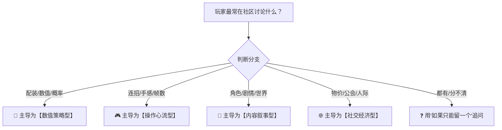
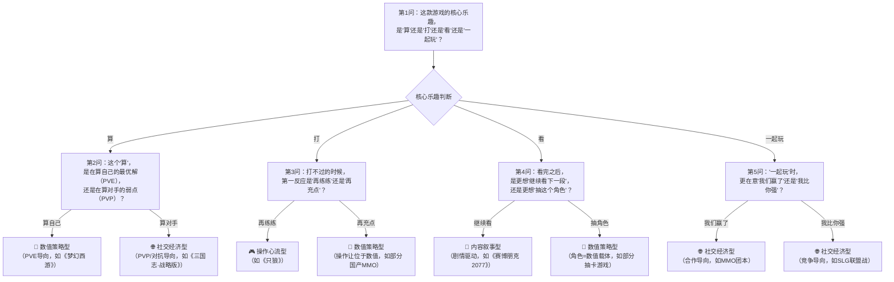

---
tags:
  - 游戏拆解
  - 底层驱动
  - 分类图谱
  - 方法论
---

**定位**：游戏类型的划分方式，决定了你拆解的视角和深度。按“美术风格”分（二次元/写实/像素）只能得到审美分析；按“玩法标签”分（RPG/FPS/SLG）只能得到功能清单。真正有价值的分类，是看**游戏用什么力量驱动玩家持续投入时间与注意力**——也就是“底层驱动”。这个文件回答三个问题：什么是底层驱动？四大底层驱动各自的核心特征是什么？如何快速判断一款游戏属于哪一类？理解这些，你就不会把《原神》和《魔兽世界》混为一谈，也不会用拆《只狼》的方法去拆《梦幻西游》。

**适用场景**：为任何一款游戏做首次分类定位、为拆解报告确定分析重心、横向对比时筛选同类竞品、判断一款新游的核心竞争力来源。

## 一、核心概念词典

### 1.1 什么是“底层驱动”？

**底层驱动**是游戏“让玩家停不下来”的根本动力来源——它回答的是：**玩家在游戏中获得的“爽感”主要来自哪里？**

注意区分：

| 混淆概念 | 与底层驱动的区别 |
|:---------|:-----------------|
| **题材/世界观**（中世纪/科幻/武侠） | 题材是“外衣”，驱动是“骨架”。同一套题材可以做成完全不同的驱动类型 |
| **玩法类型标签**（RPG/FPS/卡牌） | 标签是“形式”，驱动是“内核”。FPS可以是操作驱动（《CS:GO》），也可以是数值驱动（《命运2》的刷装）|
| **美术风格**（二次元/像素/写实） | 风格影响“谁会被吸引”，驱动影响“谁会被留住” |

**一句话判断法**：如果关掉美术、换掉题材、简化UI，游戏的“好玩”还在不在？剩下的那个东西，就是底层驱动。

### 1.2 四大底层驱动总览

| 驱动类型 | 核心体验 | 玩家心理 | 代表作品 |
|:---------|:---------|:---------|:---------|
| **🧮 数值策略型** | “算赢了” | 计算最优解、资源规划、概率博弈 | 《梦幻西游》《魔兽世界》《三国志·战略版》|
| **🎮 操作心流型** | “打爽了” | 反应速度、肌肉记忆、极限操作 | 《只狼》《英雄联盟》《王者荣耀》《崩坏3》|
| **📖 内容叙事型** | “沉浸了” | 情感共鸣、世界观探索、角色羁绊 | 《赛博朋克2077》《原神》《重返未来1999》|
| **🌐 社交经济型** | “我比你强 / 我们是一伙的” | 身份认同、权力结构、财富积累 | 《EVE Online》《逆水寒》手游 |

**重要说明**：现代头部游戏大多是**混合驱动**（如《原神》= 内容叙事驱动为主 + 数值策略驱动为辅）。分类的目的是**识别“主导引擎”**，而不是给游戏贴唯一标签。后续拆解时，以主导驱动确定分析重心，辅以其他维度补充观察。

### 1.3 类型一：数值策略型（🧮）

**一句话定义**：玩家玩的是“计算”——用最优的资源配置，在概率和数字的夹缝中找到最大收益。

**核心特征**：

| 维度 | 特征描述 |
|:-----|:---------|
| **爽感来源** | “算对了”的智力满足感，而非“反应快”的操作快感 |
| **核心动作** | 配队、配装、资源分配、概率计算、长期规划 |
| **时间颗粒度** | 决策周期长（按小时/天/周计算），单次操作的即时反馈弱 |
| **失败惩罚** | “亏了”——资源浪费、效率降低，而非“死了” |
| **运气成分** | 通常有随机数（暴击/掉率/抽卡），但高手通过策略对冲运气 |

**商业本质**：卖的是“数学期望”。玩家付费购买的是“更高的概率”或“更快的资源积累速度”。数值策划是这个类型游戏的“神”。

**检验清单**（满足3条以上即为强数值策略驱动）：
- [ ] 玩家社区讨论的核心是“配装/配队/技能组合”而非“操作技巧”
- [ ] 存在明确的“毕业”概念（数值达到某个阈值即通关）
- [ ] 战斗结果在出手前就已基本确定（操作无法逆转数值差距）
- [ ] 玩家会使用Excel或计算器辅助决策
- [ ] 有明确的资源循环系统（体力/金币/材料形成闭环）

**经典案例解析**：

| 游戏 | 数值策略的体现 | 拆解侧重点 |
|:-----|:---------------|:-----------|
| 《梦幻西游》 | 回合制战斗中，速度/伤害/抗性的精确计算决定胜负；宠物打书的概率博弈 | 数值曲线设计、随机数陷阱、经济系统对数值的调节 |
| 《魔兽世界》（团本） | DPS模拟、配装优化、团队增益覆盖率计算 | 职业平衡逻辑、首杀竞速中的数值天花板设计 |
| 《三国志·战略版》 | 战法搭配、兵种克制、战损比估算 | 配将逻辑、战损控制、平民与氪金的数值差距设计 |

**内部变异**：数值策略型还可以细分为：
- **纯数值型**（《梦幻西游》）：数值决定一切，操作空间极小
- **策略数值型**（《三国志·战略版》）：数值重要，但阵容搭配的策略权重也很高
- **概率数值型**（抽卡游戏）：核心是“期望值管理”，玩家在概率中做决策

### 1.4 类型二：操作心流型（🎮）

**一句话定义**：玩家玩的是“手感”——在毫秒级的反应和精确的肌肉记忆中，获得“我做到了”的掌控感。

**核心特征**：

| 维度 | 特征描述 |
|:-----|:---------|
| **爽感来源** | “操作出来了”的身体掌控感，而非“算对了”的智力满足 |
| **核心动作** | 走位、连招、格挡、瞄准、极限闪避、技能衔接 |
| **时间颗粒度** | 决策周期短（按帧/秒计算），单次操作的即时反馈极强 |
| **失败惩罚** | “死了”——即时挫败，但可以立刻重来 |
| **运气成分** | 极低。成败几乎完全取决于操作水平 |

**商业本质**：卖的是“公平竞技”或“挑战自我”。玩家付费购买的是“更多可操作角色/武器”（拓展操作空间），而非“数值碾压”（破坏操作体验）。少数品类（如氪金MMO）会卖数值，但核心玩家群体会迅速流失。

**检验清单**（满足3条以上即为强操作心流驱动）：
- [ ] 玩家社区讨论的核心是“连招/走位/帧数”而非“配装”
- [ ] 高手和新手使用同一套装备时，战斗力差异巨大
- [ ] 存在“练习模式”或“木桩”供玩家练手
- [ ] 竞技类游戏中，操作水平直接决定段位
- [ ] 玩家会讨论“手感”——前摇、后摇、硬直、打击感

**经典案例解析**：

| 游戏 | 操作心流的体现 | 拆解侧重点 |
|:-----|:---------------|:-----------|
| 《只狼》 | 拼刀节奏、危字攻击的识别与应对、弹反帧数（约0.2秒窗口） | 战斗手感设计、BOSS攻击模式的引导与反引导 |
| 《英雄联盟》 | 走A、技能连招、团战时的技能释放时机与站位 | 技能前摇/后摇设计、操作上限与下限的平衡 |
| 《王者荣耀》 | 技能指向、极限走位、团战入场时机 | 移动端操作简化策略、技能命中率的补偿机制 |
| 《崩坏3》 | 极限闪避触发时空断裂、QTE连招衔接 | 动作硬直与取消机制、触觉反馈设计 |

**内部变异**：操作心流型还可以细分为：
- **硬核操作型**（《只狼》《街霸》）：操作是唯一核心，几乎没有数值成长
- **操作+数值混合型**（《崩坏3》《原神》战斗）：操作可以提升上限，但数值决定下限
- **竞技操作型**（《英雄联盟》《王者荣耀》）：操作在与对手的对抗中产生价值

### 1.5 类型三：内容叙事型（📖）

**一句话定义**：玩家玩的是“体验”——进入一个世界，成为一个人物，经历一段故事，产生情感共鸣。

**核心特征**：

| 维度 | 特征描述 |
|:-----|:---------|
| **爽感来源** | “被触动了”——情感投入、审美愉悦、对角色和世界的依恋 |
| **核心动作** | 探索、对话、剧情推进、角色收集、拍照/观赏 |
| **时间颗粒度** | 节奏由叙事决定，有“章节”感；玩家按“一段故事”为单位体验 |
| **失败惩罚** | “出戏了”——沉浸感受到破坏，而非“输了” |
| **运气成分** | 极低。体验是设计好的，不以随机性为核心 |

**商业本质**：卖的是“情感体验”和“审美价值”。玩家付费购买的是“更多内容”（新角色/新地图/新剧情），而非“更强数值”。内容型游戏的“护城河”是工业化内容生产能力——米哈游的“每6周一个版本”就是典型案例。

**检验清单**（满足3条以上即为强内容叙事驱动）：
- [ ] 玩家社区讨论的核心是“角色/剧情/世界观”而非“数值/操作”
- [ ] 存在大量“非玩法”内容（角色故事、场景彩蛋、音乐、美术细节）
- [ ] 玩家会产生“云玩家”现象——不看攻略看“剧情剪辑”
- [ ] 角色的人设和故事比角色强度更能驱动付费
- [ ] 玩家会为“体验完整性”付费（如买断制单机游戏）

**经典案例解析**：

| 游戏 | 内容叙事的体现 | 拆解侧重点 |
|:-----|:---------------|:-----------|
| 《赛博朋克2077》 | 夜之城的沉浸感营造、角色支线的叙事深度、多结局的叙事逻辑 | 开放世界叙事引导、沉浸感破坏因素分析、叙事与玩法的融合/割裂 |
| 《原神》 | 提瓦特大陆的开放世界探索、角色传说任务、版本大事件的叙事节奏 | 内容更新节奏设计、角色塑造与付费转化、开放世界中的“叙事锚点” |
| 《重返未来1999》 | 英配腔调营造的复古神秘氛围、UI的胶片质感、神秘学主题的调性统一 | 审美调性如何替代玩法深度、垂直内容的沉浸感营造 |

**内部变异**：内容叙事型还可以细分为：
- **线性叙事型**（《赛博朋克2077》）：主线驱动，体验像“可互动电影”
- **开放世界探索型**（《原神》）：世界本身是故事的一部分，探索即叙事
- **角色驱动型**（《FGO》《重返未来1999》）：角色的个人故事是核心内容，主线相对较弱

### 1.6 类型四：社交经济型（🌐）

**一句话定义**：玩家玩的是“人和人的关系”——在虚拟社会中建立身份、积累财富、争夺权力、寻找归属。

**核心特征**：

| 维度 | 特征描述 |
|:-----|:---------|
| **爽感来源** | “被看见了”——社交认可、权力展示、群体归属、经济博弈 |
| **核心动作** | 交易、组队、公会战、聊天、炫耀、权力斗争 |
| **时间颗粒度** | 节奏由“社会事件”驱动（如攻城战、拍卖会），有强烈的周期性 |
| **失败惩罚** | “被孤立”或“破产”——社会地位的丧失，而非单次战斗失败 |
| **运气成分** | 取决于游戏设计，但社交/经济博弈本身是玩家之间的零和/正和博弈 |

**商业本质**：卖的是“社会地位”和“社交效率”。玩家付费购买的是“更快建立优势”或“更体面的社交身份”。社交型游戏的“护城河”是“网络效应”——你的朋友都在这里，你就很难离开。

**检验清单**（满足3条以上即为强社交经济驱动）：
- [ ] 玩家社区讨论的核心是“物价/公会/人际关系”而非“数值/操作/剧情”
- [ ] 游戏内有复杂的经济系统（玩家间交易、拍卖行、物价波动）
- [ ] 存在强制或强激励的多人协作内容（无法单机完成）
- [ ] 玩家会在游戏内形成“社会分层”（大佬/平民/商人等身份）
- [ ] 玩家的社交关系会显著影响留存率（朋友不玩了自己也不想玩）

**经典案例解析**：

| 游戏 | 社交经济的体现 | 拆解侧重点 |
|:-----|:---------------|:-----------|
| 《EVE Online》 | 完全玩家驱动的经济体系、星系主权战争、间谍与外交 | 经济系统自调节机制、大型联盟的组织结构、信任与背叛的游戏化 |
| 《逆水寒》手游 | 智能NPC模拟社交（AI陪聊）、MMO的轻量化组队、帮会竞争 | AI社交对真人社交的补充/替代、MMO社交减负设计、社交分层 |
| 《魔兽世界》（怀旧服） | 公会DKP制度、金团与G团、服务器声望 | 玩家自组织机制、分配制度的公平性设计、社交压力下的玩家行为 |

**内部变异**：社交经济型还可以细分为：
- **经济驱动型**（《EVE Online》《梦幻西游》经济系统）：核心是“赚钱和交易”
- **社交身份型**（《逆水寒》手游、《闪耀暖暖》社交圈）：核心是“被看见和被认可”
- **权力博弈型**（《率土之滨》《万国觉醒》）：核心是“联盟与征服”

### 1.7 混合驱动与主导驱动识别

现代头部游戏极少是“纯血”单一驱动。识别**主导驱动**的方法：**问自己，如果只能保留一个维度，哪个维度的流失会导致玩家彻底离开？**

**混合驱动案例分析**：

| 游戏 | 主导驱动 | 次要驱动 | 判断依据 |
|:-----|:---------|:---------|:---------|
| 《原神》 | 📖 内容叙事 | 🧮 数值策略 | 角色故事/地图探索是核心吸引力；数值（圣遗物/命座）是长线留存工具 |
| 《崩坏3》 | 🎮 操作心流 | 🧮 数值策略 | 操作决定上限，但数值决定能否进入高难本；两者权重接近 |
| 《魔兽世界》 | 🧮 数值策略 | 🌐 社交经济 | DPS模拟是核心循环，但公会/团队是维持长期游玩的社交黏合剂 |
| 《逆水寒》手游 | 🌐 社交经济 | 📖 内容叙事 | AI社交和帮会生态是核心，武侠剧情是吸引初始用户的“钩子” |

**识别流程图**（简易版）：
玩家最常在社区讨论什么？  

### 1.8 分类决策树（快速判断工具）
拿到一款新游戏，按以下流程快速分类：

## 二、商业场景还原

### 场景1：为新游做拆解前的分类定位

**背景**：一款新上线的二次元动作手游，包含抽卡养成+3D战斗+角色剧情。

**错误做法**：直接按“二次元动作手游”标签，套用所有拆解维度，导致报告冗长无重点。

**正确分类分析**：

| 问题 | 回答 | 判断 |
|:-----|:-----|:-----|
| 核心乐趣是“算”还是“打”？ | 战斗需要即时操作，闪避和连招决定胜负 | → 操作心流型倾向 |
| 打不过时，“再练练”还是“再充点”？ | 有体力限制，高难本需要特定角色/武器，氪金能明显降低难度 | → 数值策略型介入 |
| 社区讨论最多的内容是什么？ | 角色人设、剧情讨论、二创内容数量巨大 | → 内容叙事型介入 |

**最终判断**：**操作心流型 + 内容叙事型**混合驱动，其中**内容叙事是吸引用户的“钩子”**，**操作心流是留存用户的“骨架”**。拆解时重点分析：①角色塑造如何驱动付费；②操作手感如何平衡手残党与硬核玩家的体验。

### 场景2：竞品分析中的分类应用

**背景**：你的团队要做一款“类《原神》”产品，需要进行竞品分析。

**错误做法**：认为“做开放世界+抽卡=类原神”，然后全面对标。

**正确分类分析**：

《原神》的底层驱动是 **内容叙事型主导**，具体体现在：
- 每个版本新地图/新角色是用户回流的“大事件”
- 角色强度有差异，但玩家更愿意为“喜欢这个角色”付费
- 圣遗物数值系统存在，但社区讨论热度远低于角色/剧情

如果你的竞品要“对标原神”，但你的团队**不具备工业化内容生产能力**（每6周产出高质量新内容），则不应在内容叙事型维度对标。更适合的策略是：
- 在 **操作心流型** 维度建立差异化（更硬核的动作体验）
- 或在 **数值策略型** 维度建立差异化（更深的配队策略）

**结论**：分类分析不仅帮助你理解对手，更帮助你**发现差异化空间**。

### 场景3：长线运营中的驱动迁移

**背景**：一款游戏上线初期靠剧情口碑爆发，但一年后用户活跃度开始下滑。

**分析**：

| 阶段 | 主要驱动 | 用户特征 | 运营策略 |
|:-----|:---------|:---------|:---------|
| 上线期 | 📖 内容叙事 | 被世界观吸引，探索新鲜感强 | 集中资源做内容营销、剧情预热 |
| 成熟期 | 🧮 数值策略 | 内容消费完，开始研究配装/强度 | 引入赛季制、增加数值深度 |
| 衰退期 | 🌐 社交经济 | 核心用户靠“朋友还在玩”留存 | 强化公会系统、促进玩家社交绑定 |

**关键洞察**：游戏的生命周期中，底层驱动可能发生“迁移”——一款游戏不必永远以同一个驱动为核心。拆解时，建议按**版本阶段**标注驱动变化，而非一次性定性。

## 三、面试/实战中怎么用

### 3.1 面试中的分类思维展示

面试官问“你怎么看某款游戏”时，本质在考察你的**游戏分析框架**。以下回答结构可以展示你的分类思维：

| 步骤 | 示例话术 | 展示的能力 |
|:-----|:---------|:-----------|
| 先分类 | “我先给这款游戏做个分类。它的底层驱动是……” | 有分析框架，不凭感觉乱说 |
| 再定位 | “在这个驱动类型里，它的核心特征是……” | 理解品类规律，能识别标杆 |
| 后拆解 | “基于这个定位，我重点拆解三个方面……” | 分类指导分析，不平均用力 |
| 最后对比 | “相比同类型的《XXX》，它的差异在于……” | 有横向比较能力，能识别创新点 |

### 3.2 面试中常见的问题示例

| 问题 | 分类思维的应用 |
|:-----|:---------------|
| “你怎么看《王者荣耀》的成功？” | 先分类：操作心流型+社交经济型混合；再定位：MOBA品类的移动端操作简化为核心创新；后拆解：社交关系链是长线留存的关键 |
| “你觉得《原神》的核心竞争力是什么？” | 先分类：内容叙事型主导；再定位：工业化内容生产速度为护城河；后拆解：角色塑造与数值成长的平衡是付费模型的关键 |
| “如果让你做一个二次元游戏，你会怎么切入？” | 先分类：选择什么驱动作为主导；再定位：该驱动类型的关键成功要素是什么；后拆解：你的团队能力是否匹配这些要素 |

## 四、常见误区

| 误区 | 真相 |
|:-----|:-----|
| “一个游戏只能有一种驱动” | ❌ 现代头部游戏大多是混合驱动。关键是识别**主导驱动**，而非否认其他维度的存在 |
| “数值策略型=氪金游戏” | ❌ 数值策略型包含《魔兽世界》团本DPS模拟这样的硬核策略型游戏，氪金只是商业化手段，不是驱动本身 |
| “内容叙事型=单机游戏” | ❌ 《原神》是典型的内容叙事型，但它是服务型游戏（GaaS），持续更新内容是它的核心模式 |
| “操作心流型=硬核小众” | ❌ 《王者荣耀》是操作心流型，但它通过简化操作降低了门槛，说明驱动类型≠受众大小 |
| “分类就是为了贴标签” | ❌ 分类的目的是**确定分析重心**，而不是给游戏一个固定标签。同款游戏在不同版本可能驱动发生变化 |

## 五、实战自测题

- [ ] **分类判断**：以下游戏的主导底层驱动分别是什么？请说明理由。
  - （1）《英雄联盟》
  - （2）《FGO》（命运-冠位指定）
  - （3）《率土之滨》
  - （4）《赛尔号》（早期版本）
  - （5）《艾尔登法环》

- [ ] **混合驱动识别**：《暗黑破坏神：不朽》是一款包含刷装（数值）、操作走位（操作）、组队副本（社交）的游戏。你认为它的主导驱动是什么？判断依据是什么？

- [ ] **分类决策树应用**：你正在玩一款新游戏：进入后先选职业，然后做主线任务升级，战斗是回合制，但需要在限定时间内选择技能。装备有词条系统，需要配装。玩家社区最热门的帖子是“XX职业XX流派输出最高”。请问这款游戏最可能属于哪种底层驱动？

- [ ] **驱动迁移分析**：想想你玩过的一款游戏，它在上线初期、巅峰期、衰退期的主导驱动是否发生了变化？如果发生了变化，变化的原因是什么？

- [ ] **分类创新思考**：是否存在“四大驱动之外”的第五种底层驱动？如果有，会是什么？请尝试描述它的核心特征和一个可能的代表作品。

## 六、关联笔记

- [[90-2-1-1 拆解总索引_MOC]]（回到中央枢纽）
- [[90-2-1-3 拆解维度标准SOP]]（分类确定后，按此SOP执行具体拆解）
- [[90-2-1-4 【模板】单款游戏深度拆解卡片]]（按主导驱动选择拆解侧重点）
- [[90-2-1-5 【模板】横向对比分析报告]]（同驱动类型vs跨驱动类型对比）
- [[90-2-1-19 专题_付费心理学模型对比]]（不同驱动类型的付费模型差异）
- [[90-2-1-21 专题_社交结构金字塔]]（不同驱动类型的社交需求分层）