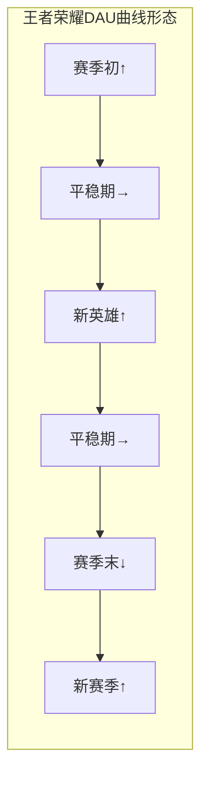
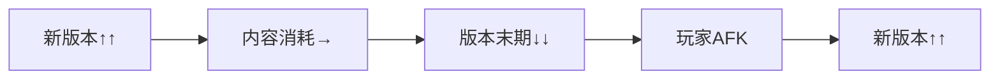
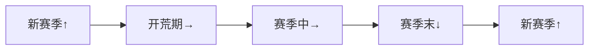
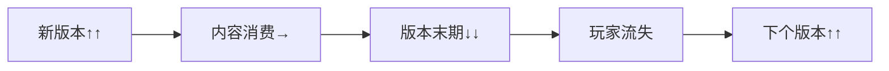
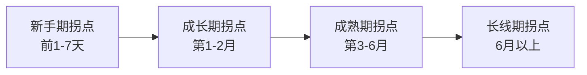

**定位**：单款游戏的拆解告诉我们“这款游戏好在哪”，而DAU曲线与弃坑拐点的横向对比回答的是“玩家什么时候走、为什么走”——以及“什么样的设计能让玩家留得更久”。本专题穿透已拆解的12款游戏，将它们的生命周期曲线和流失拐点放在同一张桌上对比，提炼出不同品类、不同驱动类型下的留存规律与流失预警信号。

**适用场景**：为新游戏设计留存机制时的参考框架、诊断一款游戏的流失问题出在哪个阶段、为面试准备“用户留存”类问题的回答弹药、评估一款游戏的“健康度”。

## 一、核心概念词典

### 1.1 什么是DAU曲线？

**DAU（Daily Active Users，日活跃用户数）** 是衡量一款游戏“每天有多少人在玩”的核心指标。DAU曲线的形态反映了游戏的生命周期阶段和用户粘性。

**关键概念**：

| 概念 | 定义 | 意义 |
|:-----|:-----|:-----|
| **DAU** | 当日登录游戏的独立用户数 | 游戏当前活跃规模的直接反映 |
| **MAU** | 月活跃用户数 | 游戏用户基数的规模 |
| **DAU/MAU** | 日活/月活比值 | 用户粘性指标，越高说明用户越“天天来” |
| **新增用户** | 当日首次登录的用户数 | 游戏获取新用户的能力 |
| **流失用户** | 连续N天未登录的用户 | 游戏失去用户的速度 |
| **次日留存** | 次日留存率 | 新手期体验质量的“第一道门” |
| **7日留存** | 第7天留存率 | 成长期体验质量的“第二道门” |
| **30日留存** | 第30天留存率 | 成熟期体验质量的“第三道门” |

**DAU曲线的典型形态**：

| 曲线形态 | 特征 | 代表游戏类型 | 健康度 |
|:---------|:-----|:-------------|:------:|
| **陡降型** | 上线首日冲高，快速回落 | 买量型、IP收割型 | ❌ 不健康 |
| **锯齿型** | 周期性波动，随版本起伏 | 服务型游戏 | ✅ 健康 |
| **阶梯型** | 逐级下降，但每次版本更新有回升 | 内容驱动型 | ✅ 较健康 |
| **平稳型** | 长期稳定，波动小 | 竞技类、社交类 | ✅ 非常健康 |
| **持续下降型** | 无回升的持续下滑 | 生命周期末期 | ❌ 预警 |

### 1.2 什么是弃坑拐点？

**弃坑拐点**是玩家在游戏过程中“决定离开”的关键时刻——通常不是“突然不想玩了”，而是一个累积的“最后一根稻草”。

**弃坑拐点的三种类型**：

| 类型 | 定义 | 特征 |
|:-----|:-----|:-----|
| **急性拐点** | 单次事件触发流失 | 一次失败的抽卡、一场不公平的对局、一次社交冲突 |
| **慢性拐点** | 累积疲劳触发流失 | 内容耗尽、重复感、目标缺失 |
| **结构性拐点** | 游戏本身变化触发流失 | 版本改动、商业化策略突变、团队解散 |

## 二、12款游戏的DAU曲线特征分析

### 2.1 按驱动类型的DAU曲线分类

#### 操作心流型：锯齿状稳态曲线

**代表游戏**：王者荣耀、英雄联盟

| 特征 | 说明 |
|:-----|:-----|
| **长期形态** | 高位锯齿状，赛季初/新英雄时脉冲上升 |
| **波动幅度** | 中（受赛季/新英雄影响） |
| **底部特征** | 稳定，极少断崖式下降 |
| **回归机制** | 新赛季重置、新英雄、赛事 |

**典型曲线示意**：

**规律**：操作心流型游戏的DAU曲线呈“锯齿状稳态”——有周期性波动（赛季/新英雄），但底部稳固。只要核心手感不被破坏，玩家的“游戏习惯”可以维持多年。

#### 社交经济型：大起大落型

**代表游戏**：魔兽世界、EVE Online、逆水寒手游

|特征|说明|
|---|---|
|**长期形态**|大版本/资料片时暴涨，版本末期暴跌|
|**波动幅度**|大（受新内容影响显著）|
|**底部特征**|有韧性（社交关系创造退出成本）|
|**回归机制**|新资料片、新赛季、好友召回|

**典型曲线示意**：

**规律**：社交经济型游戏的DAU曲线是“脉冲式”的——版本更新带来大规模回流，版本末期显著下滑。但社交关系提供了“退出成本”，让底部不会归零。大型会战、攻城战等“玩家自驱事件”也能创造脉冲。

#### 数值策略型：脉冲式+长衰减

**代表游戏**：梦幻西游、三国志战略版

| 特征       | 说明                |
| -------- | ----------------- |
| **长期形态** | 新赛季/新版本脉冲上升，赛季中缓降 |
| **波动幅度** | 中（赛季制创造固定节奏）      |
| **底部特征** | 韧性较强（养成投入+社交绑定）   |
| **回归机制** | 新赛季重置、新武将/新装备     |

**典型曲线示意**：

**规律**：数值策略型游戏的DAU曲线呈“周期脉冲”形态——赛季重置创造了固定的“回流脉冲”，赛季中段进入平稳期，赛季末段缓降。养成投入的“沉没成本”和同盟社交的“退出成本”让底部不会太低。

#### 内容叙事型：版本驱动型

**代表游戏**：原神、崩坏3、重返未来1999、赛博朋克2077（单机）

| 特征       | 说明               |
| -------- | ---------------- |
| **长期形态** | 版本更新时暴涨，版本末期显著下降 |
| **波动幅度** | 大（内容消耗速度决定）      |
| **底部特征** | 脆弱（无社交退出成本）      |
| **回归机制** | 新版本、新角色、新区域      |

**典型曲线示意**：

**规律**：内容叙事型游戏的DAU曲线是“内容驱动型脉冲”——每次版本更新都是回流高峰，但版本末期的“长草期”会导致显著流失。由于缺乏社交退出成本，流失后的回归完全依赖“下个版本内容是否足够吸引人”。

### 2.2 DAU曲线对比总览

| 游戏         | 曲线形态     | 波动幅度 | 底部韧性 | 回归引擎     | 长期趋势    |
| ---------- | -------- | ---- | ---- | -------- | ------- |
| 魔兽世界       | 脉冲式      | 大    | 高    | 新资料片     | 长尾缓慢下降  |
| 英雄联盟       | 锯齿状稳态    | 中    | 极高   | 新赛季/新英雄  | 长期稳定    |
| EVE Online | 脉冲式      | 大    | 高    | 新版本/战争   | 长尾缓慢下降  |
| 梦幻西游       | 脉冲式+长衰减  | 中    | 高    | 新资料片     | 长尾缓慢下降  |
| 三国志战略版     | 赛季脉冲     | 中    | 高    | 新赛季      | 长尾缓慢下降  |
| 王者荣耀       | 锯齿状稳态    | 中    | 极高   | 新赛季/新英雄  | 长期稳定    |
| 崩坏3        | 版本脉冲     | 大    | 中    | 新版本/新角色  | 缓慢下降    |
| 原神         | 版本脉冲     | 大    | 中    | 新版本/新区域  | 平稳略有波动  |
| 重返未来1999   | 版本脉冲     | 大    | 中    | 新版本/新角色  | 待观察     |
| 逆水寒手游      | 脉冲式+社交韧性 | 大    | 中高   | 新资料片/新赛季 | 平稳有波动   |
| 只狼         | 买断制单峰    | —    | 低    | 无（发售即巅峰） | 随时间自然衰减 |
| 赛博朋克2077   | 买断制多脉冲   | —    | 低    | DLC/动画   | 随时间自然衰减 |

## 三、弃坑拐点共性分析

### 3.1 弃坑拐点的“三阶段”规律

几乎所有游戏的弃坑拐点都可以分为三个阶段：

#### 第一阶段：新手期拐点（前1-7天）

**典型流失原因**：

|原因|说明|典型案例|
|---|---|---|
|**认知偏差**|宣传/商店页面的预期与实际玩法不符|《赛博朋克2077》首发、重返未来1999剧情门槛|
|**上手门槛过高**|新手引导不足，玩家“不知道怎么玩”|EVE Online、只狼|
|**社交断层**|有协作需求但组不到人|魔兽世界、梦幻西游|
|**审美排斥**|美术/音效风格与玩家偏好不符|赛博朋克2077暗黑场景|
|**操作不适**|操作方式/手感不符合预期|回合制玩家遇到即时制，反之亦然|

**预防设计**：

|设计|说明|典型案例|
|---|---|---|
|新手引导优化|渐进式引导，而非一次性灌输|原神冒险等级解锁|
|社交补偿|AI队友填充组队空缺|逆水寒手游AI亲友团|
|首日体验保障|确保前1小时有“爽感”|王者荣耀人机局|
|节奏可调|提供“节奏选择”或渐进加速|部分游戏的可选难度|

#### 第二阶段：成长期拐点（第1-2月）

**典型流失原因**：

|原因|说明|典型案例|
|---|---|---|
|**资源枯竭**|体力/资源用完后无事可做|原神树脂、重返未来1999体力|
|**卡关挫败**|无法突破当前难度/段位|只狼Boss、梦幻西游卡级|
|**抽卡失败**|抽不到核心角色/装备|原神、崩坏3、三国志战略版|
|**匹配/平衡问题**|对局体验不公平|王者荣耀ELO争议|
|**付费压力**|“不充钱就打不过”的感知|三国志战略版平民体验|

**预防设计**：

|设计|说明|典型案例|
|---|---|---|
|多轨成长|多条成长线并行，一条卡住另一条还能推进|梦幻西游、原神|
|保底机制|抽卡的确定性保障|原神90抽保底|
|段位保护|防止连续掉段的挫败感|王者荣耀段位保护卡|
|免费内容供给|不付费也能推进主线/探索|逆水寒手游、原神|
|体力优化|合理的体力恢复速度+储备机制|原神体力上限提升|

#### 第三阶段：成熟期拐点（第3-6月）

**典型流失原因**：

|原因|说明|典型案例|
|---|---|---|
|**内容耗尽**|“我什么都看过了”|原神版本末期、赛博朋克通关|
|**社交疲劳**|固定队/公会解体|魔兽世界、梦幻西游|
|**终局目标达成**|“已经毕业了”|原神深渊满星、梦幻满级|
|**版本同质化**|新内容缺乏新鲜感|三国志战略版赛季换皮|
|**商业化争议**|付费策略突变引发反感|重返未来1999三周年累充|

**预防设计**：

|设计|说明|典型案例|
|---|---|---|
|赛季重置|定期“归零”刷新目标|三国志战略版、王者荣耀|
|社交绑定|创造社交退出成本|魔兽世界公会、逆水寒AI门客|
|终局内容|超越“毕业”的持续目标|荣耀王者、速通、全收集|
|版本创新|每次更新有真正的新鲜感|原神新区域、魔兽新资料片|
|新角色/新机制|持续解锁新的玩法体验|崩坏3、原神、英雄联盟|

#### 第四阶段：长线期拐点（6月以上）

**典型流失原因**：

|原因|说明|典型案例|
|---|---|---|
|**团队/公会解散**|社交单元瓦解引发连锁流失|魔兽世界公会AFK|
|**投入贬值**|老角色/装备被淘汰|崩坏3退环境|
|**生活节奏变化**|玩家人生阶段变化|任何游戏|
|**信任崩塌**|商业化/运营策略突变|重返未来1999三周年|
|**新游吸引**|被竞品/新游戏转移注意力|所有游戏|

**预防设计**：

|设计|说明|典型案例|
|---|---|---|
|社交结构韧性|多层社交网络防止单点崩塌|梦幻西游（固定队+帮派+婚姻）|
|老内容保值|已投入资源的长期价值感|梦幻西游藏宝阁|
|信任维护|商业化策略的一致性|逆水寒“不卖数值”|
|版本期待|“下一个版本有重磅内容”|原神新国度预告|

### 3.2 不同驱动类型的拐点特征差异

|驱动类型|新手期拐点主因|成长期拐点主因|成熟期拐点主因|长线期拐点主因|
|---|---|---|---|---|
|**数值策略型**|学习门槛/认知偏差|抽卡失败/资源不足|内容耗尽/版本同质化|投入贬值/公会解散|
|**操作心流型**|手感不适/操作门槛|匹配/平衡问题|手感疲劳/段位卡住|团队解散/新游吸引|
|**内容叙事型**|剧情门槛/审美不适|内容消耗快|长草期/内容耗尽|情感耗尽/无新内容|
|**社交经济型**|社交断层/孤岛感|社交圈不匹配|团队解体/目标缺失|社交结构崩塌|

## 四、关键规律提炼

### 4.1 规律一：新手期流失主因是“预期-体验落差”

**现象**：所有游戏的新手期流失，核心原因是“玩家进来之前以为的”和“玩到之后实际体验的”之间的差距。

|落差类型|说明|典型案例|
|---|---|---|
|玩法落差|以为是动作游戏，结果是回合制|玩家3（分析题）|
|视角落差|以为是单角色ARPG，结果是卡牌|玩家3（分析题）|
|节奏落差|以为是快节奏，结果节奏慢|玩家2（分析题）|
|审美落差|宣传画面与实机画面不符|赛博朋克2077首发|
|社交落差|宣传“多人热闹”，实际“组不到人”|玩家1（分析题）|

**设计原则**：广告/宣传素材应真实反映游戏的核心玩法。过高的预期在短期内提升下载量，但会在新手期造成更严重的流失。

### 4.2 规律二：成长期流失主因是“挫败感的累积”

**现象**：第1-2月的流失不是“一次事件”导致的，而是多次挫败的累积。

**挫败感的三种来源**：

|来源|说明|典型案例|
|---|---|---|
|**概率挫败**|抽卡失败、强化失败、刷不到想要的东西|原神圣遗物、梦幻打书|
|**匹配挫败**|连续遇到不公平对局|王者荣耀ELO争议|
|**社交挫败**|组不到人、被排斥、团队不配合|魔兽世界新手组队|

**设计原则**：在成长期，游戏应提供“确定性”的成长路径——至少有1-2条成长线是“只要花时间就一定能提升”的，而不是所有路径都依赖概率。

### 4.3 规律三：成熟期流失主因是“终局目标的缺失”

**现象**：当玩家达成当前版本的“终局目标”后，如果没有新的目标接续，就会进入“不知道干什么”的状态。

|终局目标类型|达成后的状态|典型案例|
|---|---|---|
|数值型终局|“我已经毕业了”|梦幻西游满级、原神深渊满星|
|内容型终局|“故事看完了”|赛博朋克通关、重返未来主线|
|段位型终局|“已经到王者了”|王者荣耀荣耀王者|
|收集型终局|“全都收集完了”|原神全图鉴|

**设计原则**：终局内容的设计应超越“可完成”的目标，创造“永远有下一步”的持续动机。赛季重置、新角色、新区域、新段位都是有效的“终局续命”手段。

### 4.4 规律四：社交退出成本是长线留存的核心壁垒

**现象**：含强社交结构的游戏（魔兽世界、梦幻西游、王者荣耀、逆水寒手游）的长线留存率显著高于纯单机游戏（只狼、赛博朋克、重返未来1999）。

|游戏|社交结构强度|长线留存表现|
|---|---|---|
|只狼|无|通关后迅速流失|
|赛博朋克2077|无|通关后迅速流失|
|重返未来1999|无|版本间流失显著|
|原神|弱|版本间流失显著|
|崩坏3|弱|版本间流失显著|
|王者荣耀|强|长期稳定|
|魔兽世界|极强|20年长尾|
|梦幻西游|极强|20年长尾|

**规律**：社交退出成本是长线留存最有效的壁垒。“我的朋友在这里”比任何游戏内容都更能留住玩家。

**设计启示**：如果一款游戏希望实现5年以上的长线运营，社交结构不是“可选项”，而是“必选项”。即使是内容驱动型游戏（如原神），也在逐步加强社交元素（尘歌壶、联机副本）——这证明了社交结构对长线留存的必要性。

### 4.5 规律五：“赛季重置”是最简洁的长线留存工具

**现象**：三国志战略版、王者荣耀、逆水寒手游、崩坏3、原神等游戏都采用赛季/版本重置机制来创造“重新开始”的动机。

|游戏|重置周期|重置内容|留存效果|
|---|---|---|---|
|三国志战略版|2-3个月|城建/资源归零，武将保留|极高|
|王者荣耀|3个月|段位归零|极高|
|逆水寒手游|3-4个月|段位/养成进度重置|高|
|原神|42天|深渊重置+新版本|高|
|崩坏3|42天|深渊/战场重置|中高|

**规律**：“赛季重置”不需要开发新内容，只需要“归零”玩家的部分进度，就能创造“重新开始”的动机。这是成本最低、效果最好的长线留存工具。

**关键设计要点**：

- 重置≠清零：保留部分资产（武将/皮肤/角色），重置“可重复获得”的内容（段位/城建/资源）
    
- 重置创造动机：让玩家从“我已经毕业了”回到“我又可以重新开始了”
    
- 重置配套新内容：赛季重置+新内容/新角色是最强组合拳
    

## 五、设计原则总结

### 5.1 各阶段留存设计要点

|阶段|核心目标|关键设计|典型案例|
|---|---|---|---|
|**新手期（前7天）**|降低预期落差|真实宣传、渐进引导、首日爽感|王者荣耀人机局、逆水寒自由选择|
|**成长期（第1-2月）**|管理挫败感|保底机制、多轨成长、组队保障|原神90抽保底、梦幻多线养成|
|**成熟期（第3-6月）**|持续供给目标|赛季重置、终局内容、社交绑定|三国志战略版赛季、魔兽公会|
|**长线期（6月以上）**|创造退出成本|社交网络、资产保值、持续期待|梦幻藏宝阁、逆水寒AI门客|

### 5.2 通用留存设计原则

|原则|说明|风险提示|
|---|---|---|
|**降低新手期门槛**|前1小时的体验决定了“是否留下”|门槛过低可能导致核心玩家觉得“太简单”|
|**管理概率挫败**|确保至少50%的成长路径是“确定性”的|全部依赖概率的成长路径会加速流失|
|**赛季重置创造动机**|定期归零部分进度，创造“重新开始”|重置过多会让玩家觉得“投入白费”|
|**社交创造退出成本**|让玩家“不是一个人离开”|强制社交会排斥社恐玩家|
|**持续内容供给**|让玩家永远有“下个版本”的期待|内容质量下降会加速流失|

## 六、总结

### 6.1 核心结论

1. **弃坑不是“瞬间决定”的，而是“累积疲劳+最后一根稻草”的结果**：理解玩家流失的关键是找到“疲劳累积”的节点和“最后一根稻草”的类型。
    
2. **不同驱动类型的流失拐点不同**：数值策略型的关键拐点在“抽卡失败”和“资源枯竭”；操作心流型的关键拐点在“匹配/平衡”和“手感疲劳”；内容叙事型的关键拐点在“内容耗尽”和“长草期”；社交经济型的关键拐点在“社交链断裂”。
    
3. **新手期流失主因是“预期-体验落差”**：广告/宣传的真实性是新手期留存的第一道防线。
    
4. **“社交退出成本”是长线留存最有效的壁垒**：有强社交结构的游戏长线留存率显著高于纯单机游戏。社交结构不是“可选项”，而是“必选项”。
    
5. **“赛季重置”是最简洁的长线留存工具**：不需要开发新内容，只需要“归零”部分进度，就能创造“重新开始”的动机。
    
6. **保底机制是抽卡型游戏的信任底线**：90-140抽是行业黄金区间，超过200抽会显著降低付费意愿和留存率。
    

### 6.2 各品类留存设计侧重点

|品类|重点投入的留存设计|需警惕的流失风险|
|---|---|---|
|**数值策略型**|赛季重置、多轨成长、保底机制|概率挫败积累→弃坑|
|**操作心流型**|匹配公平性、新英雄/新机制、段位目标|匹配/平衡争议→弃坑|
|**内容叙事型**|版本更新节奏、终局内容延展、角色塑造|长草期过长→弃坑|
|**社交经济型**|社交结构韧性、赛季重置、资产保值|社交链断裂→连锁流失|

### 6.3 可迁移的留存设计清单

**新手期**：前1小时有明确的“爽感”体验（无论是什么驱动类型）
**新手期**：新手引导是“渐进式”的，不是“一次性灌输"
**成长期**：至少有1-2条“确定性”的成长路径（不依赖概率）
**成长期**：有保底机制覆盖核心概率内容（抽卡/掉落/打造）
**成熟期**：有赛季/版本重置机制创造“重新开始”的动机
**成熟期**：有社交结构创造“退出成本”（朋友/公会/战队）
**成熟期**：终局内容超越“可完成”的目标（荣耀王者/全收集/速通）
**长线期**：有持续内容供给计划（已公布未来1-3年路线图）
**全周期**：商业化策略保持一致性，避免突然转向

## 七、关联笔记

- [[90-2-1-1 拆解总索引_MOC]]
- [[90-2-1-3 拆解维度标准SOP#1.7 第5层：长线留存机制]]
- [[90-2-1-19 专题_付费心理学模型对比]]（付费与留存的关系）
- [[90-2-1-21 专题_社交结构金字塔]]（社交退出成本与留存的关系）
- [[90-2-1-22 专题_赛季制与版本更新节奏研究]]（赛季重置与留存的关系）
- [关联的具体游戏拆解卡片：7-18号全部涉及留存章节]