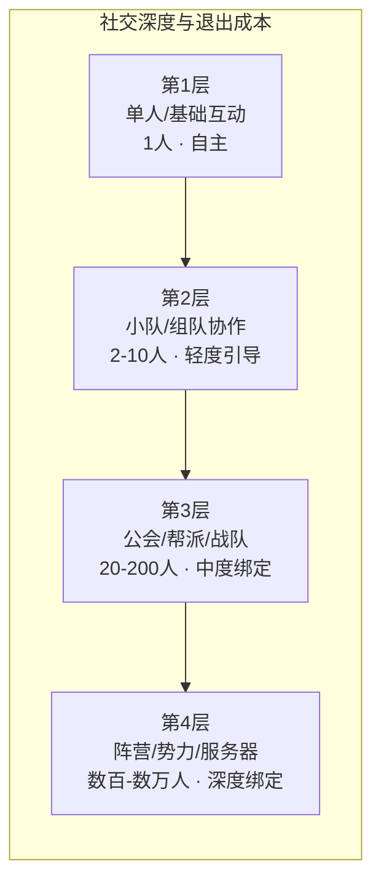
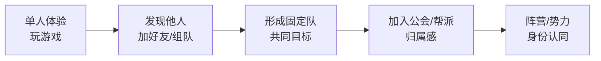

---
tags:
  - 游戏拆解
  - 专题研究
  - 社交结构
  - 横向穿刺
---

**定位**：单款游戏的拆解告诉我们“这款游戏的社交系统长什么样”，而社交结构金字塔的横向对比回答的是“玩家的社交关系如何从浅到深逐层建立”——以及“什么样的社交设计能创造退出成本、什么样的社交设计只是摆设”。本专题穿透已拆解的12款游戏，将它们的社交结构放在同一张桌上对比，提炼出不同品类、不同驱动类型下的社交设计规律与核心原则。

**适用场景**：为新产品设计社交系统时的参考框架、诊断一款游戏的社交结构是否健康、理解“强制社交”与“自愿社交”的边界、为面试准备“社交系统设计”类问题的回答弹药。

## 一、核心概念词典

### 1.1 什么是社交结构金字塔？

**社交结构金字塔**是分析游戏如何组织和定义玩家之间关系的框架——它不关心“有多少好友功能”，而关心“玩家的社交关系如何从浅到深逐层建立”。

**金字塔的四层模型**：

|层级|名称|人数规模|互动形式|强制程度|退出成本|
|---|---|---|---|---|---|
|第1层|单人/基础互动|1人|好友/关注/点赞|完全自主|极低|
|第2层|小队/组队协作|2-10人|组队/联机/语音|轻度引导|低|
|第3层|公会/帮派/战队|20-200人|公会任务/领地战/联赛|中度绑定|中|
|第4层|阵营/势力/服务器|数百-数万人|联盟/外交/国战|高度强制|极高|

**核心洞察**：社交结构越深，玩家的退出成本越高。“我的朋友在这里”比任何游戏内容都更能留住玩家——这是社交结构对长线留存的核心价值。

### 1.2 社交结构的“两种驱动力”

|驱动力类型|定义|特征|典型案例|
|---|---|---|---|
|**功能性社交**|为了“效率”而社交|组队效率更高、副本能打过、资源获取更快|魔兽世界公会团、梦幻西游固定队|
|**情感性社交**|为了“人”而社交|和谁玩比玩什么更重要|王者荣耀开黑、逆水寒AI门客|

### 1.3 社交结构的“强制-自主”光谱

|光谱位置|定义|特征|典型案例|
|---|---|---|---|
|**强制社交**|核心内容必须组队完成|玩家别无选择|魔兽世界团本、梦幻西游副本|
|**引导社交**|组队有额外收益但不强制|玩家有选择余地|原神联机副本、王者荣耀组排|
|**自愿社交**|社交完全可选|玩家可完全单机|逆水寒手游、重返未来1999|
|**无社交**|没有任何社交功能|纯单机体验|只狼、赛博朋克2077|

## 二、12款游戏的社交结构深度对比

### 2.1 社交层级总览矩阵

|游戏|第1层|第2层|第3层|第4层|社交驱动力|强制程度|退出成本|
|---|---|---|---|---|---|---|---|
|**魔兽世界**|✅|✅|✅|✅|功能+情感|中度强制|极高|
|**只狼**|✅|❌|❌|❌|无|无社交|极低|
|**英雄联盟**|✅|✅|✅|✅|功能+情感|轻度引导|高|
|**赛博朋克2077**|✅|❌|❌|❌|无|无社交|极低|
|**EVE Online**|✅|✅|✅|✅|功能+情感|高度强制|极高|
|**梦幻西游**|✅|✅|✅|✅|功能+情感|中度强制|极高|
|**三国志战略版**|✅|✅|✅|✅|功能+情感|中度强制|高|
|**王者荣耀**|✅|✅|✅|✅|功能+情感|轻度引导|极高|
|**崩坏3**|✅|✅|❌|❌|效率|轻度引导|低|
|**原神**|✅|✅|❌|❌|效率|轻度引导|中|
|**重返未来1999**|✅|❌|❌|❌|无|无社交|极低|
|**逆水寒手游**|✅|✅|✅|❌|功能+情感|自主选择|高|

### 2.2 按驱动类型的社交结构聚类

#### 数值策略型：深度社交结构

**代表游戏**：魔兽世界、梦幻西游、三国志战略版

|特征|说明|
|---|---|
|**社交层级**|4层完整|
|**强制程度**|中度-高度（核心内容必须组队）|
|**社交驱动力**|功能性为主（组队效率高）+ 情感性为辅|
|**退出成本**|极高（公会+固定队+社交契约）|
|**典型设计**|DKP/G团制度、同盟外交|

**核心规律**：数值策略型游戏的社交结构是“功能性社交”——玩家社交的主要动机是“组队效率更高”和“能打更高难度内容”。这种社交虽然以“效率”为起点，但长期会转化为“情感性社交”。

#### 操作心流型：深度社交结构

**代表游戏**：英雄联盟、王者荣耀

|特征|说明|
|---|---|
|**社交层级**|4层完整（含赛事体系）|
|**强制程度**|轻度引导（组队有优势但不强制）|
|**社交驱动力**|情感性为主（开黑的乐趣）+ 功能性为辅|
|**退出成本**|极高（朋友都在玩）|
|**典型设计**|好友关系链、开黑车队|

**核心规律**：操作心流型游戏的社交结构是“情感性社交”——玩家社交的主要动机是“和朋友一起玩更好玩”。熟人关系链是最强的退出成本。

#### 内容叙事型：浅层社交结构

**代表游戏**：崩坏3、原神、重返未来1999、赛博朋克2077、只狼

|特征|说明|
|---|---|
|**社交层级**|1-2层（单机为主，轻度联机）|
|**强制程度**|自愿（完全不强制）|
|**社交驱动力**|无或极弱|
|**退出成本**|极低（无社交绑定）|
|**典型设计**|联机副本（可选）、无公会系统|

**核心规律**：内容叙事型游戏的社交结构是“弱社交”或“无社交”——玩家体验的核心是“个人沉浸”，社交反而可能破坏沉浸感。这种设计的代价是“退出成本极低”。

#### 社交经济型：多元化社交结构

**代表游戏**：EVE Online、逆水寒手游

|特征|说明|
|---|---|
|**社交层级**|2-4层（因游戏而异）|
|**强制程度**|因游戏而异（EVE强制，逆水寒自主）|
|**社交驱动力**|功能+情感混合|
|**退出成本**|因游戏而异（EVE极高，逆水寒高）|
|**典型设计**|军团-联盟、AI社交+真人社交|

**核心规律**：社交经济型游戏的社交结构最复杂——既有“功能性社交”（经济生产、领土争夺），也有“情感性社交”（帮会归属、AI门客陪伴）。社交结构的深度决定了退出成本的高度。

## 三、关键规律提炼

### 3.1 规律一：社交结构与退出成本高度正相关

**现象**：社交结构越深的游戏，玩家的退出成本越高，长线留存越稳定。

|社交深度|代表游戏|退出成本|长线留存表现|
|---|---|---|---|
|**4层完整**|魔兽世界、EVE、梦幻西游|极高|10-20年长尾|
|**3-4层**|王者荣耀、英雄联盟|极高|10年+稳定|
|**3-4层**|三国志战略版|高|5年+稳定|
|**2层**|原神、崩坏3|中|版本间波动|
|**1层（无社交）**|只狼、赛博朋克|极低|通关即走|

**规律**：社交结构是长线留存最有效的“退出成本制造机”。玩家留下的原因不是“游戏好玩”，而是“我的朋友在这里”。

**可验证结论**：如果一款游戏希望实现5年以上的长线运营，社交结构至少需要达到3层（包含公会/帮派层级）。只有1-2层社交结构的游戏，天然面临“版本间流失”的困境。

### 3.2 规律二：社交结构的“路径依赖”

**现象**：玩家的社交关系不是“一步到位”的，而是逐层递进的。

**社交深化路径**：

**关键节点**：

|节点|转化条件|关键设计|
|---|---|---|
|单人→组队|单人内容不足以满足需求|副本/团本需要组队|
|组队→固定队|协作默契、固定时间|固定队功能、好友系统|
|固定队→公会|需要更大组织归属|公会系统、公会活动|
|公会→阵营|需要更大规模对抗|阵营系统、国战/势力战|

**规律**：社交结构的设计应遵循“逐层递进”的逻辑——玩家先体验单人内容，然后在需要时进入组队，再逐渐形成固定队和公会归属。跳过中间层直接强制社交，会导致社恐玩家的流失。

### 3.3 规律三：“强制社交”与“社恐友好”的平衡

**现象**：不同游戏在“强制社交”和“社恐友好”之间选择了不同的位置。

|光谱位置|代表游戏|设计逻辑|受众|
|---|---|---|---|
|**强制社交**|魔兽世界、EVE|核心内容必须组队|社交型玩家|
|**引导社交**|王者荣耀、原神|组队有收益但不强制|混合型玩家|
|**自主社交**|逆水寒手游|AI队友替代真人|社恐友好+社交可选|
|**无社交**|只狼、重返未来1999|完全单机|纯单机玩家|

**规律**：MMO向“社恐友好”进化的趋势正在发生。逆水寒手游“单人可打团本”的设计证明，即使是MMO也可以不完全依赖强制社交——AI队友可以填补组队空缺。

**设计启示**：社交结构设计应考虑“最小社交需求”——确保玩家在找不到队友时依然能推进核心内容（通过AI队友、匹配系统等），而不是强制玩家必须社交。

### 3.4 规律四：AI社交是社交结构的“补充层”而非“替代层”

**现象**：逆水寒手游的AI NPC、AI门客和原神的弱联机系统证明，AI可以成为社交结构的有效补充。

|AI社交形式|代表游戏|作用|是否替代真人社交|
|---|---|---|---|
|AI队友（副本）|逆水寒手游|填补组队空缺|否（可选）|
|AI NPC互动|逆水寒手游|创造“有人陪”的感觉|否（补充）|
|AI门客|逆水寒手游|情感陪伴|否（补充）|
|AI分身（好友离线）|逆水寒手游|好友不在线时的替代|否（补充）|

**规律**：AI社交的作用是“降低社交门槛”而非“取消社交”——社恐玩家可以先和AI互动，再逐渐过渡到真人社交。

**可验证结论**：AI社交目前无法替代真人社交的核心价值（情感连接、退出成本），但可以作为“社交缓冲”降低新手期和社恐玩家的流失率。

### 3.5 规律五：赛事/职业体系是社交结构的“终极形态”

**现象**：英雄联盟、王者荣耀、魔兽世界等游戏的职业赛事体系，将游戏社交从“游戏内”延伸到了“游戏外”。

|游戏|赛事体系|社交影响|
|---|---|---|
|英雄联盟|全球总决赛、各大赛区联赛|战队粉丝身份认同|
|王者荣耀|KPL职业联赛|战队粉丝身份认同|
|魔兽世界|首杀竞速、MDI|首杀公会粉丝|
|EVE Online|无官方赛事（玩家自组织）|联盟政治博弈|

**规律**：赛事/职业体系将“玩这款游戏的人”分化为“玩游戏的玩家”和“看比赛的观众”——后者虽然不玩游戏，但仍然是游戏IP的“社交受众”。

**设计启示**：如果游戏具备竞技性，赛事体系不仅是推广手段，更是社交结构的“第四层”——它让玩家在游戏之外找到了身份认同和社交归属。

## 四、社交结构的设计工具包

### 4.1 社交层级设计检查清单

|检查项|说明|优先级|
|---|---|---|
|[ ] 玩家是否能“单人完整体验”核心内容？|社恐玩家不强制社交|高|
|[ ] 是否有“组队”功能让玩家自主选择？|功能性社交入口|高|
|[ ] 是否有“好友系统”固化社交关系？|从一次组队到长期好友|高|
|[ ] 是否有“固定队/结义”深化社交关系？|小团队归属感|中|
|[ ] 是否有“公会/帮派/战队”创造归属感？|中型组织认同|中|
|[ ] 是否有“公会/帮派活动”强化集体目标？|共同目标创造凝聚力|中|
|[ ] 是否有“阵营/势力”创造大规模对抗？|大型组织身份认同|低（视品类）|
|[ ] 是否有“社交身份”的可见性设计？|排行榜/段位/公会名称|高|
|[ ] 是否有“社交退出成本”的设计？|公会对战/帮派联赛|高|
|[ ] 是否有“AI社交”作为社交缓冲？|社恐玩家的过渡方案|低（视品类）|

### 4.2 各品类的社交结构推荐

|品类|推荐社交深度|关键设计|需规避的设计|
|---|---|---|---|
|**数值策略型MMO**|4层|公会团本、DKP/G团、阵营对抗|强制社交但无社交工具|
|**操作心流型竞技**|3-4层|开黑车队、战队系统、赛事体系|强制社交但无好友导入|
|**内容叙事型**|1-2层|联机副本（可选）、好友展示|强制社交破坏沉浸|
|**社交经济型**|3-4层|军团-联盟、AI社交+真人社交|完全强制社交无替代方案|

### 4.3 社交退出成本设计要点

|设计要点|说明|典型案例|
|---|---|---|
|**公会对战/帮派联赛**|让“公会赢”成为集体目标|魔兽世界公会团、三国志战略版同盟战|
|**公会等级/科技绑定**|个人利益与公会利益绑定|梦幻西游帮派技能|
|**固定队/结义系统**|让“队友需要我”成为责任|梦幻西游固定队、逆水寒结义|
|**社交身份可见**|公会被铭刻在名字前缀|所有含公会系统的游戏|
|**赛事/战队粉丝**|让“我支持XX战队”成为身份|英雄联盟、王者荣耀|
|**AI门客情感绑定**|让“我的AI朋友在这里”成为理由|逆水寒手游|

## 五、总结

### 5.1 核心结论

1. **社交结构是长线留存最有效的“退出成本制造机”**：玩家留下的原因不是“游戏好玩”，而是“我的朋友在这里”。4层完整社交结构的游戏长线留存表现显著优于1-2层的游戏。
    
2. **社交结构的建设遵循“路径依赖”**：玩家的社交关系从单人→组队→固定队→公会→阵营逐层递进，跳过中间层直接强制社交会导致流失。
    
3. **“强制社交”与“社恐友好”的平衡是社交设计的核心挑战**：逆水寒手游“单人可打团本+AI队友”的设计证明，AI可以成为社交结构的有效补充而非替代。
    
4. **AI社交是补充层，不是替代层**：AI不能替代真人社交的核心价值（情感连接、退出成本），但可以降低社交门槛，减少新手期流失。
    
5. **赛事/职业体系是社交结构的“第四层”**：它将游戏社交从“游戏内”延伸到“游戏外”，创造了战队粉丝身份认同和长期社交归属。
    

### 5.2 可迁移的社交设计要点

1. **分层递进设计**：社交关系应遵循“单人→组队→固定队→公会→阵营”的递进路径
    
2. **最小社交保障**：确保找不到队友时依然能推进核心内容（AI队友/匹配系统）
    
3. **社交身份可见**：公会名称、段位、头衔在游戏内清晰可见
    
4. **社交退出成本**：公会对战、帮派联赛、固定队机制创造退出成本
    
5. **AI社交缓冲**：AI队友/AI门客降低社交焦虑，作为真人社交的过渡
    

## 六、关联笔记

- [[90-2-1-1 拆解总索引_MOC]]
- [[90-2-1-3 拆解维度标准SOP#1.6 第4层：社交结构]]
- [[90-2-1-4 【模板】单款游戏深度拆解卡片#六、第4层：社交结构]]
- [[90-2-1-20 专题_DAU曲线与弃坑拐点分析]]（社交退出成本与留存的关系）
- [关联的具体游戏拆解卡片：7-18号全部涉及社交结构章节]